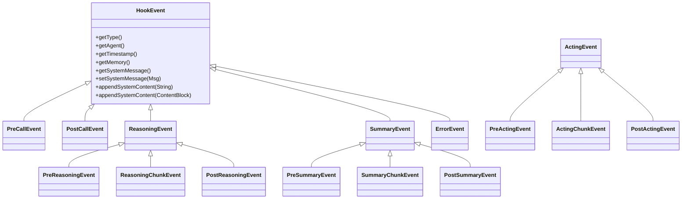
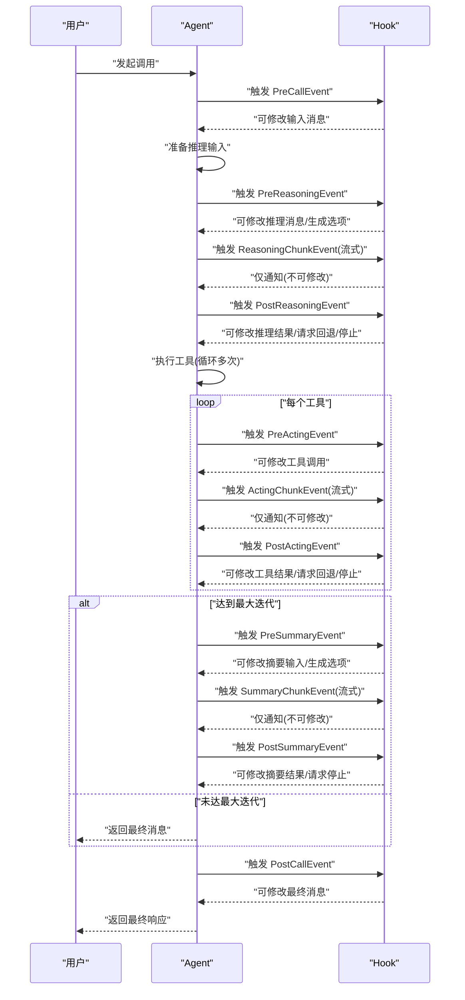
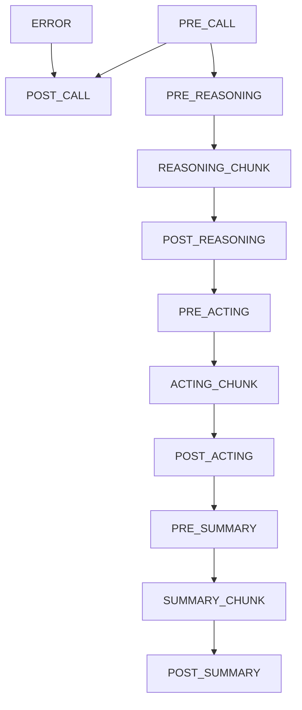

# 事件系统

<cite>
**本文引用的文件**
- [HookEvent.java](file://agentscope-core/src/main/java/io/agentscope/core/hook/HookEvent.java)
- [PreCallEvent.java](file://agentscope-core/src/main/java/io/agentscope/core/hook/PreCallEvent.java)
- [PostCallEvent.java](file://agentscope-core/src/main/java/io/agentscope/core/hook/PostCallEvent.java)
- [ReasoningEvent.java](file://agentscope-core/src/main/java/io/agentscope/core/hook/ReasoningEvent.java)
- [PreReasoningEvent.java](file://agentscope-core/src/main/java/io/agentscope/core/hook/PreReasoningEvent.java)
- [ReasoningChunkEvent.java](file://agentscope-core/src/main/java/io/agentscope/core/hook/ReasoningChunkEvent.java)
- [PostReasoningEvent.java](file://agentscope-core/src/main/java/io/agentscope/core/hook/PostReasoningEvent.java)
- [ActingEvent.java](file://agentscope-core/src/main/java/io/agentscope/core/hook/ActingEvent.java)
- [PreActingEvent.java](file://agentscope-core/src/main/java/io/agentscope/core/hook/PreActingEvent.java)
- [ActingChunkEvent.java](file://agentscope-core/src/main/java/io/agentscope/core/hook/ActingChunkEvent.java)
- [PostActingEvent.java](file://agentscope-core/src/main/java/io/agentscope/core/hook/PostActingEvent.java)
- [SummaryEvent.java](file://agentscope-core/src/main/java/io/agentscope/core/hook/SummaryEvent.java)
- [PreSummaryEvent.java](file://agentscope-core/src/main/java/io/agentscope/core/hook/PreSummaryEvent.java)
- [SummaryChunkEvent.java](file://agentscope-core/src/main/java/io/agentscope/core/hook/SummaryChunkEvent.java)
- [PostSummaryEvent.java](file://agentscope-core/src/main/java/io/agentscope/core/hook/PostSummaryEvent.java)
- [ErrorEvent.java](file://agentscope-core/src/main/java/io/agentscope/core/hook/ErrorEvent.java)
- [HookEventType.java](file://agentscope-core/src/main/java/io/agentscope/core/hook/HookEventType.java)
</cite>

## 目录
1. [简介](#简介)
2. [项目结构](#项目结构)
3. [核心组件](#核心组件)
4. [架构总览](#架构总览)
5. [详细组件分析](#详细组件分析)
6. [依赖关系分析](#依赖关系分析)
7. [性能考量](#性能考量)
8. [故障排查指南](#故障排查指南)
9. [结论](#结论)
10. [附录](#附录)

## 简介
本文件系统化梳理 AgentScope Java Hook 事件体系，覆盖推理事件、行动事件、调用事件与摘要事件的类型、触发时机、参数语义、可修改性与只读性、典型使用场景及最佳实践。文档以“可修改性”为主线，帮助开发者在合适的事件阶段注入或调整上下文，实现从输入消息到最终输出的全链路可观测与可控。

## 项目结构
事件系统位于 agentscope-core 模块的 hook 包中，采用分层设计：顶层抽象 HookEvent 提供统一的系统消息与通用上下文；按阶段进一步细分为三类事件族：
- 调用事件族：PreCallEvent、PostCallEvent
- 推理事件族：ReasoningEvent（含 PreReasoningEvent、ReasoningChunkEvent、PostReasoningEvent）
- 行动事件族：ActingEvent（含 PreActingEvent、ActingChunkEvent、PostActingEvent）
- 摘要事件族：SummaryEvent（含 PreSummaryEvent、SummaryChunkEvent、PostSummaryEvent）
- 错误事件：ErrorEvent

图表来源
- [HookEvent.java:74-75](file://agentscope-core/src/main/java/io/agentscope/core/hook/HookEvent.java#L74-L75)
- [PreCallEvent.java:44-80](file://agentscope-core/src/main/java/io/agentscope/core/hook/PreCallEvent.java#L44-L80)
- [PostCallEvent.java:42-76](file://agentscope-core/src/main/java/io/agentscope/core/hook/PostCallEvent.java#L42-L76)
- [ReasoningEvent.java:42-43](file://agentscope-core/src/main/java/io/agentscope/core/hook/ReasoningEvent.java#L42-L43)
- [PreReasoningEvent.java:47-116](file://agentscope-core/src/main/java/io/agentscope/core/hook/PreReasoningEvent.java#L47-L116)
- [ReasoningChunkEvent.java:60-106](file://agentscope-core/src/main/java/io/agentscope/core/hook/ReasoningChunkEvent.java#L60-L106)
- [PostReasoningEvent.java:51-172](file://agentscope-core/src/main/java/io/agentscope/core/hook/PostReasoningEvent.java#L51-L172)
- [ActingEvent.java:42-43](file://agentscope-core/src/main/java/io/agentscope/core/hook/ActingEvent.java#L42-L43)
- [PreActingEvent.java:47-70](file://agentscope-core/src/main/java/io/agentscope/core/hook/PreActingEvent.java#L47-L70)
- [ActingChunkEvent.java:49-76](file://agentscope-core/src/main/java/io/agentscope/core/hook/ActingChunkEvent.java#L49-L76)
- [PostActingEvent.java:50-128](file://agentscope-core/src/main/java/io/agentscope/core/hook/PostActingEvent.java#L50-L128)
- [SummaryEvent.java:43-44](file://agentscope-core/src/main/java/io/agentscope/core/hook/SummaryEvent.java#L43-L44)
- [PreSummaryEvent.java:49-143](file://agentscope-core/src/main/java/io/agentscope/core/hook/PreSummaryEvent.java#L49-L143)
- [SummaryChunkEvent.java:60-106](file://agentscope-core/src/main/java/io/agentscope/core/hook/SummaryChunkEvent.java#L60-L106)
- [PostSummaryEvent.java:47-103](file://agentscope-core/src/main/java/io/agentscope/core/hook/PostSummaryEvent.java#L47-L103)
- [ErrorEvent.java:41-65](file://agentscope-core/src/main/java/io/agentscope/core/hook/ErrorEvent.java#L41-L65)

章节来源
- [HookEvent.java:29-73](file://agentscope-core/src/main/java/io/agentscope/core/hook/HookEvent.java#L29-L73)
- [HookEventType.java:18-63](file://agentscope-core/src/main/java/io/agentscope/core/hook/HookEventType.java#L18-L63)

## 核心组件
- 统一系统消息机制：所有事件共享一个统一的系统消息字段，ReActAgent 在不同阶段冻结与注入该消息，确保钩子在每次迭代中基于一致的系统提示开始，并支持安全追加内容。
- 可修改性判定：是否允许修改由具体事件类是否提供 setter 方法决定；无 setter 的事件为只读通知型。
- 通用上下文：每个事件均提供 Agent 实例、时间戳、可选内存访问等基础能力。

章节来源
- [HookEvent.java:43-66](file://agentscope-core/src/main/java/io/agentscope/core/hook/HookEvent.java#L43-L66)
- [HookEvent.java:140-204](file://agentscope-core/src/main/java/io/agentscope/core/hook/HookEvent.java#L140-L204)

## 架构总览
下图展示一次完整调用从开始到结束的关键事件序列，以及推理、行动、摘要三个阶段的事件分布。

图表来源
- [PreCallEvent.java:44-80](file://agentscope-core/src/main/java/io/agentscope/core/hook/PreCallEvent.java#L44-L80)
- [ReasoningEvent.java:42-43](file://agentscope-core/src/main/java/io/agentscope/core/hook/ReasoningEvent.java#L42-L43)
- [PreReasoningEvent.java:47-116](file://agentscope-core/src/main/java/io/agentscope/core/hook/PreReasoningEvent.java#L47-L116)
- [ReasoningChunkEvent.java:60-106](file://agentscope-core/src/main/java/io/agentscope/core/hook/ReasoningChunkEvent.java#L60-L106)
- [PostReasoningEvent.java:51-172](file://agentscope-core/src/main/java/io/agentscope/core/hook/PostReasoningEvent.java#L51-L172)
- [ActingEvent.java:42-43](file://agentscope-core/src/main/java/io/agentscope/core/hook/ActingEvent.java#L42-L43)
- [PreActingEvent.java:47-70](file://agentscope-core/src/main/java/io/agentscope/core/hook/PreActingEvent.java#L47-L70)
- [ActingChunkEvent.java:49-76](file://agentscope-core/src/main/java/io/agentscope/core/hook/ActingChunkEvent.java#L49-L76)
- [PostActingEvent.java:50-128](file://agentscope-core/src/main/java/io/agentscope/core/hook/PostActingEvent.java#L50-L128)
- [SummaryEvent.java:43-44](file://agentscope-core/src/main/java/io/agentscope/core/hook/SummaryEvent.java#L43-L44)
- [PreSummaryEvent.java:49-143](file://agentscope-core/src/main/java/io/agentscope/core/hook/PreSummaryEvent.java#L49-L143)
- [SummaryChunkEvent.java:60-106](file://agentscope-core/src/main/java/io/agentscope/core/hook/SummaryChunkEvent.java#L60-L106)
- [PostSummaryEvent.java:47-103](file://agentscope-core/src/main/java/io/agentscope/core/hook/PostSummaryEvent.java#L47-L103)
- [PostCallEvent.java:42-76](file://agentscope-core/src/main/java/io/agentscope/core/hook/PostCallEvent.java#L42-L76)

## 详细组件分析

### 调用事件（PreCallEvent、PostCallEvent）
- 触发时机
  - PreCallEvent：在代理开始处理前触发，用于初始化资源、过滤/修改输入消息。
  - PostCallEvent：在代理完成处理后触发，用于后处理最终消息、添加元数据或格式化。
- 关键参数与可修改性
  - PreCallEvent：可修改输入消息列表。
  - PostCallEvent：可修改最终消息。
- 典型场景
  - 预处理输入（如脱敏、注入上下文）
  - 后处理输出（如结构化封装、指标统计）

章节来源
- [PreCallEvent.java:24-43](file://agentscope-core/src/main/java/io/agentscope/core/hook/PreCallEvent.java#L24-L43)
- [PreCallEvent.java:44-80](file://agentscope-core/src/main/java/io/agentscope/core/hook/PreCallEvent.java#L44-L80)
- [PostCallEvent.java:21-41](file://agentscope-core/src/main/java/io/agentscope/core/hook/PostCallEvent.java#L21-L41)
- [PostCallEvent.java:42-76](file://agentscope-core/src/main/java/io/agentscope/core/hook/PostCallEvent.java#L42-L76)

### 推理事件（PreReasoningEvent、ReasoningChunkEvent、PostReasoningEvent）
- 触发时机
  - PreReasoningEvent：在模型推理前触发，可注入提示或修改消息。
  - ReasoningChunkEvent：推理流式输出期间触发，仅通知，不可修改。
  - PostReasoningEvent：推理完成后触发，可修改结果、请求回退或停止。
- 关键参数与可修改性
  - 共同上下文：模型名、生成选项（温度、最大令牌等）。
  - PreReasoningEvent：可修改输入消息列表与生成选项。
  - ReasoningChunkEvent：增量块与累计块，仅通知。
  - PostReasoningEvent：可修改推理消息；支持请求停止、回退到推理阶段。
- 典型场景
  - 动态注入提示、过滤工具调用、实时显示流式内容、人机协同审阅。

章节来源
- [ReasoningEvent.java:22-41](file://agentscope-core/src/main/java/io/agentscope/core/hook/ReasoningEvent.java#L22-L41)
- [ReasoningEvent.java:42-82](file://agentscope-core/src/main/java/io/agentscope/core/hook/ReasoningEvent.java#L42-L82)
- [PreReasoningEvent.java:25-46](file://agentscope-core/src/main/java/io/agentscope/core/hook/PreReasoningEvent.java#L25-L46)
- [PreReasoningEvent.java:47-116](file://agentscope-core/src/main/java/io/agentscope/core/hook/PreReasoningEvent.java#L47-L116)
- [ReasoningChunkEvent.java:23-45](file://agentscope-core/src/main/java/io/agentscope/core/hook/ReasoningChunkEvent.java#L23-L45)
- [ReasoningChunkEvent.java:60-106](file://agentscope-core/src/main/java/io/agentscope/core/hook/ReasoningChunkEvent.java#L60-L106)
- [PostReasoningEvent.java:25-49](file://agentscope-core/src/main/java/io/agentscope/core/hook/PostReasoningEvent.java#L25-L49)
- [PostReasoningEvent.java:51-172](file://agentscope-core/src/main/java/io/agentscope/core/hook/PostReasoningEvent.java#L51-L172)

### 行动事件（PreActingEvent、ActingChunkEvent、PostActingEvent）
- 触发时机
  - PreActingEvent：每个工具执行前触发，可修改工具调用。
  - ActingChunkEvent：工具执行流式输出期间触发，仅通知。
  - PostActingEvent：工具执行完成后触发，可修改结果、请求停止或回退。
- 关键参数与可修改性
  - 共同上下文：工具包、原始工具调用。
  - PreActingEvent：可修改单个工具调用。
  - ActingChunkEvent：来自工具发射器的中间块，仅通知。
  - PostActingEvent：可修改工具结果块与结果消息；支持请求停止。
- 典型场景
  - 参数校验与增强、进度可视化、结果后处理与错误处理。

章节来源
- [ActingEvent.java:22-41](file://agentscope-core/src/main/java/io/agentscope/core/hook/ActingEvent.java#L22-L41)
- [ActingEvent.java:42-79](file://agentscope-core/src/main/java/io/agentscope/core/hook/ActingEvent.java#L42-L79)
- [PreActingEvent.java:23-45](file://agentscope-core/src/main/java/io/agentscope/core/hook/PreActingEvent.java#L23-L45)
- [PreActingEvent.java:47-70](file://agentscope-core/src/main/java/io/agentscope/core/hook/PreActingEvent.java#L47-L70)
- [ActingChunkEvent.java:24-47](file://agentscope-core/src/main/java/io/agentscope/core/hook/ActingChunkEvent.java#L24-L47)
- [ActingChunkEvent.java:49-76](file://agentscope-core/src/main/java/io/agentscope/core/hook/ActingChunkEvent.java#L49-L76)
- [PostActingEvent.java:24-48](file://agentscope-core/src/main/java/io/agentscope/core/hook/PostActingEvent.java#L24-L48)
- [PostActingEvent.java:50-128](file://agentscope-core/src/main/java/io/agentscope/core/hook/PostActingEvent.java#L50-L128)

### 摘要事件（PreSummaryEvent、SummaryChunkEvent、PostSummaryEvent）
- 触发时机
  - PreSummaryEvent：达到最大迭代后，在生成摘要前触发，可修改摘要输入与生成选项。
  - SummaryChunkEvent：摘要流式输出期间触发，仅通知。
  - PostSummaryEvent：摘要完成后触发，可修改摘要消息或请求停止。
- 关键参数与可修改性
  - 共同上下文：模型名、生成选项；PreSummaryEvent 还包含最大迭代数与当前迭代数。
  - PreSummaryEvent：可修改输入消息与生成选项。
  - SummaryChunkEvent：增量块与累计块，仅通知。
  - PostSummaryEvent：可修改摘要消息；支持请求停止。
- 典型场景
  - 注入额外上下文、控制摘要风格与长度、后处理摘要结果。

章节来源
- [SummaryEvent.java:22-42](file://agentscope-core/src/main/java/io/agentscope/core/hook/SummaryEvent.java#L22-L42)
- [SummaryEvent.java:43-83](file://agentscope-core/src/main/java/io/agentscope/core/hook/SummaryEvent.java#L43-L83)
- [PreSummaryEvent.java:25-47](file://agentscope-core/src/main/java/io/agentscope/core/hook/PreSummaryEvent.java#L25-L47)
- [PreSummaryEvent.java:49-143](file://agentscope-core/src/main/java/io/agentscope/core/hook/PreSummaryEvent.java#L49-L143)
- [SummaryChunkEvent.java:23-45](file://agentscope-core/src/main/java/io/agentscope/core/hook/SummaryChunkEvent.java#L23-L45)
- [SummaryChunkEvent.java:60-106](file://agentscope-core/src/main/java/io/agentscope/core/hook/SummaryChunkEvent.java#L60-L106)
- [PostSummaryEvent.java:22-45](file://agentscope-core/src/main/java/io/agentscope/core/hook/PostSummaryEvent.java#L22-L45)
- [PostSummaryEvent.java:47-103](file://agentscope-core/src/main/java/io/agentscope/core/hook/PostSummaryEvent.java#L47-L103)

### 错误事件（ErrorEvent）
- 触发时机：任何阶段发生异常时触发。
- 关键参数与可修改性：仅通知，不可修改。
- 典型场景：记录错误上下文、发送告警、收集指标。

章节来源
- [ErrorEvent.java:21-39](file://agentscope-core/src/main/java/io/agentscope/core/hook/ErrorEvent.java#L21-L39)
- [ErrorEvent.java:41-65](file://agentscope-core/src/main/java/io/agentscope/core/hook/ErrorEvent.java#L41-L65)

## 依赖关系分析
事件类型枚举集中定义于 HookEventType，作为事件分发与匹配的基础。

图表来源
- [HookEventType.java:27-63](file://agentscope-core/src/main/java/io/agentscope/core/hook/HookEventType.java#L27-L63)

章节来源
- [HookEventType.java:18-63](file://agentscope-core/src/main/java/io/agentscope/core/hook/HookEventType.java#L18-L63)

## 性能考量
- 流式事件（ReasoningChunkEvent、ActingChunkEvent、SummaryChunkEvent）仅提供增量/累计消息，建议在 UI 展示时优先使用增量块进行追加渲染，避免重复拼接造成开销。
- 修改操作集中在可修改事件（Pre*、Post*），尽量在早期阶段（Pre*）完成消息与参数的统一调整，减少后续多次拷贝与重建。
- 系统消息追加通过统一 API 安全进行，避免直接向输入消息注入 SYSTEM 角色消息导致运行时异常。

## 故障排查指南
- 注入 SYSTEM 消息导致异常：在推理/摘要阶段，不要直接向输入消息列表添加 SYSTEM 角色消息；应使用统一系统消息 API 进行追加或替换。
- 回退到推理阶段失败：若存在待执行工具调用，必须先提供匹配的工具结果消息，否则会抛出非法状态异常。
- 工具结果验证失败：在 PostActingEvent 请求回退到推理时，需要满足工具结果与推理消息中的工具调用一一对应，否则会触发验证异常。

章节来源
- [HookEvent.java:63-66](file://agentscope-core/src/main/java/io/agentscope/core/hook/HookEvent.java#L63-L66)
- [PostReasoningEvent.java:112-153](file://agentscope-core/src/main/java/io/agentscope/core/hook/PostReasoningEvent.java#L112-L153)
- [PostActingEvent.java:111-127](file://agentscope-core/src/main/java/io/agentscope/core/hook/PostActingEvent.java#L111-L127)

## 结论
AgentScope 的 Hook 事件体系以统一系统消息为核心，围绕调用、推理、行动、摘要四个阶段提供可修改与只读相结合的事件集合。遵循“在合适阶段做合适的事”的原则，可在不侵入核心逻辑的前提下实现强大的可观测性与可控性。

## 附录
- 事件类型一览：见 HookEventType 枚举。
- 最佳实践清单
  - 输入/输出阶段使用可修改事件进行消息过滤与格式化。
  - 流式阶段使用增量块进行 UI 更新，必要时使用累计块进行全量刷新。
  - 使用统一系统消息 API 注入提示，避免直接修改输入消息中的 SYSTEM 内容。
  - 在 PostReasoningEvent 或 PostActingEvent 中根据业务需求请求停止或回退到推理阶段。
  - 对工具调用与结果进行参数校验与结果后处理，确保下游稳定。