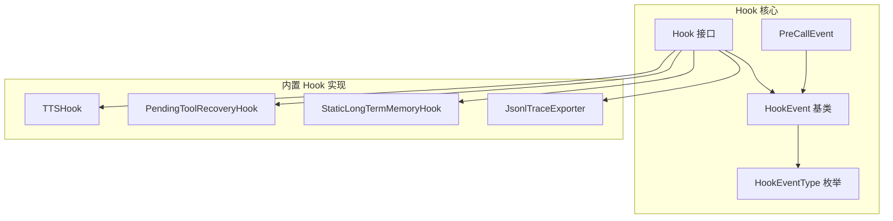
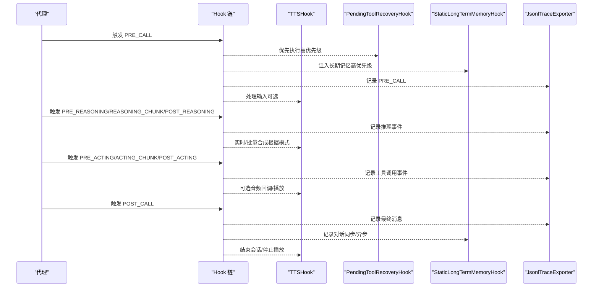
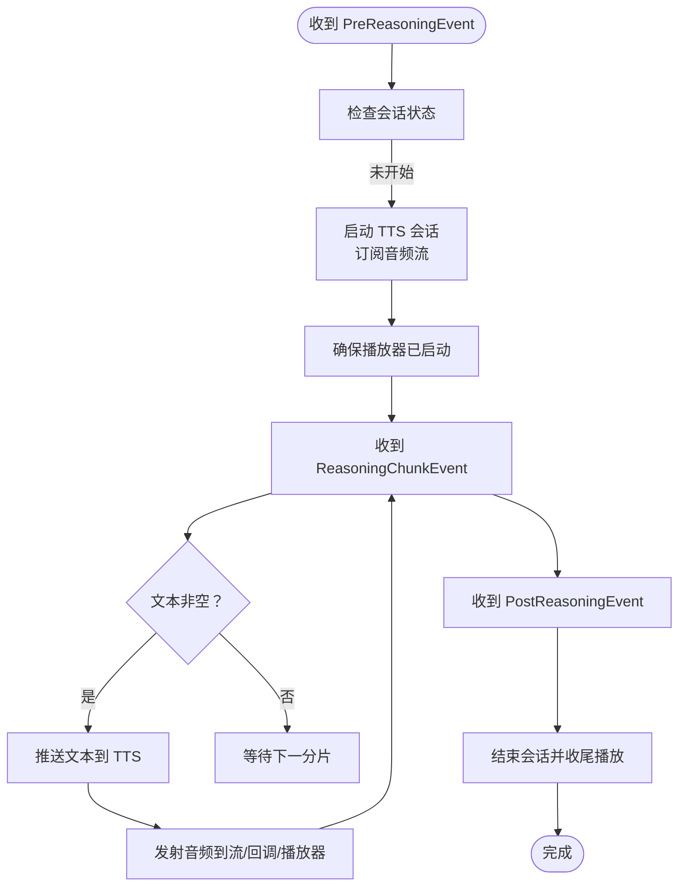
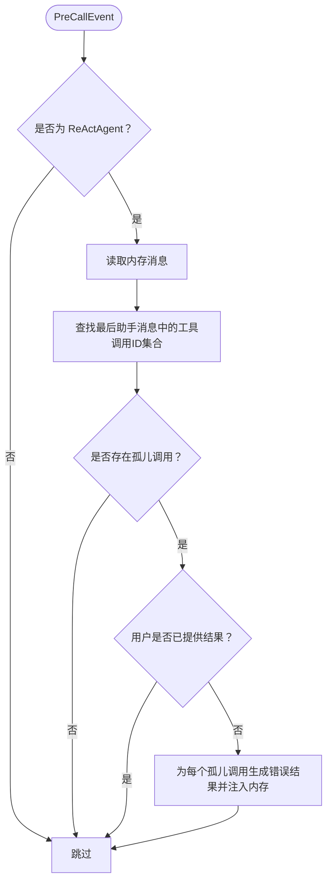
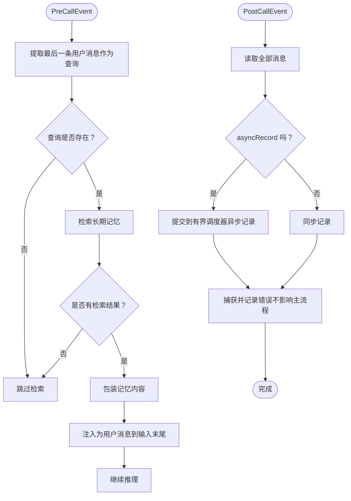
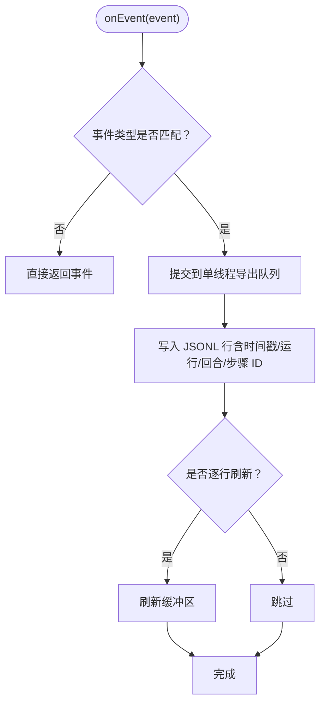
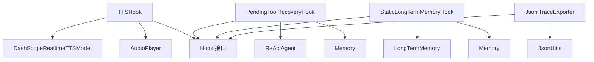

# 内置 Hook 实现

<cite>
**本文引用的文件**
- [TTSHook.java](file://agentscope-core/src/main/java/io/agentscope/core/hook/TTSHook.java)
- [PendingToolRecoveryHook.java](file://agentscope-core/src/main/java/io/agentscope/core/hook/PendingToolRecoveryHook.java)
- [StaticLongTermMemoryHook.java](file://agentscope-core/src/main/java/io/agentscope/core/memory/StaticLongTermMemoryHook.java)
- [JsonlTraceExporter.java](file://agentscope-core/src/main/java/io/agentscope/core/hook/recorder/JsonlTraceExporter.java)
- [Hook.java](file://agentscope-core/src/main/java/io/agentscope/core/hook/Hook.java)
- [HookEvent.java](file://agentscope-core/src/main/java/io/agentscope/core/hook/HookEvent.java)
- [HookEventType.java](file://agentscope-core/src/main/java/io/agentscope/core/hook/HookEventType.java)
- [PreCallEvent.java](file://agentscope-core/src/main/java/io/agentscope/core/hook/PreCallEvent.java)
</cite>

## 目录
1. [简介](#简介)
2. [项目结构](#项目结构)
3. [核心组件](#核心组件)
4. [架构总览](#架构总览)
5. [详细组件分析](#详细组件分析)
6. [依赖分析](#依赖分析)
7. [性能考虑](#性能考虑)
8. [故障排除指南](#故障排除指南)
9. [结论](#结论)
10. [附录：使用示例与最佳实践](#附录使用示例与最佳实践)

## 简介
本文件系统性梳理 AgentScope Java 内置 Hook 的实现与使用，重点覆盖以下四个核心内置 Hook：
- TTSHook：实时文本转语音（TTS）合成，支持“边生成边播放”的实时模式与批量模式，适用于 CLI 桌面端本地播放或服务端通过回调/流式输出返回音频。
- PendingToolRecoveryHook：自动修复悬挂（孤儿）工具调用，避免因工具执行失败/中断导致的状态不一致，保障 ReActAgent 正常继续处理。
- StaticLongTermMemoryHook：静态长期记忆 Hook，自动在推理前注入检索到的记忆，并在调用后异步/同步记录对话，简化长期记忆接入。
- JsonlTraceExporter：基于 Hook 事件系统的 JSONL 追踪导出器，用于本地调试、离线排障与问题定位。

文档从架构、数据流、处理逻辑、扩展点、配置参数、性能优化与故障排除等维度进行深入解析，并提供可直接落地的使用示例路径与最佳实践。

## 项目结构
本节聚焦与内置 Hook 相关的核心包与文件组织方式：
- hook 包：定义 Hook 接口、事件基类与事件类型枚举，以及 TTSHook、PendingToolRecoveryHook、JsonlTraceExporter 等具体实现。
- memory 包：包含 StaticLongTermMemoryHook 及长期记忆相关工具。
- message 与 model 等子模块：为 TTS Hook 提供消息与音频播放能力的基础支撑。

图示来源
- [Hook.java:117-186](file://agentscope-core/src/main/java/io/agentscope/core/hook/Hook.java#L117-L186)
- [HookEvent.java:74-205](file://agentscope-core/src/main/java/io/agentscope/core/hook/HookEvent.java#L74-L205)
- [HookEventType.java:27-63](file://agentscope-core/src/main/java/io/agentscope/core/hook/HookEventType.java#L27-L63)
- [PreCallEvent.java:44-80](file://agentscope-core/src/main/java/io/agentscope/core/hook/PreCallEvent.java#L44-L80)
- [TTSHook.java:74-457](file://agentscope-core/src/main/java/io/agentscope/core/hook/TTSHook.java#L74-L457)
- [PendingToolRecoveryHook.java:58-224](file://agentscope-core/src/main/java/io/agentscope/core/hook/PendingToolRecoveryHook.java#L58-L224)
- [StaticLongTermMemoryHook.java:75-297](file://agentscope-core/src/main/java/io/agentscope/core/memory/StaticLongTermMemoryHook.java#L75-L297)
- [JsonlTraceExporter.java:82-543](file://agentscope-core/src/main/java/io/agentscope/core/hook/recorder/JsonlTraceExporter.java#L82-L543)

章节来源
- [Hook.java:117-186](file://agentscope-core/src/main/java/io/agentscope/core/hook/Hook.java#L117-L186)
- [HookEvent.java:74-205](file://agentscope-core/src/main/java/io/agentscope/core/hook/HookEvent.java#L74-L205)
- [HookEventType.java:27-63](file://agentscope-core/src/main/java/io/agentscope/core/hook/HookEventType.java#L27-L63)
- [PreCallEvent.java:44-80](file://agentscope-core/src/main/java/io/agentscope/core/hook/PreCallEvent.java#L44-L80)

## 核心组件
本节对四个内置 Hook 的职责、关键行为与适用场景进行概览式说明。

- TTSHook
  - 职责：在代理执行过程中进行实时/批量文本转语音合成，支持本地播放与服务端回调两种模式；提供响应式音频流以适配 SSE/WebSocket。
  - 关键特性：实时模式按推理分片推送文本至 TTS 引擎；批量模式等待完整回复后再合成；支持中断当前播放与会话关闭；提供停止资源清理。
  - 适用场景：需要语音反馈的交互式应用、Web/SSE 音频回传、CLI/桌面端本地播放。

- PendingToolRecoveryHook
  - 职责：在 PreCallEvent 时检测并修复“孤儿”工具调用（存在工具调用但无对应结果），自动生成错误结果注入内存，避免后续流程抛出非法状态异常。
  - 关键特性：高优先级（确保在其他依赖内存状态的钩子之前运行）、仅对 ReActAgent 生效、仅当用户未提供结果时自动补全。
  - 适用场景：工具执行不稳定或被中断的场景，保障代理继续推进。

- StaticLongTermMemoryHook
  - 职责：在推理前检索并注入长期记忆，在调用后记录对话；支持同步/异步记录，异步模式下使用专用限流调度器。
  - 关键特性：高优先级（早于其他处理）；异步记录采用有界弹性调度器，饱和时丢弃新任务并告警；错误不影响主流程。
  - 适用场景：需要框架自动管理长期记忆的静态控制模式或与代理工具结合的双向模式。

- JsonlTraceExporter
  - 职责：将 Hook 事件序列化为 JSONL 行式日志，便于本地调试与问题复盘；支持过滤事件类型、是否刷新、失败策略与优先级。
  - 关键特性：单线程队列保证顺序一致性；弱引用保存每代理运行状态，避免内存泄漏；可选 OpenTelemetry 上下文注入。
  - 适用场景：开发调试、离线分析、问题归档与审计。

章节来源
- [TTSHook.java:30-73](file://agentscope-core/src/main/java/io/agentscope/core/hook/TTSHook.java#L30-L73)
- [PendingToolRecoveryHook.java:34-57](file://agentscope-core/src/main/java/io/agentscope/core/hook/PendingToolRecoveryHook.java#L34-L57)
- [StaticLongTermMemoryHook.java:35-74](file://agentscope-core/src/main/java/io/agentscope/core/memory/StaticLongTermMemoryHook.java#L35-L74)
- [JsonlTraceExporter.java:67-81](file://agentscope-core/src/main/java/io/agentscope/core/hook/recorder/JsonlTraceExporter.java#L67-L81)

## 架构总览
下图展示了内置 Hook 在代理生命周期中的触发时机与协作关系，以及与事件系统、消息与模型层的交互。

图示来源
- [Hook.java:117-186](file://agentscope-core/src/main/java/io/agentscope/core/hook/Hook.java#L117-L186)
- [HookEvent.java:74-205](file://agentscope-core/src/main/java/io/agentscope/core/hook/HookEvent.java#L74-L205)
- [HookEventType.java:27-63](file://agentscope-core/src/main/java/io/agentscope/core/hook/HookEventType.java#L27-L63)
- [TTSHook.java:119-197](file://agentscope-core/src/main/java/io/agentscope/core/hook/TTSHook.java#L119-L197)
- [PendingToolRecoveryHook.java:62-124](file://agentscope-core/src/main/java/io/agentscope/core/hook/PendingToolRecoveryHook.java#L62-L124)
- [StaticLongTermMemoryHook.java:121-259](file://agentscope-core/src/main/java/io/agentscope/core/memory/StaticLongTermMemoryHook.java#L121-L259)
- [JsonlTraceExporter.java:124-148](file://agentscope-core/src/main/java/io/agentscope/core/hook/recorder/JsonlTraceExporter.java#L124-L148)

## 详细组件分析

### TTSHook：实时语音合成 Hook
- 功能特性
  - 实时模式：在每次推理分片到达时推送文本，边生成边合成，适合低延迟语音反馈。
  - 批量模式：等待完整回复后一次性合成，适合稳定回放。
  - 多消费模式：同时支持本地 AudioPlayer 播放、回调函数回传与响应式流订阅（SSE/WebSocket）。
  - 中断与会话管理：新一轮推理开始时中断当前播放与会话，避免音频串扰。
  - 资源清理：提供 stop 方法关闭会话、停止播放并完成音频 Sink。

- 关键参数与配置
  - ttsModel：实时 TTS 模型实例（必填）。
  - audioPlayer：本地音频播放器（可选，默认在未设置回调时自动创建）。
  - autoStartPlayer：是否自动启动播放器（默认开启）。
  - realtimeMode：是否启用实时模式（默认开启）。
  - audioCallback：音频块回调（可选，服务端模式推荐）。

- 使用场景
  - CLI/测试：本地播放，无需网络传输。
  - Web/SSE：通过回调或响应式流将音频 Base64 推送前端。
  - 桌面应用：结合本地播放器实现流畅语音反馈。

- 处理流程（实时模式）

图示来源
- [TTSHook.java:119-197](file://agentscope-core/src/main/java/io/agentscope/core/hook/TTSHook.java#L119-L197)
- [TTSHook.java:202-226](file://agentscope-core/src/main/java/io/agentscope/core/hook/TTSHook.java#L202-L226)
- [TTSHook.java:254-274](file://agentscope-core/src/main/java/io/agentscope/core/hook/TTSHook.java#L254-L274)

章节来源
- [TTSHook.java:74-457](file://agentscope-core/src/main/java/io/agentscope/core/hook/TTSHook.java#L74-L457)

### PendingToolRecoveryHook：工具恢复 Hook
- 功能特性
  - 仅对 ReActAgent 生效。
  - 在 PreCallEvent 时扫描最近一条助手消息中的工具调用，若发现“孤儿”调用（无对应结果），且用户未提供结果，则自动生成错误结果并注入内存。
  - 优先级高（10），确保在其他依赖内存状态的钩子之前执行。
  - 不影响用户主动提供的结果。

- 关键参数与配置
  - 默认启用，可通过 ReActAgent.Builder 的 enablePendingToolRecovery(boolean) 控制开关。

- 使用场景
  - 工具执行失败/超时/中断后，避免代理崩溃并继续推进对话。
  - 与人工干预（HITL）机制配合，允许用户手动提供结果。

- 处理流程

图示来源
- [PendingToolRecoveryHook.java:62-124](file://agentscope-core/src/main/java/io/agentscope/core/hook/PendingToolRecoveryHook.java#L62-L124)
- [PendingToolRecoveryHook.java:133-161](file://agentscope-core/src/main/java/io/agentscope/core/hook/PendingToolRecoveryHook.java#L133-L161)
- [PendingToolRecoveryHook.java:171-203](file://agentscope-core/src/main/java/io/agentscope/core/hook/PendingToolRecoveryHook.java#L171-L203)

章节来源
- [PendingToolRecoveryHook.java:58-224](file://agentscope-core/src/main/java/io/agentscope/core/hook/PendingToolRecoveryHook.java#L58-L224)

### StaticLongTermMemoryHook：长期记忆 Hook
- 功能特性
  - 在 PreCallEvent 时检索与当前查询相关的长期记忆，将其包装后作为用户消息注入到输入末尾。
  - 在 PostCallEvent 时记录全部历史消息到长期记忆；支持同步与异步两种模式。
  - 异步记录使用专用有界弹性调度器（最多1个并发、队列最多3个任务），饱和时丢弃并记录警告。
  - 错误不影响主流程，统一捕获并告警。

- 关键参数与配置
  - longTermMemory：长期记忆实例（必填）。
  - memory：代理内存（必填）。
  - asyncRecord：是否异步记录（默认 false，即同步）。

- 使用场景
  - 静态控制模式：由框架自动管理记忆检索与记录。
  - 组合模式：与代理侧记忆工具共同使用。

- 处理流程（检索与记录）

图示来源
- [StaticLongTermMemoryHook.java:151-196](file://agentscope-core/src/main/java/io/agentscope/core/memory/StaticLongTermMemoryHook.java#L151-L196)
- [StaticLongTermMemoryHook.java:218-259](file://agentscope-core/src/main/java/io/agentscope/core/memory/StaticLongTermMemoryHook.java#L218-L259)

章节来源
- [StaticLongTermMemoryHook.java:75-297](file://agentscope-core/src/main/java/io/agentscope/core/memory/StaticLongTermMemoryHook.java#L75-L297)

### JsonlTraceExporter：追踪导出器
- 功能特性
  - 将 Hook 事件写入 JSONL 文件，每行一个事件对象，便于离线分析。
  - 单线程队列保证顺序、回合 ID、步骤 ID 一致性；弱引用保存每代理运行状态。
  - 支持事件类型过滤、是否逐行刷新、失败策略（best-effort 或 fail-fast）、优先级设置。
  - 可选注入 OpenTelemetry 上下文（trace_id/span_id）。

- 关键参数与配置
  - outputFile：输出文件路径（必填）。
  - append：是否追加（默认 true）。
  - flushEveryLine：是否逐行刷新（默认 true）。
  - failFast：发生序列化/IO 错误时是否中断（默认 false）。
  - priority：Hook 优先级（默认 900，较低）。
  - enabledEvents：启用的事件类型集合（默认包含关键阶段）。
  - includeReasoningChunks/includeActingChunks/includeSummary/includeSummaryChunks：是否包含流式与摘要事件。

- 使用场景
  - 本地调试、问题复盘、离线分析、审计与问题归档。

- 处理流程（事件导出）

图示来源
- [JsonlTraceExporter.java:124-148](file://agentscope-core/src/main/java/io/agentscope/core/hook/recorder/JsonlTraceExporter.java#L124-L148)
- [JsonlTraceExporter.java:150-172](file://agentscope-core/src/main/java/io/agentscope/core/hook/recorder/JsonlTraceExporter.java#L150-L172)
- [JsonlTraceExporter.java:174-247](file://agentscope-core/src/main/java/io/agentscope/core/hook/recorder/JsonlTraceExporter.java#L174-L247)

章节来源
- [JsonlTraceExporter.java:82-543](file://agentscope-core/src/main/java/io/agentscope/core/hook/recorder/JsonlTraceExporter.java#L82-L543)

## 依赖分析
- 组件内聚与耦合
  - 四个内置 Hook 均实现 Hook 接口，遵循统一事件模型与优先级机制，彼此解耦。
  - TTSHook 依赖 TTS 模型与音频播放器；StaticLongTermMemoryHook 依赖长期记忆与代理内存；JsonlTraceExporter 依赖 Hook 事件系统与 JSON 序列化工具；PendingToolRecoveryHook 依赖 ReActAgent 与内存工具。
- 外部依赖
  - Reactor（Mono/Flux/Sinks）用于事件链路与响应式流。
  - 日志框架（SLF4J）用于告警与调试。
  - 可选 OpenTelemetry 类加载（反射）用于上下文注入。

图示来源
- [TTSHook.java:78-98](file://agentscope-core/src/main/java/io/agentscope/core/hook/TTSHook.java#L78-L98)
- [PendingToolRecoveryHook.java:84-93](file://agentscope-core/src/main/java/io/agentscope/core/hook/PendingToolRecoveryHook.java#L84-L93)
- [StaticLongTermMemoryHook.java:85-87](file://agentscope-core/src/main/java/io/agentscope/core/memory/StaticLongTermMemoryHook.java#L85-L87)
- [JsonlTraceExporter.java:34-45](file://agentscope-core/src/main/java/io/agentscope/core/hook/recorder/JsonlTraceExporter.java#L34-L45)

章节来源
- [Hook.java:117-186](file://agentscope-core/src/main/java/io/agentscope/core/hook/Hook.java#L117-L186)

## 性能考虑
- TTSHook
  - 实时模式下，音频流与推理流并行，注意避免阻塞；本地播放器 drain 使用独立调度器，减少对主线程的影响。
  - 若前端通过回调/流接收音频，建议在回调中尽快转发，避免阻塞 TTS 模型的音频生产。
- PendingToolRecoveryHook
  - 仅在 PreCallEvent 扫描内存，复杂度与消息数量线性相关；建议保持内存规模合理，避免过长的历史消息列表。
- StaticLongTermMemoryHook
  - 异步记录使用有界调度器，防止无限积压；饱和时丢弃新任务并记录警告，避免拖垮主流程。
  - 记录前建议对消息进行必要裁剪或去重，降低存储与检索成本。
- JsonlTraceExporter
  - 单线程导出队列保证顺序一致性，但可能成为瓶颈；在高并发场景下建议：
    - 使用 append=true 并定期轮换文件；
    - 关闭 flushEveryLine 或合并写入；
    - 限制启用事件类型，减少写入量；
    - 将 failFast 设为 false，避免导出错误中断业务。

## 故障排除指南
- TTSHook
  - 现象：音频卡顿或串扰
    - 排查：确认实时模式下是否正确中断旧会话与播放器；检查新一轮推理开始时的中断逻辑。
  - 现象：服务端无法收到音频
    - 排查：确认 audioCallback 是否设置；检查响应式流订阅者数量；查看日志中关于“无订阅者”的提示。
  - 现象：播放结束后仍有声音残留
    - 排查：确认 drainPlayerAsync 是否执行；检查 stop() 是否被调用。
- PendingToolRecoveryHook
  - 现象：代理仍报非法状态异常
    - 排查：确认是否为 ReActAgent；确认用户是否提供了 ToolResultBlock；检查钩子优先级是否足够高。
  - 现象：自动补全过多导致上下文膨胀
    - 排查：适当精简历史消息；或在用户显式提供结果时避免自动补全。
- StaticLongTermMemoryHook
  - 现象：异步记录堆积
    - 排查：检查调度器队列大小与饱和策略；评估记录频率与消息体量；必要时切换为同步记录。
  - 现象：检索失败影响主流程
    - 排查：确认错误被捕获并记录；如需强一致，可调整为同步记录并 fail-fast。
- JsonlTraceExporter
  - 现象：磁盘写满或性能下降
    - 排查：关闭逐行刷新；限制启用事件类型；定期轮换文件；检查导出线程是否正常退出。
  - 现象：导出文件过大
    - 排查：启用事件过滤；减少流式事件；压缩或归档旧文件。

章节来源
- [TTSHook.java:202-226](file://agentscope-core/src/main/java/io/agentscope/core/hook/TTSHook.java#L202-L226)
- [TTSHook.java:254-274](file://agentscope-core/src/main/java/io/agentscope/core/hook/TTSHook.java#L254-L274)
- [PendingToolRecoveryHook.java:116-124](file://agentscope-core/src/main/java/io/agentscope/core/hook/PendingToolRecoveryHook.java#L116-L124)
- [StaticLongTermMemoryHook.java:226-245](file://agentscope-core/src/main/java/io/agentscope/core/memory/StaticLongTermMemoryHook.java#L226-L245)
- [JsonlTraceExporter.java:136-147](file://agentscope-core/src/main/java/io/agentscope/core/hook/recorder/JsonlTraceExporter.java#L136-L147)

## 结论
内置 Hook 通过统一的 Hook 事件模型实现了对代理生命周期的精细化控制与可观测性增强。TTSHook 提供了灵活的语音合成方案，PendingToolRecoveryHook 提升了工具执行的鲁棒性，StaticLongTermMemoryHook 简化了长期记忆接入，JsonlTraceExporter 则为调试与审计提供了可靠的数据基础。通过合理的配置与性能优化，可在不同场景下获得稳定、可维护且高效的体验。

## 附录：使用示例与最佳实践
- TTSHook
  - 本地播放（CLI/测试）：参考构建器注释中的示例路径，设置 audioPlayer 并启用实时模式。
  - 服务端模式（SSE）：参考构建器注释中的示例路径，设置 audioCallback 并订阅响应式流。
  - 最佳实践：实时模式下建议在新推理开始时中断旧会话；批量模式下确保播放器 drain 完成后再返回。
- PendingToolRecoveryHook
  - 默认启用即可；如需禁用，通过 ReActAgent.Builder 的 enablePendingToolRecovery(false) 关闭。
  - 最佳实践：与人工干预（HITL）结合，让用户在必要时提供结果。
- StaticLongTermMemoryHook
  - 构建时指定 longTermMemory 与 memory；如需异步记录，设置 asyncRecord=true。
  - 最佳实践：异步记录时关注饱和丢弃风险；记录前对消息进行必要清洗。
- JsonlTraceExporter
  - 构建时指定 outputFile；按需启用 includeReasoningChunks/includeActingChunks 等；设置 failFast=false 以保证业务连续性。
  - 最佳实践：生产环境建议 append=true、定期轮换文件、限制事件类型以降低开销。

章节来源
- [TTSHook.java:42-72](file://agentscope-core/src/main/java/io/agentscope/core/hook/TTSHook.java#L42-L72)
- [TTSHook.java:436-455](file://agentscope-core/src/main/java/io/agentscope/core/hook/TTSHook.java#L436-L455)
- [PendingToolRecoveryHook.java:43-45](file://agentscope-core/src/main/java/io/agentscope/core/hook/PendingToolRecoveryHook.java#L43-L45)
- [StaticLongTermMemoryHook.java:53-67](file://agentscope-core/src/main/java/io/agentscope/core/memory/StaticLongTermMemoryHook.java#L53-L67)
- [JsonlTraceExporter.java:522-541](file://agentscope-core/src/main/java/io/agentscope/core/hook/recorder/JsonlTraceExporter.java#L522-L541)