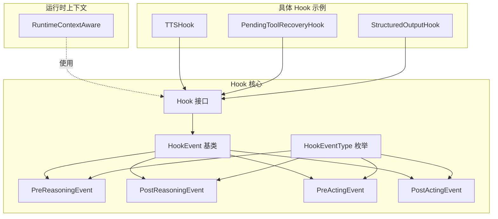
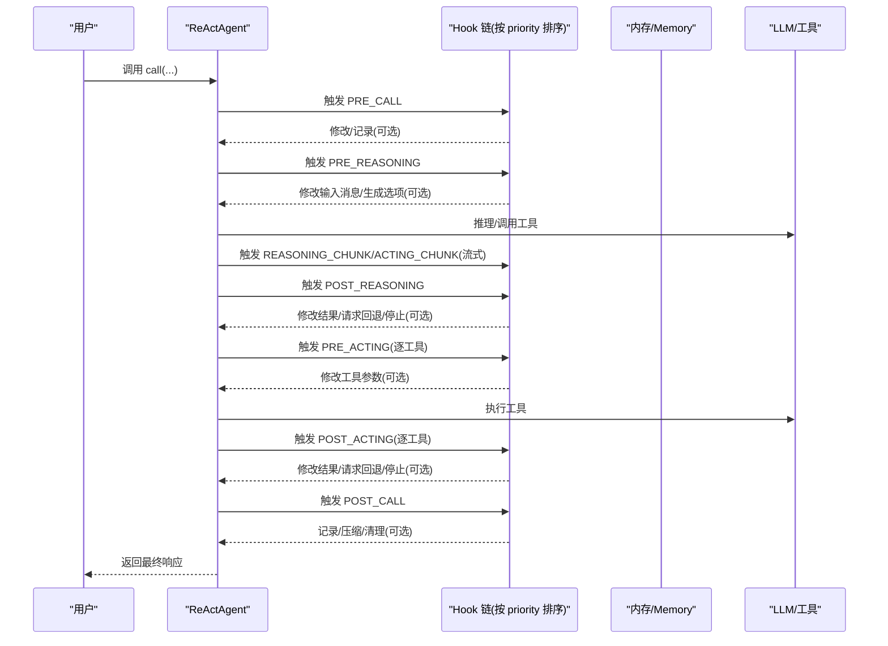
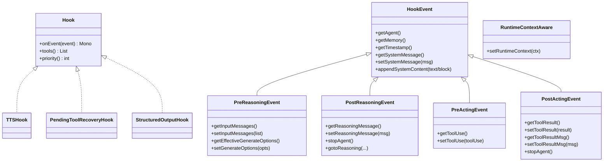
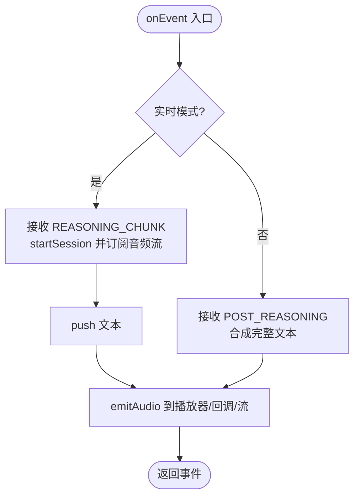
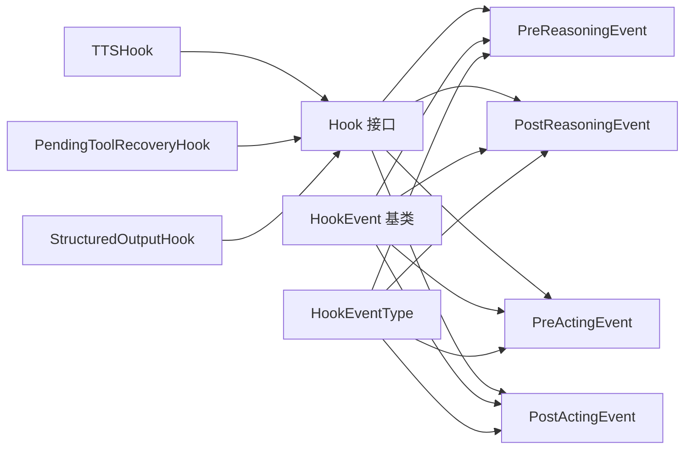

# 自定义 Hook 开发

<cite>
**本文引用的文件**
- [Hook.java](file://agentscope-core/src/main/java/io/agentscope/core/hook/Hook.java)
- [RuntimeContextAware.java](file://agentscope-core/src/main/java/io/agentscope/core/hook/RuntimeContextAware.java)
- [HookEvent.java](file://agentscope-core/src/main/java/io/agentscope/core/hook/HookEvent.java)
- [HookEventType.java](file://agentscope-core/src/main/java/io/agentscope/core/hook/HookEventType.java)
- [PreReasoningEvent.java](file://agentscope-core/src/main/java/io/agentscope/core/hook/PreReasoningEvent.java)
- [PostReasoningEvent.java](file://agentscope-core/src/main/java/io/agentscope/core/hook/PostReasoningEvent.java)
- [PreActingEvent.java](file://agentscope-core/src/main/java/io/agentscope/core/hook/PreActingEvent.java)
- [PostActingEvent.java](file://agentscope-core/src/main/java/io/agentscope/core/hook/PostActingEvent.java)
- [TTSHook.java](file://agentscope-core/src/main/java/io/agentscope/core/hook/TTSHook.java)
- [PendingToolRecoveryHook.java](file://agentscope-core/src/main/java/io/agentscope/core/hook/PendingToolRecoveryHook.java)
- [StructuredOutputHook.java](file://agentscope-core/src/main/java/io/agentscope/core/agent/StructuredOutputHook.java)
- [TTSHookTest.java](file://agentscope-core/src/test/java/io/agentscope/core/hook/TTSHookTest.java)
</cite>

## 目录
1. [简介](#简介)
2. [项目结构](#项目结构)
3. [核心组件](#核心组件)
4. [架构总览](#架构总览)
5. [详细组件分析](#详细组件分析)
6. [依赖分析](#依赖分析)
7. [性能考虑](#性能考虑)
8. [故障排查指南](#故障排查指南)
9. [结论](#结论)
10. [附录：开发与测试清单](#附录开发与测试清单)

## 简介
本指南面向在 AgentScope Java 中开发自定义 Hook 的工程师，系统讲解 Hook 接口的实现方式（onEvent、priority、tools）、Hook 生命周期与事件处理模式（过滤、修改、传播）、RuntimeContextAware 的使用与运行时上下文获取，以及线程安全、异常处理与性能优化的最佳实践。文档同时提供认证 Hook、日志 Hook、监控 Hook 等多种自定义 Hook 的实现思路与测试策略。

## 项目结构
围绕 Hook 的核心代码位于 agentscope-core 模块的 hook 包中，并辅以若干具体 Hook 示例与测试用例：
- 接口与事件模型：Hook、HookEvent、HookEventType 及各阶段事件类
- 运行时上下文：RuntimeContextAware
- 具体 Hook 示例：TTSHook（实时语音合成）、PendingToolRecoveryHook（工具调用恢复）、StructuredOutputHook（结构化输出）
- 测试：TTSHookTest 等

图表来源
- [Hook.java:117-186](file://agentscope-core/src/main/java/io/agentscope/core/hook/Hook.java#L117-L186)
- [HookEvent.java:74-205](file://agentscope-core/src/main/java/io/agentscope/core/hook/HookEvent.java#L74-L205)
- [HookEventType.java:27-63](file://agentscope-core/src/main/java/io/agentscope/core/hook/HookEventType.java#L27-L63)
- [PreReasoningEvent.java:47-116](file://agentscope-core/src/main/java/io/agentscope/core/hook/PreReasoningEvent.java#L47-L116)
- [PostReasoningEvent.java:51-172](file://agentscope-core/src/main/java/io/agentscope/core/hook/PostReasoningEvent.java#L51-L172)
- [PreActingEvent.java:47-70](file://agentscope-core/src/main/java/io/agentscope/core/hook/PreActingEvent.java#L47-L70)
- [PostActingEvent.java:50-128](file://agentscope-core/src/main/java/io/agentscope/core/hook/PostActingEvent.java#L50-L128)
- [RuntimeContextAware.java:30-39](file://agentscope-core/src/main/java/io/agentscope/core/hook/RuntimeContextAware.java#L30-L39)
- [TTSHook.java:74-457](file://agentscope-core/src/main/java/io/agentscope/core/hook/TTSHook.java#L74-L457)
- [PendingToolRecoveryHook.java:58-224](file://agentscope-core/src/main/java/io/agentscope/core/hook/PendingToolRecoveryHook.java#L58-L224)
- [StructuredOutputHook.java:61-414](file://agentscope-core/src/main/java/io/agentscope/core/agent/StructuredOutputHook.java#L61-L414)

章节来源
- [Hook.java:117-186](file://agentscope-core/src/main/java/io/agentscope/core/hook/Hook.java#L117-L186)
- [HookEvent.java:74-205](file://agentscope-core/src/main/java/io/agentscope/core/hook/HookEvent.java#L74-L205)
- [HookEventType.java:27-63](file://agentscope-core/src/main/java/io/agentscope/core/hook/HookEventType.java#L27-L63)

## 核心组件
- Hook 接口：统一事件入口 onEvent，可选 priority 控制执行顺序，可选 tools 注册工具
- HookEvent 抽象基类：提供系统消息字段 systemMsg 的读写与注入机制，确保每次推理前从冻结基线注入
- 各阶段事件类：PreReasoningEvent、PostReasoningEvent、PreActingEvent、PostActingEvent 等，分别承载推理前后与工具调用前后/后的上下文
- RuntimeContextAware：按调用周期注入/清理 RuntimeContext，用于跨 Hook/工具共享状态

章节来源
- [Hook.java:117-186](file://agentscope-core/src/main/java/io/agentscope/core/hook/Hook.java#L117-L186)
- [HookEvent.java:74-205](file://agentscope-core/src/main/java/io/agentscope/core/hook/HookEvent.java#L74-L205)
- [PreReasoningEvent.java:47-116](file://agentscope-core/src/main/java/io/agentscope/core/hook/PreReasoningEvent.java#L47-L116)
- [PostReasoningEvent.java:51-172](file://agentscope-core/src/main/java/io/agentscope/core/hook/PostReasoningEvent.java#L51-L172)
- [PreActingEvent.java:47-70](file://agentscope-core/src/main/java/io/agentscope/core/hook/PreActingEvent.java#L47-L70)
- [PostActingEvent.java:50-128](file://agentscope-core/src/main/java/io/agentscope/core/hook/PostActingEvent.java#L50-L128)
- [RuntimeContextAware.java:30-39](file://agentscope-core/src/main/java/io/agentscope/core/hook/RuntimeContextAware.java#L30-L39)

## 架构总览
下图展示了 Hook 在 ReActAgent 执行链路中的位置与事件流转：

图表来源
- [Hook.java:117-186](file://agentscope-core/src/main/java/io/agentscope/core/hook/Hook.java#L117-L186)
- [HookEvent.java:74-205](file://agentscope-core/src/main/java/io/agentscope/core/hook/HookEvent.java#L74-L205)
- [PreReasoningEvent.java:47-116](file://agentscope-core/src/main/java/io/agentscope/core/hook/PreReasoningEvent.java#L47-L116)
- [PostReasoningEvent.java:51-172](file://agentscope-core/src/main/java/io/agentscope/core/hook/PostReasoningEvent.java#L51-L172)
- [PreActingEvent.java:47-70](file://agentscope-core/src/main/java/io/agentscope/core/hook/PreActingEvent.java#L47-L70)
- [PostActingEvent.java:50-128](file://agentscope-core/src/main/java/io/agentscope/core/hook/PostActingEvent.java#L50-L128)

## 详细组件分析

### Hook 接口与生命周期
- onEvent：统一接收所有 HookEvent，使用模式匹配区分事件类型；对带 setter 的事件可修改上下文，从而影响后续执行
- priority：数值越小优先级越高；默认 100；建议将“认证/安全”等关键系统 Hook 放置在 0-50 区间
- tools：返回 Hook 内置的工具实例或声明了 @Tool 的对象集合；默认空列表；构建器会将非空元素注册到代理本地 Toolkit

图表来源
- [Hook.java:117-186](file://agentscope-core/src/main/java/io/agentscope/core/hook/Hook.java#L117-L186)
- [HookEvent.java:74-205](file://agentscope-core/src/main/java/io/agentscope/core/hook/HookEvent.java#L74-L205)
- [PreReasoningEvent.java:47-116](file://agentscope-core/src/main/java/io/agentscope/core/hook/PreReasoningEvent.java#L47-L116)
- [PostReasoningEvent.java:51-172](file://agentscope-core/src/main/java/io/agentscope/core/hook/PostReasoningEvent.java#L51-L172)
- [PreActingEvent.java:47-70](file://agentscope-core/src/main/java/io/agentscope/core/hook/PreActingEvent.java#L47-L70)
- [PostActingEvent.java:50-128](file://agentscope-core/src/main/java/io/agentscope/core/hook/PostActingEvent.java#L50-L128)
- [RuntimeContextAware.java:30-39](file://agentscope-core/src/main/java/io/agentscope/core/hook/RuntimeContextAware.java#L30-L39)
- [TTSHook.java:74-457](file://agentscope-core/src/main/java/io/agentscope/core/hook/TTSHook.java#L74-L457)
- [PendingToolRecoveryHook.java:58-224](file://agentscope-core/src/main/java/io/agentscope/core/hook/PendingToolRecoveryHook.java#L58-L224)
- [StructuredOutputHook.java:61-414](file://agentscope-core/src/main/java/io/agentscope/core/agent/StructuredOutputHook.java#L61-L414)

章节来源
- [Hook.java:117-186](file://agentscope-core/src/main/java/io/agentscope/core/hook/Hook.java#L117-L186)
- [HookEvent.java:74-205](file://agentscope-core/src/main/java/io/agentscope/core/hook/HookEvent.java#L74-L205)

### 事件处理模式：过滤、修改与传播
- 事件过滤：在 onEvent 中对不关心的事件直接返回原事件，避免无谓处理
- 事件修改：
  - PreReasoningEvent：修改输入消息列表、覆盖生成选项
  - PostReasoningEvent：修改推理结果消息、请求回退到推理阶段、请求停止
  - PreActingEvent：修改单个工具调用参数
  - PostActingEvent：修改工具结果、设置结果消息、请求停止
- 事件传播：未修改的事件通过 Mono.just(event) 传递给下一个 Hook；修改后的事件通过 Mono.just(modifiedEvent) 继续传播

章节来源
- [PreReasoningEvent.java:47-116](file://agentscope-core/src/main/java/io/agentscope/core/hook/PreReasoningEvent.java#L47-L116)
- [PostReasoningEvent.java:51-172](file://agentscope-core/src/main/java/io/agentscope/core/hook/PostReasoningEvent.java#L51-L172)
- [PreActingEvent.java:47-70](file://agentscope-core/src/main/java/io/agentscope/core/hook/PreActingEvent.java#L47-L70)
- [PostActingEvent.java:50-128](file://agentscope-core/src/main/java/io/agentscope/core/hook/PostActingEvent.java#L50-L128)

### RuntimeContextAware 与运行时上下文
- 接口作用：在 ReActAgent.call(...) 执行期间，框架会向实现了该接口的 Hook 注入当前调用的 RuntimeContext；完成后清空
- 使用建议：Hook 可缓存引用以实现跨 Hook/工具的状态共享；注意同一 RuntimeContext 实例在调用期间可变，避免在 Hook 之间传递不可变快照

章节来源
- [RuntimeContextAware.java:30-39](file://agentscope-core/src/main/java/io/agentscope/core/hook/RuntimeContextAware.java#L30-L39)

### 具体 Hook 实现示例

#### TTSHook（实时语音合成 Hook）
- 功能：在推理流式输出时实时合成音频，或在完整响应后批量合成
- 关键点：
  - realtimeMode 与 batchMode 分支处理
  - 会话管理：startSession/finish/close
  - 多路输出：本地播放器、回调函数、响应式音频流
  - 资源清理：stop() 关闭 TTS 会话、停止播放器、完成 Sink

图表来源
- [TTSHook.java:119-197](file://agentscope-core/src/main/java/io/agentscope/core/hook/TTSHook.java#L119-L197)

章节来源
- [TTSHook.java:74-457](file://agentscope-core/src/main/java/io/agentscope/core/hook/TTSHook.java#L74-L457)

#### PendingToolRecoveryHook（工具调用恢复 Hook）
- 功能：在 PreCall 阶段检测“悬空”的待处理工具调用，自动注入错误结果，避免非法状态
- 关键点：
  - 仅对 ReActAgent 生效
  - 仅当用户未提供 ToolResultBlock 且存在待处理 ID 时生效
  - 生成 TOOL 角色消息写入内存

章节来源
- [PendingToolRecoveryHook.java:58-224](file://agentscope-core/src/main/java/io/agentscope/core/hook/PendingToolRecoveryHook.java#L58-L224)

#### StructuredOutputHook（结构化输出 Hook）
- 功能：强制模型调用 generate_response 工具，必要时提醒重试；成功后停止并压缩中间消息
- 关键点：
  - PreReasoning：在特定提醒消息时强制 tool_choice
  - PostReasoning：若未调用工具则追加提醒消息并 gotoReasoning
  - PostActing：识别 generate_response 成功后 stopAgent
  - PostCall：压缩内存，合并用量与思考内容元数据

章节来源
- [StructuredOutputHook.java:61-414](file://agentscope-core/src/main/java/io/agentscope/core/agent/StructuredOutputHook.java#L61-L414)

## 依赖分析
- Hook 与 HookEvent：Hook 通过 onEvent 接收所有事件；HookEvent 提供统一的系统消息注入与修改能力
- 事件类型：HookEventType 定义了完整的生命周期事件枚举，驱动 Hook 的分支逻辑
- 具体 Hook：TTSHook、PendingToolRecoveryHook、StructuredOutputHook 均实现 Hook 接口，体现不同职责域的扩展点

图表来源
- [Hook.java:117-186](file://agentscope-core/src/main/java/io/agentscope/core/hook/Hook.java#L117-L186)
- [HookEvent.java:74-205](file://agentscope-core/src/main/java/io/agentscope/core/hook/HookEvent.java#L74-L205)
- [HookEventType.java:27-63](file://agentscope-core/src/main/java/io/agentscope/core/hook/HookEventType.java#L27-L63)
- [TTSHook.java:74-457](file://agentscope-core/src/main/java/io/agentscope/core/hook/TTSHook.java#L74-L457)
- [PendingToolRecoveryHook.java:58-224](file://agentscope-core/src/main/java/io/agentscope/core/hook/PendingToolRecoveryHook.java#L58-L224)
- [StructuredOutputHook.java:61-414](file://agentscope-core/src/main/java/io/agentscope/core/agent/StructuredOutputHook.java#L61-L414)

章节来源
- [Hook.java:117-186](file://agentscope-core/src/main/java/io/agentscope/core/hook/Hook.java#L117-L186)
- [HookEvent.java:74-205](file://agentscope-core/src/main/java/io/agentscope/core/hook/HookEvent.java#L74-L205)
- [HookEventType.java:27-63](file://agentscope-core/src/main/java/io/agentscope/core/hook/HookEventType.java#L27-L63)

## 性能考虑
- 事件处理幂等与最小修改：仅在必要时修改事件，避免重复构造对象
- 异步与背压：TTSHook 使用响应式流与背压缓冲，避免阻塞调用方；合理配置调度器
- 会话与资源复用：TTS 会话按需开启/关闭，避免频繁重建；播放器 drain 异步执行
- 优先级与短路：高优先级 Hook 尽量早做决定（如认证），减少后续 Hook 的无效计算

## 故障排查指南
- 事件未被处理：确认 onEvent 是否对目标事件类型做了分支处理；未处理的事件会被透传
- 修改无效：检查事件是否可修改（是否有 setter）；对于只读事件需通过其他方式记录或拦截
- 系统消息注入异常：确保通过 HookEvent 的系统消息 API 设置/追加，而非直接修改输入消息列表
- TTS 回调/播放问题：参考单元测试断言，验证回调触发、播放器调用与资源清理
- 工具调用恢复：确认内存中是否存在未匹配的 ToolResultBlock，以及用户输入是否已提供结果

章节来源
- [TTSHookTest.java:48-484](file://agentscope-core/src/test/java/io/agentscope/core/hook/TTSHookTest.java#L48-L484)

## 结论
通过 Hook 接口，开发者可以以统一的事件模型对 Agent 执行进行无侵入拦截与增强。合理设计 priority、精准修改可变事件、正确使用 RuntimeContextAware，可实现认证、日志、监控、结构化输出等多种场景。配合响应式流与严格的测试用例，可在保证线程安全与性能的前提下，构建稳定可靠的 Hook 生态。

## 附录：开发与测试清单
- 实现步骤
  - 实现 Hook 接口：onEvent 使用模式匹配处理事件；根据需要重写 priority 与 tools
  - 如需访问 RuntimeContext：实现 RuntimeContextAware，在 setRuntimeContext 中缓存引用
  - 明确事件可修改范围：仅对带 setter 的事件进行修改
  - 设计优先级：将关键系统 Hook 放在高位，业务 Hook 放在低位
- 测试策略
  - 单元测试：覆盖 Builder 参数校验、事件分支处理、回调/播放器集成、边缘情况（空文本、null 消息）
  - 行为测试：验证 Hook 在真实 Agent 执行链路中的效果（如结构化输出、工具恢复）
- 调试技巧
  - 使用日志定位事件类型与处理路径
  - 对关键事件打印系统消息与输入输出，核对注入/修改是否符合预期
  - 在 CI 环境中避免播放器初始化，使用回调或流式输出替代

章节来源
- [TTSHookTest.java:48-484](file://agentscope-core/src/test/java/io/agentscope/core/hook/TTSHookTest.java#L48-L484)