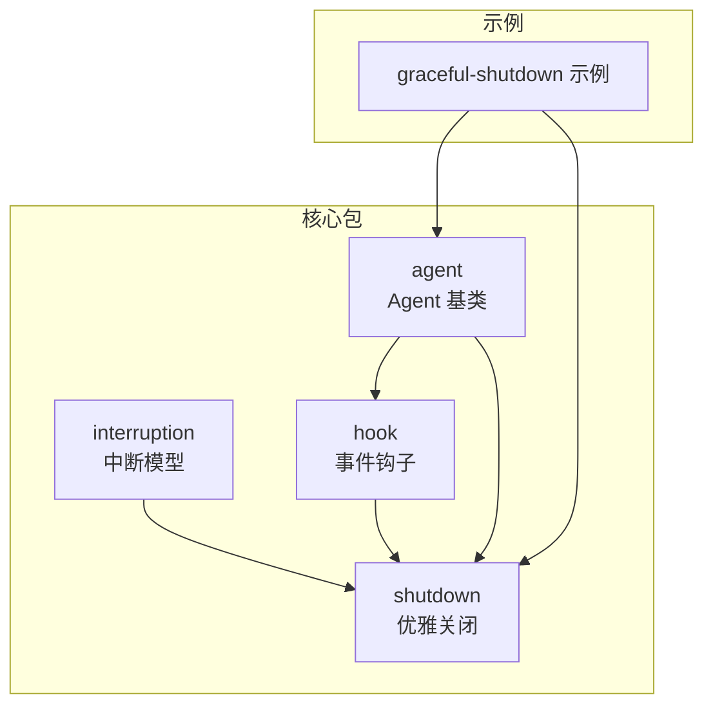
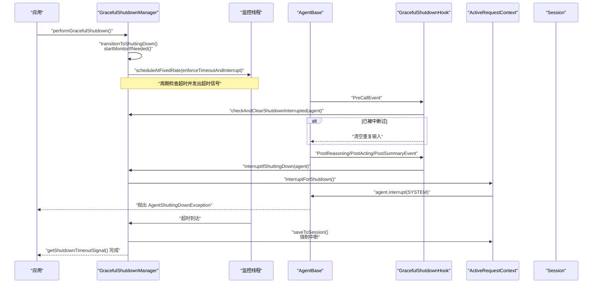
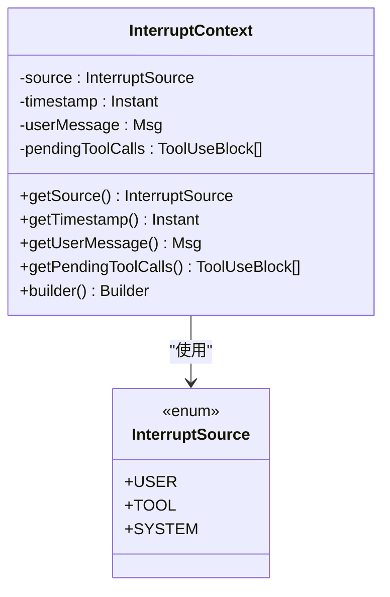
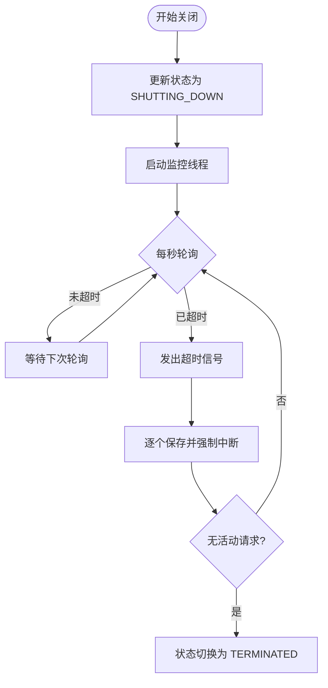
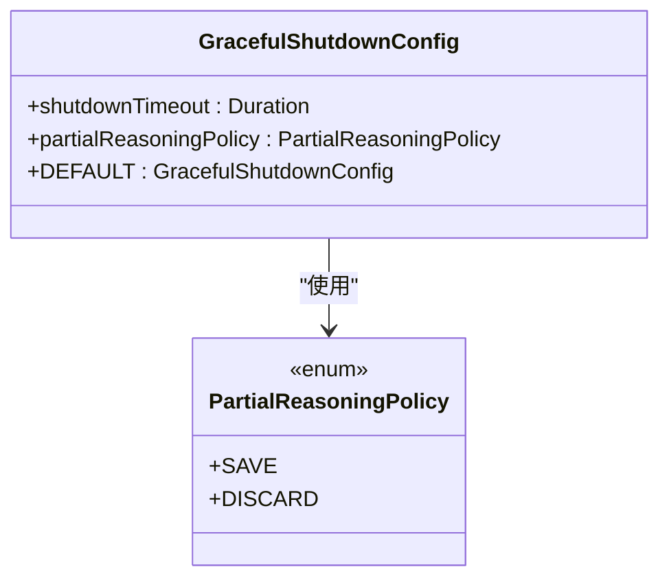
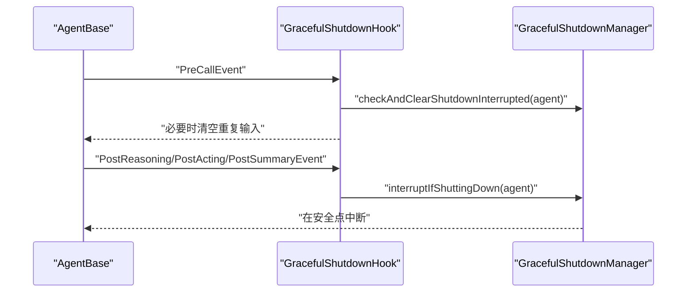
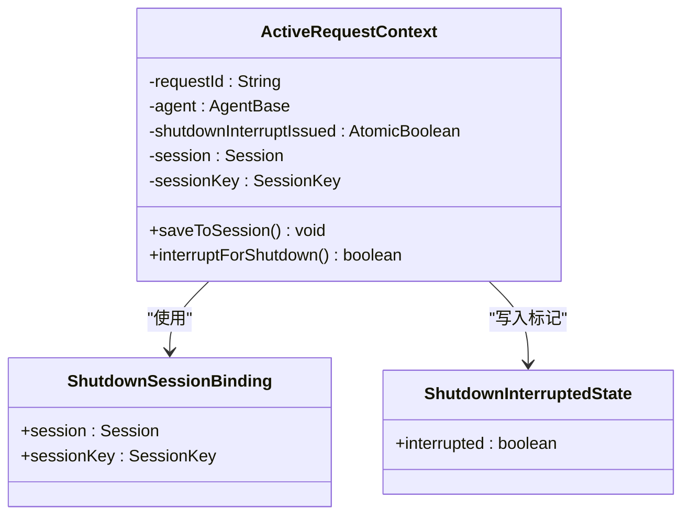
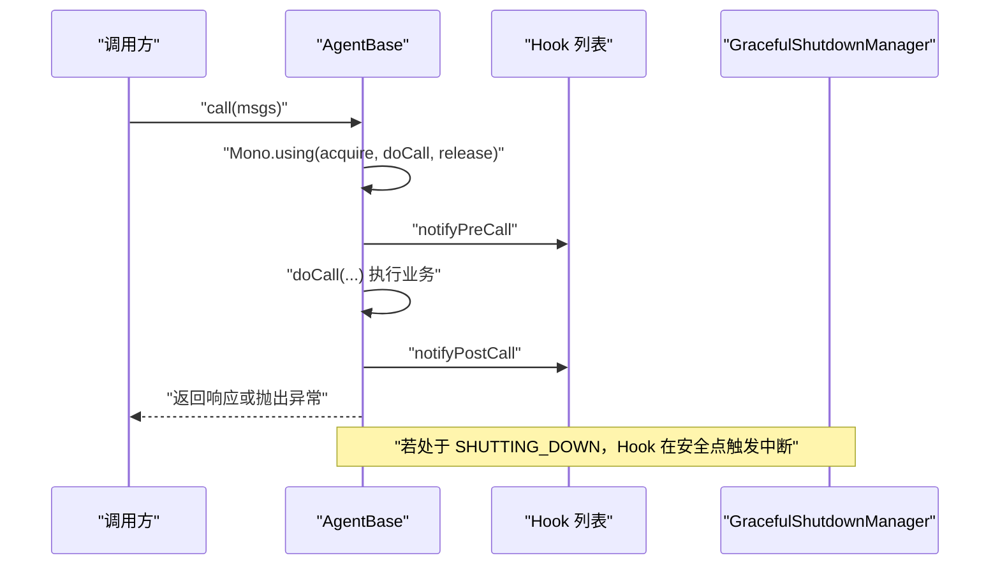
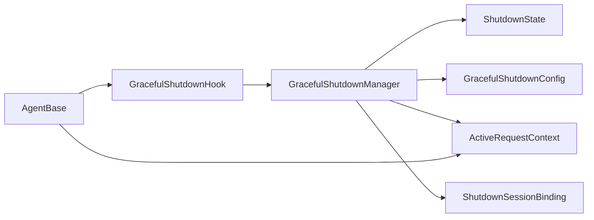

# 中断与优雅关闭

<cite>
**本文引用的文件**
- [InterruptContext.java](file://agentscope-core/src/main/java/io/agentscope/core/interruption/InterruptContext.java)
- [InterruptSource.java](file://agentscope-core/src/main/java/io/agentscope/core/interruption/InterruptSource.java)
- [GracefulShutdownManager.java](file://agentscope-core/src/main/java/io/agentscope/core/shutdown/GracefulShutdownManager.java)
- [GracefulShutdownHook.java](file://agentscope-core/src/main/java/io/agentscope/core/shutdown/GracefulShutdownHook.java)
- [GracefulShutdownConfig.java](file://agentscope-core/src/main/java/io/agentscope/core/shutdown/GracefulShutdownConfig.java)
- [ShutdownState.java](file://agentscope-core/src/main/java/io/agentscope/core/shutdown/ShutdownState.java)
- [PartialReasoningPolicy.java](file://agentscope-core/src/main/java/io/agentscope/core/shutdown/PartialReasoningPolicy.java)
- [ActiveRequestContext.java](file://agentscope-core/src/main/java/io/agentscope/core/shutdown/ActiveRequestContext.java)
- [ShutdownInterruptedState.java](file://agentscope-core/src/main/java/io/agentscope/core/shutdown/ShutdownInterruptedState.java)
- [ShutdownSessionBinding.java](file://agentscope-core/src/main/java/io/agentscope/core/shutdown/ShutdownSessionBinding.java)
- [Hook.java](file://agentscope-core/src/main/java/io/agentscope/core/hook/Hook.java)
- [AgentBase.java](file://agentscope-core/src/main/java/io/agentscope/core/agent/AgentBase.java)
- [GracefulShutdownExample.java](file://agentscope-examples/graceful-shutdown/src/main/java/io/agentscope/examples/shutdown/smoke/GracefulShutdownExample.java)
</cite>

## 目录
1. [简介](#简介)
2. [项目结构](#项目结构)
3. [核心组件](#核心组件)
4. [架构总览](#架构总览)
5. [详细组件分析](#详细组件分析)
6. [依赖关系分析](#依赖关系分析)
7. [性能考量](#性能考量)
8. [故障排查指南](#故障排查指南)
9. [结论](#结论)
10. [附录：配置与最佳实践](#附录配置与最佳实践)

## 简介
本文件面向 AgentScope Java 的“中断与优雅关闭”体系，系统性阐述以下主题：
- 中断处理机制的设计理念与实现路径
- 中断上下文与中断源的管理
- 优雅关闭的实现原理、关闭策略与资源清理流程
- 中断与取消的语义差异、状态保存与恢复机制
- Hook 系统在中断处理中的作用及自定义中断处理器的实现方法
- 超时控制、重试策略与错误恢复的最佳实践
- 完整配置示例与典型使用场景
- 生产环境中的监控告警与故障诊断策略

## 项目结构
围绕中断与优雅关闭的相关模块主要位于 core 模块的 interruption 与 shutdown 包中，并通过 Hook 事件模型与 Agent 生命周期集成；示例工程提供了端到端演示。

**图表来源**
- [GracefulShutdownManager.java:1-321](file://agentscope-core/src/main/java/io/agentscope/core/shutdown/GracefulShutdownManager.java#L1-321)
- [GracefulShutdownHook.java:1-104](file://agentscope-core/src/main/java/io/agentscope/core/shutdown/GracefulShutdownHook.java#L1-104)
- [Hook.java:1-187](file://agentscope-core/src/main/java/io/agentscope/core/hook/Hook.java#L1-187)
- [AgentBase.java:1-200](file://agentscope-core/src/main/java/io/agentscope/core/agent/AgentBase.java#L1-200)
- [GracefulShutdownExample.java:1-832](file://agentscope-examples/graceful-shutdown/src/main/java/io/agentscope/examples/shutdown/smoke/GracefulShutdownExample.java#L1-832)

**章节来源**
- [GracefulShutdownManager.java:1-321](file://agentscope-core/src/main/java/io/agentscope/core/shutdown/GracefulShutdownManager.java#L1-321)
- [GracefulShutdownHook.java:1-104](file://agentscope-core/src/main/java/io/agentscope/core/shutdown/GracefulShutdownHook.java#L1-104)
- [Hook.java:1-187](file://agentscope-core/src/main/java/io/agentscope/core/hook/Hook.java#L1-187)
- [AgentBase.java:1-200](file://agentscope-core/src/main/java/io/agentscope/core/agent/AgentBase.java#L1-200)
- [GracefulShutdownExample.java:1-832](file://agentscope-examples/graceful-shutdown/src/main/java/io/agentscope/examples/shutdown/smoke/GracefulShutdownExample.java#L1-832)

## 核心组件
- 中断模型
  - 中断上下文：封装中断来源、时间戳、用户消息、待处理工具调用等元数据
  - 中断源枚举：区分用户触发、工具触发、系统触发（如超时）
- 优雅关闭
  - 全局管理器：跟踪活动请求、状态机、超时信号、会话绑定与持久化
  - 关闭配置：关闭超时、部分推理内容策略
  - Hook 集成：在推理、行动、总结阶段的安全检查点进行中断
  - 请求上下文：单次请求的状态与中断执行
  - 中断标记：用于检测与恢复的会话键值
- Hook 与 Agent 集成
  - 统一事件模型与优先级
  - AgentBase 在生命周期关键点注册/注销请求、传播中断异常

**章节来源**
- [InterruptContext.java:1-190](file://agentscope-core/src/main/java/io/agentscope/core/interruption/InterruptContext.java#L1-190)
- [InterruptSource.java:1-38](file://agentscope-core/src/main/java/io/agentscope/core/interruption/InterruptSource.java#L1-38)
- [GracefulShutdownManager.java:1-321](file://agentscope-core/src/main/java/io/agentscope/core/shutdown/GracefulShutdownManager.java#L1-321)
- [GracefulShutdownConfig.java:1-70](file://agentscope-core/src/main/java/io/agentscope/core/shutdown/GracefulShutdownConfig.java#L1-70)
- [GracefulShutdownHook.java:1-104](file://agentscope-core/src/main/java/io/agentscope/core/shutdown/GracefulShutdownHook.java#L1-104)
- [ActiveRequestContext.java:1-78](file://agentscope-core/src/main/java/io/agentscope/core/shutdown/ActiveRequestContext.java#L1-78)
- [ShutdownInterruptedState.java:1-28](file://agentscope-core/src/main/java/io/agentscope/core/shutdown/ShutdownInterruptedState.java#L1-28)
- [ShutdownSessionBinding.java:1-32](file://agentscope-core/src/main/java/io/agentscope/core/shutdown/ShutdownSessionBinding.java#L1-32)
- [Hook.java:1-187](file://agentscope-core/src/main/java/io/agentscope/core/hook/Hook.java#L1-187)
- [AgentBase.java:1-200](file://agentscope-core/src/main/java/io/agentscope/core/agent/AgentBase.java#L1-200)

## 架构总览
下图展示了从应用触发优雅关闭到各阶段安全中断、状态保存与恢复的整体流程。

**图表来源**
- [GracefulShutdownManager.java:198-266](file://agentscope-core/src/main/java/io/agentscope/core/shutdown/GracefulShutdownManager.java#L198-266)
- [GracefulShutdownHook.java:64-97](file://agentscope-core/src/main/java/io/agentscope/core/shutdown/GracefulShutdownHook.java#L64-97)
- [ActiveRequestContext.java:58-76](file://agentscope-core/src/main/java/io/agentscope/core/shutdown/ActiveRequestContext.java#L58-76)
- [AgentBase.java:182-200](file://agentscope-core/src/main/java/io/agentscope/core/agent/AgentBase.java#L182-200)

## 详细组件分析

### 中断模型：上下文与来源
- 中断上下文包含来源、时间戳、用户消息与待处理工具调用列表，支持构建器模式装配
- 中断源分为用户、工具、系统三类，用于区分中断发起方与处理策略

**图表来源**
- [InterruptContext.java:40-190](file://agentscope-core/src/main/java/io/agentscope/core/interruption/InterruptContext.java#L40-190)
- [InterruptSource.java:28-37](file://agentscope-core/src/main/java/io/agentscope/core/interruption/InterruptSource.java#L28-37)

**章节来源**
- [InterruptContext.java:1-190](file://agentscope-core/src/main/java/io/agentscope/core/interruption/InterruptContext.java#L1-190)
- [InterruptSource.java:1-38](file://agentscope-core/src/main/java/io/agentscope/core/interruption/InterruptSource.java#L1-38)

### 优雅关闭管理器：全局状态与监控
- 状态机：运行中 → 关闭中 → 已终止
- 活动请求跟踪：按 AgentId 维度登记/注销，确保每次调用都能正确清理
- 超时监控：定时任务检查已启动时间，超过阈值则发出超时信号并强制中断
- 会话绑定：在关键检查点将 Agent 状态写入 Session，并设置“已中断”标记，便于恢复时去重

**图表来源**
- [GracefulShutdownManager.java:198-266](file://agentscope-core/src/main/java/io/agentscope/core/shutdown/GracefulShutdownManager.java#L198-266)
- [ShutdownState.java:21-25](file://agentscope-core/src/main/java/io/agentscope/core/shutdown/ShutdownState.java#L21-25)

**章节来源**
- [GracefulShutdownManager.java:1-321](file://agentscope-core/src/main/java/io/agentscope/core/shutdown/GracefulShutdownManager.java#L1-321)
- [ShutdownState.java:1-26](file://agentscope-core/src/main/java/io/agentscope/core/shutdown/ShutdownState.java#L1-26)

### 关闭配置与策略
- 关闭超时：可配置等待时长，null 表示无限等待
- 部分推理策略：保存或丢弃未完成的推理内容
- 默认配置：无限等待 + 保存策略

**图表来源**
- [GracefulShutdownConfig.java:36-70](file://agentscope-core/src/main/java/io/agentscope/core/shutdown/GracefulShutdownConfig.java#L36-70)
- [PartialReasoningPolicy.java:21-24](file://agentscope-core/src/main/java/io/agentscope/core/shutdown/PartialReasoningPolicy.java#L21-24)

**章节来源**
- [GracefulShutdownConfig.java:1-70](file://agentscope-core/src/main/java/io/agentscope/core/shutdown/GracefulShutdownConfig.java#L1-70)
- [PartialReasoningPolicy.java:1-25](file://agentscope-core/src/main/java/io/agentscope/core/shutdown/PartialReasoningPolicy.java#L1-25)

### Hook 集成与安全检查点
- Hook 接口统一事件模型与优先级，支持修改事件（如 PreCallEvent）与只读事件（如 ReasoningChunkEvent）
- 优雅关闭 Hook 在三个检查点触发中断：推理后、行动后、摘要后
- 预调用阶段检测“已中断”标记，避免重复输入

**图表来源**
- [GracefulShutdownHook.java:64-97](file://agentscope-core/src/main/java/io/agentscope/core/shutdown/GracefulShutdownHook.java#L64-97)
- [Hook.java:117-187](file://agentscope-core/src/main/java/io/agentscope/core/hook/Hook.java#L117-187)
- [AgentBase.java:182-200](file://agentscope-core/src/main/java/io/agentscope/core/agent/AgentBase.java#L182-200)

**章节来源**
- [GracefulShutdownHook.java:1-104](file://agentscope-core/src/main/java/io/agentscope/core/shutdown/GracefulShutdownHook.java#L1-104)
- [Hook.java:1-187](file://agentscope-core/src/main/java/io/agentscope/core/hook/Hook.java#L1-187)
- [AgentBase.java:1-200](file://agentscope-core/src/main/java/io/agentscope/core/agent/AgentBase.java#L1-200)

### 请求上下文与会话绑定
- ActiveRequestContext 记录请求标识、Agent 引用、会话绑定与“已中断”原子标志
- 保存逻辑：先保存 Agent 状态，再写入“已中断”标记，保证恢复时能识别并去重
- 中断执行：仅允许一次，成功后调用 agent.interrupt(SYSTEM)

**图表来源**
- [ActiveRequestContext.java:29-78](file://agentscope-core/src/main/java/io/agentscope/core/shutdown/ActiveRequestContext.java#L29-78)
- [ShutdownSessionBinding.java:25-31](file://agentscope-core/src/main/java/io/agentscope/core/shutdown/ShutdownSessionBinding.java#L25-31)
- [ShutdownInterruptedState.java](file://agentscope-core/src/main/java/io/agentscope/core/shutdown/ShutdownInterruptedState.java#L27)

**章节来源**
- [ActiveRequestContext.java:1-78](file://agentscope-core/src/main/java/io/agentscope/core/shutdown/ActiveRequestContext.java#L1-78)
- [ShutdownSessionBinding.java:1-32](file://agentscope-core/src/main/java/io/agentscope/core/shutdown/ShutdownSessionBinding.java#L1-32)
- [ShutdownInterruptedState.java:1-28](file://agentscope-core/src/main/java/io/agentscope/core/shutdown/ShutdownInterruptedState.java#L1-28)

### AgentBase 中断与生命周期集成
- AgentBase.call 使用 Mono.using 注册/清理请求，确保无论成功/失败/取消都会注销
- 在 Hook 执行前后分别触发 PreCall/PostCall 事件，形成统一的生命周期
- 中断传播：外部 interrupt 或系统超时导致的中断，最终以 AgentShuttingDownException 形式向上游抛出

**图表来源**
- [AgentBase.java:182-200](file://agentscope-core/src/main/java/io/agentscope/core/agent/AgentBase.java#L182-200)
- [GracefulShutdownHook.java:64-81](file://agentscope-core/src/main/java/io/agentscope/core/shutdown/GracefulShutdownHook.java#L64-81)

**章节来源**
- [AgentBase.java:1-200](file://agentscope-core/src/main/java/io/agentscope/core/agent/AgentBase.java#L1-200)
- [GracefulShutdownHook.java:1-104](file://agentscope-core/src/main/java/io/agentscope/core/shutdown/GracefulShutdownHook.java#L1-104)

### 示例：端到端演示
- 场景一：工具执行超时，5s 超时保存并中断，恢复时继续后续步骤
- 场景二：推理阶段超时，根据策略保存或丢弃部分结果
- 场景三：工具执行远超超时，超时后仍等待工具完成，再抛出中断异常
- 场景四：捕获中断异常进行业务恢复（审计日志、通知、返回友好提示）

**章节来源**
- [GracefulShutdownExample.java:1-832](file://agentscope-examples/graceful-shutdown/src/main/java/io/agentscope/examples/shutdown/smoke/GracefulShutdownExample.java#L1-832)

## 依赖关系分析
- 组件耦合
  - GracefulShutdownManager 依赖 ShutdownState、GracefulShutdownConfig、ActiveRequestContext、ShutdownSessionBinding
  - GracefulShutdownHook 依赖 GracefulShutdownManager 并消费 Hook 事件
  - AgentBase 依赖 Hook 与 GracefulShutdownHook，负责生命周期注册与异常转换
- 外部依赖
  - Reactor Mono/Flux 用于异步与中断传播
  - SLF4J 用于日志记录

**图表来源**
- [GracefulShutdownManager.java:41-71](file://agentscope-core/src/main/java/io/agentscope/core/shutdown/GracefulShutdownManager.java#L41-71)
- [GracefulShutdownHook.java:54-62](file://agentscope-core/src/main/java/io/agentscope/core/shutdown/GracefulShutdownHook.java#L54-62)
- [AgentBase.java:93-156](file://agentscope-core/src/main/java/io/agentscope/core/agent/AgentBase.java#L93-156)

**章节来源**
- [GracefulShutdownManager.java:1-321](file://agentscope-core/src/main/java/io/agentscope/core/shutdown/GracefulShutdownManager.java#L1-321)
- [GracefulShutdownHook.java:1-104](file://agentscope-core/src/main/java/io/agentscope/core/shutdown/GracefulShutdownHook.java#L1-104)
- [AgentBase.java:1-200](file://agentscope-core/src/main/java/io/agentscope/core/agent/AgentBase.java#L1-200)

## 性能考量
- 监控线程为守护线程，周期固定为 1 秒，开销极低
- 活动请求使用并发映射，按 AgentId 快速定位与清理
- 超时信号采用 Reactor Sink，零分配通知
- 部分推理策略 SAVE 可减少重算成本，但会增加会话存储压力

[本节为通用指导，无需列出具体文件来源]

## 故障排查指南
- 现象：长时间阻塞
  - 检查是否处于 SHUTTING_DOWN 状态且未触发超时
  - 查看监控线程是否正常调度
- 现象：恢复时出现重复输入
  - 确认会话中“已中断”标记是否正确写入与清除
  - 检查预调用阶段的去重逻辑
- 现象：业务层未捕获中断异常
  - 确保上层对 AgentBase.call 返回的 Mono 进行异常处理
  - 捕获 AgentShuttingDownException 并执行业务恢复流程

**章节来源**
- [GracefulShutdownManager.java:222-266](file://agentscope-core/src/main/java/io/agentscope/core/shutdown/GracefulShutdownManager.java#L222-266)
- [GracefulShutdownHook.java:88-97](file://agentscope-core/src/main/java/io/agentscope/core/shutdown/GracefulShutdownHook.java#L88-97)
- [AgentBase.java:182-200](file://agentscope-core/src/main/java/io/agentscope/core/agent/AgentBase.java#L182-200)

## 结论
AgentScope 的中断与优雅关闭体系通过“事件驱动 + 安全检查点 + 会话持久化”的组合，实现了可控、可观测、可恢复的系统关闭能力。结合合理的超时与策略配置，可在生产环境中平衡吞吐与一致性，提升系统的鲁棒性与用户体验。

[本节为总结性内容，无需列出具体文件来源]

## 附录：配置与最佳实践

### 配置项说明
- 关闭超时（shutdownTimeout）
  - 类型：Duration
  - 含义：优雅关闭最长等待时间；null 表示无限等待
  - 建议：生产环境建议设置有限超时，避免资源泄漏
- 部分推理策略（partialReasoningPolicy）
  - 取值：SAVE | DISCARD
  - 含义：关闭时对未完成推理内容的处理策略
  - 建议：对强一致性要求高的场景选择 SAVE

**章节来源**
- [GracefulShutdownConfig.java:36-70](file://agentscope-core/src/main/java/io/agentscope/core/shutdown/GracefulShutdownConfig.java#L36-70)

### 使用场景与示例
- 工具执行超时：在超时前保存已完成步骤，恢复后继续后续步骤
- 推理阶段超时：根据策略保存或丢弃部分推理，恢复后继续
- 工具执行远超超时：超时后等待工具完成，再抛出中断异常
- 业务恢复：捕获中断异常，执行审计、通知与用户提示

**章节来源**
- [GracefulShutdownExample.java:108-559](file://agentscope-examples/graceful-shutdown/src/main/java/io/agentscope/examples/shutdown/smoke/GracefulShutdownExample.java#L108-559)

### 最佳实践
- 超时控制
  - 为不同阶段设置合理上限：推理、工具、IO
  - 使用可配置的 GracefulShutdownConfig，避免硬编码
- 重试策略
  - 对幂等操作支持自动重试，非幂等需谨慎
  - 利用会话恢复能力，避免重复计算
- 错误恢复
  - 在业务层捕获 AgentShuttingDownException，执行审计与通知
  - 将恢复入口标准化，便于运维与监控
- 监控告警
  - 关注 SHUTTING_DOWN → TERMINATED 的耗时
  - 监控超时触发次数与中断频率
  - 记录会话保存成功率与恢复成功率

[本节为通用指导，无需列出具体文件来源]