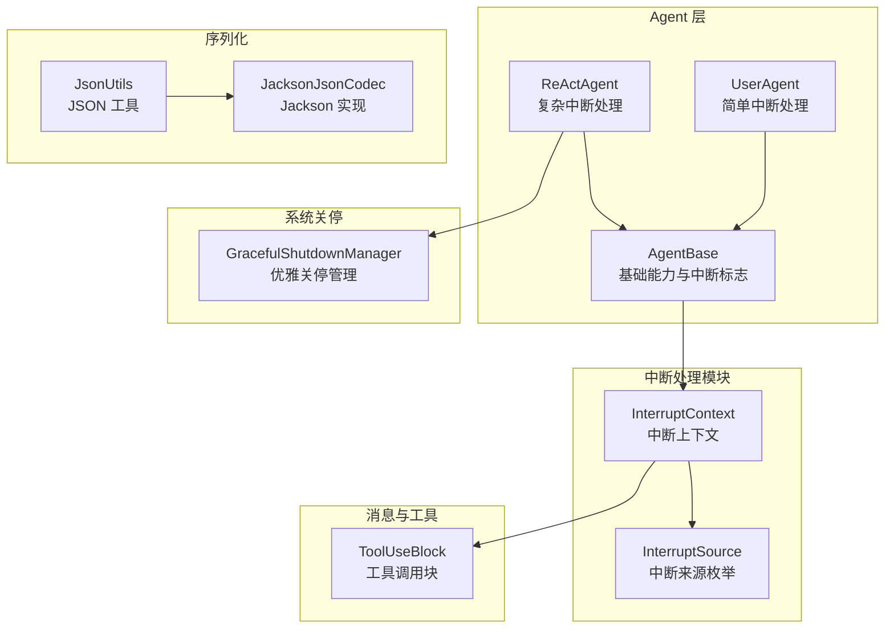
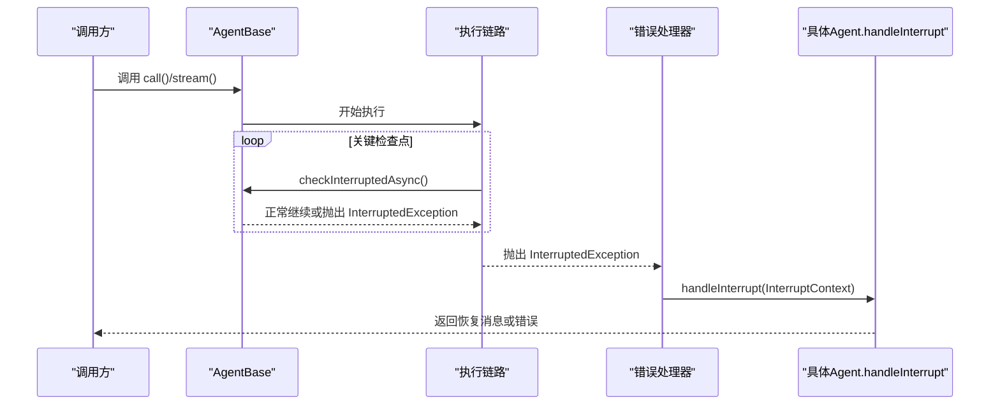
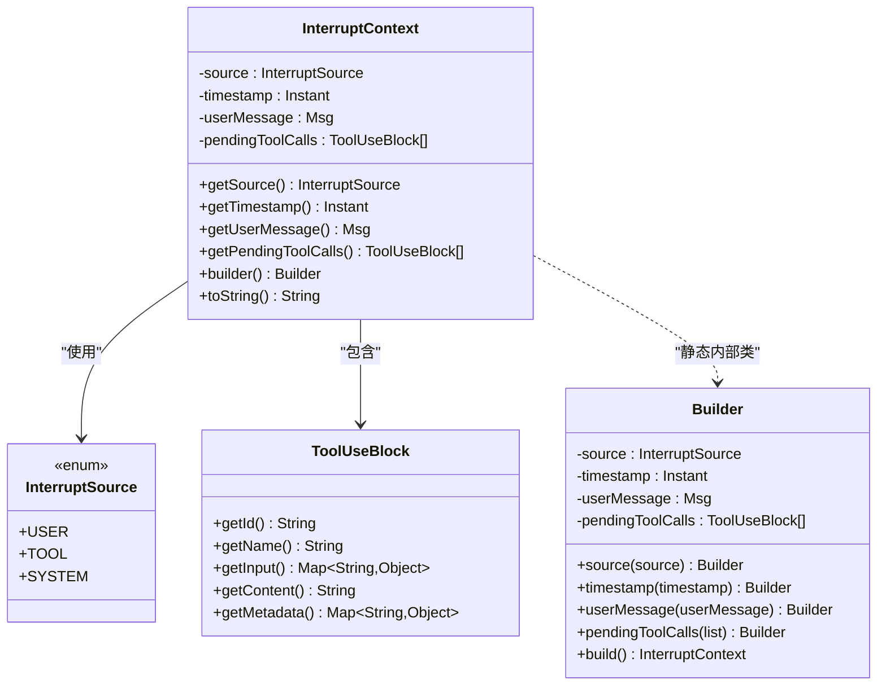
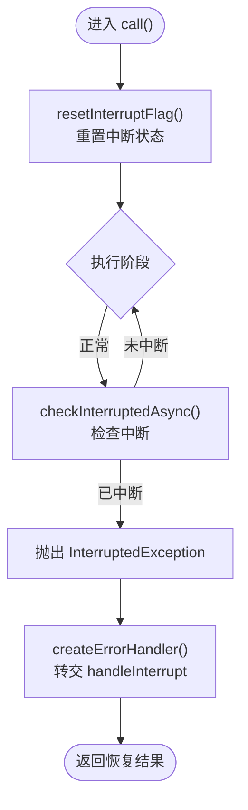
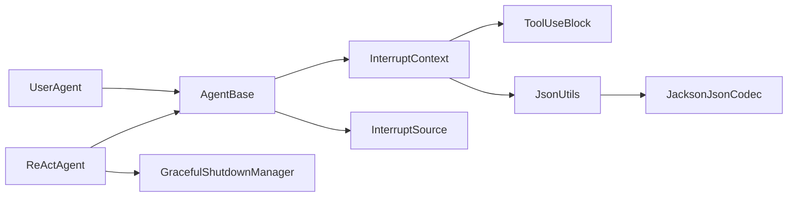

# 中断处理机制

<cite>
**本文引用的文件**
- [InterruptContext.java](file://agentscope-core/src/main/java/io/agentscope/core/interruption/InterruptContext.java)
- [InterruptSource.java](file://agentscope-core/src/main/java/io/agentscope/core/interruption/InterruptSource.java)
- [AgentBase.java](file://agentscope-core/src/main/java/io/agentscope/core/agent/AgentBase.java)
- [UserAgent.java](file://agentscope-core/src/main/java/io/agentscope/core/agent/user/UserAgent.java)
- [ReActAgent.java](file://agentscope-core/src/main/java/io/agentscope/core/ReActAgent.java)
- [InterruptContextTest.java](file://agentscope-core/src/test/java/io/agentscope/core/interruption/InterruptContextTest.java)
- [InterruptSourceTest.java](file://agentscope-core/src/test/java/io/agentscope/core/interruption/InterruptSourceTest.java)
- [JsonUtils.java](file://agentscope-core/src/main/java/io/agentscope/core/util/JsonUtils.java)
- [JacksonJsonCodec.java](file://agentscope-core/src/main/java/io/agentscope/core/util/JacksonJsonCodec.java)
- [ToolUseBlock.java](file://agentscope-core/src/main/java/io/agentscope/core/message/ToolUseBlock.java)
- [GracefulShutdownManager.java](file://agentscope-core/src/main/java/io/agentscope/core/shutdown/GracefulShutdownManager.java)
</cite>

## 目录
1. [简介](#简介)
2. [项目结构](#项目结构)
3. [核心组件](#核心组件)
4. [架构总览](#架构总览)
5. [详细组件分析](#详细组件分析)
6. [依赖关系分析](#依赖关系分析)
7. [性能考量](#性能考量)
8. [故障排查指南](#故障排查指南)
9. [结论](#结论)
10. [附录](#附录)

## 简介
本技术文档围绕 AgentScope Java 的中断处理机制展开，重点解释 InterruptContext 的设计与使用、InterruptSource 的类型与触发条件、中断处理的生命周期（从检测到状态恢复）、不同场景下的处理策略（用户中断、工具调用中断、系统中断），以及中断上下文的序列化与反序列化思路。同时提供最佳实践与常见问题解决方案，并区分“中断”与“取消”的差异及适用场景。

## 项目结构
中断处理相关代码主要位于 agentscope-core 模块中，核心文件包括：
- 中断上下文与来源：io.agentscope.core.interruption 包
- 基类与具体 Agent 实现：io.agentscope.core.agent.*（AgentBase、UserAgent、ReActAgent）
- 工具调用消息结构：io.agentscope.core.message.ToolUseBlock
- JSON 序列化工具：io.agentscope.core.util.JsonUtils、JacksonJsonCodec
- 优雅关停与系统中断：io.agentscope.core.shutdown.GracefulShutdownManager

图表来源
- [InterruptContext.java:40-190](file://agentscope-core/src/main/java/io/agentscope/core/interruption/InterruptContext.java#L40-L190)
- [InterruptSource.java:28-37](file://agentscope-core/src/main/java/io/agentscope/core/interruption/InterruptSource.java#L28-L37)
- [AgentBase.java:342-514](file://agentscope-core/src/main/java/io/agentscope/core/agent/AgentBase.java#L342-L514)
- [UserAgent.java:259-269](file://agentscope-core/src/main/java/io/agentscope/core/agent/user/UserAgent.java#L259-L269)
- [ReActAgent.java:1135-1153](file://agentscope-core/src/main/java/io/agentscope/core/ReActAgent.java#L1135-L1153)
- [ToolUseBlock.java:34-154](file://agentscope-core/src/main/java/io/agentscope/core/message/ToolUseBlock.java#L34-L154)
- [JsonUtils.java:49-153](file://agentscope-core/src/main/java/io/agentscope/core/util/JsonUtils.java#L49-L153)
- [JacksonJsonCodec.java:44-153](file://agentscope-core/src/main/java/io/agentscope/core/util/JacksonJsonCodec.java#L44-L153)
- [GracefulShutdownManager.java:104-266](file://agentscope-core/src/main/java/io/agentscope/core/shutdown/GracefulShutdownManager.java#L104-L266)

章节来源
- [InterruptContext.java:40-190](file://agentscope-core/src/main/java/io/agentscope/core/interruption/InterruptContext.java#L40-L190)
- [InterruptSource.java:28-37](file://agentscope-core/src/main/java/io/agentscope/core/interruption/InterruptSource.java#L28-L37)
- [AgentBase.java:342-514](file://agentscope-core/src/main/java/io/agentscope/core/agent/AgentBase.java#L342-L514)
- [UserAgent.java:259-269](file://agentscope-core/src/main/java/io/agentscope/core/agent/user/UserAgent.java#L259-L269)
- [ReActAgent.java:1135-1153](file://agentscope-core/src/main/java/io/agentscope/core/ReActAgent.java#L1135-L1153)
- [ToolUseBlock.java:34-154](file://agentscope-core/src/main/java/io/agentscope/core/message/ToolUseBlock.java#L34-L154)
- [JsonUtils.java:49-153](file://agentscope-core/src/main/java/io/agentscope/core/util/JsonUtils.java#L49-L153)
- [JacksonJsonCodec.java:44-153](file://agentscope-core/src/main/java/io/agentscope/core/util/JacksonJsonCodec.java#L44-L153)
- [GracefulShutdownManager.java:104-266](file://agentscope-core/src/main/java/io/agentscope/core/shutdown/GracefulShutdownManager.java#L104-L266)

## 核心组件
- 中断来源（InterruptSource）：定义三类中断来源，分别用于区分用户触发、工具逻辑触发、系统触发（如超时或资源限制）。
- 中断上下文（InterruptContext）：封装中断发生的时间戳、来源、用户消息、以及中断时刻的待处理工具调用列表；提供不可变列表以保证线程安全与一致性。
- AgentBase：提供中断标志位、异步中断检查、错误处理桥接（将 InterruptedException 转换为 handleInterrupt 回调）、重置中断状态等通用能力。
- 具体 Agent：
  - UserAgent：在中断时返回简洁的中断提示消息。
  - ReActAgent：根据中断来源决定是触发优雅关停异常还是生成恢复消息并写入记忆。

章节来源
- [InterruptSource.java:28-37](file://agentscope-core/src/main/java/io/agentscope/core/interruption/InterruptSource.java#L28-L37)
- [InterruptContext.java:40-190](file://agentscope-core/src/main/java/io/agentscope/core/interruption/InterruptContext.java#L40-L190)
- [AgentBase.java:342-514](file://agentscope-core/src/main/java/io/agentscope/core/agent/AgentBase.java#L342-L514)
- [UserAgent.java:259-269](file://agentscope-core/src/main/java/io/agentscope/core/agent/user/UserAgent.java#L259-L269)
- [ReActAgent.java:1135-1153](file://agentscope-core/src/main/java/io/agentscope/core/ReActAgent.java#L1135-L1153)

## 架构总览
中断处理贯穿 Reactive 执行链路：AgentBase 在关键检查点通过 Mono.defer 判断中断标志，若被中断则抛出 InterruptedException，由统一错误处理器捕获并转交至 handleInterrupt；不同 Agent 对中断进行差异化处理；系统关停会通过 GracefulShutdownManager 触发 SYSTEM 来源的中断。

图表来源
- [AgentBase.java:372-457](file://agentscope-core/src/main/java/io/agentscope/core/agent/AgentBase.java#L372-L457)
- [ReActAgent.java:1135-1153](file://agentscope-core/src/main/java/io/agentscope/core/ReActAgent.java#L1135-L1153)
- [UserAgent.java:259-269](file://agentscope-core/src/main/java/io/agentscope/core/agent/user/UserAgent.java#L259-L269)

## 详细组件分析

### 中断来源（InterruptSource）
- USER：由用户主动触发，通常来自外部输入或交互命令。
- TOOL：由工具执行逻辑内部触发，例如工具前置校验失败或工具自身要求中断。
- SYSTEM：由系统层面触发，典型场景为优雅关停（Graceful Shutdown）导致的超时或强制中断。

章节来源
- [InterruptSource.java:28-37](file://agentscope-core/src/main/java/io/agentscope/core/interruption/InterruptSource.java#L28-L37)
- [InterruptSourceTest.java:38-132](file://agentscope-core/src/test/java/io/agentscope/core/interruption/InterruptSourceTest.java#L38-L132)

### 中断上下文（InterruptContext）
- 字段与语义
  - 来源（source）：中断来源枚举
  - 时间戳（timestamp）：中断发生时间
  - 用户消息（userMessage）：触发中断的用户消息（可空）
  - 待处理工具调用（pendingToolCalls）：中断发生时未完成的工具调用列表（不可变）
- 构建与配置
  - 提供 Builder 模式，支持设置来源、时间戳、用户消息、待处理工具调用
  - 默认来源为 USER，时间戳默认当前时间，待处理工具调用默认为空列表
- 查询与不变性
  - 获取器方法提供只读访问
  - 内部对工具调用列表进行防御性拷贝，确保对外部修改不可见
- 测试覆盖
  - Builder 各字段组合、默认值、空值处理、不可变性、toString 格式、边界情况等

图表来源
- [InterruptContext.java:40-190](file://agentscope-core/src/main/java/io/agentscope/core/interruption/InterruptContext.java#L40-L190)
- [InterruptSource.java:28-37](file://agentscope-core/src/main/java/io/agentscope/core/interruption/InterruptSource.java#L28-L37)
- [ToolUseBlock.java:34-154](file://agentscope-core/src/main/java/io/agentscope/core/message/ToolUseBlock.java#L34-L154)

章节来源
- [InterruptContext.java:40-190](file://agentscope-core/src/main/java/io/agentscope/core/interruption/InterruptContext.java#L40-L190)
- [InterruptContextTest.java:50-302](file://agentscope-core/src/test/java/io/agentscope/core/interruption/InterruptContextTest.java#L50-L302)

### AgentBase 中断机制
- 中断标志与检查
  - interrupt(InterruptSource) 设置中断标志与来源，默认来源为空时回退为 SYSTEM
  - checkInterruptedAsync() 在 Reactive 链中作为检查点，若中断则抛出 InterruptedException
  - resetInterruptFlag() 在每次 call() 开始前重置中断状态，避免跨次调用污染
- 错误处理桥接
  - createErrorHandler() 将 InterruptedException 特判并转交 handleInterrupt，其他错误走常规通知流程
- 抽象回调
  - handleInterrupt(InterruptContext, originalArgs) 由子类实现，负责中断后的恢复逻辑

图表来源
- [AgentBase.java:342-457](file://agentscope-core/src/main/java/io/agentscope/core/agent/AgentBase.java#L342-L457)
- [AgentBase.java:397-402](file://agentscope-core/src/main/java/io/agentscope/core/agent/AgentBase.java#L397-L402)
- [AgentBase.java:514](file://agentscope-core/src/main/java/io/agentscope/core/agent/AgentBase.java#L514)

章节来源
- [AgentBase.java:342-514](file://agentscope-core/src/main/java/io/agentscope/core/agent/AgentBase.java#L342-L514)

### UserAgent 中断处理
- 处理策略：直接构造一条用户角色的中断提示消息并返回，适合无状态或轻量级 Agent。

章节来源
- [UserAgent.java:259-269](file://agentscope-core/src/main/java/io/agentscope/core/agent/user/UserAgent.java#L259-L269)

### ReActAgent 中断处理
- 处理策略：
  - 若来源为 SYSTEM（系统中断），保存当前状态并抛出 AgentShuttingDownException，交由关停流程处理
  - 否则生成恢复消息写入记忆并返回给用户
- 与关停管理器协作：在观察到 SYSTEM 中断时调用 saveOnInterruptObserved 保存会话

章节来源
- [ReActAgent.java:1135-1153](file://agentscope-core/src/main/java/io/agentscope/core/ReActAgent.java#L1135-L1153)
- [GracefulShutdownManager.java:194-196](file://agentscope-core/src/main/java/io/agentscope/core/shutdown/GracefulShutdownManager.java#L194-L196)

### 中断生命周期与状态恢复
- 生命周期阶段
  - 中断检测：在关键检查点调用 checkInterruptedAsync()，若中断则抛错
  - 上下文构建：createInterruptContext() 基于当前中断来源与用户消息生成 InterruptContext
  - 错误桥接：createErrorHandler() 将 InterruptedException 转交 handleInterrupt
  - 恢复处理：具体 Agent 根据来源与上下文生成恢复消息或触发关停
  - 状态清理：resetInterruptFlag() 清除中断标志与用户消息，准备下一次调用
- 状态恢复要点
  - 用户中断：返回明确的中断提示，必要时记录到记忆
  - 工具中断：依据工具调用上下文决定是否恢复或终止
  - 系统中断：优先保存状态并按关停策略处理

章节来源
- [AgentBase.java:372-402](file://agentscope-core/src/main/java/io/agentscope/core/agent/AgentBase.java#L372-L402)
- [AgentBase.java:449-457](file://agentscope-core/src/main/java/io/agentscope/core/agent/AgentBase.java#L449-L457)
- [AgentBase.java:385-389](file://agentscope-core/src/main/java/io/agentscope/core/agent/AgentBase.java#L385-L389)

### 不同场景的处理策略
- 用户中断（USER）
  - 行为：快速响应并给出明确反馈，避免继续消耗资源
  - 示例：UserAgent 返回中断提示消息
- 工具调用中断（TOOL）
  - 行为：结合 ToolUseBlock 的上下文（如部分参数、片段内容）进行稳健处理
  - 注意：当工具调用处于流式传输中且被中断时，需确保参数解析为有效 JSON，避免发送非法请求
- 系统中断（SYSTEM）
  - 行为：优先保存状态，随后按关停策略处理（如超时强制中断）
  - ReActAgent：抛出关停异常，交由关停管理器统一处理

章节来源
- [InterruptSource.java:28-37](file://agentscope-core/src/main/java/io/agentscope/core/interruption/InterruptSource.java#L28-L37)
- [UserAgent.java:259-269](file://agentscope-core/src/main/java/io/agentscope/core/agent/user/UserAgent.java#L259-L269)
- [ReActAgent.java:1135-1153](file://agentscope-core/src/main/java/io/agentscope/core/ReActAgent.java#L1135-L1153)
- [JsonUtils.java:133-151](file://agentscope-core/src/main/java/io/agentscope/core/util/JsonUtils.java#L133-L151)

### 中断上下文的序列化与反序列化
- 使用建议
  - 通过 JsonUtils.getJsonCodec() 获取全局 JSON 编解码器实例
  - 使用 toJson() 将 InterruptContext 序列化为字符串，便于日志、持久化或跨进程传递
  - 使用 fromJson() 将字符串反序列化为对象，注意字段映射与类型匹配
- 参数解析健壮性
  - 当工具调用处于流式传输且被中断时，应使用 JsonUtils.resolveToolCallArgsJson() 确保参数为合法 JSON 对象，避免模型 API 拒绝请求

章节来源
- [JsonUtils.java:49-153](file://agentscope-core/src/main/java/io/agentscope/core/util/JsonUtils.java#L49-L153)
- [JacksonJsonCodec.java:44-153](file://agentscope-core/src/main/java/io/agentscope/core/util/JacksonJsonCodec.java#L44-L153)
- [JsonUtils.java:133-151](file://agentscope-core/src/main/java/io/agentscope/core/util/JsonUtils.java#L133-L151)

## 依赖关系分析
- 组件耦合
  - AgentBase 与 InterruptContext/InterruptSource 强关联，提供中断检查与错误桥接
  - ReActAgent/ UserAgent 通过继承 AgentBase 并实现 handleInterrupt 定制中断行为
  - 工具调用上下文依赖 ToolUseBlock，参数解析依赖 JsonUtils/JacksonJsonCodec
  - 系统关停通过 GracefulShutdownManager 触发 SYSTEM 中断
- 外部依赖
  - JSON 编解码：默认 JacksonJsonCodec，可替换为其他实现
  - Reactive：基于 Reactor Mono，中断检查采用 defer 与错误传播

图表来源
- [AgentBase.java:342-514](file://agentscope-core/src/main/java/io/agentscope/core/agent/AgentBase.java#L342-L514)
- [InterruptContext.java:40-190](file://agentscope-core/src/main/java/io/agentscope/core/interruption/InterruptContext.java#L40-L190)
- [InterruptSource.java:28-37](file://agentscope-core/src/main/java/io/agentscope/core/interruption/InterruptSource.java#L28-L37)
- [UserAgent.java:259-269](file://agentscope-core/src/main/java/io/agentscope/core/agent/user/UserAgent.java#L259-L269)
- [ReActAgent.java:1135-1153](file://agentscope-core/src/main/java/io/agentscope/core/ReActAgent.java#L1135-L1153)
- [GracefulShutdownManager.java:194-196](file://agentscope-core/src/main/java/io/agentscope/core/shutdown/GracefulShutdownManager.java#L194-L196)
- [ToolUseBlock.java:34-154](file://agentscope-core/src/main/java/io/agentscope/core/message/ToolUseBlock.java#L34-L154)
- [JsonUtils.java:49-153](file://agentscope-core/src/main/java/io/agentscope/core/util/JsonUtils.java#L49-L153)
- [JacksonJsonCodec.java:44-153](file://agentscope-core/src/main/java/io/agentscope/core/util/JacksonJsonCodec.java#L44-L153)

章节来源
- [AgentBase.java:342-514](file://agentscope-core/src/main/java/io/agentscope/core/agent/AgentBase.java#L342-L514)
- [InterruptContext.java:40-190](file://agentscope-core/src/main/java/io/agentscope/core/interruption/InterruptContext.java#L40-L190)
- [InterruptSource.java:28-37](file://agentscope-core/src/main/java/io/agentscope/core/interruption/InterruptSource.java#L28-L37)
- [UserAgent.java:259-269](file://agentscope-core/src/main/java/io/agentscope/core/agent/user/UserAgent.java#L259-L269)
- [ReActAgent.java:1135-1153](file://agentscope-core/src/main/java/io/agentscope/core/ReActAgent.java#L1135-L1153)
- [GracefulShutdownManager.java:194-196](file://agentscope-core/src/main/java/io/agentscope/core/shutdown/GracefulShutdownManager.java#L194-L196)
- [ToolUseBlock.java:34-154](file://agentscope-core/src/main/java/io/agentscope/core/message/ToolUseBlock.java#L34-L154)
- [JsonUtils.java:49-153](file://agentscope-core/src/main/java/io/agentscope/core/util/JsonUtils.java#L49-L153)
- [JacksonJsonCodec.java:44-153](file://agentscope-core/src/main/java/io/agentscope/core/util/JacksonJsonCodec.java#L44-L153)

## 性能考量
- 中断检查频率
  - 在复杂 Agent（如 ReActAgent）中，应在推理、行动、工具调用前后以及流式分片处设置检查点，避免长时间阻塞无法及时响应
- 错误路径开销
  - InterruptedException 的抛出与捕获成本较低，但频繁中断可能影响用户体验，建议在高频检查点间增加批量处理
- JSON 解析健壮性
  - 工具调用参数解析失败时回退到空对象，减少异常传播风险；建议在上游严格校验参数格式，降低解析失败概率

## 故障排查指南
- 常见问题
  - 中断后未恢复：确认是否在 handleInterrupt 中正确生成恢复消息或触发关停
  - 工具调用参数不合法：使用 JsonUtils.resolveToolCallArgsJson() 确保参数为合法 JSON 对象
  - 中断标志未清除：确保在每次 call() 开始前调用 resetInterruptFlag()
  - 系统关停超时：检查 GracefulShutdownManager 的超时配置与监控线程
- 排查步骤
  - 检查中断来源（USER/TOOL/SYSTEM）与对应处理分支
  - 校验 InterruptContext 的字段完整性（时间戳、用户消息、待处理工具调用）
  - 验证 JSON 编解码器实现与自定义替换情况

章节来源
- [AgentBase.java:385-389](file://agentscope-core/src/main/java/io/agentscope/core/agent/AgentBase.java#L385-L389)
- [JsonUtils.java:133-151](file://agentscope-core/src/main/java/io/agentscope/core/util/JsonUtils.java#L133-L151)
- [GracefulShutdownManager.java:242-266](file://agentscope-core/src/main/java/io/agentscope/core/shutdown/GracefulShutdownManager.java#L242-L266)

## 结论
AgentScope Java 的中断处理机制以 InterruptContext 和 InterruptSource 为核心，配合 AgentBase 的中断检查与错误桥接，在 Reactive 执行链路中实现了对用户、工具与系统的统一中断管理。通过 ReActAgent 与 UserAgent 的差异化处理，以及与关停管理器的协同，系统能够在多种场景下稳定地进行状态恢复与资源释放。借助 JsonUtils/JacksonJsonCodec 的 JSON 能力，中断上下文可被可靠地序列化与反序列化，满足日志、持久化与跨进程通信需求。

## 附录
- 最佳实践
  - 在复杂 Agent 的每个关键阶段插入 checkInterruptedAsync() 检查点
  - 明确区分 USER/TOOL/SYSTEM 三类中断来源，针对不同来源制定差异化恢复策略
  - 对工具调用参数进行健壮性解析，避免因中断导致的非法参数传播
  - 在 handleInterrupt 中保存必要的上下文（如记忆、会话），确保恢复一致性
- 中断与取消的区别
  - 中断（Interrupt）：由外部事件（用户、工具、系统）触发，需要恢复与补偿
  - 取消（Cancellation）：通常指调用方主动终止请求，侧重快速停止执行，不一定需要恢复