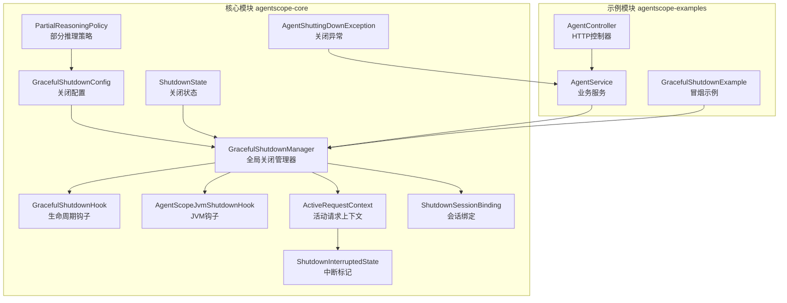
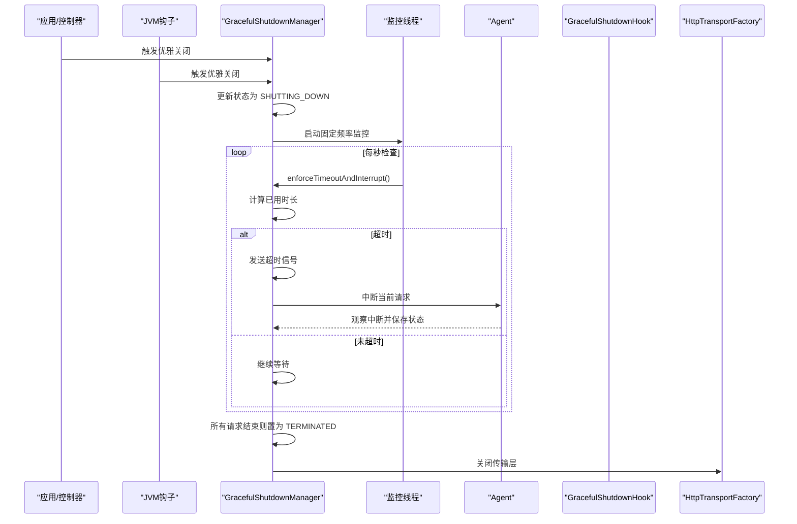
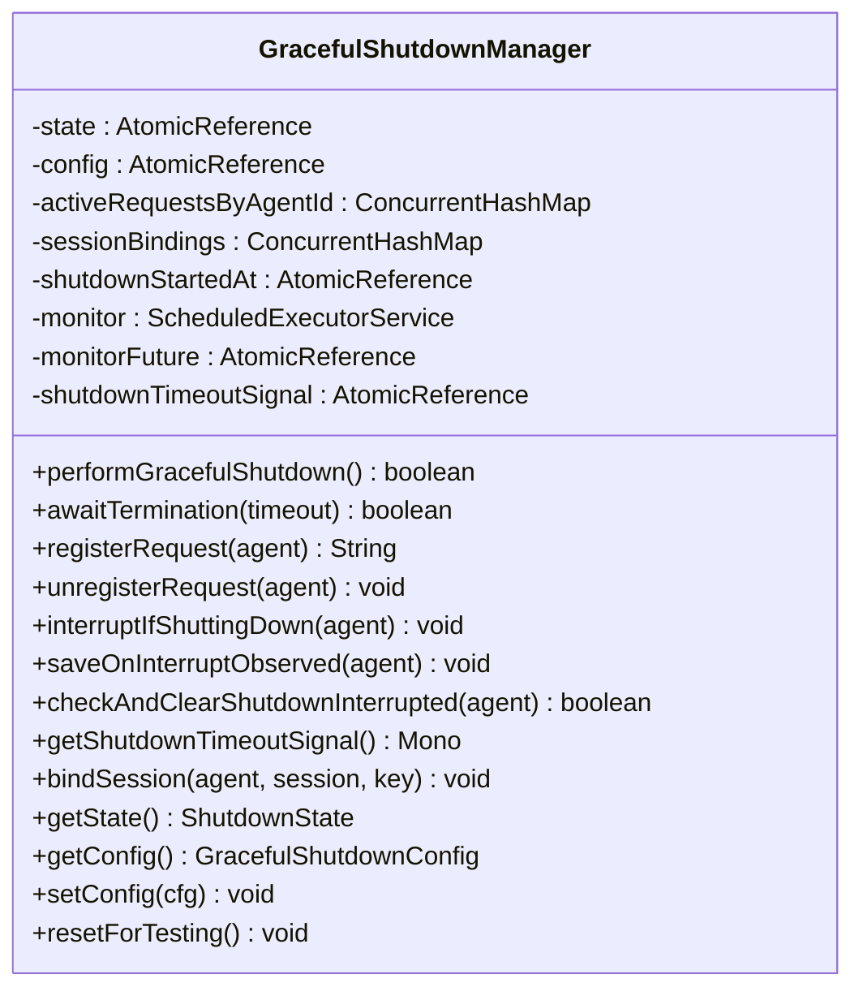
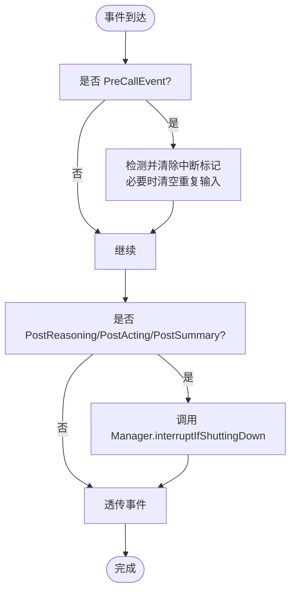
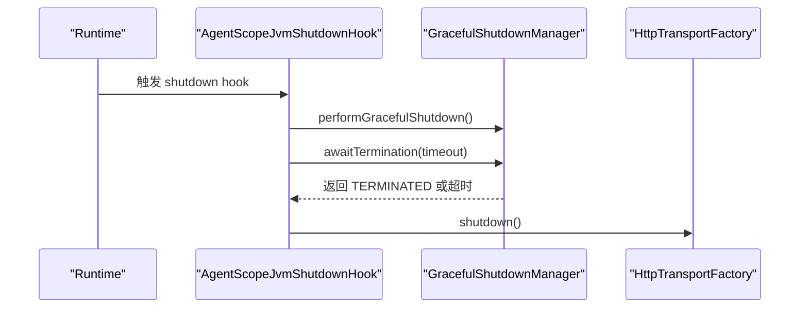
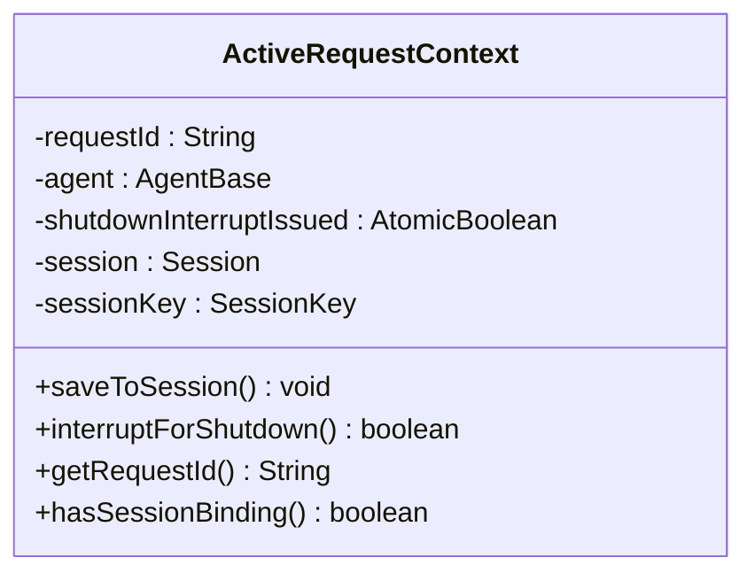
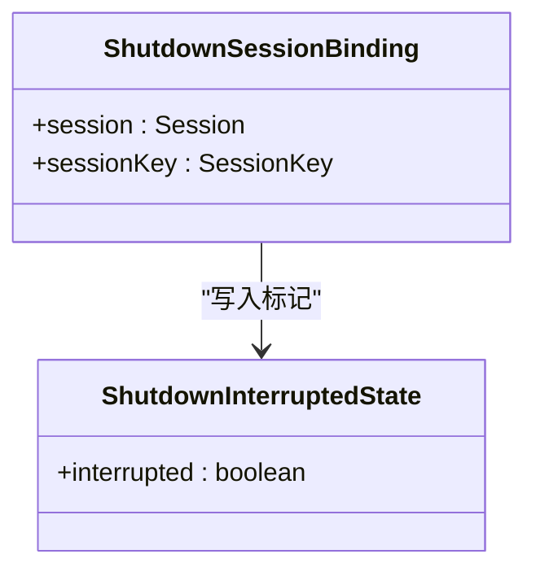
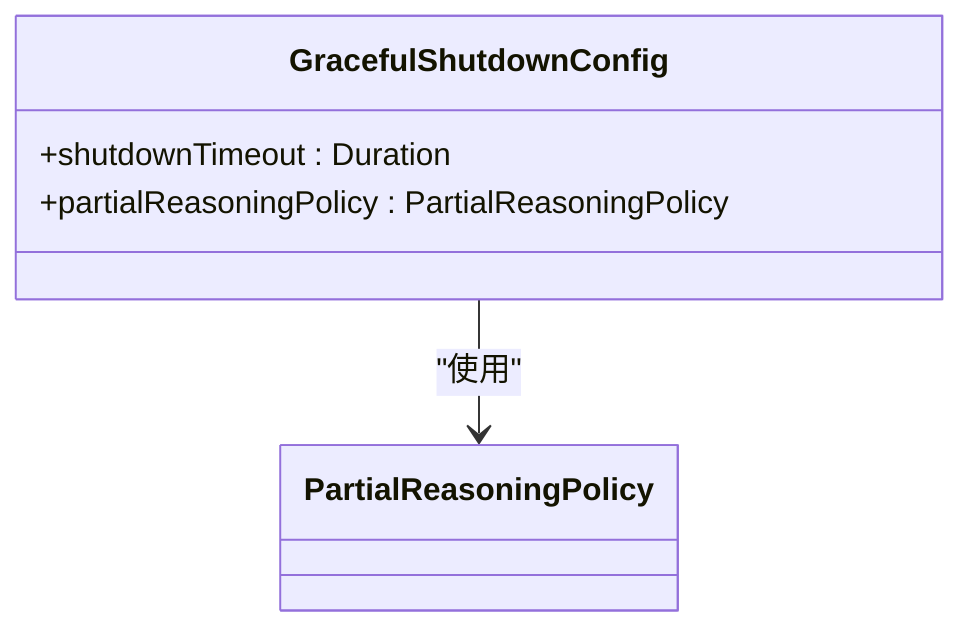
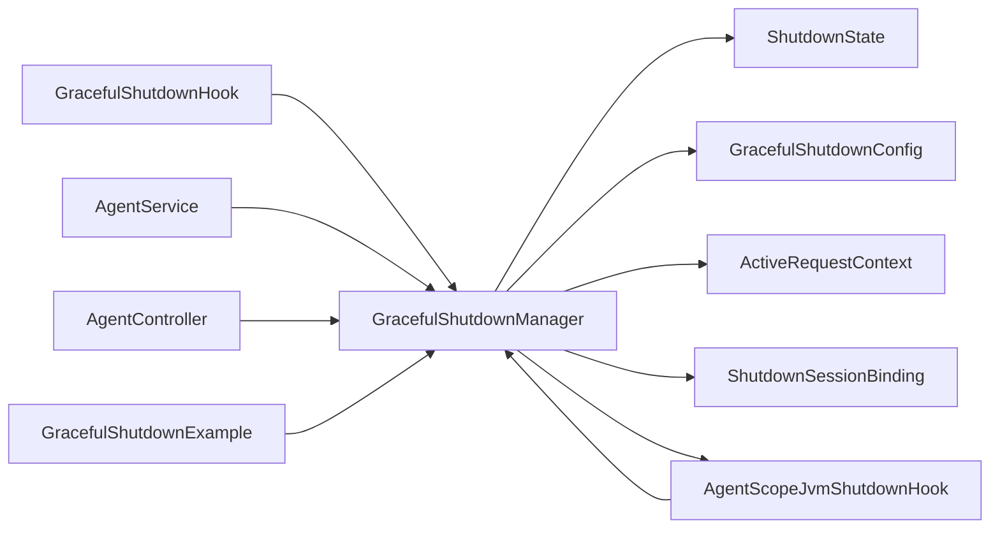

# 优雅关闭管理

<cite>
**本文引用的文件**   
- [GracefulShutdownManager.java](file://agentscope-core/src/main/java/io/agentscope/core/shutdown/GracefulShutdownManager.java)
- [GracefulShutdownHook.java](file://agentscope-core/src/main/java/io/agentscope/core/shutdown/GracefulShutdownHook.java)
- [GracefulShutdownConfig.java](file://agentscope-core/src/main/java/io/agentscope/core/shutdown/GracefulShutdownConfig.java)
- [ShutdownState.java](file://agentscope-core/src/main/java/io/agentscope/core/shutdown/ShutdownState.java)
- [AgentScopeJvmShutdownHook.java](file://agentscope-core/src/main/java/io/agentscope/core/shutdown/AgentScopeJvmShutdownHook.java)
- [ActiveRequestContext.java](file://agentscope-core/src/main/java/io/agentscope/core/shutdown/ActiveRequestContext.java)
- [ShutdownInterruptedState.java](file://agentscope-core/src/main/java/io/agentscope/core/shutdown/ShutdownInterruptedState.java)
- [ShutdownSessionBinding.java](file://agentscope-core/src/main/java/io/agentscope/core/shutdown/ShutdownSessionBinding.java)
- [PartialReasoningPolicy.java](file://agentscope-core/src/main/java/io/agentscope/core/shutdown/PartialReasoningPolicy.java)
- [AgentShuttingDownException.java](file://agentscope-core/src/main/java/io/agentscope/core/shutdown/AgentShuttingDownException.java)
- [GracefulShutdownExample.java](file://agentscope-examples/graceful-shutdown/src/main/java/io/agentscope/examples/shutdown/smoke/GracefulShutdownExample.java)
- [AgentService.java](file://agentscope-examples/graceful-shutdown/src/main/java/io/agentscope/examples/shutdown/e2e/AgentService.java)
- [AgentController.java](file://agentscope-examples/graceful-shutdown/src/main/java/io/agentscope/examples/shutdown/e2e/AgentController.java)
</cite>

## 目录
1. [简介](#简介)
2. [项目结构](#项目结构)
3. [核心组件](#核心组件)
4. [架构总览](#架构总览)
5. [详细组件分析](#详细组件分析)
6. [依赖关系分析](#依赖关系分析)
7. [性能考量](#性能考量)
8. [故障排除指南](#故障排除指南)
9. [结论](#结论)
10. [附录](#附录)

## 简介
本文件系统性阐述 AgentScope Java 的优雅关闭管理系统，围绕 GracefulShutdownManager 的架构与工作原理展开，覆盖关闭流程协调、资源管理、钩子机制、配置项、状态管理、监控与日志、生产最佳实践与故障排除。读者可据此在生产环境中安全地触发与处理优雅关闭，确保会话状态持久化、输出不被浪费、请求可中断且可恢复。

## 项目结构
优雅关闭相关代码集中在 agentscope-core 的 shutdown 包中，示例与端到端测试位于 agentscope-examples/graceful-shutdown 模块，便于演示与验证。

图表来源
- [GracefulShutdownManager.java:41-321](file://agentscope-core/src/main/java/io/agentscope/core/shutdown/GracefulShutdownManager.java#L41-L321)
- [GracefulShutdownHook.java:54-104](file://agentscope-core/src/main/java/io/agentscope/core/shutdown/GracefulShutdownHook.java#L54-L104)
- [AgentScopeJvmShutdownHook.java:34-71](file://agentscope-core/src/main/java/io/agentscope/core/shutdown/AgentScopeJvmShutdownHook.java#L34-L71)
- [GracefulShutdownConfig.java:36-70](file://agentscope-core/src/main/java/io/agentscope/core/shutdown/GracefulShutdownConfig.java#L36-L70)
- [ShutdownState.java:21-26](file://agentscope-core/src/main/java/io/agentscope/core/shutdown/ShutdownState.java#L21-L26)
- [ActiveRequestContext.java:29-78](file://agentscope-core/src/main/java/io/agentscope/core/shutdown/ActiveRequestContext.java#L29-L78)
- [ShutdownInterruptedState.java:27-28](file://agentscope-core/src/main/java/io/agentscope/core/shutdown/ShutdownInterruptedState.java#L27-L28)
- [ShutdownSessionBinding.java:25-32](file://agentscope-core/src/main/java/io/agentscope/core/shutdown/ShutdownSessionBinding.java#L25-L32)
- [PartialReasoningPolicy.java:21-25](file://agentscope-core/src/main/java/io/agentscope/core/shutdown/PartialReasoningPolicy.java#L21-L25)
- [AgentShuttingDownException.java:21-34](file://agentscope-core/src/main/java/io/agentscope/core/shutdown/AgentShuttingDownException.java#L21-L34)
- [GracefulShutdownExample.java:72-106](file://agentscope-examples/graceful-shutdown/src/main/java/io/agentscope/examples/shutdown/smoke/GracefulShutdownExample.java#L72-L106)
- [AgentService.java:48-104](file://agentscope-examples/graceful-shutdown/src/main/java/io/agentscope/examples/shutdown/e2e/AgentService.java#L48-L104)
- [AgentController.java:35-103](file://agentscope-examples/graceful-shutdown/src/main/java/io/agentscope/examples/shutdown/e2e/AgentController.java#L35-L103)

章节来源
- [GracefulShutdownManager.java:41-321](file://agentscope-core/src/main/java/io/agentscope/core/shutdown/GracefulShutdownManager.java#L41-L321)
- [GracefulShutdownHook.java:54-104](file://agentscope-core/src/main/java/io/agentscope/core/shutdown/GracefulShutdownHook.java#L54-L104)
- [GracefulShutdownConfig.java:36-70](file://agentscope-core/src/main/java/io/agentscope/core/shutdown/GracefulShutdownConfig.java#L36-L70)
- [AgentScopeJvmShutdownHook.java:34-71](file://agentscope-core/src/main/java/io/agentscope/core/shutdown/AgentScopeJvmShutdownHook.java#L34-L71)
- [GracefulShutdownExample.java:72-106](file://agentscope-examples/graceful-shutdown/src/main/java/io/agentscope/examples/shutdown/smoke/GracefulShutdownExample.java#L72-L106)
- [AgentService.java:48-104](file://agentscope-examples/graceful-shutdown/src/main/java/io/agentscope/examples/shutdown/e2e/AgentService.java#L48-L104)
- [AgentController.java:35-103](file://agentscope-examples/graceful-shutdown/src/main/java/io/agentscope/examples/shutdown/e2e/AgentController.java#L35-L103)

## 核心组件
- 全局关闭管理器：负责状态机、活动请求跟踪、超时监控、强制中断与终止等待。
- 生命周期钩子：在关键事件点（推理后、行动后、总结后）进行关闭检查与中断。
- JVM 关闭钩子：响应 SIGTERM，触发优雅关闭并等待终止。
- 配置对象：定义关闭超时与部分推理策略。
- 请求上下文：封装单次请求的会话保存、中断触发与状态标记。
- 异常类型：用于对外抛出“正在关闭”的语义化异常。
- 示例与控制器：演示如何配置、触发与观察优雅关闭行为。

章节来源
- [GracefulShutdownManager.java:41-321](file://agentscope-core/src/main/java/io/agentscope/core/shutdown/GracefulShutdownManager.java#L41-L321)
- [GracefulShutdownHook.java:54-104](file://agentscope-core/src/main/java/io/agentscope/core/shutdown/GracefulShutdownHook.java#L54-L104)
- [GracefulShutdownConfig.java:36-70](file://agentscope-core/src/main/java/io/agentscope/core/shutdown/GracefulShutdownConfig.java#L36-L70)
- [ActiveRequestContext.java:29-78](file://agentscope-core/src/main/java/io/agentscope/core/shutdown/ActiveRequestContext.java#L29-L78)
- [AgentShuttingDownException.java:21-34](file://agentscope-core/src/main/java/io/agentscope/core/shutdown/AgentShuttingDownException.java#L21-L34)
- [GracefulShutdownExample.java:72-106](file://agentscope-examples/graceful-shutdown/src/main/java/io/agentscope/examples/shutdown/smoke/GracefulShutdownExample.java#L72-L106)
- [AgentService.java:48-104](file://agentscope-examples/graceful-shutdown/src/main/java/io/agentscope/examples/shutdown/e2e/AgentService.java#L48-L104)
- [AgentController.java:35-103](file://agentscope-examples/graceful-shutdown/src/main/java/io/agentscope/examples/shutdown/e2e/AgentController.java#L35-L103)

## 架构总览
优雅关闭由“应用触发或 JVM 钩子触发”开始，进入“拒绝新请求、在安全点中断现有请求、持久化状态”，随后“等待所有请求完成或超时”，最后“关闭传输层”。整个过程通过状态机与定时监控保障一致性。

图表来源
- [AgentScopeJvmShutdownHook.java:43-71](file://agentscope-core/src/main/java/io/agentscope/core/shutdown/AgentScopeJvmShutdownHook.java#L43-L71)
- [GracefulShutdownManager.java:198-303](file://agentscope-core/src/main/java/io/agentscope/core/shutdown/GracefulShutdownManager.java#L198-L303)
- [GracefulShutdownHook.java:64-81](file://agentscope-core/src/main/java/io/agentscope/core/shutdown/GracefulShutdownHook.java#L64-L81)

## 详细组件分析

### GracefulShutdownManager：全局关闭协调者
- 单例管理器，持有全局状态、配置、活动请求映射、会话绑定、监控线程与超时信号。
- 提供注册/注销请求、在安全点中断、阻塞等待终止等能力。
- 超时逻辑：基于启动时间与配置超时计算，到达阈值后发出超时信号并强制中断剩余请求。
- 终止条件：当活动请求数归零且处于关闭中时，切换为已终止并通知等待方。

图表来源
- [GracefulShutdownManager.java:41-321](file://agentscope-core/src/main/java/io/agentscope/core/shutdown/GracefulShutdownManager.java#L41-L321)

章节来源
- [GracefulShutdownManager.java:41-321](file://agentscope-core/src/main/java/io/agentscope/core/shutdown/GracefulShutdownManager.java#L41-L321)

### GracefulShutdownHook：生命周期钩子
- 在 PreCallEvent 阶段检测“从关闭中断会话恢复”的重复输入并去重。
- 在推理后、行动后、总结后三个安全点，若系统处于关闭中，则对对应 Agent 进行中断。
- 该钩子与 Manager 协作，确保在不浪费输出的前提下完成中断。

图表来源
- [GracefulShutdownHook.java:64-97](file://agentscope-core/src/main/java/io/agentscope/core/shutdown/GracefulShutdownHook.java#L64-L97)

章节来源
- [GracefulShutdownHook.java:54-104](file://agentscope-core/src/main/java/io/agentscope/core/shutdown/GracefulShutdownHook.java#L54-L104)

### AgentScopeJvmShutdownHook：JVM 钩子
- 注册一次性的 Runtime shutdown hook，在收到信号时：
  - 触发优雅关闭；
  - 基于配置超时加宽限期等待终止；
  - 最终关闭 HTTP 传输层，保证资源有序释放。

图表来源
- [AgentScopeJvmShutdownHook.java:43-71](file://agentscope-core/src/main/java/io/agentscope/core/shutdown/AgentScopeJvmShutdownHook.java#L43-L71)

章节来源
- [AgentScopeJvmShutdownHook.java:34-71](file://agentscope-core/src/main/java/io/agentscope/core/shutdown/AgentScopeJvmShutdownHook.java#L34-L71)

### ActiveRequestContext：活动请求上下文
- 记录单次请求的标识、Agent、会话与键，负责在中断时保存状态并在首次中断时触发系统中断。
- 使用原子布尔避免重复中断。

图表来源
- [ActiveRequestContext.java:29-78](file://agentscope-core/src/main/java/io/agentscope/core/shutdown/ActiveRequestContext.java#L29-L78)

章节来源
- [ActiveRequestContext.java:29-78](file://agentscope-core/src/main/java/io/agentscope/core/shutdown/ActiveRequestContext.java#L29-L78)

### ShutdownSessionBinding 与 ShutdownInterruptedState：会话绑定与中断标记
- 将 Agent 的会话与键绑定，以便在中断时写入“已中断”标记，支持恢复时去重。
- 标记以状态对象形式存储，便于序列化与读取。

图表来源
- [ShutdownSessionBinding.java:25-32](file://agentscope-core/src/main/java/io/agentscope/core/shutdown/ShutdownSessionBinding.java#L25-L32)
- [ShutdownInterruptedState.java:27-28](file://agentscope-core/src/main/java/io/agentscope/core/shutdown/ShutdownInterruptedState.java#L27-L28)

章节来源
- [ShutdownSessionBinding.java:25-32](file://agentscope-core/src/main/java/io/agentscope/core/shutdown/ShutdownSessionBinding.java#L25-L32)
- [ShutdownInterruptedState.java:27-28](file://agentscope-core/src/main/java/io/agentscope/core/shutdown/ShutdownInterruptedState.java#L27-L28)

### GracefulShutdownConfig：关闭配置
- 包含关闭超时与部分推理策略；默认无限等待并保存部分推理。
- 提供构造校验：策略不可为空，超时必须为正或空。

图表来源
- [GracefulShutdownConfig.java:36-70](file://agentscope-core/src/main/java/io/agentscope/core/shutdown/GracefulShutdownConfig.java#L36-L70)
- [PartialReasoningPolicy.java:21-25](file://agentscope-core/src/main/java/io/agentscope/core/shutdown/PartialReasoningPolicy.java#L21-L25)

章节来源
- [GracefulShutdownConfig.java:36-70](file://agentscope-core/src/main/java/io/agentscope/core/shutdown/GracefulShutdownConfig.java#L36-L70)
- [PartialReasoningPolicy.java:21-25](file://agentscope-core/src/main/java/io/agentscope/core/shutdown/PartialReasoningPolicy.java#L21-L25)

### AgentShuttingDownException：关闭异常
- 对外抛出的语义化异常，提示用户“系统正在关闭，请重试”。

章节来源
- [AgentShuttingDownException.java:21-34](file://agentscope-core/src/main/java/io/agentscope/core/shutdown/AgentShuttingDownException.java#L21-L34)

### 示例与集成：冒烟示例与端到端控制器
- 冒烟示例展示多种场景：工具执行超时、推理阶段超时、超过超时的工具执行、业务恢复。
- 端到端控制器提供健康检查、触发关闭、聊天接口；业务服务负责捕获关闭异常并返回友好错误码。

章节来源
- [GracefulShutdownExample.java:72-106](file://agentscope-examples/graceful-shutdown/src/main/java/io/agentscope/examples/shutdown/smoke/GracefulShutdownExample.java#L72-L106)
- [AgentController.java:35-103](file://agentscope-examples/graceful-shutdown/src/main/java/io/agentscope/examples/shutdown/e2e/AgentController.java#L35-L103)
- [AgentService.java:48-104](file://agentscope-examples/graceful-shutdown/src/main/java/io/agentscope/examples/shutdown/e2e/AgentService.java#L48-L104)

## 依赖关系分析
- 管理器依赖状态枚举、配置、请求上下文、会话绑定、JVM 钩子与 Reactor 信号源。
- 钩子依赖管理器与框架事件模型。
- JVM 钩子依赖管理器与传输工厂。
- 示例与控制器依赖管理器与服务层。

图表来源
- [GracefulShutdownManager.java:41-321](file://agentscope-core/src/main/java/io/agentscope/core/shutdown/GracefulShutdownManager.java#L41-L321)
- [GracefulShutdownHook.java:54-104](file://agentscope-core/src/main/java/io/agentscope/core/shutdown/GracefulShutdownHook.java#L54-L104)
- [AgentScopeJvmShutdownHook.java:34-71](file://agentscope-core/src/main/java/io/agentscope/core/shutdown/AgentScopeJvmShutdownHook.java#L34-L71)
- [GracefulShutdownConfig.java:36-70](file://agentscope-core/src/main/java/io/agentscope/core/shutdown/GracefulShutdownConfig.java#L36-L70)
- [ShutdownState.java:21-26](file://agentscope-core/src/main/java/io/agentscope/core/shutdown/ShutdownState.java#L21-L26)
- [ActiveRequestContext.java:29-78](file://agentscope-core/src/main/java/io/agentscope/core/shutdown/ActiveRequestContext.java#L29-L78)
- [ShutdownSessionBinding.java:25-32](file://agentscope-core/src/main/java/io/agentscope/core/shutdown/ShutdownSessionBinding.java#L25-L32)
- [AgentService.java:48-104](file://agentscope-examples/graceful-shutdown/src/main/java/io/agentscope/examples/shutdown/e2e/AgentService.java#L48-L104)
- [AgentController.java:35-103](file://agentscope-examples/graceful-shutdown/src/main/java/io/agentscope/examples/shutdown/e2e/AgentController.java#L35-L103)
- [GracefulShutdownExample.java:72-106](file://agentscope-examples/graceful-shutdown/src/main/java/io/agentscope/examples/shutdown/smoke/GracefulShutdownExample.java#L72-L106)

## 性能考量
- 监控线程采用固定频率轮询，开销极低；仅在关闭中运行。
- 请求注册/注销为并发映射操作，尽量减少锁竞争。
- 超时信号使用 Reactor Sink，避免阻塞式广播。
- 建议在高并发场景下合理设置关闭超时，避免过长导致停机窗口过大。

## 故障排除指南
- 现象：请求长时间无法中断
  - 排查：确认是否处于安全点；检查钩子是否正确注册；确认会话保存是否成功。
  - 参考：[GracefulShutdownHook.java:64-81](file://agentscope-core/src/main/java/io/agentscope/core/shutdown/GracefulShutdownHook.java#L64-L81)、[ActiveRequestContext.java:58-76](file://agentscope-core/src/main/java/io/agentscope/core/shutdown/ActiveRequestContext.java#L58-L76)
- 现象：关闭后仍有活跃请求
  - 排查：确认 awaitTermination 是否被调用；检查超时设置是否过短；核对传输层关闭时机。
  - 参考：[GracefulShutdownManager.java:284-303](file://agentscope-core/src/main/java/io/agentscope/core/shutdown/GracefulShutdownManager.java#L284-L303)、[AgentScopeJvmShutdownHook.java:53-67](file://agentscope-core/src/main/java/io/agentscope/core/shutdown/AgentScopeJvmShutdownHook.java#L53-L67)
- 现象：恢复时出现重复输入
  - 排查：确认 PreCallEvent 去重逻辑是否生效；检查会话中断标记是否正确清除。
  - 参考：[GracefulShutdownHook.java:88-97](file://agentscope-core/src/main/java/io/agentscope/core/shutdown/GracefulShutdownHook.java#L88-L97)、[GracefulShutdownManager.java:113-133](file://agentscope-core/src/main/java/io/agentscope/core/shutdown/GracefulShutdownManager.java#L113-L133)
- 现象：业务层未捕获关闭异常
  - 排查：确认上层是否捕获 AgentShuttingDownException 并返回合适的状态码。
  - 参考：[AgentService.java:145-156](file://agentscope-examples/graceful-shutdown/src/main/java/io/agentscope/examples/shutdown/e2e/AgentService.java#L145-L156)、[AgentShuttingDownException.java:21-34](file://agentscope-core/src/main/java/io/agentscope/core/shutdown/AgentShuttingDownException.java#L21-L34)

章节来源
- [GracefulShutdownHook.java:64-97](file://agentscope-core/src/main/java/io/agentscope/core/shutdown/GracefulShutdownHook.java#L64-L97)
- [ActiveRequestContext.java:58-76](file://agentscope-core/src/main/java/io/agentscope/core/shutdown/ActiveRequestContext.java#L58-L76)
- [GracefulShutdownManager.java:113-133](file://agentscope-core/src/main/java/io/agentscope/core/shutdown/GracefulShutdownManager.java#L113-L133)
- [AgentScopeJvmShutdownHook.java:53-67](file://agentscope-core/src/main/java/io/agentscope/core/shutdown/AgentScopeJvmShutdownHook.java#L53-L67)
- [AgentService.java:145-156](file://agentscope-examples/graceful-shutdown/src/main/java/io/agentscope/examples/shutdown/e2e/AgentService.java#L145-L156)
- [AgentShuttingDownException.java:21-34](file://agentscope-core/src/main/java/io/agentscope/core/shutdown/AgentShuttingDownException.java#L21-L34)

## 结论
AgentScope Java 的优雅关闭体系通过“状态机 + 安全点中断 + 会话持久化 + 超时强制中断 + JVM 钩子 + 传输层收尾”的闭环，实现了可控、可观测、可恢复的停机过程。结合示例与控制器，可在生产环境中快速落地并验证策略。

## 附录

### 关闭配置选项与含义
- 关闭超时：最大等待时长；为 null 表示无限等待；必须为正数或空。
- 部分推理策略：SAVE（保存中间结果）、DISCARD（丢弃中间结果）。
- 默认配置：无限等待，保存部分推理。

章节来源
- [GracefulShutdownConfig.java:36-70](file://agentscope-core/src/main/java/io/agentscope/core/shutdown/GracefulShutdownConfig.java#L36-L70)
- [PartialReasoningPolicy.java:21-25](file://agentscope-core/src/main/java/io/agentscope/core/shutdown/PartialReasoningPolicy.java#L21-L25)

### 关闭状态管理（初始化到完成）
- RUNNING → SHUTTING_DOWN：触发关闭，启动监控。
- SHUTTING_DOWN → TERMINATED：无活跃请求且已处理完中断。
- 状态变更由管理器内部原子更新与条件判断控制。

章节来源
- [GracefulShutdownManager.java:215-220](file://agentscope-core/src/main/java/io/agentscope/core/shutdown/GracefulShutdownManager.java#L215-L220)
- [GracefulShutdownManager.java:268-276](file://agentscope-core/src/main/java/io/agentscope/core/shutdown/GracefulShutdownManager.java#L268-L276)
- [ShutdownState.java:21-26](file://agentscope-core/src/main/java/io/agentscope/core/shutdown/ShutdownState.java#L21-L26)

### 生产环境最佳实践
- 明确关闭超时：根据业务 SLA 设置合理上限，避免过长停机。
- 使用会话持久化：确保中断后可恢复，避免重复计算。
- 控制中断策略：推理阶段建议 SAVE，工具阶段可根据成本权衡。
- 监控与告警：暴露状态与活跃请求数，结合健康检查。
- 传输层收尾：确保在所有请求完成后关闭传输，避免半开连接。

章节来源
- [AgentScopeJvmShutdownHook.java:53-67](file://agentscope-core/src/main/java/io/agentscope/core/shutdown/AgentScopeJvmShutdownHook.java#L53-L67)
- [AgentController.java:83-101](file://agentscope-examples/graceful-shutdown/src/main/java/io/agentscope/examples/shutdown/e2e/AgentController.java#L83-L101)
- [AgentService.java:145-156](file://agentscope-examples/graceful-shutdown/src/main/java/io/agentscope/examples/shutdown/e2e/AgentService.java#L145-L156)

### 配置示例与自定义实现
- 冒烟示例展示了多场景下的关闭与恢复，适合本地验证。
- 端到端控制器提供了触发关闭、健康检查与聊天接口，便于集成。
- 自定义实现建议：
  - 在应用启动时设置关闭配置；
  - 在业务层捕获关闭异常并执行审计、重试队列通知等恢复动作；
  - 通过控制器暴露关闭与状态查询接口，配合运维平台。

章节来源
- [GracefulShutdownExample.java:131-132](file://agentscope-examples/graceful-shutdown/src/main/java/io/agentscope/examples/shutdown/smoke/GracefulShutdownExample.java#L131-L132)
- [AgentController.java:71-79](file://agentscope-examples/graceful-shutdown/src/main/java/io/agentscope/examples/shutdown/e2e/AgentController.java#L71-L79)
- [AgentService.java:92-104](file://agentscope-examples/graceful-shutdown/src/main/java/io/agentscope/examples/shutdown/e2e/AgentService.java#L92-L104)