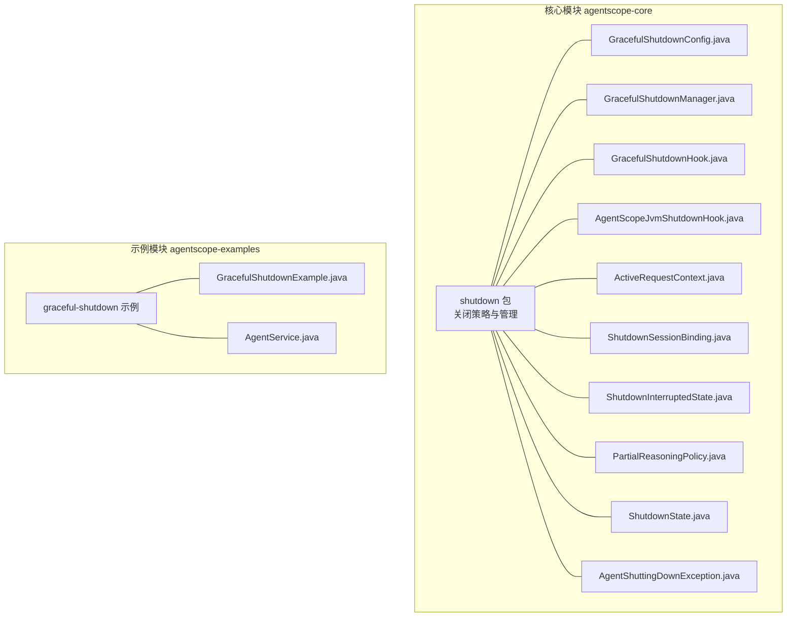
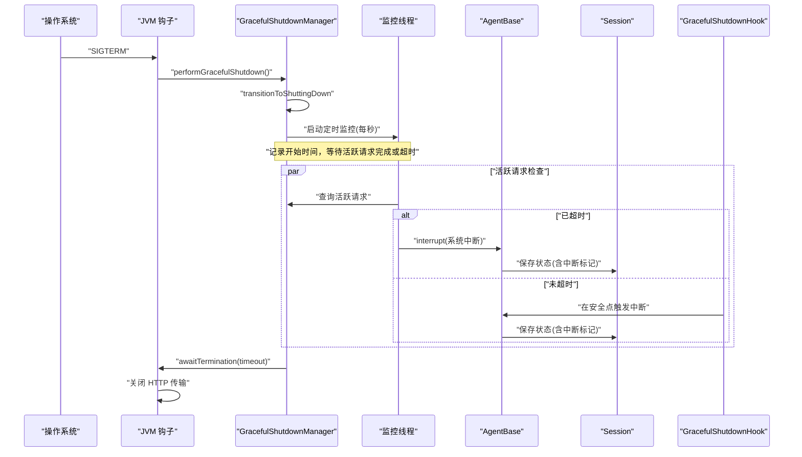
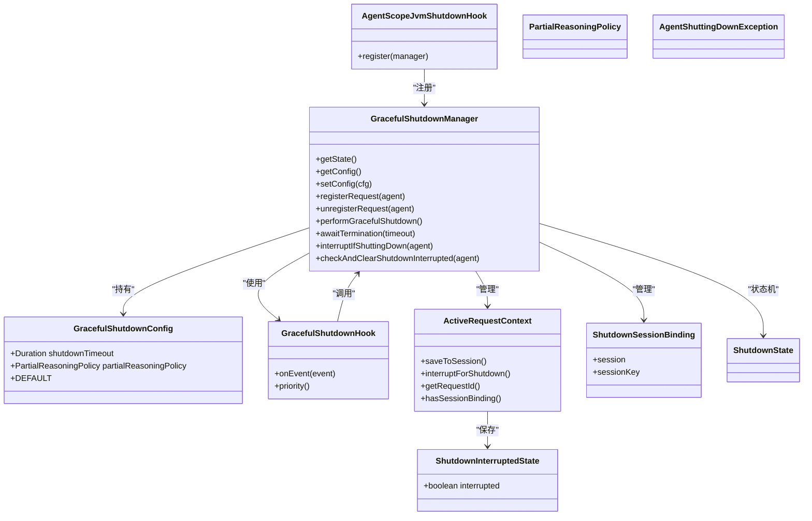

# 关闭策略与配置

<cite>
**本文引用的文件**
- [PartialReasoningPolicy.java](file://agentscope-core/src/main/java/io/agentscope/core/shutdown/PartialReasoningPolicy.java)
- [ShutdownInterruptedState.java](file://agentscope-core/src/main/java/io/agentscope/core/shutdown/ShutdownInterruptedState.java)
- [ShutdownSessionBinding.java](file://agentscope-core/src/main/java/io/agentscope/core/shutdown/ShutdownSessionBinding.java)
- [ActiveRequestContext.java](file://agentscope-core/src/main/java/io/agentscope/core/shutdown/ActiveRequestContext.java)
- [GracefulShutdownConfig.java](file://agentscope-core/src/main/java/io/agentscope/core/shutdown/GracefulShutdownConfig.java)
- [GracefulShutdownHook.java](file://agentscope-core/src/main/java/io/agentscope/core/shutdown/GracefulShutdownHook.java)
- [GracefulShutdownManager.java](file://agentscope-core/src/main/java/io/agentscope/core/shutdown/GracefulShutdownManager.java)
- [AgentScopeJvmShutdownHook.java](file://agentscope-core/src/main/java/io/agentscope/core/shutdown/AgentScopeJvmShutdownHook.java)
- [ShutdownState.java](file://agentscope-core/src/main/java/io/agentscope/core/shutdown/ShutdownState.java)
- [AgentShuttingDownException.java](file://agentscope-core/src/main/java/io/agentscope/core/shutdown/AgentShuttingDownException.java)
- [GracefulShutdownExample.java](file://agentscope-examples/graceful-shutdown/src/main/java/io/agentscope/examples/shutdown/smoke/GracefulShutdownExample.java)
- [AgentService.java](file://agentscope-examples/graceful-shutdown/src/main/java/io/agentscope/examples/shutdown/e2e/AgentService.java)
</cite>

## 目录
1. [引言](#引言)
2. [项目结构](#项目结构)
3. [核心组件](#核心组件)
4. [架构总览](#架构总览)
5. [详细组件分析](#详细组件分析)
6. [依赖关系分析](#依赖关系分析)
7. [性能考量](#性能考量)
8. [故障排查指南](#故障排查指南)
9. [结论](#结论)
10. [附录：配置示例与最佳实践](#附录配置示例与最佳实践)

## 引言
本技术文档聚焦于 AgentScope Java 的“关闭策略与配置”体系，围绕以下关键主题展开：
- PartialReasoningPolicy 的策略选择与适用场景
- ShutdownInterruptedState 的状态管理与恢复机制
- ShutdownSessionBinding 的会话绑定策略与清理流程
- ActiveRequestContext 的请求上下文管理与资源回收
- 全局优雅停机生命周期与 JVM 钩子集成
- 配置项 GracefulShutdownConfig 的参数与影响
- 实战示例与业务恢复策略

目标是帮助开发者在复杂业务场景中正确配置与使用优雅停机能力，最大化保留有效输出、最小化资源浪费，并确保服务可恢复性。

## 项目结构
与“关闭策略与配置”直接相关的核心代码位于 agentscope-core 模块的 shutdown 包内，同时在 examples 中提供了端到端与烟雾测试示例，便于理解配置与行为。

图表来源
- [GracefulShutdownConfig.java:1-70](file://agentscope-core/src/main/java/io/agentscope/core/shutdown/GracefulShutdownConfig.java#L1-L70)
- [GracefulShutdownManager.java:1-321](file://agentscope-core/src/main/java/io/agentscope/core/shutdown/GracefulShutdownManager.java#L1-L321)
- [GracefulShutdownHook.java:1-104](file://agentscope-core/src/main/java/io/agentscope/core/shutdown/GracefulShutdownHook.java#L1-L104)
- [AgentScopeJvmShutdownHook.java:1-71](file://agentscope-core/src/main/java/io/agentscope/core/shutdown/AgentScopeJvmShutdownHook.java#L1-L71)
- [ActiveRequestContext.java:1-78](file://agentscope-core/src/main/java/io/agentscope/core/shutdown/ActiveRequestContext.java#L1-L78)
- [ShutdownSessionBinding.java:1-32](file://agentscope-core/src/main/java/io/agentscope/core/shutdown/ShutdownSessionBinding.java#L1-L32)
- [ShutdownInterruptedState.java:1-28](file://agentscope-core/src/main/java/io/agentscope/core/shutdown/ShutdownInterruptedState.java#L1-L28)
- [PartialReasoningPolicy.java:1-25](file://agentscope-core/src/main/java/io/agentscope/core/shutdown/PartialReasoningPolicy.java#L1-L25)
- [ShutdownState.java:1-26](file://agentscope-core/src/main/java/io/agentscope/core/shutdown/ShutdownState.java#L1-L26)
- [AgentShuttingDownException.java:1-34](file://agentscope-core/src/main/java/io/agentscope/core/shutdown/AgentShuttingDownException.java#L1-L34)
- [GracefulShutdownExample.java:1-832](file://agentscope-examples/graceful-shutdown/src/main/java/io/agentscope/examples/shutdown/smoke/GracefulShutdownExample.java#L1-L832)
- [AgentService.java:1-222](file://agentscope-examples/graceful-shutdown/src/main/java/io/agentscope/examples/shutdown/e2e/AgentService.java#L1-L222)

章节来源
- [GracefulShutdownConfig.java:1-70](file://agentscope-core/src/main/java/io/agentscope/core/shutdown/GracefulShutdownConfig.java#L1-L70)
- [GracefulShutdownManager.java:1-321](file://agentscope-core/src/main/java/io/agentscope/core/shutdown/GracefulShutdownManager.java#L1-L321)
- [GracefulShutdownHook.java:1-104](file://agentscope-core/src/main/java/io/agentscope/core/shutdown/GracefulShutdownHook.java#L1-L104)
- [AgentScopeJvmShutdownHook.java:1-71](file://agentscope-core/src/main/java/io/agentscope/core/shutdown/AgentScopeJvmShutdownHook.java#L1-L71)
- [GracefulShutdownExample.java:1-832](file://agentscope-examples/graceful-shutdown/src/main/java/io/agentscope/examples/shutdown/smoke/GracefulShutdownExample.java#L1-L832)
- [AgentService.java:1-222](file://agentscope-examples/graceful-shutdown/src/main/java/io/agentscope/examples/shutdown/e2e/AgentService.java#L1-L222)

## 核心组件
本节对关键组件进行逐个剖析，解释其职责、数据结构与交互关系。

- PartialReasoningPolicy（枚举）
  - 作用：定义在优雅停机过程中，对于未完成的推理内容应采取的策略。
  - 可选值：SAVE、DISCARD。
  - 应用位置：由 GracefulShutdownConfig 持有并在停机监控线程强制中断时决定是否保存部分推理结果。

- ShutdownInterruptedState（记录类）
  - 作用：持久化标记“被停机中断”的会话状态，用于检测与避免重复输入。
  - 存储位置：与 Agent 状态一同保存在 Session 中，键名固定。

- ShutdownSessionBinding（记录类）
  - 作用：将 Agent 与其 Session/SessionKey 绑定，以便在停机时进行状态落盘与清理。
  - 约束：禁止空值，保证绑定完整性。

- ActiveRequestContext（内部类）
  - 作用：单次活跃请求的运行时上下文，负责：
    - 将当前请求与会话绑定信息关联
    - 在停机检查点保存状态
    - 发出系统级中断信号（仅一次）
  - 关键字段：requestId、agent、session、sessionKey、shutdownInterruptIssued

- GracefulShutdownConfig（记录类）
  - 作用：全局优雅停机配置，包含：
    - shutdownTimeout：最大等待时长；null 表示无限等待
    - partialReasoningPolicy：推理内容处理策略
  - 默认值：默认配置为无限等待 + 保存策略

- GracefulShutdownHook（钩子实现）
  - 作用：在生命周期事件安全点触发停机中断；在 PreCall 阶段检测并去重“重启时的重复用户输入”。

- GracefulShutdownManager（全局管理器）
  - 作用：维护全局停机状态、活跃请求集合、会话绑定、监控线程与超时信号；提供注册/注销请求、触发停机、等待终止等能力。

- AgentScopeJvmShutdownHook（JVM 钩子）
  - 作用：注册 JVM SIGTERM 处理逻辑，按顺序执行：触发优雅停机 → 等待活跃请求结束或超时 → 关闭 HTTP 传输。

- ShutdownState（枚举）
  - 作用：框架全局停机状态机：RUNNING → SHUTTING_DOWN → TERMINATED

- AgentShuttingDownException（异常）
  - 作用：当请求被拒绝或中断时抛出，供上层业务捕获并执行恢复流程

章节来源
- [PartialReasoningPolicy.java:1-25](file://agentscope-core/src/main/java/io/agentscope/core/shutdown/PartialReasoningPolicy.java#L1-L25)
- [ShutdownInterruptedState.java:1-28](file://agentscope-core/src/main/java/io/agentscope/core/shutdown/ShutdownInterruptedState.java#L1-L28)
- [ShutdownSessionBinding.java:1-32](file://agentscope-core/src/main/java/io/agentscope/core/shutdown/ShutdownSessionBinding.java#L1-L32)
- [ActiveRequestContext.java:1-78](file://agentscope-core/src/main/java/io/agentscope/core/shutdown/ActiveRequestContext.java#L1-L78)
- [GracefulShutdownConfig.java:1-70](file://agentscope-core/src/main/java/io/agentscope/core/shutdown/GracefulShutdownConfig.java#L1-L70)
- [GracefulShutdownHook.java:1-104](file://agentscope-core/src/main/java/io/agentscope/core/shutdown/GracefulShutdownHook.java#L1-L104)
- [GracefulShutdownManager.java:1-321](file://agentscope-core/src/main/java/io/agentscope/core/shutdown/GracefulShutdownManager.java#L1-L321)
- [AgentScopeJvmShutdownHook.java:1-71](file://agentscope-core/src/main/java/io/agentscope/core/shutdown/AgentScopeJvmShutdownHook.java#L1-L71)
- [ShutdownState.java:1-26](file://agentscope-core/src/main/java/io/agentscope/core/shutdown/ShutdownState.java#L1-L26)
- [AgentShuttingDownException.java:1-34](file://agentscope-core/src/main/java/io/agentscope/core/shutdown/AgentShuttingDownException.java#L1-L34)

## 架构总览
下图展示了从 JVM 信号到请求中断、状态保存与资源回收的整体流程。

图表来源
- [AgentScopeJvmShutdownHook.java:34-71](file://agentscope-core/src/main/java/io/agentscope/core/shutdown/AgentScopeJvmShutdownHook.java#L34-L71)
- [GracefulShutdownManager.java:198-303](file://agentscope-core/src/main/java/io/agentscope/core/shutdown/GracefulShutdownManager.java#L198-L303)
- [GracefulShutdownHook.java:54-104](file://agentscope-core/src/main/java/io/agentscope/core/shutdown/GracefulShutdownHook.java#L54-L104)
- [ActiveRequestContext.java:58-76](file://agentscope-core/src/main/java/io/agentscope/core/shutdown/ActiveRequestContext.java#L58-L76)

## 详细组件分析

### PartialReasoningPolicy：推理内容策略
- 选择 SAVE 的场景
  - 需要尽可能保留部分推理内容，便于后续恢复继续生成
  - 适用于长文本生成、复杂分析等推理阶段可能被中断的场景
- 选择 DISCARD 的场景
  - 推理内容敏感或无价值，优先避免残留中间态
  - 适用于对一致性要求极高且可重新生成的场景
- 影响范围
  - 由 GracefulShutdownManager 在超时强制中断时根据策略决定是否保存部分输出

章节来源
- [PartialReasoningPolicy.java:18-25](file://agentscope-core/src/main/java/io/agentscope/core/shutdown/PartialReasoningPolicy.java#L18-L25)
- [GracefulShutdownConfig.java:21-35](file://agentscope-core/src/main/java/io/agentscope/core/shutdown/GracefulShutdownConfig.java#L21-L35)
- [GracefulShutdownManager.java:242-266](file://agentscope-core/src/main/java/io/agentscope/core/shutdown/GracefulShutdownManager.java#L242-L266)

### ShutdownInterruptedState：中断状态标记与恢复
- 标记写入
  - ActiveRequestContext 在保存到会话时写入中断标记
- 标记读取与清除
  - GracefulShutdownManager 在 PreCall 阶段通过会话绑定读取并清除该标记
- 恢复机制
  - 清除后，GracefulShutdownHook 将丢弃重复输入，避免重复执行用户提示
- 数据结构
  - 记录类，包含布尔字段 interrupted

章节来源
- [ShutdownInterruptedState.java:18-28](file://agentscope-core/src/main/java/io/agentscope/core/shutdown/ShutdownInterruptedState.java#L18-L28)
- [ActiveRequestContext.java:58-68](file://agentscope-core/src/main/java/io/agentscope/core/shutdown/ActiveRequestContext.java#L58-L68)
- [GracefulShutdownManager.java:113-133](file://agentscope-core/src/main/java/io/agentscope/core/shutdown/GracefulShutdownManager.java#L113-L133)
- [GracefulShutdownHook.java:88-97](file://agentscope-core/src/main/java/io/agentscope/core/shutdown/GracefulShutdownHook.java#L88-L97)

### ShutdownSessionBinding：会话绑定与清理
- 绑定目的
  - 将 Agent 与其 Session/SessionKey 绑定，确保停机时能定位并保存状态
- 约束
  - 不允许空值，防止无效绑定导致保存失败
- 生命周期
  - 注册：在请求注册时建立
  - 注销：请求结束或取消时移除，避免内存泄漏
- 清理流程
  - 注销时同步清理会话绑定映射

章节来源
- [ShutdownSessionBinding.java:22-32](file://agentscope-core/src/main/java/io/agentscope/core/shutdown/ShutdownSessionBinding.java#L22-L32)
- [GracefulShutdownManager.java:97-102](file://agentscope-core/src/main/java/io/agentscope/core/shutdown/GracefulShutdownManager.java#L97-L102)
- [GracefulShutdownManager.java:164-171](file://agentscope-core/src/main/java/io/agentscope/core/shutdown/GracefulShutdownManager.java#L164-L171)

### ActiveRequestContext：请求上下文与资源回收
- 上下文职责
  - 维护单次请求的 request id、Agent、Session 与 SessionKey
  - 提供保存到会话的能力（在安全点或强制中断时）
  - 发出系统中断信号（仅一次，避免重复中断）
- 资源回收
  - 注销请求时移除上下文与绑定，触发终止条件判断
- 并发安全
  - 使用原子布尔变量保证中断信号只发出一次

章节来源
- [ActiveRequestContext.java:29-78](file://agentscope-core/src/main/java/io/agentscope/core/shutdown/ActiveRequestContext.java#L29-L78)
- [GracefulShutdownManager.java:149-171](file://agentscope-core/src/main/java/io/agentscope/core/shutdown/GracefulShutdownManager.java#L149-L171)

### GracefulShutdownManager：全局停机生命周期
- 状态机
  - RUNNING → SHUTTING_DOWN → TERMINATED
- 监控线程
  - 固定周期扫描活跃请求，计算是否超时并强制中断
- 超时信号
  - 通过 Reactor Sink 发出信号，工具执行器可竞速提前退出
- 终止等待
  - 支持阻塞等待终止或限时等待

章节来源
- [GracefulShutdownManager.java:41-321](file://agentscope-core/src/main/java/io/agentscope/core/shutdown/GracefulShutdownManager.java#L41-L321)
- [ShutdownState.java:18-26](file://agentscope-core/src/main/java/io/agentscope/core/shutdown/ShutdownState.java#L18-L26)

### GracefulShutdownHook：生命周期事件与去重
- 安全点中断
  - 在推理完成、工具执行完成、摘要生成完成后触发中断
- 去重逻辑
  - 若检测到中断标记，丢弃重复输入，避免重复执行用户提示

章节来源
- [GracefulShutdownHook.java:29-104](file://agentscope-core/src/main/java/io/agentscope/core/shutdown/GracefulShutdownHook.java#L29-L104)
- [GracefulShutdownManager.java:113-133](file://agentscope-core/src/main/java/io/agentscope/core/shutdown/GracefulShutdownManager.java#L113-L133)

### AgentScopeJvmShutdownHook：JVM 钩子与关闭顺序
- 关闭顺序
  - 触发优雅停机 → 等待活跃请求完成或超时 → 关闭 HTTP 传输
- 附加宽限
  - 在超时基础上增加额外宽限，确保中断信号充分传播

章节来源
- [AgentScopeJvmShutdownHook.java:24-71](file://agentscope-core/src/main/java/io/agentscope/core/shutdown/AgentScopeJvmShutdownHook.java#L24-L71)

### AgentShuttingDownException：异常与业务恢复
- 抛出时机
  - 当请求被拒绝或中断时抛出
- 业务恢复
  - 上层捕获后执行审计日志、二次保存、消息队列通知、返回友好错误码等

章节来源
- [AgentShuttingDownException.java:18-34](file://agentscope-core/src/main/java/io/agentscope/core/shutdown/AgentShuttingDownException.java#L18-L34)
- [GracefulShutdownExample.java:488-607](file://agentscope-examples/graceful-shutdown/src/main/java/io/agentscope/examples/shutdown/smoke/GracefulShutdownExample.java#L488-L607)
- [AgentService.java:145-156](file://agentscope-examples/graceful-shutdown/src/main/java/io/agentscope/examples/shutdown/e2e/AgentService.java#L145-L156)

## 依赖关系分析

图表来源
- [GracefulShutdownConfig.java:36-70](file://agentscope-core/src/main/java/io/agentscope/core/shutdown/GracefulShutdownConfig.java#L36-L70)
- [GracefulShutdownManager.java:41-321](file://agentscope-core/src/main/java/io/agentscope/core/shutdown/GracefulShutdownManager.java#L41-L321)
- [GracefulShutdownHook.java:54-104](file://agentscope-core/src/main/java/io/agentscope/core/shutdown/GracefulShutdownHook.java#L54-L104)
- [AgentScopeJvmShutdownHook.java:34-71](file://agentscope-core/src/main/java/io/agentscope/core/shutdown/AgentScopeJvmShutdownHook.java#L34-L71)
- [ActiveRequestContext.java:29-78](file://agentscope-core/src/main/java/io/agentscope/core/shutdown/ActiveRequestContext.java#L29-L78)
- [ShutdownSessionBinding.java:22-32](file://agentscope-core/src/main/java/io/agentscope/core/shutdown/ShutdownSessionBinding.java#L22-L32)
- [ShutdownInterruptedState.java:18-28](file://agentscope-core/src/main/java/io/agentscope/core/shutdown/ShutdownInterruptedState.java#L18-L28)
- [PartialReasoningPolicy.java:21-24](file://agentscope-core/src/main/java/io/agentscope/core/shutdown/PartialReasoningPolicy.java#L21-L24)
- [ShutdownState.java:18-26](file://agentscope-core/src/main/java/io/agentscope/core/shutdown/ShutdownState.java#L18-L26)
- [AgentShuttingDownException.java:18-34](file://agentscope-core/src/main/java/io/agentscope/core/shutdown/AgentShuttingDownException.java#L18-L34)

## 性能考量
- 监控频率
  - 每秒轮询一次，开销极低；可根据部署规模调整线程池或频率
- 超时策略
  - 合理设置 shutdownTimeout，避免过短导致频繁强制中断，或过长导致停机延迟
- I/O 成本
  - 保存会话与中断标记为轻量操作；若使用远程存储，需关注网络延迟
- 流式输出
  - SAVE 策略可避免流式输出被截断造成浪费；DISCARD 则减少残留中间态
- 工具执行器竞速
  - 通过超时信号让工具尽早退出，降低停机时间

## 故障排查指南
- 症状：停机后仍有请求未结束
  - 检查 shutdownTimeout 是否过长或为 null；确认工具执行器是否响应超时信号
- 症状：重复输入导致重复执行
  - 检查 PreCall 阶段去重逻辑是否生效；确认会话中中断标记是否正确清除
- 症状：异常未被捕获导致业务中断
  - 在应用层捕获 AgentShuttingDownException，执行审计、二次保存与通知
- 症状：HTTP 传输提前关闭导致连接异常
  - 确认 JVM 钩子顺序：先停机等待，再关闭传输

章节来源
- [GracefulShutdownManager.java:222-266](file://agentscope-core/src/main/java/io/agentscope/core/shutdown/GracefulShutdownManager.java#L222-L266)
- [GracefulShutdownHook.java:88-97](file://agentscope-core/src/main/java/io/agentscope/core/shutdown/GracefulShutdownHook.java#L88-L97)
- [AgentService.java:145-156](file://agentscope-examples/graceful-shutdown/src/main/java/io/agentscope/examples/shutdown/e2e/AgentService.java#L145-L156)
- [AgentScopeJvmShutdownHook.java:47-69](file://agentscope-core/src/main/java/io/agentscope/core/shutdown/AgentScopeJvmShutdownHook.java#L47-L69)

## 结论
AgentScope Java 的关闭策略与配置体系以“安全点中断 + 会话持久化 + 可配置策略”为核心，兼顾了用户体验与系统稳定性。通过合理配置 GracefulShutdownConfig 与在业务层捕获 AgentShuttingDownException，可以在不牺牲服务质量的前提下实现快速、可控的停机与恢复。

## 附录：配置示例与最佳实践

### 配置项与含义
- shutdownTimeout
  - 类型：Duration
  - 说明：优雅停机等待时长；null 表示无限等待
  - 默认：null
- partialReasoningPolicy
  - 类型：PartialReasoningPolicy
  - 说明：推理内容处理策略；SAVE 或 DISCARD
  - 默认：SAVE

章节来源
- [GracefulShutdownConfig.java:21-68](file://agentscope-core/src/main/java/io/agentscope/core/shutdown/GracefulShutdownConfig.java#L21-L68)

### 配置示例（来自示例工程）
- 烟雾测试示例
  - 场景一：工具执行超时，设置 5 秒超时并保存策略
  - 场景二：推理阶段超时，设置较短超时并保存策略
  - 场景三：工具执行超过超时，验证强制中断与恢复
  - 场景四：捕获异常并执行业务恢复流程
- 端到端示例
  - 通过环境变量或配置注入 shutdown-timeout-seconds 与 shutdown-partial-reasoning-policy，动态构建 GracefulShutdownConfig

章节来源
- [GracefulShutdownExample.java:129-132](file://agentscope-examples/graceful-shutdown/src/main/java/io/agentscope/examples/shutdown/smoke/GracefulShutdownExample.java#L129-L132)
- [GracefulShutdownExample.java:252-254](file://agentscope-examples/graceful-shutdown/src/main/java/io/agentscope/examples/shutdown/smoke/GracefulShutdownExample.java#L252-L254)
- [GracefulShutdownExample.java:381-383](file://agentscope-examples/graceful-shutdown/src/main/java/io/agentscope/examples/shutdown/smoke/GracefulShutdownExample.java#L381-L383)
- [AgentService.java:92-104](file://agentscope-examples/graceful-shutdown/src/main/java/io/agentscope/examples/shutdown/e2e/AgentService.java#L92-L104)

### 选择指南与最佳实践
- 高吞吐在线服务
  - 建议设置合理的 shutdownTimeout（如 5~15 秒），策略选择 SAVE，以尽量保留有效输出
- 长文本生成/复杂分析
  - 与高吞吐类似，但需更关注 SAVE 策略带来的会话体积增长，必要时配合定期清理
- 对一致性要求极高
  - 可考虑 DISCARD 策略，避免残留中间态；但需确保可重放性
- 严格 SLA 场景
  - 明确超时阈值，确保在超时前完成关键阶段；在工具侧实现竞速退出
- 业务恢复
  - 捕获 AgentShuttingDownException，执行审计日志、二次保存、消息队列通知与用户友好提示