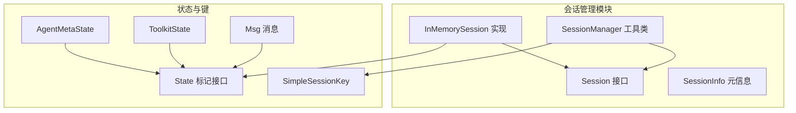
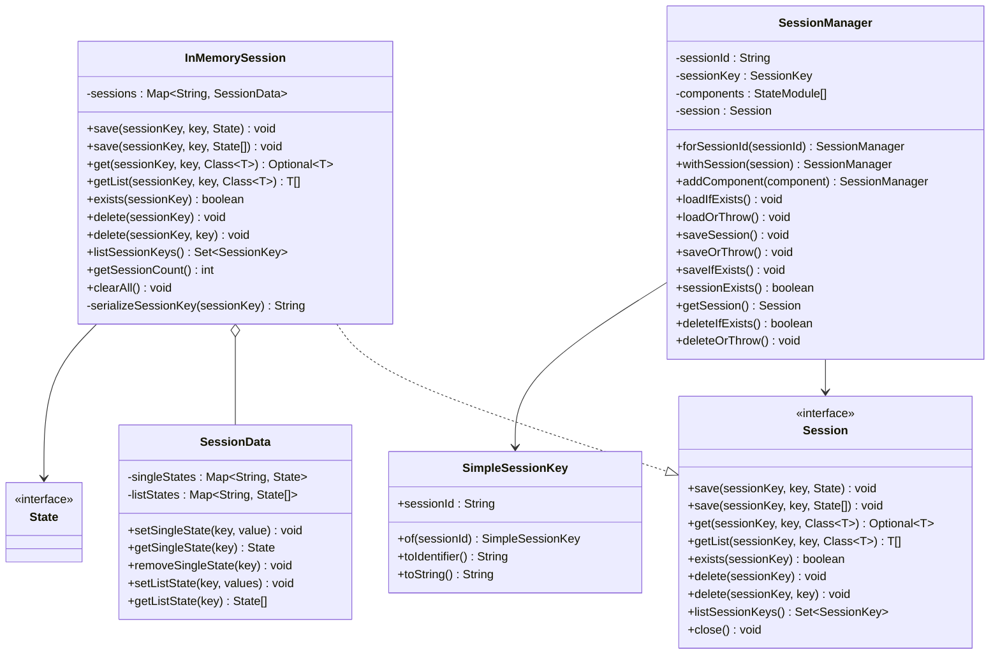
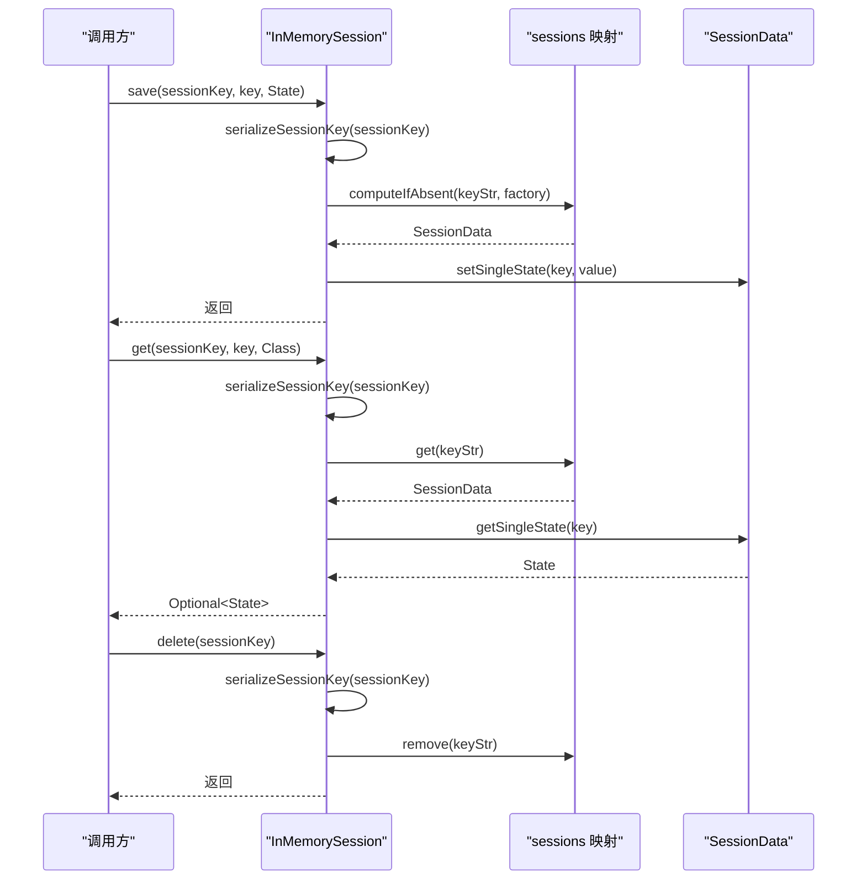
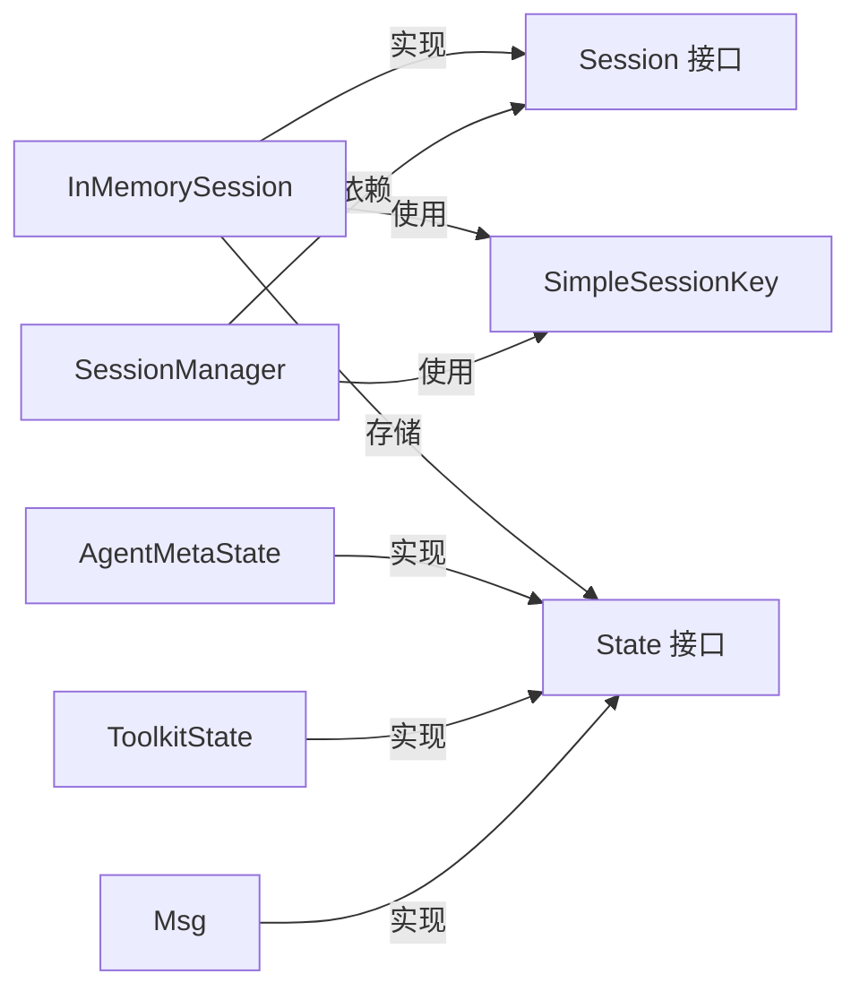

# InMemorySession 内存会话

<cite>
**本文引用的文件**
- [InMemorySession.java](file://agentscope-core/src/main/java/io/agentscope/core/session/InMemorySession.java)
- [Session.java](file://agentscope-core/src/main/java/io/agentscope/core/session/Session.java)
- [SessionManager.java](file://agentscope-core/src/main/java/io/agentscope/core/session/SessionManager.java)
- [SessionInfo.java](file://agentscope-core/src/main/java/io/agentscope/core/session/SessionInfo.java)
- [SimpleSessionKey.java](file://agentscope-core/src/main/java/io/agentscope/core/state/SimpleSessionKey.java)
- [State.java](file://agentscope-core/src/main/java/io/agentscope/core/state/State.java)
- [AgentMetaState.java](file://agentscope-core/src/main/java/io/agentscope/core/state/AgentMetaState.java)
- [ToolkitState.java](file://agentscope-core/src/main/java/io/agentscope/core/state/ToolkitState.java)
- [Msg.java](file://agentscope-core/src/main/java/io/agentscope/core/message/Msg.java)
- [InMemorySessionTest.java](file://agentscope-core/src/test/java/io/agentscope/core/session/InMemorySessionTest.java)
- [InMemorySessionNewApiTest.java](file://agentscope-core/src/test/java/io/agentscope/core/session/InMemorySessionNewApiTest.java)
- [session.md](file://docs/zh/task/session.md)
</cite>

## 目录
1. [简介](#简介)
2. [项目结构](#项目结构)
3. [核心组件](#核心组件)
4. [架构概览](#架构概览)
5. [详细组件分析](#详细组件分析)
6. [依赖关系分析](#依赖关系分析)
7. [性能考量](#性能考量)
8. [故障排查指南](#故障排查指南)
9. [结论](#结论)
10. [附录](#附录)

## 简介
InMemorySession 是 AgentScope 中基于内存的会话存储实现，适用于单进程、临时性的状态持久化需求。它将会话状态存储在内存映射中，提供线程安全的并发访问能力，并支持单值状态与列表状态的保存与读取。该实现适合测试、本地开发以及不需要跨进程或跨重启持久化的场景。

## 项目结构
InMemorySession 所属模块位于 agentscope-core 的 session 包中，与接口 Session、工具类 SessionManager、键类型 SimpleSessionKey、状态标记接口 State 及常用状态类型（如 AgentMetaState、ToolkitState）共同构成完整的会话管理子系统。

图表来源
- [InMemorySession.java:58-250](file://agentscope-core/src/main/java/io/agentscope/core/session/InMemorySession.java#L58-L250)
- [Session.java:53-146](file://agentscope-core/src/main/java/io/agentscope/core/session/Session.java#L53-L146)
- [SessionManager.java:61-261](file://agentscope-core/src/main/java/io/agentscope/core/session/SessionManager.java#L61-L261)
- [SimpleSessionKey.java:37-71](file://agentscope-core/src/main/java/io/agentscope/core/state/SimpleSessionKey.java#L37-L71)
- [State.java:18-48](file://agentscope-core/src/main/java/io/agentscope/core/state/State.java#L18-L48)
- [AgentMetaState.java:41-43](file://agentscope-core/src/main/java/io/agentscope/core/state/AgentMetaState.java#L41-L43)
- [ToolkitState.java:42-43](file://agentscope-core/src/main/java/io/agentscope/core/state/ToolkitState.java#L42-L43)
- [Msg.java:53-656](file://agentscope-core/src/main/java/io/agentscope/core/message/Msg.java#L53-L656)

章节来源
- [InMemorySession.java:58-250](file://agentscope-core/src/main/java/io/agentscope/core/session/InMemorySession.java#L58-L250)
- [Session.java:53-146](file://agentscope-core/src/main/java/io/agentscope/core/session/Session.java#L53-L146)
- [SessionManager.java:61-261](file://agentscope-core/src/main/java/io/agentscope/core/session/SessionManager.java#L61-L261)

## 核心组件
- InMemorySession：内存会话实现，内部使用并发安全的映射结构存储会话状态。
- Session 接口：定义会话的基本操作（保存、读取、存在性检查、删除、列出键等）。
- SessionManager：简化会话管理的工具类，支持通过组件注册与统一保存/加载。
- SimpleSessionKey：默认的会话键实现，使用字符串标识会话。
- State：状态对象标记接口，所有可持久化的状态类均实现此接口。
- 常用状态类型：AgentMetaState（代理元数据）、ToolkitState（工具组激活状态）、Msg（消息记录）等。

章节来源
- [InMemorySession.java:58-250](file://agentscope-core/src/main/java/io/agentscope/core/session/InMemorySession.java#L58-L250)
- [Session.java:53-146](file://agentscope-core/src/main/java/io/agentscope/core/session/Session.java#L53-L146)
- [SessionManager.java:61-261](file://agentscope-core/src/main/java/io/agentscope/core/session/SessionManager.java#L61-L261)
- [SimpleSessionKey.java:37-71](file://agentscope-core/src/main/java/io/agentscope/core/state/SimpleSessionKey.java#L37-L71)
- [State.java:18-48](file://agentscope-core/src/main/java/io/agentscope/core/state/State.java#L18-L48)
- [AgentMetaState.java:41-43](file://agentscope-core/src/main/java/io/agentscope/core/state/AgentMetaState.java#L41-L43)
- [ToolkitState.java:42-43](file://agentscope-core/src/main/java/io/agentscope/core/state/ToolkitState.java#L42-L43)
- [Msg.java:53-656](file://agentscope-core/src/main/java/io/agentscope/core/message/Msg.java#L53-L656)

## 架构概览
InMemorySession 将会话状态以键值对形式存储在内存映射中，每个会话键对应一个 SessionData 对象，内部再细分为单值状态映射与列表状态映射。读取时根据键查找对应的状态；删除时可整体删除会话或按键删除单个状态条目。

图表来源
- [InMemorySession.java:58-250](file://agentscope-core/src/main/java/io/agentscope/core/session/InMemorySession.java#L58-L250)
- [Session.java:53-146](file://agentscope-core/src/main/java/io/agentscope/core/session/Session.java#L53-L146)
- [SessionManager.java:61-261](file://agentscope-core/src/main/java/io/agentscope/core/session/SessionManager.java#L61-L261)
- [SimpleSessionKey.java:37-71](file://agentscope-core/src/main/java/io/agentscope/core/state/SimpleSessionKey.java#L37-L71)
- [State.java:18-48](file://agentscope-core/src/main/java/io/agentscope/core/state/State.java#L18-L48)

## 详细组件分析

### InMemorySession 内存会话实现
- 存储结构
  - sessions：键为序列化后的会话键字符串，值为 SessionData 对象。
  - SessionData：内部维护两个并发映射：
    - singleStates：键为状态键（如“agent_meta”），值为单个 State 对象。
    - listStates：键为状态键（如“memory_messages”），值为不可变列表副本（使用 List.copyOf）。
- 线程安全
  - sessions 使用 ConcurrentHashMap，保证并发读写安全。
  - 列表状态在保存时使用不可变副本，避免外部修改影响内部状态。
- 生命周期管理
  - exists：判断会话是否存在。
  - delete：删除整个会话及其所有状态。
  - delete(sessionKey, key)：删除会话内的指定状态键。
  - listSessionKeys：返回所有会话键集合。
  - getSessionCount：返回当前活动会话数量。
  - clearAll：清空所有会话。
- 临时性与限制
  - 仅驻留于 JVM 内存，JVM 退出后状态丢失。
  - 不适用于分布式环境。
  - 随会话数量增加，内存占用随之增长。

图表来源
- [InMemorySession.java:70-180](file://agentscope-core/src/main/java/io/agentscope/core/session/InMemorySession.java#L70-L180)

章节来源
- [InMemorySession.java:58-250](file://agentscope-core/src/main/java/io/agentscope/core/session/InMemorySession.java#L58-L250)

### Session 接口与行为契约
- 统一的会话操作规范，定义了保存单值状态、保存列表状态、读取单值状态、读取列表状态、存在性检查、删除会话、删除单个状态键、列出所有会话键以及关闭资源等方法。
- InMemorySession 与 JsonSession 等实现遵循相同的契约，确保上层调用的一致性。

章节来源
- [Session.java:53-146](file://agentscope-core/src/main/java/io/agentscope/core/session/Session.java#L53-L146)

### SessionManager 工具类
- 提供面向组件的会话管理 API，通过 addComponent 注册组件，使用 saveTo/loadFrom 进行批量保存与加载。
- 支持多种 Session 实现（如 InMemorySession、JsonSession、自定义实现），便于切换存储后端。
- 提供 loadIfExists、loadOrThrow、saveSession、saveOrThrow、saveIfExists、deleteIfExists、deleteOrThrow 等便捷方法。

章节来源
- [SessionManager.java:61-261](file://agentscope-core/src/main/java/io/agentscope/core/session/SessionManager.java#L61-L261)

### SimpleSessionKey 与 State
- SimpleSessionKey：默认的会话键实现，使用字符串标识会话，提供工厂方法 of 与 toIdentifier。
- State：所有可持久化的状态对象必须实现此接口，便于 Session 实现进行统一处理。

章节来源
- [SimpleSessionKey.java:37-71](file://agentscope-core/src/main/java/io/agentscope/core/state/SimpleSessionKey.java#L37-L71)
- [State.java:18-48](file://agentscope-core/src/main/java/io/agentscope/core/state/State.java#L18-L48)

### 常用状态类型
- AgentMetaState：代理元数据，包含 id、name、description、systemPrompt 等字段。
- ToolkitState：工具组激活状态，包含 activeGroups 列表。
- Msg：消息记录，实现 State 接口，支持文本块、角色、元数据等。

章节来源
- [AgentMetaState.java:41-43](file://agentscope-core/src/main/java/io/agentscope/core/state/AgentMetaState.java#L41-L43)
- [ToolkitState.java:42-43](file://agentscope-core/src/main/java/io/agentscope/core/state/ToolkitState.java#L42-L43)
- [Msg.java:53-656](file://agentscope-core/src/main/java/io/agentscope/core/message/Msg.java#L53-L656)

## 依赖关系分析
- InMemorySession 依赖 Session 接口定义的行为契约，依赖 SimpleSessionKey 进行键序列化，依赖 State 标记接口以识别可持久化对象。
- SessionManager 依赖 Session 接口与 SimpleSessionKey，通过组件注册实现统一的保存/加载流程。
- 常用状态类型（AgentMetaState、ToolkitState、Msg）实现 State 接口，满足 InMemorySession 的存储要求。

图表来源
- [InMemorySession.java:58-250](file://agentscope-core/src/main/java/io/agentscope/core/session/InMemorySession.java#L58-L250)
- [Session.java:53-146](file://agentscope-core/src/main/java/io/agentscope/core/session/Session.java#L53-L146)
- [SessionManager.java:61-261](file://agentscope-core/src/main/java/io/agentscope/core/session/SessionManager.java#L61-L261)
- [SimpleSessionKey.java:37-71](file://agentscope-core/src/main/java/io/agentscope/core/state/SimpleSessionKey.java#L37-L71)
- [State.java:18-48](file://agentscope-core/src/main/java/io/agentscope/core/state/State.java#L18-L48)
- [AgentMetaState.java:41-43](file://agentscope-core/src/main/java/io/agentscope/core/state/AgentMetaState.java#L41-L43)
- [ToolkitState.java:42-43](file://agentscope-core/src/main/java/io/agentscope/core/state/ToolkitState.java#L42-L43)
- [Msg.java:53-656](file://agentscope-core/src/main/java/io/agentscope/core/message/Msg.java#L53-L656)

章节来源
- [InMemorySession.java:58-250](file://agentscope-core/src/main/java/io/agentscope/core/session/InMemorySession.java#L58-L250)
- [Session.java:53-146](file://agentscope-core/src/main/java/io/agentscope/core/session/Session.java#L53-L146)
- [SessionManager.java:61-261](file://agentscope-core/src/main/java/io/agentscope/core/session/SessionManager.java#L61-L261)

## 性能考量
- 时间复杂度
  - 保存单值状态：O(1) 平均时间，基于 ConcurrentHashMap 的 put 操作。
  - 保存列表状态：O(n) 时间，n 为列表长度，同时进行不可变副本复制。
  - 读取单值状态：O(1) 平均时间，基于 ConcurrentHashMap 的 get 操作。
  - 读取列表状态：O(1) 平均时间，返回不可变副本。
  - 删除会话：O(k) 时间，k 为该会话内状态键数量（列表状态键也会被删除）。
- 空间复杂度
  - 每个会话键对应一个 SessionData 对象，单值状态映射与列表状态映射分别存储在独立映射中。
  - 列表状态保存为不可变副本，避免外部修改，但会增加内存占用。
- 并发控制
  - sessions 映射使用 ConcurrentHashMap，支持高并发读写。
  - 单个 SessionData 内部也使用并发映射，保证键级并发安全。
- 适用场景
  - 单进程、临时性状态存储。
  - 测试与开发环境中的快速原型验证。
  - 不需要跨进程或跨重启持久化的场景。

[本节为通用性能讨论，无需特定文件来源]

## 故障排查指南
- ClassCastException
  - 当读取状态时类型不匹配会抛出 ClassCastException。请确保保存与读取时使用的类型一致。
- 会话不存在
  - exists 返回 false 或 get/getList 返回空值时，表示会话或键不存在。可通过 saveSession 或先保存再读取解决。
- 删除操作
  - delete(sessionKey) 删除整个会话；delete(sessionKey, key) 删除指定键。确认键名是否正确。
- 列表状态替换
  - InMemorySession 替换整个列表，而非增量追加。调用方应传入完整列表。
- 内存泄漏与资源管理
  - InMemorySession 不提供 close 方法，无需显式关闭。但会话数量过多可能导致内存压力增大，建议定期清理不再使用的会话。

章节来源
- [InMemorySession.java:103-124](file://agentscope-core/src/main/java/io/agentscope/core/session/InMemorySession.java#L103-L124)
- [InMemorySession.java:167-180](file://agentscope-core/src/main/java/io/agentscope/core/session/InMemorySession.java#L167-L180)
- [InMemorySessionTest.java:78-101](file://agentscope-core/src/test/java/io/agentscope/core/session/InMemorySessionTest.java#L78-L101)
- [InMemorySessionNewApiTest.java:187-225](file://agentscope-core/src/test/java/io/agentscope/core/session/InMemorySessionNewApiTest.java#L187-L225)

## 结论
InMemorySession 提供了简单高效的内存会话存储方案，适合单进程、临时性的状态持久化需求。其基于并发映射的数据结构保证了良好的并发性能，同时通过不可变列表副本确保状态一致性。对于需要跨进程或跨重启持久化的场景，建议使用 JsonSession 或其他持久化实现。

[本节为总结性内容，无需特定文件来源]

## 附录

### 使用示例与最佳实践
- 基本使用
  - 创建 InMemorySession 实例，使用 SimpleSessionKey 作为会话键。
  - 通过 save 保存单值状态（如 AgentMetaState、ToolkitState）与列表状态（如 Msg 列表）。
  - 通过 get/getList 读取状态，exists 检查会话存在性，delete 删除会话或键。
- 最佳实践
  - 在测试环境中优先使用 InMemorySession，以获得更快的读写速度与更低的配置成本。
  - 对于生产环境，建议使用 JsonSession 或其他持久化实现，确保状态跨重启可用。
  - 注意列表状态的替换语义，调用方应传入完整列表，避免遗漏数据。
  - 控制会话数量，避免内存过度增长；必要时使用 clearAll 或定期清理。

章节来源
- [InMemorySessionTest.java:43-218](file://agentscope-core/src/test/java/io/agentscope/core/session/InMemorySessionTest.java#L43-L218)
- [InMemorySessionNewApiTest.java:51-340](file://agentscope-core/src/test/java/io/agentscope/core/session/InMemorySessionNewApiTest.java#L51-L340)
- [session.md:83-107](file://docs/zh/task/session.md#L83-L107)