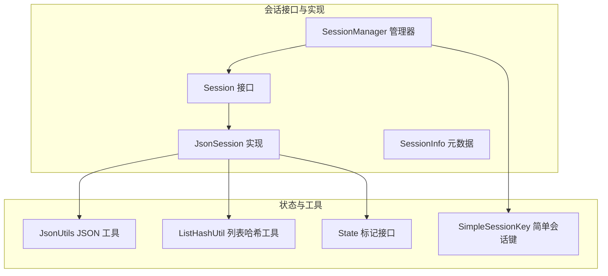
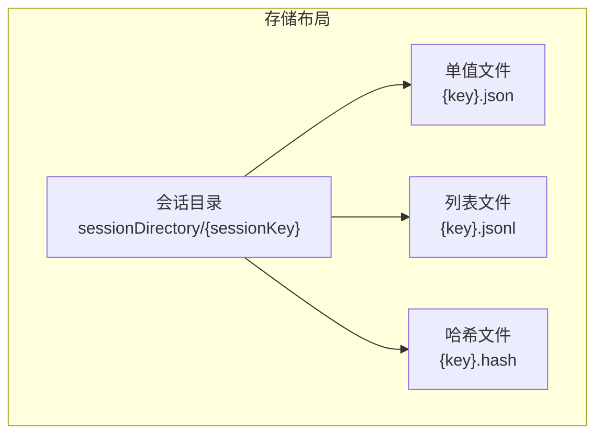
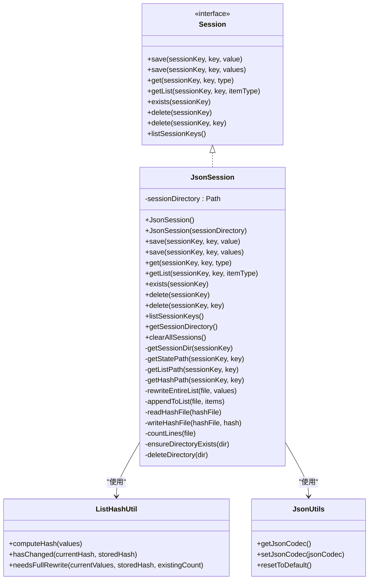
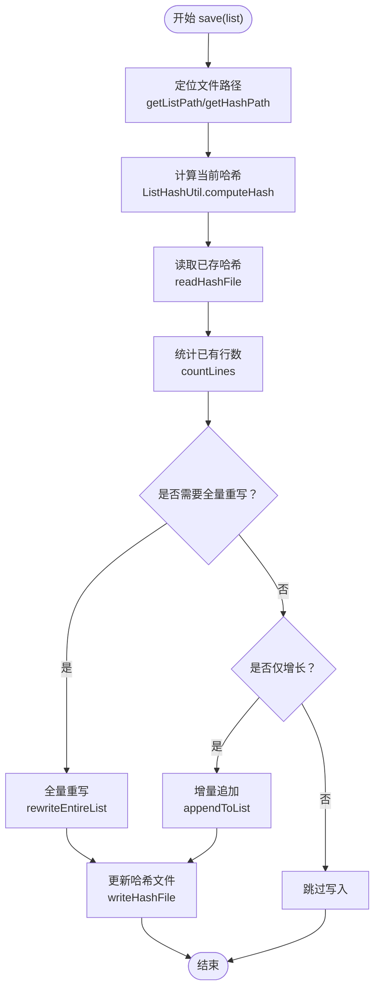
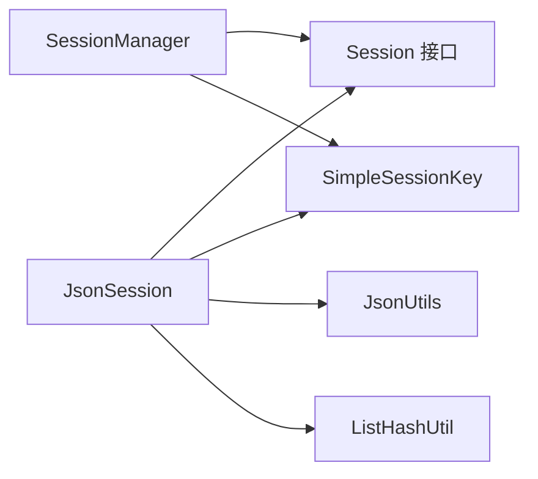

# JsonSession 文件会话

<cite>
**本文引用的文件**
- [JsonSession.java](file://agentscope-core/src/main/java/io/agentscope/core/session/JsonSession.java)
- [ListHashUtil.java](file://agentscope-core/src/main/java/io/agentscope/core/session/ListHashUtil.java)
- [Session.java](file://agentscope-core/src/main/java/io/agentscope/core/session/Session.java)
- [SessionInfo.java](file://agentscope-core/src/main/java/io/agentscope/core/session/SessionInfo.java)
- [SessionManager.java](file://agentscope-core/src/main/java/io/agentscope/core/session/SessionManager.java)
- [SimpleSessionKey.java](file://agentscope-core/src/main/java/io/agentscope/core/state/SimpleSessionKey.java)
- [JsonUtils.java](file://agentscope-core/src/main/java/io/agentscope/core/util/JsonUtils.java)
- [JsonSessionNewApiTest.java](file://agentscope-core/src/test/java/io/agentscope/core/session/JsonSessionNewApiTest.java)
</cite>

## 目录
1. [简介](#简介)
2. [项目结构](#项目结构)
3. [核心组件](#核心组件)
4. [架构总览](#架构总览)
5. [详细组件分析](#详细组件分析)
6. [依赖分析](#依赖分析)
7. [性能考虑](#性能考虑)
8. [故障排查指南](#故障排查指南)
9. [结论](#结论)
10. [附录](#附录)

## 简介
本文件面向 JsonSession 文件会话实现，提供从架构到实现细节的完整技术文档。JsonSession 基于文件系统提供会话持久化能力，采用目录分层与文件命名规则组织状态数据，支持两类状态存储：
- 单值状态：以 .json 文件保存，适合键值型元信息或配置类状态。
- 列表状态：以 .jsonl 文件保存，按行存储 JSON 对象，配合 .hash 文件进行增量写入与变更检测。

此外，JsonSession 还提供：
- 安全的文件系统命名策略（安全字符与 Base64 URL 编码）
- 增量写入与全量重写策略（基于哈希检测）
- 递归删除与目录清理
- 可配置存储目录与默认路径
- 与 Session 接口、SessionManager 的集成

## 项目结构
JsonSession 所在模块位于 agentscope-core 的 session 包中，配合状态接口、JSON 工具与会话管理器共同构成完整的会话体系。

图表来源
- [Session.java:53-145](file://agentscope-core/src/main/java/io/agentscope/core/session/Session.java#L53-L145)
- [JsonSession.java:58-509](file://agentscope-core/src/main/java/io/agentscope/core/session/JsonSession.java#L58-L509)
- [SessionInfo.java:25-93](file://agentscope-core/src/main/java/io/agentscope/core/session/SessionInfo.java#L25-L93)
- [SessionManager.java:61-260](file://agentscope-core/src/main/java/io/agentscope/core/session/SessionManager.java#L61-L260)
- [SimpleSessionKey.java:37-70](file://agentscope-core/src/main/java/io/agentscope/core/state/SimpleSessionKey.java#L37-L70)
- [JsonUtils.java:49-152](file://agentscope-core/src/main/java/io/agentscope/core/util/JsonUtils.java#L49-L152)
- [ListHashUtil.java:49-172](file://agentscope-core/src/main/java/io/agentscope/core/session/ListHashUtil.java#L49-L172)

章节来源
- [Session.java:24-145](file://agentscope-core/src/main/java/io/agentscope/core/session/Session.java#L24-L145)
- [JsonSession.java:42-87](file://agentscope-core/src/main/java/io/agentscope/core/session/JsonSession.java#L42-L87)
- [SessionManager.java:24-60](file://agentscope-core/src/main/java/io/agentscope/core/session/SessionManager.java#L24-L60)

## 核心组件
- Session 接口：定义会话存取的基本契约，包括单值与列表的保存/加载、存在性检查、删除、列出会话键等。
- JsonSession：Session 接口的具体实现，负责将状态落盘为文件系统中的 JSON/JSONL 文件，并提供增量写入与哈希检测。
- ListHashUtil：为列表状态提供哈希计算与变更判断，支撑增量写入策略。
- SessionManager：面向业务的会话管理器，提供链式 API，简化多组件状态的批量保存/加载。
- SimpleSessionKey：简单字符串会话键实现，作为 Session 接口的默认键类型。
- JsonUtils：全局 JSON 编解码工具，统一序列化/反序列化入口。

章节来源
- [Session.java:53-145](file://agentscope-core/src/main/java/io/agentscope/core/session/Session.java#L53-L145)
- [JsonSession.java:58-509](file://agentscope-core/src/main/java/io/agentscope/core/session/JsonSession.java#L58-L509)
- [ListHashUtil.java:49-172](file://agentscope-core/src/main/java/io/agentscope/core/session/ListHashUtil.java#L49-L172)
- [SessionManager.java:61-260](file://agentscope-core/src/main/java/io/agentscope/core/session/SessionManager.java#L61-L260)
- [SimpleSessionKey.java:37-70](file://agentscope-core/src/main/java/io/agentscope/core/state/SimpleSessionKey.java#L37-L70)
- [JsonUtils.java:49-152](file://agentscope-core/src/main/java/io/agentscope/core/util/JsonUtils.java#L49-L152)

## 架构总览
JsonSession 将每个会话映射为一个目录，目录名由会话键标识；在该目录下，不同键对应不同的文件：
- 单值状态：{key}.json
- 列表状态：{key}.jsonl
- 列表哈希：{key}.hash

图表来源
- [JsonSession.java:342-386](file://agentscope-core/src/main/java/io/agentscope/core/session/JsonSession.java#L342-L386)

章节来源
- [JsonSession.java:342-386](file://agentscope-core/src/main/java/io/agentscope/core/session/JsonSession.java#L342-L386)

## 详细组件分析

### JsonSession 类分析
- 默认存储位置：用户主目录下的 .agentscope/sessions。
- 自定义存储目录：构造函数可传入 Path 指定根目录，不存在时自动创建。
- 单值状态存储：将对象序列化为 JSON 并写入 {key}.json，覆盖式写入。
- 列表状态存储：采用 JSONL（每行一个 JSON 对象），配合 .hash 文件进行增量写入：
  - 若哈希变化或列表收缩，则全量重写；
  - 若仅增长，则增量追加新项；
  - 否则跳过写入。
- 文件系统安全字符处理：若会话键包含不安全字符，使用 Base64 URL 安全编码作为目录名。
- 删除与清理：支持删除指定会话（递归删除目录）、删除单个键文件、列出所有会话键、清空所有会话（异步执行）。
- 编码策略：统一使用 UTF-8。

图表来源
- [Session.java:53-145](file://agentscope-core/src/main/java/io/agentscope/core/session/Session.java#L53-L145)
- [JsonSession.java:58-509](file://agentscope-core/src/main/java/io/agentscope/core/session/JsonSession.java#L58-L509)
- [ListHashUtil.java:49-172](file://agentscope-core/src/main/java/io/agentscope/core/session/ListHashUtil.java#L49-L172)
- [JsonUtils.java:49-152](file://agentscope-core/src/main/java/io/agentscope/core/util/JsonUtils.java#L49-L152)

章节来源
- [JsonSession.java:68-87](file://agentscope-core/src/main/java/io/agentscope/core/session/JsonSession.java#L68-L87)
- [JsonSession.java:98-162](file://agentscope-core/src/main/java/io/agentscope/core/session/JsonSession.java#L98-L162)
- [JsonSession.java:171-212](file://agentscope-core/src/main/java/io/agentscope/core/session/JsonSession.java#L171-L212)
- [JsonSession.java:224-274](file://agentscope-core/src/main/java/io/agentscope/core/session/JsonSession.java#L224-L274)
- [JsonSession.java:342-386](file://agentscope-core/src/main/java/io/agentscope/core/session/JsonSession.java#L342-L386)
- [JsonSession.java:452-471](file://agentscope-core/src/main/java/io/agentscope/core/session/JsonSession.java#L452-L471)
- [JsonSession.java:487-508](file://agentscope-core/src/main/java/io/agentscope/core/session/JsonSession.java#L487-L508)

#### 列表状态写入流程（增量/全量）

图表来源
- [JsonSession.java:127-162](file://agentscope-core/src/main/java/io/agentscope/core/session/JsonSession.java#L127-L162)
- [ListHashUtil.java:148-171](file://agentscope-core/src/main/java/io/agentscope/core/session/ListHashUtil.java#L148-L171)
- [JsonSession.java:171-212](file://agentscope-core/src/main/java/io/agentscope/core/session/JsonSession.java#L171-L212)
- [JsonSession.java:413-415](file://agentscope-core/src/main/java/io/agentscope/core/session/JsonSession.java#L413-L415)

章节来源
- [JsonSession.java:127-162](file://agentscope-core/src/main/java/io/agentscope/core/session/JsonSession.java#L127-L162)
- [ListHashUtil.java:148-171](file://agentscope-core/src/main/java/io/agentscope/core/session/ListHashUtil.java#L148-L171)

#### 目录命名与安全字符处理
- 若会话键仅包含安全字符（字母数字、下划线、连字符、点号），直接使用该标识作为目录名。
- 否则对会话键进行 Base64 URL 安全编码，去除填充字符，避免文件系统非法字符问题。

章节来源
- [JsonSession.java:329-353](file://agentscope-core/src/main/java/io/agentscope/core/session/JsonSession.java#L329-L353)

#### 递归删除机制
- 使用 Files.walk 遍历目录树，先删除文件再删除目录，确保层级顺序正确。
- 异常包装为运行时异常，便于上层统一处理。

章节来源
- [JsonSession.java:452-471](file://agentscope-core/src/main/java/io/agentscope/core/session/JsonSession.java#L452-L471)

### ListHashUtil 分析
- 哈希组成：包含列表大小与采样元素的哈希索引，避免对大列表全量遍历。
- 采样策略：
  - 小列表（≤5）：采样全部元素。
  - 大列表：采样位置为 0、1/4、1/2、3/4、末尾。
- 变更判断：
  - 若哈希为空且存在旧数据，触发全量重写。
  - 若列表收缩或前缀哈希与存储哈希不一致，触发全量重写。
  - 否则仅增量追加。

章节来源
- [ListHashUtil.java:77-96](file://agentscope-core/src/main/java/io/agentscope/core/session/ListHashUtil.java#L77-L96)
- [ListHashUtil.java:111-123](file://agentscope-core/src/main/java/io/agentscope/core/session/ListHashUtil.java#L111-L123)
- [ListHashUtil.java:148-171](file://agentscope-core/src/main/java/io/agentscope/core/session/ListHashUtil.java#L148-L171)

### SessionManager 分析
- 提供链式 API，简化多组件状态的批量保存/加载。
- 支持存在性检查、删除、抛错保存等语义。
- 通过 withSession 注入任意 Session 实现，便于扩展。

章节来源
- [SessionManager.java:61-260](file://agentscope-core/src/main/java/io/agentscope/core/session/SessionManager.java#L61-L260)

### SessionInfo 分析
- 提供会话元信息：会话 ID、存储大小、最后修改时间、组件数量。
- 用于展示与监控目的。

章节来源
- [SessionInfo.java:25-93](file://agentscope-core/src/main/java/io/agentscope/core/session/SessionInfo.java#L25-L93)

## 依赖分析
- JsonSession 依赖：
  - Session 接口：定义契约。
  - SimpleSessionKey：提供会话键实现。
  - JsonUtils：统一 JSON 序列化/反序列化。
  - ListHashUtil：列表哈希与变更检测。
  - Java NIO：文件系统操作。
- SessionManager 依赖：
  - Session 接口：抽象存储后端。
  - SimpleSessionKey：会话键。
  - StateModule：组件状态模块（通过 saveTo/loadFrom 与 Session 交互）。

图表来源
- [JsonSession.java:18-40](file://agentscope-core/src/main/java/io/agentscope/core/session/JsonSession.java#L18-L40)
- [SessionManager.java:18-21](file://agentscope-core/src/main/java/io/agentscope/core/session/SessionManager.java#L18-L21)

章节来源
- [JsonSession.java:18-40](file://agentscope-core/src/main/java/io/agentscope/core/session/JsonSession.java#L18-L40)
- [SessionManager.java:18-21](file://agentscope-core/src/main/java/io/agentscope/core/session/SessionManager.java#L18-L21)

## 性能考虑
- 增量写入策略：
  - 列表仅增长时，采用追加写，避免全量重写，降低 IO 开销。
  - 哈希检测避免不必要的写入，提升吞吐。
- 哈希采样：
  - 大列表仅采样关键位置，时间复杂度近似 O(1)，空间开销小。
- 文件系统操作：
  - 统一 UTF-8 编码，避免跨平台兼容问题。
  - 递归删除按逆序删除，减少目录占用。
- 异步清理：
  - clearAllSessions 在 boundedElastic 线程池执行，避免阻塞主线程。

章节来源
- [JsonSession.java:147-159](file://agentscope-core/src/main/java/io/agentscope/core/session/JsonSession.java#L147-L159)
- [ListHashUtil.java:111-123](file://agentscope-core/src/main/java/io/agentscope/core/session/ListHashUtil.java#L111-L123)
- [JsonSession.java:487-508](file://agentscope-core/src/main/java/io/agentscope/core/session/JsonSession.java#L487-L508)

## 故障排查指南
- 无法创建会话目录
  - 检查权限与磁盘配额；确认传入路径有效。
  - 参考：构造函数中的目录创建逻辑。
- 读写失败
  - 检查文件是否存在、权限是否足够；确认 JSON 序列化/反序列化类型匹配。
  - 参考：save/get/getList 中的异常包装。
- 列表未按预期增量追加
  - 确认列表哈希是否发生变化（如中间元素被修改或列表收缩）。
  - 参考：needsFullRewrite 的判定条件。
- 目录名包含特殊字符导致访问异常
  - 确保会话键仅包含安全字符，否则将被 Base64 编码。
  - 参考：安全字符正则与 Base64 编码逻辑。

章节来源
- [JsonSession.java:80-86](file://agentscope-core/src/main/java/io/agentscope/core/session/JsonSession.java#L80-L86)
- [JsonSession.java:103-108](file://agentscope-core/src/main/java/io/agentscope/core/session/JsonSession.java#L103-L108)
- [JsonSession.java:134-161](file://agentscope-core/src/main/java/io/agentscope/core/session/JsonSession.java#L134-L161)
- [JsonSession.java:345-353](file://agentscope-core/src/main/java/io/agentscope/core/session/JsonSession.java#L345-L353)

## 结论
JsonSession 通过清晰的文件组织与增量写入策略，在保证一致性的同时兼顾了性能与易用性。其基于哈希的变更检测机制使得列表状态的持久化既高效又可靠；安全的文件系统命名与递归删除机制提升了跨平台与运维友好性。结合 SessionManager，开发者可以以极低成本完成多组件状态的批量管理。

## 附录

### 配置选项与默认行为
- 默认存储目录：用户主目录下的 .agentscope/sessions。
- 自定义目录：通过构造函数传入 Path 指定根目录。
- 编码：UTF-8。
- 文件命名：
  - 单值：{key}.json
  - 列表：{key}.jsonl
  - 哈希：{key}.hash
- 目录命名：安全字符直接使用，否则 Base64 URL 安全编码。

章节来源
- [JsonSession.java:68-87](file://agentscope-core/src/main/java/io/agentscope/core/session/JsonSession.java#L68-L87)
- [JsonSession.java:342-386](file://agentscope-core/src/main/java/io/agentscope/core/session/JsonSession.java#L342-L386)

### 使用示例与最佳实践
- 示例参考：单元测试展示了单值状态保存/加载、列表状态保存/加载、增量追加、哈希变更检测、列表收缩、删除与列出会话键等场景。
- 最佳实践：
  - 列表保存时始终传入完整列表，交由实现决定存储策略。
  - 为会话键选择安全字符，避免 Base64 编码带来的可读性下降。
  - 对大列表使用增量写入，减少频繁全量重写。
  - 在需要清理时使用 clearAllSessions 或 delete(sessionKey)。

章节来源
- [JsonSessionNewApiTest.java:59-115](file://agentscope-core/src/test/java/io/agentscope/core/session/JsonSessionNewApiTest.java#L59-L115)
- [JsonSessionNewApiTest.java:121-218](file://agentscope-core/src/test/java/io/agentscope/core/session/JsonSessionNewApiTest.java#L121-L218)
- [JsonSessionNewApiTest.java:224-258](file://agentscope-core/src/test/java/io/agentscope/core/session/JsonSessionNewApiTest.java#L224-L258)
- [JsonSessionNewApiTest.java:266-288](file://agentscope-core/src/test/java/io/agentscope/core/session/JsonSessionNewApiTest.java#L266-L288)
- [JsonSessionNewApiTest.java:294-328](file://agentscope-core/src/test/java/io/agentscope/core/session/JsonSessionNewApiTest.java#L294-L328)