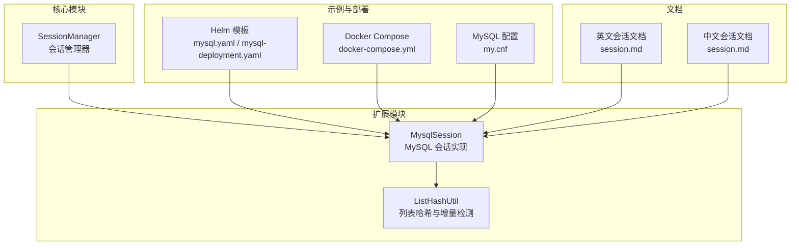
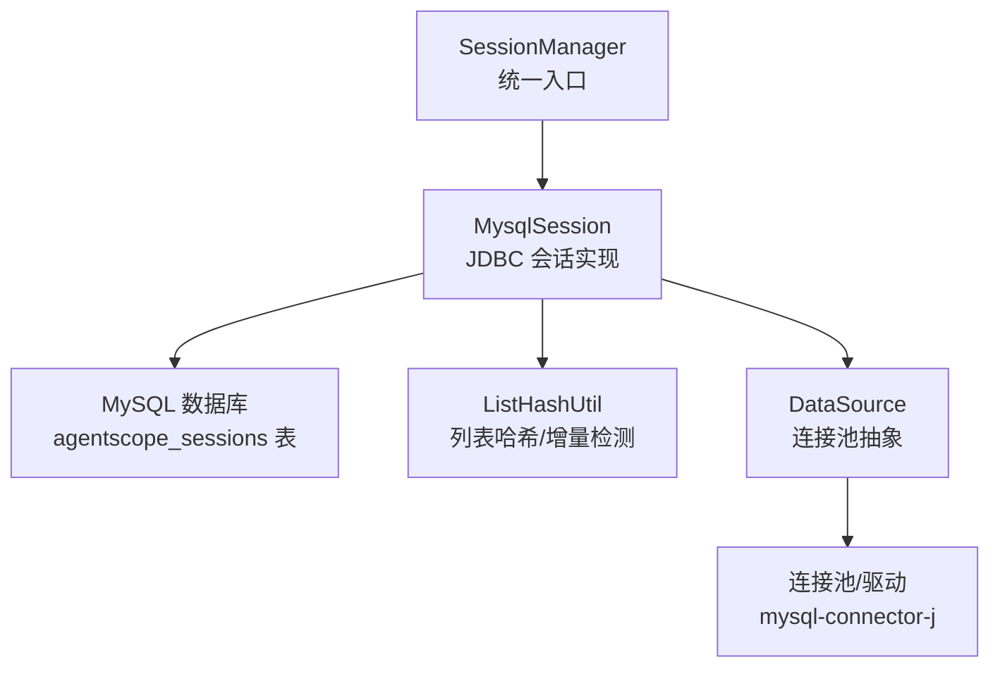
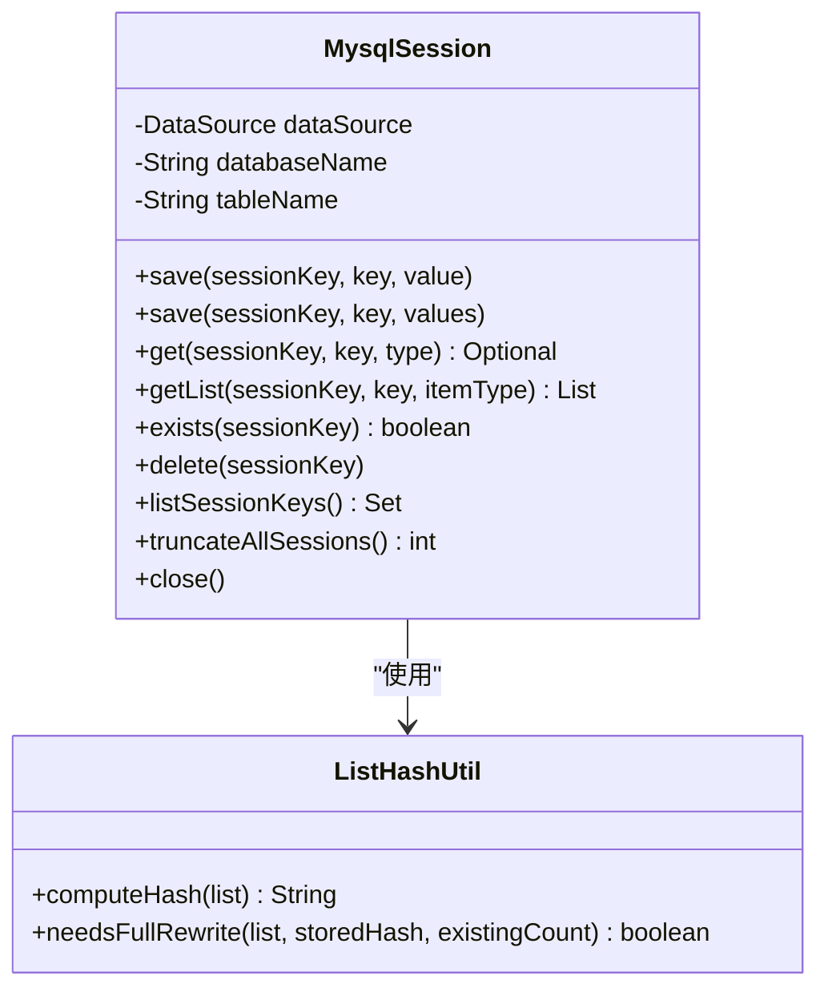
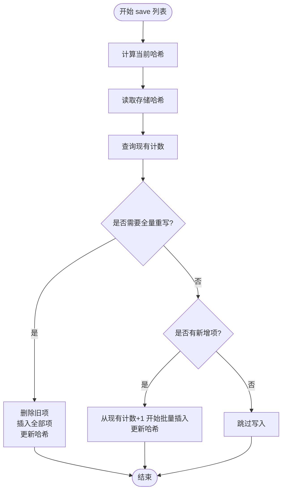
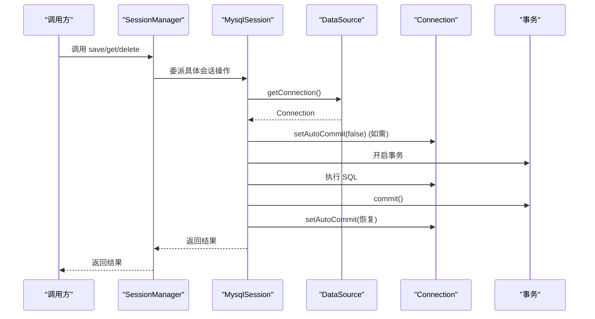
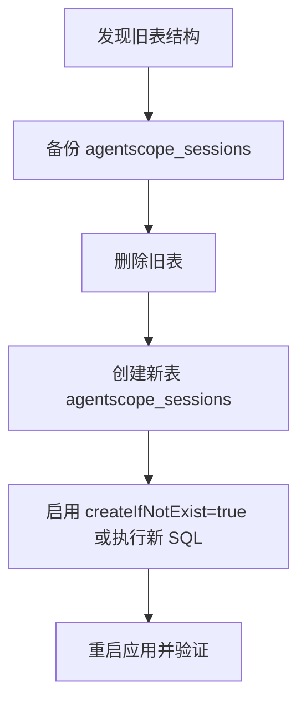
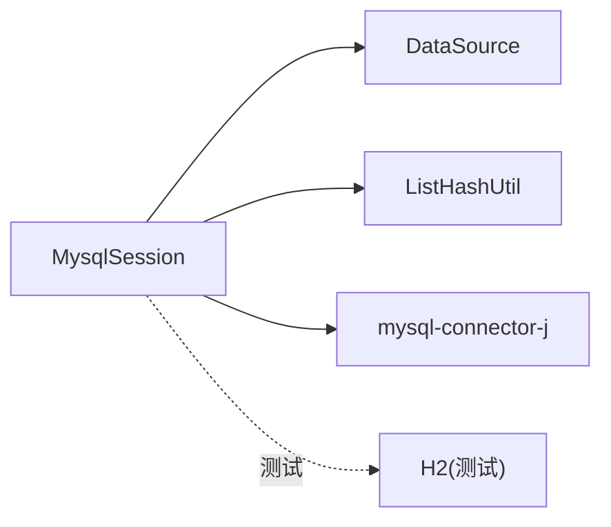

# MySQL 会话

<cite>
**本文引用的文件**
- [MysqlSession.java](file://agentscope-extensions/agentscope-extensions-session-mysql/src/main/java/io/agentscope/core/session/mysql/MysqlSession.java)
- [MysqlSessionTest.java](file://agentscope-extensions/agentscope-extensions-session-mysql/src/test/java/io/agentscope/core/session/mysql/MysqlSessionTest.java)
- [MysqlSessionE2ETest.java](file://agentscope-extensions/agentscope-extensions-session-mysql/src/test/java/io/agentscope/core/session/mysql/e2e/MysqlSessionE2ETest.java)
- [ListHashUtil.java](file://agentscope-core/src/main/java/io/agentscope/core/session/ListHashUtil.java)
- [ListHashUtilTest.java](file://agentscope-core/src/test/java/io/agentscope/core/session/ListHashUtilTest.java)
- [SessionManager.java](file://agentscope-core/src/main/java/io/agentscope/core/session/SessionManager.java)
- [mysql.yaml](file://agentscope-examples/boba-tea-shop/himarket-helm/templates/mysql.yaml)
- [mysql-deployment.yaml](file://agentscope-examples/boba-tea-shop/helm/templates/mysql-deployment.yaml)
- [docker-compose.yml](file://agentscope-examples/boba-tea-shop/docker-compose.yml)
- [my.cnf](file://agentscope-examples/boba-tea-shop/mysql-image/my.cnf)
- [pom.xml（MySQL 扩展）](file://agentscope-extensions/agentscope-extensions-session-mysql/pom.xml)
- [session.md（英文）](file://docs/en/task/session.md)
- [session.md（中文）](file://docs/zh/task/session.md)
</cite>

## 目录
1. [简介](#简介)
2. [项目结构](#项目结构)
3. [核心组件](#核心组件)
4. [架构总览](#架构总览)
5. [详细组件分析](#详细组件分析)
6. [依赖分析](#依赖分析)
7. [性能考虑](#性能考虑)
8. [故障排除指南](#故障排除指南)
9. [结论](#结论)
10. [附录](#附录)

## 简介
本文件面向需要在生产环境中稳定使用 MySQL 作为会话存储后端的开发者，系统性地阐述基于关系型数据库的会话实现：从表结构设计、连接与事务管理、持久化与查询优化、到连接池与超时配置、错误处理、数据迁移与备份恢复、以及部署与监控策略。文档以 AgentScope 的 MysqlSession 实现为核心，结合 Helm 编排与 Docker Compose 示例，提供可操作的实践建议。

## 项目结构
与 MySQL 会话相关的关键模块与示例位于以下路径：
- 核心实现：agentscope-extensions/agentscope-extensions-session-mysql/src/main/java/io/agentscope/core/session/mysql/MysqlSession.java
- 单元测试与端到端测试：MysqlSessionTest.java、MysqlSessionE2ETest.java
- 列哈希工具（增量列表优化）：ListHashUtil.java 及其测试
- 会话管理器（统一入口）：SessionManager.java
- 部署与示例：Helm 模板、Docker Compose、MySQL 配置文件
- 文档：docs/en/task/session.md、docs/zh/task/session.md

**图表来源**
- [MysqlSession.java:1-847](file://agentscope-extensions/agentscope-extensions-session-mysql/src/main/java/io/agentscope/core/session/mysql/MysqlSession.java#L1-L847)
- [ListHashUtil.java:1-138](file://agentscope-core/src/main/java/io/agentscope/core/session/ListHashUtil.java#L1-L138)
- [SessionManager.java:68-260](file://agentscope-core/src/main/java/io/agentscope/core/session/SessionManager.java#L68-L260)
- [mysql.yaml:1-228](file://agentscope-examples/boba-tea-shop/himarket-helm/templates/mysql.yaml#L1-L228)
- [mysql-deployment.yaml:1-114](file://agentscope-examples/boba-tea-shop/helm/templates/mysql-deployment.yaml#L1-L114)
- [docker-compose.yml:1-255](file://agentscope-examples/boba-tea-shop/docker-compose.yml#L1-L255)
- [my.cnf:1-34](file://agentscope-examples/boba-tea-shop/mysql-image/my.cnf#L1-L34)
- [session.md（英文）:374-477](file://docs/en/task/session.md#L374-L477)
- [session.md（中文）:438-477](file://docs/zh/task/session.md#L438-L477)

**章节来源**
- [MysqlSession.java:1-847](file://agentscope-extensions/agentscope-extensions-session-mysql/src/main/java/io/agentscope/core/session/mysql/MysqlSession.java#L1-L847)
- [MysqlSessionTest.java:1-672](file://agentscope-extensions/agentscope-extensions-session-mysql/src/test/java/io/agentscope/core/session/mysql/MysqlSessionTest.java#L1-L672)
- [MysqlSessionE2ETest.java:1-398](file://agentscope-extensions/agentscope-extensions-session-mysql/src/test/java/io/agentscope/core/session/mysql/e2e/MysqlSessionE2ETest.java#L1-L398)
- [ListHashUtil.java:1-138](file://agentscope-core/src/main/java/io/agentscope/core/session/ListHashUtil.java#L1-L138)
- [SessionManager.java:68-260](file://agentscope-core/src/main/java/io/agentscope/core/session/SessionManager.java#L68-L260)
- [mysql.yaml:1-228](file://agentscope-examples/boba-tea-shop/himarket-helm/templates/mysql.yaml#L1-L228)
- [mysql-deployment.yaml:1-114](file://agentscope-examples/boba-tea-shop/helm/templates/mysql-deployment.yaml#L1-L114)
- [docker-compose.yml:1-255](file://agentscope-examples/boba-tea-shop/docker-compose.yml#L1-L255)
- [my.cnf:1-34](file://agentscope-examples/boba-tea-shop/mysql-image/my.cnf#L1-L34)
- [session.md（英文）:374-477](file://docs/en/task/session.md#L374-L477)
- [session.md（中文）:438-477](file://docs/zh/task/session.md#L438-L477)

## 核心组件
- MysqlSession：基于 JDBC 的 MySQL 会话实现，支持单值状态与列表状态的持久化，内置增量写入与哈希校验，提供自动建库建表与标识符安全校验。
- ListHashUtil：为列表状态提供哈希采样计算与变更判断，支持“仅追加”与“全量重写”的智能选择。
- SessionManager：统一的会话管理入口，支持注入任意 Session 实现（含 MysqlSession），提供存在性检查、删除等通用能力。
- 测试与示例：单元测试覆盖构造器、保存/加载、事务提交、标识符校验等；端到端测试在 H2 MySQL 兼容模式下验证真实流程。

**章节来源**
- [MysqlSession.java:70-847](file://agentscope-extensions/agentscope-extensions-session-mysql/src/main/java/io/agentscope/core/session/mysql/MysqlSession.java#L70-L847)
- [ListHashUtil.java:18-138](file://agentscope-core/src/main/java/io/agentscope/core/session/ListHashUtil.java#L18-L138)
- [SessionManager.java:68-260](file://agentscope-core/src/main/java/io/agentscope/core/session/SessionManager.java#L68-L260)
- [MysqlSessionTest.java:79-672](file://agentscope-extensions/agentscope-extensions-session-mysql/src/test/java/io/agentscope/core/session/mysql/MysqlSessionTest.java#L79-L672)
- [MysqlSessionE2ETest.java:79-398](file://agentscope-extensions/agentscope-extensions-session-mysql/src/test/java/io/agentscope/core/session/mysql/e2e/MysqlSessionE2ETest.java#L79-L398)

## 架构总览
MysqlSession 将会话状态以“会话 ID + 状态键 + 行序号”的复合主键组织在表中，单值状态使用行序号 0，列表状态按顺序递增。通过哈希与计数判断实现“仅追加”或“全量重写”，并以显式事务确保写入一致性。

**图表来源**
- [MysqlSession.java:92-179](file://agentscope-extensions/agentscope-extensions-session-mysql/src/main/java/io/agentscope/core/session/mysql/MysqlSession.java#L92-L179)
- [ListHashUtil.java:49-138](file://agentscope-core/src/main/java/io/agentscope/core/session/ListHashUtil.java#L49-L138)
- [SessionManager.java:68-260](file://agentscope-core/src/main/java/io/agentscope/core/session/SessionManager.java#L68-L260)
- [pom.xml（MySQL 扩展）:41-45](file://agentscope-extensions/agentscope-extensions-session-mysql/pom.xml#L41-L45)

## 详细组件分析

### MysqlSession：表结构、连接与事务
- 表结构要点
  - 复合主键：(session_id, state_key, item_index)，其中 item_index=0 表示单值，>0 表示列表项。
  - 字段：state_data（JSON/LONGTEXT）、created_at、updated_at。
  - 字符集：utf8mb4、校对规则：utf8mb4_unicode_ci。
- 连接与事务
  - 写操作每次从 DataSource 获取新连接并在显式事务中执行，保证即使底层 DataSource 默认 autoCommit=false，也能正确提交/回滚。
  - 读操作复用连接池获取的连接，避免额外开销。
- 安全与健壮性
  - 数据库名与表名通过正则校验，防止 SQL 注入；特殊字符（如连字符）使用反引号转义。
  - 构造器支持 createIfNotExist=true/false，前者自动建库建表，后者严格校验存在性。
- 增量列表写入
  - 通过哈希与现有计数决定“全量重写”或“仅追加”，减少写放大。

**图表来源**
- [MysqlSession.java:325-673](file://agentscope-extensions/agentscope-extensions-session-mysql/src/main/java/io/agentscope/core/session/mysql/MysqlSession.java#L325-L673)
- [ListHashUtil.java:49-138](file://agentscope-core/src/main/java/io/agentscope/core/session/ListHashUtil.java#L49-L138)

**章节来源**
- [MysqlSession.java:47-847](file://agentscope-extensions/agentscope-extensions-session-mysql/src/main/java/io/agentscope/core/session/mysql/MysqlSession.java#L47-L847)

### 列表哈希与增量写入算法
- 哈希策略
  - 空列表返回固定常量；小列表（≤5）全部采样；大列表按四分位点采样，避免全量遍历。
- 写入决策
  - 若当前哈希与存储哈希不同或需补齐缺失项，则进行全量重写；否则仅追加新增项。
- 测试覆盖
  - 单测与端到端测试验证空列表、修改、增长、哈希不一致等场景。

**图表来源**
- [MysqlSession.java:374-418](file://agentscope-extensions/agentscope-extensions-session-mysql/src/main/java/io/agentscope/core/session/mysql/MysqlSession.java#L374-L418)
- [ListHashUtil.java:98-138](file://agentscope-core/src/main/java/io/agentscope/core/session/ListHashUtil.java#L98-L138)

**章节来源**
- [MysqlSession.java:374-418](file://agentscope-extensions/agentscope-extensions-session-mysql/src/main/java/io/agentscope/core/session/mysql/MysqlSession.java#L374-L418)
- [ListHashUtil.java:49-138](file://agentscope-core/src/main/java/io/agentscope/core/session/ListHashUtil.java#L49-L138)
- [ListHashUtilTest.java:35-208](file://agentscope-core/src/test/java/io/agentscope/core/session/ListHashUtilTest.java#L35-L208)

### 事务与连接管理
- 写事务
  - 在每个写方法内部获取新连接，若原连接 autoCommit=true 则临时关闭，执行后提交并恢复原状态。
- 特殊 DDL
  - TRUNCATE 为 DDL，隐式提交且不可回滚，因此直接执行，不走统一事务包装。
- 测试验证
  - 单测与端到端测试覆盖 autoCommit=false 场景下的提交/回滚与状态恢复。

**图表来源**
- [MysqlSession.java:293-323](file://agentscope-extensions/agentscope-extensions-session-mysql/src/main/java/io/agentscope/core/session/mysql/MysqlSession.java#L293-L323)
- [MysqlSessionTest.java:236-326](file://agentscope-extensions/agentscope-extensions-session-mysql/src/test/java/io/agentscope/core/session/mysql/MysqlSessionTest.java#L236-L326)
- [MysqlSessionE2ETest.java:165-201](file://agentscope-extensions/agentscope-extensions-session-mysql/src/test/java/io/agentscope/core/session/mysql/e2e/MysqlSessionE2ETest.java#L165-L201)

**章节来源**
- [MysqlSession.java:293-323](file://agentscope-extensions/agentscope-extensions-session-mysql/src/main/java/io/agentscope/core/session/mysql/MysqlSession.java#L293-L323)
- [MysqlSessionTest.java:236-326](file://agentscope-extensions/agentscope-extensions-session-mysql/src/test/java/io/agentscope/core/session/mysql/MysqlSessionTest.java#L236-L326)
- [MysqlSessionE2ETest.java:165-201](file://agentscope-extensions/agentscope-extensions-session-mysql/src/test/java/io/agentscope/core/session/mysql/e2e/MysqlSessionE2ETest.java#L165-L201)

### 数据库初始化与迁移
- 初始化脚本
  - 英文文档提供了新旧表结构对比与迁移步骤；中文文档提供了相同内容。
  - 新表结构采用复合主键 (session_id, state_key, item_index)，支持真正的增量列表存储。
- 迁移步骤
  - 备份旧表 → 删除旧表 → 使用 createIfNotExist=true 创建新表或手动执行新结构 SQL。
- Helm/Compose 示例
  - 提供 MySQL 部署模板与环境变量配置，便于一键拉起数据库实例。

**图表来源**
- [session.md（英文）:393-443](file://docs/en/task/session.md#L393-L443)
- [session.md（中文）:438-443](file://docs/zh/task/session.md#L438-L443)

**章节来源**
- [session.md（英文）:393-443](file://docs/en/task/session.md#L393-L443)
- [session.md（中文）:438-443](file://docs/zh/task/session.md#L438-L443)

## 依赖分析
- 组件耦合
  - MysqlSession 依赖 DataSource 抽象，不直接管理连接池生命周期，降低与外部容器的耦合。
  - 通过 ListHashUtil 解耦列表哈希与增量逻辑，提升可测试性与可维护性。
- 外部依赖
  - mysql-connector-j：MySQL JDBC 驱动。
  - H2（测试）：在 CI 中无需真实 MySQL 即可运行端到端测试。
- 可能的循环依赖
  - 当前模块间无循环依赖，职责清晰。

**图表来源**
- [pom.xml（MySQL 扩展）:41-53](file://agentscope-extensions/agentscope-extensions-session-mysql/pom.xml#L41-L53)
- [MysqlSession.java:92-94](file://agentscope-extensions/agentscope-extensions-session-mysql/src/main/java/io/agentscope/core/session/mysql/MysqlSession.java#L92-L94)

**章节来源**
- [pom.xml（MySQL 扩展）:33-55](file://agentscope-extensions/agentscope-extensions-session-mysql/pom.xml#L33-L55)
- [MysqlSession.java:92-94](file://agentscope-extensions/agentscope-extensions-session-mysql/src/main/java/io/agentscope/core/session/mysql/MysqlSession.java#L92-L94)

## 性能考虑
- 写入优化
  - 列表状态优先“仅追加”，减少读-改-写成本；哈希采样避免大列表全量扫描。
  - 批量插入（batch）用于连续写入，降低网络往返。
- 查询优化
  - 主键复合索引覆盖 (session_id, state_key, item_index)，单值查询与列表读取均高效。
  - 列表读取使用 ORDER BY item_index，保持顺序一致性。
- 连接与池化
  - 写操作使用独立连接并显式事务，避免与长事务竞争锁；读操作复用连接池连接。
- 字符集与排序规则
  - 使用 utf8mb4 与 utf8mb4_unicode_ci，兼顾多语言与排序需求。

[本节为通用指导，不直接分析具体文件]

## 故障排除指南
- 常见异常与定位
  - 数据库/表不存在：构造器 createIfNotExist=false 时抛出异常；应先启用自动创建或手动初始化。
  - SQL 注入防护触发：数据库名/表名包含非法字符或长度超限；请遵循命名规范。
  - 事务未提交：确认 DataSource 默认 autoCommit=false 的场景下，写操作已正确提交。
- 单元测试与端到端测试
  - 单测覆盖构造器、标识符校验、事务提交、列表哈希判定等；端到端测试在 H2 MySQL 兼容模式下验证真实流程。
- 部署问题排查
  - Helm/Compose 启动失败：检查 Secret、Service、卷挂载与健康检查配置。
  - 字符集问题：确认 MySQL 配置文件与启动参数一致。

**章节来源**
- [MysqlSessionTest.java:508-672](file://agentscope-extensions/agentscope-extensions-session-mysql/src/test/java/io/agentscope/core/session/mysql/MysqlSessionTest.java#L508-L672)
- [MysqlSessionE2ETest.java:277-398](file://agentscope-extensions/agentscope-extensions-session-mysql/src/test/java/io/agentscope/core/session/mysql/e2e/MysqlSessionE2ETest.java#L277-L398)
- [mysql.yaml:1-228](file://agentscope-examples/boba-tea-shop/himarket-helm/templates/mysql.yaml#L1-L228)
- [mysql-deployment.yaml:1-114](file://agentscope-examples/boba-tea-shop/helm/templates/mysql-deployment.yaml#L1-L114)
- [docker-compose.yml:1-255](file://agentscope-examples/boba-tea-shop/docker-compose.yml#L1-L255)
- [my.cnf:15-34](file://agentscope-examples/boba-tea-shop/mysql-image/my.cnf#L15-L34)

## 结论
MysqlSession 通过“复合主键 + 哈希采样 + 显式事务”的组合，在保证强一致性的前提下实现了高效的增量列表存储与灵活的迁移策略。配合 Helm/Compose 的部署模板与完善的测试体系，可在生产环境中稳定落地。

[本节为总结性内容，不直接分析具体文件]

## 附录

### 数据库初始化脚本与迁移步骤
- 新旧表结构对比与迁移步骤详见英文/中文会话文档对应章节。
- 建议在迁移前完成数据备份，并在预生产环境验证迁移脚本。

**章节来源**
- [session.md（英文）:393-443](file://docs/en/task/session.md#L393-L443)
- [session.md（中文）:438-443](file://docs/zh/task/session.md#L438-L443)

### 连接池与超时配置建议
- 连接池参数（示例）
  - 最小/最大连接数：依据 QPS 与并发会话数评估。
  - 连接超时：建议与应用请求超时一致或略短。
  - 空闲回收：开启空闲连接回收，避免资源泄漏。
- 超时设置
  - 连接获取超时：避免阻塞排队。
  - SQL 执行超时：针对长列表读取设置上限。
- 错误处理
  - 连接失败：重试与熔断策略，记录失败原因。
  - 事务冲突：捕获异常后回滚并重试（幂等写入更友好）。

[本节为通用指导，不直接分析具体文件]

### 部署与监控
- 部署
  - 使用 Helm/Compose 快速拉起 MySQL 实例，配置 Secret 与 Service。
  - 确保字符集与时区配置一致。
- 监控
  - 关注慢查询、连接数峰值、事务回滚率与表大小增长趋势。
  - 对列表写入热点进行容量规划与索引优化。

**章节来源**
- [mysql.yaml:1-228](file://agentscope-examples/boba-tea-shop/himarket-helm/templates/mysql.yaml#L1-L228)
- [mysql-deployment.yaml:1-114](file://agentscope-examples/boba-tea-shop/helm/templates/mysql-deployment.yaml#L1-L114)
- [docker-compose.yml:1-255](file://agentscope-examples/boba-tea-shop/docker-compose.yml#L1-L255)
- [my.cnf:15-34](file://agentscope-examples/boba-tea-shop/mysql-image/my.cnf#L15-L34)