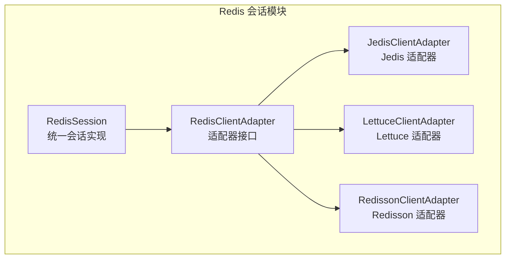
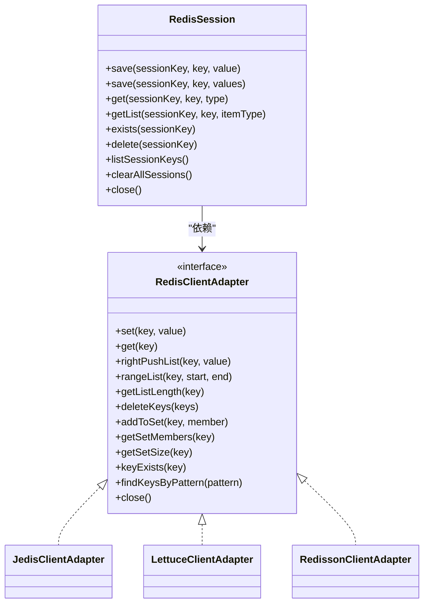
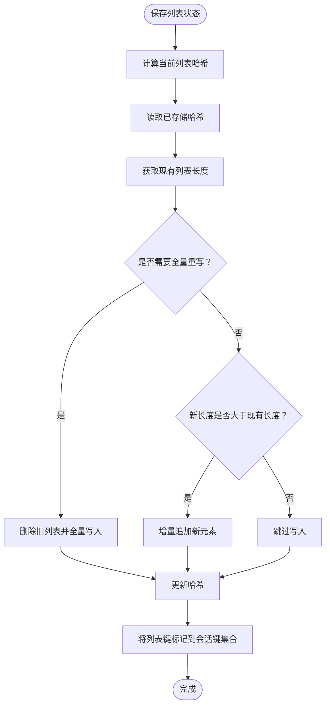
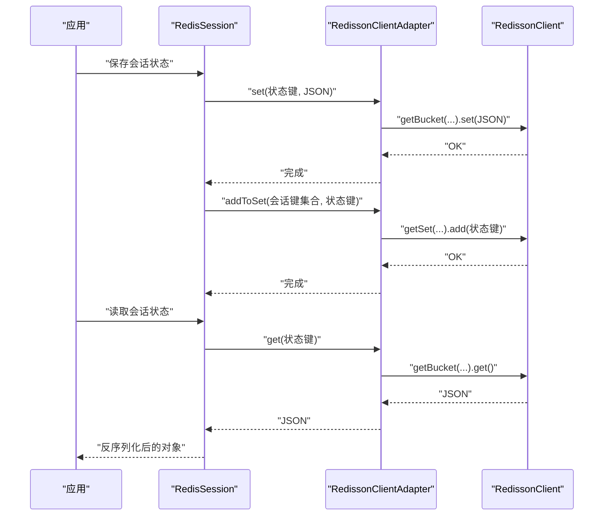
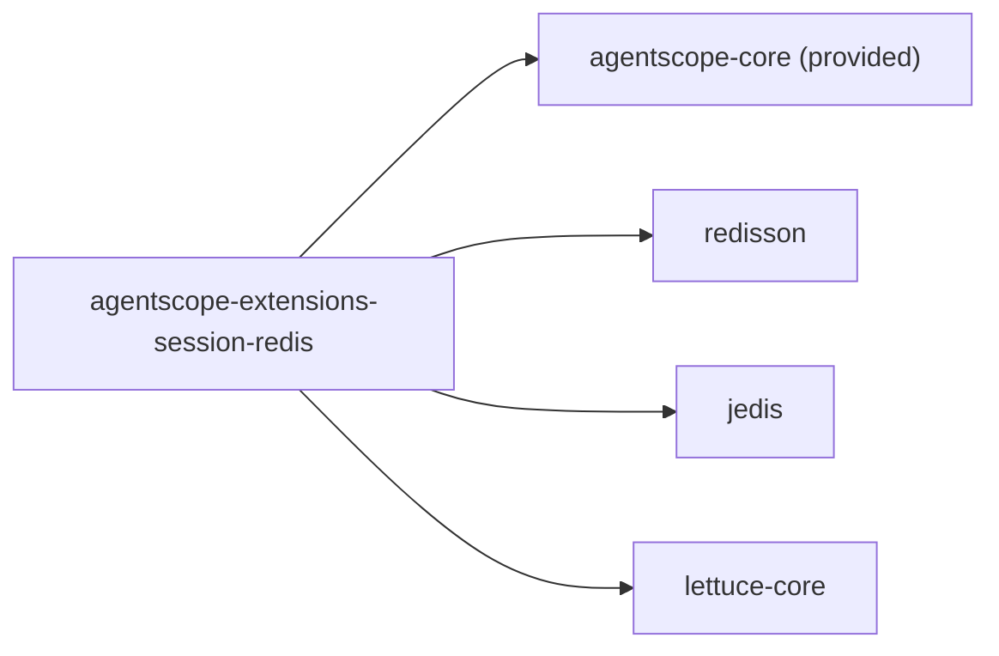

# Redis 会话

<cite>
**本文引用的文件**
- [RedisSession.java](file://agentscope-extensions/agentscope-extensions-session-redis/src/main/java/io/agentscope/core/session/redis/RedisSession.java)
- [RedisClientAdapter.java](file://agentscope-extensions/agentscope-extensions-session-redis/src/main/java/io/agentscope/core/session/redis/RedisClientAdapter.java)
- [JedisClientAdapter.java](file://agentscope-extensions/agentscope-extensions-session-redis/src/main/java/io/agentscope/core/session/redis/jedis/JedisClientAdapter.java)
- [LettuceClientAdapter.java](file://agentscope-extensions/agentscope-extensions-session-redis/src/main/java/io/agentscope/core/session/redis/lettuce/LettuceClientAdapter.java)
- [RedissonClientAdapter.java](file://agentscope-extensions/agentscope-extensions-session-redis/src/main/java/io/agentscope/core/session/redis/redisson/RedissonClientAdapter.java)
- [RedissonSessionTest.java](file://agentscope-extensions/agentscope-extensions-session-redis/src/test/java/io/agentscope/core/session/redis/RedissonSessionTest.java)
- [pom.xml](file://agentscope-extensions/agentscope-extensions-session-redis/pom.xml)
</cite>

## 目录
1. [简介](#简介)
2. [项目结构](#项目结构)
3. [核心组件](#核心组件)
4. [架构总览](#架构总览)
5. [详细组件分析](#详细组件分析)
6. [依赖分析](#依赖分析)
7. [性能考虑](#性能考虑)
8. [故障排查指南](#故障排查指南)
9. [结论](#结论)
10. [附录](#附录)

## 简介
本文件面向需要在分布式系统中使用 Redis 实现会话存储的开发者，围绕 AgentScope 中的 Redis 会话扩展进行系统性技术说明。内容涵盖：
- 基于 Redis 的会话存储机制与键空间设计
- 多客户端适配器（Jedis、Lettuce、Redisson）的特性与适用场景
- 会话数据的序列化存储、列表状态的增量更新与哈希校验、键集合跟踪
- 连接配置、集群与高可用模式、故障转移机制
- 缓存性能优化、数据一致性保障与监控指标建议
- 配置示例、部署指南与运维最佳实践

## 项目结构
该模块位于 agentscope-extensions 下，提供 Redis 会话能力，并通过适配器抽象屏蔽不同客户端的差异：
- 核心类：RedisSession（统一会话接口实现）
- 适配器接口：RedisClientAdapter（统一命令抽象）
- 具体适配器：JedisClientAdapter、LettuceClientAdapter、RedissonClientAdapter
- 测试：RedissonSessionTest（验证行为与边界）

图表来源
- [RedisSession.java:179-483](file://agentscope-extensions/agentscope-extensions-session-redis/src/main/java/io/agentscope/core/session/redis/RedisSession.java#L179-L483)
- [RedisClientAdapter.java:36-131](file://agentscope-extensions/agentscope-extensions-session-redis/src/main/java/io/agentscope/core/session/redis/RedisClientAdapter.java#L36-L131)
- [JedisClientAdapter.java:86-175](file://agentscope-extensions/agentscope-extensions-session-redis/src/main/java/io/agentscope/core/session/redis/jedis/JedisClientAdapter.java#L86-L175)
- [LettuceClientAdapter.java:93-336](file://agentscope-extensions/agentscope-extensions-session-redis/src/main/java/io/agentscope/core/session/redis/lettuce/LettuceClientAdapter.java#L93-L336)
- [RedissonClientAdapter.java:117-221](file://agentscope-extensions/agentscope-extensions-session-redis/src/main/java/io/agentscope/core/session/redis/redisson/RedissonClientAdapter.java#L117-L221)

章节来源
- [RedisSession.java:179-483](file://agentscope-extensions/agentscope-extensions-session-redis/src/main/java/io/agentscope/core/session/redis/RedisSession.java#L179-L483)
- [pom.xml:33-58](file://agentscope-extensions/agentscope-extensions-session-redis/pom.xml#L33-L58)

## 核心组件
- RedisSession：实现统一的会话接口，负责状态保存、读取、删除、枚举与清理；内部通过适配器调用具体 Redis 客户端。
- RedisClientAdapter：定义统一的 Redis 操作契约（字符串、列表、集合、键扫描等），屏蔽客户端差异。
- JedisClientAdapter：封装 UnifiedJedis 及其子类（单机、集群、哨兵），统一命令调用。
- LettuceClientAdapter：封装 RedisClient（单机/哨兵）与 RedisClusterClient（集群），分别使用同步命令对象。
- RedissonClientAdapter：封装 RedissonClient（单机、集群、哨兵、主从），提供高级数据结构与自动模式处理。

章节来源
- [RedisSession.java:213-374](file://agentscope-extensions/agentscope-extensions-session-redis/src/main/java/io/agentscope/core/session/redis/RedisSession.java#L213-L374)
- [RedisClientAdapter.java:36-131](file://agentscope-extensions/agentscope-extensions-session-redis/src/main/java/io/agentscope/core/session/redis/RedisClientAdapter.java#L36-L131)
- [JedisClientAdapter.java:86-175](file://agentscope-extensions/agentscope-extensions-session-redis/src/main/java/io/agentscope/core/session/redis/jedis/JedisClientAdapter.java#L86-L175)
- [LettuceClientAdapter.java:93-336](file://agentscope-extensions/agentscope-extensions-session-redis/src/main/java/io/agentscope/core/session/redis/lettuce/LettuceClientAdapter.java#L93-L336)
- [RedissonClientAdapter.java:117-221](file://agentscope-extensions/agentscope-extensions-session-redis/src/main/java/io/agentscope/core/session/redis/redisson/RedissonClientAdapter.java#L117-L221)

## 架构总览
Redis 会话采用“会话层 + 适配器层 + 客户端”的分层设计，会话层不直接依赖具体客户端，仅通过适配器接口交互，从而实现对多客户端的统一支持。

图表来源
- [RedisSession.java:179-483](file://agentscope-extensions/agentscope-extensions-session-redis/src/main/java/io/agentscope/core/session/redis/RedisSession.java#L179-L483)
- [RedisClientAdapter.java:36-131](file://agentscope-extensions/agentscope-extensions-session-redis/src/main/java/io/agentscope/core/session/redis/RedisClientAdapter.java#L36-L131)
- [JedisClientAdapter.java:86-175](file://agentscope-extensions/agentscope-extensions-session-redis/src/main/java/io/agentscope/core/session/redis/jedis/JedisClientAdapter.java#L86-L175)
- [LettuceClientAdapter.java:93-336](file://agentscope-extensions/agentscope-extensions-session-redis/src/main/java/io/agentscope/core/session/redis/lettuce/LettuceClientAdapter.java#L93-L336)
- [RedissonClientAdapter.java:117-221](file://agentscope-extensions/agentscope-extensions-session-redis/src/main/java/io/agentscope/core/session/redis/redisson/RedissonClientAdapter.java#L117-L221)

## 详细组件分析

### RedisSession：会话存储与键空间设计
- 键空间设计
  - 单值状态键：{前缀}{会话ID}:{状态键}
  - 列表状态键：{前缀}{会话ID}:{状态键}:list
  - 列表哈希键：{前缀}{会话ID}:{状态键}:list:_hash（用于增量写入判断）
  - 会话键集合：{前缀}{会话ID}:_keys（Set，记录该会话下所有状态键）
- 序列化与反序列化：使用统一的 JSON 编解码工具进行 State 对象的序列化存储与解析。
- 列表写入策略：先计算当前列表哈希，对比已存储哈希与长度，决定全量重写或增量追加，以降低写放大。
- 会话存在性：通过检查会话键集合是否存在且非空来判定。
- 删除与清理：删除时遍历会话键集合，拼装实际键名并批量删除；提供按前缀扫描清理的异步方法。
- 列表范围读取：支持区间读取，返回反序列化后的对象列表。

图表来源
- [RedisSession.java:228-267](file://agentscope-extensions/agentscope-extensions-session-redis/src/main/java/io/agentscope/core/session/redis/RedisSession.java#L228-L267)

章节来源
- [RedisSession.java:213-374](file://agentscope-extensions/agentscope-extensions-session-redis/src/main/java/io/agentscope/core/session/redis/RedisSession.java#L213-L374)
- [RedisSession.java:397-427](file://agentscope-extensions/agentscope-extensions-session-redis/src/main/java/io/agentscope/core/session/redis/RedisSession.java#L397-L427)

### RedisClientAdapter：统一命令抽象
- 职责：为不同客户端提供一致的方法签名，包括字符串、列表、集合与键扫描操作。
- 设计要点：方法命名直观，便于理解；通过适配器实现与具体客户端解耦。

章节来源
- [RedisClientAdapter.java:36-131](file://agentscope-extensions/agentscope-extensions-session-redis/src/main/java/io/agentscope/core/session/redis/RedisClientAdapter.java#L36-L131)

### JedisClientAdapter：Jedis 多模式支持
- 支持类型：UnifiedJedis 及其子类（单机、集群、哨兵）。
- 关键点：通过统一接口处理不同部署模式，简化上层使用；提供基于游标扫描的键匹配实现。

章节来源
- [JedisClientAdapter.java:86-175](file://agentscope-extensions/agentscope-extensions-session-redis/src/main/java/io/agentscope/core/session/redis/jedis/JedisClientAdapter.java#L86-L175)

### LettuceClientAdapter：Lettuce 多模式支持
- 支持类型：RedisClient（单机/哨兵）、RedisClusterClient（集群）。
- 关键点：针对不同模式使用不同的命令对象；提供基于游标的键扫描实现；关闭时分别释放连接与客户端资源。

章节来源
- [LettuceClientAdapter.java:93-336](file://agentscope-extensions/agentscope-extensions-session-redis/src/main/java/io/agentscope/core/session/redis/lettuce/LettuceClientAdapter.java#L93-L336)

### RedissonClientAdapter：Redisson 统一模式体验
- 支持类型：单机、集群、哨兵、主从。
- 关键点：通过 RedissonClient 统一抽象，内部处理连接池、线程安全与模式细节；提供高级数据结构访问与键扫描。

章节来源
- [RedissonClientAdapter.java:117-221](file://agentscope-extensions/agentscope-extensions-session-redis/src/main/java/io/agentscope/core/session/redis/redisson/RedissonClientAdapter.java#L117-L221)

### 使用流程（以 Redisson 为例）

图表来源
- [RedisSession.java:213-282](file://agentscope-extensions/agentscope-extensions-session-redis/src/main/java/io/agentscope/core/session/redis/RedisSession.java#L213-L282)
- [RedissonClientAdapter.java:138-148](file://agentscope-extensions/agentscope-extensions-session-redis/src/main/java/io/agentscope/core/session/redis/redisson/RedissonClientAdapter.java#L138-L148)

## 依赖分析
- 模块依赖：依赖 agentscope-core（可选提供），并引入 Redisson、Jedis、Lettuce 三大客户端。
- 版本与范围：作为扩展模块，客户端版本由父工程或外部环境管理。

图表来源
- [pom.xml:33-58](file://agentscope-extensions/agentscope-extensions-session-redis/pom.xml#L33-L58)

章节来源
- [pom.xml:33-58](file://agentscope-extensions/agentscope-extensions-session-redis/pom.xml#L33-L58)

## 性能考虑
- 写入优化
  - 列表状态采用“哈希 + 长度”判断，避免不必要的全量重写，优先增量追加，减少网络往返与写放大。
  - 批量删除键时一次性传入多个键，降低 RTT。
- 读取优化
  - 区间读取列表时按需指定起止索引，避免一次性拉取大列表。
  - 使用键集合快速判断会话是否存在，避免逐个键查询。
- 序列化开销
  - 统一使用 JSON 编解码，建议控制单条状态大小，避免超大对象导致序列化/反序列化成本过高。
- 并发与连接
  - Lettuce 与 Redisson 提供连接池与线程安全封装；Jedis 在新客户端中统一抽象，仍需关注连接复用与超时设置。
- 清理策略
  - 提供按前缀扫描清理的异步方法，适合在维护窗口或后台任务中执行，避免阻塞主线程。

## 故障排查指南
- 常见问题定位
  - 保存失败：检查 Redis 可达性、权限与键空间前缀配置；查看异常堆栈中的具体方法与键名。
  - 读取为空：确认键是否存在、JSON 是否正确序列化、键集合是否被正确维护。
  - 列表未更新：确认增量判断逻辑是否命中（哈希变化或长度增长），必要时允许全量重写。
- 单元测试参考
  - Redisson 适配器的行为测试覆盖了保存/读取、存在性判断、删除、枚举与清理等关键路径，可据此对照实现差异。

章节来源
- [RedissonSessionTest.java:75-334](file://agentscope-extensions/agentscope-extensions-session-redis/src/test/java/io/agentscope/core/session/redis/RedissonSessionTest.java#L75-L334)

## 结论
该 Redis 会话实现通过适配器模式实现了对 Jedis、Lettuce、Redisson 的统一支持，结合列表哈希校验与增量写入策略，在保证功能完整性的同时兼顾性能与可维护性。配合合理的键空间设计与清理策略，可满足分布式场景下的会话存储需求。

## 附录

### 配置与部署建议
- 键空间前缀
  - 建议为不同环境或应用设置独立前缀，避免键冲突；可通过构建器设置自定义前缀。
- 客户端选择
  - Jedis：简单易用，生态成熟；适合中小规模与单机/哨兵部署。
  - Lettuce：异步与连接池较优；适合高并发与集群部署。
  - Redisson：功能丰富、自动模式切换；适合复杂拓扑与高可用需求。
- 集群与高可用
  - Jedis/Lettuce：通过对应客户端的集群/哨兵配置启用；注意扫描命令在集群模式下的行为差异。
  - Redisson：通过配置对象统一声明模式，自动处理连接与故障转移。
- 过期策略
  - 当前实现未内置 TTL 设置；如需过期，可在上层业务侧为会话键集合或单键设置过期，或在 Redis 层面配合过期策略统一管理。
- 监控指标
  - 建议采集：命令耗时分布、连接池使用率、键扫描耗时、序列化/反序列化耗时、删除批次大小等。

### 使用示例（路径指引）
- Jedis 单机/集群/哨兵示例：参见会话类注释中的使用示例路径
  - [RedisSession.java:60-103](file://agentscope-extensions/agentscope-extensions-session-redis/src/main/java/io/agentscope/core/session/redis/RedisSession.java#L60-L103)
- Lettuce 单机/集群/哨兵示例：参见会话类注释中的使用示例路径
  - [RedisSession.java:105-147](file://agentscope-extensions/agentscope-extensions-session-redis/src/main/java/io/agentscope/core/session/redis/RedisSession.java#L105-L147)
- Redisson 示例：参见会话类注释中的使用示例路径
  - [RedisSession.java:149-177](file://agentscope-extensions/agentscope-extensions-session-redis/src/main/java/io/agentscope/core/session/redis/RedisSession.java#L149-L177)