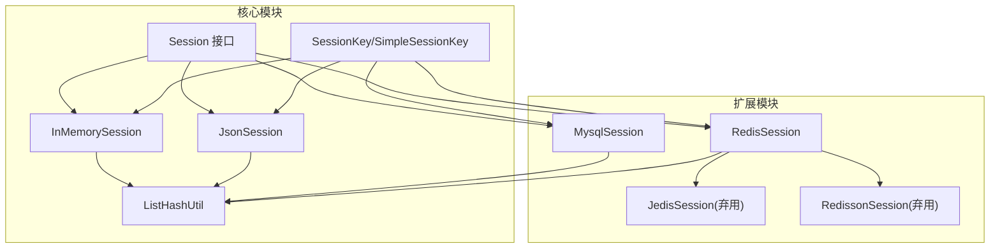
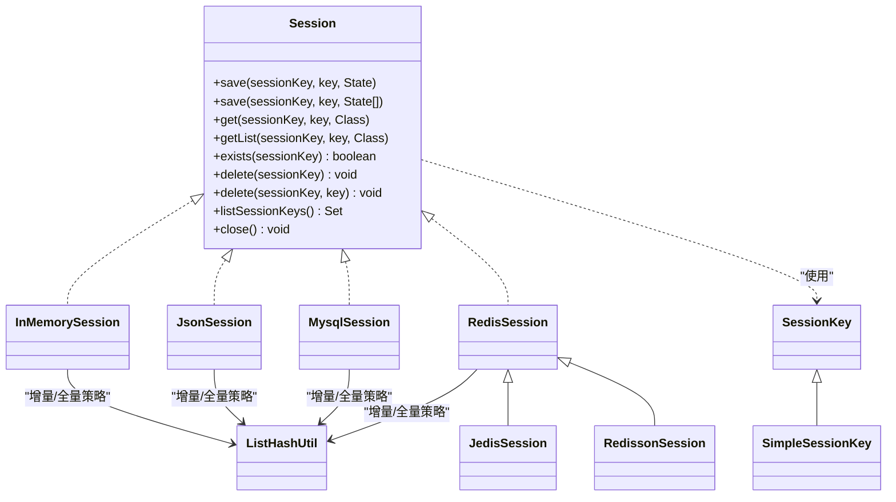
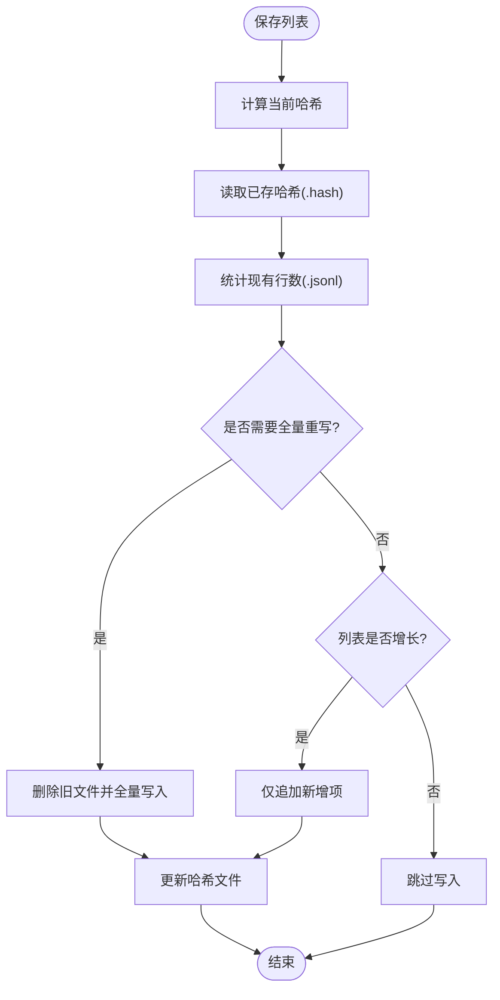
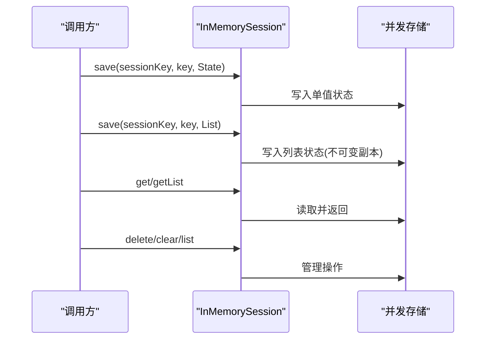
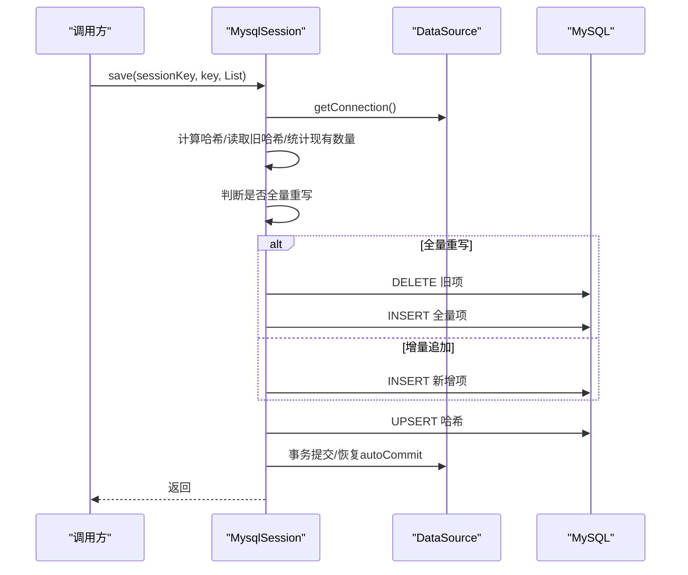
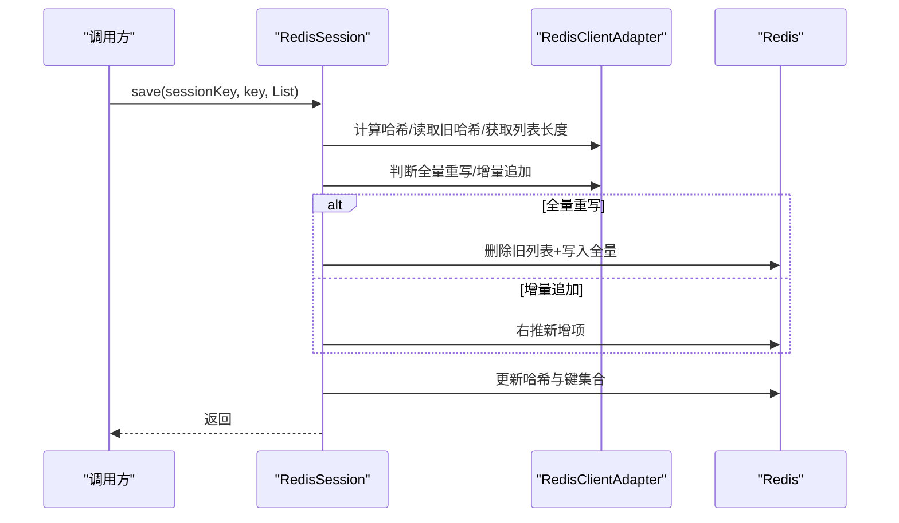
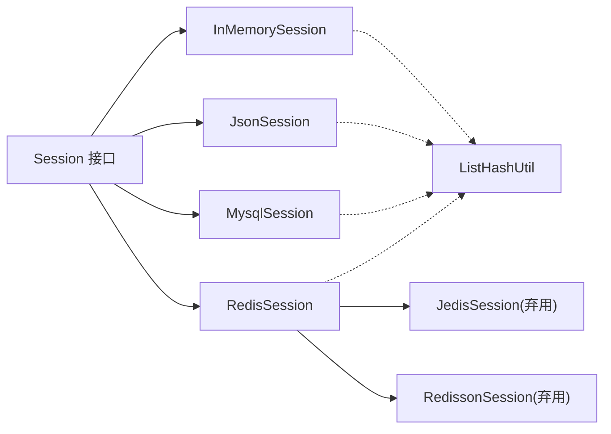

# 会话实现

<cite>
**本文引用的文件**
- [Session.java](file://agentscope-core/src/main/java/io/agentscope/core/session/Session.java)
- [InMemorySession.java](file://agentscope-core/src/main/java/io/agentscope/core/session/InMemorySession.java)
- [JsonSession.java](file://agentscope-core/src/main/java/io/agentscope/core/session/JsonSession.java)
- [MysqlSession.java](file://agentscope-extensions/agentscope-extensions-session-mysql/src/main/java/io/agentscope/core/session/mysql/MysqlSession.java)
- [RedisSession.java](file://agentscope-extensions/agentscope-extensions-session-redis/src/main/java/io/agentscope/core/session/redis/RedisSession.java)
- [JedisSession.java](file://agentscope-extensions/agentscope-extensions-session-redis/src/main/java/io/agentscope/core/session/redis/jedis/JedisSession.java)
- [RedissonSession.java](file://agentscope-extensions/agentscope-extensions-session-redis/src/main/java/io/agentscope/core/session/redis/redisson/RedissonSession.java)
- [ListHashUtil.java](file://agentscope-core/src/main/java/io/agentscope/core/session/ListHashUtil.java)
- [SessionKey.java](file://agentscope-core/src/main/java/io/agentscope/core/state/SessionKey.java)
- [SimpleSessionKey.java](file://agentscope-core/src/main/java/io/agentscope/core/state/SimpleSessionKey.java)
- [InMemorySessionTest.java](file://agentscope-core/src/test/java/io/agentscope/core/session/InMemorySessionTest.java)
- [session.md](file://docs/zh/task/session.md)
</cite>

## 目录
1. [简介](#简介)
2. [项目结构](#项目结构)
3. [核心组件](#核心组件)
4. [架构总览](#架构总览)
5. [详细组件分析](#详细组件分析)
6. [依赖关系分析](#依赖关系分析)
7. [性能考量](#性能考量)
8. [故障排查指南](#故障排查指南)
9. [结论](#结论)
10. [附录](#附录)

## 简介
本文件面向 AgentScope Java 的会话实现，系统性梳理并对比四种会话存储方案：JsonSession（文件存储）、InMemorySession（内存存储）、MySQL 会话与 Redis 会话。文档围绕数据存储策略、性能特征、配置选项、一致性保障与适用场景展开，并提供可视化图示与选型建议，帮助开发者基于业务需求做出合适的选择。

## 项目结构
AgentScope 将会话接口与核心实现置于 agentscope-core 中，扩展的 MySQL 与 Redis 会话实现在 agentscope-extensions 下。会话键类型由 state 包提供，工具类 ListHashUtil 用于增量写入的哈希检测。

图表来源
- [Session.java:53-146](file://agentscope-core/src/main/java/io/agentscope/core/session/Session.java#L53-L146)
- [InMemorySession.java:58-250](file://agentscope-core/src/main/java/io/agentscope/core/session/InMemorySession.java#L58-L250)
- [JsonSession.java:58-510](file://agentscope-core/src/main/java/io/agentscope/core/session/JsonSession.java#L58-L510)
- [MysqlSession.java:70-800](file://agentscope-extensions/agentscope-extensions-session-mysql/src/main/java/io/agentscope/core/session/mysql/MysqlSession.java#L70-L800)
- [RedisSession.java:179-484](file://agentscope-extensions/agentscope-extensions-session-redis/src/main/java/io/agentscope/core/session/redis/RedisSession.java#L179-L484)
- [JedisSession.java:58-354](file://agentscope-extensions/agentscope-extensions-session-redis/src/main/java/io/agentscope/core/session/redis/jedis/JedisSession.java#L58-L354)
- [RedissonSession.java:61-339](file://agentscope-extensions/agentscope-extensions-session-redis/src/main/java/io/agentscope/core/session/redis/redisson/RedissonSession.java#L61-L339)
- [ListHashUtil.java:49-173](file://agentscope-core/src/main/java/io/agentscope/core/session/ListHashUtil.java#L49-L173)
- [SessionKey.java:46-63](file://agentscope-core/src/main/java/io/agentscope/core/state/SessionKey.java#L46-L63)
- [SimpleSessionKey.java:37-71](file://agentscope-core/src/main/java/io/agentscope/core/state/SimpleSessionKey.java#L37-L71)

章节来源
- [Session.java:24-52](file://agentscope-core/src/main/java/io/agentscope/core/session/Session.java#L24-L52)
- [session.md:45-108](file://docs/zh/task/session.md#L45-L108)

## 核心组件
- Session 接口：定义统一的会话存取 API，支持单值与列表的保存/读取、存在性检查、删除、列出会话键以及可选的关闭资源。
- SessionKey/SimpleSessionKey：会话键抽象与默认实现，负责将复杂键结构序列化为存储适配器可识别的标识。
- ListHashUtil：提供列表哈希计算与“是否需要全量重写”的判断，支撑增量写入与一致性检测。

章节来源
- [Session.java:53-146](file://agentscope-core/src/main/java/io/agentscope/core/session/Session.java#L53-L146)
- [SessionKey.java:46-63](file://agentscope-core/src/main/java/io/agentscope/core/state/SessionKey.java#L46-L63)
- [SimpleSessionKey.java:37-71](file://agentscope-core/src/main/java/io/agentscope/core/state/SimpleSessionKey.java#L37-L71)
- [ListHashUtil.java:49-173](file://agentscope-core/src/main/java/io/agentscope/core/session/ListHashUtil.java#L49-L173)

## 架构总览
四种实现均遵循 Session 接口，但采用不同的存储介质与一致性策略：

图表来源
- [Session.java:53-146](file://agentscope-core/src/main/java/io/agentscope/core/session/Session.java#L53-L146)
- [InMemorySession.java:58-250](file://agentscope-core/src/main/java/io/agentscope/core/session/InMemorySession.java#L58-L250)
- [JsonSession.java:58-510](file://agentscope-core/src/main/java/io/agentscope/core/session/JsonSession.java#L58-L510)
- [MysqlSession.java:70-800](file://agentscope-extensions/agentscope-extensions-session-mysql/src/main/java/io/agentscope/core/session/mysql/MysqlSession.java#L70-L800)
- [RedisSession.java:179-484](file://agentscope-extensions/agentscope-extensions-session-redis/src/main/java/io/agentscope/core/session/redis/RedisSession.java#L179-L484)
- [JedisSession.java:58-354](file://agentscope-extensions/agentscope-extensions-session-redis/src/main/java/io/agentscope/core/session/redis/jedis/JedisSession.java#L58-L354)
- [RedissonSession.java:61-339](file://agentscope-extensions/agentscope-extensions-session-redis/src/main/java/io/agentscope/core/session/redis/redisson/RedissonSession.java#L61-L339)
- [ListHashUtil.java:49-173](file://agentscope-core/src/main/java/io/agentscope/core/session/ListHashUtil.java#L49-L173)
- [SessionKey.java:46-63](file://agentscope-core/src/main/java/io/agentscope/core/state/SessionKey.java#L46-L63)
- [SimpleSessionKey.java:37-71](file://agentscope-core/src/main/java/io/agentscope/core/state/SimpleSessionKey.java#L37-L71)

## 详细组件分析

### JsonSession（文件存储）
- 存储策略
  - 单值状态：每个键对应一个 JSON 文件（.json）。
  - 列表状态：每个键对应一个 JSONL 文件（.jsonl），逐条记录。
  - 增量写入：通过哈希文件（.hash）记录已存储列表的摘要，仅追加新增项；若列表被修改或收缩，则全量重写。
  - 目录组织：每个会话一个目录，目录名为 sessionId（或对特殊字符进行 URL-safe Base64 编码）。
- 性能特征
  - 顺序写入与追加写入为主，I/O 开销主要来自新增项追加；全量重写成本较高但频率低。
  - 读取为顺序扫描 JSONL 文件，适合小至中等规模列表；大规模列表读取可能成为瓶颈。
- 一致性保障
  - 追加写入与哈希校验结合，避免并发写入导致的覆盖问题；目录级删除确保会话整体清理。
- 配置与使用
  - 默认存储位置位于用户主目录下的隐藏目录；可通过构造函数指定自定义目录。
  - 支持列出会话、删除会话、删除单键、清空全部会话（异步任务）。
- 适用场景
  - 生产环境跨重启持久化、离线调试、数据可审计与可导出。

图表来源
- [JsonSession.java:127-162](file://agentscope-core/src/main/java/io/agentscope/core/session/JsonSession.java#L127-L162)
- [JsonSession.java:384-415](file://agentscope-core/src/main/java/io/agentscope/core/session/JsonSession.java#L384-L415)
- [ListHashUtil.java:148-171](file://agentscope-core/src/main/java/io/agentscope/core/session/ListHashUtil.java#L148-L171)

章节来源
- [JsonSession.java:58-510](file://agentscope-core/src/main/java/io/agentscope/core/session/JsonSession.java#L58-L510)
- [ListHashUtil.java:49-173](file://agentscope-core/src/main/java/io/agentscope/core/session/ListHashUtil.java#L49-L173)
- [session.md:54-82](file://docs/zh/task/session.md#L54-L82)

### InMemorySession（内存存储）
- 存储策略
  - 使用并发安全的映射结构存储于内存；单值与列表分别维护独立映射。
  - 列表保存采用不可变副本（防御式拷贝）防止外部修改影响内部状态。
- 性能特征
  - 读写均为内存操作，延迟极低；适合高频读写与短生命周期场景。
  - 内存占用随会话数量与状态大小线性增长；重启即清空。
- 生命周期控制
  - 提供会话计数、清空全部、删除单会话、删除单键、列出会话键等管理能力。
- 适用场景
  - 单进程测试、集成测试、临时会话、快速原型开发。

图表来源
- [InMemorySession.java:70-190](file://agentscope-core/src/main/java/io/agentscope/core/session/InMemorySession.java#L70-L190)
- [InMemorySession.java:224-248](file://agentscope-core/src/main/java/io/agentscope/core/session/InMemorySession.java#L224-L248)

章节来源
- [InMemorySession.java:58-250](file://agentscope-core/src/main/java/io/agentscope/core/session/InMemorySession.java#L58-L250)
- [InMemorySessionTest.java:34-219](file://agentscope-core/src/test/java/io/agentscope/core/session/InMemorySessionTest.java#L34-L219)

### MySQL 会话（关系型数据库）
- 存储策略
  - 表结构：主键包含 session_id、state_key、item_index，单值状态使用 item_index=0，列表状态按顺序行存储。
  - 增量写入：仅插入新增项，避免读改写；哈希文件用于检测列表是否被修改或收缩。
  - 连接管理：每次写操作获取新连接并在显式事务中执行，结束后恢复原 autoCommit 状态。
  - 自动建表：可选择自动创建数据库与表，或要求已存在。
- 性能特征
  - 增量写入减少随机 I/O；批量插入提升写吞吐；读取按索引顺序扫描。
  - 事务保障 ACID，适合强一致场景；网络延迟与连接池开销需考虑。
- 一致性保障
  - 显式事务提交/回滚，异常抑制与恢复；参数化查询防注入。
- 配置与使用
  - 支持默认/自定义数据库与表名；支持自动建库建表与存在性校验；提供截断清理方法。
- 适用场景
  - 生产级持久化、强一致要求、团队协作与审计追踪。

图表来源
- [MysqlSession.java:374-418](file://agentscope-extensions/agentscope-extensions-session-mysql/src/main/java/io/agentscope/core/session/mysql/MysqlSession.java#L374-L418)
- [MysqlSession.java:293-323](file://agentscope-extensions/agentscope-extensions-session-mysql/src/main/java/io/agentscope/core/session/mysql/MysqlSession.java#L293-L323)

章节来源
- [MysqlSession.java:70-800](file://agentscope-extensions/agentscope-extensions-session-mysql/src/main/java/io/agentscope/core/session/mysql/MysqlSession.java#L70-L800)
- [ListHashUtil.java:148-171](file://agentscope-core/src/main/java/io/agentscope/core/session/ListHashUtil.java#L148-L171)

### Redis 会话（缓存存储）
- 存储策略
  - 键结构：单值状态使用 {prefix}{sessionId}:{key}，列表状态使用 {prefix}{sessionId}:{key}:list，哈希用于变更检测，会话键集合使用 {prefix}{sessionId}:_keys。
  - 增量写入：仅右推新增项；哈希文件用于检测列表变化。
  - 客户端适配：统一 RedisSession 支持 Jedis、Lettuce、Redisson 多客户端，Builder 模式注入。
- 性能特征
  - 内存型存储，读写延迟低；列表右推为 O(1) 操作；支持集群/哨兵/主从部署。
- 一致性保障
  - 单键操作原子；列表追加通过客户端适配层保证；键集合用于会话整体删除。
- 配置与使用
  - 支持自定义键前缀；提供 Builder 注入不同客户端；支持列出会话键、删除会话、清空全部。
- 适用场景
  - 分布式系统、高并发读写、缓存/会话共享、微服务架构。

图表来源
- [RedisSession.java:228-267](file://agentscope-extensions/agentscope-extensions-session-redis/src/main/java/io/agentscope/core/session/redis/RedisSession.java#L228-L267)
- [RedisSession.java:371-395](file://agentscope-extensions/agentscope-extensions-session-redis/src/main/java/io/agentscope/core/session/redis/RedisSession.java#L371-L395)

章节来源
- [RedisSession.java:179-484](file://agentscope-extensions/agentscope-extensions-session-redis/src/main/java/io/agentscope/core/session/redis/RedisSession.java#L179-L484)
- [JedisSession.java:120-166](file://agentscope-extensions/agentscope-extensions-session-redis/src/main/java/io/agentscope/core/session/redis/jedis/JedisSession.java#L120-L166)
- [RedissonSession.java:110-138](file://agentscope-extensions/agentscope-extensions-session-redis/src/main/java/io/agentscope/core/session/redis/redisson/RedissonSession.java#L110-L138)

## 依赖关系分析
- 耦合与内聚
  - Session 接口与具体实现松耦合，便于替换与扩展；ListHashUtil 作为通用工具被多实现复用。
  - RedisSession 统一封装多客户端适配，降低上层对具体客户端的依赖。
- 外部依赖
  - MySQL 实现依赖 DataSource 与 JDBC；Redis 实现依赖多种客户端适配器。
- 循环依赖
  - 未发现循环依赖；工具类无反向依赖。

图表来源
- [Session.java:53-146](file://agentscope-core/src/main/java/io/agentscope/core/session/Session.java#L53-L146)
- [InMemorySession.java:58-250](file://agentscope-core/src/main/java/io/agentscope/core/session/InMemorySession.java#L58-L250)
- [JsonSession.java:58-510](file://agentscope-core/src/main/java/io/agentscope/core/session/JsonSession.java#L58-L510)
- [MysqlSession.java:70-800](file://agentscope-extensions/agentscope-extensions-session-mysql/src/main/java/io/agentscope/core/session/mysql/MysqlSession.java#L70-L800)
- [RedisSession.java:179-484](file://agentscope-extensions/agentscope-extensions-session-redis/src/main/java/io/agentscope/core/session/redis/RedisSession.java#L179-L484)
- [JedisSession.java:58-354](file://agentscope-extensions/agentscope-extensions-session-redis/src/main/java/io/agentscope/core/session/redis/jedis/JedisSession.java#L58-L354)
- [RedissonSession.java:61-339](file://agentscope-extensions/agentscope-extensions-session-redis/src/main/java/io/agentscope/core/session/redis/redisson/RedissonSession.java#L61-L339)
- [ListHashUtil.java:49-173](file://agentscope-core/src/main/java/io/agentscope/core/session/ListHashUtil.java#L49-L173)

## 性能考量
- I/O 与延迟
  - InMemorySession：内存访问，延迟最低；适合高频读写与短生命周期。
  - JsonSession：顺序/追加写入，I/O 成本较低；大规模列表读取可能成为瓶颈。
  - MysqlSession：批量插入与顺序读取，适合强一致与持久化；网络与连接池开销需评估。
  - RedisSession：内存型存储，延迟低；支持横向扩展与高并发。
- 扩展性
  - Redis 与 MySQL 更易水平扩展；JsonSession 适合单机部署；InMemorySession 不支持分布式。
- 一致性与事务
  - MySQL 通过显式事务保障；Redis 通过单键原子操作与客户端适配层保障；InMemorySession 为单进程一致性。
- 资源占用
  - InMemorySession 随会话数量线性增长；Redis/MySQL 需评估内存与磁盘容量；JsonSession 占用磁盘空间。

## 故障排查指南
- 常见问题
  - 会话目录权限不足（JsonSession）：检查存储目录可写权限。
  - 会话键非法（MySQL/Redis）：确保 sessionId 不含路径分隔符且长度合理。
  - 列表未正确增量：确认哈希文件存在且未被破坏；必要时触发全量重写。
  - Redis 连接失败：检查客户端配置、网络与认证信息。
- 定位手段
  - 使用列出会话键与存在性检查定位问题范围。
  - 在实现层捕获异常并记录上下文（键、会话 ID、操作类型）。
- 清理与恢复
  - 提供删除单会话、删除单键、清空全部等操作；MySQL 支持截断表快速清理。

章节来源
- [JsonSession.java:282-327](file://agentscope-core/src/main/java/io/agentscope/core/session/JsonSession.java#L282-L327)
- [MysqlSession.java:634-693](file://agentscope-extensions/agentscope-extensions-session-mysql/src/main/java/io/agentscope/core/session/mysql/MysqlSession.java#L634-L693)
- [RedisSession.java:304-369](file://agentscope-extensions/agentscope-extensions-session-redis/src/main/java/io/agentscope/core/session/redis/RedisSession.java#L304-L369)

## 结论
- 若追求极致性能与简单部署，优先 InMemorySession（测试/本地）。
- 若需要跨重启持久化与可审计，优先 JsonSession（文件存储）。
- 若需要强一致、可审计与团队协作，优先 MysqlSession（关系型）。
- 若需要分布式、高并发与缓存共享，优先 RedisSession（内存型）。
- 无论选择哪种实现，都应结合业务规模、一致性要求与运维能力进行综合评估。

## 附录
- 配置示例与最佳实践
  - JsonSession：指定存储目录，确保目录可写；对不受信的 sessionId 进行白名单校验。
  - InMemorySession：作为单例使用，配合测试清理；避免在生产使用。
  - MysqlSession：使用 DataSource 连接池；开启自动建表或提前创建表结构；合理设置批处理大小。
  - RedisSession：选择合适的客户端（Jedis/Lettuce/Redisson）；设置合理的超时与重试；统一键前缀。
- 选择指南
  - 低延迟、单机：InMemorySession
  - 跨重启、可导出：JsonSession
  - 强一致、可审计：MysqlSession
  - 分布式、高并发、缓存共享：RedisSession

章节来源
- [session.md:45-108](file://docs/zh/task/session.md#L45-L108)
- [InMemorySession.java:28-57](file://agentscope-core/src/main/java/io/agentscope/core/session/InMemorySession.java#L28-L57)
- [JsonSession.java:68-87](file://agentscope-core/src/main/java/io/agentscope/core/session/JsonSession.java#L68-L87)
- [MysqlSession.java:112-179](file://agentscope-extensions/agentscope-extensions-session-mysql/src/main/java/io/agentscope/core/session/mysql/MysqlSession.java#L112-L179)
- [RedisSession.java:179-178](file://agentscope-extensions/agentscope-extensions-session-redis/src/main/java/io/agentscope/core/session/redis/RedisSession.java#L179-L178)