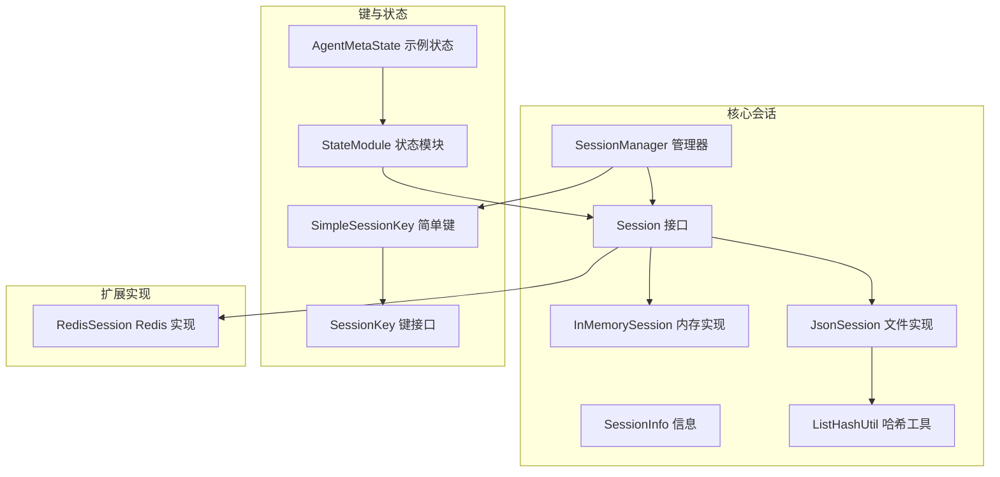
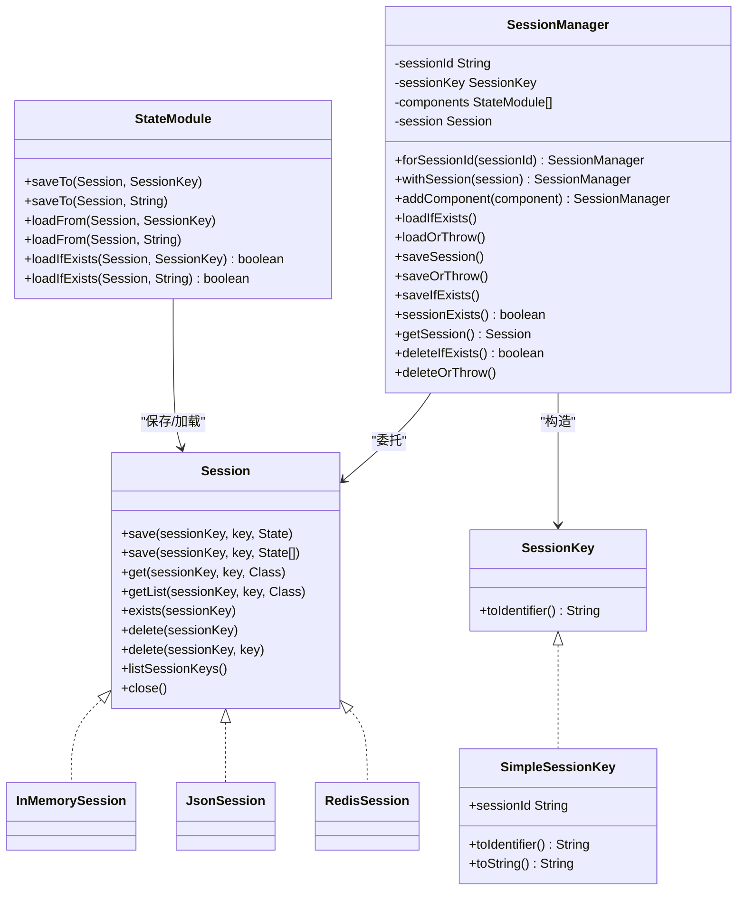
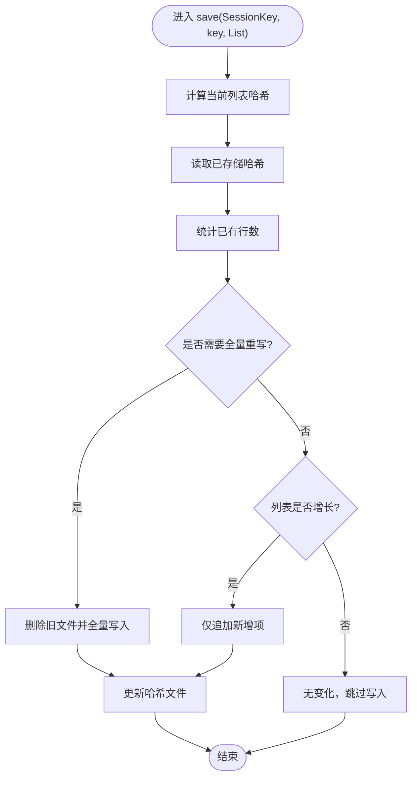
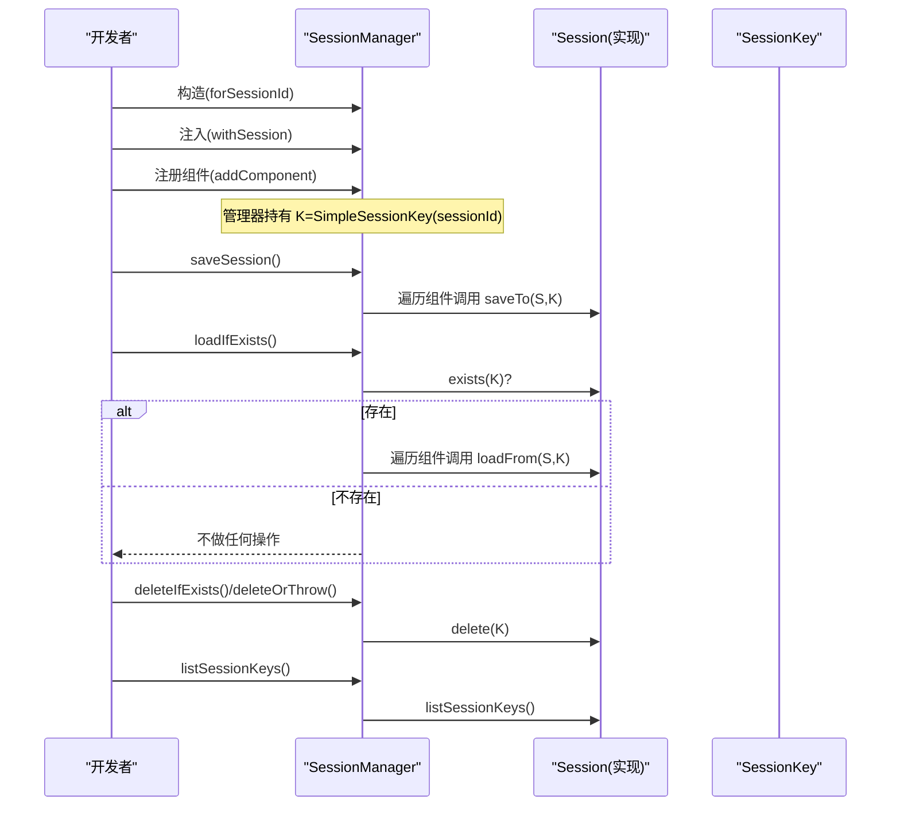
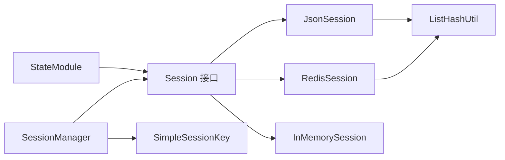

# 会话概念与设计

<cite>
**本文引用的文件**
- [Session.java](file://agentscope-core/src/main/java/io/agentscope/core/session/Session.java)
- [SessionManager.java](file://agentscope-core/src/main/java/io/agentscope/core/session/SessionManager.java)
- [SessionInfo.java](file://agentscope-core/src/main/java/io/agentscope/core/session/SessionInfo.java)
- [SessionKey.java](file://agentscope-core/src/main/java/io/agentscope/core/state/SessionKey.java)
- [SimpleSessionKey.java](file://agentscope-core/src/main/java/io/agentscope/core/state/SimpleSessionKey.java)
- [StateModule.java](file://agentscope-core/src/main/java/io/agentscope/core/state/StateModule.java)
- [AgentMetaState.java](file://agentscope-core/src/main/java/io/agentscope/core/state/AgentMetaState.java)
- [InMemorySession.java](file://agentscope-core/src/main/java/io/agentscope/core/session/InMemorySession.java)
- [JsonSession.java](file://agentscope-core/src/main/java/io/agentscope/core/session/JsonSession.java)
- [ListHashUtil.java](file://agentscope-core/src/main/java/io/agentscope/core/session/ListHashUtil.java)
- [RedisSession.java](file://agentscope-extensions/agentscope-extensions-session-redis/src/main/java/io/agentscope/core/session/redis/RedisSession.java)
- [SessionManagerTest.java](file://agentscope-core/src/test/java/io/agentscope/core/session/SessionManagerTest.java)
- [JsonSessionNewApiTest.java](file://agentscope-core/src/test/java/io/agentscope/core/session/JsonSessionNewApiTest.java)
</cite>

## 目录
1. [引言](#引言)
2. [项目结构](#项目结构)
3. [核心组件](#核心组件)
4. [架构总览](#架构总览)
5. [详细组件分析](#详细组件分析)
6. [依赖关系分析](#依赖关系分析)
7. [性能考量](#性能考量)
8. [故障排查指南](#故障排查指南)
9. [结论](#结论)
10. [附录](#附录)

## 引言
本文件系统性阐述 AgentScope Java 中“会话（Session）”的概念、设计理念与实现形态，重点覆盖以下主题：
- 会话接口的设计原则：单值保存（全量替换）、列表保存（增量追加 vs 全量替换）的差异与适用场景
- 会话键（SessionKey）的标识机制与 SimpleSessionKey 的实现
- 会话生命周期管理：创建、访问、更新、删除与枚举
- 会话管理器（SessionManager）的简化 API 与最佳实践
- 多种存储后端（内存、JSON 文件、Redis）的实现对比与选型建议
- 键命名规范、数据组织策略与性能优化要点
- 完整接口方法说明与使用示例路径，帮助开发者快速上手

## 项目结构
围绕会话功能的关键目录与文件如下：
- 核心接口与实现：session 包下的 Session、SessionManager、InMemorySession、JsonSession、SessionInfo、ListHashUtil
- 键与状态：state 包下的 SessionKey、SimpleSessionKey、StateModule、AgentMetaState 等
- 扩展实现：RedisSession（位于 agentscope-extensions-session-redis 模块）

图示来源
- [Session.java:53-145](file://agentscope-core/src/main/java/io/agentscope/core/session/Session.java#L53-L145)
- [SessionManager.java:61-260](file://agentscope-core/src/main/java/io/agentscope/core/session/SessionManager.java#L61-L260)
- [InMemorySession.java:58-249](file://agentscope-core/src/main/java/io/agentscope/core/session/InMemorySession.java#L58-L249)
- [JsonSession.java:58-509](file://agentscope-core/src/main/java/io/agentscope/core/session/JsonSession.java#L58-L509)
- [SessionInfo.java:25-93](file://agentscope-core/src/main/java/io/agentscope/core/session/SessionInfo.java#L25-L93)
- [ListHashUtil.java:49-172](file://agentscope-core/src/main/java/io/agentscope/core/session/ListHashUtil.java#L49-L172)
- [SessionKey.java:46-62](file://agentscope-core/src/main/java/io/agentscope/core/state/SessionKey.java#L46-L62)
- [SimpleSessionKey.java:37-70](file://agentscope-core/src/main/java/io/agentscope/core/state/SimpleSessionKey.java#L37-L70)
- [StateModule.java:45-120](file://agentscope-core/src/main/java/io/agentscope/core/state/StateModule.java#L45-L120)
- [AgentMetaState.java:41-42](file://agentscope-core/src/main/java/io/agentscope/core/state/AgentMetaState.java#L41-L42)
- [RedisSession.java:179-483](file://agentscope-extensions/agentscope-extensions-session-redis/src/main/java/io/agentscope/core/session/redis/RedisSession.java#L179-L483)

章节来源
- [Session.java:24-52](file://agentscope-core/src/main/java/io/agentscope/core/session/Session.java#L24-L52)
- [SessionManager.java:24-60](file://agentscope-core/src/main/java/io/agentscope/core/session/SessionManager.java#L24-L60)

## 核心组件
本节聚焦会话系统的关键构件及其职责。

- Session 接口
  - 职责：定义统一的状态持久化抽象，支持单值保存（全量替换）与列表保存（增量追加或全量替换）
  - 关键方法：save(SessionKey, String, State)、save(SessionKey, String, List)、get(...)、getList(...)、exists(...)、delete(...)、listSessionKeys()、close()
  - 设计要点：通过 SessionKey 将“会话标识”与“存储后端”解耦；列表保存策略由具体实现决定（如 JsonSession 使用增量追加+哈希检测，InMemorySession 使用全量替换）

- SessionKey 与 SimpleSessionKey
  - SessionKey：会话键的标记接口，默认提供 toIdentifier() 将键序列化为字符串标识
  - SimpleSessionKey：默认简单实现，封装单一字符串 ID，并覆写 toIdentifier() 返回该字符串，便于可读性与兼容性

- SessionManager
  - 职责：为多组件提供统一的会话加载/保存入口，屏蔽具体 Session 实现细节
  - 关键能力：链式配置 withSession(...)、注册组件 addComponent(...)、条件加载/保存（存在即加载/保存）、删除操作、存在性检查等

- StateModule
  - 职责：声明组件具备保存/加载状态的能力，提供基于 SessionKey 或字符串 ID 的便捷方法

- SessionInfo
  - 职责：封装会话元信息（大小、最后修改时间、组件数量），用于会话管理与监控

章节来源
- [Session.java:53-145](file://agentscope-core/src/main/java/io/agentscope/core/session/Session.java#L53-L145)
- [SessionKey.java:46-62](file://agentscope-core/src/main/java/io/agentscope/core/state/SessionKey.java#L46-L62)
- [SimpleSessionKey.java:37-70](file://agentscope-core/src/main/java/io/agentscope/core/state/SimpleSessionKey.java#L37-L70)
- [SessionManager.java:61-260](file://agentscope-core/src/main/java/io/agentscope/core/session/SessionManager.java#L61-L260)
- [StateModule.java:45-120](file://agentscope-core/src/main/java/io/agentscope/core/state/StateModule.java#L45-L120)
- [SessionInfo.java:25-93](file://agentscope-core/src/main/java/io/agentscope/core/session/SessionInfo.java#L25-L93)

## 架构总览
下图展示会话系统在 AgentScope 中的整体架构与交互关系：

图示来源
- [Session.java:53-145](file://agentscope-core/src/main/java/io/agentscope/core/session/Session.java#L53-L145)
- [SessionKey.java:46-62](file://agentscope-core/src/main/java/io/agentscope/core/state/SessionKey.java#L46-L62)
- [SimpleSessionKey.java:37-70](file://agentscope-core/src/main/java/io/agentscope/core/state/SimpleSessionKey.java#L37-L70)
- [StateModule.java:45-120](file://agentscope-core/src/main/java/io/agentscope/core/state/StateModule.java#L45-L120)
- [SessionManager.java:61-260](file://agentscope-core/src/main/java/io/agentscope/core/session/SessionManager.java#L61-L260)
- [InMemorySession.java:58-249](file://agentscope-core/src/main/java/io/agentscope/core/session/InMemorySession.java#L58-L249)
- [JsonSession.java:58-509](file://agentscope-core/src/main/java/io/agentscope/core/session/JsonSession.java#L58-L509)
- [RedisSession.java:179-483](file://agentscope-extensions/agentscope-extensions-session-redis/src/main/java/io/agentscope/core/session/redis/RedisSession.java#L179-L483)

## 详细组件分析

### Session 接口：状态持久化的抽象与策略差异
- 单值保存（全量替换）
  - 语义：以给定 key 完全覆盖存储的单个 State 对象
  - 典型用途：保存不可变或整体替换的元数据（如 AgentMetaState）
- 列表保存（增量追加 vs 全量替换）
  - 语义：保存一组 State 对象，具体策略由实现决定
  - JsonSession：采用增量追加 + 哈希检测，仅当列表增长时追加新项，否则全量重写（列表被修改或收缩时）
  - InMemorySession：直接全量替换，不进行增量处理
- 查询与存在性
  - get：按类型安全地获取单值
  - getList：按类型安全地获取列表
  - exists：判断会话是否存在
- 删除与枚举
  - delete：删除整个会话
  - delete(sessionKey, key)：默认空实现，部分实现支持按键删除
  - listSessionKeys：枚举所有会话键集合
- 生命周期
  - close：默认空实现，具体实现可释放资源

章节来源
- [Session.java:55-145](file://agentscope-core/src/main/java/io/agentscope/core/session/Session.java#L55-L145)

### SessionKey 与 SimpleSessionKey：标识机制与可扩展性
- SessionKey
  - 默认 toIdentifier() 使用 JSON 序列化，便于复杂键结构（如多租户场景）
  - 可自定义实现以适配不同存储策略（如数据库分片键）
- SimpleSessionKey
  - 默认推荐实现，封装单一字符串 ID
  - 覆写 toIdentifier() 直接返回 ID，提升可读性与兼容性
  - 提供 of(...) 工厂方法与构造校验（非空、非空白）

章节来源
- [SessionKey.java:46-62](file://agentscope-core/src/main/java/io/agentscope/core/state/SessionKey.java#L46-L62)
- [SimpleSessionKey.java:37-70](file://agentscope-core/src/main/java/io/agentscope/core/state/SimpleSessionKey.java#L37-L70)

### SessionManager：简化 API 与生命周期编排
- 构建与配置
  - forSessionId(...)：校验 sessionId 非空并构造管理器
  - withSession(...)：注入具体 Session 实现（内存、文件、Redis 等）
  - addComponent(...)：注册 StateModule 组件
- 加载/保存策略
  - loadIfExists()/loadOrThrow()：存在即加载/不存在抛异常
  - saveSession()/saveOrThrow()/saveIfExists()：保存当前状态，支持错误包装
- 删除与存在性
  - deleteIfExists()/deleteOrThrow()：删除会话，支持存在性校验
  - sessionExists()：查询会话是否存在
- 依赖 Session 接口，屏蔽具体实现细节，便于切换存储后端

章节来源
- [SessionManager.java:61-260](file://agentscope-core/src/main/java/io/agentscope/core/session/SessionManager.java#L61-L260)

### 存储实现对比：内存、JSON 文件与 Redis
- InMemorySession
  - 特点：线程安全、全量替换列表、适合单进程、易测试
  - 限制：JVM 退出即丢失、不适合分布式
- JsonSession
  - 特点：文件系统存储、单值 JSON、列表 JSONL、哈希文件用于变更检测、增量追加优化
  - 关键算法：ListHashUtil 基于采样的哈希检测，避免大列表全量遍历
- RedisSession
  - 特点：统一键空间设计（字符串、列表、集合、哈希），支持多种客户端（Jedis、Lettuce、Redisson）
  - 关键策略：列表变更检测与增量追加，全量重写兜底，键前缀隔离命名空间

章节来源
- [InMemorySession.java:58-249](file://agentscope-core/src/main/java/io/agentscope/core/session/InMemorySession.java#L58-L249)
- [JsonSession.java:58-509](file://agentscope-core/src/main/java/io/agentscope/core/session/JsonSession.java#L58-L509)
- [ListHashUtil.java:49-172](file://agentscope-core/src/main/java/io/agentscope/core/session/ListHashUtil.java#L49-L172)
- [RedisSession.java:179-483](file://agentscope-extensions/agentscope-extensions-session-redis/src/main/java/io/agentscope/core/session/redis/RedisSession.java#L179-L483)

### 列表保存策略流程（以 JsonSession 为例）

图示来源
- [JsonSession.java:127-162](file://agentscope-core/src/main/java/io/agentscope/core/session/JsonSession.java#L127-L162)
- [ListHashUtil.java:148-171](file://agentscope-core/src/main/java/io/agentscope/core/session/ListHashUtil.java#L148-L171)

### 会话生命周期管理（创建、访问、更新、销毁）

图示来源
- [SessionManager.java:130-252](file://agentscope-core/src/main/java/io/agentscope/core/session/SessionManager.java#L130-L252)
- [Session.java:112-136](file://agentscope-core/src/main/java/io/agentscope/core/session/Session.java#L112-L136)

### 示例与最佳实践
- 键命名规范
  - 使用语义化 key（如 "agent_meta"、"memory_messages"），避免特殊字符，确保跨后端兼容
  - 复杂场景可自定义 SessionKey 实现（如多租户键）
- 数据组织策略
  - 单值：适合不可变或整体替换的元数据
  - 列表：适合消息流、工具调用历史等可增长数据；优先使用增量追加策略
- 性能考虑
  - 大列表使用哈希检测与采样策略，避免全量扫描
  - 内存实现适合单进程与测试；生产环境优先文件或分布式缓存/数据库
- 使用示例路径
  - 会话接口与示例：[Session.java:38-51](file://agentscope-core/src/main/java/io/agentscope/core/session/Session.java#L38-L51)
  - 管理器链式 API 与示例：[SessionManager.java:31-59](file://agentscope-core/src/main/java/io/agentscope/core/session/SessionManager.java#L31-L59)
  - JSON 文件实现与增量策略：[JsonSession.java:111-162](file://agentscope-core/src/main/java/io/agentscope/core/session/JsonSession.java#L111-L162)
  - Redis 实现与键空间设计：[RedisSession.java:50-58](file://agentscope-extensions/agentscope-extensions-session-redis/src/main/java/io/agentscope/core/session/redis/RedisSession.java#L50-L58)

章节来源
- [Session.java:38-51](file://agentscope-core/src/main/java/io/agentscope/core/session/Session.java#L38-L51)
- [SessionManager.java:31-59](file://agentscope-core/src/main/java/io/agentscope/core/session/SessionManager.java#L31-L59)
- [JsonSession.java:111-162](file://agentscope-core/src/main/java/io/agentscope/core/session/JsonSession.java#L111-L162)
- [RedisSession.java:50-58](file://agentscope-extensions/agentscope-extensions-session-redis/src/main/java/io/agentscope/core/session/redis/RedisSession.java#L50-L58)

## 依赖关系分析
- 松耦合设计
  - Session 接口屏蔽具体实现，SessionManager 通过接口编程
  - SessionKey 抽象键标识，SimpleSessionKey 提供默认实现
- 组件交互
  - StateModule 通过 saveTo/loadFrom 与 Session 解耦，实现“组件状态即服务”
- 外部依赖
  - JsonSession 依赖文件系统与 JSON 编解码
  - RedisSession 依赖 Redis 客户端适配层（Jedis/Lettuce/Redisson）

图示来源
- [StateModule.java:45-120](file://agentscope-core/src/main/java/io/agentscope/core/state/StateModule.java#L45-L120)
- [SessionManager.java:61-260](file://agentscope-core/src/main/java/io/agentscope/core/session/SessionManager.java#L61-L260)
- [Session.java:53-145](file://agentscope-core/src/main/java/io/agentscope/core/session/Session.java#L53-L145)
- [InMemorySession.java:58-249](file://agentscope-core/src/main/java/io/agentscope/core/session/InMemorySession.java#L58-L249)
- [JsonSession.java:58-509](file://agentscope-core/src/main/java/io/agentscope/core/session/JsonSession.java#L58-L509)
- [ListHashUtil.java:49-172](file://agentscope-core/src/main/java/io/agentscope/core/session/ListHashUtil.java#L49-L172)
- [RedisSession.java:179-483](file://agentscope-extensions/agentscope-extensions-session-redis/src/main/java/io/agentscope/core/session/redis/RedisSession.java#L179-L483)

## 性能考量
- 列表保存策略
  - JsonSession 与 RedisSession 均采用哈希检测与增量追加，减少 IO 与网络开销
  - 大列表采用采样哈希，降低时间复杂度
- 内存占用
  - InMemorySession 适合小规模、短生命周期场景；生产环境建议文件或分布式存储
- 并发与一致性
  - InMemorySession 使用并发容器与防御性拷贝，保证线程安全
- I/O 与网络
  - 文件系统与 Redis 的原子性与事务特性需结合具体实现评估

[本节为通用指导，无需特定文件引用]

## 故障排查指南
- 常见问题与定位
  - 未配置 Session：调用 load/save/delete 前必须 withSession(...)
  - 会话不存在：使用 loadOrThrow/deleteOrThrow 前先 exists() 校验
  - 键冲突或非法字符：文件系统后端对键名有安全要求，建议使用字母数字与下划线
  - 列表未增量：确认实现是否支持增量（JsonSession/RedisSession），否则将全量重写
- 测试参考
  - SessionManager 行为验证：[SessionManagerTest.java:55-247](file://agentscope-core/src/test/java/io/agentscope/core/session/SessionManagerTest.java#L55-L247)
  - JsonSession 新 API 行为验证：[JsonSessionNewApiTest.java:55-351](file://agentscope-core/src/test/java/io/agentscope/core/session/JsonSessionNewApiTest.java#L55-L351)

章节来源
- [SessionManagerTest.java:196-247](file://agentscope-core/src/test/java/io/agentscope/core/session/SessionManagerTest.java#L196-L247)
- [JsonSessionNewApiTest.java:55-351](file://agentscope-core/src/test/java/io/agentscope/core/session/JsonSessionNewApiTest.java#L55-L351)

## 结论
AgentScope 的会话系统通过 Session 接口实现了“状态持久化”的统一抽象，配合 SessionKey 的灵活标识与 SessionManager 的简化 API，既满足了开发效率，又兼顾了多后端可插拔与性能优化。在实际工程中，应根据场景选择合适的存储后端（内存/文件/Redis），遵循键命名与数据组织规范，并利用增量保存与哈希检测策略提升性能与可靠性。

[本节为总结性内容，无需特定文件引用]

## 附录
- 接口方法速查
  - Session.save(SessionKey, String, State)：单值保存（全量替换）
  - Session.save(SessionKey, String, List)：列表保存（增量追加或全量替换）
  - Session.get(...)：按类型获取单值
  - Session.getList(...)：按类型获取列表
  - Session.exists(SessionKey)：存在性检查
  - Session.delete(SessionKey)：删除会话
  - Session.delete(SessionKey, key)：按键删除（部分实现支持）
  - Session.listSessionKeys()：枚举会话键
  - Session.close()：资源清理
- 示例路径
  - 会话接口与示例：[Session.java:38-51](file://agentscope-core/src/main/java/io/agentscope/core/session/Session.java#L38-L51)
  - 管理器链式 API 与示例：[SessionManager.java:31-59](file://agentscope-core/src/main/java/io/agentscope/core/session/SessionManager.java#L31-L59)
  - JSON 文件实现与增量策略：[JsonSession.java:111-162](file://agentscope-core/src/main/java/io/agentscope/core/session/JsonSession.java#L111-L162)
  - Redis 实现与键空间设计：[RedisSession.java:50-58](file://agentscope-extensions/agentscope-extensions-session-redis/src/main/java/io/agentscope/core/session/redis/RedisSession.java#L50-L58)