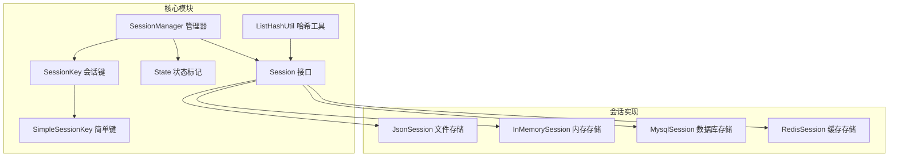
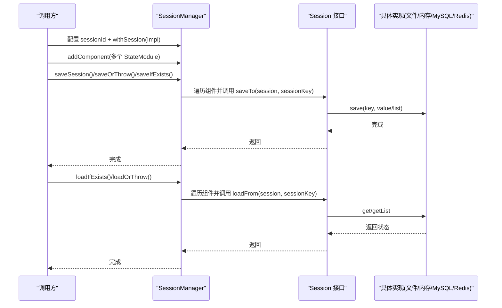
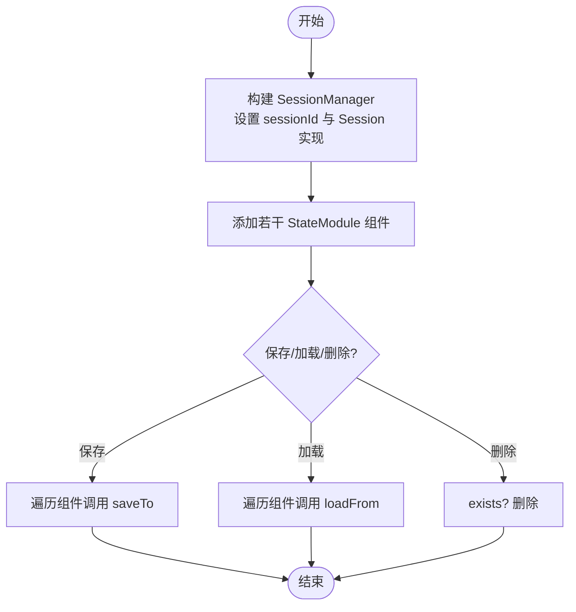
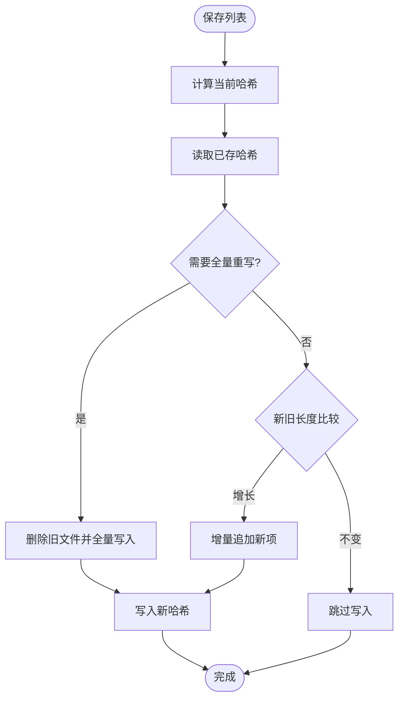
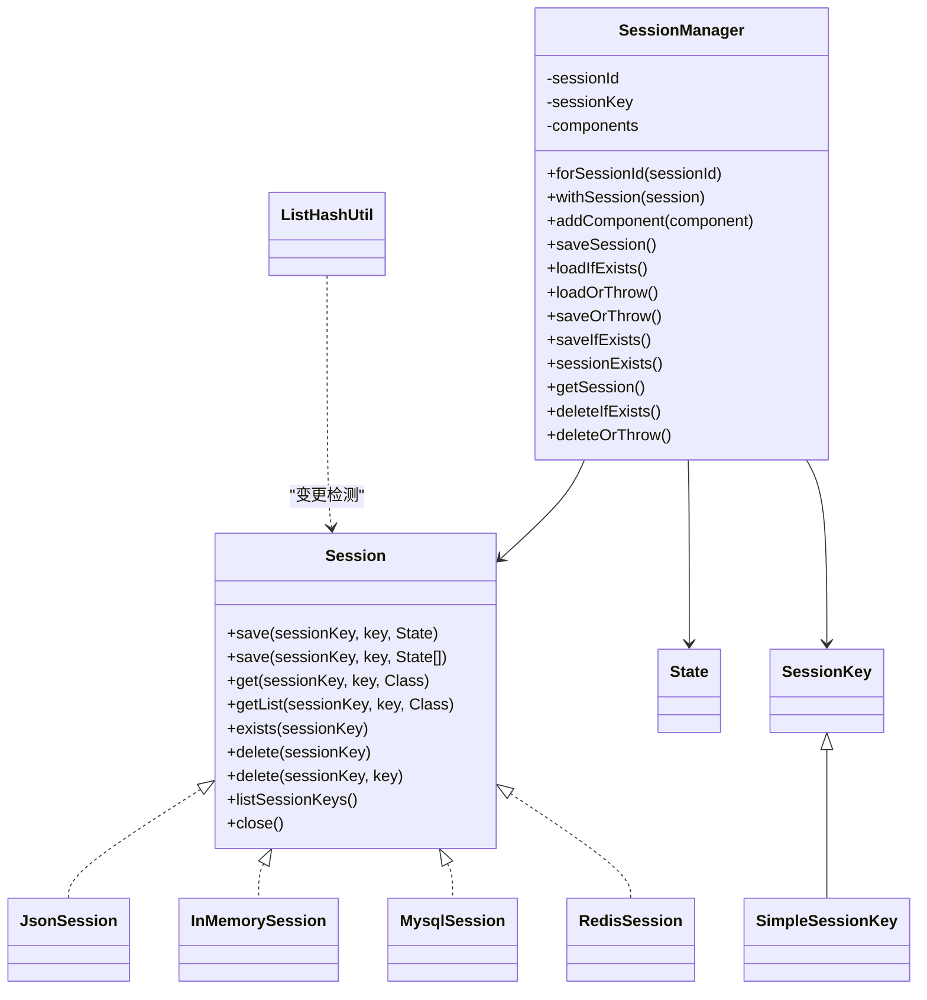

# 会话管理

<cite>
**本文引用的文件**
- [Session.java](file://agentscope-core/src/main/java/io/agentscope/core/session/Session.java)
- [SessionManager.java](file://agentscope-core/src/main/java/io/agentscope/core/session/SessionManager.java)
- [JsonSession.java](file://agentscope-core/src/main/java/io/agentscope/core/session/JsonSession.java)
- [InMemorySession.java](file://agentscope-core/src/main/java/io/agentscope/core/session/InMemorySession.java)
- [MysqlSession.java](file://agentscope-extensions/agentscope-extensions-session-mysql/src/main/java/io/agentscope/core/session/mysql/MysqlSession.java)
- [RedisSession.java](file://agentscope-extensions/agentscope-extensions-session-redis/src/main/java/io/agentscope/core/session/redis/RedisSession.java)
- [ListHashUtil.java](file://agentscope-core/src/main/java/io/agentscope/core/session/ListHashUtil.java)
- [State.java](file://agentscope-core/src/main/java/io/agentscope/core/state/State.java)
- [SessionKey.java](file://agentscope-core/src/main/java/io/agentscope/core/state/SessionKey.java)
- [SimpleSessionKey.java](file://agentscope-core/src/main/java/io/agentscope/core/state/SimpleSessionKey.java)
- [SessionManagerTest.java](file://agentscope-core/src/test/java/io/agentscope/core/session/SessionManagerTest.java)
- [MysqlSessionTest.java](file://agentscope-extensions/agentscope-extensions-session-mysql/src/test/java/io/agentscope/core/session/mysql/MysqlSessionTest.java)
- [JedisSessionTest.java](file://agentscope-extensions/agentscope-extensions-session-redis/src/test/java/io/agentscope/core/session/redis/JedisSessionTest.java)
</cite>

## 目录
1. [简介](#简介)
2. [项目结构](#项目结构)
3. [核心组件](#核心组件)
4. [架构总览](#架构总览)
5. [详细组件分析](#详细组件分析)
6. [依赖关系分析](#依赖关系分析)
7. [性能考量](#性能考量)
8. [故障排查指南](#故障排查指南)
9. [结论](#结论)
10. [附录：API 参考与最佳实践](#附录api-参考与最佳实践)

## 简介
本文件系统性阐述 AgentScope Java 会话管理子系统的设计与实现，覆盖会话概念、生命周期管理、多后端持久化（JSON 文件、内存、MySQL、Redis）以及 SessionManager 的统一管理接口。文档同时提供 API 参考、使用示例与最佳实践，并讨论分布式场景下的同步与一致性策略。

## 项目结构
会话相关代码主要分布在核心模块与扩展模块中：
- 核心接口与管理器：Session、SessionManager、ListHashUtil、State、SessionKey、SimpleSessionKey
- 会话实现：JsonSession（文件）、InMemorySession（内存）、MysqlSession（数据库）、RedisSession（缓存）
- 测试用例：SessionManagerTest、MysqlSessionTest、JedisSessionTest

图表来源
- [Session.java:53-146](file://agentscope-core/src/main/java/io/agentscope/core/session/Session.java#L53-L146)
- [SessionManager.java:61-261](file://agentscope-core/src/main/java/io/agentscope/core/session/SessionManager.java#L61-L261)
- [JsonSession.java:58-510](file://agentscope-core/src/main/java/io/agentscope/core/session/JsonSession.java#L58-L510)
- [InMemorySession.java:58-250](file://agentscope-core/src/main/java/io/agentscope/core/session/InMemorySession.java#L58-L250)
- [MysqlSession.java:70-847](file://agentscope-extensions/agentscope-extensions-session-mysql/src/main/java/io/agentscope/core/session/mysql/MysqlSession.java#L70-L847)
- [RedisSession.java:179-484](file://agentscope-extensions/agentscope-extensions-session-redis/src/main/java/io/agentscope/core/session/redis/RedisSession.java#L179-L484)
- [ListHashUtil.java:49-173](file://agentscope-core/src/main/java/io/agentscope/core/session/ListHashUtil.java#L49-L173)
- [State.java:16-48](file://agentscope-core/src/main/java/io/agentscope/core/state/State.java#L16-L48)
- [SessionKey.java:16-63](file://agentscope-core/src/main/java/io/agentscope/core/state/SessionKey.java#L16-L63)
- [SimpleSessionKey.java:16-71](file://agentscope-core/src/main/java/io/agentscope/core/state/SimpleSessionKey.java#L16-L71)

章节来源
- [Session.java:24-52](file://agentscope-core/src/main/java/io/agentscope/core/session/Session.java#L24-L52)
- [SessionManager.java:24-60](file://agentscope-core/src/main/java/io/agentscope/core/session/SessionManager.java#L24-L60)

## 核心组件
- Session 接口：定义统一的状态保存/加载/存在性检查/删除等能力，支持单值与列表两种存储形态，并提供键级删除与会话枚举能力。
- SessionManager：面向使用者的“胶水层”，通过链式 API 将多个 StateModule 组件与具体 Session 实现绑定，提供保存/加载/删除等便捷方法。
- ListHashUtil：对列表状态进行采样哈希计算，用于增量写入与全量重写决策，兼顾性能与一致性。
- State/SessionKey/SimpleSessionKey：状态对象标记、会话键抽象与默认实现，确保序列化与可读性。

章节来源
- [Session.java:53-146](file://agentscope-core/src/main/java/io/agentscope/core/session/Session.java#L53-L146)
- [SessionManager.java:61-261](file://agentscope-core/src/main/java/io/agentscope/core/session/SessionManager.java#L61-L261)
- [ListHashUtil.java:49-173](file://agentscope-core/src/main/java/io/agentscope/core/session/ListHashUtil.java#L49-L173)
- [State.java:18-48](file://agentscope-core/src/main/java/io/agentscope/core/state/State.java#L18-L48)
- [SessionKey.java:20-63](file://agentscope-core/src/main/java/io/agentscope/core/state/SessionKey.java#L20-L63)
- [SimpleSessionKey.java:20-71](file://agentscope-core/src/main/java/io/agentscope/core/state/SimpleSessionKey.java#L20-L71)

## 架构总览
下图展示 SessionManager 如何协调多个 StateModule 与不同 Session 后端，以及各后端的存储策略差异。

图表来源
- [SessionManager.java:122-202](file://agentscope-core/src/main/java/io/agentscope/core/session/SessionManager.java#L122-L202)
- [Session.java:55-104](file://agentscope-core/src/main/java/io/agentscope/core/session/Session.java#L55-L104)

## 详细组件分析

### Session 接口与生命周期
- 能力范围：单值保存/加载、列表保存（支持增量追加或全量替换）、存在性检查、会话删除、键级删除、列出所有会话键、资源清理。
- 生命周期：由 SessionManager 在保存/加载时触发；删除与存在性检查由上层业务控制。
- 错误处理：实现类在 IO/序列化失败时抛出运行时异常；SessionManager 的 saveOrThrow 将底层异常包装为运行时异常。

章节来源
- [Session.java:53-146](file://agentscope-core/src/main/java/io/agentscope/core/session/Session.java#L53-L146)

### SessionManager：统一入口与工作流
- Fluent API：forSessionId + withSession + addComponent + saveSession/loadIfExists/saveOrThrow/deleteIfExists 等。
- 组件契约：组件需实现 StateModule，提供 saveTo/loadFrom 以与 Session 交互。
- 异常语义：未配置 Session 时访问会抛出非法状态异常；loadOrThrow/ deleteOrThrow 对不存在场景抛出参数异常。

图表来源
- [SessionManager.java:122-202](file://agentscope-core/src/main/java/io/agentscope/core/session/SessionManager.java#L122-L202)

章节来源
- [SessionManager.java:61-261](file://agentscope-core/src/main/java/io/agentscope/core/session/SessionManager.java#L61-L261)
- [SessionManagerTest.java:55-127](file://agentscope-core/src/test/java/io/agentscope/core/session/SessionManagerTest.java#L55-L127)

### JsonSession：文件系统持久化
- 存储模型：每个会话一个目录，单值为 .json，列表为 .jsonl（每行一条 JSON），并配合 .hash 记录列表哈希。
- 增量策略：基于 ListHashUtil 的哈希比较决定全量重写还是增量追加；空文件或无哈希时按需重写。
- 文件安全：会话 ID 不安全字符将被 Base64 URL 安全编码；目录递归删除保证彻底清理。
- 并发与线程安全：读写采用 UTF-8 字符集与原子写策略，避免并发读到不完整文件。

图表来源
- [JsonSession.java:127-162](file://agentscope-core/src/main/java/io/agentscope/core/session/JsonSession.java#L127-L162)
- [ListHashUtil.java:148-171](file://agentscope-core/src/main/java/io/agentscope/core/session/ListHashUtil.java#L148-L171)

章节来源
- [JsonSession.java:58-510](file://agentscope-core/src/main/java/io/agentscope/core/session/JsonSession.java#L58-L510)
- [ListHashUtil.java:49-173](file://agentscope-core/src/main/java/io/agentscope/core/session/ListHashUtil.java#L49-L173)

### InMemorySession：内存持久化
- 存储模型：ConcurrentHashMap 结构，键为会话 ID 字符串，值为会话数据容器（单值/列表）。
- 列表策略：直接全量替换，调用方应传入完整列表；内部对列表做不可变拷贝以防止外部修改。
- 适用场景：单进程、无需跨进程/重启持久化的场景；不适合分布式部署。

章节来源
- [InMemorySession.java:58-250](file://agentscope-core/src/main/java/io/agentscope/core/session/InMemorySession.java#L58-L250)

### MysqlSession：数据库持久化
- 存储模型：单值使用 item_index=0 的行存储 JSON；列表按 item_index 顺序存储，使用 MAX(item_index)+1 进行增量追加。
- 增量策略：与 JsonSession 类似，基于哈希判断是否需要全量重写。
- 安全性：构造函数支持自动建库建表或校验存在；对数据库/表名进行严格正则校验与标识符转义，防止注入。
- 事务：写操作在显式事务中执行，自动恢复连接原始 autoCommit 状态。
- 清理：提供 truncateAllSessions（DDL，隐式提交）与 clearAllSessions（DELETE）两种清理方式。

章节来源
- [MysqlSession.java:70-847](file://agentscope-extensions/agentscope-extensions-session-mysql/src/main/java/io/agentscope/core/session/mysql/MysqlSession.java#L70-L847)
- [MysqlSessionTest.java:52-672](file://agentscope-extensions/agentscope-extensions-session-mysql/src/test/java/io/agentscope/core/session/mysql/MysqlSessionTest.java#L52-L672)

### RedisSession：缓存持久化
- 存储模型：单值为字符串键，列表为 Redis List，列表哈希为独立键，会话键集合使用 Set 记录。
- 增量策略：同上，基于哈希判断全量重写或增量追加。
- 客户端适配：支持 Jedis、Lettuce、Redisson 多客户端，Builder 提供多种构建方式。
- 清理：支持异步清理全部会话键。

章节来源
- [RedisSession.java:179-484](file://agentscope-extensions/agentscope-extensions-session-redis/src/main/java/io/agentscope/core/session/redis/RedisSession.java#L179-L484)
- [JedisSessionTest.java:50-284](file://agentscope-extensions/agentscope-extensions-session-redis/src/test/java/io/agentscope/core/session/redis/JedisSessionTest.java#L50-L284)

### ListHashUtil：列表变更检测
- 采样策略：小列表全采样，大列表按 0、1/4、1/2、3/4、末位采样，降低大列表哈希成本。
- 全量重写判定：列表收缩、缺失哈希且已有数据、前缀被修改等情况触发全量重写。
- 一致性保障：通过哈希对比避免“仅追加”场景下的重复写入。

章节来源
- [ListHashUtil.java:49-173](file://agentscope-core/src/main/java/io/agentscope/core/session/ListHashUtil.java#L49-L173)

### 键与状态模型
- State：状态对象标记接口，推荐使用记录类；兼容既有领域对象。
- SessionKey/SimpleSessionKey：会话键抽象，默认简单字符串；支持自定义复杂键（如多租户组合键）。

章节来源
- [State.java:18-48](file://agentscope-core/src/main/java/io/agentscope/core/state/State.java#L18-L48)
- [SessionKey.java:20-63](file://agentscope-core/src/main/java/io/agentscope/core/state/SessionKey.java#L20-L63)
- [SimpleSessionKey.java:20-71](file://agentscope-core/src/main/java/io/agentscope/core/state/SimpleSessionKey.java#L20-L71)

## 依赖关系分析
- 松耦合：SessionManager 仅依赖 Session 接口与 StateModule 协议，具体实现可自由替换。
- 依赖注入：通过 withSession 注入任意 Session 实现，便于测试与扩展。
- 工具复用：ListHashUtil 被 JsonSession、MysqlSession、RedisSession 共同使用，统一变更检测逻辑。

图表来源
- [Session.java:53-146](file://agentscope-core/src/main/java/io/agentscope/core/session/Session.java#L53-L146)
- [SessionManager.java:61-261](file://agentscope-core/src/main/java/io/agentscope/core/session/SessionManager.java#L61-L261)
- [JsonSession.java:58-510](file://agentscope-core/src/main/java/io/agentscope/core/session/JsonSession.java#L58-L510)
- [InMemorySession.java:58-250](file://agentscope-core/src/main/java/io/agentscope/core/session/InMemorySession.java#L58-L250)
- [MysqlSession.java:70-847](file://agentscope-extensions/agentscope-extensions-session-mysql/src/main/java/io/agentscope/core/session/mysql/MysqlSession.java#L70-L847)
- [RedisSession.java:179-484](file://agentscope-extensions/agentscope-extensions-session-redis/src/main/java/io/agentscope/core/session/redis/RedisSession.java#L179-L484)
- [ListHashUtil.java:49-173](file://agentscope-core/src/main/java/io/agentscope/core/session/ListHashUtil.java#L49-L173)
- [State.java:18-48](file://agentscope-core/src/main/java/io/agentscope/core/state/State.java#L18-L48)
- [SessionKey.java:20-63](file://agentscope-core/src/main/java/io/agentscope/core/state/SessionKey.java#L20-L63)
- [SimpleSessionKey.java:20-71](file://agentscope-core/src/main/java/io/agentscope/core/state/SimpleSessionKey.java#L20-L71)

## 性能考量
- 列表增量写入：JsonSession/MysqlSession/RedisSession 均通过哈希检测实现增量追加，避免全量重写带来的 IO 放大。
- 序列化开销：统一使用 JsonUtils 进行序列化/反序列化，建议状态对象尽量轻量、字段稳定，减少 JSON 大小。
- 并发与锁：InMemorySession 使用并发容器与不可变拷贝；JsonSession 采用原子写；MysqlSession/RedisSession 通过事务/原子命令保证一致性。
- 存储选择建议：
  - 开发/本地：JsonSession（易调试、易备份）
  - 单进程/临时：InMemorySession（极致性能，无持久化）
  - 生产高可用：MysqlSession（强一致、可审计、可备份）
  - 分布式/高并发：RedisSession（低延迟、原子操作、可集群）

[本节为通用指导，不直接分析具体文件]

## 故障排查指南
- 未配置 Session：调用 SessionManager 的保存/加载/删除方法会抛出非法状态异常。请先调用 withSession 注入实现。
- 加载/删除不存在会话：loadOrThrow/deleteOrThrow 在不存在时抛出参数异常；可改用 loadIfExists/saveIfExists/deleteIfExists。
- 数据库/表不存在：MysqlSession 默认要求存在，否则抛出非法状态异常；可启用自动创建或手动初始化。
- SQL 注入防护：MysqlSession 对数据库/表名进行严格校验与标识符转义；请勿传入非法字符或超长名称。
- Redis 客户端关闭：RedisSession.close 会关闭其客户端适配器；DataSource 由外部管理，不应在 Session 中关闭。

章节来源
- [SessionManagerTest.java:196-247](file://agentscope-core/src/test/java/io/agentscope/core/session/SessionManagerTest.java#L196-L247)
- [MysqlSessionTest.java:508-672](file://agentscope-extensions/agentscope-extensions-session-mysql/src/test/java/io/agentscope/core/session/mysql/MysqlSessionTest.java#L508-L672)
- [JedisSessionTest.java:50-284](file://agentscope-extensions/agentscope-extensions-session-redis/src/test/java/io/agentscope/core/session/redis/JedisSessionTest.java#L50-L284)

## 结论
AgentScope 的会话管理以 Session 接口为核心，通过 SessionManager 提供统一的组件化工作流；多后端实现满足从开发到生产的多样化需求。借助 ListHashUtil 的变更检测，系统在性能与一致性之间取得平衡。生产环境建议优先考虑 MySQL 或 Redis，结合合理的键设计与清理策略，确保可运维性与稳定性。

[本节为总结性内容，不直接分析具体文件]

## 附录：API 参考与最佳实践

### API 参考（Session 接口）
- 保存单值：save(sessionKey, key, State)
- 保存列表：save(sessionKey, key, List<State>)
- 获取单值：get(sessionKey, key, Class<T>)
- 获取列表：getList(sessionKey, key, Class<T>)
- 存在性检查：exists(sessionKey)
- 删除会话：delete(sessionKey)
- 删除键：delete(sessionKey, key)
- 列出会话键：listSessionKeys()
- 资源清理：close()

章节来源
- [Session.java:53-146](file://agentscope-core/src/main/java/io/agentscope/core/session/Session.java#L53-L146)

### API 参考（SessionManager）
- 创建管理器：forSessionId(sessionId)
- 设置实现：withSession(session)
- 添加组件：addComponent(component)
- 保存：saveSession()/saveOrThrow()/saveIfExists()
- 加载：loadIfExists()/loadOrThrow()
- 删除：deleteIfExists()/deleteOrThrow()
- 查询：sessionExists()/getSession()

章节来源
- [SessionManager.java:61-261](file://agentscope-core/src/main/java/io/agentscope/core/session/SessionManager.java#L61-L261)

### 使用示例（路径引用）
- 使用 JsonSession 保存/加载：[SessionManagerTest.java:84-127](file://agentscope-core/src/test/java/io/agentscope/core/session/SessionManagerTest.java#L84-L127)
- 使用 MysqlSession 自动建表与 CRUD：[MysqlSessionTest.java:210-283](file://agentscope-extensions/agentscope-extensions-session-mysql/src/test/java/io/agentscope/core/session/mysql/MysqlSessionTest.java#L210-L283)
- 使用 RedisSession（Jedis）保存/加载/删除/枚举：[JedisSessionTest.java:79-245](file://agentscope-extensions/agentscope-extensions-session-redis/src/test/java/io/agentscope/core/session/redis/JedisSessionTest.java#L79-L245)

### 最佳实践
- 存储策略选择
  - 开发/测试：JsonSession，便于本地调试与备份
  - 单机应用：InMemorySession（短期会话）或 JsonSession（需要重启保留）
  - 生产系统：MySQL（强一致、审计、备份完善）或 Redis（高并发、低延迟）
- 键设计
  - 使用 SimpleSessionKey 简化场景；多租户/多维度场景可自定义 SessionKey
  - 避免在会话 ID 中包含路径分隔符或非法字符
- 列表写入
  - 始终传递完整列表；实现内部根据哈希决定增量或全量
  - 控制列表大小，避免单次写入过大导致阻塞
- 事务与一致性
  - MySQL/Redis 写入已在实现内使用事务/原子命令；避免在业务层重复包裹
- 清理与迁移
  - 使用 truncateAllSessions（MySQL）快速清库；Redis 使用 clearAllSessions
  - 版本升级或哈希缺失时，系统会触发全量重写，注意容量与性能影响

[本节为通用指导，不直接分析具体文件]