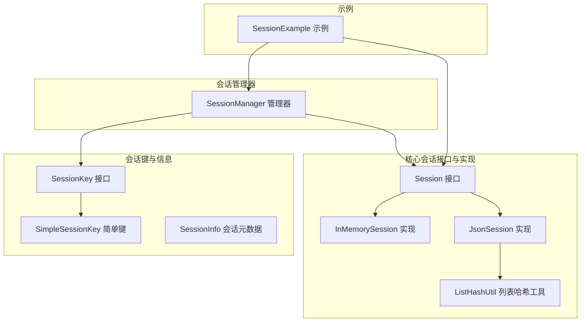
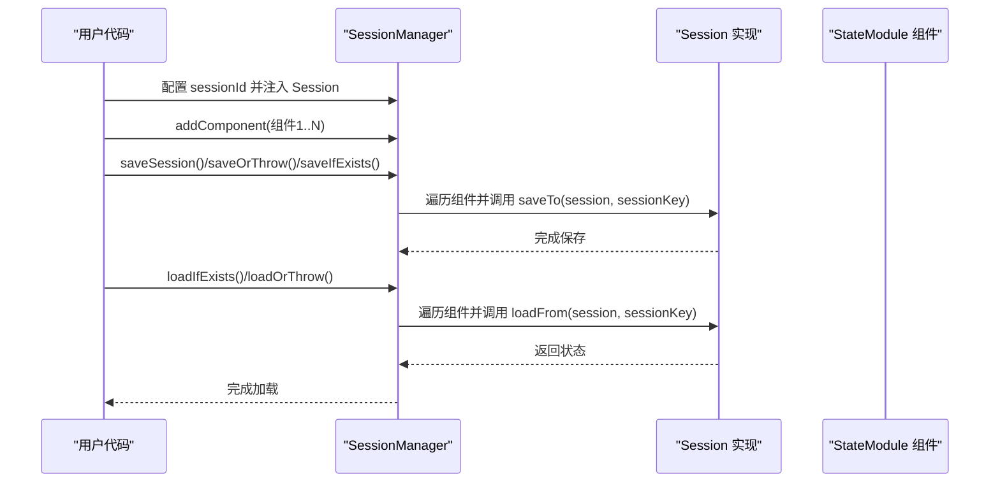
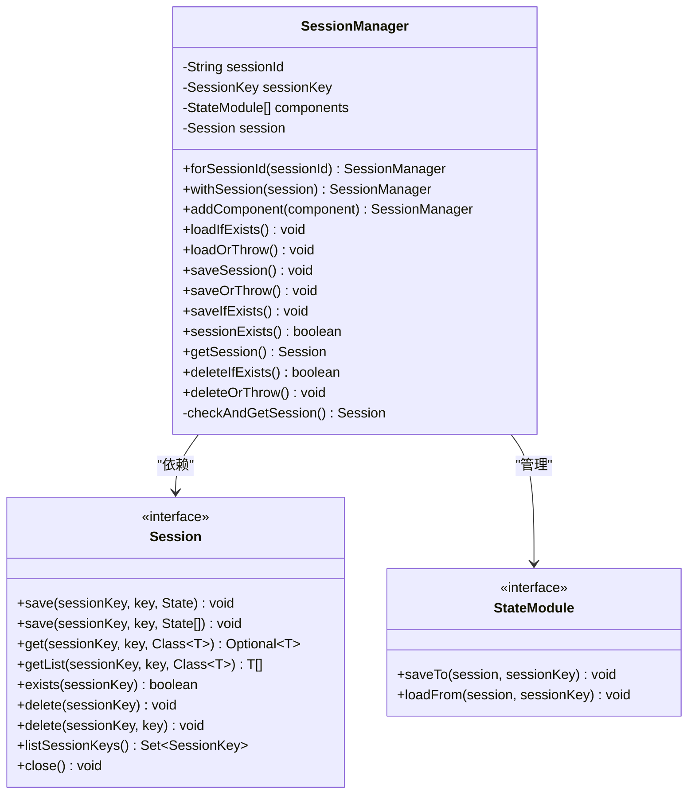
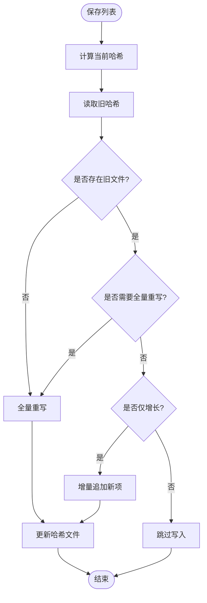
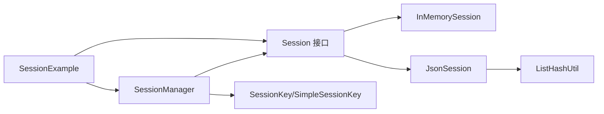

# 会话管理器

<cite>
**本文引用的文件**
- [SessionManager.java](file://agentscope-core/src/main/java/io/agentscope/core/session/SessionManager.java)
- [Session.java](file://agentscope-core/src/main/java/io/agentscope/core/session/Session.java)
- [SessionInfo.java](file://agentscope-core/src/main/java/io/agentscope/core/session/SessionInfo.java)
- [SessionKey.java](file://agentscope-core/src/main/java/io/agentscope/core/state/SessionKey.java)
- [SimpleSessionKey.java](file://agentscope-core/src/main/java/io/agentscope/core/state/SimpleSessionKey.java)
- [InMemorySession.java](file://agentscope-core/src/main/java/io/agentscope/core/session/InMemorySession.java)
- [JsonSession.java](file://agentscope-core/src/main/java/io/agentscope/core/session/JsonSession.java)
- [ListHashUtil.java](file://agentscope-core/src/main/java/io/agentscope/core/session/ListHashUtil.java)
- [SessionManagerTest.java](file://agentscope-core/src/test/java/io/agentscope/core/session/SessionManagerTest.java)
- [SessionExample.java](file://agentscope-examples/quickstart/src/main/java/io/agentscope/examples/quickstart/SessionExample.java)
</cite>

## 目录
1. [简介](#简介)
2. [项目结构](#项目结构)
3. [核心组件](#核心组件)
4. [架构总览](#架构总览)
5. [详细组件分析](#详细组件分析)
6. [依赖分析](#依赖分析)
7. [性能考虑](#性能考虑)
8. [故障排除指南](#故障排除指南)
9. [结论](#结论)
10. [附录：API 参考](#附录api-参考)

## 简介
本文件面向 AgentScope Java 的会话管理能力，系统化梳理 SessionManager 的设计与实现，覆盖会话的创建、查找、注册与生命周期管理；解释会话键生成规则、冲突处理与唯一性保障；阐述并发访问控制、线程安全机制与性能优化策略；提供基础与批量操作示例及最佳实践，并给出完整的 API 参考与故障排除建议。

## 项目结构
围绕会话管理的关键代码位于 agentscope-core 模块的 session 与 state 包中，配合 JsonSession、InMemorySession 等具体实现，以及 ListHashUtil 提供列表变更检测支持。示例工程 quickstart 展示了典型用法。

**图表来源**
- [SessionManager.java:61-261](file://agentscope-core/src/main/java/io/agentscope/core/session/SessionManager.java#L61-L261)
- [Session.java:53-146](file://agentscope-core/src/main/java/io/agentscope/core/session/Session.java#L53-L146)
- [InMemorySession.java:58-250](file://agentscope-core/src/main/java/io/agentscope/core/session/InMemorySession.java#L58-L250)
- [JsonSession.java:58-510](file://agentscope-core/src/main/java/io/agentscope/core/session/JsonSession.java#L58-L510)
- [ListHashUtil.java:49-173](file://agentscope-core/src/main/java/io/agentscope/core/session/ListHashUtil.java#L49-L173)
- [SessionKey.java:46-63](file://agentscope-core/src/main/java/io/agentscope/core/state/SessionKey.java#L46-L63)
- [SimpleSessionKey.java:37-71](file://agentscope-core/src/main/java/io/agentscope/core/state/SimpleSessionKey.java#L37-L71)
- [SessionInfo.java:25-94](file://agentscope-core/src/main/java/io/agentscope/core/session/SessionInfo.java#L25-L94)
- [SessionExample.java:40-206](file://agentscope-examples/quickstart/src/main/java/io/agentscope/examples/quickstart/SessionExample.java#L40-L206)

**章节来源**
- [SessionManager.java:1-261](file://agentscope-core/src/main/java/io/agentscope/core/session/SessionManager.java#L1-L261)
- [Session.java:1-146](file://agentscope-core/src/main/java/io/agentscope/core/session/Session.java#L1-L146)
- [SessionKey.java:1-63](file://agentscope-core/src/main/java/io/agentscope/core/state/SessionKey.java#L1-L63)
- [SimpleSessionKey.java:1-71](file://agentscope-core/src/main/java/io/agentscope/core/state/SimpleSessionKey.java#L1-L71)
- [InMemorySession.java:1-250](file://agentscope-core/src/main/java/io/agentscope/core/session/InMemorySession.java#L1-L250)
- [JsonSession.java:1-510](file://agentscope-core/src/main/java/io/agentscope/core/session/JsonSession.java#L1-L510)
- [ListHashUtil.java:1-173](file://agentscope-core/src/main/java/io/agentscope/core/session/ListHashUtil.java#L1-L173)
- [SessionInfo.java:1-94](file://agentscope-core/src/main/java/io/agentscope/core/session/SessionInfo.java#L1-L94)
- [SessionExample.java:1-206](file://agentscope-examples/quickstart/src/main/java/io/agentscope/examples/quickstart/SessionExample.java#L1-L206)

## 核心组件
- Session 接口：定义统一的会话存储契约（保存/加载单值、保存/加载列表、存在性检查、删除、列出键等），并提供默认关闭钩子。
- SessionManager：面向用户的“简化 API”工具类，负责以链式调用的方式注册组件、设置 Session 实现，并执行保存/加载/删除等操作。
- SessionKey/SimpleSessionKey：会话键抽象与默认实现，支持自定义复杂键结构（如多租户场景）。
- InMemorySession：内存型会话实现，适合单进程、无需持久化的场景，具备线程安全与不可变拷贝。
- JsonSession：基于文件系统的 JSON/JSONL 存储实现，支持增量追加与全量重写，内置变更检测与原子性保障。
- ListHashUtil：列表内容哈希计算与变更判断工具，用于 JsonSession 的高效变更检测。
- SessionInfo：会话元数据对象，封装大小、修改时间、组件数量等信息。

**章节来源**
- [Session.java:53-146](file://agentscope-core/src/main/java/io/agentscope/core/session/Session.java#L53-L146)
- [SessionManager.java:61-261](file://agentscope-core/src/main/java/io/agentscope/core/session/SessionManager.java#L61-L261)
- [SessionKey.java:46-63](file://agentscope-core/src/main/java/io/agentscope/core/state/SessionKey.java#L46-L63)
- [SimpleSessionKey.java:37-71](file://agentscope-core/src/main/java/io/agentscope/core/state/SimpleSessionKey.java#L37-L71)
- [InMemorySession.java:58-250](file://agentscope-core/src/main/java/io/agentscope/core/session/InMemorySession.java#L58-L250)
- [JsonSession.java:58-510](file://agentscope-core/src/main/java/io/agentscope/core/session/JsonSession.java#L58-L510)
- [ListHashUtil.java:49-173](file://agentscope-core/src/main/java/io/agentscope/core/session/ListHashUtil.java#L49-L173)
- [SessionInfo.java:25-94](file://agentscope-core/src/main/java/io/agentscope/core/session/SessionInfo.java#L25-L94)

## 架构总览
SessionManager 通过 withSession 注入具体 Session 实现，再通过 addComponent 注册多个 StateModule 组件。保存时由各组件调用 saveTo 写入 Session，加载时由各组件调用 loadFrom 从 Session 读取。Session 接口屏蔽了底层存储差异（内存或文件），SessionKey 抽象确保键的可扩展性。

**图表来源**
- [SessionManager.java:130-202](file://agentscope-core/src/main/java/io/agentscope/core/session/SessionManager.java#L130-L202)
- [Session.java:53-146](file://agentscope-core/src/main/java/io/agentscope/core/session/Session.java#L53-L146)

## 详细组件分析

### SessionManager 分析
- 职责与模式
  - 工具类 + 流式 API：通过静态工厂 forSessionId 创建实例，链式调用 withSession/addComponent/save/load/delete 等方法。
  - 解耦存储与业务：业务侧仅需实现 StateModule 的 saveTo/loadFrom 即可接入任意 Session 实现。
- 关键行为
  - 保存：saveSession 全量保存；saveOrThrow 带异常包装；saveIfExists 仅在已存在时保存。
  - 加载：loadIfExists 仅在存在时加载；loadOrThrow 在不存在时报错。
  - 删除：deleteIfExists 条件删除；deleteOrThrow 强制删除并校验存在性。
  - 查询：sessionExists 检查存在性；getSession 获取底层 Session。
- 错误处理
  - 未配置 Session 时调用保存/加载/删除/查询均抛出非法状态异常。
  - saveOrThrow 将底层异常包装为运行时异常，便于上层统一处理。
- 线程安全
  - SessionManager 自身不持有共享可变状态，但其内部组件集合在多线程下应避免并发修改；实际并发安全取决于注入的 Session 实现（例如 InMemorySession 使用并发容器）。

**图表来源**
- [SessionManager.java:61-261](file://agentscope-core/src/main/java/io/agentscope/core/session/SessionManager.java#L61-L261)
- [Session.java:53-146](file://agentscope-core/src/main/java/io/agentscope/core/session/Session.java#L53-L146)

**章节来源**
- [SessionManager.java:61-261](file://agentscope-core/src/main/java/io/agentscope/core/session/SessionManager.java#L61-L261)
- [SessionManagerTest.java:55-247](file://agentscope-core/src/test/java/io/agentscope/core/session/SessionManagerTest.java#L55-L247)

### Session 接口与实现
- Session 接口
  - 统一的键值/列表存取、存在性检查、删除、列出键、关闭钩子。
  - 支持 per-key 删除与 listSessionKeys，默认实现为空操作或空集。
- InMemorySession
  - 使用并发映射存储，get/save 返回不可变副本，保证外部修改不影响内部状态。
  - 支持 per-key 删除与列出所有会话键。
  - 适合单进程、快速原型与测试场景。
- JsonSession
  - 以目录为单位存储会话，单值用 .json，列表用 .jsonl，配合 .hash 文件进行变更检测。
  - 增量追加：当列表仅增长且未变化时，仅追加新项。
  - 全量重写：当列表被修改、收缩或缺失哈希时，重写整个文件。
  - 文件名安全：对包含特殊字符的标识符进行 URL 安全 Base64 编码。
  - 清理：提供异步清理全部会话的能力（受边界弹性调度器限制）。

**图表来源**
- [JsonSession.java:127-162](file://agentscope-core/src/main/java/io/agentscope/core/session/JsonSession.java#L127-L162)
- [ListHashUtil.java:148-171](file://agentscope-core/src/main/java/io/agentscope/core/session/ListHashUtil.java#L148-L171)

**章节来源**
- [Session.java:53-146](file://agentscope-core/src/main/java/io/agentscope/core/session/Session.java#L53-L146)
- [InMemorySession.java:58-250](file://agentscope-core/src/main/java/io/agentscope/core/session/InMemorySession.java#L58-L250)
- [JsonSession.java:58-510](file://agentscope-core/src/main/java/io/agentscope/core/session/JsonSession.java#L58-L510)
- [ListHashUtil.java:49-173](file://agentscope-core/src/main/java/io/agentscope/core/session/ListHashUtil.java#L49-L173)

### 会话键与唯一性
- SessionKey 抽象
  - 默认 JSON 序列化为字符串标识；SimpleSessionKey 重写 toIdentifier 返回原始 sessionId，提升可读性。
  - 支持自定义复合键（如多租户场景），由具体 Session 实现解释键结构以决定存储策略。
- 唯一性与冲突
  - 会话唯一性由 SessionKey 唯一决定；SimpleSessionKey 的唯一性取决于传入的 sessionId。
  - 对于文件系统存储，若 sessionId 含有非安全字符，JsonSession 会进行 Base64 编码以避免路径冲突。

**章节来源**
- [SessionKey.java:46-63](file://agentscope-core/src/main/java/io/agentscope/core/state/SessionKey.java#L46-L63)
- [SimpleSessionKey.java:37-71](file://agentscope-core/src/main/java/io/agentscope/core/state/SimpleSessionKey.java#L37-L71)
- [JsonSession.java:342-353](file://agentscope-core/src/main/java/io/agentscope/core/session/JsonSession.java#L342-L353)

### 生命周期管理
- 创建：通过 SessionManager.forSessionId 创建管理器；通过 withSession 注入具体 Session 实现。
- 注册：addComponent 注册多个 StateModule 组件。
- 保存：saveSession/saveOrThrow/saveIfExists 触发各组件 saveTo。
- 加载：loadIfExists/loadOrThrow 触发各组件 loadFrom。
- 删除：deleteIfExists/deleteOrThrow 删除会话或条件删除。
- 关闭：Session.close 提供资源清理钩子（如 InMemorySession 无额外资源，JsonSession 无显式资源需关闭）。

**章节来源**
- [SessionManager.java:80-259](file://agentscope-core/src/main/java/io/agentscope/core/session/SessionManager.java#L80-L259)
- [Session.java:138-145](file://agentscope-core/src/main/java/io/agentscope/core/session/Session.java#L138-L145)

### 并发访问控制与线程安全
- SessionManager
  - 不持有共享可变状态，但其内部组件列表在多线程下不应并发修改；实际并发安全取决于注入的 Session 实现。
- InMemorySession
  - 使用并发映射与不可变拷贝，get 返回值为只读副本，适合高并发读取场景。
- JsonSession
  - 文件级原子写入与哈希文件配合，避免部分写入导致的数据不一致；对目录遍历与删除采用有序处理，降低竞态风险。
- 建议
  - 多线程环境下，建议使用 InMemorySession 或在应用层串行化关键会话操作，或为 JsonSession 的目录提供进程级互斥。

**章节来源**
- [InMemorySession.java:25-44](file://agentscope-core/src/main/java/io/agentscope/core/session/InMemorySession.java#L25-L44)
- [JsonSession.java:127-162](file://agentscope-core/src/main/java/io/agentscope/core/session/JsonSession.java#L127-L162)

### 性能优化策略
- 列表增量写入：JsonSession 通过哈希检测仅在必要时全量重写，减少磁盘 IO。
- 采样哈希：ListHashUtil 对大列表采用采样策略，降低哈希计算开销。
- 不可变副本：InMemorySession 在保存时复制列表，避免外部修改影响内部状态。
- 异步清理：JsonSession 提供基于边界弹性调度器的清理任务，避免阻塞主线程。

**章节来源**
- [ListHashUtil.java:77-96](file://agentscope-core/src/main/java/io/agentscope/core/session/ListHashUtil.java#L77-L96)
- [JsonSession.java:487-508](file://agentscope-core/src/main/java/io/agentscope/core/session/JsonSession.java#L487-L508)
- [InMemorySession.java:240-243](file://agentscope-core/src/main/java/io/agentscope/core/session/InMemorySession.java#L240-L243)

### 使用示例与最佳实践
- 基本操作
  - 使用 SessionManager.forSessionId 创建管理器，注入 JsonSession 或 InMemorySession，注册组件后保存/加载。
  - 参考示例：SessionExample 展示了交互式对话中按会话 ID 保存与加载。
- 批量处理
  - 通过 addComponent 注册多个组件，一次性保存/加载，避免重复 IO。
- 异常处理
  - 使用 saveOrThrow 统一封装保存失败；使用 loadOrThrow 在不存在时立即报错；使用 saveIfExists/ deleteIfExists 进行条件操作。
- 最佳实践
  - 选择合适实现：开发/测试用 InMemorySession；生产用 JsonSession；分布式场景可扩展数据库实现。
  - 键设计：简单场景用 SimpleSessionKey；多租户/多维度场景自定义 SessionKey。
  - 资源清理：长生命周期应用定期清理旧会话；使用 JsonSession.clearAllSessions 异步清理。
  - 监控告警：结合 SessionInfo 统计会话大小与组件数，建立阈值告警。

**章节来源**
- [SessionExample.java:106-179](file://agentscope-examples/quickstart/src/main/java/io/agentscope/examples/quickstart/SessionExample.java#L106-L179)
- [SessionManagerTest.java:84-194](file://agentscope-core/src/test/java/io/agentscope/core/session/SessionManagerTest.java#L84-L194)

## 依赖分析
- 组件耦合
  - SessionManager 依赖 Session 接口与 SessionKey 抽象，通过组合注入不同实现。
  - JsonSession 依赖 ListHashUtil 进行列表变更检测，依赖文件系统进行持久化。
  - InMemorySession 依赖并发容器与不可变拷贝。
- 外部集成点
  - StateModule 作为组件契约，由业务侧实现 saveTo/loadFrom 与 Session 交互。
  - SessionInfo 为上层统计与监控提供数据支撑。

**图表来源**
- [SessionManager.java:61-261](file://agentscope-core/src/main/java/io/agentscope/core/session/SessionManager.java#L61-L261)
- [Session.java:53-146](file://agentscope-core/src/main/java/io/agentscope/core/session/Session.java#L53-L146)
- [JsonSession.java:58-510](file://agentscope-core/src/main/java/io/agentscope/core/session/JsonSession.java#L58-L510)
- [ListHashUtil.java:49-173](file://agentscope-core/src/main/java/io/agentscope/core/session/ListHashUtil.java#L49-L173)
- [SessionKey.java:46-63](file://agentscope-core/src/main/java/io/agentscope/core/state/SessionKey.java#L46-L63)
- [SimpleSessionKey.java:37-71](file://agentscope-core/src/main/java/io/agentscope/core/state/SimpleSessionKey.java#L37-L71)
- [SessionExample.java:40-206](file://agentscope-examples/quickstart/src/main/java/io/agentscope/examples/quickstart/SessionExample.java#L40-L206)

**章节来源**
- [SessionManager.java:61-261](file://agentscope-core/src/main/java/io/agentscope/core/session/SessionManager.java#L61-L261)
- [Session.java:53-146](file://agentscope-core/src/main/java/io/agentscope/core/session/Session.java#L53-L146)
- [JsonSession.java:58-510](file://agentscope-core/src/main/java/io/agentscope/core/session/JsonSession.java#L58-L510)
- [ListHashUtil.java:49-173](file://agentscope-core/src/main/java/io/agentscope/core/session/ListHashUtil.java#L49-L173)
- [SessionKey.java:46-63](file://agentscope-core/src/main/java/io/agentscope/core/state/SessionKey.java#L46-L63)
- [SimpleSessionKey.java:37-71](file://agentscope-core/src/main/java/io/agentscope/core/state/SimpleSessionKey.java#L37-L71)
- [SessionExample.java:40-206](file://agentscope-examples/quickstart/src/main/java/io/agentscope/examples/quickstart/SessionExample.java#L40-L206)

## 性能考虑
- IO 模式
  - JsonSession 的 .jsonl 增量追加显著降低频繁写入成本；全量重写仅在必要时触发。
- 计算复杂度
  - 列表哈希采用采样策略，小列表全采样，大列表采前/中/后等关键点，整体近似 O(1) 采样开销。
- 内存占用
  - InMemorySession 保存不可变副本，适合高并发读取；注意会话数量增长带来的内存压力。
- 并发模型
  - InMemorySession 使用并发容器；JsonSession 依赖文件系统原子写入；建议在高并发场景评估锁竞争与磁盘吞吐。

[本节为通用指导，无需特定文件来源]

## 故障排除指南
- 常见问题与定位
  - 未配置 Session：调用保存/加载/删除/查询时抛出非法状态异常。解决：先 withSession 注入实现。
  - 会话不存在：loadOrThrow/deleteOrThrow 会抛出参数异常。解决：先保存或检查 exists。
  - 保存失败：saveOrThrow 包装底层异常为运行时异常。解决：检查 Session 实现与权限、磁盘空间。
  - 文件系统冲突：sessionId 含特殊字符导致路径异常。解决：使用 SimpleSessionKey 或在 SessionKey 中规范化。
- 单元测试参考
  - SessionManagerTest 覆盖了保存/加载/删除/验证等场景，可对照定位问题。

**章节来源**
- [SessionManagerTest.java:196-247](file://agentscope-core/src/test/java/io/agentscope/core/session/SessionManagerTest.java#L196-L247)
- [SessionManager.java:145-153](file://agentscope-core/src/main/java/io/agentscope/core/session/SessionManager.java#L145-L153)
- [JsonSession.java:342-353](file://agentscope-core/src/main/java/io/agentscope/core/session/JsonSession.java#L342-L353)

## 结论
SessionManager 以最小 API 提供强大的会话管理能力，通过 Session 接口与多种实现解耦存储细节，借助 SessionKey 支持灵活键结构。InMemorySession 与 JsonSession 分别满足快速开发与生产持久化需求。配合 ListHashUtil 的高效变更检测与不可变副本策略，整体在易用性、性能与可靠性之间取得良好平衡。建议在生产中结合监控与清理策略，确保长期稳定运行。

[本节为总结，无需特定文件来源]

## 附录：API 参考

- Session 接口
  - save(sessionKey, key, State)：保存单个状态对象（全量替换）
  - save(sessionKey, key, List<State>)：保存状态列表（增量/全量策略由实现决定）
  - get(sessionKey, key, Class<T>)：获取单个状态对象
  - getList(sessionKey, key, Class<T>)：获取状态列表
  - exists(sessionKey)：检查会话是否存在
  - delete(sessionKey)：删除会话
  - delete(sessionKey, key)：删除会话中的指定键（默认空操作）
  - listSessionKeys()：列出所有会话键
  - close()：关闭资源（默认空操作）

- SessionManager
  - forSessionId(sessionId)：创建管理器
  - withSession(session)：注入 Session 实现
  - addComponent(component)：注册组件
  - saveSession()：保存当前状态（不存在则创建）
  - saveOrThrow()：保存并抛出异常
  - saveIfExists()：仅在存在时保存
  - loadIfExists()：仅在存在时加载
  - loadOrThrow()：不存在时报错
  - sessionExists()：检查存在性
  - getSession()：获取底层 Session
  - deleteIfExists()：条件删除
  - deleteOrThrow()：强制删除并校验存在性

- SessionKey/SimpleSessionKey
  - toIdentifier()：返回字符串标识（默认 JSON 序列化，SimpleSessionKey 返回原始 sessionId）
  - SimpleSessionKey.of(sessionId)：工厂方法

- SessionInfo
  - 构造参数：sessionId、size、lastModified、componentCount
  - 方法：getSessionId/getSize/getLastModified/getComponentCount/toString

- 示例入口
  - SessionExample：演示按会话 ID 保存/加载与交互式聊天

**章节来源**
- [Session.java:53-146](file://agentscope-core/src/main/java/io/agentscope/core/session/Session.java#L53-L146)
- [SessionManager.java:80-259](file://agentscope-core/src/main/java/io/agentscope/core/session/SessionManager.java#L80-L259)
- [SessionKey.java:46-63](file://agentscope-core/src/main/java/io/agentscope/core/state/SessionKey.java#L46-L63)
- [SimpleSessionKey.java:37-71](file://agentscope-core/src/main/java/io/agentscope/core/state/SimpleSessionKey.java#L37-L71)
- [SessionInfo.java:25-94](file://agentscope-core/src/main/java/io/agentscope/core/session/SessionInfo.java#L25-L94)
- [SessionExample.java:40-206](file://agentscope-examples/quickstart/src/main/java/io/agentscope/examples/quickstart/SessionExample.java#L40-L206)