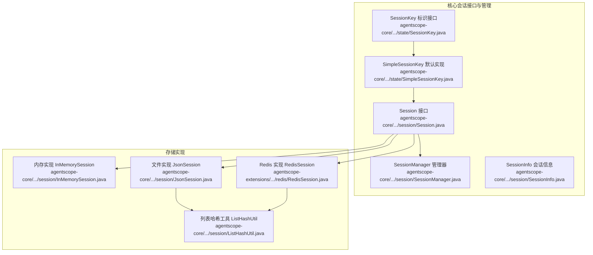
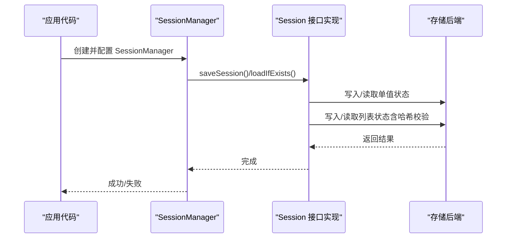
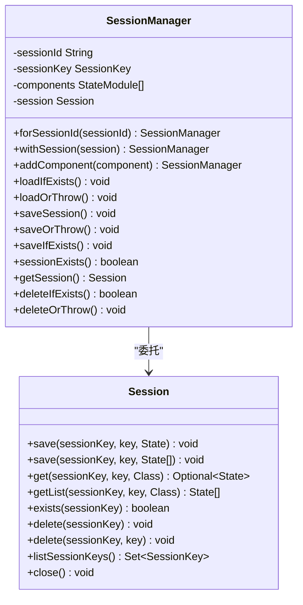
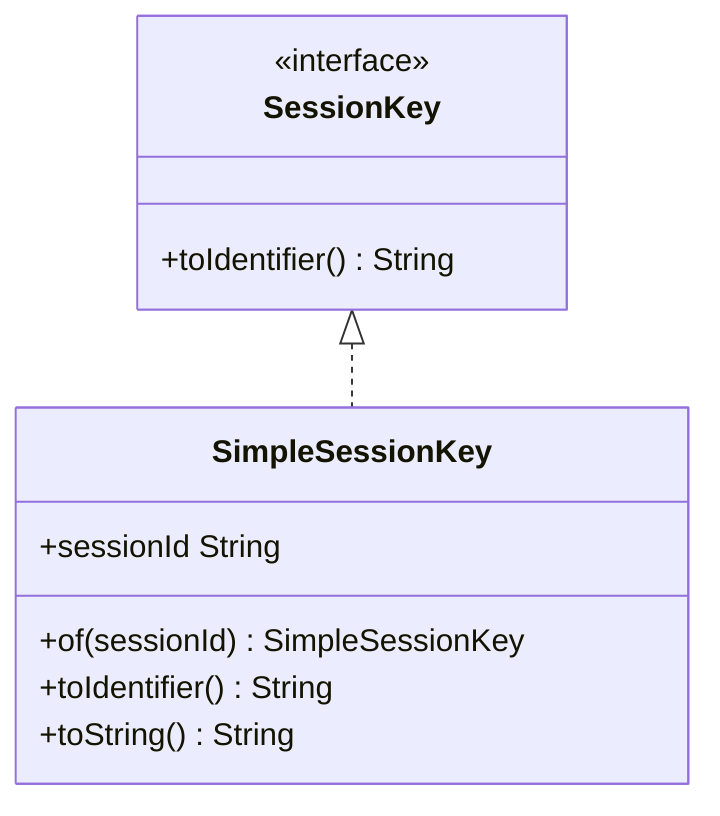
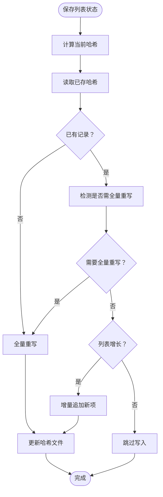
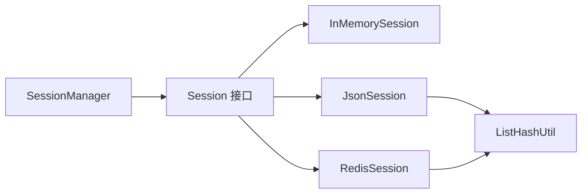

# 会话配置与最佳实践

<cite>
**本文引用的文件**   
- [Session.java](file://agentscope-core/src/main/java/io/agentscope/core/session/Session.java)
- [SessionManager.java](file://agentscope-core/src/main/java/io/agentscope/core/session/SessionManager.java)
- [SessionInfo.java](file://agentscope-core/src/main/java/io/agentscope/core/session/SessionInfo.java)
- [SessionKey.java](file://agentscope-core/src/main/java/io/agentscope/core/state/SessionKey.java)
- [SimpleSessionKey.java](file://agentscope-core/src/main/java/io/agentscope/core/state/SimpleSessionKey.java)
- [InMemorySession.java](file://agentscope-core/src/main/java/io/agentscope/core/session/InMemorySession.java)
- [JsonSession.java](file://agentscope-core/src/main/java/io/agentscope/core/session/JsonSession.java)
- [RedisSession.java](file://agentscope-extensions/agentscope-extensions-session-redis/src/main/java/io/agentscope/core/session/redis/RedisSession.java)
- [ListHashUtil.java](file://agentscope-core/src/main/java/io/agentscope/core/session/ListHashUtil.java)
- [SessionManagerTest.java](file://agentscope-core/src/test/java/io/agentscope/core/session/SessionManagerTest.java)
- [RedissonSessionTest.java](file://agentscope-extensions/agentscope-extensions-session-redis/src/test/java/io/agentscope/core/session/redis/RedissonSessionTest.java)
- [session.md（英文）](file://docs/en/task/session.md)
- [session.md（中文）](file://docs/zh/task/session.md)
</cite>

## 目录
1. [简介](#简介)
2. [项目结构](#项目结构)
3. [核心组件](#核心组件)
4. [架构总览](#架构总览)
5. [详细组件分析](#详细组件分析)
6. [依赖分析](#依赖分析)
7. [性能考虑](#性能考虑)
8. [故障排查指南](#故障排查指南)
9. [结论](#结论)
10. [附录](#附录)

## 简介
本技术指南面向在 AgentScope Java 中进行会话配置与运维的工程师，目标是帮助您：
- 全面掌握会话系统的配置选项与最佳实践
- 理解不同存储后端的差异与优化策略
- 设计合理的会话键与命名规范
- 组织会话数据的状态分类、分片与索引
- 实施备份、恢复、迁移与版本兼容策略
- 在分布式环境下保障会话同步、一致性和冲突解决
- 建立性能监控与故障排查流程
- 提供生产部署与运维建议

## 项目结构
围绕会话能力的核心代码位于 agentscope-core 的 session 包与 state 包，扩展能力位于 agentscope-extensions 的 redis/mysql 等模块。下图展示与会话相关的关键文件与职责：

**图表来源**
- [Session.java:53-146](file://agentscope-core/src/main/java/io/agentscope/core/session/Session.java#L53-L146)
- [SessionManager.java:61-261](file://agentscope-core/src/main/java/io/agentscope/core/session/SessionManager.java#L61-L261)
- [SessionKey.java:46-62](file://agentscope-core/src/main/java/io/agentscope/core/state/SessionKey.java#L46-L62)
- [SimpleSessionKey.java:37-71](file://agentscope-core/src/main/java/io/agentscope/core/state/SimpleSessionKey.java#L37-L71)
- [SessionInfo.java:25-94](file://agentscope-core/src/main/java/io/agentscope/core/session/SessionInfo.java#L25-L94)
- [InMemorySession.java:58-250](file://agentscope-core/src/main/java/io/agentscope/core/session/InMemorySession.java#L58-L250)
- [JsonSession.java:58-510](file://agentscope-core/src/main/java/io/agentscope/core/session/JsonSession.java#L58-L510)
- [RedisSession.java:179-484](file://agentscope-extensions/agentscope-extensions-session-redis/src/main/java/io/agentscope/core/session/redis/RedisSession.java#L179-L484)
- [ListHashUtil.java:49-173](file://agentscope-core/src/main/java/io/agentscope/core/session/ListHashUtil.java#L49-L173)

**章节来源**
- [Session.java:53-146](file://agentscope-core/src/main/java/io/agentscope/core/session/Session.java#L53-L146)
- [SessionManager.java:61-261](file://agentscope-core/src/main/java/io/agentscope/core/session/SessionManager.java#L61-L261)
- [SessionKey.java:46-62](file://agentscope-core/src/main/java/io/agentscope/core/state/SessionKey.java#L46-L62)
- [SimpleSessionKey.java:37-71](file://agentscope-core/src/main/java/io/agentscope/core/state/SimpleSessionKey.java#L37-L71)
- [SessionInfo.java:25-94](file://agentscope-core/src/main/java/io/agentscope/core/session/SessionInfo.java#L25-L94)
- [InMemorySession.java:58-250](file://agentscope-core/src/main/java/io/agentscope/core/session/InMemorySession.java#L58-L250)
- [JsonSession.java:58-510](file://agentscope-core/src/main/java/io/agentscope/core/session/JsonSession.java#L58-L510)
- [RedisSession.java:179-484](file://agentscope-extensions/agentscope-extensions-session-redis/src/main/java/io/agentscope/core/session/redis/RedisSession.java#L179-L484)
- [ListHashUtil.java:49-173](file://agentscope-core/src/main/java/io/agentscope/core/session/ListHashUtil.java#L49-L173)

## 核心组件
- Session 接口：定义统一的会话存取 API，支持单值与列表两类状态的保存与读取，以及存在性检查、删除、枚举等操作。
- SessionManager：提供面向业务的“按会话 ID”管理 API，负责将多个 StateModule 的状态批量保存/加载到具体 Session 实现中。
- SessionKey/SimpleSessionKey：会话键抽象与默认实现，支持自定义复杂键结构（如多租户场景）。
- InMemorySession：基于内存的会话实现，适合单进程、非持久化场景；线程安全，但进程退出即丢失。
- JsonSession：基于文件系统的会话实现，默认存储于用户目录下的子目录，支持增量写入与哈希校验，具备原子性与容错能力。
- RedisSession：基于 Redis 的会话实现，支持多种客户端适配器（Jedis/Lettuce/Redisson），提供键空间、列表与哈希的协同存储策略。
- ListHashUtil：列表状态的哈希计算与变更检测工具，用于判断是否需要全量重写或增量追加。

**章节来源**
- [Session.java:53-146](file://agentscope-core/src/main/java/io/agentscope/core/session/Session.java#L53-L146)
- [SessionManager.java:61-261](file://agentscope-core/src/main/java/io/agentscope/core/session/SessionManager.java#L61-L261)
- [SessionKey.java:46-62](file://agentscope-core/src/main/java/io/agentscope/core/state/SessionKey.java#L46-L62)
- [SimpleSessionKey.java:37-71](file://agentscope-core/src/main/java/io/agentscope/core/state/SimpleSessionKey.java#L37-L71)
- [InMemorySession.java:58-250](file://agentscope-core/src/main/java/io/agentscope/core/session/InMemorySession.java#L58-L250)
- [JsonSession.java:58-510](file://agentscope-core/src/main/java/io/agentscope/core/session/JsonSession.java#L58-L510)
- [RedisSession.java:179-484](file://agentscope-extensions/agentscope-extensions-session-redis/src/main/java/io/agentscope/core/session/redis/RedisSession.java#L179-L484)
- [ListHashUtil.java:49-173](file://agentscope-core/src/main/java/io/agentscope/core/session/ListHashUtil.java#L49-L173)

## 架构总览
下图展示了从应用层到存储层的调用链路与数据流：

**图表来源**
- [SessionManager.java:130-202](file://agentscope-core/src/main/java/io/agentscope/core/session/SessionManager.java#L130-L202)
- [Session.java:64-104](file://agentscope-core/src/main/java/io/agentscope/core/session/Session.java#L64-L104)
- [JsonSession.java:98-162](file://agentscope-core/src/main/java/io/agentscope/core/session/JsonSession.java#L98-L162)
- [RedisSession.java:214-267](file://agentscope-extensions/agentscope-extensions-session-redis/src/main/java/io/agentscope/core/session/redis/RedisSession.java#L214-L267)

## 详细组件分析

### Session 接口与 SessionManager
- Session 接口定义了统一的存取契约，支持：
  - 单值保存/读取：覆盖式写入
  - 列表保存/读取：不同实现采用不同策略（增量追加 vs 全量替换）
  - 存在性检查、删除、枚举
- SessionManager 提供面向“会话 ID”的高层 API：
  - 注册多个 StateModule
  - 批量保存/加载
  - 条件保存/删除（存在时才保存/删除）
  - 异常安全的“保存并抛出”模式

**图表来源**
- [Session.java:53-146](file://agentscope-core/src/main/java/io/agentscope/core/session/Session.java#L53-L146)
- [SessionManager.java:61-261](file://agentscope-core/src/main/java/io/agentscope/core/session/SessionManager.java#L61-L261)

**章节来源**
- [Session.java:53-146](file://agentscope-core/src/main/java/io/agentscope/core/session/Session.java#L53-L146)
- [SessionManager.java:61-261](file://agentscope-core/src/main/java/io/agentscope/core/session/SessionManager.java#L61-L261)
- [SessionManagerTest.java:55-127](file://agentscope-core/src/test/java/io/agentscope/core/session/SessionManagerTest.java#L55-L127)

### 会话键设计与命名规范
- 默认使用 SimpleSessionKey，内部以字符串作为会话 ID。
- SessionKey.toIdentifier() 可被存储实现用于生成目录名、数据库键或 Redis 键前缀。
- 自定义 SessionKey 可用于多租户等复杂场景，存储实现可据此决定分片策略。

**图表来源**
- [SessionKey.java:46-62](file://agentscope-core/src/main/java/io/agentscope/core/state/SessionKey.java#L46-L62)
- [SimpleSessionKey.java:37-71](file://agentscope-core/src/main/java/io/agentscope/core/state/SimpleSessionKey.java#L37-L71)

**章节来源**
- [SessionKey.java:46-62](file://agentscope-core/src/main/java/io/agentscope/core/state/SessionKey.java#L46-L62)
- [SimpleSessionKey.java:37-71](file://agentscope-core/src/main/java/io/agentscope/core/state/SimpleSessionKey.java#L37-L71)

### 文件存储实现：JsonSession
- 存储位置：默认位于用户主目录下的子目录，可通过构造函数指定自定义路径。
- 单值状态：每个键对应一个 JSON 文件。
- 列表状态：采用 JSONL（每行一个对象）存储，并配合 .hash 文件进行变更检测，支持增量追加与全量重写。
- 文件系统安全：当会话 ID 含有特殊字符时，自动进行 URL 安全 Base64 编码，确保文件系统兼容。
- 清理与并发：提供异步清理 API；读写采用 UTF-8 编码与原子写入策略。

**图表来源**
- [JsonSession.java:128-162](file://agentscope-core/src/main/java/io/agentscope/core/session/JsonSession.java#L128-L162)
- [ListHashUtil.java:148-171](file://agentscope-core/src/main/java/io/agentscope/core/session/ListHashUtil.java#L148-L171)

**章节来源**
- [JsonSession.java:58-510](file://agentscope-core/src/main/java/io/agentscope/core/session/JsonSession.java#L58-L510)
- [ListHashUtil.java:49-173](file://agentscope-core/src/main/java/io/agentscope/core/session/ListHashUtil.java#L49-L173)

### 内存存储实现：InMemorySession
- 特点：线程安全，使用并发容器；适合单进程、临时状态；不跨进程持久化。
- 列表策略：与 JsonSession 不同，InMemorySession 对列表采取全量替换策略，调用方应传入完整列表。

**章节来源**
- [InMemorySession.java:58-250](file://agentscope-core/src/main/java/io/agentscope/core/session/InMemorySession.java#L58-L250)

### Redis 存储实现：RedisSession
- 支持多种客户端适配器（Jedis/Lettuce/Redisson），覆盖单机、集群、哨兵与主从等部署形态。
- 键空间设计：
  - 单值：前缀 + sessionId + ":" + stateKey
  - 列表：前缀 + sessionId + ":" + stateKey + ":list"
  - 列表哈希：前缀 + sessionId + ":" + stateKey + ":list:_hash"
  - 会话键集合：前缀 + sessionId + ":_keys"
- 列表变更检测与增量追加逻辑与 JsonSession 一致，通过哈希文件判断是否需要全量重写。
- 提供清理与关闭生命周期管理。

**章节来源**
- [RedisSession.java:179-484](file://agentscope-extensions/agentscope-extensions-session-redis/src/main/java/io/agentscope/core/session/redis/RedisSession.java#L179-L484)

### 列表哈希工具：ListHashUtil
- 作用：对列表状态进行采样哈希，快速判断内容是否发生变化，避免对大列表全量遍历。
- 策略：小列表全采样，大列表按固定采样点采样，兼顾准确性与性能。
- 与 Session 实现协作：用于判断是否需要全量重写或增量追加。

**章节来源**
- [ListHashUtil.java:49-173](file://agentscope-core/src/main/java/io/agentscope/core/session/ListHashUtil.java#L49-L173)

## 依赖分析
- SessionManager 依赖 Session 接口，通过注入任意 Session 实现实现后端无关。
- Session 接口的三种实现（InMemory/Json/Redis）均依赖 ListHashUtil 进行列表状态的变更检测。
- RedisSession 依赖多种客户端适配器，但对外暴露统一 Session 接口。

**图表来源**
- [SessionManager.java:61-261](file://agentscope-core/src/main/java/io/agentscope/core/session/SessionManager.java#L61-L261)
- [Session.java:53-146](file://agentscope-core/src/main/java/io/agentscope/core/session/Session.java#L53-L146)
- [InMemorySession.java:58-250](file://agentscope-core/src/main/java/io/agentscope/core/session/InMemorySession.java#L58-L250)
- [JsonSession.java:58-510](file://agentscope-core/src/main/java/io/agentscope/core/session/JsonSession.java#L58-L510)
- [RedisSession.java:179-484](file://agentscope-extensions/agentscope-extensions-session-redis/src/main/java/io/agentscope/core/session/redis/RedisSession.java#L179-L484)
- [ListHashUtil.java:49-173](file://agentscope-core/src/main/java/io/agentscope/core/session/ListHashUtil.java#L49-L173)

**章节来源**
- [SessionManager.java:61-261](file://agentscope-core/src/main/java/io/agentscope/core/session/SessionManager.java#L61-L261)
- [Session.java:53-146](file://agentscope-core/src/main/java/io/agentscope/core/session/Session.java#L53-L146)
- [InMemorySession.java:58-250](file://agentscope-core/src/main/java/io/agentscope/core/session/InMemorySession.java#L58-L250)
- [JsonSession.java:58-510](file://agentscope-core/src/main/java/io/agentscope/core/session/JsonSession.java#L58-L510)
- [RedisSession.java:179-484](file://agentscope-extensions/agentscope-extensions-session-redis/src/main/java/io/agentscope/core/session/redis/RedisSession.java#L179-L484)
- [ListHashUtil.java:49-173](file://agentscope-core/src/main/java/io/agentscope/core/session/ListHashUtil.java#L49-L173)

## 性能考虑
- 列表写入策略
  - JsonSession/RedisSession 通过 ListHashUtil 判断是否需要全量重写或增量追加，减少不必要的 IO。
  - 大列表采用采样哈希，降低哈希计算成本。
- 文件系统与网络开销
  - JsonSession 使用 UTF-8 与原子写入，避免部分写入导致的数据损坏。
  - RedisSession 通过客户端适配器的连接池与序列化策略影响吞吐与延迟。
- 并发与线程安全
  - InMemorySession 使用并发容器，适合高并发读写场景。
  - RedisSession 的键集合与列表操作需遵循原子性约束，避免竞态。
- 资源清理
  - JsonSession/RedisSession 提供清理 API，可在批量删除或测试场景中使用。

**章节来源**
- [JsonSession.java:128-162](file://agentscope-core/src/main/java/io/agentscope/core/session/JsonSession.java#L128-L162)
- [RedisSession.java:229-267](file://agentscope-extensions/agentscope-extensions-session-redis/src/main/java/io/agentscope/core/session/redis/RedisSession.java#L229-L267)
- [ListHashUtil.java:77-96](file://agentscope-core/src/main/java/io/agentscope/core/session/ListHashUtil.java#L77-L96)
- [InMemorySession.java:58-250](file://agentscope-core/src/main/java/io/agentscope/core/session/InMemorySession.java#L58-L250)

## 故障排查指南
- 常见问题与定位
  - 会话不存在：检查 SessionManager 是否正确配置 Session 实例；确认 SessionKey.toIdentifier() 生成的键与存储后端一致。
  - 列表未增量追加：确认 ListHashUtil 计算的哈希是否变化，或是否存在列表收缩/缺失哈希的情况。
  - 文件系统异常：JsonSession 在目录创建、文件写入、删除时可能抛出异常，检查权限与磁盘空间。
  - Redis 连接异常：核对客户端适配器配置（单机/集群/哨兵），确认键前缀与键空间设计。
- 单元测试参考
  - SessionManager 测试覆盖了保存/加载、条件保存/删除、异常路径等场景。
  - RedissonSession 测试验证了单值/列表读写、存在性检查、删除与枚举等行为。

**章节来源**
- [SessionManagerTest.java:184-247](file://agentscope-core/src/test/java/io/agentscope/core/session/SessionManagerTest.java#L184-L247)
- [RedissonSessionTest.java:75-335](file://agentscope-extensions/agentscope-extensions-session-redis/src/test/java/io/agentscope/core/session/redis/RedissonSessionTest.java#L75-L335)

## 结论
- 选择合适的存储后端：开发/测试可用 InMemorySession；生产推荐 JsonSession 或 RedisSession。
- 正确使用 SessionManager：集中注册 StateModule，统一保存/加载，利用条件操作避免误操作。
- 列表状态的变更检测：依赖 ListHashUtil，合理设计列表写入策略以提升性能。
- 分布式与一致性：RedisSession 提供统一键空间与列表结构，结合客户端适配器满足多部署形态。
- 迁移与兼容：参考文档中的迁移方案，确保新旧版本平滑过渡。

## 附录

### 配置选项与最佳实践清单
- 存储路径设置
  - JsonSession：通过构造函数指定会话目录；默认位于用户主目录下，便于隔离与备份。
  - RedisSession：通过构建器设置键前缀，避免与其他应用冲突。
- 连接参数配置
  - RedisSession：根据部署形态选择 Jedis/Lettuce/Redisson 客户端，配置连接地址、认证、超时与集群拓扑。
- 性能调优参数
  - 列表写入：优先增量追加，减少全量重写；大列表采用采样哈希。
  - 文件系统：确保磁盘具备足够空间与权限；必要时启用异步清理。
  - Redis：合理设置连接池大小、序列化策略与键过期策略。
- 存储后端差异与优化
  - InMemorySession：适合单进程、临时状态；注意进程重启即丢失。
  - JsonSession：适合本地持久化与离线迁移；注意文件系统兼容性与原子写入。
  - RedisSession：适合分布式与高并发；注意键空间设计与客户端适配器选择。
- 会话键设计与命名规范
  - 默认使用 SimpleSessionKey；复杂场景可自定义 SessionKey，确保 toIdentifier() 输出稳定且可解析。
  - 避免在会话 ID 中使用文件系统不安全字符，JsonSession 已内置编码处理。
- 会话数据组织策略
  - 状态分类：单值状态与列表状态分离，便于增量追加与全量替换。
  - 数据分片：多租户场景可将租户 ID、用户 ID、会话类型组合为复合键。
  - 索引设计：RedisSession 通过键集合维护会话内键索引，便于枚举与清理。
- 备份、恢复与迁移
  - 文件备份：定期复制 JsonSession 目录；恢复时直接回放。
  - Redis 备份：导出键空间或使用持久化策略；恢复后验证键集合完整性。
  - 迁移策略：参考文档中的迁移步骤，先备份再切换，双版本并行过渡。
- 分布式同步、一致性与冲突解决
  - 使用分布式 Session（如 RedisSession）保证多副本共享同一会话。
  - 通过客户端适配器的事务/锁机制保障关键写入的原子性。
  - 冲突解决：采用“最后写入获胜”或“合并策略”，并在应用层做幂等处理。
- 生产部署建议
  - 选择稳定的 Redis 部署形态（单机/集群/哨兵），并开启持久化与健康检查。
  - 为 JsonSession 设置独立的高可靠存储卷，定期快照与异地备份。
  - 在 CI/CD 中加入会话相关测试，确保迁移与升级过程可控。
- 运维最佳实践
  - 监控指标：会话数量、存储容量、IO 吞吐、Redis 连接数与延迟。
  - 日志与告警：记录会话保存/加载异常、哈希不匹配、存储空间不足等事件。
  - 清理策略：定期清理过期会话与冗余键，避免键空间膨胀。

**章节来源**
- [JsonSession.java:68-87](file://agentscope-core/src/main/java/io/agentscope/core/session/JsonSession.java#L68-L87)
- [RedisSession.java:179-178](file://agentscope-extensions/agentscope-extensions-session-redis/src/main/java/io/agentscope/core/session/redis/RedisSession.java#L179-L178)
- [session.md（英文）:325-431](file://docs/en/task/session.md#L325-L431)
- [session.md（中文）:374-436](file://docs/zh/task/session.md#L374-L436)