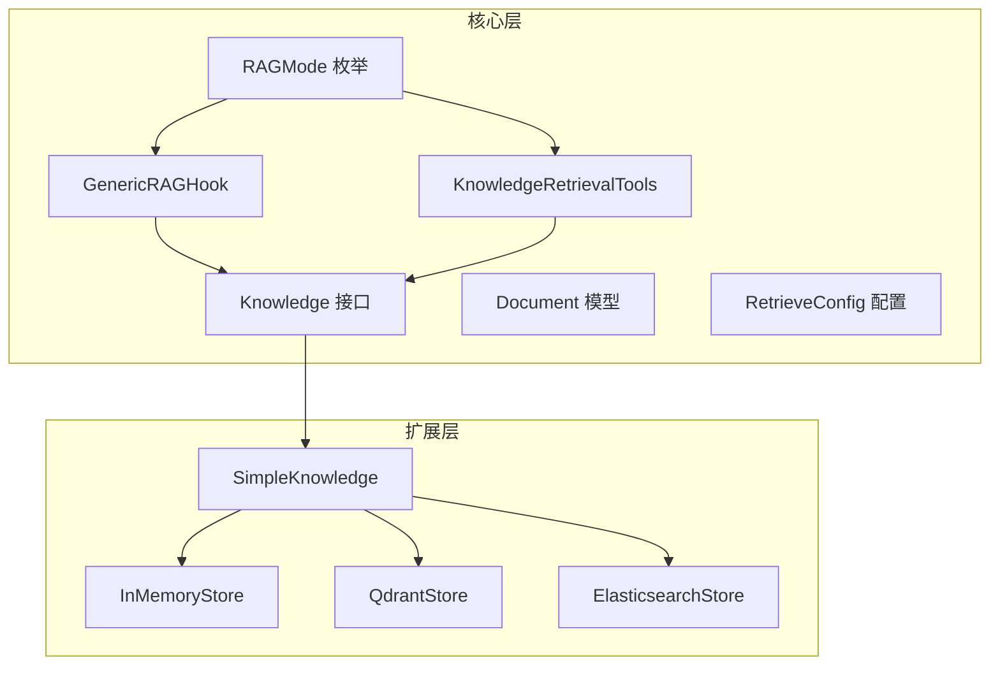
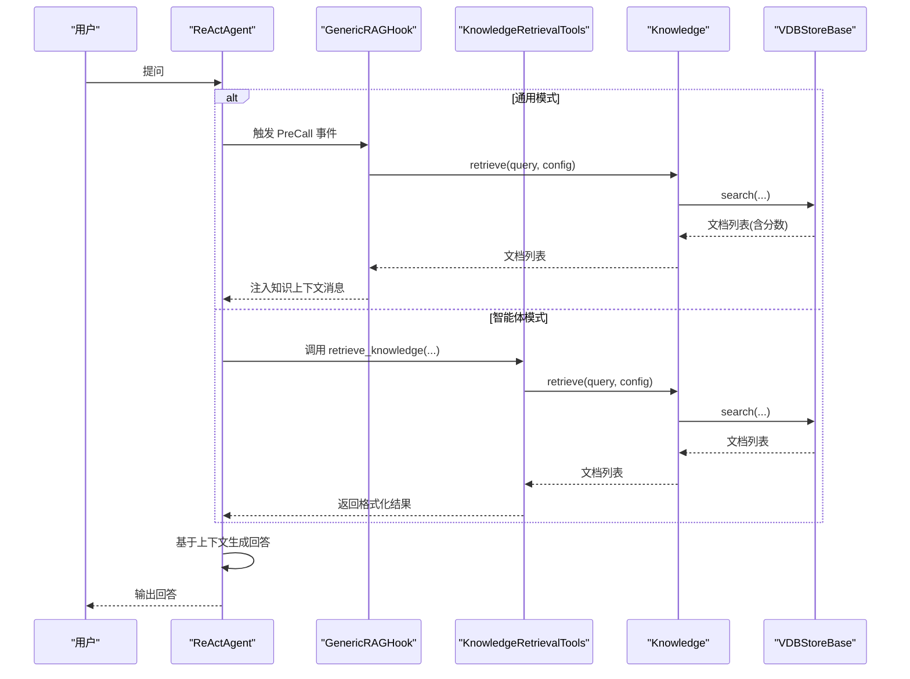
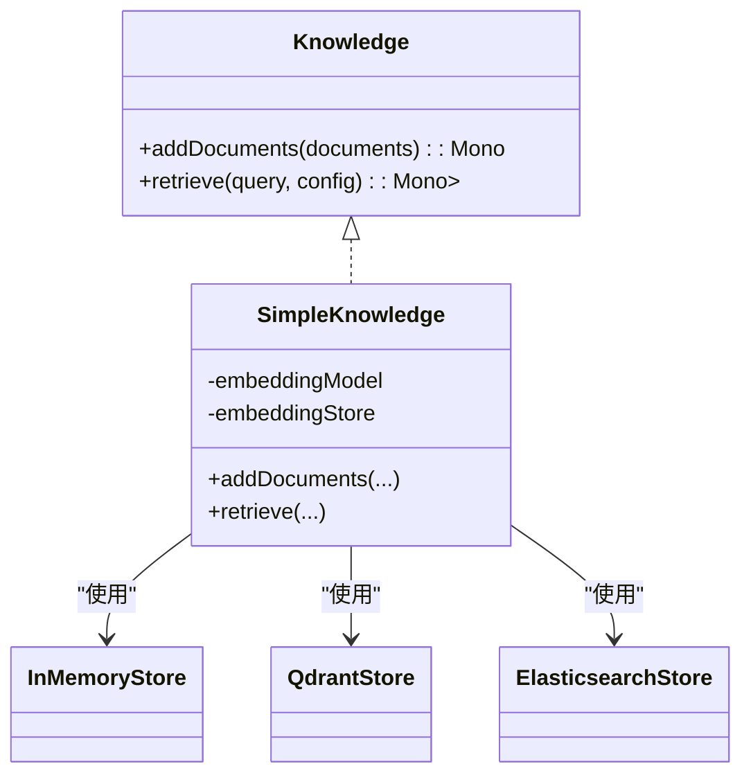
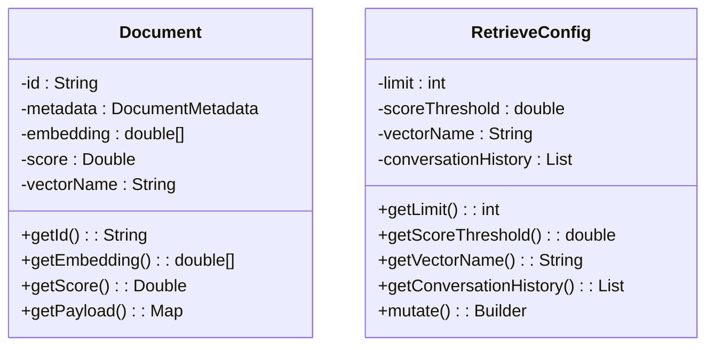
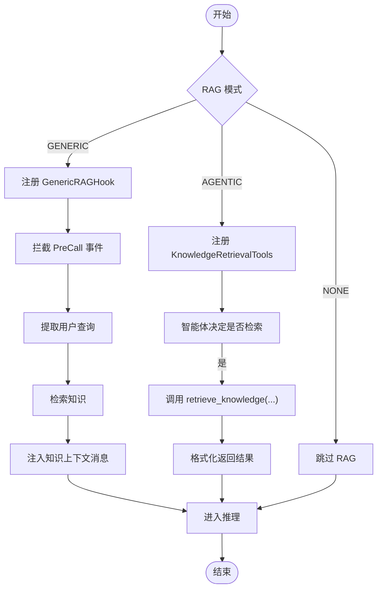
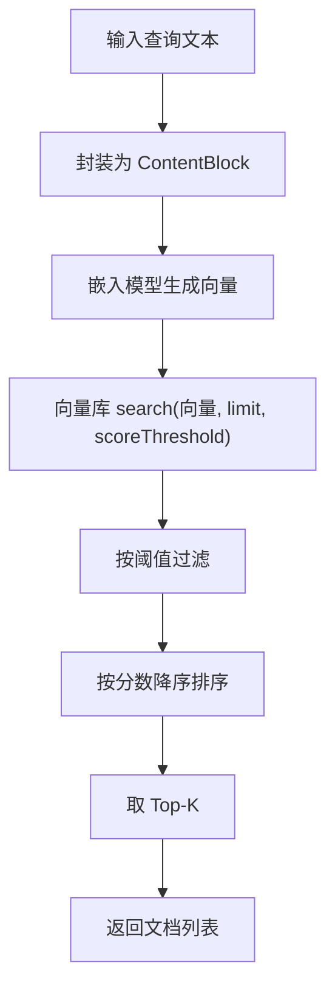
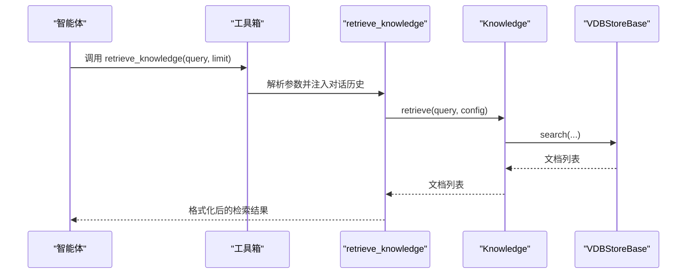
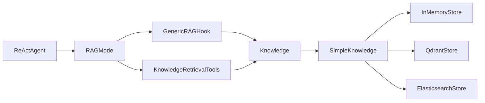

# RAG 系统

<cite>
**本文引用的文件**
- [agentscope-core/src/main/java/io/agentscope/core/rag/Knowledge.java](file://agentscope-core/src/main/java/io/agentscope/core/rag/Knowledge.java)
- [agentscope-core/src/main/java/io/agentscope/core/rag/RAGMode.java](file://agentscope-core/src/main/java/io/agentscope/core/rag/RAGMode.java)
- [agentscope-core/src/main/java/io/agentscope/core/rag/GenericRAGHook.java](file://agentscope-core/src/main/java/io/agentscope/core/rag/GenericRAGHook.java)
- [agentscope-core/src/main/java/io/agentscope/core/rag/KnowledgeRetrievalTools.java](file://agentscope-core/src/main/java/io/agentscope/core/rag/KnowledgeRetrievalTools.java)
- [agentscope-core/src/main/java/io/agentscope/core/rag/model/Document.java](file://agentscope-core/src/main/java/io/agentscope/core/rag/model/Document.java)
- [agentscope-core/src/main/java/io/agentscope/core/rag/model/RetrieveConfig.java](file://agentscope-core/src/main/java/io/agentscope/core/rag/model/RetrieveConfig.java)
- [agentscope-extensions/agentscope-extensions-rag-simple/src/main/java/io/agentscope/core/rag/knowledge/SimpleKnowledge.java](file://agentscope-extensions/agentscope-extensions-rag-simple/src/main/java/io/agentscope/core/rag/knowledge/SimpleKnowledge.java)
- [agentscope-extensions/agentscope-extensions-rag-simple/src/main/java/io/agentscope/core/rag/store/InMemoryStore.java](file://agentscope-extensions/agentscope-extensions-rag-simple/src/main/java/io/agentscope/core/rag/store/InMemoryStore.java)
- [agentscope-extensions/agentscope-extensions-rag-simple/src/main/java/io/agentscope/core/rag/store/QdrantStore.java](file://agentscope-extensions/agentscope-extensions-rag-simple/src/main/java/io/agentscope/core/rag/store/QdrantStore.java)
- [agentscope-extensions/agentscope-extensions-rag-simple/src/main/java/io/agentscope/core/rag/store/ElasticsearchStore.java](file://agentscope-extensions/agentscope-extensions-rag-simple/src/main/java/io/agentscope/core/rag/store/ElasticsearchStore.java)
- [agentscope-examples/advanced/src/main/java/io/agentscope/examples/advanced/RAGExample.java](file://agentscope-examples/advanced/src/main/java/io/agentscope/examples/advanced/RAGExample.java)
- [agentscope-examples/advanced/src/main/java/io/agentscope/examples/advanced/BailianRAGExample.java](file://agentscope-examples/advanced/src/main/java/io/agentscope/examples/advanced/BailianRAGExample.java)
- [docs/en/task/rag.md](file://docs/en/task/rag.md)
- [agentscope-core/src/main/java/io/agentscope/core/ReActAgent.java](file://agentscope-core/src/main/java/io/agentscope/core/ReActAgent.java)
</cite>

## 目录
1. [简介](#简介)
2. [项目结构](#项目结构)
3. [核心组件](#核心组件)
4. [架构总览](#架构总览)
5. [详细组件分析](#详细组件分析)
6. [依赖分析](#依赖分析)
7. [性能考虑](#性能考虑)
8. [故障排查指南](#故障排查指南)
9. [结论](#结论)
10. [附录](#附录)

## 简介
本技术文档面向 AgentScope Java 的 RAG（检索增强生成）系统，聚焦于知识库的构建、存储与管理机制，文档检索算法、相似度计算与排序策略，RAG 模式（通用模式与智能体模式）的配置与使用场景，知识检索工具的实现原理与调用方式，以及检索增强生成的完整工作流程。同时提供嵌入模型选择指南、向量数据库集成与性能优化策略，并覆盖企业级部署中的知识更新、增量索引与实时检索方案。

## 项目结构
AgentScope 将 RAG 能力拆分为核心接口与扩展实现两部分：
- 核心层：定义统一的知识库接口、检索配置、文档模型与 RAG 模式枚举，以及通用 Hook 与工具类。
- 扩展层：提供 SimpleKnowledge 作为本地化 RAG 实现，以及多种向量数据库存储实现（内存、Qdrant、Elasticsearch）。

图表来源
- [agentscope-core/src/main/java/io/agentscope/core/rag/Knowledge.java:30-53](file://agentscope-core/src/main/java/io/agentscope/core/rag/Knowledge.java#L30-L53)
- [agentscope-core/src/main/java/io/agentscope/core/rag/model/Document.java:34-110](file://agentscope-core/src/main/java/io/agentscope/core/rag/model/Document.java#L34-L110)
- [agentscope-core/src/main/java/io/agentscope/core/rag/model/RetrieveConfig.java:28-92](file://agentscope-core/src/main/java/io/agentscope/core/rag/model/RetrieveConfig.java#L28-L92)
- [agentscope-core/src/main/java/io/agentscope/core/rag/RAGMode.java:28-51](file://agentscope-core/src/main/java/io/agentscope/core/rag/RAGMode.java#L28-L51)
- [agentscope-core/src/main/java/io/agentscope/core/rag/GenericRAGHook.java:65-104](file://agentscope-core/src/main/java/io/agentscope/core/rag/GenericRAGHook.java#L65-L104)
- [agentscope-core/src/main/java/io/agentscope/core/rag/KnowledgeRetrievalTools.java:52-90](file://agentscope-core/src/main/java/io/agentscope/core/rag/KnowledgeRetrievalTools.java#L52-L90)
- [agentscope-extensions/agentscope-extensions-rag-simple/src/main/java/io/agentscope/core/rag/knowledge/SimpleKnowledge.java:71-94](file://agentscope-extensions/agentscope-extensions-rag-simple/src/main/java/io/agentscope/core/rag/knowledge/SimpleKnowledge.java#L71-L94)
- [agentscope-extensions/agentscope-extensions-rag-simple/src/main/java/io/agentscope/core/rag/store/InMemoryStore.java:65-82](file://agentscope-extensions/agentscope-extensions-rag-simple/src/main/java/io/agentscope/core/rag/store/InMemoryStore.java#L65-L82)
- [agentscope-extensions/agentscope-extensions-rag-simple/src/main/java/io/agentscope/core/rag/store/QdrantStore.java:112-124](file://agentscope-extensions/agentscope-extensions-rag-simple/src/main/java/io/agentscope/core/rag/store/QdrantStore.java#L112-L124)
- [agentscope-extensions/agentscope-extensions-rag-simple/src/main/java/io/agentscope/core/rag/store/ElasticsearchStore.java:88-107](file://agentscope-extensions/agentscope-extensions-rag-simple/src/main/java/io/agentscope/core/rag/store/ElasticsearchStore.java#L88-L107)

章节来源
- [agentscope-core/src/main/java/io/agentscope/core/rag/Knowledge.java:23-53](file://agentscope-core/src/main/java/io/agentscope/core/rag/Knowledge.java#L23-L53)
- [agentscope-core/src/main/java/io/agentscope/core/rag/model/Document.java:24-110](file://agentscope-core/src/main/java/io/agentscope/core/rag/model/Document.java#L24-L110)
- [agentscope-core/src/main/java/io/agentscope/core/rag/model/RetrieveConfig.java:21-92](file://agentscope-core/src/main/java/io/agentscope/core/rag/model/RetrieveConfig.java#L21-L92)
- [agentscope-core/src/main/java/io/agentscope/core/rag/RAGMode.java:18-51](file://agentscope-core/src/main/java/io/agentscope/core/rag/RAGMode.java#L18-L51)
- [agentscope-extensions/agentscope-extensions-rag-simple/src/main/java/io/agentscope/core/rag/knowledge/SimpleKnowledge.java:35-70](file://agentscope-extensions/agentscope-extensions-rag-simple/src/main/java/io/agentscope/core/rag/knowledge/SimpleKnowledge.java#L35-L70)

## 核心组件
- 知识库接口 Knowledge：统一的添加与检索能力抽象，支持异步 Mono 流式处理。
- 文档模型 Document：承载元数据、可选嵌入向量与相似度分数，提供确定性 ID 生成与负载访问方法。
- 检索配置 RetrieveConfig：通过构建器设置 Top-K、阈值、向量名与对话历史等参数。
- RAG 模式枚举 RAGMode：定义通用模式（自动注入）、智能体模式（工具驱动）与禁用模式。
- 通用 Hook GenericRAGHook：在推理前自动从知识库检索并注入上下文。
- 智能体检索工具 KnowledgeRetrievalTools：注册到工具箱，供智能体按需检索知识。

章节来源
- [agentscope-core/src/main/java/io/agentscope/core/rag/Knowledge.java:30-53](file://agentscope-core/src/main/java/io/agentscope/core/rag/Knowledge.java#L30-L53)
- [agentscope-core/src/main/java/io/agentscope/core/rag/model/Document.java:34-110](file://agentscope-core/src/main/java/io/agentscope/core/rag/model/Document.java#L34-L110)
- [agentscope-core/src/main/java/io/agentscope/core/rag/model/RetrieveConfig.java:28-92](file://agentscope-core/src/main/java/io/agentscope/core/rag/model/RetrieveConfig.java#L28-L92)
- [agentscope-core/src/main/java/io/agentscope/core/rag/RAGMode.java:28-51](file://agentscope-core/src/main/java/io/agentscope/core/rag/RAGMode.java#L28-L51)
- [agentscope-core/src/main/java/io/agentscope/core/rag/GenericRAGHook.java:65-104](file://agentscope-core/src/main/java/io/agentscope/core/rag/GenericRAGHook.java#L65-L104)
- [agentscope-core/src/main/java/io/agentscope/core/rag/KnowledgeRetrievalTools.java:52-90](file://agentscope-core/src/main/java/io/agentscope/core/rag/KnowledgeRetrievalTools.java#L52-L90)

## 架构总览
RAG 工作流由“查询理解—文档检索—上下文构建—答案生成”构成。系统支持两种模式：
- 通用模式：在每次推理前自动检索并注入知识上下文。
- 智能体模式：通过工具让智能体自主决定何时检索。

图表来源
- [agentscope-core/src/main/java/io/agentscope/core/rag/GenericRAGHook.java:106-162](file://agentscope-core/src/main/java/io/agentscope/core/rag/GenericRAGHook.java#L106-L162)
- [agentscope-core/src/main/java/io/agentscope/core/rag/KnowledgeRetrievalTools.java:114-158](file://agentscope-core/src/main/java/io/agentscope/core/rag/KnowledgeRetrievalTools.java#L114-L158)
- [agentscope-core/src/main/java/io/agentscope/core/rag/Knowledge.java:30-53](file://agentscope-core/src/main/java/io/agentscope/core/rag/Knowledge.java#L30-L53)
- [agentscope-extensions/agentscope-extensions-rag-simple/src/main/java/io/agentscope/core/rag/knowledge/SimpleKnowledge.java:134-174](file://agentscope-extensions/agentscope-extensions-rag-simple/src/main/java/io/agentscope/core/rag/knowledge/SimpleKnowledge.java#L134-L174)

## 详细组件分析

### 知识库接口与实现
- Knowledge 接口定义了 addDocuments 与 retrieve 两个核心方法，返回 Mono 以保证非阻塞与可组合性。
- SimpleKnowledge 将嵌入模型与向量存储解耦，先对文档内容生成嵌入，再批量写入向量库；检索时对查询生成嵌入后执行搜索，过滤阈值并按分数降序排序。

图表来源
- [agentscope-core/src/main/java/io/agentscope/core/rag/Knowledge.java:30-53](file://agentscope-core/src/main/java/io/agentscope/core/rag/Knowledge.java#L30-L53)
- [agentscope-extensions/agentscope-extensions-rag-simple/src/main/java/io/agentscope/core/rag/knowledge/SimpleKnowledge.java:71-94](file://agentscope-extensions/agentscope-extensions-rag-simple/src/main/java/io/agentscope/core/rag/knowledge/SimpleKnowledge.java#L71-L94)
- [agentscope-extensions/agentscope-extensions-rag-simple/src/main/java/io/agentscope/core/rag/store/InMemoryStore.java:65-82](file://agentscope-extensions/agentscope-extensions-rag-simple/src/main/java/io/agentscope/core/rag/store/InMemoryStore.java#L65-L82)
- [agentscope-extensions/agentscope-extensions-rag-simple/src/main/java/io/agentscope/core/rag/store/QdrantStore.java:112-124](file://agentscope-extensions/agentscope-extensions-rag-simple/src/main/java/io/agentscope/core/rag/store/QdrantStore.java#L112-L124)
- [agentscope-extensions/agentscope-extensions-rag-simple/src/main/java/io/agentscope/core/rag/store/ElasticsearchStore.java:88-107](file://agentscope-extensions/agentscope-extensions-rag-simple/src/main/java/io/agentscope/core/rag/store/ElasticsearchStore.java#L88-L107)

章节来源
- [agentscope-core/src/main/java/io/agentscope/core/rag/Knowledge.java:30-53](file://agentscope-core/src/main/java/io/agentscope/core/rag/Knowledge.java#L30-L53)
- [agentscope-extensions/agentscope-extensions-rag-simple/src/main/java/io/agentscope/core/rag/knowledge/SimpleKnowledge.java:96-132](file://agentscope-extensions/agentscope-extensions-rag-simple/src/main/java/io/agentscope/core/rag/knowledge/SimpleKnowledge.java#L96-L132)
- [agentscope-extensions/agentscope-extensions-rag-simple/src/main/java/io/agentscope/core/rag/knowledge/SimpleKnowledge.java:134-174](file://agentscope-extensions/agentscope-extensions-rag-simple/src/main/java/io/agentscope/core/rag/knowledge/SimpleKnowledge.java#L134-L174)

### 文档与检索配置
- Document：包含元数据、可选嵌入向量与相似度分数；提供确定性 ID 生成逻辑，确保跨运行一致。
- RetrieveConfig：通过构建器设置 Top-K、阈值、向量名与对话历史；支持 mutate 复制当前实例用于微调。

图表来源
- [agentscope-core/src/main/java/io/agentscope/core/rag/model/Document.java:34-110](file://agentscope-core/src/main/java/io/agentscope/core/rag/model/Document.java#L34-L110)
- [agentscope-core/src/main/java/io/agentscope/core/rag/model/RetrieveConfig.java:28-92](file://agentscope-core/src/main/java/io/agentscope/core/rag/model/RetrieveConfig.java#L28-L92)

章节来源
- [agentscope-core/src/main/java/io/agentscope/core/rag/model/Document.java:24-110](file://agentscope-core/src/main/java/io/agentscope/core/rag/model/Document.java#L24-L110)
- [agentscope-core/src/main/java/io/agentscope/core/rag/model/RetrieveConfig.java:21-92](file://agentscope-core/src/main/java/io/agentscope/core/rag/model/RetrieveConfig.java#L21-L92)

### RAG 模式与控制流
- RAGMode：GENERIC（通用）、AGENTIC（智能体）、NONE（禁用）。
- ReActAgent 在构建阶段根据模式装配：
  - GENERIC：注册 GenericRAGHook，自动在每次推理前注入知识。
  - AGENTIC：注册 KnowledgeRetrievalTools 到工具箱，由智能体自主检索。
- GenericRAGHook 在 PreCall 阶段提取用户查询，检索相关文档，构造知识消息注入输入消息列表。

图表来源
- [agentscope-core/src/main/java/io/agentscope/core/rag/RAGMode.java:28-51](file://agentscope-core/src/main/java/io/agentscope/core/rag/RAGMode.java#L28-L51)
- [agentscope-core/src/main/java/io/agentscope/core/ReActAgent.java:1776-1794](file://agentscope-core/src/main/java/io/agentscope/core/ReActAgent.java#L1776-L1794)
- [agentscope-core/src/main/java/io/agentscope/core/rag/GenericRAGHook.java:106-162](file://agentscope-core/src/main/java/io/agentscope/core/rag/GenericRAGHook.java#L106-L162)
- [agentscope-core/src/main/java/io/agentscope/core/rag/KnowledgeRetrievalTools.java:114-158](file://agentscope-core/src/main/java/io/agentscope/core/rag/KnowledgeRetrievalTools.java#L114-L158)

章节来源
- [agentscope-core/src/main/java/io/agentscope/core/ReActAgent.java:1776-1794](file://agentscope-core/src/main/java/io/agentscope/core/ReActAgent.java#L1776-L1794)
- [agentscope-core/src/main/java/io/agentscope/core/rag/GenericRAGHook.java:65-104](file://agentscope-core/src/main/java/io/agentscope/core/rag/GenericRAGHook.java#L65-L104)
- [agentscope-core/src/main/java/io/agentscope/core/rag/KnowledgeRetrievalTools.java:52-90](file://agentscope-core/src/main/java/io/agentscope/core/rag/KnowledgeRetrievalTools.java#L52-L90)

### 检索算法、相似度与排序
- 相似度计算：InMemoryStore 使用余弦相似度；QdrantStore 与 ElasticsearchStore 均采用 Cosine 相似度或 kNN 搜索。
- 排序策略：按相似度降序排列，限制 Top-K；可选阈值过滤。
- 查询流程：SimpleKnowledge 将查询文本封装为 ContentBlock，生成嵌入后调用向量库 search，返回带分数的文档列表。

图表来源
- [agentscope-extensions/agentscope-extensions-rag-simple/src/main/java/io/agentscope/core/rag/knowledge/SimpleKnowledge.java:134-174](file://agentscope-extensions/agentscope-extensions-rag-simple/src/main/java/io/agentscope/core/rag/knowledge/SimpleKnowledge.java#L134-L174)
- [agentscope-extensions/agentscope-extensions-rag-simple/src/main/java/io/agentscope/core/rag/store/InMemoryStore.java:118-173](file://agentscope-extensions/agentscope-extensions-rag-simple/src/main/java/io/agentscope/core/rag/store/InMemoryStore.java#L118-L173)
- [agentscope-extensions/agentscope-extensions-rag-simple/src/main/java/io/agentscope/core/rag/store/QdrantStore.java:249-288](file://agentscope-extensions/agentscope-extensions-rag-simple/src/main/java/io/agentscope/core/rag/store/QdrantStore.java#L249-L288)
- [agentscope-extensions/agentscope-extensions-rag-simple/src/main/java/io/agentscope/core/rag/store/ElasticsearchStore.java:228-278](file://agentscope-extensions/agentscope-extensions-rag-simple/src/main/java/io/agentscope/core/rag/store/ElasticsearchStore.java#L228-L278)

章节来源
- [agentscope-extensions/agentscope-extensions-rag-simple/src/main/java/io/agentscope/core/rag/store/InMemoryStore.java:118-173](file://agentscope-extensions/agentscope-extensions-rag-simple/src/main/java/io/agentscope/core/rag/store/InMemoryStore.java#L118-L173)
- [agentscope-extensions/agentscope-extensions-rag-simple/src/main/java/io/agentscope/core/rag/store/QdrantStore.java:563-631](file://agentscope-extensions/agentscope-extensions-rag-simple/src/main/java/io/agentscope/core/rag/store/QdrantStore.java#L563-L631)
- [agentscope-extensions/agentscope-extensions-rag-simple/src/main/java/io/agentscope/core/rag/store/ElasticsearchStore.java:243-278](file://agentscope-extensions/agentscope-extensions-rag-simple/src/main/java/io/agentscope/core/rag/store/ElasticsearchStore.java#L243-L278)

### 知识检索工具与调用方式
- KnowledgeRetrievalTools：提供 retrieve_knowledge 工具方法，支持 limit 参数与对话历史注入；内部将检索结果格式化为人类可读字符串。
- 调用方式：在智能体工具箱中注册后，智能体可在思考过程中显式调用该工具进行检索。

图表来源
- [agentscope-core/src/main/java/io/agentscope/core/rag/KnowledgeRetrievalTools.java:114-158](file://agentscope-core/src/main/java/io/agentscope/core/rag/KnowledgeRetrievalTools.java#L114-L158)
- [agentscope-core/src/main/java/io/agentscope/core/rag/Knowledge.java:30-53](file://agentscope-core/src/main/java/io/agentscope/core/rag/Knowledge.java#L30-L53)
- [agentscope-extensions/agentscope-extensions-rag-simple/src/main/java/io/agentscope/core/rag/knowledge/SimpleKnowledge.java:134-174](file://agentscope-extensions/agentscope-extensions-rag-simple/src/main/java/io/agentscope/core/rag/knowledge/SimpleKnowledge.java#L134-L174)

章节来源
- [agentscope-core/src/main/java/io/agentscope/core/rag/KnowledgeRetrievalTools.java:52-90](file://agentscope-core/src/main/java/io/agentscope/core/rag/KnowledgeRetrievalTools.java#L52-L90)
- [agentscope-core/src/main/java/io/agentscope/core/rag/KnowledgeRetrievalTools.java:114-158](file://agentscope-core/src/main/java/io/agentscope/core/rag/KnowledgeRetrievalTools.java#L114-L158)

### 示例与最佳实践
- 示例程序展示了如何创建嵌入模型、向量库与知识库，添加样本文档，并演示通用与智能体两种模式。
- 官方文档提供了分块大小、重叠比例、阈值与 Top-K 的最佳实践建议，以及向量库选择建议。

章节来源
- [agentscope-examples/advanced/src/main/java/io/agentscope/examples/advanced/RAGExample.java:41-95](file://agentscope-examples/advanced/src/main/java/io/agentscope/examples/advanced/RAGExample.java#L41-L95)
- [agentscope-examples/advanced/src/main/java/io/agentscope/examples/advanced/RAGExample.java:154-230](file://agentscope-examples/advanced/src/main/java/io/agentscope/examples/advanced/RAGExample.java#L154-L230)
- [agentscope-examples/advanced/src/main/java/io/agentscope/examples/advanced/BailianRAGExample.java:31-84](file://agentscope-examples/advanced/src/main/java/io/agentscope/examples/advanced/BailianRAGExample.java#L31-L84)
- [docs/en/task/rag.md:90-177](file://docs/en/task/rag.md#L90-L177)
- [docs/en/task/rag.md:525-542](file://docs/en/task/rag.md#L525-L542)

## 依赖分析
- 组件内聚与耦合：
  - Knowledge 与 SimpleKnowledge 之间为接口与实现的清晰分离，便于替换向量库。
  - 向量库实现（InMemory/Qdrant/Elasticsearch）均实现 VDBStoreBase，统一检索入口。
  - ReActAgent 通过 RAGMode 决策装配 Hook 或工具，降低模式切换成本。
- 外部依赖：
  - QdrantStore 依赖 io.qdrant:client；ElasticsearchStore 依赖 elasticsearch-java 客户端。
  - SimpleKnowledge 依赖嵌入模型与向量库实现。

图表来源
- [agentscope-core/src/main/java/io/agentscope/core/ReActAgent.java:1776-1794](file://agentscope-core/src/main/java/io/agentscope/core/ReActAgent.java#L1776-L1794)
- [agentscope-core/src/main/java/io/agentscope/core/rag/RAGMode.java:28-51](file://agentscope-core/src/main/java/io/agentscope/core/rag/RAGMode.java#L28-L51)
- [agentscope-core/src/main/java/io/agentscope/core/rag/GenericRAGHook.java:65-104](file://agentscope-core/src/main/java/io/agentscope/core/rag/GenericRAGHook.java#L65-L104)
- [agentscope-core/src/main/java/io/agentscope/core/rag/KnowledgeRetrievalTools.java:52-90](file://agentscope-core/src/main/java/io/agentscope/core/rag/KnowledgeRetrievalTools.java#L52-L90)
- [agentscope-core/src/main/java/io/agentscope/core/rag/Knowledge.java:30-53](file://agentscope-core/src/main/java/io/agentscope/core/rag/Knowledge.java#L30-L53)
- [agentscope-extensions/agentscope-extensions-rag-simple/src/main/java/io/agentscope/core/rag/knowledge/SimpleKnowledge.java:71-94](file://agentscope-extensions/agentscope-extensions-rag-simple/src/main/java/io/agentscope/core/rag/knowledge/SimpleKnowledge.java#L71-L94)

章节来源
- [agentscope-core/src/main/java/io/agentscope/core/ReActAgent.java:1776-1794](file://agentscope-core/src/main/java/io/agentscope/core/ReActAgent.java#L1776-L1794)
- [agentscope-extensions/agentscope-extensions-rag-simple/src/main/java/io/agentscope/core/rag/knowledge/SimpleKnowledge.java:71-94](file://agentscope-extensions/agentscope-extensions-rag-simple/src/main/java/io/agentscope/core/rag/knowledge/SimpleKnowledge.java#L71-L94)

## 性能考虑
- 分块策略与重叠：根据模型上下文窗口与任务类型选择合适的分块大小与重叠比例，减少语义断裂。
- 阈值与 Top-K：初始阈值与 Top-K 可结合业务调整，避免过多噪声或信息缺失。
- 向量库选择：
  - InMemoryStore：适合开发测试与小规模数据。
  - QdrantStore：生产环境大体量数据与持久化需求。
  - ElasticsearchStore：自托管与大规模场景。
- 异步与线程池：向量库操作在弹性调度器上执行，避免阻塞主线程。
- 维度一致性：严格校验嵌入维度，防止运行期异常。

## 故障排查指南
- 常见异常与定位：
  - 维度不匹配：向量库抛出维度不一致错误，检查嵌入模型输出维度与存储维度配置。
  - 空输入：空文档列表、空查询、空嵌入会触发非法参数异常，需在上游校验。
  - 连接失败：Qdrant/Elasticsearch 连接参数错误或网络问题，检查地址、认证与 TLS 设置。
- 日志与可观测性：
  - GenericRAGHook 在检索失败时记录警告但不中断流程，便于观察与调试。
  - 工具调用失败时返回错误提示字符串，便于智能体感知并重试或回退。

章节来源
- [agentscope-extensions/agentscope-extensions-rag-simple/src/main/java/io/agentscope/core/rag/store/InMemoryStore.java:195-206](file://agentscope-extensions/agentscope-extensions-rag-simple/src/main/java/io/agentscope/core/rag/store/InMemoryStore.java#L195-L206)
- [agentscope-extensions/agentscope-extensions-rag-simple/src/main/java/io/agentscope/core/rag/store/QdrantStore.java:202-247](file://agentscope-extensions/agentscope-extensions-rag-simple/src/main/java/io/agentscope/core/rag/store/QdrantStore.java#L202-L247)
- [agentscope-extensions/agentscope-extensions-rag-simple/src/main/java/io/agentscope/core/rag/store/ElasticsearchStore.java:180-198](file://agentscope-extensions/agentscope-extensions-rag-simple/src/main/java/io/agentscope/core/rag/store/ElasticsearchStore.java#L180-L198)
- [agentscope-core/src/main/java/io/agentscope/core/rag/GenericRAGHook.java:156-161](file://agentscope-core/src/main/java/io/agentscope/core/rag/GenericRAGHook.java#L156-L161)

## 结论
AgentScope Java 的 RAG 系统通过清晰的接口抽象与可插拔的向量库实现，提供了从知识构建、检索到智能体交互的完整链路。开发者可根据场景选择通用或智能体模式，并结合嵌入模型与向量库实现，快速落地企业级检索增强应用。配合合理的分块策略、阈值与 Top-K 调优，以及生产级向量库与监控告警，可获得稳定高效的检索增强体验。

## 附录
- 企业级部署要点
  - 知识更新：支持增量索引与批量更新，结合版本号与元数据字段实现幂等写入。
  - 实时检索：通过工具模式与 Hook 模式灵活组合，满足不同业务对响应时效的要求。
  - 向量库运维：Qdrant/Elasticsearch 的集群高可用、备份与容量规划。
- 示例参考
  - 本地知识库示例与 Reader 配置、向量库选择与最佳实践参见官方文档与示例工程。

章节来源
- [docs/en/task/rag.md:90-177](file://docs/en/task/rag.md#L90-L177)
- [docs/en/task/rag.md:525-542](file://docs/en/task/rag.md#L525-L542)
- [agentscope-examples/advanced/src/main/java/io/agentscope/examples/advanced/RAGExample.java:41-95](file://agentscope-examples/advanced/src/main/java/io/agentscope/examples/advanced/RAGExample.java#L41-L95)
- [agentscope-examples/advanced/src/main/java/io/agentscope/examples/advanced/BailianRAGExample.java:31-84](file://agentscope-examples/advanced/src/main/java/io/agentscope/examples/advanced/BailianRAGExample.java#L31-L84)