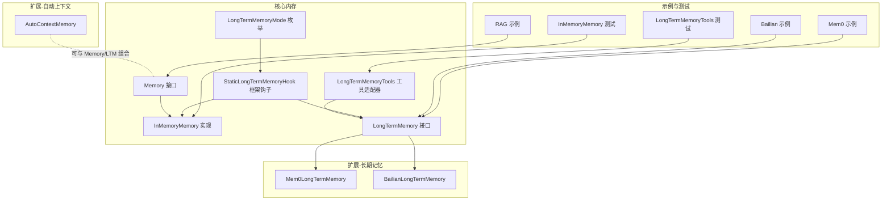
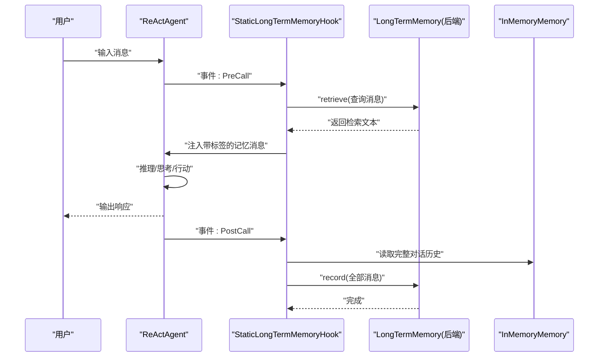
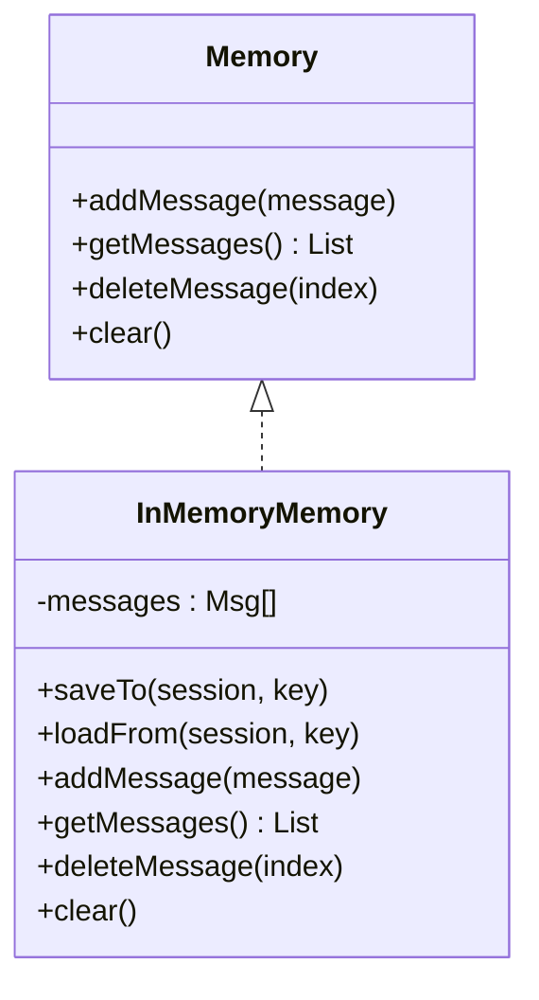
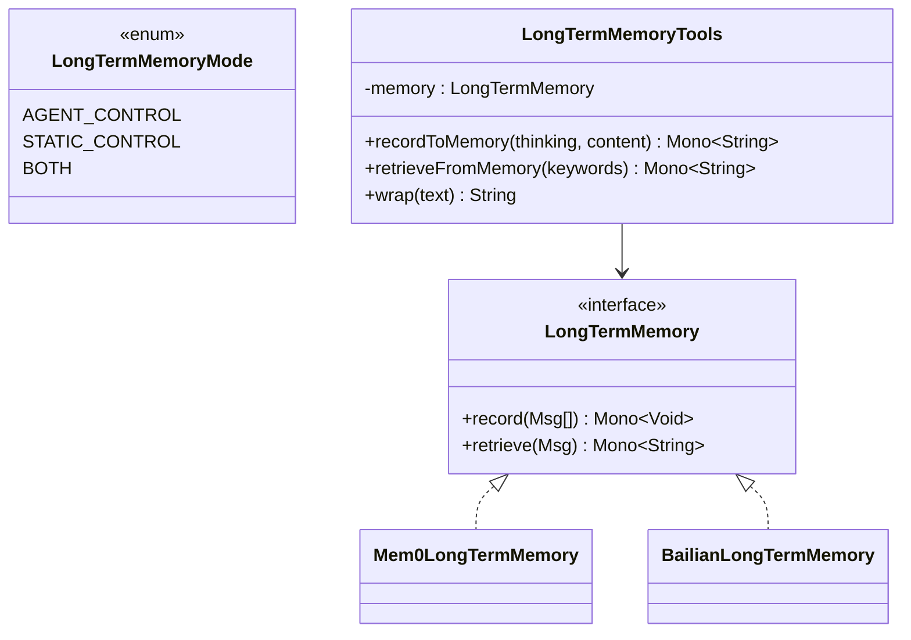
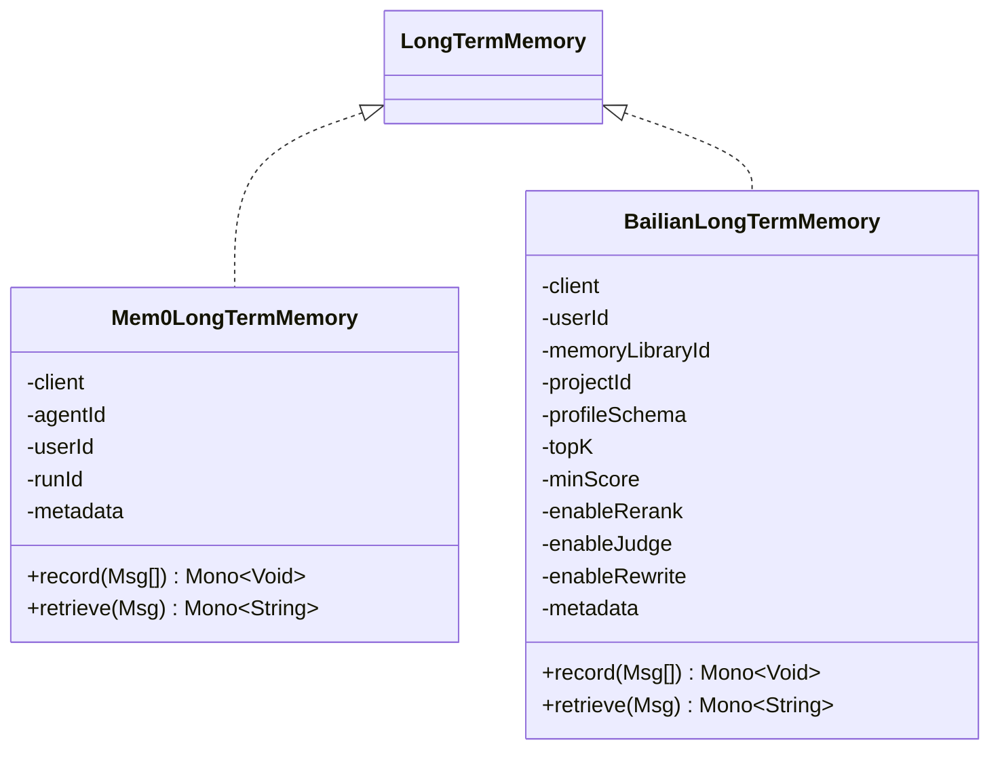
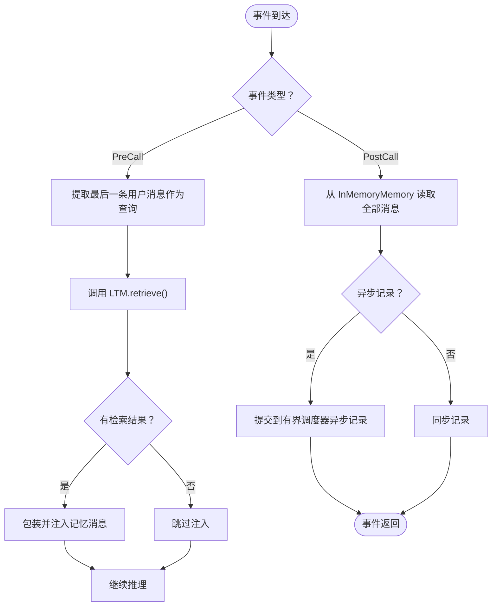
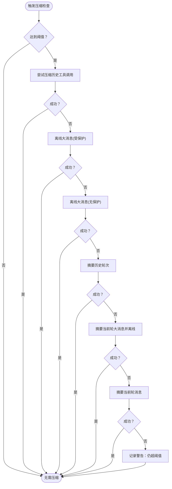
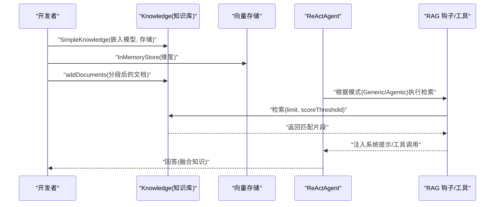
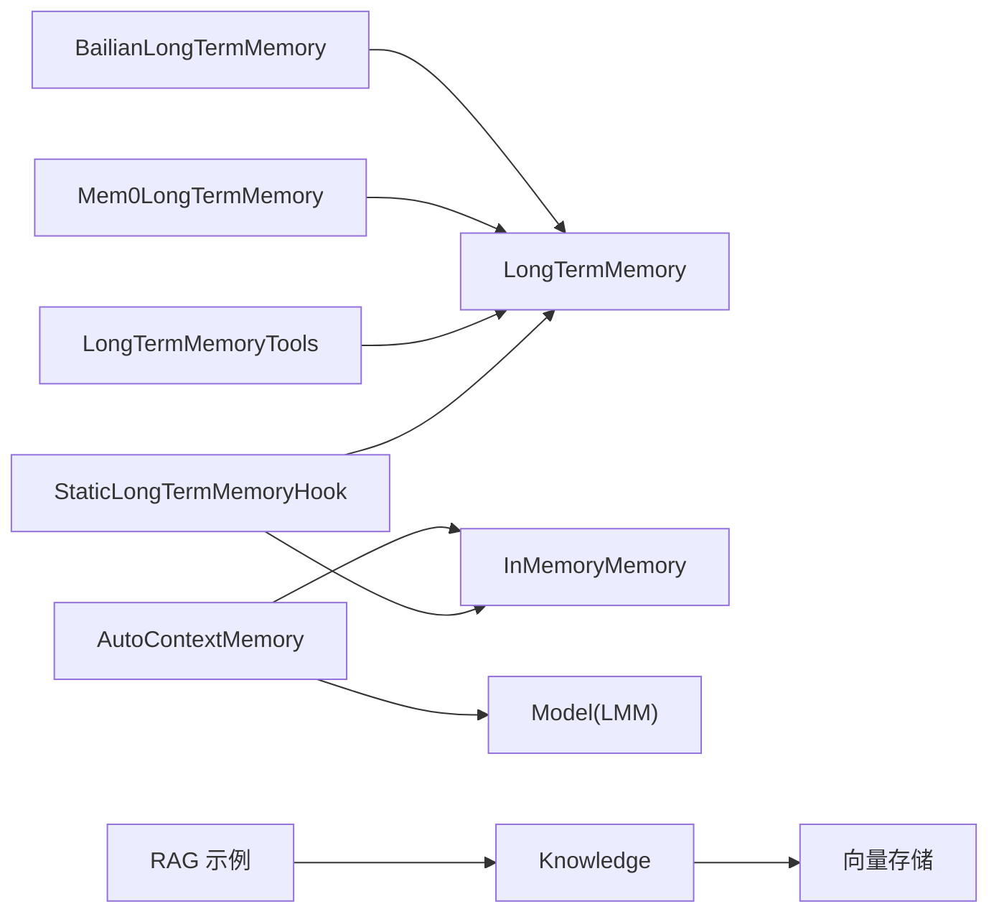

# 内存管理

<cite>
**本文引用的文件**
- [InMemoryMemory.java](file://agentscope-core/src/main/java/io/agentscope/core/memory/InMemoryMemory.java)
- [LongTermMemory.java](file://agentscope-core/src/main/java/io/agentscope/core/memory/LongTermMemory.java)
- [LongTermMemoryMode.java](file://agentscope-core/src/main/java/io/agentscope/core/memory/LongTermMemoryMode.java)
- [LongTermMemoryTools.java](file://agentscope-core/src/main/java/io/agentscope/core/memory/LongTermMemoryTools.java)
- [StaticLongTermMemoryHook.java](file://agentscope-core/src/main/java/io/agentscope/core/memory/StaticLongTermMemoryHook.java)
- [Memory.java](file://agentscope-core/src/main/java/io/agentscope/core/memory/Memory.java)
- [AutoContextMemory.java](file://agentscope-extensions/agentscope-extensions-autocontext-memory/src/main/java/io/agentscope/core/memory/autocontext/AutoContextMemory.java)
- [Mem0LongTermMemory.java](file://agentscope-extensions/agentscope-extensions-mem0/src/main/java/io/agentscope/core/memory/mem0/Mem0LongTermMemory.java)
- [BailianLongTermMemory.java](file://agentscope-extensions/agentscope-extensions-memory-bailian/src/main/java/io/agentscope/core/memory/bailian/BailianLongTermMemory.java)
- [RAGExample.java](file://agentscope-examples/advanced/src/main/java/io/agentscope/examples/advanced/RAGExample.java)
- [BailianMemoryExample.java](file://agentscope-examples/advanced/src/main/java/io/agentscope/examples/advanced/BailianMemoryExample.java)
- [Mem0Example.java](file://agentscope-examples/advanced/src/main/java/io/agentscope/examples/advanced/Mem0Example.java)
- [InMemoryMemoryTest.java](file://agentscope-core/src/test/java/io/agentscope/core/memory/InMemoryMemoryTest.java)
- [LongTermMemoryToolsTest.java](file://agentscope-core/src/test/java/io/agentscope/core/memory/LongTermMemoryToolsTest.java)
</cite>

## 目录
1. [简介](#简介)
2. [项目结构](#项目结构)
3. [核心组件](#核心组件)
4. [架构总览](#架构总览)
5. [详细组件分析](#详细组件分析)
6. [依赖关系分析](#依赖关系分析)
7. [性能考量](#性能考量)
8. [故障排查指南](#故障排查指南)
9. [结论](#结论)
10. [附录：配置与使用模式](#附录配置与使用模式)

## 简介
本文件系统性梳理 AgentScope Java 的内存管理体系，覆盖短期记忆（会话内）与长期记忆（跨会话持久化）的设计差异、实现原理、持久化机制、检索与性能优化，并给出与 RAG 系统的集成方式、最佳实践与企业级部署建议。读者可据此在不同场景下选择合适的内存策略，完成容量规划、性能调优与资源控制。

## 项目结构
围绕内存管理的关键模块分布于核心模块与扩展模块中：
- 核心接口与基础实现：Memory、InMemoryMemory、LongTermMemory、LongTermMemoryMode、LongTermMemoryTools、StaticLongTermMemoryHook
- 长期记忆后端扩展：Mem0LongTermMemory、BailianLongTermMemory
- 自动上下文压缩扩展：AutoContextMemory
- 示例与测试：RAG 示例、Bailian/Mem0 长期记忆示例、相关单元测试

图示来源
- [Memory.java:29-62](file://agentscope-core/src/main/java/io/agentscope/core/memory/Memory.java#L29-L62)
- [InMemoryMemory.java:33-127](file://agentscope-core/src/main/java/io/agentscope/core/memory/InMemoryMemory.java#L33-L127)
- [LongTermMemory.java:67-107](file://agentscope-core/src/main/java/io/agentscope/core/memory/LongTermMemory.java#L67-L107)
- [LongTermMemoryMode.java:52-68](file://agentscope-core/src/main/java/io/agentscope/core/memory/LongTermMemoryMode.java#L52-L68)
- [LongTermMemoryTools.java:65-213](file://agentscope-core/src/main/java/io/agentscope/core/memory/LongTermMemoryTools.java#L65-L213)
- [StaticLongTermMemoryHook.java:75-297](file://agentscope-core/src/main/java/io/agentscope/core/memory/StaticLongTermMemoryHook.java#L75-L297)
- [Mem0LongTermMemory.java:113-439](file://agentscope-extensions/agentscope-extensions-mem0/src/main/java/io/agentscope/core/memory/mem0/Mem0LongTermMemory.java#L113-L439)
- [BailianLongTermMemory.java:77-491](file://agentscope-extensions/agentscope-extensions-memory-bailian/src/main/java/io/agentscope/core/memory/bailian/BailianLongTermMemory.java#L77-L491)
- [AutoContextMemory.java:81-2146](file://agentscope-extensions/agentscope-extensions-autocontext-memory/src/main/java/io/agentscope/core/memory/autocontext/AutoContextMemory.java#L81-L2146)
- [RAGExample.java:41-232](file://agentscope-examples/advanced/src/main/java/io/agentscope/examples/advanced/RAGExample.java#L41-L232)
- [BailianMemoryExample.java:56-133](file://agentscope-examples/advanced/src/main/java/io/agentscope/examples/advanced/BailianMemoryExample.java#L56-L133)
- [Mem0Example.java:31-100](file://agentscope-examples/advanced/src/main/java/io/agentscope/examples/advanced/Mem0Example.java#L31-L100)

章节来源
- [Memory.java:29-62](file://agentscope-core/src/main/java/io/agentscope/core/memory/Memory.java#L29-L62)
- [InMemoryMemory.java:33-127](file://agentscope-core/src/main/java/io/agentscope/core/memory/InMemoryMemory.java#L33-L127)
- [LongTermMemory.java:67-107](file://agentscope-core/src/main/java/io/agentscope/core/memory/LongTermMemory.java#L67-L107)
- [LongTermMemoryMode.java:52-68](file://agentscope-core/src/main/java/io/agentscope/core/memory/LongTermMemoryMode.java#L52-L68)
- [LongTermMemoryTools.java:65-213](file://agentscope-core/src/main/java/io/agentscope/core/memory/LongTermMemoryTools.java#L65-L213)
- [StaticLongTermMemoryHook.java:75-297](file://agentscope-core/src/main/java/io/agentscope/core/memory/StaticLongTermMemoryHook.java#L75-L297)
- [Mem0LongTermMemory.java:113-439](file://agentscope-extensions/agentscope-extensions-mem0/src/main/java/io/agentscope/core/memory/mem0/Mem0LongTermMemory.java#L113-L439)
- [BailianLongTermMemory.java:77-491](file://agentscope-extensions/agentscope-extensions-memory-bailian/src/main/java/io/agentscope/core/memory/bailian/BailianLongTermMemory.java#L77-L491)
- [AutoContextMemory.java:81-2146](file://agentscope-extensions/agentscope-extensions-autocontext-memory/src/main/java/io/agentscope/core/memory/autocontext/AutoContextMemory.java#L81-L2146)
- [RAGExample.java:41-232](file://agentscope-examples/advanced/src/main/java/io/agentscope/examples/advanced/RAGExample.java#L41-L232)
- [BailianMemoryExample.java:56-133](file://agentscope-examples/advanced/src/main/java/io/agentscope/examples/advanced/BailianMemoryExample.java#L56-L133)
- [Mem0Example.java:31-100](file://agentscope-examples/advanced/src/main/java/io/agentscope/examples/advanced/Mem0Example.java#L31-L100)

## 核心组件
- Memory 接口：定义短期记忆的统一能力（添加、读取、删除、清空），并继承状态模块接口以支持会话持久化。
- InMemoryMemory：基于线程安全列表的短期内存实现，支持保存/加载到会话。
- LongTermMemory 接口：定义长期记忆的异步记录与检索能力，面向框架集成与代理工具两种使用方式。
- LongTermMemoryMode：控制长期记忆的集成模式（代理控制、框架静态控制、两者结合）。
- LongTermMemoryTools：将核心长期记忆 API 适配为代理可调用的工具函数。
- StaticLongTermMemoryHook：框架钩子，按优先级在推理前注入检索结果、在回复后记录对话。
- AutoContextMemory：自动上下文压缩与离线存储扩展，多策略降低上下文窗口压力。
- Mem0LongTermMemory / BailianLongTermMemory：基于外部服务的长期记忆实现，提供向量检索与 LLM 提取。

章节来源
- [Memory.java:29-62](file://agentscope-core/src/main/java/io/agentscope/core/memory/Memory.java#L29-L62)
- [InMemoryMemory.java:33-127](file://agentscope-core/src/main/java/io/agentscope/core/memory/InMemoryMemory.java#L33-L127)
- [LongTermMemory.java:67-107](file://agentscope-core/src/main/java/io/agentscope/core/memory/LongTermMemory.java#L67-L107)
- [LongTermMemoryMode.java:52-68](file://agentscope-core/src/main/java/io/agentscope/core/memory/LongTermMemoryMode.java#L52-L68)
- [LongTermMemoryTools.java:65-213](file://agentscope-core/src/main/java/io/agentscope/core/memory/LongTermMemoryTools.java#L65-L213)
- [StaticLongTermMemoryHook.java:75-297](file://agentscope-core/src/main/java/io/agentscope/core/memory/StaticLongTermMemoryHook.java#L75-L297)
- [AutoContextMemory.java:81-2146](file://agentscope-extensions/agentscope-extensions-autocontext-memory/src/main/java/io/agentscope/core/memory/autocontext/AutoContextMemory.java#L81-L2146)
- [Mem0LongTermMemory.java:113-439](file://agentscope-extensions/agentscope-extensions-mem0/src/main/java/io/agentscope/core/memory/mem0/Mem0LongTermMemory.java#L113-L439)
- [BailianLongTermMemory.java:77-491](file://agentscope-extensions/agentscope-extensions-memory-bailian/src/main/java/io/agentscope/core/memory/bailian/BailianLongTermMemory.java#L77-L491)

## 架构总览
短期记忆与长期记忆在 Agent 生命周期内的交互如下：

图示来源
- [StaticLongTermMemoryHook.java:121-259](file://agentscope-core/src/main/java/io/agentscope/core/memory/StaticLongTermMemoryHook.java#L121-L259)
- [LongTermMemory.java:67-107](file://agentscope-core/src/main/java/io/agentscope/core/memory/LongTermMemory.java#L67-L107)
- [InMemoryMemory.java:33-127](file://agentscope-core/src/main/java/io/agentscope/core/memory/InMemoryMemory.java#L33-L127)

## 详细组件分析

### 短期记忆：InMemoryMemory
- 设计要点
  - 使用线程安全列表存储消息，保证并发读写安全。
  - 实现状态模块接口，通过会话键持久化/恢复消息列表。
  - 对外暴露添加、读取、删除、清空等操作，过滤空值并返回新副本。
- 内存管理与清理
  - 清空操作清空内部列表；删除索引越界时为无操作，避免异常。
  - 适合单次会话或短生命周期上下文，不跨进程/节点持久化。
- 适用场景
  - 临时对话上下文、调试与快速原型、低延迟交互。
- 配置与使用
  - 在代理构建器中注入 InMemoryMemory 即可启用。
  - 结合会话模块进行持久化（如 JSON/内存会话）。

图示来源
- [Memory.java:29-62](file://agentscope-core/src/main/java/io/agentscope/core/memory/Memory.java#L29-L62)
- [InMemoryMemory.java:33-127](file://agentscope-core/src/main/java/io/agentscope/core/memory/InMemoryMemory.java#L33-L127)

章节来源
- [InMemoryMemory.java:33-127](file://agentscope-core/src/main/java/io/agentscope/core/memory/InMemoryMemory.java#L33-L127)
- [InMemoryMemoryTest.java:28-177](file://agentscope-core/src/test/java/io/agentscope/core/memory/InMemoryMemoryTest.java#L28-L177)

### 长期记忆：接口与模式
- LongTermMemory 接口
  - record(List<Msg>): 异步记录消息，抽取“可记忆”信息并持久化。
  - retrieve(Msg): 基于查询语义检索相关记忆，返回文本供注入系统提示。
- LongTermMemoryMode
  - AGENT_CONTROL：代理主动调用工具记录/检索。
  - STATIC_CONTROL：框架自动在推理前后执行记录/检索。
  - BOTH：默认推荐，兼顾自动与代理控制。
- 工具适配器 LongTermMemoryTools
  - 将 record/retrieve 包装为代理可用的工具函数，自动构造消息与错误处理。
  - 提供检索结果包装，便于注入到系统提示中。

图示来源
- [LongTermMemory.java:67-107](file://agentscope-core/src/main/java/io/agentscope/core/memory/LongTermMemory.java#L67-L107)
- [LongTermMemoryMode.java:52-68](file://agentscope-core/src/main/java/io/agentscope/core/memory/LongTermMemoryMode.java#L52-L68)
- [LongTermMemoryTools.java:65-213](file://agentscope-core/src/main/java/io/agentscope/core/memory/LongTermMemoryTools.java#L65-L213)
- [Mem0LongTermMemory.java:113-439](file://agentscope-extensions/agentscope-extensions-mem0/src/main/java/io/agentscope/core/memory/mem0/Mem0LongTermMemory.java#L113-L439)
- [BailianLongTermMemory.java:77-491](file://agentscope-extensions/agentscope-extensions-memory-bailian/src/main/java/io/agentscope/core/memory/bailian/BailianLongTermMemory.java#L77-L491)

章节来源
- [LongTermMemory.java:67-107](file://agentscope-core/src/main/java/io/agentscope/core/memory/LongTermMemory.java#L67-L107)
- [LongTermMemoryMode.java:52-68](file://agentscope-core/src/main/java/io/agentscope/core/memory/LongTermMemoryMode.java#L52-L68)
- [LongTermMemoryTools.java:65-213](file://agentscope-core/src/main/java/io/agentscope/core/memory/LongTermMemoryTools.java#L65-L213)
- [LongTermMemoryToolsTest.java:40-339](file://agentscope-core/src/test/java/io/agentscope/core/memory/LongTermMemoryToolsTest.java#L40-L339)

### 长期记忆后端：Mem0 与 Bailian
- Mem0LongTermMemory
  - 使用向量嵌入与 LLM 推理提取记忆，支持多租户元数据隔离（agentId、userId、runId）。
  - 记录时过滤空内容与压缩标记；检索时返回合并文本。
  - 支持自定义元数据用于存储与检索过滤。
- BailianLongTermMemory
  - 阿里云 Bailian 内存库集成，支持 topK、最小相似度、重排序/判断/改写等参数。
  - 记录时过滤 TOOL/ SYSTEM 与 ToolUseBlock 的 ASSISTANT 消息，避免冗余。
  - 支持库 ID、项目 ID、Profile Schema 等组织维度。

图示来源
- [Mem0LongTermMemory.java:113-439](file://agentscope-extensions/agentscope-extensions-mem0/src/main/java/io/agentscope/core/memory/mem0/Mem0LongTermMemory.java#L113-L439)
- [BailianLongTermMemory.java:77-491](file://agentscope-extensions/agentscope-extensions-memory-bailian/src/main/java/io/agentscope/core/memory/bailian/BailianLongTermMemory.java#L77-L491)

章节来源
- [Mem0LongTermMemory.java:113-439](file://agentscope-extensions/agentscope-extensions-mem0/src/main/java/io/agentscope/core/memory/mem0/Mem0LongTermMemory.java#L113-L439)
- [BailianLongTermMemory.java:77-491](file://agentscope-extensions/agentscope-extensions-memory-bailian/src/main/java/io/agentscope/core/memory/bailian/BailianLongTermMemory.java#L77-L491)

### 长期记忆钩子：StaticLongTermMemoryHook
- 职责
  - 在推理前检索并注入记忆（高优先级），在回复后记录对话。
  - 支持同步/异步记录，异步路径使用有界弹性调度器，限制队列长度与并发。
- 错误处理
  - 检索/记录失败仅记录告警，不影响主流程。
- 适用模式
  - STATIC_CONTROL 与 BOTH 模式下由框架自动注册。

图示来源
- [StaticLongTermMemoryHook.java:121-259](file://agentscope-core/src/main/java/io/agentscope/core/memory/StaticLongTermMemoryHook.java#L121-L259)

章节来源
- [StaticLongTermMemoryHook.java:75-297](file://agentscope-core/src/main/java/io/agentscope/core/memory/StaticLongTermMemoryHook.java#L75-L297)

### 自动上下文压缩：AutoContextMemory
- 目标
  - 当消息数量或 token 超阈值时，自动应用多级压缩策略，减少上下文大小。
- 存储双轨
  - workingMemoryStorage：压缩后的消息集合，用于实际对话。
  - originalMemoryStorage：原始未压缩历史，用于离线存储与回放。
- 压缩策略（顺序）
  1) 压缩历史工具调用
  2) 大消息离线（受 lastKeep 保护）
  3) 大消息离线（不受保护）
  4) 历史轮次摘要
  5) 当前轮大消息摘要+离线
  6) 当前轮消息摘要
- 关键能力
  - 保留工具调用接口，维持推理完整性。
  - 与 LLM 结合生成摘要，记录压缩事件以便审计与优化。

图示来源
- [AutoContextMemory.java:184-305](file://agentscope-extensions/agentscope-extensions-autocontext-memory/src/main/java/io/agentscope/core/memory/autocontext/AutoContextMemory.java#L184-L305)

章节来源
- [AutoContextMemory.java:81-2146](file://agentscope-extensions/agentscope-extensions-autocontext-memory/src/main/java/io/agentscope/core/memory/autocontext/AutoContextMemory.java#L81-L2146)

### RAG 集成与知识库管理
- 知识库与检索
  - 使用 Knowledge（SimpleKnowledge）与向量存储（InMemoryStore）构建知识库。
  - 通过检索配置（limit、scoreThreshold）控制召回质量与数量。
- 两种模式
  - Generic：框架自动在推理前注入检索到的知识。
  - Agentic：代理通过工具自行决定何时检索。
- 示例要点
  - 创建嵌入模型与向量存储，分段读取文档并入库。
  - 构建 ReActAgent 并设置知识库与 RAG 模式。

图示来源
- [RAGExample.java:41-232](file://agentscope-examples/advanced/src/main/java/io/agentscope/examples/advanced/RAGExample.java#L41-L232)

章节来源
- [RAGExample.java:41-232](file://agentscope-examples/advanced/src/main/java/io/agentscope/examples/advanced/RAGExample.java#L41-L232)

## 依赖关系分析
- 组件耦合
  - StaticLongTermMemoryHook 依赖 LongTermMemory 与 Memory，负责在事件链中插入检索与记录。
  - LongTermMemoryTools 依赖 LongTermMemory，提供代理工具接口。
  - AutoContextMemory 依赖 Model 进行摘要生成，同时与 Memory 共同维护双存储。
- 外部依赖
  - Mem0/Bailian 后端依赖各自 HTTP 客户端与 API。
  - RAG 示例依赖嵌入模型与向量存储实现。

图示来源
- [StaticLongTermMemoryHook.java:75-297](file://agentscope-core/src/main/java/io/agentscope/core/memory/StaticLongTermMemoryHook.java#L75-L297)
- [LongTermMemoryTools.java:65-213](file://agentscope-core/src/main/java/io/agentscope/core/memory/LongTermMemoryTools.java#L65-L213)
- [AutoContextMemory.java:81-2146](file://agentscope-extensions/agentscope-extensions-autocontext-memory/src/main/java/io/agentscope/core/memory/autocontext/AutoContextMemory.java#L81-L2146)
- [Mem0LongTermMemory.java:113-439](file://agentscope-extensions/agentscope-extensions-mem0/src/main/java/io/agentscope/core/memory/mem0/Mem0LongTermMemory.java#L113-L439)
- [BailianLongTermMemory.java:77-491](file://agentscope-extensions/agentscope-extensions-memory-bailian/src/main/java/io/agentscope/core/memory/bailian/BailianLongTermMemory.java#L77-L491)
- [RAGExample.java:41-232](file://agentscope-examples/advanced/src/main/java/io/agentscope/examples/advanced/RAGExample.java#L41-L232)

## 性能考量
- 短期记忆
  - InMemoryMemory 使用线程安全列表，读写开销低；注意消息体量增长导致的序列化/传输成本。
  - 建议配合 AutoContextMemory 控制上下文规模，避免超出模型上下文窗口。
- 长期记忆
  - Mem0/Bailian 采用向量检索与 LLM 抽取，检索延迟取决于后端性能与索引规模。
  - 异步记录可降低响应阻塞，但需关注有界调度器饱和与丢弃策略。
- RAG
  - 向量检索的 topK 与阈值直接影响召回质量与延迟，应结合业务调优。
  - 文档分段策略影响检索精度，建议按主题/段落切分并保留上下文重叠。

## 故障排查指南
- 长期记忆检索/记录失败
  - 检查后端连接、鉴权与超时配置；查看钩子日志告警。
  - 确认消息内容非空且未被过滤（如压缩标记、空文本、不支持角色）。
- 工具调用异常
  - LongTermMemoryTools 对空输入与错误进行兜底返回，确认代理工具注册与模式配置正确。
- 上下文溢出
  - 启用 AutoContextMemory 并调整阈值与策略；必要时降低每轮消息复杂度。

章节来源
- [StaticLongTermMemoryHook.java:188-258](file://agentscope-core/src/main/java/io/agentscope/core/memory/StaticLongTermMemoryHook.java#L188-L258)
- [LongTermMemoryToolsTest.java:168-261](file://agentscope-core/src/test/java/io/agentscope/core/memory/LongTermMemoryToolsTest.java#L168-L261)

## 结论
AgentScope Java 的内存体系通过短期记忆与长期记忆的清晰分离，实现了“即时对话”与“跨会话经验”的平衡。结合自动上下文压缩与 RAG 能力，可在保证响应质量的同时控制上下文成本。企业级部署建议：
- 选择合适模式：默认使用 BOTH，按需开启 AGENT_CONTROL。
- 后端选型：根据合规与性能需求选择 Mem0 或 Bailian。
- 资源控制：合理设置异步记录队列与阈值，监控检索延迟与吞吐。
- 监控与可观测：记录压缩事件、检索命中率与错误率，持续优化配置。

## 附录：配置与使用模式

- 短期记忆配置
  - 在代理中注入 InMemoryMemory，结合会话模块进行持久化。
  - 参考：[InMemoryMemory.java:33-127](file://agentscope-core/src/main/java/io/agentscope/core/memory/InMemoryMemory.java#L33-L127)
- 长期记忆模式
  - AGENT_CONTROL：代理主动记录/检索。
  - STATIC_CONTROL：框架自动处理。
  - BOTH：推荐默认。
  - 参考：[LongTermMemoryMode.java:52-68](file://agentscope-core/src/main/java/io/agentscope/core/memory/LongTermMemoryMode.java#L52-L68)
- 工具调用
  - 使用 LongTermMemoryTools 的 recordToMemory 与 retrieveFromMemory。
  - 参考：[LongTermMemoryTools.java:65-213](file://agentscope-core/src/main/java/io/agentscope/core/memory/LongTermMemoryTools.java#L65-L213)，[LongTermMemoryToolsTest.java:40-339](file://agentscope-core/src/test/java/io/agentscope/core/memory/LongTermMemoryToolsTest.java#L40-L339)
- 钩子集成
  - 在 STATIC_CONTROL/BOTH 模式下自动注册 StaticLongTermMemoryHook。
  - 参考：[StaticLongTermMemoryHook.java:75-297](file://agentscope-core/src/main/java/io/agentscope/core/memory/StaticLongTermMemoryHook.java#L75-L297)
- Mem0 长期记忆
  - 设置 agentName、userId、apiBaseUrl、apiKey、metadata 等。
  - 参考：[Mem0Example.java:31-100](file://agentscope-examples/advanced/src/main/java/io/agentscope/examples/advanced/Mem0Example.java#L31-L100)，[Mem0LongTermMemory.java:113-439](file://agentscope-extensions/agentscope-extensions-mem0/src/main/java/io/agentscope/core/memory/mem0/Mem0LongTermMemory.java#L113-L439)
- Bailian 长期记忆
  - 设置 apiKey、userId、memoryLibraryId、projectId、profileSchema、topK、minScore 等。
  - 参考：[BailianMemoryExample.java:56-133](file://agentscope-examples/advanced/src/main/java/io/agentscope/examples/advanced/BailianMemoryExample.java#L56-L133)，[BailianLongTermMemory.java:77-491](file://agentscope-extensions/agentscope-extensions-memory-bailian/src/main/java/io/agentscope/core/memory/bailian/BailianLongTermMemory.java#L77-L491)
- RAG 集成
  - 构建 Knowledge 与向量存储，设置检索配置，选择 Generic/Agentic 模式。
  - 参考：[RAGExample.java:41-232](file://agentscope-examples/advanced/src/main/java/io/agentscope/examples/advanced/RAGExample.java#L41-L232)