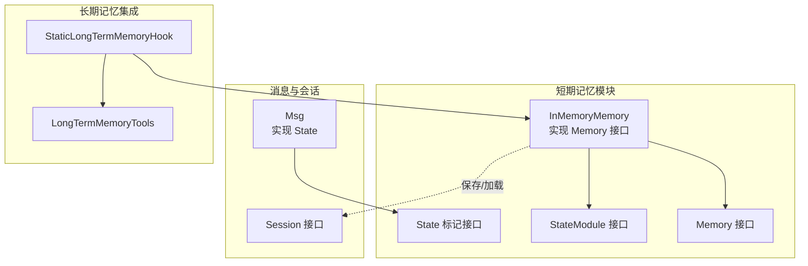
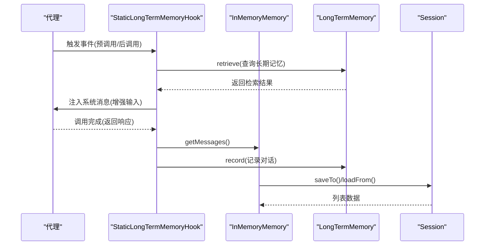
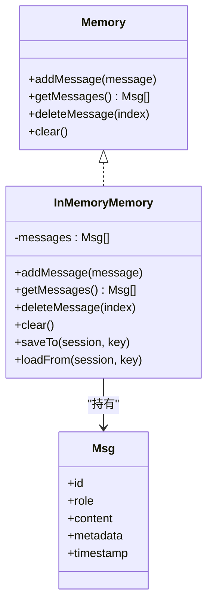
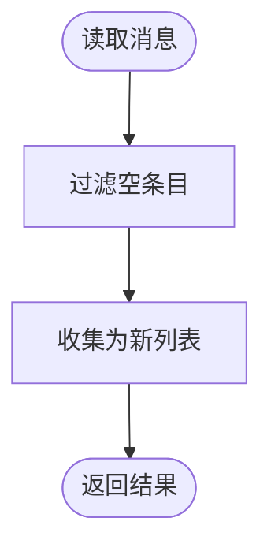
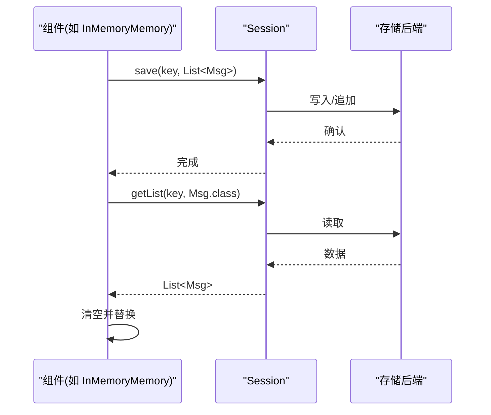
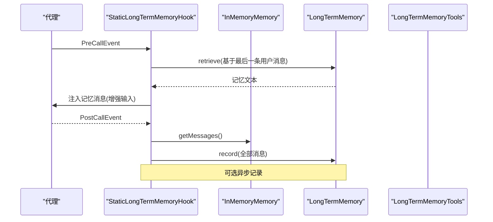
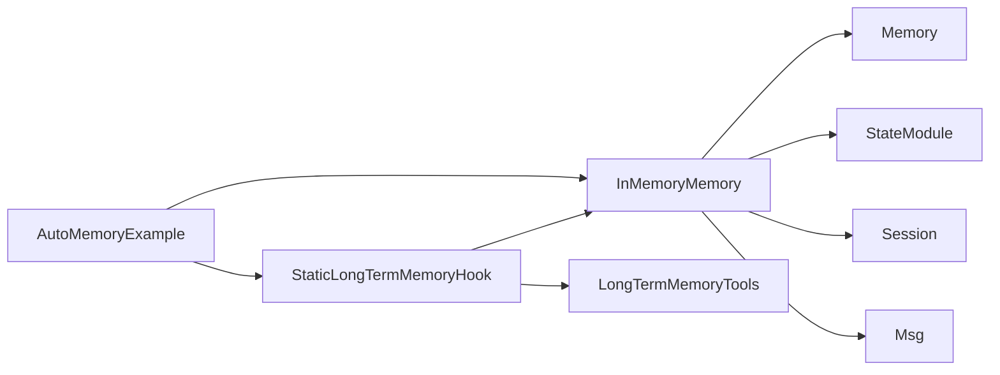

# 短期记忆

<cite>
**本文引用的文件**
- [InMemoryMemory.java](file://agentscope-core/src/main/java/io/agentscope/core/memory/InMemoryMemory.java)
- [Memory.java](file://agentscope-core/src/main/java/io/agentscope/core/memory/Memory.java)
- [Msg.java](file://agentscope-core/src/main/java/io/agentscope/core/message/Msg.java)
- [State.java](file://agentscope-core/src/main/java/io/agentscope/core/state/State.java)
- [StateModule.java](file://agentscope-core/src/main/java/io/agentscope/core/state/StateModule.java)
- [Session.java](file://agentscope-core/src/main/java/io/agentscope/core/session/Session.java)
- [StaticLongTermMemoryHook.java](file://agentscope-core/src/main/java/io/agentscope/core/memory/StaticLongTermMemoryHook.java)
- [LongTermMemoryTools.java](file://agentscope-core/src/main/java/io/agentscope/core/memory/LongTermMemoryTools.java)
- [InMemoryMemoryTest.java](file://agentscope-core/src/test/java/io/agentscope/core/memory/InMemoryMemoryTest.java)
- [AutoMemoryExample.java](file://agentscope-examples/advanced/src/main/java/io/agentscope/examples/advanced/AutoMemoryExample.java)
</cite>

## 目录
1. [简介](#简介)
2. [项目结构](#项目结构)
3. [核心组件](#核心组件)
4. [架构总览](#架构总览)
5. [详细组件分析](#详细组件分析)
6. [依赖关系分析](#依赖关系分析)
7. [性能考量](#性能考量)
8. [故障排查指南](#故障排查指南)
9. [结论](#结论)
10. [附录](#附录)

## 简介
本文件面向 AgentScope Java 的短期记忆子系统，聚焦于 InMemoryMemory 的实现原理、线程安全机制、内存管理策略、消息存储结构、与会话系统的集成、状态序列化/反序列化流程，以及最佳实践（容量控制、性能优化、内存泄漏防护）。同时给出配置示例与多线程安全使用指南，帮助读者在复杂并发场景下正确、高效地使用短期记忆。

## 项目结构
短期记忆位于 agentscope-core 模块的 memory 包中，围绕 Memory 接口与 InMemoryMemory 实现展开，并通过 Session 与 StateModule 提供状态持久化能力；消息类型 Msg 实现 State 接口，支持序列化到会话存储。

图表来源
- [InMemoryMemory.java:1-128](file://agentscope-core/src/main/java/io/agentscope/core/memory/InMemoryMemory.java#L1-L128)
- [Memory.java:1-63](file://agentscope-core/src/main/java/io/agentscope/core/memory/Memory.java#L1-L63)
- [StateModule.java:1-121](file://agentscope-core/src/main/java/io/agentscope/core/state/StateModule.java#L1-L121)
- [State.java:1-48](file://agentscope-core/src/main/java/io/agentscope/core/state/State.java#L1-L48)
- [Session.java:1-146](file://agentscope-core/src/main/java/io/agentscope/core/session/Session.java#L1-L146)
- [Msg.java:1-656](file://agentscope-core/src/main/java/io/agentscope/core/message/Msg.java#L1-L656)
- [StaticLongTermMemoryHook.java:1-298](file://agentscope-core/src/main/java/io/agentscope/core/memory/StaticLongTermMemoryHook.java#L1-L298)
- [LongTermMemoryTools.java:1-214](file://agentscope-core/src/main/java/io/agentscope/core/memory/LongTermMemoryTools.java#L1-L214)

章节来源
- [InMemoryMemory.java:1-128](file://agentscope-core/src/main/java/io/agentscope/core/memory/InMemoryMemory.java#L1-L128)
- [Memory.java:1-63](file://agentscope-core/src/main/java/io/agentscope/core/memory/Memory.java#L1-L63)
- [StateModule.java:1-121](file://agentscope-core/src/main/java/io/agentscope/core/state/StateModule.java#L1-L121)
- [State.java:1-48](file://agentscope-core/src/main/java/io/agentscope/core/state/State.java#L1-L48)
- [Session.java:1-146](file://agentscope-core/src/main/java/io/agentscope/core/session/Session.java#L1-L146)
- [Msg.java:1-656](file://agentscope-core/src/main/java/io/agentscope/core/message/Msg.java#L1-L656)

## 核心组件
- InMemoryMemory：基于线程安全的 CopyOnWriteArrayList 实现的短期记忆，提供消息增删查清与状态持久化。
- Memory 接口：定义短期记忆的标准操作（添加、读取、删除、清空）。
- Msg：消息载体，实现 State，可直接参与序列化/反序列化。
- StateModule/State：状态模块与标记接口，统一状态持久化契约。
- Session：会话存储接口，负责状态的保存与读取。
- StaticLongTermMemoryHook：框架级钩子，自动从长期记忆检索上下文并记录对话。
- LongTermMemoryTools：将长期记忆能力以工具形式暴露给代理调用。

章节来源
- [InMemoryMemory.java:33-127](file://agentscope-core/src/main/java/io/agentscope/core/memory/InMemoryMemory.java#L33-L127)
- [Memory.java:29-62](file://agentscope-core/src/main/java/io/agentscope/core/memory/Memory.java#L29-L62)
- [Msg.java:53-110](file://agentscope-core/src/main/java/io/agentscope/core/message/Msg.java#L53-L110)
- [StateModule.java:45-120](file://agentscope-core/src/main/java/io/agentscope/core/state/StateModule.java#L45-L120)
- [State.java:18-47](file://agentscope-core/src/main/java/io/agentscope/core/state/State.java#L18-L47)
- [Session.java:53-145](file://agentscope-core/src/main/java/io/agentscope/core/session/Session.java#L53-L145)
- [StaticLongTermMemoryHook.java:75-297](file://agentscope-core/src/main/java/io/agentscope/core/memory/StaticLongTermMemoryHook.java#L75-L297)
- [LongTermMemoryTools.java:65-213](file://agentscope-core/src/main/java/io/agentscope/core/memory/LongTermMemoryTools.java#L65-L213)

## 架构总览
短期记忆在框架中的位置如下：

图表来源
- [StaticLongTermMemoryHook.java:121-259](file://agentscope-core/src/main/java/io/agentscope/core/memory/StaticLongTermMemoryHook.java#L121-L259)
- [InMemoryMemory.java:57-74](file://agentscope-core/src/main/java/io/agentscope/core/memory/InMemoryMemory.java#L57-L74)
- [Session.java:53-104](file://agentscope-core/src/main/java/io/agentscope/core/session/Session.java#L53-L104)

## 详细组件分析

### InMemoryMemory 实现与线程安全
- 存储结构：内部使用 CopyOnWriteArrayList 保存消息列表，读多写少场景下提供无锁遍历与强一致性快照。
- 线程安全：
  - 添加/删除/清空等修改操作在集合层面是线程安全的。
  - 读取时通过流式过滤与收集生成新列表，避免并发修改异常。
- 内存管理：
  - 不进行主动窗口裁剪或容量限制，适合短对话或外部控制策略。
  - 清理建议：结合业务逻辑定期 clear 或按需删除索引元素。
- 状态持久化：
  - 保存键前缀固定，确保与会话存储键空间隔离。
  - 保存全量列表，由具体 Session 实现决定增量追加或全量替换。

图表来源
- [Memory.java:29-62](file://agentscope-core/src/main/java/io/agentscope/core/memory/Memory.java#L29-L62)
- [InMemoryMemory.java:33-127](file://agentscope-core/src/main/java/io/agentscope/core/memory/InMemoryMemory.java#L33-L127)
- [Msg.java:53-110](file://agentscope-core/src/main/java/io/agentscope/core/message/Msg.java#L53-L110)

章节来源
- [InMemoryMemory.java:35-126](file://agentscope-core/src/main/java/io/agentscope/core/memory/InMemoryMemory.java#L35-L126)
- [InMemoryMemoryTest.java:37-175](file://agentscope-core/src/test/java/io/agentscope/core/memory/InMemoryMemoryTest.java#L37-L175)

### 消息存储结构与过滤机制
- Msg 作为状态对象，具备不可变内容块列表与元数据映射，支持序列化到会话。
- InMemoryMemory 在读取时过滤 null 条目，保证返回列表非空且无脏数据。
- 删除操作对越界索引采用无操作策略，避免异常传播。

图表来源
- [InMemoryMemory.java:98-101](file://agentscope-core/src/main/java/io/agentscope/core/memory/InMemoryMemory.java#L98-L101)
- [Msg.java:94-109](file://agentscope-core/src/main/java/io/agentscope/core/message/Msg.java#L94-L109)

章节来源
- [InMemoryMemory.java:98-101](file://agentscope-core/src/main/java/io/agentscope/core/memory/InMemoryMemory.java#L98-L101)
- [Msg.java:94-109](file://agentscope-core/src/main/java/io/agentscope/core/message/Msg.java#L94-L109)

### CopyOnWriteArrayList 的选择与性能权衡
- 优点：
  - 读操作零锁，适合高并发只读场景（如 getMessages）。
  - 遍历稳定，不会抛出并发修改异常。
- 成本：
  - 写操作（add/remove/clear）会复制底层数组，频繁写入会产生额外内存与拷贝开销。
- 建议：
  - 短期记忆通常用于会话内上下文，消息量有限；若出现高频写入，可考虑外部限流或窗口化策略。

章节来源
- [InMemoryMemory.java:35](file://agentscope-core/src/main/java/io/agentscope/core/memory/InMemoryMemory.java#L35)
- [InMemoryMemory.java:86-126](file://agentscope-core/src/main/java/io/agentscope/core/memory/InMemoryMemory.java#L86-L126)

### 内存清理策略与容量控制
- 当前实现不内置容量上限或时间窗口清理。
- 建议：
  - 使用方在业务层设置最大消息数阈值，超过则删除最早条目或保留最近 N 条。
  - 对长会话采用分页/滑动窗口策略，避免无限增长。
  - 定期调用 clear() 清空历史，或 deleteMessage(index) 精确移除。

章节来源
- [InMemoryMemory.java:111-126](file://agentscope-core/src/main/java/io/agentscope/core/memory/InMemoryMemory.java#L111-L126)

### 与会话系统的集成与状态序列化/反序列化
- 保存：将完整消息列表转为普通 List 并保存至 Session，键名包含固定前缀。
- 加载：从 Session 读取列表并清空当前集合后整体替换。
- Session 行为差异：
  - JsonSession：增量追加（仅追加未持久化的新增项）。
  - InMemorySession：全量替换。

图表来源
- [InMemoryMemory.java:57-74](file://agentscope-core/src/main/java/io/agentscope/core/memory/InMemoryMemory.java#L57-L74)
- [Session.java:64-104](file://agentscope-core/src/main/java/io/agentscope/core/session/Session.java#L64-L104)

章节来源
- [InMemoryMemory.java:57-74](file://agentscope-core/src/main/java/io/agentscope/core/memory/InMemoryMemory.java#L57-L74)
- [Session.java:64-104](file://agentscope-core/src/main/java/io/agentscope/core/session/Session.java#L64-L104)

### 与长期记忆的集成流程
- 静态控制模式：框架在推理前自动检索长期记忆并注入系统消息，在调用后记录对话。
- 工具控制模式：通过 LongTermMemoryTools 将检索/记录能力以工具暴露给代理。

图表来源
- [StaticLongTermMemoryHook.java:121-259](file://agentscope-core/src/main/java/io/agentscope/core/memory/StaticLongTermMemoryHook.java#L121-L259)
- [LongTermMemoryTools.java:101-212](file://agentscope-core/src/main/java/io/agentscope/core/memory/LongTermMemoryTools.java#L101-L212)

章节来源
- [StaticLongTermMemoryHook.java:121-259](file://agentscope-core/src/main/java/io/agentscope/core/memory/StaticLongTermMemoryHook.java#L121-L259)
- [LongTermMemoryTools.java:101-212](file://agentscope-core/src/main/java/io/agentscope/core/memory/LongTermMemoryTools.java#L101-L212)

## 依赖关系分析
- InMemoryMemory 依赖：
  - Memory 接口：定义短期记忆行为。
  - StateModule/State：提供状态持久化能力。
  - Session：提供保存/读取列表的能力。
  - Msg：消息实体，实现 State。
- 集成点：
  - StaticLongTermMemoryHook 依赖 Memory 与 LongTermMemory，实现自动检索与记录。
  - AutoMemoryExample 展示了如何在真实应用中组合短期记忆、长期记忆与会话持久化。

图表来源
- [InMemoryMemory.java:33-127](file://agentscope-core/src/main/java/io/agentscope/core/memory/InMemoryMemory.java#L33-L127)
- [Memory.java:29-62](file://agentscope-core/src/main/java/io/agentscope/core/memory/Memory.java#L29-L62)
- [StateModule.java:45-120](file://agentscope-core/src/main/java/io/agentscope/core/state/StateModule.java#L45-L120)
- [Session.java:53-145](file://agentscope-core/src/main/java/io/agentscope/core/session/Session.java#L53-L145)
- [Msg.java:53-110](file://agentscope-core/src/main/java/io/agentscope/core/message/Msg.java#L53-L110)
- [StaticLongTermMemoryHook.java:75-297](file://agentscope-core/src/main/java/io/agentscope/core/memory/StaticLongTermMemoryHook.java#L75-L297)
- [LongTermMemoryTools.java:65-213](file://agentscope-core/src/main/java/io/agentscope/core/memory/LongTermMemoryTools.java#L65-L213)
- [AutoMemoryExample.java:45-142](file://agentscope-examples/advanced/src/main/java/io/agentscope/examples/advanced/AutoMemoryExample.java#L45-L142)

章节来源
- [InMemoryMemory.java:33-127](file://agentscope-core/src/main/java/io/agentscope/core/memory/InMemoryMemory.java#L33-L127)
- [StaticLongTermMemoryHook.java:75-297](file://agentscope-core/src/main/java/io/agentscope/core/memory/StaticLongTermMemoryHook.java#L75-L297)
- [AutoMemoryExample.java:45-142](file://agentscope-examples/advanced/src/main/java/io/agentscope/examples/advanced/AutoMemoryExample.java#L45-L142)

## 性能考量
- 读性能：CopyOnWriteArrayList 的读操作为 O(n) 遍历，但无锁，适合高并发只读。
- 写性能：写操作涉及数组复制，频繁 add/remove/clear 会带来显著成本。
- 序列化成本：Msg 实现 State，序列化/反序列化依赖会话存储实现；JsonSession 的增量写入可降低 IO 压力。
- 异步记录：StaticLongTermMemoryHook 支持异步记录，避免阻塞主响应链路，但需注意背压与饱和丢弃策略。

章节来源
- [InMemoryMemory.java:86-126](file://agentscope-core/src/main/java/io/agentscope/core/memory/InMemoryMemory.java#L86-L126)
- [Session.java:67-82](file://agentscope-core/src/main/java/io/agentscope/core/session/Session.java#L67-L82)
- [StaticLongTermMemoryHook.java:226-258](file://agentscope-core/src/main/java/io/agentscope/core/memory/StaticLongTermMemoryHook.java#L226-L258)

## 故障排查指南
- 空指针与越界：
  - getMessages 过滤 null，删除越界索引为无操作；若出现异常，检查上游是否传入 null 或非法索引。
- 并发问题：
  - 测试覆盖了并发添加/删除/清空场景；若出现数据丢失或顺序错乱，请确认外部是否在读取期间同时执行写操作。
- 持久化不生效：
  - 确认 Session 实现有无增量追加逻辑；JsonSession 仅追加新增项，需确保传入完整列表。
- 长期记忆未注入：
  - 检查 StaticLongTermMemoryHook 是否注册，以及检索结果是否为空。

章节来源
- [InMemoryMemoryTest.java:37-175](file://agentscope-core/src/test/java/io/agentscope/core/memory/InMemoryMemoryTest.java#L37-L175)
- [InMemoryMemory.java:57-74](file://agentscope-core/src/main/java/io/agentscope/core/memory/InMemoryMemory.java#L57-L74)
- [StaticLongTermMemoryHook.java:121-259](file://agentscope-core/src/main/java/io/agentscope/core/memory/StaticLongTermMemoryHook.java#L121-L259)

## 结论
InMemoryMemory 以 CopyOnWriteArrayList 为基础，提供了高并发只读场景下的线程安全与简单易用的状态持久化能力。其设计简洁、边界清晰，适合与会话系统、长期记忆钩子协同工作。在生产环境中，建议结合业务需求实施容量控制、窗口化与异步记录策略，以平衡性能与资源占用。

## 附录

### 最佳实践清单
- 容量控制
  - 设置最大消息数阈值，超过则删除最早条目或保留最近 N 条。
  - 对长会话采用滑动窗口，避免无限增长。
- 性能优化
  - 减少写频率：合并多次写入，批量 add 后再持久化。
  - 读多写少：充分利用 CopyOnWriteArrayList 的读性能优势。
  - 异步记录：启用 StaticLongTermMemoryHook 的异步记录，避免阻塞响应。
- 内存泄漏防护
  - 定期调用 clear() 或 deleteMessage(index) 控制规模。
  - 使用会话增量写入，避免重复持久化相同内容。
- 多线程安全
  - 读取时不要在外部持有迭代器或索引，使用 getMessages 获取快照。
  - 避免在循环中对同一集合进行频繁写操作，必要时合并后再写。

### 配置示例与使用模式
- 示例一：在高级示例中组合短期记忆、长期记忆与会话持久化
  - 参考路径：[AutoMemoryExample.java:45-142](file://agentscope-examples/advanced/src/main/java/io/agentscope/examples/advanced/AutoMemoryExample.java#L45-L142)
  - 关键点：
    - 创建 JsonSession 并在启动时 loadIfExists，结束时 saveTo。
    - 将 AutoContextMemory 或其他短期记忆注入 ReActAgent。
    - 配置 StaticLongTermMemoryHook 以自动检索与记录。

- 示例二：单元测试验证线程安全与基本行为
  - 参考路径：[InMemoryMemoryTest.java:37-175](file://agentscope-core/src/test/java/io/agentscope/core/memory/InMemoryMemoryTest.java#L37-L175)
  - 关键点：
    - 验证 null 条目过滤、越界删除无操作、并发写入安全等。

章节来源
- [AutoMemoryExample.java:45-142](file://agentscope-examples/advanced/src/main/java/io/agentscope/examples/advanced/AutoMemoryExample.java#L45-L142)
- [InMemoryMemoryTest.java:37-175](file://agentscope-core/src/test/java/io/agentscope/core/memory/InMemoryMemoryTest.java#L37-L175)