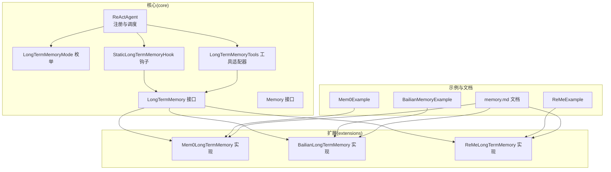
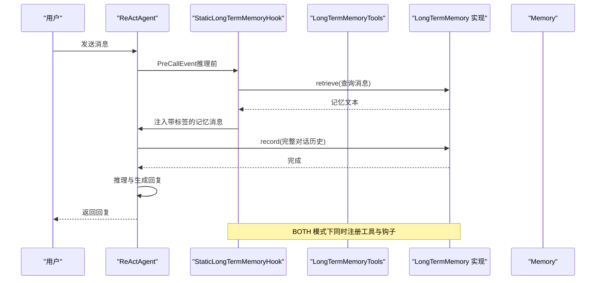
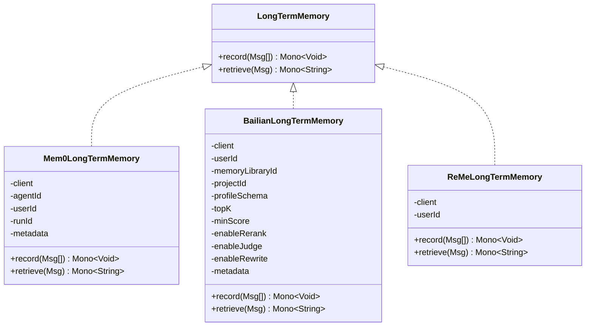
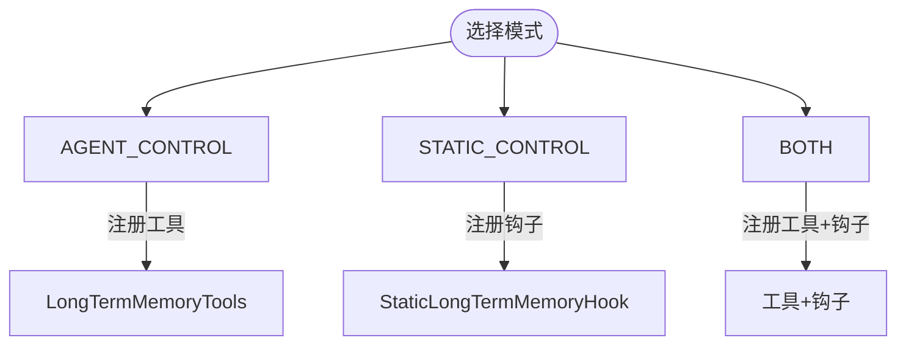
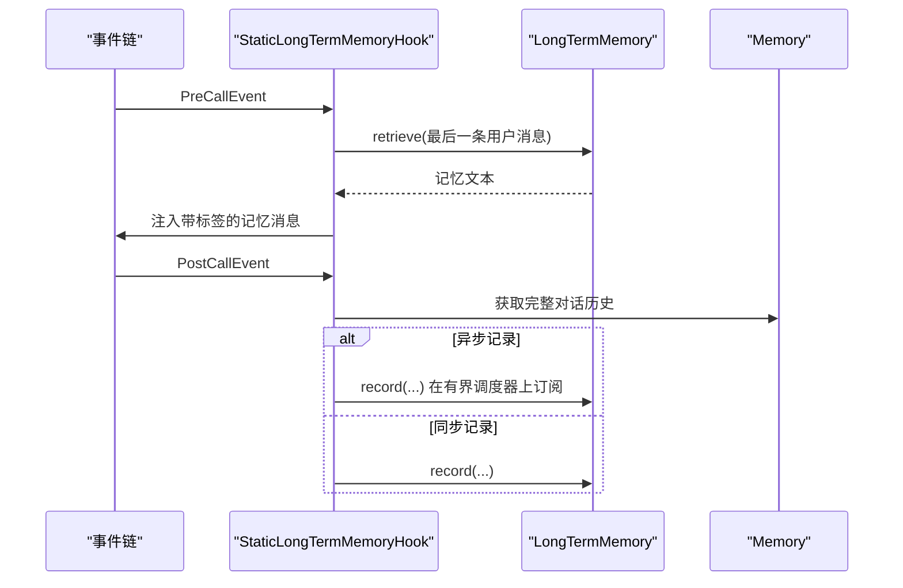
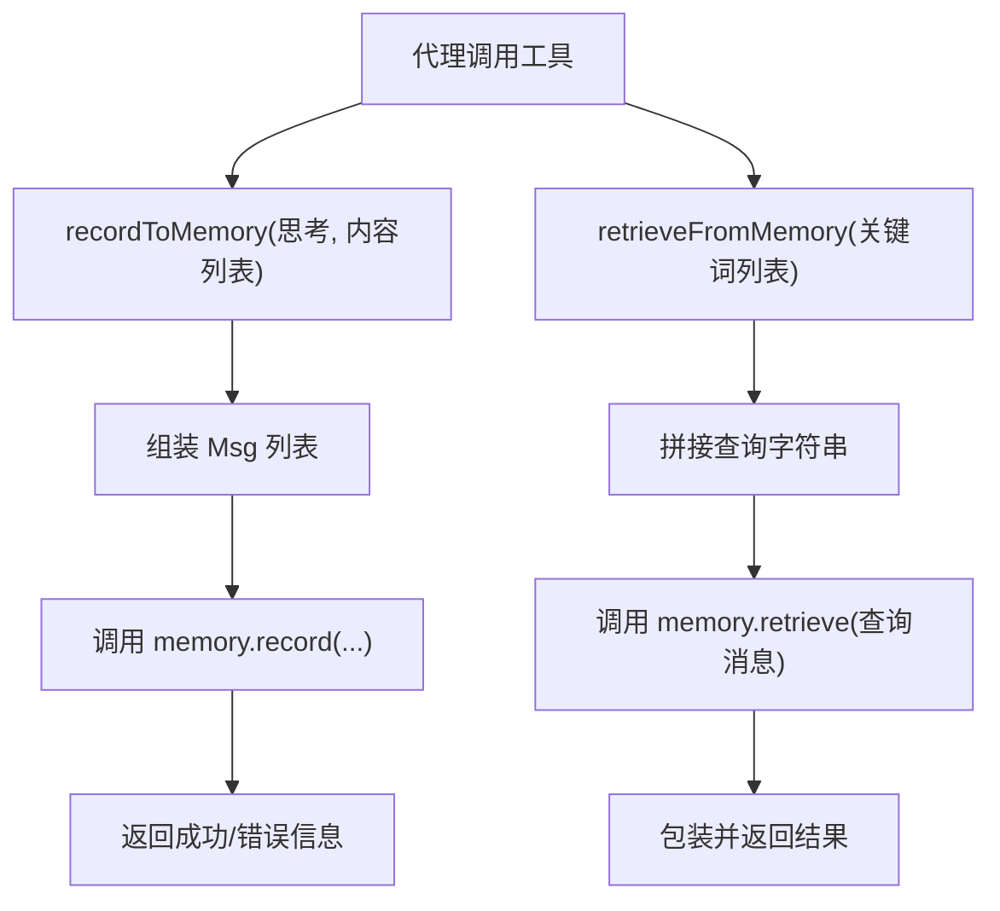
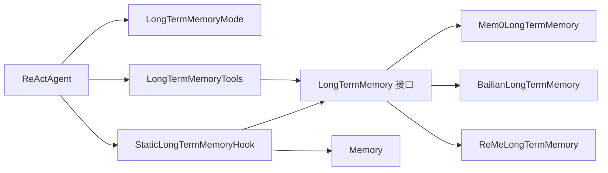

# 长期记忆

<cite>
**本文引用的文件**
- [agentscope-core/src/main/java/io/agentscope/core/memory/LongTermMemory.java](file://agentscope-core/src/main/java/io/agentscope/core/memory/LongTermMemory.java)
- [agentscope-core/src/main/java/io/agentscope/core/memory/LongTermMemoryMode.java](file://agentscope-core/src/main/java/io/agentscope/core/memory/LongTermMemoryMode.java)
- [agentscope-core/src/main/java/io/agentscope/core/memory/StaticLongTermMemoryHook.java](file://agentscope-core/src/main/java/io/agentscope/core/memory/StaticLongTermMemoryHook.java)
- [agentscope-core/src/main/java/io/agentscope/core/memory/LongTermMemoryTools.java](file://agentscope-core/src/main/java/io/agentscope/core/memory/LongTermMemoryTools.java)
- [agentscope-core/src/main/java/io/agentscope/core/memory/Memory.java](file://agentscope-core/src/main/java/io/agentscope/core/memory/Memory.java)
- [agentscope-extensions/agentscope-extensions-mem0/src/main/java/io/agentscope/core/memory/mem0/Mem0LongTermMemory.java](file://agentscope-extensions/agentscope-extensions-mem0/src/main/java/io/agentscope/core/memory/mem0/Mem0LongTermMemory.java)
- [agentscope-extensions/agentscope-extensions-memory-bailian/src/main/java/io/agentscope/core/memory/bailian/BailianLongTermMemory.java](file://agentscope-extensions/agentscope-extensions-memory-bailian/src/main/java/io/agentscope/core/memory/bailian/BailianLongTermMemory.java)
- [agentscope-extensions/agentscope-extensions-reme/src/main/java/io/agentscope/core/memory/reme/ReMeLongTermMemory.java](file://agentscope-extensions/agentscope-extensions-reme/src/main/java/io/agentscope/core/memory/reme/ReMeLongTermMemory.java)
- [agentscope-core/src/main/java/io/agentscope/core/ReActAgent.java](file://agentscope-core/src/main/java/io/agentscope/core/ReActAgent.java)
- [agentscope-core/src/test/java/io/agentscope/core/memory/StaticLongTermMemoryHookTest.java](file://agentscope-core/src/test/java/io/agentscope/core/memory/StaticLongTermMemoryHookTest.java)
- [agentscope-core/src/test/java/io/agentscope/core/memory/LongTermMemoryModeTest.java](file://agentscope-core/src/test/java/io/agentscope/core/memory/LongTermMemoryModeTest.java)
- [agentscope-core/src/test/java/io/agentscope/core/memory/LongTermMemoryToolsTest.java](file://agentscope-core/src/test/java/io/agentscope/core/memory/LongTermMemoryToolsTest.java)
- [agentscope-examples/advanced/src/main/java/io/agentscope/examples/advanced/Mem0Example.java](file://agentscope-examples/advanced/src/main/java/io/agentscope/examples/advanced/Mem0Example.java)
- [agentscope-examples/advanced/src/main/java/io/agentscope/examples/advanced/ReMeExample.java](file://agentscope-examples/advanced/src/main/java/io/agentscope/examples/advanced/ReMeExample.java)
- [agentscope-examples/advanced/src/main/java/io/agentscope/examples/advanced/BailianMemoryExample.java](file://agentscope-examples/advanced/src/main/java/io/agentscope/examples/advanced/BailianMemoryExample.java)
- [docs/zh/task/memory.md](file://docs/zh/task/memory.md)
- [agentscope-core/src/main/java/io/agentscope/core/session/JsonSession.java](file://agentscope-core/src/main/java/io/agentscope/core/session/JsonSession.java)
- [agentscope-core/src/main/java/io/agentscope/core/state/StatePersistence.java](file://agentscope-core/src/main/java/io/agentscope/core/state/StatePersistence.java)
</cite>

## 目录
1. [简介](#简介)
2. [项目结构](#项目结构)
3. [核心组件](#核心组件)
4. [架构总览](#架构总览)
5. [详细组件分析](#详细组件分析)
6. [依赖关系分析](#依赖关系分析)
7. [性能与优化](#性能与优化)
8. [故障排查指南](#故障排查指南)
9. [结论](#结论)
10. [附录](#附录)

## 简介
本文件面向 AgentScope Java 的长期记忆系统，围绕 LongTermMemory 接口、静态长期记忆钩子、工具适配器以及多种后端实现进行系统化技术说明。内容涵盖：
- 架构设计与职责边界
- 持久化机制与检索算法要点
- LongTermMemoryMode 三种模式及适用场景
- 静态长期记忆钩子的工作原理与配置
- 长期记忆工具的集成与使用模式
- 存储选择指南（数据库、文件系统、云存储）与企业级备份/恢复/迁移策略
- 性能优化、缓存与查询优化技巧

## 项目结构
围绕长期记忆的关键模块分布于 core 与 extensions：
- core 层定义接口与框架集成点：LongTermMemory、LongTermMemoryMode、StaticLongTermMemoryHook、LongTermMemoryTools、Memory
- extensions 层提供多种后端实现：Mem0、Bailian、ReMe
- ReActAgent 负责根据模式注册工具或钩子
- 示例工程展示典型用法

图示来源
- [agentscope-core/src/main/java/io/agentscope/core/memory/LongTermMemory.java:67-107](file://agentscope-core/src/main/java/io/agentscope/core/memory/LongTermMemory.java#L67-L107)
- [agentscope-core/src/main/java/io/agentscope/core/memory/LongTermMemoryMode.java:52-68](file://agentscope-core/src/main/java/io/agentscope/core/memory/LongTermMemoryMode.java#L52-L68)
- [agentscope-core/src/main/java/io/agentscope/core/memory/StaticLongTermMemoryHook.java:75-297](file://agentscope-core/src/main/java/io/agentscope/core/memory/StaticLongTermMemoryHook.java#L75-L297)
- [agentscope-core/src/main/java/io/agentscope/core/memory/LongTermMemoryTools.java:65-213](file://agentscope-core/src/main/java/io/agentscope/core/memory/LongTermMemoryTools.java#L65-L213)
- [agentscope-core/src/main/java/io/agentscope/core/memory/Memory.java:29-62](file://agentscope-core/src/main/java/io/agentscope/core/memory/Memory.java#L29-L62)
- [agentscope-core/src/main/java/io/agentscope/core/ReActAgent.java:1740-1755](file://agentscope-core/src/main/java/io/agentscope/core/ReActAgent.java#L1740-L1755)
- [agentscope-extensions/agentscope-extensions-mem0/src/main/java/io/agentscope/core/memory/mem0/Mem0LongTermMemory.java:113-439](file://agentscope-extensions/agentscope-extensions-mem0/src/main/java/io/agentscope/core/memory/mem0/Mem0LongTermMemory.java#L113-L439)
- [agentscope-extensions/agentscope-extensions-memory-bailian/src/main/java/io/agentscope/core/memory/bailian/BailianLongTermMemory.java:77-491](file://agentscope-extensions/agentscope-extensions-memory-bailian/src/main/java/io/agentscope/core/memory/bailian/BailianLongTermMemory.java#L77-L491)
- [agentscope-extensions/agentscope-extensions-reme/src/main/java/io/agentscope/core/memory/reme/ReMeLongTermMemory.java:66-306](file://agentscope-extensions/agentscope-extensions-reme/src/main/java/io/agentscope/core/memory/reme/ReMeLongTermMemory.java#L66-L306)
- [agentscope-examples/advanced/src/main/java/io/agentscope/examples/advanced/Mem0Example.java:33-99](file://agentscope-examples/advanced/src/main/java/io/agentscope/examples/advanced/Mem0Example.java#L33-L99)
- [agentscope-examples/advanced/src/main/java/io/agentscope/examples/advanced/ReMeExample.java:59-102](file://agentscope-examples/advanced/src/main/java/io/agentscope/examples/advanced/ReMeExample.java#L59-L102)
- [agentscope-examples/advanced/src/main/java/io/agentscope/examples/advanced/BailianMemoryExample.java:58-132](file://agentscope-examples/advanced/src/main/java/io/agentscope/examples/advanced/BailianMemoryExample.java#L58-L132)
- [docs/zh/task/memory.md:264-317](file://docs/zh/task/memory.md#L264-L317)

章节来源
- [agentscope-core/src/main/java/io/agentscope/core/memory/LongTermMemory.java:22-107](file://agentscope-core/src/main/java/io/agentscope/core/memory/LongTermMemory.java#L22-L107)
- [agentscope-core/src/main/java/io/agentscope/core/memory/LongTermMemoryMode.java:18-68](file://agentscope-core/src/main/java/io/agentscope/core/memory/LongTermMemoryMode.java#L18-L68)
- [agentscope-core/src/main/java/io/agentscope/core/memory/StaticLongTermMemoryHook.java:35-297](file://agentscope-core/src/main/java/io/agentscope/core/memory/StaticLongTermMemoryHook.java#L35-L297)
- [agentscope-core/src/main/java/io/agentscope/core/memory/LongTermMemoryTools.java:27-213](file://agentscope-core/src/main/java/io/agentscope/core/memory/LongTermMemoryTools.java#L27-L213)
- [agentscope-core/src/main/java/io/agentscope/core/memory/Memory.java:22-62](file://agentscope-core/src/main/java/io/agentscope/core/memory/Memory.java#L22-L62)
- [agentscope-core/src/main/java/io/agentscope/core/ReActAgent.java:1730-1755](file://agentscope-core/src/main/java/io/agentscope/core/ReActAgent.java#L1730-L1755)

## 核心组件
- LongTermMemory 接口：定义记录与检索两大异步操作，返回 Reactor Mono，保证非阻塞集成。
- LongTermMemoryMode 枚举：控制框架自动管理、代理主动控制或两者结合。
- StaticLongTermMemoryHook：在事件链中自动注入检索结果并记录对话，支持同步/异步记录。
- LongTermMemoryTools：将核心 API 适配为工具函数，供代理在 AGENT_CONTROL 模式下调用。
- Memory 接口：会话级内存管理，用于提供完整对话历史给长期记忆记录。

章节来源
- [agentscope-core/src/main/java/io/agentscope/core/memory/LongTermMemory.java:67-107](file://agentscope-core/src/main/java/io/agentscope/core/memory/LongTermMemory.java#L67-L107)
- [agentscope-core/src/main/java/io/agentscope/core/memory/LongTermMemoryMode.java:52-68](file://agentscope-core/src/main/java/io/agentscope/core/memory/LongTermMemoryMode.java#L52-L68)
- [agentscope-core/src/main/java/io/agentscope/core/memory/StaticLongTermMemoryHook.java:75-297](file://agentscope-core/src/main/java/io/agentscope/core/memory/StaticLongTermMemoryHook.java#L75-L297)
- [agentscope-core/src/main/java/io/agentscope/core/memory/LongTermMemoryTools.java:65-213](file://agentscope-core/src/main/java/io/agentscope/core/memory/LongTermMemoryTools.java#L65-L213)
- [agentscope-core/src/main/java/io/agentscope/core/memory/Memory.java:29-62](file://agentscope-core/src/main/java/io/agentscope/core/memory/Memory.java#L29-L62)

## 架构总览
长期记忆在框架内的工作流如下：
- 静态控制（STATIC_CONTROL 或 BOTH）：在推理前注入检索到的记忆，在回复后记录对话
- 代理控制（AGENT_CONTROL 或 BOTH）：通过工具函数显式记录/检索
- 后端实现：Mem0、Bailian、ReMe 等，均实现 LongTermMemory 接口

图示来源
- [agentscope-core/src/main/java/io/agentscope/core/ReActAgent.java:1740-1755](file://agentscope-core/src/main/java/io/agentscope/core/ReActAgent.java#L1740-L1755)
- [agentscope-core/src/main/java/io/agentscope/core/memory/StaticLongTermMemoryHook.java:121-259](file://agentscope-core/src/main/java/io/agentscope/core/memory/StaticLongTermMemoryHook.java#L121-L259)
- [agentscope-core/src/main/java/io/agentscope/core/memory/LongTermMemoryTools.java:101-212](file://agentscope-core/src/main/java/io/agentscope/core/memory/LongTermMemoryTools.java#L101-L212)
- [agentscope-core/src/main/java/io/agentscope/core/memory/LongTermMemory.java:69-106](file://agentscope-core/src/main/java/io/agentscope/core/memory/LongTermMemory.java#L69-L106)
- [agentscope-core/src/main/java/io/agentscope/core/memory/Memory.java:36-43](file://agentscope-core/src/main/java/io/agentscope/core/memory/Memory.java#L36-L43)

## 详细组件分析

### LongTermMemory 接口与实现
- 接口职责：定义 record(List<Msg>) 与 retrieve(Msg) 两个核心方法，均返回 Mono，确保非阻塞
- 典型实现：
  - Mem0LongTermMemory：基于向量检索与 LLM 抽取，支持多租户元数据过滤
  - BailianLongTermMemory：阿里云 Bailian 内存库，支持 topK、最小相似度等参数
  - ReMeLongTermMemory：基于轨迹与摘要的本地/自托管服务

图示来源
- [agentscope-core/src/main/java/io/agentscope/core/memory/LongTermMemory.java:67-107](file://agentscope-core/src/main/java/io/agentscope/core/memory/LongTermMemory.java#L67-L107)
- [agentscope-extensions/agentscope-extensions-mem0/src/main/java/io/agentscope/core/memory/mem0/Mem0LongTermMemory.java:113-439](file://agentscope-extensions/agentscope-extensions-mem0/src/main/java/io/agentscope/core/memory/mem0/Mem0LongTermMemory.java#L113-L439)
- [agentscope-extensions/agentscope-extensions-memory-bailian/src/main/java/io/agentscope/core/memory/bailian/BailianLongTermMemory.java:77-491](file://agentscope-extensions/agentscope-extensions-memory-bailian/src/main/java/io/agentscope/core/memory/bailian/BailianLongTermMemory.java#L77-L491)
- [agentscope-extensions/agentscope-extensions-reme/src/main/java/io/agentscope/core/memory/reme/ReMeLongTermMemory.java:66-306](file://agentscope-extensions/agentscope-extensions-reme/src/main/java/io/agentscope/core/memory/reme/ReMeLongTermMemory.java#L66-L306)

章节来源
- [agentscope-core/src/main/java/io/agentscope/core/memory/LongTermMemory.java:67-107](file://agentscope-core/src/main/java/io/agentscope/core/memory/LongTermMemory.java#L67-L107)
- [agentscope-extensions/agentscope-extensions-mem0/src/main/java/io/agentscope/core/memory/mem0/Mem0LongTermMemory.java:113-439](file://agentscope-extensions/agentscope-extensions-mem0/src/main/java/io/agentscope/core/memory/mem0/Mem0LongTermMemory.java#L113-L439)
- [agentscope-extensions/agentscope-extensions-memory-bailian/src/main/java/io/agentscope/core/memory/bailian/BailianLongTermMemory.java:77-491](file://agentscope-extensions/agentscope-extensions-memory-bailian/src/main/java/io/agentscope/core/memory/bailian/BailianLongTermMemory.java#L77-L491)
- [agentscope-extensions/agentscope-extensions-reme/src/main/java/io/agentscope/core/memory/reme/ReMeLongTermMemory.java:66-306](file://agentscope-extensions/agentscope-extensions-reme/src/main/java/io/agentscope/core/memory/reme/ReMeLongTermMemory.java#L66-L306)

### LongTermMemoryMode 模式详解
- AGENT_CONTROL：仅注册工具，由代理自主决定何时记录/检索
- STATIC_CONTROL：仅注册钩子，框架自动在推理前注入记忆、推理后记录
- BOTH：同时注册工具与钩子，兼顾自动化与代理可控性

图示来源
- [agentscope-core/src/main/java/io/agentscope/core/memory/LongTermMemoryMode.java:52-68](file://agentscope-core/src/main/java/io/agentscope/core/memory/LongTermMemoryMode.java#L52-L68)
- [agentscope-core/src/main/java/io/agentscope/core/ReActAgent.java:1740-1755](file://agentscope-core/src/main/java/io/agentscope/core/ReActAgent.java#L1740-L1755)

章节来源
- [agentscope-core/src/main/java/io/agentscope/core/memory/LongTermMemoryMode.java:18-68](file://agentscope-core/src/main/java/io/agentscope/core/memory/LongTermMemoryMode.java#L18-L68)
- [agentscope-core/src/main/java/io/agentscope/core/ReActAgent.java:1730-1755](file://agentscope-core/src/main/java/io/agentscope/core/ReActAgent.java#L1730-L1755)

### 静态长期记忆钩子（StaticLongTermMemoryHook）
- 作用：在 PreCallEvent 前检索并注入记忆；在 PostCallEvent 后记录对话
- 记录策略：支持同步/异步两种路径，异步使用有界弹性调度器，避免阻塞主响应
- 错误处理：检索/记录异常被吞并并记录日志，不中断流程
- 优先级：高优先级，确保在其他钩子之前完成记忆注入

图示来源
- [agentscope-core/src/main/java/io/agentscope/core/memory/StaticLongTermMemoryHook.java:121-259](file://agentscope-core/src/main/java/io/agentscope/core/memory/StaticLongTermMemoryHook.java#L121-L259)
- [agentscope-core/src/main/java/io/agentscope/core/memory/Memory.java:36-43](file://agentscope-core/src/main/java/io/agentscope/core/memory/Memory.java#L36-L43)

章节来源
- [agentscope-core/src/main/java/io/agentscope/core/memory/StaticLongTermMemoryHook.java:35-297](file://agentscope-core/src/main/java/io/agentscope/core/memory/StaticLongTermMemoryHook.java#L35-L297)

### 长期记忆工具（LongTermMemoryTools）
- 将 record/retrieve 适配为工具函数，便于代理在 AGENT_CONTROL 模式下调用
- recordToMemory：接收代理思考与事实列表，转换为消息并调用底层 record
- retrieveFromMemory：接收关键词，构造查询消息并调用底层 retrieve，再包装返回

图示来源
- [agentscope-core/src/main/java/io/agentscope/core/memory/LongTermMemoryTools.java:101-212](file://agentscope-core/src/main/java/io/agentscope/core/memory/LongTermMemoryTools.java#L101-L212)

章节来源
- [agentscope-core/src/main/java/io/agentscope/core/memory/LongTermMemoryTools.java:27-213](file://agentscope-core/src/main/java/io/agentscope/core/memory/LongTermMemoryTools.java#L27-L213)

### ReActAgent 中的集成
- AGENT_CONTROL/BOTH：注册 LongTermMemoryTools
- STATIC_CONTROL/BOTH：注册 StaticLongTermMemoryHook
- 依据模式动态装配，确保最小侵入与灵活组合

章节来源
- [agentscope-core/src/main/java/io/agentscope/core/ReActAgent.java:1740-1755](file://agentscope-core/src/main/java/io/agentscope/core/ReActAgent.java#L1740-L1755)

### 示例与用法
- Mem0 示例：演示平台/自托管、元数据、API 类型等配置
- ReMe 示例：演示本地/自托管服务、环境变量覆盖
- Bailian 示例：演示 DashScope API、可选库/项目/Schema 参数

章节来源
- [agentscope-examples/advanced/src/main/java/io/agentscope/examples/advanced/Mem0Example.java:33-99](file://agentscope-examples/advanced/src/main/java/io/agentscope/examples/advanced/Mem0Example.java#L33-L99)
- [agentscope-examples/advanced/src/main/java/io/agentscope/examples/advanced/ReMeExample.java:59-102](file://agentscope-examples/advanced/src/main/java/io/agentscope/examples/advanced/ReMeExample.java#L59-L102)
- [agentscope-examples/advanced/src/main/java/io/agentscope/examples/advanced/BailianMemoryExample.java:58-132](file://agentscope-examples/advanced/src/main/java/io/agentscope/examples/advanced/BailianMemoryExample.java#L58-L132)
- [docs/zh/task/memory.md:264-317](file://docs/zh/task/memory.md#L264-L317)

## 依赖关系分析
- ReActAgent 依赖 LongTermMemoryMode 决定注册策略
- StaticLongTermMemoryHook 依赖 LongTermMemory 与 Memory
- LongTermMemoryTools 依赖 LongTermMemory
- 各后端实现均实现 LongTermMemory 接口，解耦上层逻辑

图示来源
- [agentscope-core/src/main/java/io/agentscope/core/ReActAgent.java:1740-1755](file://agentscope-core/src/main/java/io/agentscope/core/ReActAgent.java#L1740-L1755)
- [agentscope-core/src/main/java/io/agentscope/core/memory/StaticLongTermMemoryHook.java:75-297](file://agentscope-core/src/main/java/io/agentscope/core/memory/StaticLongTermMemoryHook.java#L75-L297)
- [agentscope-core/src/main/java/io/agentscope/core/memory/LongTermMemoryTools.java:65-213](file://agentscope-core/src/main/java/io/agentscope/core/memory/LongTermMemoryTools.java#L65-L213)
- [agentscope-core/src/main/java/io/agentscope/core/memory/LongTermMemory.java:67-107](file://agentscope-core/src/main/java/io/agentscope/core/memory/LongTermMemory.java#L67-L107)
- [agentscope-extensions/agentscope-extensions-mem0/src/main/java/io/agentscope/core/memory/mem0/Mem0LongTermMemory.java:113-439](file://agentscope-extensions/agentscope-extensions-mem0/src/main/java/io/agentscope/core/memory/mem0/Mem0LongTermMemory.java#L113-L439)
- [agentscope-extensions/agentscope-extensions-memory-bailian/src/main/java/io/agentscope/core/memory/bailian/BailianLongTermMemory.java:77-491](file://agentscope-extensions/agentscope-extensions-memory-bailian/src/main/java/io/agentscope/core/memory/bailian/BailianLongTermMemory.java#L77-L491)
- [agentscope-extensions/agentscope-extensions-reme/src/main/java/io/agentscope/core/memory/reme/ReMeLongTermMemory.java:66-306](file://agentscope-extensions/agentscope-extensions-reme/src/main/java/io/agentscope/core/memory/reme/ReMeLongTermMemory.java#L66-L306)

章节来源
- [agentscope-core/src/main/java/io/agentscope/core/ReActAgent.java:1740-1755](file://agentscope-core/src/main/java/io/agentscope/core/ReActAgent.java#L1740-L1755)
- [agentscope-core/src/main/java/io/agentscope/core/memory/StaticLongTermMemoryHook.java:75-297](file://agentscope-core/src/main/java/io/agentscope/core/memory/StaticLongTermMemoryHook.java#L75-L297)
- [agentscope-core/src/main/java/io/agentscope/core/memory/LongTermMemoryTools.java:65-213](file://agentscope-core/src/main/java/io/agentscope/core/memory/LongTermMemoryTools.java#L65-L213)
- [agentscope-core/src/main/java/io/agentscope/core/memory/LongTermMemory.java:67-107](file://agentscope-core/src/main/java/io/agentscope/core/memory/LongTermMemory.java#L67-L107)

## 性能与优化
- 异步记录：StaticLongTermMemoryHook 提供异步记录路径，使用有界弹性调度器限制并发与队列长度，避免阻塞主响应
- 过滤与压缩：实现层对空消息、压缩标记等进行过滤，减少无效请求
- 查询参数：Bailian 支持 topK、minScore、rerank/judge/rewrite 等参数，ReMe 支持 topK，合理设置可提升召回质量与性能
- 缓存建议：可在应用侧对检索结果做短期缓存（按查询哈希），降低重复检索开销（需注意上下文变化导致的失效）

章节来源
- [agentscope-core/src/main/java/io/agentscope/core/memory/StaticLongTermMemoryHook.java:78-83](file://agentscope-core/src/main/java/io/agentscope/core/memory/StaticLongTermMemoryHook.java#L78-L83)
- [agentscope-extensions/agentscope-extensions-mem0/src/main/java/io/agentscope/core/memory/mem0/Mem0LongTermMemory.java:170-204](file://agentscope-extensions/agentscope-extensions-mem0/src/main/java/io/agentscope/core/memory/mem0/Mem0LongTermMemory.java#L170-L204)
- [agentscope-extensions/agentscope-extensions-memory-bailian/src/main/java/io/agentscope/core/memory/bailian/BailianLongTermMemory.java:147-215](file://agentscope-extensions/agentscope-extensions-memory-bailian/src/main/java/io/agentscope/core/memory/bailian/BailianLongTermMemory.java#L147-L215)
- [agentscope-extensions/agentscope-extensions-reme/src/main/java/io/agentscope/core/memory/reme/ReMeLongTermMemory.java:108-168](file://agentscope-extensions/agentscope-extensions-reme/src/main/java/io/agentscope/core/memory/reme/ReMeLongTermMemory.java#L108-L168)

## 故障排查指南
- 钩子异常不影响流程：检索/记录异常会被吞并并记录日志，确认日志级别以定位问题
- 参数校验：构造函数对空参数抛出非法参数异常，检查必填项（如 Mem0 的至少一个标识符）
- 测试验证：参考单元测试覆盖了事件注入、空输入、错误处理、异步记录等关键路径

章节来源
- [agentscope-core/src/main/java/io/agentscope/core/memory/StaticLongTermMemoryHook.java:188-195](file://agentscope-core/src/main/java/io/agentscope/core/memory/StaticLongTermMemoryHook.java#L188-L195)
- [agentscope-core/src/test/java/io/agentscope/core/memory/StaticLongTermMemoryHookTest.java:125-199](file://agentscope-core/src/test/java/io/agentscope/core/memory/StaticLongTermMemoryHookTest.java#L125-L199)
- [agentscope-core/src/test/java/io/agentscope/core/memory/LongTermMemoryModeTest.java:26-79](file://agentscope-core/src/test/java/io/agentscope/core/memory/LongTermMemoryModeTest.java#L26-L79)
- [agentscope-core/src/test/java/io/agentscope/core/memory/LongTermMemoryToolsTest.java:289-326](file://agentscope-core/src/test/java/io/agentscope/core/memory/LongTermMemoryToolsTest.java#L289-L326)

## 结论
- LongTermMemory 通过统一接口屏蔽后端差异，配合模式化集成实现灵活的自动化与代理可控
- StaticLongTermMemoryHook 与 LongTermMemoryTools 分别满足“框架自动”和“代理自治”的两类需求
- Mem0、Bailian、ReMe 等实现提供多样化的检索与抽取能力，适合不同场景与合规要求
- 通过异步记录、参数优化与应用侧缓存，可显著提升系统吞吐与稳定性

## 附录

### 长期记忆模式选择指南
- AGENT_CONTROL：适用于需要代理自主决策何时记录/检索的高级场景
- STATIC_CONTROL：适用于希望框架全权负责记忆管理的简单场景
- BOTH：推荐默认，兼顾自动化与可控性

章节来源
- [agentscope-core/src/main/java/io/agentscope/core/memory/LongTermMemoryMode.java:29-47](file://agentscope-core/src/main/java/io/agentscope/core/memory/LongTermMemoryMode.java#L29-L47)

### 静态长期记忆钩子配置要点
- 优先级：高优先级，确保在其他钩子之前完成记忆注入
- 异步记录：启用后使用有界调度器，饱和时丢弃新任务并记录警告
- 错误处理：检索/记录异常被吞并，不影响主流程

章节来源
- [agentscope-core/src/main/java/io/agentscope/core/memory/StaticLongTermMemoryHook.java:136-139](file://agentscope-core/src/main/java/io/agentscope/core/memory/StaticLongTermMemoryHook.java#L136-L139)
- [agentscope-core/src/main/java/io/agentscope/core/memory/StaticLongTermMemoryHook.java:226-245](file://agentscope-core/src/main/java/io/agentscope/core/memory/StaticLongTermMemoryHook.java#L226-L245)
- [agentscope-core/src/main/java/io/agentscope/core/memory/StaticLongTermMemoryHook.java:188-195](file://agentscope-core/src/main/java/io/agentscope/core/memory/StaticLongTermMemoryHook.java#L188-L195)

### 长期记忆工具使用模式
- AGENT_CONTROL 模式下，代理通过工具函数显式记录/检索
- recordToMemory：传入思考与事实列表，底层统一转换为消息并记录
- retrieveFromMemory：传入关键词，底层封装查询消息并检索

章节来源
- [agentscope-core/src/main/java/io/agentscope/core/memory/LongTermMemoryTools.java:101-212](file://agentscope-core/src/main/java/io/agentscope/core/memory/LongTermMemoryTools.java#L101-L212)

### 持久化存储选择与企业级策略
- 数据库：适合结构化检索与审计，需考虑索引、分片与一致性
- 文件系统：适合轻量部署与离线备份，推荐 JSON 行式存储与目录命名规范化
- 云存储：适合弹性扩展与多副本，需关注网络延迟与访问控制
- 备份/恢复/迁移：
  - 会话状态与内存历史可借助 JsonSession 与 StatePersistence 进行序列化与归档
  - 建议定期导出长期记忆索引与元数据，结合后端快照实现跨环境迁移

章节来源
- [agentscope-core/src/main/java/io/agentscope/core/session/JsonSession.java:183-364](file://agentscope-core/src/main/java/io/agentscope/core/session/JsonSession.java#L183-L364)
- [agentscope-core/src/main/java/io/agentscope/core/state/StatePersistence.java:119-162](file://agentscope-core/src/main/java/io/agentscope/core/state/StatePersistence.java#L119-L162)