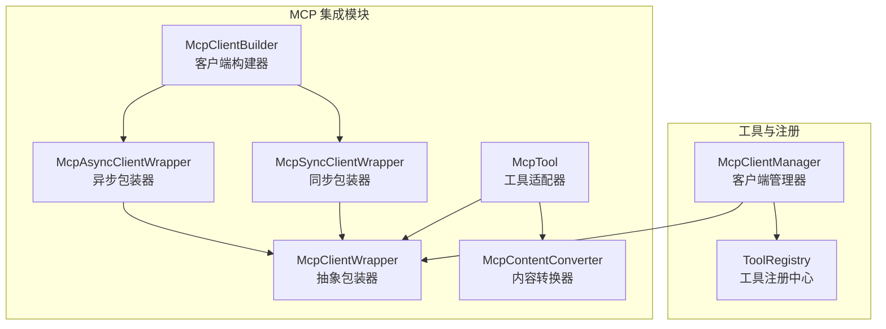
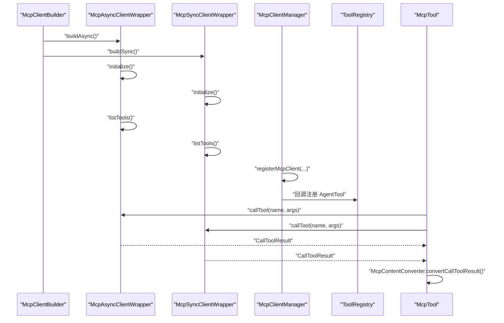
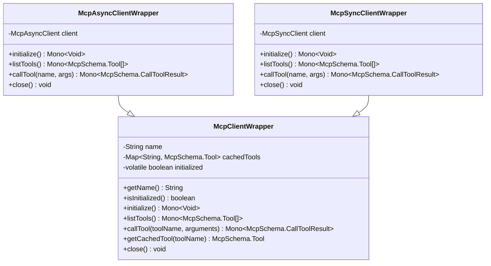
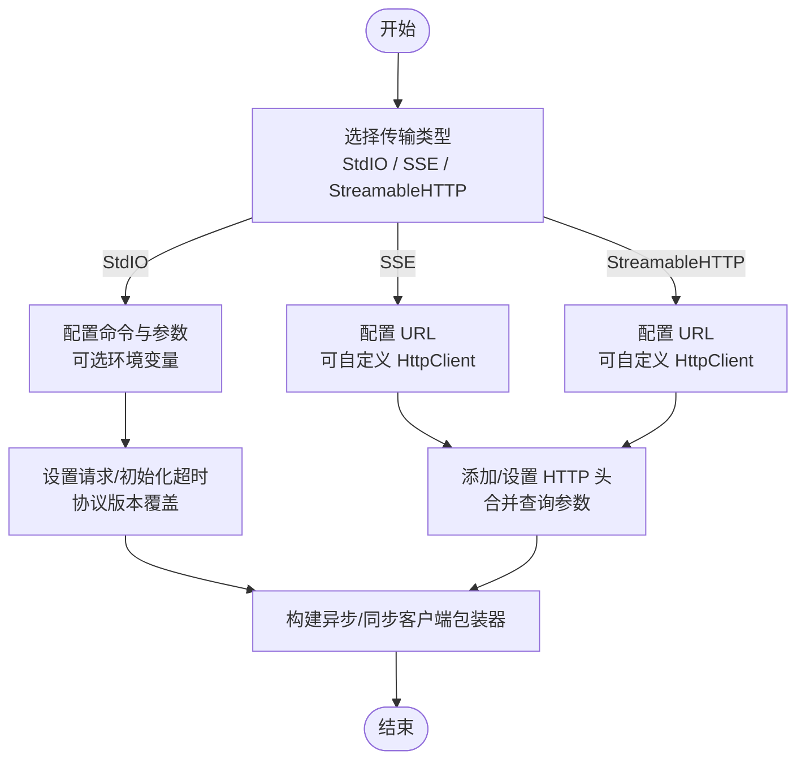
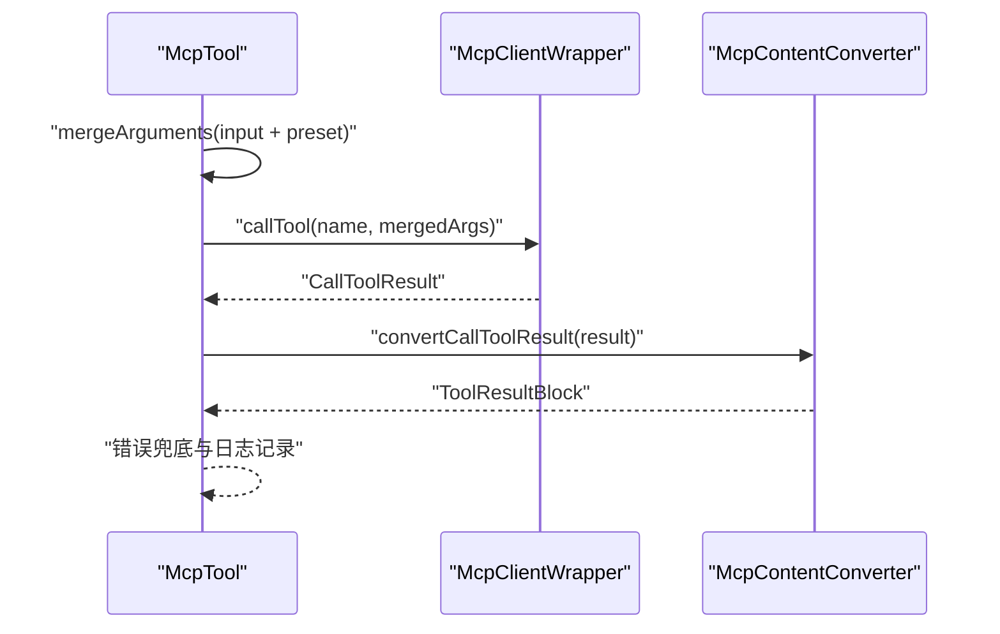
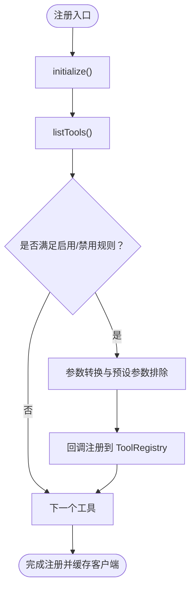
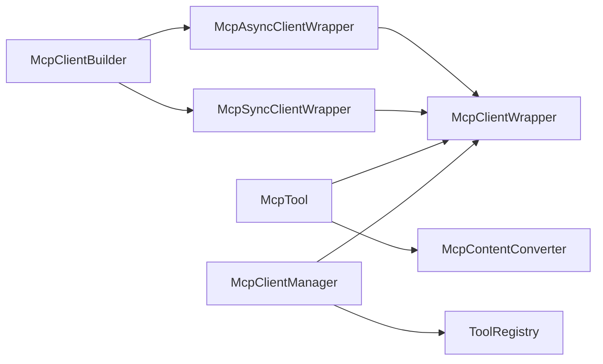

# MCP 协议集成

<cite>
**本文引用的文件**
- [McpClientWrapper.java](file://agentscope-core/src/main/java/io/agentscope/core/tool/mcp/McpClientWrapper.java)
- [McpAsyncClientWrapper.java](file://agentscope-core/src/main/java/io/agentscope/core/tool/mcp/McpAsyncClientWrapper.java)
- [McpSyncClientWrapper.java](file://agentscope-core/src/main/java/io/agentscope/core/tool/mcp/McpSyncClientWrapper.java)
- [McpClientBuilder.java](file://agentscope-core/src/main/java/io/agentscope/core/tool/mcp/McpClientBuilder.java)
- [McpTool.java](file://agentscope-core/src/main/java/io/agentscope/core/tool/mcp/McpTool.java)
- [McpContentConverter.java](file://agentscope-core/src/main/java/io/agentscope/core/tool/mcp/McpContentConverter.java)
- [McpClientManager.java](file://agentscope-core/src/main/java/io/agentscope/core/tool/McpClientManager.java)
- [ToolRegistry.java](file://agentscope-core/src/main/java/io/agentscope/core/tool/ToolRegistry.java)
- [McpClientWrapperTest.java](file://agentscope-core/src/test/java/io/agentscope/core/tool/mcp/McpClientWrapperTest.java)
- [McpToolTest.java](file://agentscope-core/src/test/java/io/agentscope/core/tool/mcp/McpToolTest.java)
</cite>

## 目录
1. [简介](#简介)
2. [项目结构](#项目结构)
3. [核心组件](#核心组件)
4. [架构总览](#架构总览)
5. [详细组件分析](#详细组件分析)
6. [依赖关系分析](#依赖关系分析)
7. [性能考量](#性能考量)
8. [故障排除指南](#故障排除指南)
9. [结论](#结论)
10. [附录](#附录)

## 简介
本技术文档面向 AgentScope Java 的 MCP（Model Context Protocol）协议集成，系统性阐述 MCP 协议在 AgentScope 中的应用价值与实现细节。文档聚焦以下目标：
- 解释 MCP 协议的基本概念与在 AgentScope 中的价值：通过标准化的工具发现与调用机制，将外部能力（如本地进程、HTTP SSE/StreamableHTTP 服务）无缝接入 AgentScope 的工具体系。
- 深入说明 McpClientWrapper 的封装机制与客户端生命周期管理：统一抽象异步与同步客户端，提供初始化、工具缓存、调用与关闭等能力。
- 阐述 McpClientManager 的注册流程与工具同步策略：支持按组注册、启用/禁用过滤、预设参数映射与回调注册。
- 解释 McpTool 的动态工具创建与调用机制：桥接 AgentScope 工具接口与 MCP 调用，支持参数合并、输出转换与错误处理。
- 提供 MCP 客户端的配置与连接方法：涵盖传输类型（StdIO/SSE/StreamableHTTP）、认证头、查询参数、超时与协议版本覆盖。
- 给出 MCP 工具开发指南：工具定义、参数规范与结果格式。
- 解释 MCP 集成的安全考虑与最佳实践：权限控制与资源隔离建议。
- 提供 MCP 集成的故障排除指南与性能优化建议。

## 项目结构
围绕 MCP 集成的关键源码位于 agentscope-core 模块的 tool/mcp 包中，配合工具注册与管理模块协同工作：
- mcp 包：MCP 客户端包装器、构建器、内容转换器与工具适配器
- tool 包：MCP 客户端管理器与工具注册中心

图表来源
- [McpClientWrapper.java:40-121](file://agentscope-core/src/main/java/io/agentscope/core/tool/mcp/McpClientWrapper.java#L40-L121)
- [McpAsyncClientWrapper.java:40-180](file://agentscope-core/src/main/java/io/agentscope/core/tool/mcp/McpAsyncClientWrapper.java#L40-L180)
- [McpSyncClientWrapper.java:41-189](file://agentscope-core/src/main/java/io/agentscope/core/tool/mcp/McpSyncClientWrapper.java#L41-L189)
- [McpClientBuilder.java:94-791](file://agentscope-core/src/main/java/io/agentscope/core/tool/mcp/McpClientBuilder.java#L94-L791)
- [McpTool.java:57-282](file://agentscope-core/src/main/java/io/agentscope/core/tool/mcp/McpTool.java#L57-L282)
- [McpContentConverter.java:41-205](file://agentscope-core/src/main/java/io/agentscope/core/tool/mcp/McpContentConverter.java#L41-L205)
- [McpClientManager.java:36-289](file://agentscope-core/src/main/java/io/agentscope/core/tool/McpClientManager.java#L36-L289)
- [ToolRegistry.java:40-156](file://agentscope-core/src/main/java/io/agentscope/core/tool/ToolRegistry.java#L40-L156)

章节来源
- [McpClientWrapper.java:24-121](file://agentscope-core/src/main/java/io/agentscope/core/tool/mcp/McpClientWrapper.java#L24-L121)
- [McpClientBuilder.java:54-93](file://agentscope-core/src/main/java/io/agentscope/core/tool/mcp/McpClientBuilder.java#L54-L93)

## 核心组件
- 抽象包装器与两类具体实现：统一管理 MCP 客户端生命周期、工具缓存与调用；异步包装器基于 Reactor 异步客户端，同步包装器将阻塞操作包裹在 boundedElastic 调度器上。
- 客户端构建器：提供 Fluent API 支持 StdIO、SSE、StreamableHTTP 三种传输；可配置请求/初始化超时、HTTP 头与查询参数、协议版本覆盖、异步/同步elicitation 处理器。
- 工具适配器：将 MCP 工具转换为 AgentScope 的 AgentTool，支持参数合并（输入参数优先于预设参数）、结果转换与错误兜底。
- 内容转换器：将 MCP 的 CallToolResult 转换为 AgentScope 的 ToolResultBlock，支持文本、图片与嵌入资源等类型。
- 客户端管理器：负责注册 MCP 客户端、工具发现与缓存、按组与过滤策略、移除与清理；通过回调将工具注册到工具注册中心并绑定 MCP 客户端与预设参数。
- 工具注册中心：维护工具名称到实现与元数据的映射，支持并发安全的注册、查找、移除与复制。

章节来源
- [McpClientWrapper.java:40-121](file://agentscope-core/src/main/java/io/agentscope/core/tool/mcp/McpClientWrapper.java#L40-L121)
- [McpAsyncClientWrapper.java:40-180](file://agentscope-core/src/main/java/io/agentscope/core/tool/mcp/McpAsyncClientWrapper.java#L40-L180)
- [McpSyncClientWrapper.java:41-189](file://agentscope-core/src/main/java/io/agentscope/core/tool/mcp/McpSyncClientWrapper.java#L41-L189)
- [McpClientBuilder.java:94-791](file://agentscope-core/src/main/java/io/agentscope/core/tool/mcp/McpClientBuilder.java#L94-L791)
- [McpTool.java:57-282](file://agentscope-core/src/main/java/io/agentscope/core/tool/mcp/McpTool.java#L57-L282)
- [McpContentConverter.java:41-205](file://agentscope-core/src/main/java/io/agentscope/core/tool/mcp/McpContentConverter.java#L41-L205)
- [McpClientManager.java:36-289](file://agentscope-core/src/main/java/io/agentscope/core/tool/McpClientManager.java#L36-L289)
- [ToolRegistry.java:40-156](file://agentscope-core/src/main/java/io/agentscope/core/tool/ToolRegistry.java#L40-L156)

## 架构总览
下图展示 MCP 集成的整体交互：客户端构建器创建异步/同步包装器，包装器完成初始化与工具缓存；工具适配器通过包装器调用远端工具；内容转换器将结果转为 AgentScope 的消息块；客户端管理器负责注册、过滤与移除。

图表来源
- [McpClientBuilder.java:421-496](file://agentscope-core/src/main/java/io/agentscope/core/tool/mcp/McpClientBuilder.java#L421-L496)
- [McpAsyncClientWrapper.java:65-154](file://agentscope-core/src/main/java/io/agentscope/core/tool/mcp/McpAsyncClientWrapper.java#L65-L154)
- [McpSyncClientWrapper.java:67-165](file://agentscope-core/src/main/java/io/agentscope/core/tool/mcp/McpSyncClientWrapper.java#L67-L165)
- [McpClientManager.java:129-210](file://agentscope-core/src/main/java/io/agentscope/core/tool/McpClientManager.java#L129-L210)
- [McpTool.java:172-192](file://agentscope-core/src/main/java/io/agentscope/core/tool/mcp/McpTool.java#L172-L192)
- [McpContentConverter.java:56-71](file://agentscope-core/src/main/java/io/agentscope/core/tool/mcp/McpContentConverter.java#L56-L71)

## 详细组件分析

### 抽象包装器与生命周期管理
- 统一职责：命名标识、工具缓存、初始化标志、抽象初始化/列举工具/调用工具、关闭资源。
- 生命周期要点：初始化幂等、未初始化状态下的调用抛出异常；关闭时清空缓存并置标志位；异步/同步实现分别处理优雅关闭与阻塞调度。

图表来源
- [McpClientWrapper.java:40-121](file://agentscope-core/src/main/java/io/agentscope/core/tool/mcp/McpClientWrapper.java#L40-L121)
- [McpAsyncClientWrapper.java:40-180](file://agentscope-core/src/main/java/io/agentscope/core/tool/mcp/McpAsyncClientWrapper.java#L40-L180)
- [McpSyncClientWrapper.java:41-189](file://agentscope-core/src/main/java/io/agentscope/core/tool/mcp/McpSyncClientWrapper.java#L41-L189)

章节来源
- [McpClientWrapper.java:40-121](file://agentscope-core/src/main/java/io/agentscope/core/tool/mcp/McpClientWrapper.java#L40-L121)
- [McpAsyncClientWrapper.java:65-154](file://agentscope-core/src/main/java/io/agentscope/core/tool/mcp/McpAsyncClientWrapper.java#L65-L154)
- [McpSyncClientWrapper.java:67-165](file://agentscope-core/src/main/java/io/agentscope/core/tool/mcp/McpSyncClientWrapper.java#L67-L165)

### 客户端构建器与连接配置
- 传输类型：StdIO（本地进程）、SSE（HTTP 服务器推送，有状态）、StreamableHTTP（HTTP 流式，无状态）。
- 认证与参数：支持 HTTP 头、查询参数（URL 与新增参数合并，后者优先）、自定义 HttpClient（HTTP/2 等）。
- 超时与协议：请求超时、初始化超时；协议版本覆盖以兼容新版本服务器。
- 异步/同步elicitation：可注册服务器侧提示处理函数，异步返回 Mono，同步直接返回结果。

图表来源
- [McpClientBuilder.java:131-222](file://agentscope-core/src/main/java/io/agentscope/core/tool/mcp/McpClientBuilder.java#L131-L222)
- [McpClientBuilder.java:286-341](file://agentscope-core/src/main/java/io/agentscope/core/tool/mcp/McpClientBuilder.java#L286-L341)
- [McpClientBuilder.java:421-496](file://agentscope-core/src/main/java/io/agentscope/core/tool/mcp/McpClientBuilder.java#L421-L496)

章节来源
- [McpClientBuilder.java:131-222](file://agentscope-core/src/main/java/io/agentscope/core/tool/mcp/McpClientBuilder.java#L131-L222)
- [McpClientBuilder.java:286-341](file://agentscope-core/src/main/java/io/agentscope/core/tool/mcp/McpClientBuilder.java#L286-L341)
- [McpClientBuilder.java:421-496](file://agentscope-core/src/main/java/io/agentscope/core/tool/mcp/McpClientBuilder.java#L421-L496)

### 工具适配器与动态创建
- 动态创建：根据 MCP 工具的输入/输出模式生成 AgentScope 参数与输出模式；支持预设参数映射。
- 调用机制：合并输入参数与预设参数（输入优先），调用包装器执行远程工具，转换为 ToolResultBlock；异常时返回错误结果而非抛出。
- 参数转换：支持将 MCP 的 JsonSchema 转换为 AgentScope 的参数结构，保留 $defs 与 definitions，便于 $ref 解析。

图表来源
- [McpTool.java:172-192](file://agentscope-core/src/main/java/io/agentscope/core/tool/mcp/McpTool.java#L172-L192)
- [McpContentConverter.java:56-71](file://agentscope-core/src/main/java/io/agentscope/core/tool/mcp/McpContentConverter.java#L56-L71)

章节来源
- [McpTool.java:112-282](file://agentscope-core/src/main/java/io/agentscope/core/tool/mcp/McpTool.java#L112-L282)
- [McpContentConverter.java:56-205](file://agentscope-core/src/main/java/io/agentscope/core/tool/mcp/McpContentConverter.java#L56-L205)

### 客户端管理器与工具同步策略
- 注册流程：校验组存在性、初始化客户端、列举工具、应用启用/禁用过滤、转换参数（排除预设参数）、通过回调注册到工具注册中心。
- 同步策略：按组分配工具、支持预设参数映射、记录已注册客户端、移除时清理工具与关闭客户端。
- 过滤逻辑：禁用列表优先级低于启用列表；两者均为空则默认全部注册。

图表来源
- [McpClientManager.java:129-210](file://agentscope-core/src/main/java/io/agentscope/core/tool/McpClientManager.java#L129-L210)

章节来源
- [McpClientManager.java:129-289](file://agentscope-core/src/main/java/io/agentscope/core/tool/McpClientManager.java#L129-L289)
- [ToolRegistry.java:40-156](file://agentscope-core/src/main/java/io/agentscope/core/tool/ToolRegistry.java#L40-L156)

## 依赖关系分析
- 组件耦合：McpTool 依赖 McpClientWrapper 与 McpContentConverter；McpClientManager 依赖 ToolRegistry 与回调接口；McpClientBuilder 产出两种包装器。
- 外部依赖：MCP Java SDK 的异步/同步客户端与传输层；Reactor Mono/Publisher；JVM HttpClient（用于 SSE/HTTP 自定义）。
- 可能的循环依赖：当前设计通过回调接口解耦注册流程，避免直接循环依赖。

图表来源
- [McpClientBuilder.java:421-496](file://agentscope-core/src/main/java/io/agentscope/core/tool/mcp/McpClientBuilder.java#L421-L496)
- [McpAsyncClientWrapper.java:40-180](file://agentscope-core/src/main/java/io/agentscope/core/tool/mcp/McpAsyncClientWrapper.java#L40-L180)
- [McpSyncClientWrapper.java:41-189](file://agentscope-core/src/main/java/io/agentscope/core/tool/mcp/McpSyncClientWrapper.java#L41-L189)
- [McpTool.java:57-282](file://agentscope-core/src/main/java/io/agentscope/core/tool/mcp/McpTool.java#L57-L282)
- [McpContentConverter.java:41-205](file://agentscope-core/src/main/java/io/agentscope/core/tool/mcp/McpContentConverter.java#L41-L205)
- [McpClientManager.java:36-289](file://agentscope-core/src/main/java/io/agentscope/core/tool/McpClientManager.java#L36-L289)
- [ToolRegistry.java:40-156](file://agentscope-core/src/main/java/io/agentscope/core/tool/ToolRegistry.java#L40-L156)

章节来源
- [McpClientBuilder.java:421-496](file://agentscope-core/src/main/java/io/agentscope/core/tool/mcp/McpClientBuilder.java#L421-L496)
- [McpClientManager.java:129-210](file://agentscope-core/src/main/java/io/agentscope/core/tool/McpClientManager.java#L129-L210)

## 性能考量
- 异步优先：优先使用异步包装器与构建器，避免阻塞事件循环；必要时使用同步包装器并置于 boundedElastic 调度器。
- 资源复用：初始化后缓存工具清单，减少重复列举；合理设置请求/初始化超时，避免长时间阻塞。
- 并发安全：工具缓存采用并发容器，保证多线程访问安全；注册与移除采用原子操作，降低竞争风险。
- I/O 优化：SSE/StreamableHTTP 传输可根据场景选择；对 HTTP 客户端进行 HTTP/2 等优化可提升吞吐。

## 故障排除指南
- 初始化失败：检查传输配置、URL/命令正确性、网络可达性与协议版本覆盖；查看日志中的初始化错误信息。
- 工具调用异常：确认客户端已初始化且工具名匹配；检查参数合并逻辑（输入参数优先）；关注内容转换器对错误结果的处理。
- 注册失败：核对组名有效性、启用/禁用列表规则；确保回调注册成功；移除客户端时验证工具清理与关闭流程。
- 单元测试参考：通过测试用例验证初始化幂等、缓存并发安全性、参数合并与 Schema 转换行为。

章节来源
- [McpClientWrapperTest.java:135-170](file://agentscope-core/src/test/java/io/agentscope/core/tool/mcp/McpClientWrapperTest.java#L135-L170)
- [McpToolTest.java:144-302](file://agentscope-core/src/test/java/io/agentscope/core/tool/mcp/McpToolTest.java#L144-L302)

## 结论
AgentScope 的 MCP 集成通过抽象包装器、构建器与工具适配器，实现了对异步/同步 MCP 客户端的统一封装与高效调用；借助客户端管理器与工具注册中心，提供了灵活的工具注册、过滤与生命周期管理。结合内容转换器与完善的错误处理，MCP 工具能够平滑融入 AgentScope 的工具生态，满足多场景的外部能力接入需求。

## 附录

### MCP 客户端配置与连接方法
- 传输类型与参数
  - StdIO：配置命令与参数，可选环境变量
  - SSE：配置 URL，支持自定义 HttpClient（如 HTTP/2）
  - StreamableHTTP：配置 URL，支持自定义 HttpClient
- 认证与参数
  - 添加/设置 HTTP 头
  - 合并查询参数（新增参数优先）
- 超时与协议
  - 设置请求超时与初始化超时
  - 声明支持的协议版本以兼容新版本服务器
- 异步/同步elicitation
  - 注册异步处理器返回 Mono，或同步处理器返回结果

章节来源
- [McpClientBuilder.java:131-222](file://agentscope-core/src/main/java/io/agentscope/core/tool/mcp/McpClientBuilder.java#L131-L222)
- [McpClientBuilder.java:286-341](file://agentscope-core/src/main/java/io/agentscope/core/tool/mcp/McpClientBuilder.java#L286-L341)
- [McpClientBuilder.java:421-496](file://agentscope-core/src/main/java/io/agentscope/core/tool/mcp/McpClientBuilder.java#L421-L496)

### MCP 工具开发指南
- 工具定义
  - 输入/输出模式：依据 MCP 工具的 inputSchema 与 outputSchema
  - 参数规范：使用 McpTool.convertMcpSchemaToParameters 将 JsonSchema 转换为 AgentScope 参数结构，保留 $defs/definitions
  - 预设参数：通过注册映射为每个工具提供预设参数，调用时与输入参数合并（输入优先）
- 结果格式
  - 使用 McpContentConverter 将 CallToolResult 转换为 ToolResultBlock，自动处理错误与内容类型

章节来源
- [McpTool.java:172-282](file://agentscope-core/src/main/java/io/agentscope/core/tool/mcp/McpTool.java#L172-L282)
- [McpContentConverter.java:56-205](file://agentscope-core/src/main/java/io/agentscope/core/tool/mcp/McpContentConverter.java#L56-L205)

### MCP 集成的安全考虑与最佳实践
- 权限控制
  - 通过启用/禁用列表限制工具暴露范围
  - 对敏感工具使用独立组并严格管理注册回调
- 资源隔离
  - 异步客户端优先；必要时同步调用置于独立调度器
  - 合理设置超时与重试策略，避免资源泄露
- 日志与监控
  - 关注初始化、工具调用与关闭过程的日志输出，便于问题定位

章节来源
- [McpClientManager.java:129-210](file://agentscope-core/src/main/java/io/agentscope/core/tool/McpClientManager.java#L129-L210)
- [McpAsyncClientWrapper.java:65-93](file://agentscope-core/src/main/java/io/agentscope/core/tool/mcp/McpAsyncClientWrapper.java#L65-L93)
- [McpSyncClientWrapper.java:67-99](file://agentscope-core/src/main/java/io/agentscope/core/tool/mcp/McpSyncClientWrapper.java#L67-L99)