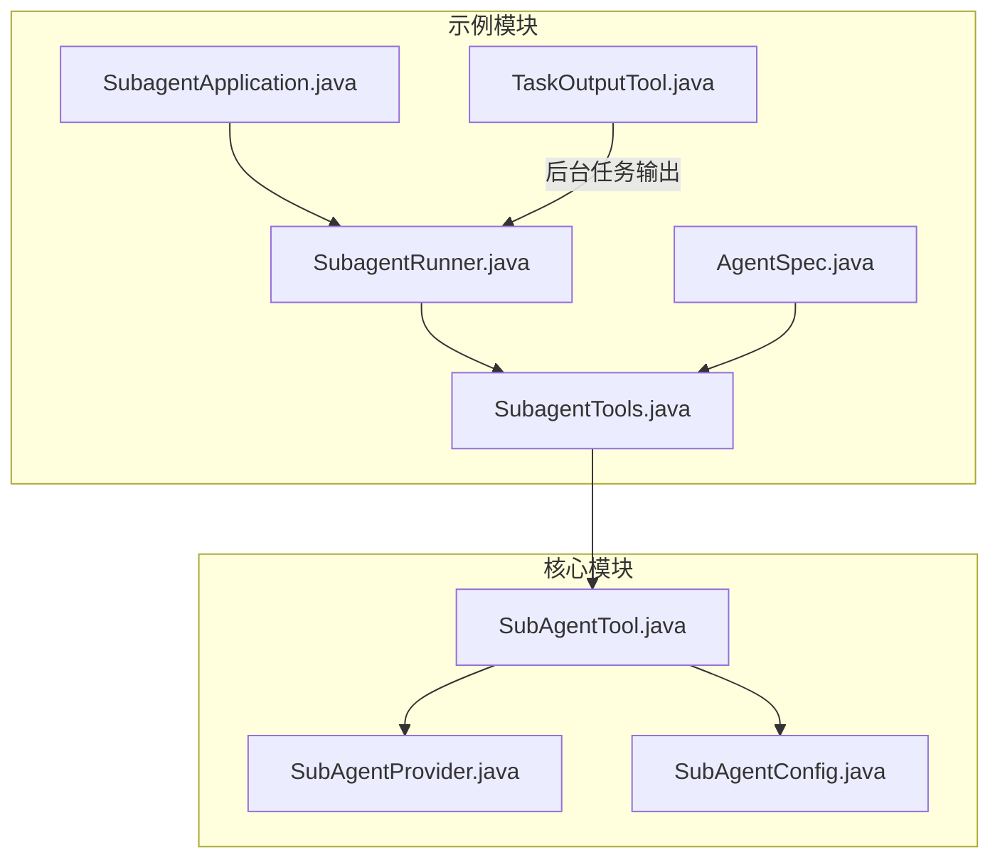
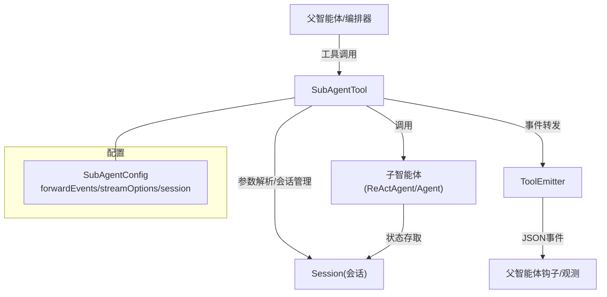
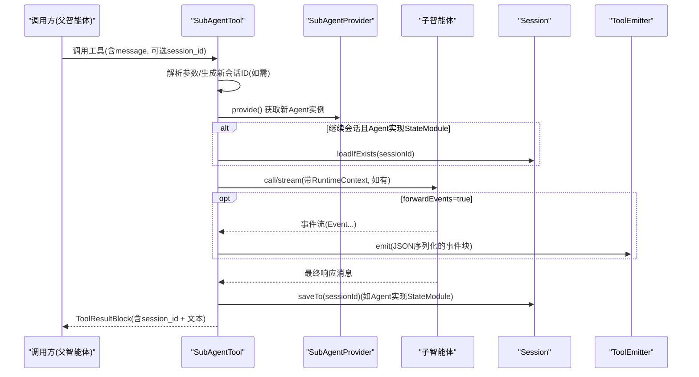
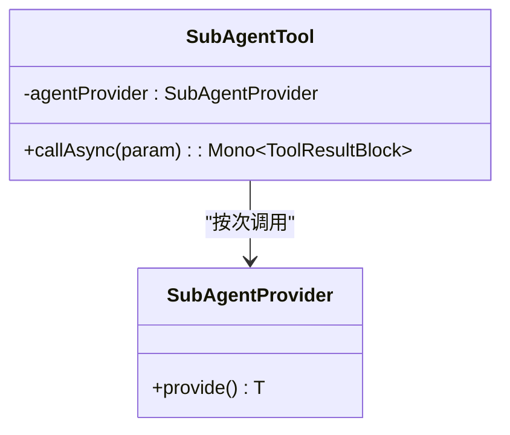
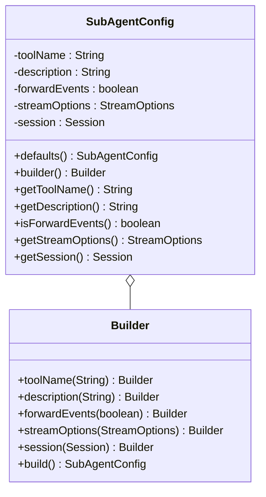
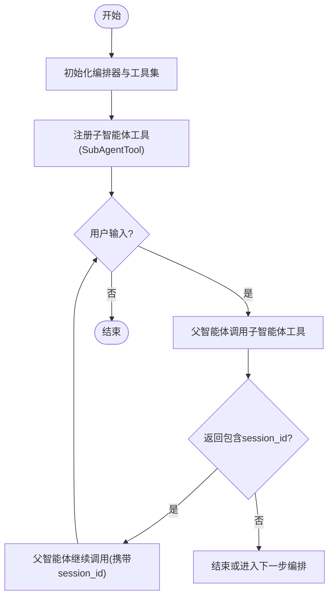
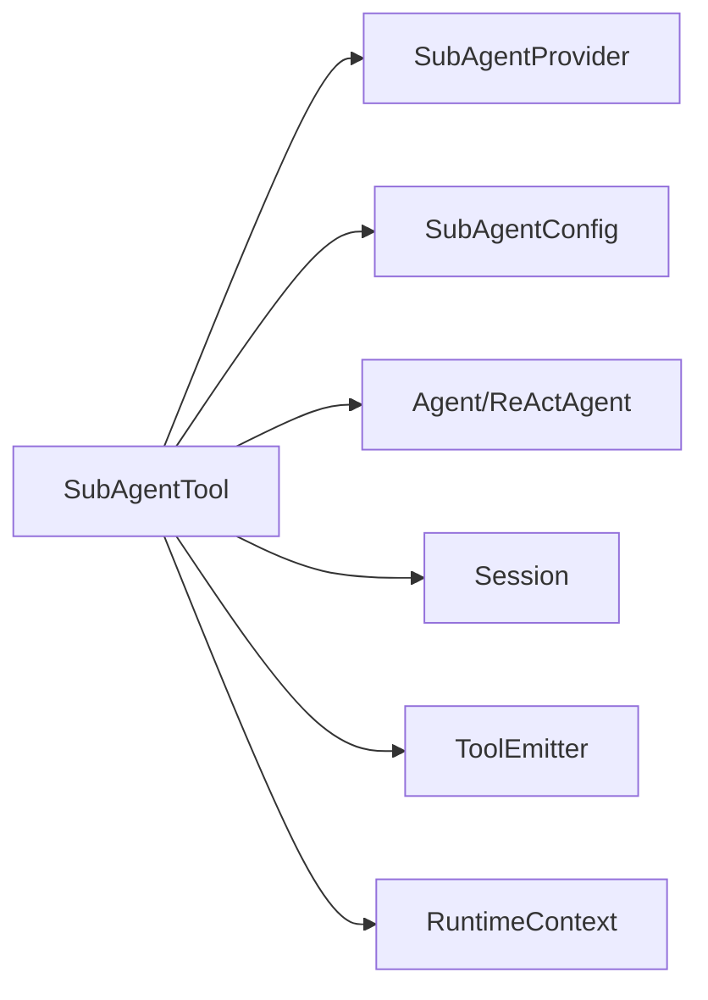

# 子智能体工具

<cite>
**本文引用的文件**
- [SubAgentTool.java](file://agentscope-core/src/main/java/io/agentscope/core/tool/subagent/SubAgentTool.java)
- [SubAgentProvider.java](file://agentscope-core/src/main/java/io/agentscope/core/tool/subagent/SubAgentProvider.java)
- [SubAgentConfig.java](file://agentscope-core/src/main/java/io/agentscope/core/tool/subagent/SubAgentConfig.java)
- [SubAgentToolTest.java](file://agentscope-core/src/test/java/io/agentscope/core/tool/subagent/SubAgentToolTest.java)
- [SubagentApplication.java](file://agentscope-examples/multiagent-patterns/subagent/src/main/java/io/agentscope/examples/subagent/SubagentApplication.java)
- [SubagentRunner.java](file://agentscope-examples/multiagent-patterns/subagent/src/main/java/io/agentscope/examples/subagent/SubagentRunner.java)
- [SubagentTools.java](file://agentscope-examples/multiagent-patterns/subagent/src/main/java/io/agentscope/examples/subagent/SubagentTools.java)
- [TaskOutputTool.java](file://agentscope-examples/multiagent-patterns/subagent/src/main/java/io/agentscope/examples/subagent/tools/task/TaskOutputTool.java)
- [AgentSpec.java](file://agentscope-examples/multiagent-patterns/subagent/src/main/java/io/agentscope/examples/subagent/tools/task/AgentSpec.java)
</cite>

## 目录
1. [引言](#引言)
2. [项目结构](#项目结构)
3. [核心组件](#核心组件)
4. [架构总览](#架构总览)
5. [详细组件分析](#详细组件分析)
6. [依赖分析](#依赖分析)
7. [性能考虑](#性能考虑)
8. [故障排查指南](#故障排查指南)
9. [结论](#结论)
10. [附录](#附录)

## 引言
本文件面向 AgentScope Java 的子智能体工具系统，系统性阐述“子智能体工具”的概念、设计原理与实现机制，重点覆盖以下主题：
- 子智能体工具的概念与应用场景：将复杂任务委派给子智能体执行，支持多轮对话与会话状态持久化。
- SubAgentTool 的设计与调用机制：如何解析输入参数、管理会话、选择流式或非流式执行、转发事件、构建结果。
- SubAgentProvider 的提供者模式与生命周期管理：确保线程安全与实例隔离。
- SubAgentConfig 的配置项与参数传递：工具名/描述推导、事件转发、流式选项、会话存储。
- 开发指南：配置策略、错误处理、状态同步、并发与命名规范。
- 调试与监控：事件转发、日志记录、运行时上下文传递。
- 在多智能体系统中的角色：与父智能体协作、工具注册、任务分解与编排。

## 项目结构
子智能体工具位于 agentscope-core 的 tool/subagent 包中，并在 multiagent-patterns 示例模块中有完整用法演示（如交互式编排、后台任务查询等）。

**图表来源**
- [SubAgentTool.java:1-550](file://agentscope-core/src/main/java/io/agentscope/core/tool/subagent/SubAgentTool.java#L1-L550)
- [SubAgentProvider.java:1-55](file://agentscope-core/src/main/java/io/agentscope/core/tool/subagent/SubAgentProvider.java#L1-L55)
- [SubAgentConfig.java:1-242](file://agentscope-core/src/main/java/io/agentscope/core/tool/subagent/SubAgentConfig.java#L1-L242)
- [SubagentApplication.java:1-42](file://agentscope-examples/multiagent-patterns/subagent/src/main/java/io/agentscope/examples/subagent/SubagentApplication.java#L1-L42)
- [SubagentRunner.java:1-75](file://agentscope-examples/multiagent-patterns/subagent/src/main/java/io/agentscope/examples/subagent/SubagentRunner.java#L1-L75)
- [SubagentTools.java:1-30](file://agentscope-examples/multiagent-patterns/subagent/src/main/java/io/agentscope/examples/subagent/SubagentTools.java#L1-L30)
- [TaskOutputTool.java:1-100](file://agentscope-examples/multiagent-patterns/subagent/src/main/java/io/agentscope/examples/subagent/tools/task/TaskOutputTool.java#L1-L100)
- [AgentSpec.java:1-60](file://agentscope-examples/multiagent-patterns/subagent/src/main/java/io/agentscope/examples/subagent/tools/task/AgentSpec.java#L1-L60)

**章节来源**
- [SubAgentTool.java:1-550](file://agentscope-core/src/main/java/io/agentscope/core/tool/subagent/SubAgentTool.java#L1-L550)
- [SubAgentProvider.java:1-55](file://agentscope-core/src/main/java/io/agentscope/core/tool/subagent/SubAgentProvider.java#L1-L55)
- [SubAgentConfig.java:1-242](file://agentscope-core/src/main/java/io/agentscope/core/tool/subagent/SubAgentConfig.java#L1-L242)
- [SubagentApplication.java:1-42](file://agentscope-examples/multiagent-patterns/subagent/src/main/java/io/agentscope/examples/subagent/SubagentApplication.java#L1-L42)
- [SubagentRunner.java:1-75](file://agentscope-examples/multiagent-patterns/subagent/src/main/java/io/agentscope/examples/subagent/SubagentRunner.java#L1-L75)
- [SubagentTools.java:1-30](file://agentscope-examples/multiagent-patterns/subagent/src/main/java/io/agentscope/examples/subagent/SubagentTools.java#L1-L30)
- [TaskOutputTool.java:1-100](file://agentscope-examples/multiagent-patterns/subagent/src/main/java/io/agentscope/examples/subagent/tools/task/TaskOutputTool.java#L1-L100)
- [AgentSpec.java:1-60](file://agentscope-examples/multiagent-patterns/subagent/src/main/java/io/agentscope/examples/subagent/tools/task/AgentSpec.java#L1-L60)

## 核心组件
- SubAgentTool：将任意 Agent 封装为可被其他智能体调用的工具，支持多轮对话、会话管理、事件转发与结果构建。
- SubAgentProvider：工厂接口，负责为每次调用提供新的 Agent 实例，保证线程安全与状态隔离。
- SubAgentConfig：配置类，控制工具名/描述推导、事件转发开关、流式选项、会话存储类型。

上述组件共同实现“将复杂任务委派给子智能体”的能力，并通过工具注册机制融入 Toolkit。

**章节来源**
- [SubAgentTool.java:63-104](file://agentscope-core/src/main/java/io/agentscope/core/tool/subagent/SubAgentTool.java#L63-L104)
- [SubAgentProvider.java:20-54](file://agentscope-core/src/main/java/io/agentscope/core/tool/subagent/SubAgentProvider.java#L20-L54)
- [SubAgentConfig.java:61-149](file://agentscope-core/src/main/java/io/agentscope/core/tool/subagent/SubAgentConfig.java#L61-L149)

## 架构总览
子智能体工具在多智能体系统中的位置如下：

**图表来源**
- [SubAgentTool.java:112-204](file://agentscope-core/src/main/java/io/agentscope/core/tool/subagent/SubAgentTool.java#L112-L204)
- [SubAgentConfig.java:115-149](file://agentscope-core/src/main/java/io/agentscope/core/tool/subagent/SubAgentConfig.java#L115-L149)
- [SubAgentProvider.java:23-53](file://agentscope-core/src/main/java/io/agentscope/core/tool/subagent/SubAgentProvider.java#L23-L53)

## 详细组件分析

### SubAgentTool 设计与调用机制
- 参数与模式
  - 输入参数：session_id（可选，用于继续已有会话）、message（必填，用户消息）。
  - 工具 Schema：定义为对象类型，包含 properties 与 required 列表。
- 会话生命周期
  - 新会话：未提供 session_id 时生成随机 UUID；继续会话：传入上一次返回的 session_id。
  - 状态加载/保存：若子智能体实现 StateModule，则在继续会话前从 Session 加载状态，在执行完成后保存。
- 执行路径
  - 流式执行：当 forwardEvents 为真且存在 ToolEmitter 时，使用 Agent.stream(...) 并逐个转发事件；最终从最后一个事件提取响应消息。
  - 非流式执行：直接调用 Agent.call(...)，不转发事件。
- 结果构建
  - 返回 ToolResultBlock，文本内容包含 session_id 前缀与子智能体响应正文，便于后续继续对话。
- 运行时上下文
  - 若 ToolCallParam 中携带 RuntimeContext 或父智能体的 AgentBase 提供的 RuntimeContext，将透传给子智能体的 call/stream 方法（ReActAgent 支持）。
- 名称与描述推导
  - 工具名优先使用配置，否则从 Agent 名称派生；描述优先配置，否则使用 Agent 描述，最后回退默认模板。
  - 对于非英文或过长名称，进行字符清洗与确定性哈希后截断，确保长度不超过 64 字符。

**图表来源**
- [SubAgentTool.java:131-204](file://agentscope-core/src/main/java/io/agentscope/core/tool/subagent/SubAgentTool.java#L131-L204)
- [SubAgentTool.java:257-319](file://agentscope-core/src/main/java/io/agentscope/core/tool/subagent/SubAgentTool.java#L257-L319)
- [SubAgentTool.java:321-348](file://agentscope-core/src/main/java/io/agentscope/core/tool/subagent/SubAgentTool.java#L321-L348)
- [SubAgentTool.java:387-395](file://agentscope-core/src/main/java/io/agentscope/core/tool/subagent/SubAgentTool.java#L387-L395)

**章节来源**
- [SubAgentTool.java:112-114](file://agentscope-core/src/main/java/io/agentscope/core/tool/subagent/SubAgentTool.java#L112-L114)
- [SubAgentTool.java:131-204](file://agentscope-core/src/main/java/io/agentscope/core/tool/subagent/SubAgentTool.java#L131-L204)
- [SubAgentTool.java:257-319](file://agentscope-core/src/main/java/io/agentscope/core/tool/subagent/SubAgentTool.java#L257-L319)
- [SubAgentTool.java:321-348](file://agentscope-core/src/main/java/io/agentscope/core/tool/subagent/SubAgentTool.java#L321-L348)
- [SubAgentTool.java:387-395](file://agentscope-core/src/main/java/io/agentscope/core/tool/subagent/SubAgentTool.java#L387-L395)
- [SubAgentTool.java:449-548](file://agentscope-core/src/main/java/io/agentscope/core/tool/subagent/SubAgentTool.java#L449-L548)

### SubAgentProvider 提供者模式与生命周期
- 角色定位：为每次工具调用提供一个全新 Agent 实例，避免 ReActAgent 等非线程安全组件的并发问题。
- 使用方式：在 Toolkit 注册时传入 SubAgentProvider，即可将任意 Agent 构建器暴露为工具。
- 生命周期要点：每次调用都会触发 provide()，确保会话状态与上下文隔离。

**图表来源**
- [SubAgentProvider.java:42-54](file://agentscope-core/src/main/java/io/agentscope/core/tool/subagent/SubAgentProvider.java#L42-L54)
- [SubAgentTool.java:84-94](file://agentscope-core/src/main/java/io/agentscope/core/tool/subagent/SubAgentTool.java#L84-L94)

**章节来源**
- [SubAgentProvider.java:20-54](file://agentscope-core/src/main/java/io/agentscope/core/tool/subagent/SubAgentProvider.java#L20-L54)
- [SubAgentToolTest.java:120-173](file://agentscope-core/src/test/java/io/agentscope/core/tool/subagent/SubAgentToolTest.java#L120-L173)

### SubAgentConfig 配置选项与参数传递
- 关键配置
  - toolName：显式指定工具名；为空则从 Agent 名称派生。
  - description：显式指定描述；为空则从 Agent 描述派生。
  - forwardEvents：是否转发子智能体事件到父智能体（默认开启）。
  - streamOptions：事件转发时的流式选项（事件类型、增量/累积等）。
  - session：会话存储，默认内存会话；可替换为持久化实现（如 JsonSession）。
- 参数传递
  - 通过 ToolCallParam 的 ToolExecutionContext 注入 RuntimeContext，SubAgentTool 会在合适时机传递给子智能体的 call/stream。

**图表来源**
- [SubAgentConfig.java:61-149](file://agentscope-core/src/main/java/io/agentscope/core/tool/subagent/SubAgentConfig.java#L61-L149)
- [SubAgentConfig.java:151-240](file://agentscope-core/src/main/java/io/agentscope/core/tool/subagent/SubAgentConfig.java#L151-L240)

**章节来源**
- [SubAgentConfig.java:23-60](file://agentscope-core/src/main/java/io/agentscope/core/tool/subagent/SubAgentConfig.java#L23-L60)
- [SubAgentConfig.java:115-149](file://agentscope-core/src/main/java/io/agentscope/core/tool/subagent/SubAgentConfig.java#L115-L149)
- [SubAgentToolTest.java:380-433](file://agentscope-core/src/test/java/io/agentscope/core/tool/subagent/SubAgentToolTest.java#L380-L433)

### 多智能体协作与任务分解
- 编排入口：示例应用通过 SubagentRunner 启动交互式编排，OrchestratorService 负责调度与对话。
- 子智能体注册：SubagentTools 汇总默认工具与子智能体构建器，统一注入到编排图中。
- 任务分解：AgentSpec 定义子智能体规格（名称、描述、系统提示、工具过滤），TaskOutputTool 提供后台任务查询能力。
- 会话延续：父智能体从子智能体返回的 ToolResultBlock 中提取 session_id，再次调用以延续对话。

**图表来源**
- [SubagentApplication.java:25-41](file://agentscope-examples/multiagent-patterns/subagent/src/main/java/io/agentscope/examples/subagent/SubagentApplication.java#L25-L41)
- [SubagentRunner.java:31-74](file://agentscope-examples/multiagent-patterns/subagent/src/main/java/io/agentscope/examples/subagent/SubagentRunner.java#L31-L74)
- [SubagentTools.java:26-29](file://agentscope-examples/multiagent-patterns/subagent/src/main/java/io/agentscope/examples/subagent/SubagentTools.java#L26-L29)
- [TaskOutputTool.java:43-98](file://agentscope-examples/multiagent-patterns/subagent/src/main/java/io/agentscope/examples/subagent/tools/task/TaskOutputTool.java#L43-L98)
- [AgentSpec.java:27-51](file://agentscope-examples/multiagent-patterns/subagent/src/main/java/io/agentscope/examples/subagent/tools/task/AgentSpec.java#L27-L51)

**章节来源**
- [SubagentApplication.java:25-41](file://agentscope-examples/multiagent-patterns/subagent/src/main/java/io/agentscope/examples/subagent/SubagentApplication.java#L25-L41)
- [SubagentRunner.java:31-74](file://agentscope-examples/multiagent-patterns/subagent/src/main/java/io/agentscope/examples/subagent/SubagentRunner.java#L31-L74)
- [SubagentTools.java:26-29](file://agentscope-examples/multiagent-patterns/subagent/src/main/java/io/agentscope/examples/subagent/SubagentTools.java#L26-L29)
- [TaskOutputTool.java:43-98](file://agentscope-examples/multiagent-patterns/subagent/src/main/java/io/agentscope/examples/subagent/tools/task/TaskOutputTool.java#L43-L98)
- [AgentSpec.java:27-51](file://agentscope-examples/multiagent-patterns/subagent/src/main/java/io/agentscope/examples/subagent/tools/task/AgentSpec.java#L27-L51)

## 依赖分析
- 组件内聚与耦合
  - SubAgentTool 依赖 SubAgentProvider 与 SubAgentConfig，同时与 Session、Agent、ToolEmitter、RuntimeContext 等解耦。
  - SubAgentProvider 仅定义提供新实例的契约，低耦合。
  - SubAgentConfig 提供集中式配置，便于扩展与测试。
- 外部依赖点
  - Session 接口用于状态持久化；默认 InMemorySession，可替换为 JsonSession 等持久化实现。
  - ReActAgent 支持在流式/非流式两种模式下传递 RuntimeContext。
  - ToolEmitter 用于事件转发；当未提供时，内部使用 NoOpToolEmitter。

**图表来源**
- [SubAgentTool.java:75-76](file://agentscope-core/src/main/java/io/agentscope/core/tool/subagent/SubAgentTool.java#L75-L76)
- [SubAgentConfig.java:147-148](file://agentscope-core/src/main/java/io/agentscope/core/tool/subagent/SubAgentConfig.java#L147-L148)

**章节来源**
- [SubAgentTool.java:321-348](file://agentscope-core/src/main/java/io/agentscope/core/tool/subagent/SubAgentTool.java#L321-L348)
- [SubAgentConfig.java:140-149](file://agentscope-core/src/main/java/io/agentscope/core/tool/subagent/SubAgentConfig.java#L140-L149)

## 性能考虑
- 线程安全与实例隔离：每次调用通过 SubAgentProvider 提供全新 Agent 实例，避免共享状态带来的锁竞争与上下文污染。
- 事件转发成本：forwardEvents=true 时，事件序列化与网络传输可能带来额外开销；建议在生产环境按需启用并限制事件类型。
- 会话持久化：使用持久化 Session（如 JsonSession）可跨进程保留状态，但需权衡磁盘 IO 与序列化成本。
- 命名与长度：工具名自动清洗与截断，避免超出 API 限制导致的重试与失败。

[本节为通用指导，无需特定文件引用]

## 故障排查指南
- 常见问题与定位
  - 会话未延续：检查返回结果中是否包含 session_id，以及后续调用是否正确传递该字段。
  - 事件未转发：确认 SubAgentConfig.forwardEvents 是否为 true，以及 ToolCallParam 中是否提供了 ToolEmitter。
  - 状态加载/保存失败：查看 Session 实现的日志，确认序列化/反序列化异常与权限问题。
  - 命名冲突或超长：关注工具名生成日志，必要时手动设置 toolName。
- 单元测试参考
  - 工具注册与描述：验证工具名/描述是否按预期派生或覆盖。
  - 会话与状态：验证多次调用是否创建了多个 Agent 实例，且状态通过 Session 正确保存。
  - 事件转发：验证 forwardEvents=true/false 时是否调用 stream/call，以及是否产生/不产生事件块。
  - 运行时上下文：验证 RuntimeContext 是否正确传递至子智能体的 call/stream。

**章节来源**
- [SubAgentToolTest.java:58-250](file://agentscope-core/src/test/java/io/agentscope/core/tool/subagent/SubAgentToolTest.java#L58-L250)
- [SubAgentToolTest.java:251-433](file://agentscope-core/src/test/java/io/agentscope/core/tool/subagent/SubAgentToolTest.java#L251-L433)
- [SubAgentToolTest.java:434-565](file://agentscope-core/src/test/java/io/agentscope/core/tool/subagent/SubAgentToolTest.java#L434-L565)

## 结论
子智能体工具通过“提供者模式 + 配置化 + 会话状态管理 + 事件转发”的组合，实现了将复杂任务委派给子智能体的能力，并在多智能体编排中扮演“可复用工具”和“状态桥梁”的双重角色。借助清晰的生命周期与可观测性（事件转发、日志、运行时上下文），开发者可以高效地构建稳定、可调试、可扩展的多智能体协作系统。

[本节为总结性内容，无需特定文件引用]

## 附录

### 开发指南：配置策略与最佳实践
- 工具命名
  - 优先显式配置 toolName，确保与上游工具注册一致。
  - 对非英文或过长名称，系统会自动生成确定性哈希后缀，避免冲突。
- 描述与用途
  - 显式配置 description，提升工具可发现性与可维护性。
- 事件转发
  - 默认开启 forwardEvents，便于调试与可观测；在高吞吐场景可按需关闭。
  - 使用 StreamOptions 精细控制事件类型与增量模式。
- 会话持久化
  - 生产环境建议使用持久化 Session（如 JsonSession），并配置合理的清理策略。
- 并发与状态
  - 依赖 SubAgentProvider 每次提供新实例，避免共享状态；必要时在子智能体内部实现幂等处理。
- 错误处理
  - 工具层对会话初始化、事件序列化、执行异常进行捕获并返回错误块，保持调用方可控。
- 状态同步
  - 通过 ToolResultBlock 中的 session_id 实现父/子智能体之间的状态同步；父智能体应将 session_id 作为后续调用的输入。

**章节来源**
- [SubAgentConfig.java:23-60](file://agentscope-core/src/main/java/io/agentscope/core/tool/subagent/SubAgentConfig.java#L23-L60)
- [SubAgentTool.java:449-548](file://agentscope-core/src/main/java/io/agentscope/core/tool/subagent/SubAgentTool.java#L449-L548)
- [SubAgentTool.java:216-243](file://agentscope-core/src/main/java/io/agentscope/core/tool/subagent/SubAgentTool.java#L216-L243)

### 调试与监控方法
- 事件转发
  - 通过 ToolEmitter 接收子智能体的事件块（JSON 序列化），结合父智能体钩子进行可视化与审计。
- 日志
  - 关注会话加载/保存、事件序列化、执行异常等关键日志节点。
- 运行时上下文
  - 在 ToolCallParam 中注入 RuntimeContext，确保父子智能体上下文一致。
- 示例应用
  - 使用 SubagentRunner 启动交互式编排，观察事件流与响应链路。

**章节来源**
- [SubAgentTool.java:361-375](file://agentscope-core/src/main/java/io/agentscope/core/tool/subagent/SubAgentTool.java#L361-L375)
- [SubagentRunner.java:31-74](file://agentscope-examples/multiagent-patterns/subagent/src/main/java/io/agentscope/examples/subagent/SubagentRunner.java#L31-L74)