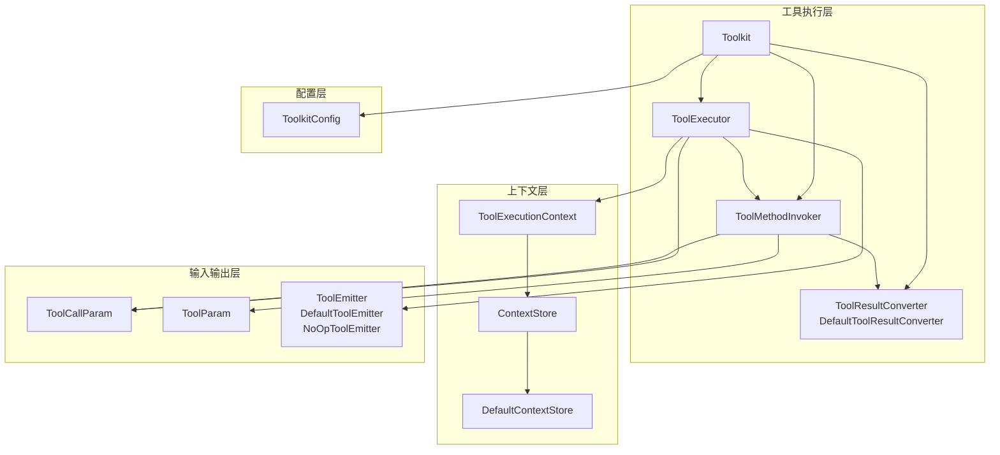
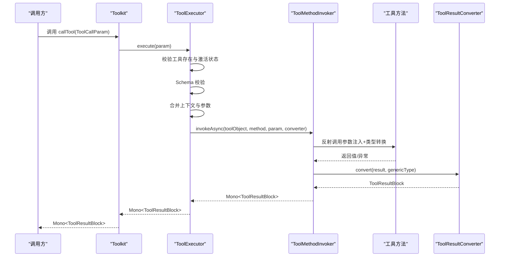
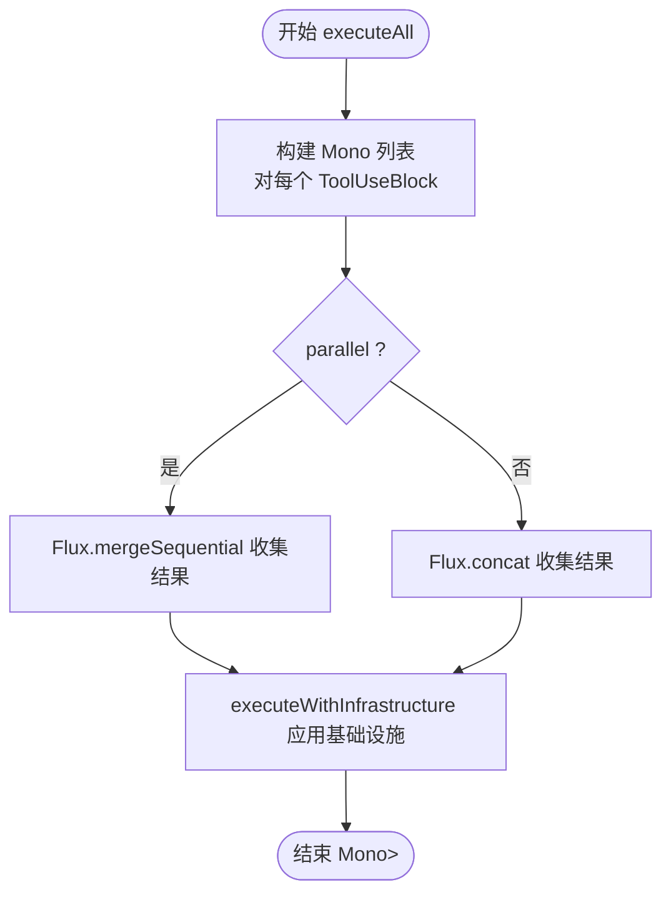
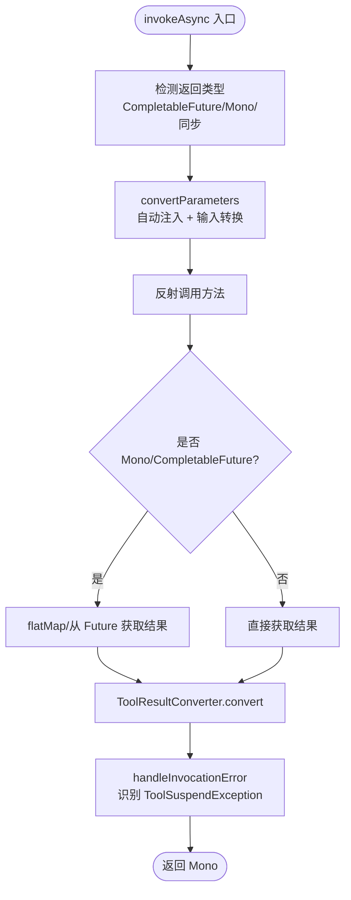
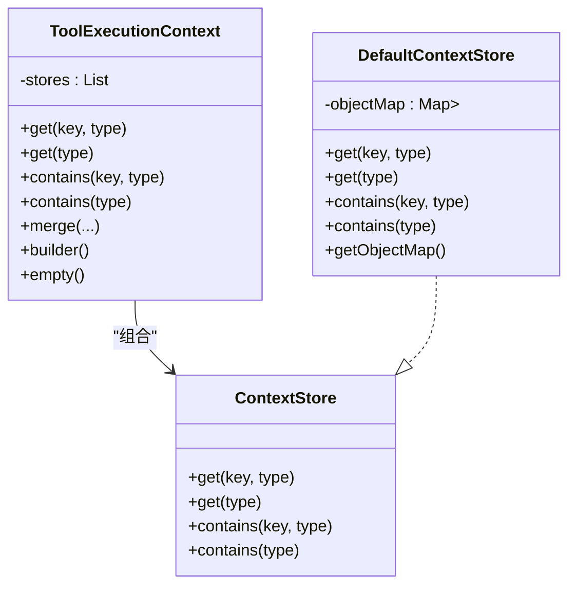
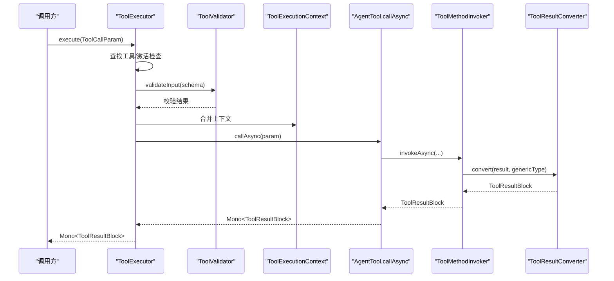
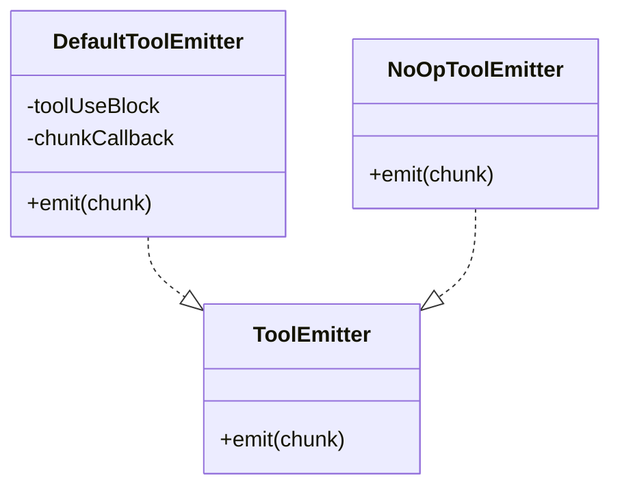
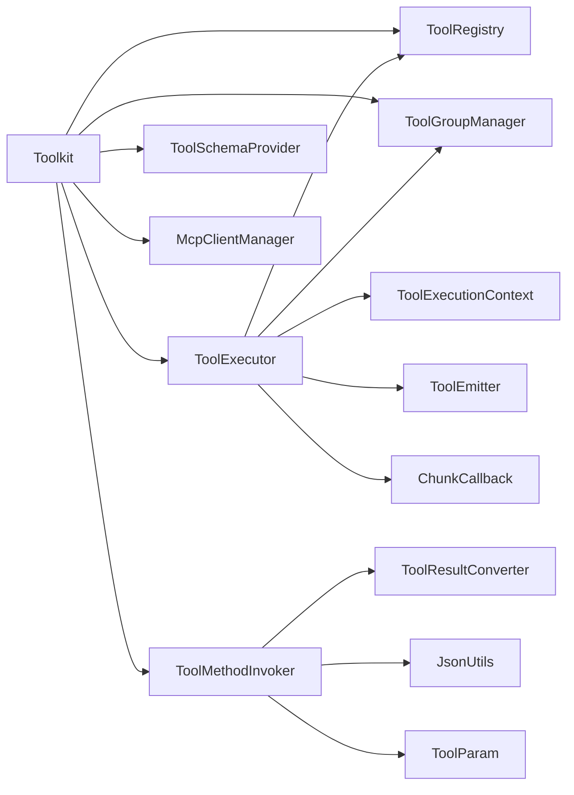

# 工具执行系统

<cite>
**本文引用的文件**
- [ToolExecutor.java](file://agentscope-core/src/main/java/io/agentscope/core/tool/ToolExecutor.java)
- [ToolMethodInvoker.java](file://agentscope-core/src/main/java/io/agentscope/core/tool/ToolMethodInvoker.java)
- [ToolExecutionContext.java](file://agentscope-core/src/main/java/io/agentscope/core/tool/ToolExecutionContext.java)
- [Toolkit.java](file://agentscope-core/src/main/java/io/agentscope/core/tool/Toolkit.java)
- [ToolCallParam.java](file://agentscope-core/src/main/java/io/agentscope/core/tool/ToolCallParam.java)
- [ToolParam.java](file://agentscope-core/src/main/java/io/agentscope/core/tool/ToolParam.java)
- [ToolResultConverter.java](file://agentscope-core/src/main/java/io/agentscope/core/tool/ToolResultConverter.java)
- [DefaultToolResultConverter.java](file://agentscope-core/src/main/java/io/agentscope/core/tool/DefaultToolResultConverter.java)
- [ToolkitConfig.java](file://agentscope-core/src/main/java/io/agentscope/core/tool/ToolkitConfig.java)
- [ToolEmitter.java](file://agentscope-core/src/main/java/io/agentscope/core/tool/ToolEmitter.java)
- [DefaultToolEmitter.java](file://agentscope-core/src/main/java/io/agentscope/core/tool/DefaultToolEmitter.java)
- [NoOpToolEmitter.java](file://agentscope-core/src/main/java/io/agentscope/core/tool/NoOpToolEmitter.java)
- [ContextStore.java](file://agentscope-core/src/main/java/io/agentscope/core/tool/ContextStore.java)
- [DefaultContextStore.java](file://agentscope-core/src/main/java/io/agentscope/core/tool/DefaultContextStore.java)
</cite>

## 目录
1. [简介](#简介)
2. [项目结构](#项目结构)
3. [核心组件](#核心组件)
4. [架构总览](#架构总览)
5. [详细组件分析](#详细组件分析)
6. [依赖关系分析](#依赖关系分析)
7. [性能考虑](#性能考虑)
8. [故障排查指南](#故障排查指南)
9. [结论](#结论)
10. [附录](#附录)

## 简介
本文件面向 AgentScope Java 工具执行系统，围绕 ToolExecutor 的并发执行策略（并行/串行）、ToolMethodInvoker 的方法调用流程（参数验证、类型转换、异常处理）、ToolExecutionContext 的上下文传递与状态管理、工具执行生命周期（从参数解析到结果返回）进行深入技术说明，并提供性能优化建议、错误处理模式与调试技巧。

## 项目结构
工具执行系统位于 agentscope-core 模块的 tool 包中，核心类包括：
- 执行器：ToolExecutor、Toolkit
- 方法调用：ToolMethodInvoker
- 上下文：ToolExecutionContext、ContextStore、DefaultContextStore
- 参数与注解：ToolCallParam、ToolParam
- 结果转换：ToolResultConverter、DefaultToolResultConverter
- 流式输出：ToolEmitter、DefaultToolEmitter、NoOpToolEmitter
- 配置：ToolkitConfig

图表来源
- [Toolkit.java:66-117](file://agentscope-core/src/main/java/io/agentscope/core/tool/Toolkit.java#L66-L117)
- [ToolExecutor.java:57-94](file://agentscope-core/src/main/java/io/agentscope/core/tool/ToolExecutor.java#L57-L94)
- [ToolMethodInvoker.java:37-43](file://agentscope-core/src/main/java/io/agentscope/core/tool/ToolMethodInvoker.java#L37-L43)
- [ToolExecutionContext.java:48-57](file://agentscope-core/src/main/java/io/agentscope/core/tool/ToolExecutionContext.java#L48-L57)
- [ContextStore.java:51-51](file://agentscope-core/src/main/java/io/agentscope/core/tool/ContextStore.java#L51-L51)
- [DefaultContextStore.java:29-48](file://agentscope-core/src/main/java/io/agentscope/core/tool/DefaultContextStore.java#L29-L48)
- [ToolCallParam.java:44-58](file://agentscope-core/src/main/java/io/agentscope/core/tool/ToolCallParam.java#L44-L58)
- [ToolParam.java:24-58](file://agentscope-core/src/main/java/io/agentscope/core/tool/ToolParam.java#L24-L58)
- [ToolResultConverter.java:48-58](file://agentscope-core/src/main/java/io/agentscope/core/tool/ToolResultConverter.java#L48-L58)
- [DefaultToolResultConverter.java:39-59](file://agentscope-core/src/main/java/io/agentscope/core/tool/DefaultToolResultConverter.java#L39-L59)
- [ToolkitConfig.java:32-46](file://agentscope-core/src/main/java/io/agentscope/core/tool/ToolkitConfig.java#L32-L46)
- [ToolEmitter.java:59-71](file://agentscope-core/src/main/java/io/agentscope/core/tool/ToolEmitter.java#L59-L71)
- [DefaultToolEmitter.java:28-43](file://agentscope-core/src/main/java/io/agentscope/core/tool/DefaultToolEmitter.java#L28-L43)
- [NoOpToolEmitter.java:26-44](file://agentscope-core/src/main/java/io/agentscope/core/tool/NoOpToolEmitter.java#L26-L44)

章节来源
- [Toolkit.java:37-65](file://agentscope-core/src/main/java/io/agentscope/core/tool/Toolkit.java#L37-L65)
- [ToolExecutor.java:39-56](file://agentscope-core/src/main/java/io/agentscope/core/tool/ToolExecutor.java#L39-L56)

## 核心组件
- ToolExecutor：统一的工具执行器，负责单次与批量工具执行、并发控制、超时与重试、调度与优雅停机保护、流式回调组合等。
- ToolMethodInvoker：基于反射的方法调用器，负责参数自动注入、类型转换、返回值转换与异常处理。
- ToolExecutionContext：工具执行上下文门面，支持多级优先级存储（调用/代理/工具包/外部），提供合并与查询能力。
- Toolkit：工具包门面，聚合注册、分组、模式生成、执行器与方法调用器，暴露高层 API。
- ToolCallParam/ToolParam：工具调用参数封装与参数注解，支撑参数映射与 JSON Schema 生成。
- ToolResultConverter/DefaultToolResultConverter：结果转换接口与默认实现，负责将任意返回值序列化为 ToolResultBlock。
- ToolEmitter/DefaultToolEmitter/NoOpToolEmitter：流式输出发射器，支持中间进度上报与钩子转发。
- ToolkitConfig：执行配置，控制并行、自定义线程池、默认执行配置与默认上下文。

章节来源
- [ToolExecutor.java:57-94](file://agentscope-core/src/main/java/io/agentscope/core/tool/ToolExecutor.java#L57-L94)
- [ToolMethodInvoker.java:37-43](file://agentscope-core/src/main/java/io/agentscope/core/tool/ToolMethodInvoker.java#L37-L43)
- [ToolExecutionContext.java:48-57](file://agentscope-core/src/main/java/io/agentscope/core/tool/ToolExecutionContext.java#L48-L57)
- [Toolkit.java:66-117](file://agentscope-core/src/main/java/io/agentscope/core/tool/Toolkit.java#L66-L117)
- [ToolCallParam.java:44-58](file://agentscope-core/src/main/java/io/agentscope/core/tool/ToolCallParam.java#L44-L58)
- [ToolParam.java:24-58](file://agentscope-core/src/main/java/io/agentscope/core/tool/ToolParam.java#L24-L58)
- [ToolResultConverter.java:48-58](file://agentscope-core/src/main/java/io/agentscope/core/tool/ToolResultConverter.java#L48-L58)
- [DefaultToolResultConverter.java:39-59](file://agentscope-core/src/main/java/io/agentscope/core/tool/DefaultToolResultConverter.java#L39-L59)
- [ToolEmitter.java:59-71](file://agentscope-core/src/main/java/io/agentscope/core/tool/ToolEmitter.java#L59-L71)
- [ToolkitConfig.java:32-46](file://agentscope-core/src/main/java/io/agentscope/core/tool/ToolkitConfig.java#L32-L46)

## 架构总览
工具执行系统采用“门面 + 委派”的架构：
- Toolkit 作为门面，持有 ToolExecutor、ToolMethodInvoker、ToolRegistry、ToolGroupManager 等组件。
- ToolExecutor 负责执行基础设施（调度、超时、重试、优雅停机）、参数合并与上下文合并、Schema 校验、实际调用与结果包装。
- ToolMethodInvoker 负责反射调用、参数注入与类型转换、返回值转换与异常处理。
- ToolExecutionContext 提供多层上下文存储与合并，支持用户自定义对象注入。

图表来源
- [Toolkit.java:489-491](file://agentscope-core/src/main/java/io/agentscope/core/tool/Toolkit.java#L489-L491)
- [ToolExecutor.java:166-264](file://agentscope-core/src/main/java/io/agentscope/core/tool/ToolExecutor.java#L166-L264)
- [ToolMethodInvoker.java:54-121](file://agentscope-core/src/main/java/io/agentscope/core/tool/ToolMethodInvoker.java#L54-L121)
- [ToolResultConverter.java:50-57](file://agentscope-core/src/main/java/io/agentscope/core/tool/ToolResultConverter.java#L50-L57)

## 详细组件分析

### 并发执行策略（并行/串行选择机制）
- 选择依据
  - ToolkitConfig.isParallel() 决定批量执行时使用并行还是串行。
  - 并行：Flux.mergeSequential，适合 I/O 密集且独立的工具调用。
  - 串行：Flux.concat，保证顺序与资源占用可控。
- 执行路径
  - Toolkit.callTools(...) 合并执行配置后，委托 ToolExecutor.executeAll(...)。
  - executeAll(...) 对每个 ToolUseBlock 构建 ToolCallParam，调用 executeWithInfrastructure(...)。
  - executeWithInfrastructure(...) 将执行链按“调度 → 超时 → 重试 → 优雅停机保护”顺序叠加。
- 线程模型
  - 若未提供自定义 ExecutorService，则使用 Reactor Schedulers.boundedElastic() 进行 subscribeOn。
  - 若提供自定义 ExecutorService，则通过 Schedulers.fromExecutor(executorService) 切换线程池。

图表来源
- [ToolExecutor.java:278-304](file://agentscope-core/src/main/java/io/agentscope/core/tool/ToolExecutor.java#L278-L304)
- [ToolExecutor.java:309-341](file://agentscope-core/src/main/java/io/agentscope/core/tool/ToolExecutor.java#L309-L341)
- [Toolkit.java:510-524](file://agentscope-core/src/main/java/io/agentscope/core/tool/Toolkit.java#L510-L524)
- [ToolkitConfig.java:53-55](file://agentscope-core/src/main/java/io/agentscope/core/tool/ToolkitConfig.java#L53-L55)

章节来源
- [ToolExecutor.java:278-341](file://agentscope-core/src/main/java/io/agentscope/core/tool/ToolExecutor.java#L278-L341)
- [Toolkit.java:510-524](file://agentscope-core/src/main/java/io/agentscope/core/tool/Toolkit.java#L510-L524)
- [ToolkitConfig.java:126-144](file://agentscope-core/src/main/java/io/agentscope/core/tool/ToolkitConfig.java#L126-L144)

### 方法调用流程（参数验证、类型转换、异常处理）
- 参数注入与转换
  - 自动注入：ToolEmitter、Agent、ToolExecutionContext、RuntimeContext。
  - 用户 POJO 注入：从 ToolExecutionContext 解析，遵循“非 ToolParam、非基础类型、非框架消息类型”规则。
  - 输入参数转换：优先直接赋值（类型兼容且无泛型信息），否则使用 JsonCodec 带泛型信息转换；失败回退字符串转基本类型。
- 返回值转换
  - 默认转换器将 null 转为文本“null”，void 转为文本“Done”，ToolResultBlock 直接透传，其他对象 JSON 序列化。
- 异常处理
  - 特殊处理 ToolSuspendException：在异常链中识别并抛出，由上层包装为 suspended 结果。
  - 其他异常：提取错误信息并包装为 ToolResultBlock.error。

图表来源
- [ToolMethodInvoker.java:54-121](file://agentscope-core/src/main/java/io/agentscope/core/tool/ToolMethodInvoker.java#L54-L121)
- [ToolMethodInvoker.java:144-185](file://agentscope-core/src/main/java/io/agentscope/core/tool/ToolMethodInvoker.java#L144-L185)
- [ToolMethodInvoker.java:271-303](file://agentscope-core/src/main/java/io/agentscope/core/tool/ToolMethodInvoker.java#L271-L303)
- [ToolResultConverter.java:50-57](file://agentscope-core/src/main/java/io/agentscope/core/tool/ToolResultConverter.java#L50-L57)
- [DefaultToolResultConverter.java:43-59](file://agentscope-core/src/main/java/io/agentscope/core/tool/DefaultToolResultConverter.java#L43-L59)

章节来源
- [ToolMethodInvoker.java:123-368](file://agentscope-core/src/main/java/io/agentscope/core/tool/ToolMethodInvoker.java#L123-L368)
- [DefaultToolResultConverter.java:39-98](file://agentscope-core/src/main/java/io/agentscope/core/tool/DefaultToolResultConverter.java#L39-L98)

### 上下文传递机制与状态管理
- 存储抽象
  - ContextStore 定义按类型或键+类型的检索接口。
  - DefaultContextStore 使用两级 Map 实现：Class → (Key → Object)，支持单例与多实例场景。
- 上下文合并
  - ToolExecutionContext.merge 将多个上下文按优先级合并，先注册者优先。
  - ToolExecutor 在执行前合并调用级上下文与工具包默认上下文。
- 查询优先级
  - get(key, type) → get(type) → 下一个存储，直至命中或返回 null。

图表来源
- [ContextStore.java:51-115](file://agentscope-core/src/main/java/io/agentscope/core/tool/ContextStore.java#L51-L115)
- [DefaultContextStore.java:29-160](file://agentscope-core/src/main/java/io/agentscope/core/tool/DefaultContextStore.java#L29-L160)
- [ToolExecutionContext.java:48-162](file://agentscope-core/src/main/java/io/agentscope/core/tool/ToolExecutionContext.java#L48-L162)

章节来源
- [ToolExecutionContext.java:137-162](file://agentscope-core/src/main/java/io/agentscope/core/tool/ToolExecutionContext.java#L137-L162)
- [DefaultContextStore.java:162-284](file://agentscope-core/src/main/java/io/agentscope/core/tool/DefaultContextStore.java#L162-L284)

### 工具执行生命周期（从参数解析到结果返回）
- 单次执行
  - Tracer 包裹 → 查找工具与激活状态 → Schema 校验 → 合并上下文与参数 → 创建流式发射器 → 调用工具 → 处理 ToolSuspendException → 错误包装 → 返回 ToolResultBlock。
- 批量执行
  - 对每个 ToolUseBlock 构造 ToolCallParam → 应用调度/超时/重试/优雅停机 → 组合结果 → 添加元数据（id/name）。
- 流式回调
  - 用户回调与内部回调可同时生效，避免阻塞其他回调。

图表来源
- [ToolExecutor.java:166-264](file://agentscope-core/src/main/java/io/agentscope/core/tool/ToolExecutor.java#L166-L264)
- [ToolMethodInvoker.java:54-121](file://agentscope-core/src/main/java/io/agentscope/core/tool/ToolMethodInvoker.java#L54-L121)
- [ToolResultConverter.java:50-57](file://agentscope-core/src/main/java/io/agentscope/core/tool/ToolResultConverter.java#L50-L57)

章节来源
- [ToolExecutor.java:158-264](file://agentscope-core/src/main/java/io/agentscope/core/tool/ToolExecutor.java#L158-L264)
- [Toolkit.java:489-491](file://agentscope-core/src/main/java/io/agentscope/core/tool/Toolkit.java#L489-L491)

### 流式输出与回调
- ToolEmitter 接口允许工具在执行过程中发送中间结果，这些结果仅用于钩子事件，不会发送给 LLM。
- DefaultToolEmitter 将 chunk 回调给框架内部与用户回调（若配置）。
- NoOpToolEmitter 为空实现，避免空指针。

图表来源
- [ToolEmitter.java:59-71](file://agentscope-core/src/main/java/io/agentscope/core/tool/ToolEmitter.java#L59-L71)
- [DefaultToolEmitter.java:28-60](file://agentscope-core/src/main/java/io/agentscope/core/tool/DefaultToolEmitter.java#L28-L60)
- [NoOpToolEmitter.java:26-45](file://agentscope-core/src/main/java/io/agentscope/core/tool/NoOpToolEmitter.java#L26-L45)

章节来源
- [DefaultToolEmitter.java:39-60](file://agentscope-core/src/main/java/io/agentscope/core/tool/DefaultToolEmitter.java#L39-L60)
- [NoOpToolEmitter.java:26-45](file://agentscope-core/src/main/java/io/agentscope/core/tool/NoOpToolEmitter.java#L26-L45)

## 依赖关系分析
- 组件耦合
  - Toolkit 聚合 ToolExecutor、ToolMethodInvoker、ToolRegistry、ToolGroupManager、ToolSchemaProvider、McpClientManager。
  - ToolExecutor 依赖 ToolRegistry、ToolGroupManager、ToolExecutionContext、ToolEmitter、TracerRegistry、GracefulShutdownManager。
  - ToolMethodInvoker 依赖 ToolResultConverter、JsonUtils、ToolParam 注解、ToolSuspendException。
- 关键依赖链
  - Toolkit → ToolExecutor → ToolMethodInvoker → ToolResultConverter
  - ToolExecutor → ToolExecutionContext（合并）
  - ToolExecutor → ToolEmitter（流式回调）

图表来源
- [Toolkit.java:66-117](file://agentscope-core/src/main/java/io/agentscope/core/tool/Toolkit.java#L66-L117)
- [ToolExecutor.java:57-94](file://agentscope-core/src/main/java/io/agentscope/core/tool/ToolExecutor.java#L57-L94)
- [ToolMethodInvoker.java:37-43](file://agentscope-core/src/main/java/io/agentscope/core/tool/ToolMethodInvoker.java#L37-L43)

章节来源
- [Toolkit.java:66-117](file://agentscope-core/src/main/java/io/agentscope/core/tool/Toolkit.java#L66-L117)
- [ToolExecutor.java:57-94](file://agentscope-core/src/main/java/io/agentscope/core/tool/ToolExecutor.java#L57-L94)

## 性能考虑
- 线程池配置
  - 默认使用 Reactor Schedulers.boundedElastic()，适合 I/O 密集工具；对于 CPU 密集工具，建议通过 ToolkitConfig 提供自定义 ExecutorService。
  - 并行执行会增加线程与内存开销，需结合工具数量与资源限制评估。
- 超时与重试
  - ExecutionConfig 提供超时与重试配置；合理设置初始/最大退避与过滤条件，避免无限重试导致资源耗尽。
  - 优雅停机保护通过全局信号与 Mono.firstWithSignal 实现，确保系统关闭时及时中断执行。
- 结果转换
  - 大对象序列化可能成为瓶颈，可自定义 ToolResultConverter 进行压缩或摘要化。
- 参数转换
  - JsonCodec 转换保留泛型类型信息，避免精度丢失；对复杂类型建议提供明确的 JSON Schema 与注解。

章节来源
- [ToolkitConfig.java:126-168](file://agentscope-core/src/main/java/io/agentscope/core/tool/ToolkitConfig.java#L126-L168)
- [ToolExecutor.java:352-402](file://agentscope-core/src/main/java/io/agentscope/core/tool/ToolExecutor.java#L352-L402)
- [DefaultToolResultConverter.java:86-96](file://agentscope-core/src/main/java/io/agentscope/core/tool/DefaultToolResultConverter.java#L86-L96)

## 故障排查指南
- 常见问题
  - 工具未找到或未激活：检查 ToolRegistry 与 ToolGroupManager 的注册与激活状态。
  - 参数校验失败：核对 ToolParam 注解与 JSON Schema，确保名称一致且必填项齐全。
  - 类型转换异常：确认输入类型与目标类型兼容，必要时提供更精确的注解或自定义转换器。
  - ToolSuspendException：属于正常挂起流程，由上层包装为 suspended 结果，无需视为错误。
  - 流式回调未触发：确认已设置 ChunkCallback，且工具方法声明了 ToolEmitter 参数。
- 调试技巧
  - 启用 DEBUG 日志以查看工具名、超时与重试信息。
  - 使用 Toolkit.copy() 深拷贝工具包，保留用户回调，便于在 ReActAgent 中复用。
  - 分别测试单次与批量执行，定位并发相关问题。

章节来源
- [ToolExecutor.java:183-264](file://agentscope-core/src/main/java/io/agentscope/core/tool/ToolExecutor.java#L183-L264)
- [ToolMethodInvoker.java:351-368](file://agentscope-core/src/main/java/io/agentscope/core/tool/ToolMethodInvoker.java#L351-L368)
- [Toolkit.java:725-738](file://agentscope-core/src/main/java/io/agentscope/core/tool/Toolkit.java#L725-L738)

## 结论
AgentScope Java 工具执行系统通过 Toolkit 门面整合执行器、方法调用器与上下文管理，提供统一的并发控制、参数校验、类型转换与结果包装能力。其设计强调可扩展性（自定义线程池、转换器、上下文存储）与可观测性（流式回调、日志与追踪）。遵循本文的并发策略、参数与类型转换规范、上下文合并原则以及性能与故障排查建议，可在保证稳定性的同时获得良好的执行效率。

## 附录
- 关键流程图与类图已在前述章节中给出，读者可据此对照源码理解实现细节。
- 如需进一步了解工具注册、分组与模式生成，请参考 Toolkit 的相关方法与 ToolSchemaProvider。