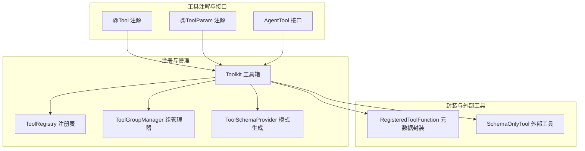
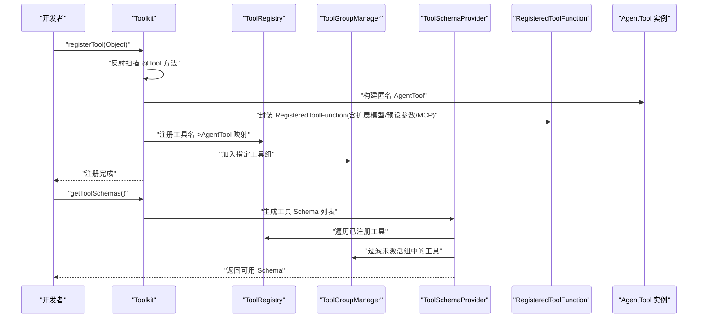
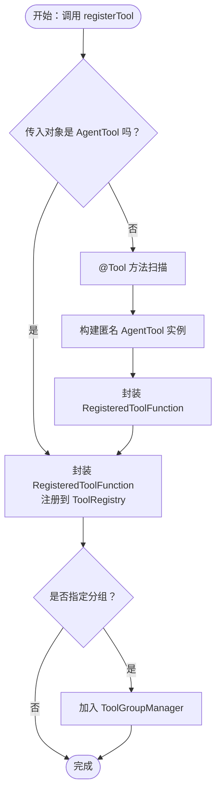
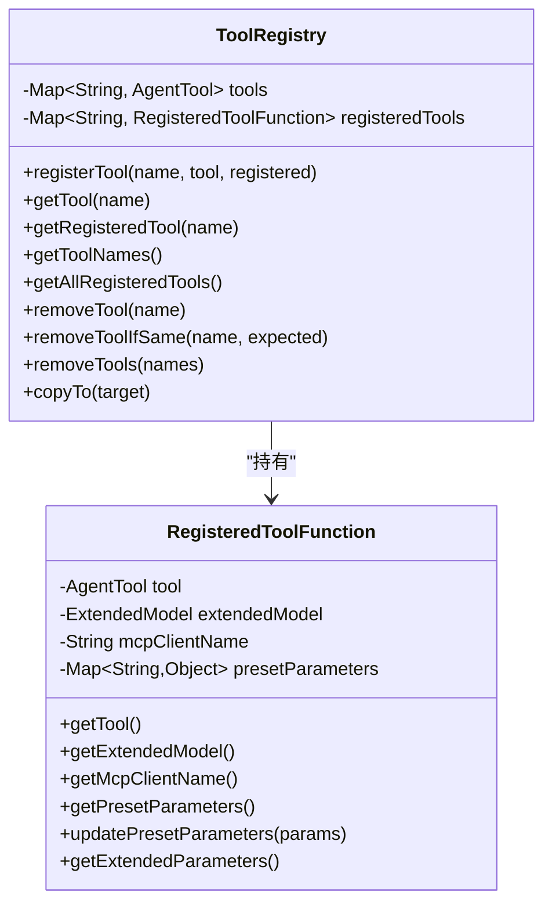
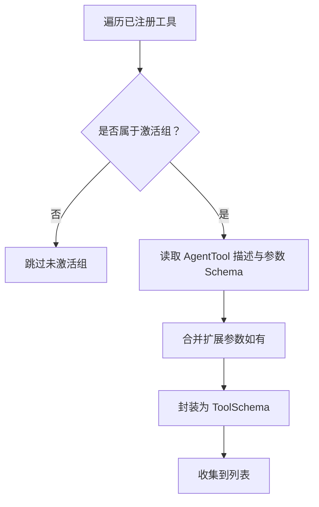
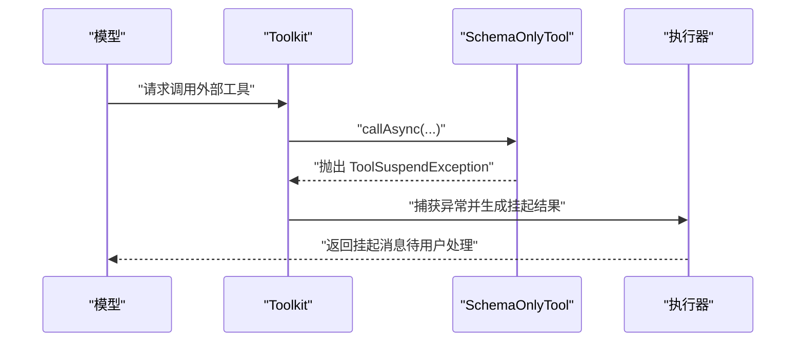
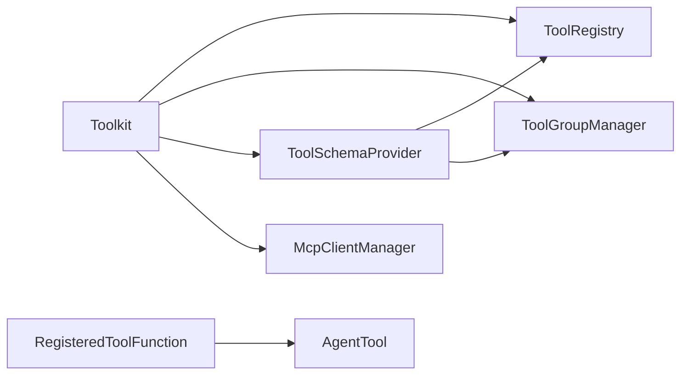

# 工具注册与管理

<cite>
**本文引用的文件**   
- [Tool.java](file://agentscope-core/src/main/java/io/agentscope/core/tool/Tool.java)
- [ToolParam.java](file://agentscope-core/src/main/java/io/agentscope/core/tool/ToolParam.java)
- [AgentTool.java](file://agentscope-core/src/main/java/io/agentscope/core/tool/AgentTool.java)
- [Toolkit.java](file://agentscope-core/src/main/java/io/agentscope/core/tool/Toolkit.java)
- [ToolRegistry.java](file://agentscope-core/src/main/java/io/agentscope/core/tool/ToolRegistry.java)
- [RegisteredToolFunction.java](file://agentscope-core/src/main/java/io/agentscope/core/tool/RegisteredToolFunction.java)
- [SchemaOnlyTool.java](file://agentscope-core/src/main/java/io/agentscope/core/tool/SchemaOnlyTool.java)
- [ToolGroupManager.java](file://agentscope-core/src/main/java/io/agentscope/core/tool/ToolGroupManager.java)
- [ToolSchemaProvider.java](file://agentscope-core/src/main/java/io/agentscope/core/tool/ToolSchemaProvider.java)
</cite>

## 目录
1. [简介](#简介)
2. [项目结构](#项目结构)
3. [核心组件](#核心组件)
4. [架构总览](#架构总览)
5. [详细组件分析](#详细组件分析)
6. [依赖关系分析](#依赖关系分析)
7. [性能考量](#性能考量)
8. [故障排查指南](#故障排查指南)
9. [结论](#结论)
10. [附录](#附录)

## 简介
本文件面向 AgentScope Java 的工具注册与管理系统，系统性阐述工具注册机制的设计与实现，包括：
- @Tool 注解的解析流程与参数校验
- 工具方法的扫描、封装与注册
- ToolRegistry 的存储策略与并发安全
- RegisteredToolFunction 的元数据承载与生命周期管理
- 多种工具注册方式：对象注册、AgentTool 直接注册、Schema-only 工具注册
- 最佳实践：命名规范、描述信息编写、参数预设与扩展模型
- 典型用法示例（以路径代替代码片段）

## 项目结构
围绕工具注册与管理的核心代码位于 agentscope-core 模块的 tool 包中，主要文件如下：
- 注解层：Tool、ToolParam
- 接口层：AgentTool
- 管理层：Toolkit、ToolRegistry、ToolGroupManager、ToolSchemaProvider
- 封装层：RegisteredToolFunction、SchemaOnlyTool

**图表来源**
- [Tool.java:60-132](file://agentscope-core/src/main/java/io/agentscope/core/tool/Tool.java#L60-L132)
- [ToolParam.java:62-104](file://agentscope-core/src/main/java/io/agentscope/core/tool/ToolParam.java#L62-L104)
- [AgentTool.java:40-118](file://agentscope-core/src/main/java/io/agentscope/core/tool/AgentTool.java#L40-L118)
- [Toolkit.java:66-117](file://agentscope-core/src/main/java/io/agentscope/core/tool/Toolkit.java#L66-L117)
- [ToolRegistry.java:40-155](file://agentscope-core/src/main/java/io/agentscope/core/tool/ToolRegistry.java#L40-L155)
- [RegisteredToolFunction.java:28-142](file://agentscope-core/src/main/java/io/agentscope/core/tool/RegisteredToolFunction.java#L28-L142)
- [SchemaOnlyTool.java:58-153](file://agentscope-core/src/main/java/io/agentscope/core/tool/SchemaOnlyTool.java#L58-L153)
- [ToolGroupManager.java:31-393](file://agentscope-core/src/main/java/io/agentscope/core/tool/ToolGroupManager.java#L31-L393)
- [ToolSchemaProvider.java:44-94](file://agentscope-core/src/main/java/io/agentscope/core/tool/ToolSchemaProvider.java#L44-L94)

**章节来源**
- [Toolkit.java:66-117](file://agentscope-core/src/main/java/io/agentscope/core/tool/Toolkit.java#L66-L117)
- [ToolRegistry.java:40-155](file://agentscope-core/src/main/java/io/agentscope/core/tool/ToolRegistry.java#L40-L155)
- [ToolGroupManager.java:31-393](file://agentscope-core/src/main/java/io/agentscope/core/tool/ToolGroupManager.java#L31-L393)
- [ToolSchemaProvider.java:44-94](file://agentscope-core/src/main/java/io/agentscope/core/tool/ToolSchemaProvider.java#L44-L94)
- [RegisteredToolFunction.java:28-142](file://agentscope-core/src/main/java/io/agentscope/core/tool/RegisteredToolFunction.java#L28-L142)
- [SchemaOnlyTool.java:58-153](file://agentscope-core/src/main/java/io/agentscope/core/tool/SchemaOnlyTool.java#L58-L153)

## 核心组件
- 注解体系
  - @Tool：标记方法为工具，并声明名称、描述、严格模式与结果转换器
  - @ToolParam：为工具参数提供名称、是否必需、描述等元信息
- 接口 AgentTool：统一工具的名称、描述、参数 Schema、输出 Schema、异步调用能力
- 管理器 Toolkit：对外提供注册、查询、执行、分组、MCP 客户端集成、Schema 生成等能力
- 存储与分发
  - ToolRegistry：线程安全的工具与注册函数映射
  - RegisteredToolFunction：封装 AgentTool 及其扩展模型、MCP 客户端名、预设参数
  - ToolGroupManager：工具分组、激活状态与过滤逻辑
  - ToolSchemaProvider：按激活组生成可发送给模型的工具 Schema
- 外部工具 Schema-only：仅携带 Schema 的外部工具，触发暂停并交由用户处理

**章节来源**
- [Tool.java:60-132](file://agentscope-core/src/main/java/io/agentscope/core/tool/Tool.java#L60-L132)
- [ToolParam.java:62-104](file://agentscope-core/src/main/java/io/agentscope/core/tool/ToolParam.java#L62-L104)
- [AgentTool.java:40-118](file://agentscope-core/src/main/java/io/agentscope/core/tool/AgentTool.java#L40-L118)
- [Toolkit.java:66-117](file://agentscope-core/src/main/java/io/agentscope/core/tool/Toolkit.java#L66-L117)
- [ToolRegistry.java:40-155](file://agentscope-core/src/main/java/io/agentscope/core/tool/ToolRegistry.java#L40-L155)
- [RegisteredToolFunction.java:28-142](file://agentscope-core/src/main/java/io/agentscope/core/tool/RegisteredToolFunction.java#L28-L142)
- [ToolGroupManager.java:31-393](file://agentscope-core/src/main/java/io/agentscope/core/tool/ToolGroupManager.java#L31-L393)
- [ToolSchemaProvider.java:44-94](file://agentscope-core/src/main/java/io/agentscope/core/tool/ToolSchemaProvider.java#L44-L94)
- [SchemaOnlyTool.java:58-153](file://agentscope-core/src/main/java/io/agentscope/core/tool/SchemaOnlyTool.java#L58-L153)

## 架构总览
下图展示了从注解扫描到工具注册、Schema 生成与执行的整体流程。

**图表来源**
- [Toolkit.java:154-393](file://agentscope-core/src/main/java/io/agentscope/core/tool/Toolkit.java#L154-L393)
- [ToolRegistry.java:52-102](file://agentscope-core/src/main/java/io/agentscope/core/tool/ToolRegistry.java#L52-L102)
- [ToolGroupManager.java:266-274](file://agentscope-core/src/main/java/io/agentscope/core/tool/ToolGroupManager.java#L266-L274)
- [ToolSchemaProvider.java:66-93](file://agentscope-core/src/main/java/io/agentscope/core/tool/ToolSchemaProvider.java#L66-L93)
- [RegisteredToolFunction.java:53-76](file://agentscope-core/src/main/java/io/agentscope/core/tool/RegisteredToolFunction.java#L53-L76)

## 详细组件分析

### 注解与参数元数据：@Tool 与 @ToolParam
- @Tool 关键属性
  - name：工具名，默认使用方法名；建议采用 snake_case
  - description：工具描述，用于指导模型何时调用
  - strict：启用严格模式，要求模型更严格遵循参数 Schema
  - converter：自定义结果转换器类，默认使用默认转换器
- @ToolParam 关键属性
  - name：必填，用于 Schema 与参数映射
  - required：是否必需
  - description：帮助模型理解参数含义与取值范围

最佳实践
- 命名：工具名与参数名采用 snake_case，提升 LLM 兼容性
- 描述：清晰说明用途、触发时机与返回内容
- 参数：必需参数尽量明确，避免歧义；对可选参数提供默认语义

**章节来源**
- [Tool.java:60-132](file://agentscope-core/src/main/java/io/agentscope/core/tool/Tool.java#L60-L132)
- [ToolParam.java:62-104](file://agentscope-core/src/main/java/io/agentscope/core/tool/ToolParam.java#L62-L104)

### 工具接口：AgentTool
- 能力边界
  - 名称、描述、参数 Schema、可选输出 Schema、严格模式标记
  - 异步调用 callAsync(ToolCallParam) 返回 Mono<ToolResultBlock>
- 设计要点
  - 所有操作基于响应式 Mono，保证非阻塞与可观测性
  - 参数 Schema 必须符合 JSON Schema 规范，便于模型消费

**章节来源**
- [AgentTool.java:40-118](file://agentscope-core/src/main/java/io/agentscope/core/tool/AgentTool.java#L40-L118)

### 工具注册入口：Toolkit
- 对象注册
  - registerTool(Object)：扫描对象中带 @Tool 的方法，自动封装为 AgentTool 并注册
- AgentTool 直接注册
  - registerAgentTool(AgentTool)：直接注册已有实现
- Schema-only 工具注册
  - registerSchema(ToolSchema)/registerSchemas(...)：注册外部工具 Schema，isExternalTool(...) 识别
- 分组与预设参数
  - 支持 group、presetParameters、extendedModel、mcpClientName 等元信息注入
- 执行与回调
  - callTool(...)、callTools(...) 提供单个或批量异步执行
  - setChunkCallback(...) 设置流式回调

**图表来源**
- [Toolkit.java:154-243](file://agentscope-core/src/main/java/io/agentscope/core/tool/Toolkit.java#L154-L243)
- [Toolkit.java:339-393](file://agentscope-core/src/main/java/io/agentscope/core/tool/Toolkit.java#L339-L393)

**章节来源**
- [Toolkit.java:154-243](file://agentscope-core/src/main/java/io/agentscope/core/tool/Toolkit.java#L154-L243)
- [Toolkit.java:294-324](file://agentscope-core/src/main/java/io/agentscope/core/tool/Toolkit.java#L294-L324)
- [Toolkit.java:339-393](file://agentscope-core/src/main/java/io/agentscope/core/tool/Toolkit.java#L339-L393)

### 注册表与封装：ToolRegistry 与 RegisteredToolFunction
- ToolRegistry
  - 使用并发 Map 存储工具名到 AgentTool 与 RegisteredToolFunction 的映射
  - 提供注册、查询、删除、原子删除、复制等操作，保证线程安全
- RegisteredToolFunction
  - 承载 AgentTool、扩展模型、MCP 客户端名、预设参数
  - 预设参数在执行时自动注入，不暴露于 Schema
  - 支持运行时动态更新预设参数

**图表来源**
- [ToolRegistry.java:40-155](file://agentscope-core/src/main/java/io/agentscope/core/tool/ToolRegistry.java#L40-L155)
- [RegisteredToolFunction.java:28-142](file://agentscope-core/src/main/java/io/agentscope/core/tool/RegisteredToolFunction.java#L28-L142)

**章节来源**
- [ToolRegistry.java:40-155](file://agentscope-core/src/main/java/io/agentscope/core/tool/ToolRegistry.java#L40-L155)
- [RegisteredToolFunction.java:28-142](file://agentscope-core/src/main/java/io/agentscope/core/tool/RegisteredToolFunction.java#L28-L142)

### 分组与 Schema 生成：ToolGroupManager 与 ToolSchemaProvider
- ToolGroupManager
  - 维护组到工具、工具到组的双向索引
  - 记录激活组列表，提供激活状态查询、工具激活性判断
- ToolSchemaProvider
  - 依据激活组过滤工具，生成 OpenAI 格式的 ToolSchema 列表
  - 使用 RegisteredToolFunction 的扩展参数合并策略

**图表来源**
- [ToolSchemaProvider.java:66-93](file://agentscope-core/src/main/java/io/agentscope/core/tool/ToolSchemaProvider.java#L66-L93)
- [ToolGroupManager.java:266-274](file://agentscope-core/src/main/java/io/agentscope/core/tool/ToolGroupManager.java#L266-L274)
- [RegisteredToolFunction.java:136-141](file://agentscope-core/src/main/java/io/agentscope/core/tool/RegisteredToolFunction.java#L136-L141)

**章节来源**
- [ToolGroupManager.java:31-393](file://agentscope-core/src/main/java/io/agentscope/core/tool/ToolGroupManager.java#L31-L393)
- [ToolSchemaProvider.java:44-94](file://agentscope-core/src/main/java/io/agentscope/core/tool/ToolSchemaProvider.java#L44-L94)
- [RegisteredToolFunction.java:136-141](file://agentscope-core/src/main/java/io/agentscope/core/tool/RegisteredToolFunction.java#L136-L141)

### 外部工具：SchemaOnlyTool
- 仅包含 Schema 的工具实现，调用时抛出 ToolSuspendException，框架将其转为挂起消息
- 适用于需要外部执行的工具场景，如数据库查询、第三方 API 等

**图表来源**
- [SchemaOnlyTool.java:149-152](file://agentscope-core/src/main/java/io/agentscope/core/tool/SchemaOnlyTool.java#L149-L152)
- [Toolkit.java:294-324](file://agentscope-core/src/main/java/io/agentscope/core/tool/Toolkit.java#L294-L324)

**章节来源**
- [SchemaOnlyTool.java:58-153](file://agentscope-core/src/main/java/io/agentscope/core/tool/SchemaOnlyTool.java#L58-L153)
- [Toolkit.java:294-324](file://agentscope-core/src/main/java/io/agentscope/core/tool/Toolkit.java#L294-L324)

### 工具注册方式详解与最佳实践

- 方式一：对象注册（扫描 @Tool）
  - 适用：快速将一组带注解的方法注册为工具
  - 关键点：方法需标注 @Tool；参数需标注 @ToolParam；可选设置 group、presetParameters、extendedModel
  - 示例参考路径
    - [Toolkit.java:154-197](file://agentscope-core/src/main/java/io/agentscope/core/tool/Toolkit.java#L154-L197)
    - [Toolkit.java:339-393](file://agentscope-core/src/main/java/io/agentscope/core/tool/Toolkit.java#L339-L393)

- 方式二：AgentTool 直接注册
  - 适用：已有完整 AgentTool 实现或需要自定义行为
  - 关键点：实现 getName、getDescription、getParameters、callAsync；可选 strict 与 outputSchema
  - 示例参考路径
    - [AgentTool.java:40-118](file://agentscope-core/src/main/java/io/agentscope/core/tool/AgentTool.java#L40-L118)
    - [Toolkit.java:203-243](file://agentscope-core/src/main/java/io/agentscope/core/tool/Toolkit.java#L203-L243)

- 方式三：Schema-only 工具注册
  - 适用：外部工具（如数据库查询），由框架提示挂起，交由用户处理
  - 关键点：通过 ToolSchema 构建；isExternalTool(...) 识别；调用时抛出 ToolSuspendException
  - 示例参考路径
    - [Toolkit.java:294-324](file://agentscope-core/src/main/java/io/agentscope/core/tool/Toolkit.java#L294-L324)
    - [SchemaOnlyTool.java:149-152](file://agentscope-core/src/main/java/io/agentscope/core/tool/SchemaOnlyTool.java#L149-L152)

最佳实践清单
- 命名规范
  - 工具名与参数名使用 snake_case，避免空格与特殊字符
- 描述信息
  - 工具描述应包含“做什么”、“何时使用”、“返回什么”，帮助模型决策
- 参数预设
  - 敏感信息（如密钥）放入预设参数，不暴露于 Schema；支持运行时动态更新
- 扩展模型
  - 使用 ExtendedModel 与 RegisteredToolFunction 合并 Schema，增强参数表达力
- 分组控制
  - 通过 ToolGroupManager 控制工具可见性与激活状态，实现按需启用

**章节来源**
- [Toolkit.java:154-243](file://agentscope-core/src/main/java/io/agentscope/core/tool/Toolkit.java#L154-L243)
- [Toolkit.java:294-324](file://agentscope-core/src/main/java/io/agentscope/core/tool/Toolkit.java#L294-L324)
- [RegisteredToolFunction.java:105-128](file://agentscope-core/src/main/java/io/agentscope/core/tool/RegisteredToolFunction.java#L105-L128)
- [ToolGroupManager.java:231-245](file://agentscope-core/src/main/java/io/agentscope/core/tool/ToolGroupManager.java#L231-L245)

## 依赖关系分析
- 内聚与耦合
  - Toolkit 作为门面，聚合 ToolRegistry、ToolGroupManager、ToolSchemaProvider、MetaToolFactory、McpClientManager 等
  - ToolRegistry 与 RegisteredToolFunction 高内聚，职责单一
  - ToolSchemaProvider 依赖 ToolRegistry 与 ToolGroupManager 进行过滤与合并
- 外部依赖
  - 响应式编程：Mono、Flux（来自 Reactor）
  - 日志：SLF4J
- 循环依赖
  - 未发现循环依赖；各模块职责清晰

**图表来源**
- [Toolkit.java:66-117](file://agentscope-core/src/main/java/io/agentscope/core/tool/Toolkit.java#L66-L117)
- [ToolSchemaProvider.java:44-94](file://agentscope-core/src/main/java/io/agentscope/core/tool/ToolSchemaProvider.java#L44-L94)

**章节来源**
- [Toolkit.java:66-117](file://agentscope-core/src/main/java/io/agentscope/core/tool/Toolkit.java#L66-L117)
- [ToolSchemaProvider.java:44-94](file://agentscope-core/src/main/java/io/agentscope/core/tool/ToolSchemaProvider.java#L44-L94)

## 性能考量
- 并发安全
  - ToolRegistry 使用 ConcurrentHashMap，支持高并发注册与查询
  - ToolGroupManager 使用并发集合，保证激活组与索引一致性
- 反射成本
  - @Tool 方法扫描发生在初始化阶段，运行时仅按名称查找，开销可控
- 流式回调
  - setChunkCallback 与内部回调分离，避免重复拷贝与覆盖
- 执行配置
  - 支持全局与代理级 ExecutionConfig 合并，减少重复配置

[本节为通用性能讨论，无需具体文件引用]

## 故障排查指南
- 工具未出现在 Schema 中
  - 检查是否属于未激活组；确认 ToolGroupManager 的激活状态
  - 参考：[ToolSchemaProvider.java:66-93](file://agentscope-core/src/main/java/io/agentscope/core/tool/ToolSchemaProvider.java#L66-L93)、[ToolGroupManager.java:231-245](file://agentscope-core/src/main/java/io/agentscope/core/tool/ToolGroupManager.java#L231-L245)
- 工具调用失败或参数不匹配
  - 确认 @ToolParam 的 name 与类型匹配；检查 Converter 是否正确实例化
  - 参考：[Toolkit.java:395-434](file://agentscope-core/src/main/java/io/agentscope/core/tool/Toolkit.java#L395-L434)
- 外部工具被错误执行
  - isExternalTool(...) 应返回 true；调用会抛出 ToolSuspendException
  - 参考：[Toolkit.java:321-324](file://agentscope-core/src/main/java/io/agentscope/core/tool/Toolkit.java#L321-L324)、[SchemaOnlyTool.java:149-152](file://agentscope-core/src/main/java/io/agentscope/core/tool/SchemaOnlyTool.java#L149-L152)
- 预设参数未生效
  - 确认 RegisteredToolFunction.getPresetParameters() 与执行上下文合并逻辑
  - 参考：[RegisteredToolFunction.java:105-128](file://agentscope-core/src/main/java/io/agentscope/core/tool/RegisteredToolFunction.java#L105-L128)

**章节来源**
- [ToolSchemaProvider.java:66-93](file://agentscope-core/src/main/java/io/agentscope/core/tool/ToolSchemaProvider.java#L66-L93)
- [ToolGroupManager.java:231-245](file://agentscope-core/src/main/java/io/agentscope/core/tool/ToolGroupManager.java#L231-L245)
- [Toolkit.java:321-324](file://agentscope-core/src/main/java/io/agentscope/core/tool/Toolkit.java#L321-L324)
- [Toolkit.java:395-434](file://agentscope-core/src/main/java/io/agentscope/core/tool/Toolkit.java#L395-L434)
- [SchemaOnlyTool.java:149-152](file://agentscope-core/src/main/java/io/agentscope/core/tool/SchemaOnlyTool.java#L149-L152)
- [RegisteredToolFunction.java:105-128](file://agentscope-core/src/main/java/io/agentscope/core/tool/RegisteredToolFunction.java#L105-L128)

## 结论
AgentScope Java 的工具注册与管理系统以注解驱动为核心，结合接口抽象、并发注册表与分组过滤，提供了灵活、可扩展且高性能的工具管理能力。通过 RegisteredToolFunction 承载扩展模型与预设参数，配合 Schema-only 工具与 MCP 客户端集成，能够覆盖从内置工具到外部服务的广泛场景。遵循命名规范、描述清晰与参数预设的最佳实践，可显著提升工具的可用性与安全性。

[本节为总结性内容，无需具体文件引用]

## 附录
- 示例参考路径（以路径代替代码片段）
  - 对象注册与 @Tool 扫描
    - [Toolkit.java:154-197](file://agentscope-core/src/main/java/io/agentscope/core/tool/Toolkit.java#L154-L197)
    - [Toolkit.java:339-393](file://agentscope-core/src/main/java/io/agentscope/core/tool/Toolkit.java#L339-L393)
  - AgentTool 直接注册
    - [AgentTool.java:40-118](file://agentscope-core/src/main/java/io/agentscope/core/tool/AgentTool.java#L40-L118)
    - [Toolkit.java:203-243](file://agentscope-core/src/main/java/io/agentscope/core/tool/Toolkit.java#L203-L243)
  - Schema-only 工具注册与外部工具识别
    - [Toolkit.java:294-324](file://agentscope-core/src/main/java/io/agentscope/core/tool/Toolkit.java#L294-L324)
    - [SchemaOnlyTool.java:149-152](file://agentscope-core/src/main/java/io/agentscope/core/tool/SchemaOnlyTool.java#L149-L152)
  - 分组与激活状态
    - [ToolGroupManager.java:231-245](file://agentscope-core/src/main/java/io/agentscope/core/tool/ToolGroupManager.java#L231-L245)
    - [ToolSchemaProvider.java:66-93](file://agentscope-core/src/main/java/io/agentscope/core/tool/ToolSchemaProvider.java#L66-L93)
  - 预设参数与扩展模型
    - [RegisteredToolFunction.java:105-128](file://agentscope-core/src/main/java/io/agentscope/core/tool/RegisteredToolFunction.java#L105-L128)
    - [RegisteredToolFunction.java:136-141](file://agentscope-core/src/main/java/io/agentscope/core/tool/RegisteredToolFunction.java#L136-L141)