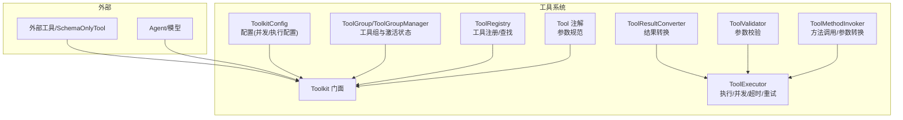
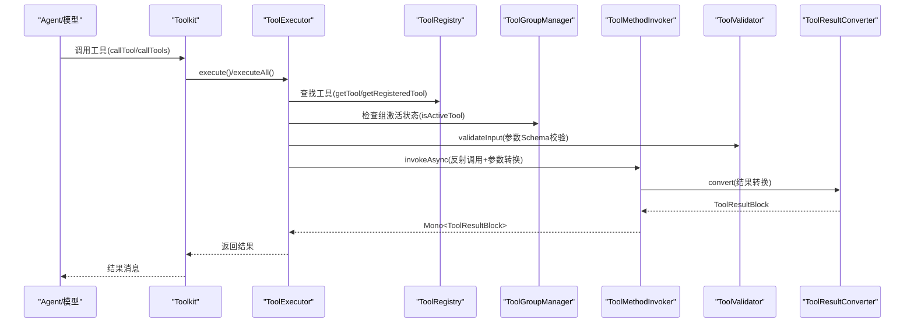
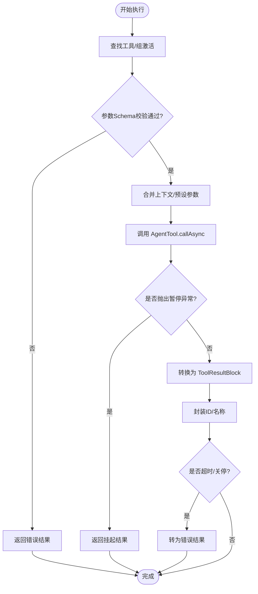
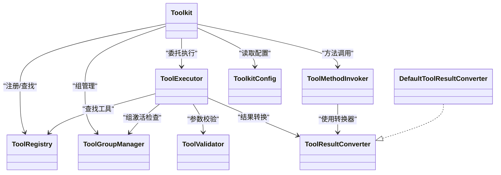

# 工具系统

<cite>
**本文引用的文件**
- [Tool.java](file://agentscope-core/src/main/java/io/agentscope/core/tool/Tool.java)
- [ToolParam.java](file://agentscope-core/src/main/java/io/agentscope/core/tool/ToolParam.java)
- [Toolkit.java](file://agentscope-core/src/main/java/io/agentscope/core/tool/Toolkit.java)
- [ToolkitConfig.java](file://agentscope-core/src/main/java/io/agentscope/core/tool/ToolkitConfig.java)
- [ToolCallParam.java](file://agentscope-core/src/main/java/io/agentscope/core/tool/ToolCallParam.java)
- [ToolExecutor.java](file://agentscope-core/src/main/java/io/agentscope/core/tool/ToolExecutor.java)
- [ToolRegistry.java](file://agentscope-core/src/main/java/io/agentscope/core/tool/ToolRegistry.java)
- [ToolGroup.java](file://agentscope-core/src/main/java/io/agentscope/core/tool/ToolGroup.java)
- [ToolGroupManager.java](file://agentscope-core/src/main/java/io/agentscope/core/tool/ToolGroupManager.java)
- [ToolMethodInvoker.java](file://agentscope-core/src/main/java/io/agentscope/core/tool/ToolMethodInvoker.java)
- [ToolValidator.java](file://agentscope-core/src/main/java/io/agentscope/core/tool/ToolValidator.java)
- [ToolResultConverter.java](file://agentscope-core/src/main/java/io/agentscope/core/tool/ToolResultConverter.java)
- [DefaultToolResultConverter.java](file://agentscope-core/src/main/java/io/agentscope/core/tool/DefaultToolResultConverter.java)
- [AddCalendarEventTool.java](file://agentscope-examples/advanced/src/main/java/io/agentscope/examples/advanced/hitl/AddCalendarEventTool.java)
</cite>

## 目录
1. [简介](#简介)
2. [项目结构](#项目结构)
3. [核心组件](#核心组件)
4. [架构总览](#架构总览)
5. [详细组件分析](#详细组件分析)
6. [依赖关系分析](#依赖关系分析)
7. [性能考量](#性能考量)
8. [故障排查指南](#故障排查指南)
9. [结论](#结论)
10. [附录：最佳实践与示例路径](#附录最佳实践与示例路径)

## 简介
本文件面向 AgentScope Java 工具系统，围绕“工具注册机制、工具组管理、工具执行流程”展开，系统阐述 Tool 接口设计、参数校验与结果处理、ToolExecutor 并发策略与超时重试、工具结果转换器及其自定义实现，并提供可直接定位到源码的示例路径，帮助开发者快速上手与扩展。

## 项目结构
工具系统位于 agentscope-core 模块的 tool 包中，采用分层职责划分：
- 注解与参数：Tool、ToolParam 定义工具元数据与参数规范
- 工具注册与查找：ToolRegistry 维护工具映射；ToolGroup/ToolGroupManager 管理工具分组与激活状态
- 执行与调度：Toolkit 作为门面协调各子系统；ToolExecutor 负责执行、并发、超时与重试
- 结果转换：ToolResultConverter 抽象转换接口，DefaultToolResultConverter 提供默认实现
- 方法调用：ToolMethodInvoker 处理反射调用、参数类型转换与自动注入
- 校验：ToolValidator 提供输入参数 JSON Schema 校验与 HITL 对齐校验

图表来源
- [Toolkit.java:66-117](file://agentscope-core/src/main/java/io/agentscope/core/tool/Toolkit.java#L66-L117)
- [ToolExecutor.java:57-94](file://agentscope-core/src/main/java/io/agentscope/core/tool/ToolExecutor.java#L57-L94)
- [ToolRegistry.java:40-58](file://agentscope-core/src/main/java/io/agentscope/core/tool/ToolRegistry.java#L40-L58)
- [ToolGroupManager.java:31-37](file://agentscope-core/src/main/java/io/agentscope/core/tool/ToolGroupManager.java#L31-L37)
- [ToolMethodInvoker.java:37-43](file://agentscope-core/src/main/java/io/agentscope/core/tool/ToolMethodInvoker.java#L37-L43)
- [ToolValidator.java:47-55](file://agentscope-core/src/main/java/io/agentscope/core/tool/ToolValidator.java#L47-L55)
- [ToolResultConverter.java:48-58](file://agentscope-core/src/main/java/io/agentscope/core/tool/ToolResultConverter.java#L48-L58)
- [ToolkitConfig.java:32-46](file://agentscope-core/src/main/java/io/agentscope/core/tool/ToolkitConfig.java#L32-L46)

章节来源
- [Toolkit.java:37-65](file://agentscope-core/src/main/java/io/agentscope/core/tool/Toolkit.java#L37-L65)
- [ToolkitConfig.java:21-31](file://agentscope-core/src/main/java/io/agentscope/core/tool/ToolkitConfig.java#L21-L31)

## 核心组件
- Tool 注解：声明工具名称、描述、严格模式与自定义结果转换器，用于扫描与生成工具 Schema
- ToolParam 注解：为每个参数提供 name、required、description，支撑 JSON Schema 生成与运行时参数映射
- Toolkit：工具系统门面，负责注册、查找、执行、组管理、MCP 客户端集成、元工具注册等
- ToolExecutor：统一执行器，支持单次/批量、并发/串行、超时、重试、优雅关停保护、流式回调
- ToolRegistry：线程安全的工具注册表，维护 AgentTool 实现与其注册元信息
- ToolGroup/ToolGroupManager：工具分组与激活状态管理，支持动态启用/禁用与查询
- ToolMethodInvoker：基于反射的方法调用器，支持同步/异步返回（Mono/CompletableFuture）、参数类型转换与自动注入
- ToolValidator：JSON Schema 参数校验与 HITL 结果对齐校验
- ToolResultConverter/DefaultToolResultConverter：结果转换抽象与默认实现（空值、void、对象序列化）

章节来源
- [Tool.java:24-134](file://agentscope-core/src/main/java/io/agentscope/core/tool/Tool.java#L24-L134)
- [ToolParam.java:24-105](file://agentscope-core/src/main/java/io/agentscope/core/tool/ToolParam.java#L24-L105)
- [Toolkit.java:66-117](file://agentscope-core/src/main/java/io/agentscope/core/tool/Toolkit.java#L66-L117)
- [ToolExecutor.java:57-94](file://agentscope-core/src/main/java/io/agentscope/core/tool/ToolExecutor.java#L57-L94)
- [ToolRegistry.java:40-58](file://agentscope-core/src/main/java/io/agentscope/core/tool/ToolRegistry.java#L40-L58)
- [ToolGroup.java:22-41](file://agentscope-core/src/main/java/io/agentscope/core/tool/ToolGroup.java#L22-L41)
- [ToolGroupManager.java:28-37](file://agentscope-core/src/main/java/io/agentscope/core/tool/ToolGroupManager.java#L28-L37)
- [ToolMethodInvoker.java:33-43](file://agentscope-core/src/main/java/io/agentscope/core/tool/ToolMethodInvoker.java#L33-L43)
- [ToolValidator.java:38-46](file://agentscope-core/src/main/java/io/agentscope/core/tool/ToolValidator.java#L38-L46)
- [ToolResultConverter.java:21-47](file://agentscope-core/src/main/java/io/agentscope/core/tool/ToolResultConverter.java#L21-L47)
- [DefaultToolResultConverter.java:26-38](file://agentscope-core/src/main/java/io/agentscope/core/tool/DefaultToolResultConverter.java#L26-L38)

## 架构总览
工具系统以 Toolkit 为中心，通过 ToolExecutor 统一编排执行链路，结合 ToolRegistry、ToolGroupManager、ToolMethodInvoker、ToolValidator、ToolResultConverter 形成完整的工具生命周期闭环。

图表来源
- [Toolkit.java:489-524](file://agentscope-core/src/main/java/io/agentscope/core/tool/Toolkit.java#L489-L524)
- [ToolExecutor.java:166-264](file://agentscope-core/src/main/java/io/agentscope/core/tool/ToolExecutor.java#L166-L264)
- [ToolRegistry.java:66-83](file://agentscope-core/src/main/java/io/agentscope/core/tool/ToolRegistry.java#L66-L83)
- [ToolGroupManager.java:231-244](file://agentscope-core/src/main/java/io/agentscope/core/tool/ToolGroupManager.java#L231-L244)
- [ToolMethodInvoker.java:54-121](file://agentscope-core/src/main/java/io/agentscope/core/tool/ToolMethodInvoker.java#L54-L121)
- [ToolValidator.java:77-104](file://agentscope-core/src/main/java/io/agentscope/core/tool/ToolValidator.java#L77-L104)
- [ToolResultConverter.java:50-57](file://agentscope-core/src/main/java/io/agentscope/core/tool/ToolResultConverter.java#L50-L57)

## 详细组件分析

### Tool 接口与参数注解设计
- Tool 注解
  - name/description/strict/converter 属性用于控制工具命名、描述、严格模式与结果转换器
  - 要求：所有参数需标注 ToolParam（除 ToolEmitter 自动注入），返回类型支持字符串或响应式类型
- ToolParam 注解
  - name 必填（因运行时不保留参数名），required/description 辅助 LLM 使用
  - 命名建议遵循 snake_case，提升与 LLM 兼容性

章节来源
- [Tool.java:24-134](file://agentscope-core/src/main/java/io/agentscope/core/tool/Tool.java#L24-L134)
- [ToolParam.java:24-105](file://agentscope-core/src/main/java/io/agentscope/core/tool/ToolParam.java#L24-L105)

### 工具注册与查找（ToolRegistry）
- 支持按名称注册 AgentTool 及其 RegisteredToolFunction 元信息
- 线程安全：内部使用并发映射，支持动态移除与原子替换
- 提供工具名集合、复制到目标注册表等能力

章节来源
- [ToolRegistry.java:40-155](file://agentscope-core/src/main/java/io/agentscope/core/tool/ToolRegistry.java#L40-L155)

### 工具组与激活控制（ToolGroup/ToolGroupManager）
- ToolGroup：命名、描述、激活状态、工具集合
- ToolGroupManager：创建/更新/删除工具组；维护工具到组的索引；查询激活工具集合；支持深拷贝
- 激活规则：未分组工具默认激活；若属于任一组且该组激活，则工具可用

章节来源
- [ToolGroup.java:22-201](file://agentscope-core/src/main/java/io/agentscope/core/tool/ToolGroup.java#L22-L201)
- [ToolGroupManager.java:28-394](file://agentscope-core/src/main/java/io/agentscope/core/tool/ToolGroupManager.java#L28-L394)

### 执行器与并发策略（ToolExecutor）
- 单次执行：执行前进行工具存在性检查、组激活检查、参数 Schema 校验；合并上下文与预设参数；构建 ToolCallParam；调用 AgentTool.callAsync；异常处理与 ToolSuspendException 转换
- 批量执行：支持并行/串行；为每个调用应用调度、超时、重试、关停保护；最终统一封装为 ToolResultBlock 列表
- 超时与重试：基于 ExecutionConfig 配置最大尝试次数、初始/最大退避时间、过滤条件；使用 Reactor Retry
- 优雅关停：与全局关停信号竞争，提前取消并返回错误
- 流式回调：支持用户与框架内部回调组合，避免阻塞其他回调

图表来源
- [ToolExecutor.java:183-264](file://agentscope-core/src/main/java/io/agentscope/core/tool/ToolExecutor.java#L183-L264)
- [ToolExecutor.java:309-341](file://agentscope-core/src/main/java/io/agentscope/core/tool/ToolExecutor.java#L309-L341)
- [ToolExecutor.java:352-402](file://agentscope-core/src/main/java/io/agentscope/core/tool/ToolExecutor.java#L352-L402)
- [ToolExecutor.java:409-419](file://agentscope-core/src/main/java/io/agentscope/core/tool/ToolExecutor.java#L409-L419)

章节来源
- [ToolExecutor.java:57-421](file://agentscope-core/src/main/java/io/agentscope/core/tool/ToolExecutor.java#L57-L421)

### 方法调用与参数转换（ToolMethodInvoker）
- 支持同步、Mono、CompletableFuture 三种返回类型
- 自动注入：ToolEmitter、Agent、ToolExecutionContext、RuntimeContext；用户 POJO 从 ToolExecutionContext 解析
- 参数转换：优先精确类型匹配，否则使用 JsonCodec 带泛型信息转换；字符串回退到基本类型解析
- 错误处理：捕获 ToolSuspendException 并向上抛出以便执行器识别；其余异常包装为错误结果

章节来源
- [ToolMethodInvoker.java:33-388](file://agentscope-core/src/main/java/io/agentscope/core/tool/ToolMethodInvoker.java#L33-L388)

### 参数校验与结果处理（ToolValidator）
- 输入校验：基于 networknt-schema 的 JSON Schema 校验，支持必填、类型、枚举、范围、正则、嵌套对象/数组等
- 特殊处理：显式 null 在可选字段处被剔除后再校验，确保与 LLM 提供的参数语义一致
- HITL 校验：校验 ToolResult 是否覆盖所有待处理 ToolUse，保障人工介入流程一致性

章节来源
- [ToolValidator.java:38-265](file://agentscope-core/src/main/java/io/agentscope/core/tool/ToolValidator.java#L38-L265)

### 结果转换器（ToolResultConverter 与 DefaultToolResultConverter）
- ToolResultConverter：统一将工具返回值转换为 ToolResultBlock，支持自定义实现
- DefaultToolResultConverter：
  - null → 文本“null”
  - void → 文本“Done”
  - 已是 ToolResultBlock → 直接返回
  - 其他对象 → JSON 序列化；失败回退 toString()

章节来源
- [ToolResultConverter.java:21-59](file://agentscope-core/src/main/java/io/agentscope/core/tool/ToolResultConverter.java#L21-L59)
- [DefaultToolResultConverter.java:26-98](file://agentscope-core/src/main/java/io/agentscope/core/tool/DefaultToolResultConverter.java#L26-L98)

### 工具门面（Toolkit）与配置（ToolkitConfig）
- Toolkit 职责：注册工具（对象/AgentTool/MCP）、Schema 生成、执行、组管理、元工具、深拷贝、回调设置
- ToolkitConfig：控制是否并行、自定义执行器、执行配置（超时/重试）、是否允许删除工具、默认上下文

章节来源
- [Toolkit.java:66-739](file://agentscope-core/src/main/java/io/agentscope/core/tool/Toolkit.java#L66-L739)
- [ToolkitConfig.java:21-207](file://agentscope-core/src/main/java/io/agentscope/core/tool/ToolkitConfig.java#L21-L207)

## 依赖关系分析
- Toolkit 依赖 ToolExecutor、ToolRegistry、ToolGroupManager、ToolSchemaProvider、MetaToolFactory、McpClientManager
- ToolExecutor 依赖 ToolRegistry、ToolGroupManager、ToolValidator、ToolResultConverter、TracerRegistry、GracefulShutdownManager
- ToolMethodInvoker 依赖 ToolResultConverter、JsonUtils、ExceptionUtils
- ToolValidator 依赖 networknt-schema、JsonUtils
- DefaultToolResultConverter 依赖 JsonUtils、ToolResultBlock

图表来源
- [Toolkit.java:66-117](file://agentscope-core/src/main/java/io/agentscope/core/tool/Toolkit.java#L66-L117)
- [ToolExecutor.java:57-94](file://agentscope-core/src/main/java/io/agentscope/core/tool/ToolExecutor.java#L57-L94)
- [ToolMethodInvoker.java:37-43](file://agentscope-core/src/main/java/io/agentscope/core/tool/ToolMethodInvoker.java#L37-L43)
- [ToolResultConverter.java:48-58](file://agentscope-core/src/main/java/io/agentscope/core/tool/ToolResultConverter.java#L48-L58)
- [DefaultToolResultConverter.java:39-59](file://agentscope-core/src/main/java/io/agentscope/core/tool/DefaultToolResultConverter.java#L39-L59)
- [ToolkitConfig.java:32-46](file://agentscope-core/src/main/java/io/agentscope/core/tool/ToolkitConfig.java#L32-L46)

章节来源
- [Toolkit.java:37-65](file://agentscope-core/src/main/java/io/agentscope/core/tool/Toolkit.java#L37-L65)
- [ToolExecutor.java:39-56](file://agentscope-core/src/main/java/io/agentscope/core/tool/ToolExecutor.java#L39-L56)

## 性能考量
- 并发与调度
  - 默认使用 Reactor boundedElastic 调度器；可通过 ToolkitConfig 设置自定义 ExecutorService
  - 并行执行可显著提升吞吐，但需注意资源竞争与限流
- 超时与重试
  - 建议为外部依赖设置合理超时与指数退避重试，避免雪崩
  - 重试策略应区分瞬时错误与永久性错误
- 序列化与转换
  - 默认转换器对复杂对象进行 JSON 序列化；大对象输出建议在工具内压缩/摘要或自定义转换器
- 上下文与预设参数
  - 合理使用 ToolExecutionContext 与预设参数，减少重复计算与网络请求

[本节为通用指导，无需列出章节来源]

## 故障排查指南
- 工具未找到或不可用
  - 检查工具是否已注册、是否处于激活组；确认 ToolExecutor 的组激活检查逻辑
- 参数校验失败
  - 查看 ToolValidator 的错误信息，核对 ToolParam 描述与 Tool 注解 strict 配置
- 执行超时或被关停
  - 检查 ToolkitConfig 的超时与重试配置；关注全局关停信号
- 结果格式异常
  - 自定义 ToolResultConverter 时，确保返回非空 ToolResultBlock；必要时继承 DefaultToolResultConverter 并覆写关键方法

章节来源
- [ToolExecutor.java:183-264](file://agentscope-core/src/main/java/io/agentscope/core/tool/ToolExecutor.java#L183-L264)
- [ToolValidator.java:77-104](file://agentscope-core/src/main/java/io/agentscope/core/tool/ToolValidator.java#L77-L104)
- [DefaultToolResultConverter.java:43-96](file://agentscope-core/src/main/java/io/agentscope/core/tool/DefaultToolResultConverter.java#L43-L96)

## 结论
AgentScope Java 工具系统以清晰的分层与强约束的注解体系为基础，通过 Toolkit 统一编排，结合 ToolExecutor 的基础设施能力与 ToolMethodInvoker 的反射调用机制，实现了高扩展、可观察、可治理的工具执行平台。借助工具组与预设参数，系统支持动态权限控制与会话级上下文注入；通过可插拔的结果转换器与完善的校验机制，满足多样化业务场景。

[本节为总结，无需列出章节来源]

## 附录：最佳实践与示例路径

- 工具开发最佳实践
  - 使用 Tool 注解与 ToolParam 明确工具签名与参数约束，保持命名与描述一致性
  - 对外部依赖调用采用异步返回（Mono/CompletableFuture），并在工具内实现流式进度上报（ToolEmitter）
  - 自定义 ToolResultConverter 时，注意敏感信息过滤、输出压缩与错误兜底
  - 使用 ToolExecutionContext 注入上下文，避免在工具方法中直接访问全局状态
  - 为易错工具配置超时与重试策略，必要时引入挂起机制（ToolSuspendException）

- 示例路径（定位到源码）
  - 内置工具示例：添加日历事件工具（含 Tool 注解与 ToolParam 使用）
    - [AddCalendarEventTool.java:33-70](file://agentscope-examples/advanced/src/main/java/io/agentscope/examples/advanced/hitl/AddCalendarEventTool.java#L33-L70)
  - 工具注册与执行（示例工程）
    - [Toolkit.java:154-243](file://agentscope-core/src/main/java/io/agentscope/core/tool/Toolkit.java#L154-L243)
    - [Toolkit.java:489-524](file://agentscope-core/src/main/java/io/agentscope/core/tool/Toolkit.java#L489-L524)
  - 工具组管理与动态激活
    - [ToolGroupManager.java:83-103](file://agentscope-core/src/main/java/io/agentscope/core/tool/ToolGroupManager.java#L83-L103)
    - [Toolkit.java:586-594](file://agentscope-core/src/main/java/io/agentscope/core/tool/Toolkit.java#L586-L594)
  - 自定义结果转换器
    - [ToolResultConverter.java:48-58](file://agentscope-core/src/main/java/io/agentscope/core/tool/ToolResultConverter.java#L48-L58)
    - [DefaultToolResultConverter.java:39-98](file://agentscope-core/src/main/java/io/agentscope/core/tool/DefaultToolResultConverter.java#L39-L98)
  - 并发与超时配置
    - [ToolkitConfig.java:119-205](file://agentscope-core/src/main/java/io/agentscope/core/tool/ToolkitConfig.java#L119-L205)
    - [ToolExecutor.java:352-402](file://agentscope-core/src/main/java/io/agentscope/core/tool/ToolExecutor.java#L352-L402)