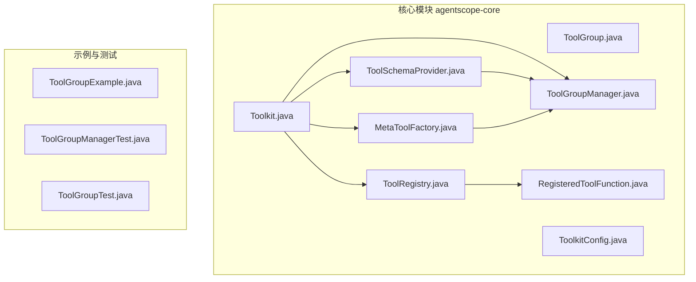
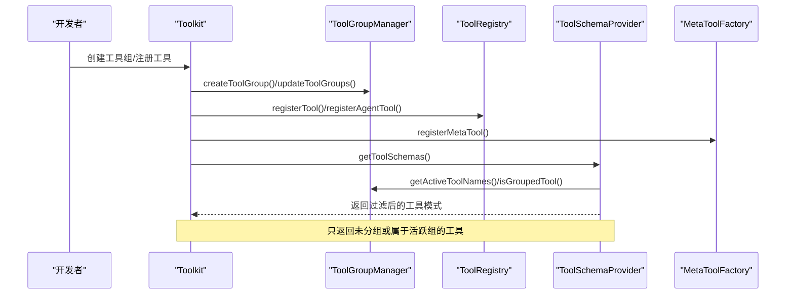
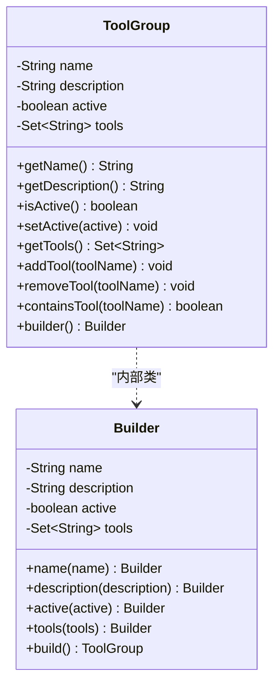
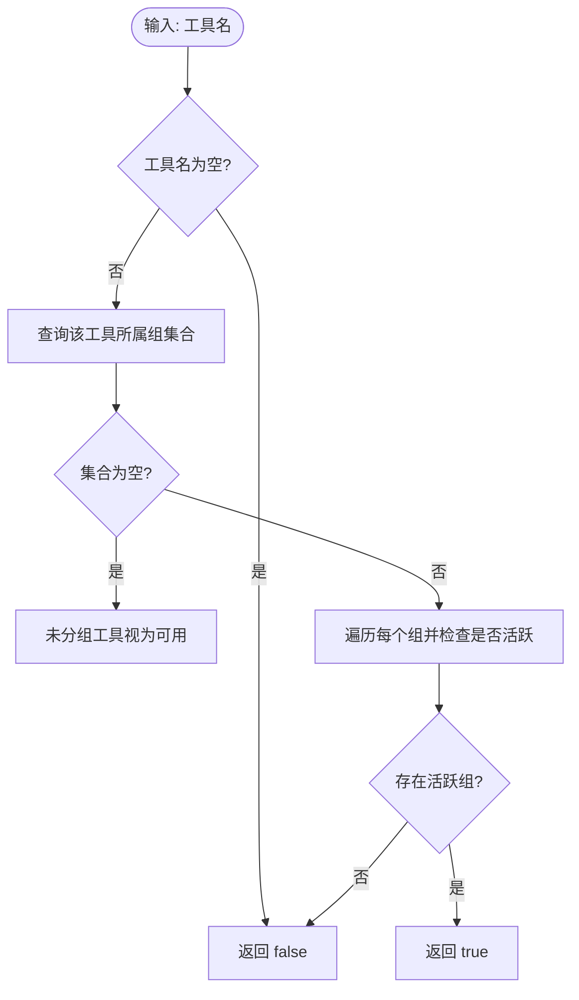
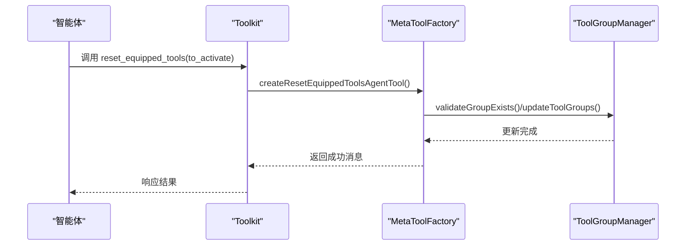
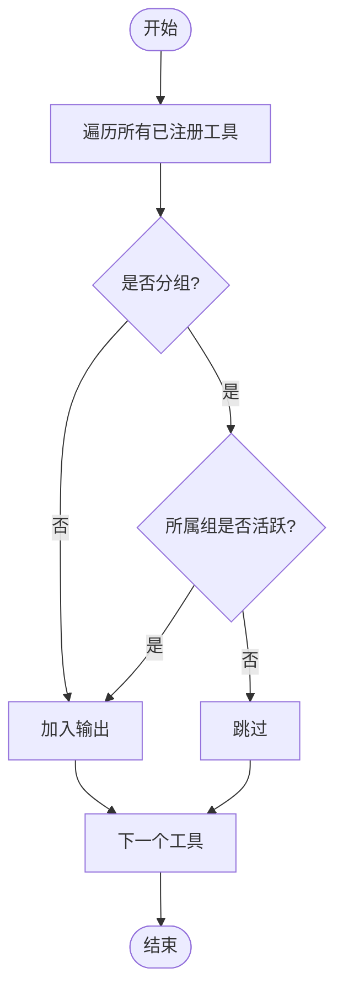
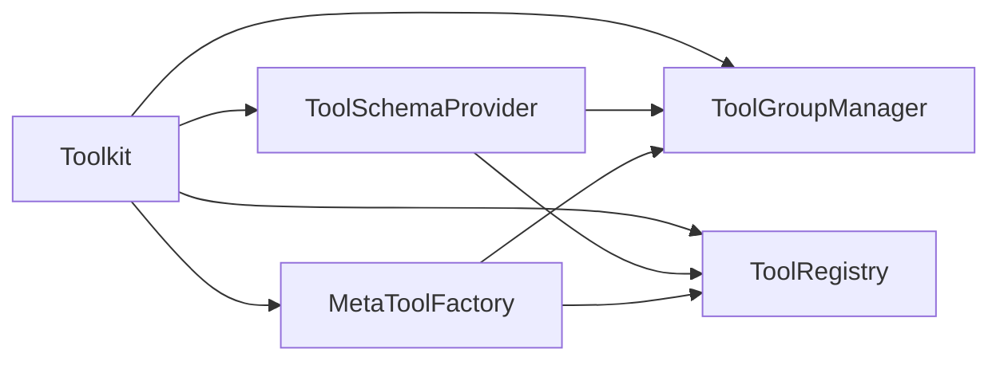

# 工具组管理

<cite>
**本文引用的文件**
- [ToolGroup.java](file://agentscope-core/src/main/java/io/agentscope/core/tool/ToolGroup.java)
- [ToolGroupManager.java](file://agentscope-core/src/main/java/io/agentscope/core/tool/ToolGroupManager.java)
- [Toolkit.java](file://agentscope-core/src/main/java/io/agentscope/core/tool/Toolkit.java)
- [ToolSchemaProvider.java](file://agentscope-core/src/main/java/io/agentscope/core/tool/ToolSchemaProvider.java)
- [MetaToolFactory.java](file://agentscope-core/src/main/java/io/agentscope/core/tool/MetaToolFactory.java)
- [ToolRegistry.java](file://agentscope-core/src/main/java/io/agentscope/core/tool/ToolRegistry.java)
- [RegisteredToolFunction.java](file://agentscope-core/src/main/java/io/agentscope/core/tool/RegisteredToolFunction.java)
- [ToolkitConfig.java](file://agentscope-core/src/main/java/io/agentscope/core/tool/ToolkitConfig.java)
- [ToolGroupExample.java](file://agentscope-examples/quickstart/src/main/java/io/agentscope/examples/quickstart/ToolGroupExample.java)
- [ToolGroupManagerTest.java](file://agentscope-core/src/test/java/io/agentscope/core/tool/ToolGroupManagerTest.java)
- [ToolGroupTest.java](file://agentscope-core/src/test/java/io/agentscope/core/tool/ToolGroupTest.java)
</cite>

## 目录
1. [简介](#简介)
2. [项目结构](#项目结构)
3. [核心组件](#核心组件)
4. [架构总览](#架构总览)
5. [详细组件分析](#详细组件分析)
6. [依赖分析](#依赖分析)
7. [性能考量](#性能考量)
8. [故障排查指南](#故障排查指南)
9. [结论](#结论)
10. [附录](#附录)

## 简介
本文件系统性阐述 AgentScope Java 工具组（ToolGroup）管理能力的设计与实现，重点覆盖以下方面：
- 工具组的概念与设计目的：通过逻辑分组与动态激活/停用机制，实现对智能体可用工具集的精细化控制。
- ToolGroupManager 的管理策略：支持组的创建、批量更新（激活/停用）、删除、查询与状态复制。
- 工具组状态持久化与恢复：通过状态复制与恢复接口，支持会话或运行时状态的保存与加载。
- 在智能体推理过程中的作用：工具组直接影响模型看到的工具清单，从而影响工具可用性判断与调用决策。
- 最佳实践：命名策略、权限控制与安全考虑、按角色/环境切换工具集的应用场景。
- 调试与监控：通过工具组注释输出、活跃组列表与工具可用性检查进行可观测性。

## 项目结构
围绕工具组管理的关键代码位于 agentscope-core 模块的 tool 包中，并由示例工程与测试用例验证其行为。

图表来源
- [Toolkit.java](file://agentscope-core/src/main/java/io/agentscope/core/tool/Toolkit.java)
- [ToolGroupManager.java](file://agentscope-core/src/main/java/io/agentscope/core/tool/ToolGroupManager.java)
- [ToolSchemaProvider.java](file://agentscope-core/src/main/java/io/agentscope/core/tool/ToolSchemaProvider.java)
- [MetaToolFactory.java](file://agentscope-core/src/main/java/io/agentscope/core/tool/MetaToolFactory.java)
- [ToolRegistry.java](file://agentscope-core/src/main/java/io/agentscope/core/tool/ToolRegistry.java)
- [RegisteredToolFunction.java](file://agentscope-core/src/main/java/io/agentscope/core/tool/RegisteredToolFunction.java)
- [ToolkitConfig.java](file://agentscope-core/src/main/java/io/agentscope/core/tool/ToolkitConfig.java)
- [ToolGroupExample.java](file://agentscope-examples/quickstart/src/main/java/io/agentscope/examples/quickstart/ToolGroupExample.java)
- [ToolGroupManagerTest.java](file://agentscope-core/src/test/java/io/agentscope/core/tool/ToolGroupManagerTest.java)
- [ToolGroupTest.java](file://agentscope-core/src/test/java/io/agentscope/core/tool/ToolGroupTest.java)

章节来源
- [Toolkit.java](file://agentscope-core/src/main/java/io/agentscope/core/tool/Toolkit.java)
- [ToolGroupManager.java](file://agentscope-core/src/main/java/io/agentscope/core/tool/ToolGroupManager.java)
- [ToolGroup.java](file://agentscope-core/src/main/java/io/agentscope/core/tool/ToolGroup.java)

## 核心组件
- ToolGroup：表示一个具名工具组，包含名称、描述、激活状态与工具集合。提供构建器模式用于创建与配置。
- ToolGroupManager：负责工具组的生命周期管理，包括创建、更新、删除、查询活跃组、工具到组的映射、以及状态复制与恢复。
- Toolkit：对外暴露的工具箱入口，封装工具注册、工具组管理、元工具注册、执行器与模式参数生成等。
- ToolSchemaProvider：根据当前活跃工具组过滤并生成工具模式清单，供模型消费。
- MetaToolFactory：生成“重置装备工具”元工具，允许智能体在推理过程中动态激活指定工具组。
- ToolRegistry 与 RegisteredToolFunction：维护已注册工具及其元数据（含预设参数、扩展模型等），并与工具组建立索引。
- ToolkitConfig：提供执行配置与工具删除开关，影响工具组管理的行为边界（例如禁用删除时忽略停用/删除请求）。

章节来源
- [ToolGroup.java](file://agentscope-core/src/main/java/io/agentscope/core/tool/ToolGroup.java)
- [ToolGroupManager.java](file://agentscope-core/src/main/java/io/agentscope/core/tool/ToolGroupManager.java)
- [Toolkit.java](file://agentscope-core/src/main/java/io/agentscope/core/tool/Toolkit.java)
- [ToolSchemaProvider.java](file://agentscope-core/src/main/java/io/agentscope/core/tool/ToolSchemaProvider.java)
- [MetaToolFactory.java](file://agentscope-core/src/main/java/io/agentscope/core/tool/MetaToolFactory.java)
- [ToolRegistry.java](file://agentscope-core/src/main/java/io/agentscope/core/tool/ToolRegistry.java)
- [RegisteredToolFunction.java](file://agentscope-core/src/main/java/io/agentscope/core/tool/RegisteredToolFunction.java)
- [ToolkitConfig.java](file://agentscope-core/src/main/java/io/agentscope/core/tool/ToolkitConfig.java)

## 架构总览
工具组管理贯穿工具注册、模式生成、智能体推理与状态恢复的全链路。

图表来源
- [Toolkit.java](file://agentscope-core/src/main/java/io/agentscope/core/tool/Toolkit.java)
- [ToolGroupManager.java](file://agentscope-core/src/main/java/io/agentscope/core/tool/ToolGroupManager.java)
- [ToolSchemaProvider.java](file://agentscope-core/src/main/java/io/agentscope/core/tool/ToolSchemaProvider.java)
- [MetaToolFactory.java](file://agentscope-core/src/main/java/io/agentscope/core/tool/MetaToolFactory.java)

## 详细组件分析

### 组件一：ToolGroup（工具组）
- 设计要点
  - 不可变名称与描述；可变激活状态；内部使用集合存储工具名，提供防御式拷贝。
  - 构建器支持设置名称、描述、初始激活状态与初始工具集合。
- 关键行为
  - 添加/移除/查询工具；判断是否包含某工具；获取工具集合的防御式副本。
- 复杂度
  - 工具集合为无序集合，添加/删除/包含操作平均为 O(1)。
- 安全与健壮性
  - 构建器对名称进行非空校验；工具集合采用不可变语义，避免外部修改内部状态。

图表来源
- [ToolGroup.java](file://agentscope-core/src/main/java/io/agentscope/core/tool/ToolGroup.java)

章节来源
- [ToolGroup.java](file://agentscope-core/src/main/java/io/agentscope/core/tool/ToolGroup.java)
- [ToolGroupTest.java](file://agentscope-core/src/test/java/io/agentscope/core/tool/ToolGroupTest.java)

### 组件二：ToolGroupManager（工具组管理器）
- 管理职责
  - 组的创建、批量更新（激活/停用）、删除、查询与注释生成。
  - 维护“组名到组对象”的映射、“工具到组集合”的反向索引，以及“活跃组列表”。
  - 支持状态复制与恢复（复制到另一个管理器、设置活跃组列表）。
- 关键算法
  - isActiveTool：若工具未分组则视为可用；否则仅当至少一个所属组处于活跃状态时才可用。
  - getActiveToolNames：遍历所有组，收集活跃组中的工具名。
- 并发与一致性
  - 使用并发安全的数据结构与写时复制列表，保证多线程下的正确性与低竞争。
- 错误处理
  - 对不存在的组进行操作时抛出异常；删除不存在组时记录警告并跳过。

图表来源
- [ToolGroupManager.java](file://agentscope-core/src/main/java/io/agentscope/core/tool/ToolGroupManager.java)

章节来源
- [ToolGroupManager.java](file://agentscope-core/src/main/java/io/agentscope/core/tool/ToolGroupManager.java)
- [ToolGroupManagerTest.java](file://agentscope-core/src/test/java/io/agentscope/core/tool/ToolGroupManagerTest.java)

### 组件三：Toolkit（工具箱）
- 角色定位
  - 对外统一入口，封装工具注册、工具组管理、元工具注册、执行器与模式生成。
- 工具组委托
  - 将工具组创建、更新、删除、查询等操作委托给 ToolGroupManager。
  - 提供“设置活跃组列表”接口，供状态恢复使用。
- 元工具集成
  - 注册“重置装备工具”元工具，允许智能体在推理过程中动态激活指定工具组。
- 配置影响
  - 通过 ToolkitConfig 控制是否允许删除工具/组，影响 updateToolGroups/deactivate 与 removeTool/removeToolGroups 的行为。

图表来源
- [Toolkit.java](file://agentscope-core/src/main/java/io/agentscope/core/tool/Toolkit.java)
- [MetaToolFactory.java](file://agentscope-core/src/main/java/io/agentscope/core/tool/MetaToolFactory.java)
- [ToolGroupManager.java](file://agentscope-core/src/main/java/io/agentscope/core/tool/ToolGroupManager.java)

章节来源
- [Toolkit.java](file://agentscope-core/src/main/java/io/agentscope/core/tool/Toolkit.java)
- [MetaToolFactory.java](file://agentscope-core/src/main/java/io/agentscope/core/tool/MetaToolFactory.java)
- [ToolkitConfig.java](file://agentscope-core/src/main/java/io/agentscope/core/tool/ToolkitConfig.java)

### 组件四：ToolSchemaProvider（工具模式提供者）
- 作用
  - 生成可用于模型消费的工具模式清单，严格遵循“只暴露活跃工具”的原则。
- 过滤逻辑
  - 未分组工具始终可见；分组工具仅当其所属组处于活跃状态时才可见。
- 输出
  - 返回包含名称、描述、参数、严格性与输出模式的工具模式列表。

图表来源
- [ToolSchemaProvider.java](file://agentscope-core/src/main/java/io/agentscope/core/tool/ToolSchemaProvider.java)
- [ToolGroupManager.java](file://agentscope-core/src/main/java/io/agentscope/core/tool/ToolGroupManager.java)

章节来源
- [ToolSchemaProvider.java](file://agentscope-core/src/main/java/io/agentscope/core/tool/ToolSchemaProvider.java)

### 组件五：MetaToolFactory（元工具工厂）
- 功能
  - 生成“重置装备工具”，其参数模式基于当前可用工具组动态生成（枚举值来自工具组名）。
  - 实现逻辑仅激活指定组，不自动停用其他组，确保语义清晰且可控。
- 交互
  - 调用 ToolGroupManager 的验证与更新接口，随后汇总被激活的工具清单作为响应。

章节来源
- [MetaToolFactory.java](file://agentscope-core/src/main/java/io/agentscope/core/tool/MetaToolFactory.java)
- [ToolGroupManager.java](file://agentscope-core/src/main/java/io/agentscope/core/tool/ToolGroupManager.java)

### 组件六：ToolRegistry 与 RegisteredToolFunction
- ToolRegistry
  - 维护工具名到 AgentTool 与 RegisteredToolFunction 的映射，支持原子删除、批量删除与深拷贝。
- RegisteredToolFunction
  - 记录工具的扩展模型、MCP 客户端名与预设参数（运行时可更新），并提供扩展参数合并能力。

章节来源
- [ToolRegistry.java](file://agentscope-core/src/main/java/io/agentscope/core/tool/ToolRegistry.java)
- [RegisteredToolFunction.java](file://agentscope-core/src/main/java/io/agentscope/core/tool/RegisteredToolFunction.java)

## 依赖分析
- 组件耦合
  - Toolkit 同时依赖 ToolGroupManager、ToolRegistry、ToolSchemaProvider、MetaToolFactory。
  - ToolSchemaProvider 依赖 ToolGroupManager 与 ToolRegistry。
  - MetaToolFactory 依赖 ToolGroupManager 与 ToolRegistry。
- 数据流
  - 工具注册 → 工具组索引更新 → 模式生成过滤 → 智能体消费。
- 循环依赖
  - 未发现循环依赖；各方向依赖清晰单向。

图表来源
- [Toolkit.java](file://agentscope-core/src/main/java/io/agentscope/core/tool/Toolkit.java)
- [ToolGroupManager.java](file://agentscope-core/src/main/java/io/agentscope/core/tool/ToolGroupManager.java)
- [ToolSchemaProvider.java](file://agentscope-core/src/main/java/io/agentscope/core/tool/ToolSchemaProvider.java)
- [MetaToolFactory.java](file://agentscope-core/src/main/java/io/agentscope/core/tool/MetaToolFactory.java)
- [ToolRegistry.java](file://agentscope-core/src/main/java/io/agentscope/core/tool/ToolRegistry.java)

## 性能考量
- 查询复杂度
  - 工具可用性判断：isActiveTool 对于未分组工具为 O(1)，对于分组工具为 O(k)（k 为所属组数量）。
  - 获取活跃工具名：O(G×T)，G 为组数，T 为每组平均工具数。
- 并发与锁粒度
  - 使用并发映射与写时复制列表，降低锁竞争；适合高并发场景。
- 模式生成
  - ToolSchemaProvider 在每次生成模式时进行过滤，建议在频繁调用场景下缓存结果或按需触发。

## 故障排查指南
- 常见问题与定位
  - “工具组不存在”：通常发生在 updateToolGroups/removeToolGroups/validateGroupExists 时，检查组名拼写与创建顺序。
  - “工具未显示在模型工具清单中”：确认工具所属组是否处于活跃状态；未分组工具默认可见。
  - “元工具未生效”：确认已注册元工具，且智能体具备调用能力；检查 to_activate 参数是否为有效组名列表。
- 调试手段
  - 使用 Toolkit 的活跃组查询与注释输出接口，快速核对当前状态。
  - 通过单元测试用例对照预期行为，定位边界条件（重复激活、空集合、不存在组等）。

章节来源
- [ToolGroupManagerTest.java](file://agentscope-core/src/test/java/io/agentscope/core/tool/ToolGroupManagerTest.java)
- [ToolGroupTest.java](file://agentscope-core/src/test/java/io/agentscope/core/tool/ToolGroupTest.java)

## 结论
工具组管理通过“逻辑分组 + 动态激活/停用 + 模式过滤”的组合，实现了对智能体工具集的细粒度控制。配合元工具与状态恢复能力，可在不同角色、环境与任务场景下灵活切换工具集，提升安全性与可运维性。建议在生产环境中结合配置开关与严格的命名规范，配合可观测性输出，持续优化工具组的使用效果。

## 附录

### 工具组在智能体推理中的作用
- 工具可用性判断
  - 未分组工具默认可用；分组工具仅当其所属组处于活跃状态时才可用。
- 模型工具清单
  - ToolSchemaProvider 依据活跃组过滤工具模式，确保模型仅看到当前可用工具。

章节来源
- [ToolGroupManager.java](file://agentscope-core/src/main/java/io/agentscope/core/tool/ToolGroupManager.java)
- [ToolSchemaProvider.java](file://agentscope-core/src/main/java/io/agentscope/core/tool/ToolSchemaProvider.java)

### 工具组状态持久化与恢复
- 状态复制
  - Toolkit 提供深拷贝能力，复制工具注册表与工具组状态，便于会话或运行时迁移。
- 恢复接口
  - 提供设置活跃组列表的方法，用于从会话或配置中恢复工具组状态。

章节来源
- [Toolkit.java](file://agentscope-core/src/main/java/io/agentscope/core/tool/Toolkit.java)
- [ToolGroupManager.java](file://agentscope-core/src/main/java/io/agentscope/core/tool/ToolGroupManager.java)

### 工具组管理最佳实践
- 命名策略
  - 使用语义化前缀区分角色/环境（如 role_admin、env_prod）。
- 权限控制与安全
  - 通过工具组隔离高风险工具；结合 ToolkitConfig 的删除开关，限制危险操作。
- 应用场景
  - 按角色分配工具：为不同角色创建独立工具组，推理时仅激活对应组。
  - 按环境切换工具集：开发/测试/生产环境分别维护工具组，运行时切换。

章节来源
- [ToolkitConfig.java](file://agentscope-core/src/main/java/io/agentscope/core/tool/ToolkitConfig.java)
- [ToolGroupExample.java](file://agentscope-examples/quickstart/src/main/java/io/agentscope/examples/quickstart/ToolGroupExample.java)

### 调试与监控方法
- 工具组注释输出
  - 使用 getNotes()/getActivatedNotes() 获取当前工具组状态摘要，辅助诊断。
- 活跃组查询
  - 使用 getActiveGroups()/getActiveToolNames() 快速核对当前可用工具集合。
- 示例参考
  - 参考示例工程中的交互提示与调用路径，理解元工具的工作方式。

章节来源
- [ToolGroupManager.java](file://agentscope-core/src/main/java/io/agentscope/core/tool/ToolGroupManager.java)
- [ToolGroupExample.java](file://agentscope-examples/quickstart/src/main/java/io/agentscope/examples/quickstart/ToolGroupExample.java)