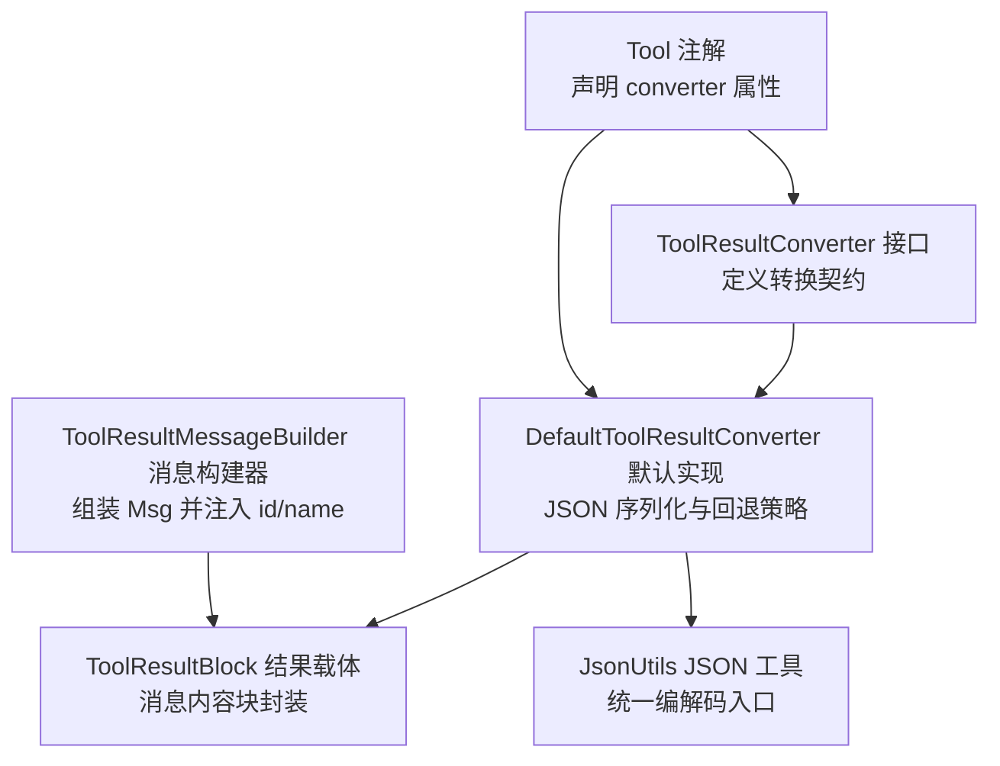
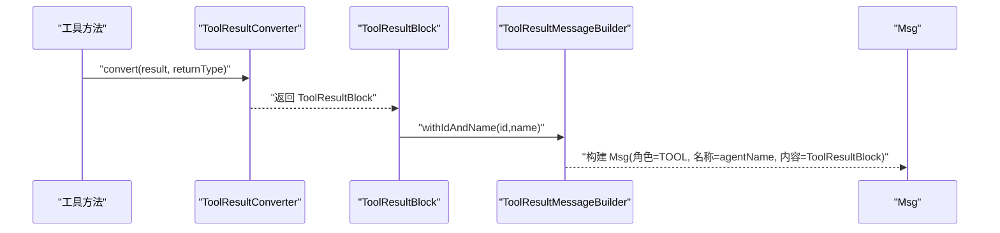
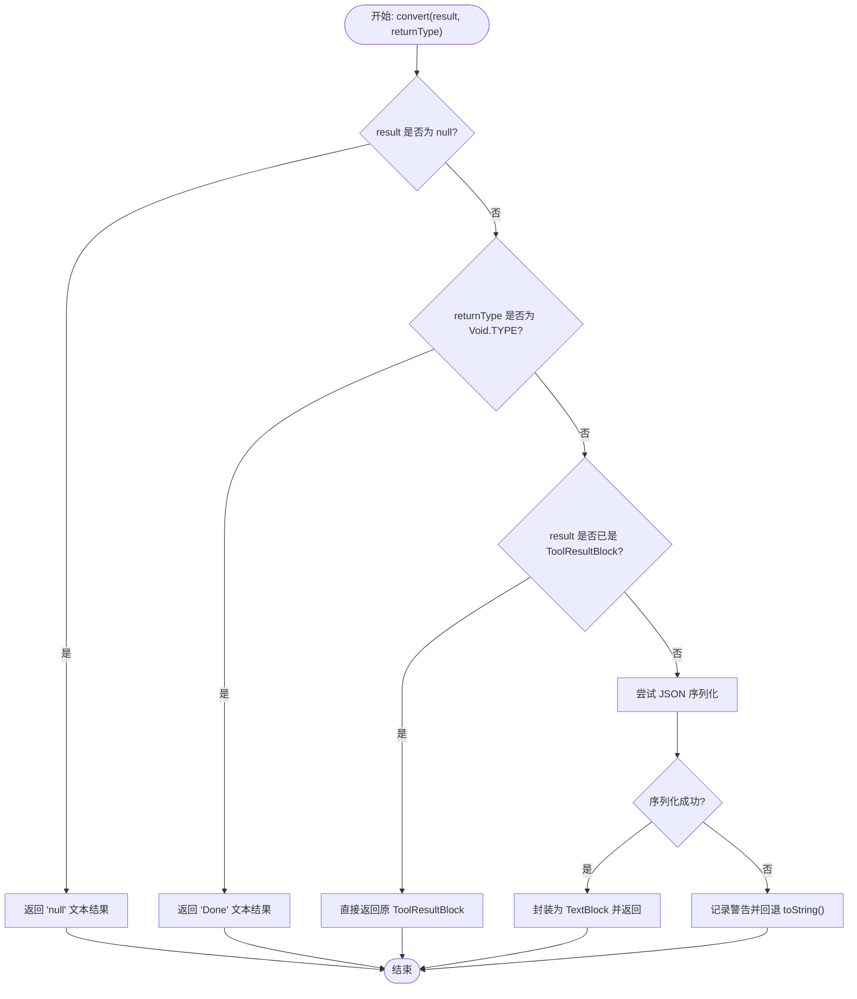
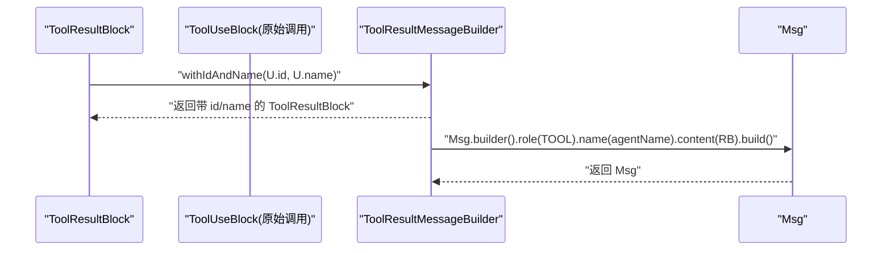
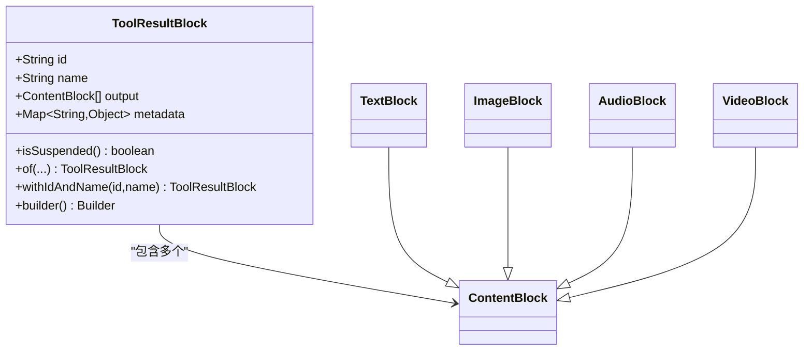
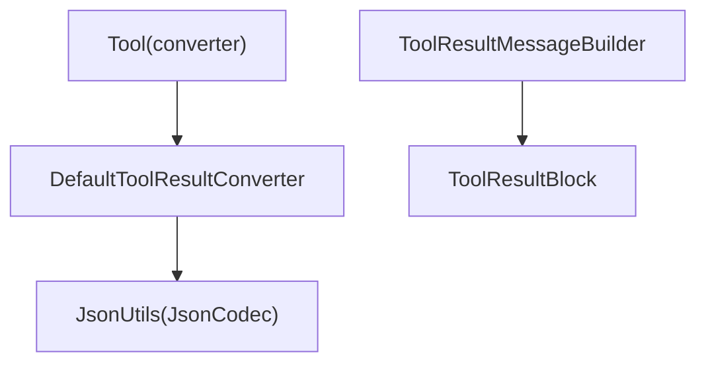

# 工具结果转换

<cite>
**本文引用的文件**
- [ToolResultConverter.java](file://agentscope-core/src/main/java/io/agentscope/core/tool/ToolResultConverter.java)
- [DefaultToolResultConverter.java](file://agentscope-core/src/main/java/io/agentscope/core/tool/DefaultToolResultConverter.java)
- [ToolResultMessageBuilder.java](file://agentscope-core/src/main/java/io/agentscope/core/tool/ToolResultMessageBuilder.java)
- [ToolResultBlock.java](file://agentscope-core/src/main/java/io/agentscope/core/message/ToolResultBlock.java)
- [JsonUtils.java](file://agentscope-core/src/main/java/io/agentscope/core/util/JsonUtils.java)
- [Tool.java](file://agentscope-core/src/main/java/io/agentscope/core/tool/Tool.java)
- [DefaultToolResultConverterTest.java](file://agentscope-core/src/test/java/io/agentscope/core/tool/DefaultToolResultConverterTest.java)
- [ToolResultMessageBuilderTest.java](file://agentscope-core/src/test/java/io/agentscope/core/tool/ToolResultMessageBuilderTest.java)
- [SampleTools.java](file://agentscope-core/src/test/java/io/agentscope/core/tool/test/SampleTools.java)
</cite>

## 目录
1. [简介](#简介)
2. [项目结构](#项目结构)
3. [核心组件](#核心组件)
4. [架构总览](#架构总览)
5. [详细组件分析](#详细组件分析)
6. [依赖分析](#依赖分析)
7. [性能考虑](#性能考虑)
8. [故障排查指南](#故障排查指南)
9. [结论](#结论)
10. [附录](#附录)

## 简介
本文件面向 AgentScope Java 的“工具结果转换”子系统，系统性阐述 ToolResultConverter 接口的设计理念与扩展机制，详解 DefaultToolResultConverter 的默认转换逻辑与适用场景，深入说明自定义转换器的实现方法（继承关系、构造函数要求、转换策略），并解释 ToolResultMessageBuilder 的消息构建过程与格式化规则。文档还提供转换器开发的最佳实践（异常处理、类型安全、性能优化），以及覆盖复杂数据结构、多媒体内容与特殊格式的自定义转换器示例思路，并阐明转换器在工具链中的作用与与其他组件的协作关系。

## 项目结构
围绕工具结果转换的相关模块主要位于 agentscope-core 模块中，涉及工具注解、结果转换接口与默认实现、消息构建器、消息模型以及 JSON 工具类等。下图给出与“工具结果转换”直接相关的文件级关系概览：

图表来源
- [ToolResultConverter.java:1-59](file://agentscope-core/src/main/java/io/agentscope/core/tool/ToolResultConverter.java#L1-L59)
- [DefaultToolResultConverter.java:1-98](file://agentscope-core/src/main/java/io/agentscope/core/tool/DefaultToolResultConverter.java#L1-L98)
- [ToolResultMessageBuilder.java:1-53](file://agentscope-core/src/main/java/io/agentscope/core/tool/ToolResultMessageBuilder.java#L1-L53)
- [ToolResultBlock.java:1-375](file://agentscope-core/src/main/java/io/agentscope/core/message/ToolResultBlock.java#L1-L375)
- [JsonUtils.java:1-153](file://agentscope-core/src/main/java/io/agentscope/core/util/JsonUtils.java#L1-L153)
- [Tool.java:1-134](file://agentscope-core/src/main/java/io/agentscope/core/tool/Tool.java#L1-L134)

章节来源
- [ToolResultConverter.java:1-59](file://agentscope-core/src/main/java/io/agentscope/core/tool/ToolResultConverter.java#L1-L59)
- [DefaultToolResultConverter.java:1-98](file://agentscope-core/src/main/java/io/agentscope/core/tool/DefaultToolResultConverter.java#L1-L98)
- [ToolResultMessageBuilder.java:1-53](file://agentscope-core/src/main/java/io/agentscope/core/tool/ToolResultMessageBuilder.java#L1-L53)
- [ToolResultBlock.java:1-375](file://agentscope-core/src/main/java/io/agentscope/core/message/ToolResultBlock.java#L1-L375)
- [JsonUtils.java:1-153](file://agentscope-core/src/main/java/io/agentscope/core/util/JsonUtils.java#L1-L153)
- [Tool.java:1-134](file://agentscope-core/src/main/java/io/agentscope/core/tool/Tool.java#L1-L134)

## 核心组件
- ToolResultConverter 接口：定义工具方法返回值到 ToolResultBlock 的转换契约，允许针对特定工具定制转换逻辑（如过滤敏感信息、添加元数据、压缩大输出）。
- DefaultToolResultConverter 默认实现：提供通用的 JSON 序列化策略，包含空结果、void 返回、已存在 ToolResultBlock 的快速路径，以及序列化失败时的 toString 回退。
- ToolResultMessageBuilder 消息构建器：将 ToolResultBlock 包装为 Msg，自动从原始 ToolUseBlock 注入 id 与 name，确保消息可被下游模型正确识别。
- ToolResultBlock 结果载体：作为消息的内容块，支持多内容块输出、元数据、挂起状态标记等；同时提供多种静态工厂方法与 Builder。
- JsonUtils JSON 工具：集中管理全局 JsonCodec 实例，支持替换实现与校验工具调用参数的有效性。
- Tool 注解：在工具方法上声明 converter 属性，指定该工具使用的转换器实现，默认使用 DefaultToolResultConverter。

章节来源
- [ToolResultConverter.java:21-58](file://agentscope-core/src/main/java/io/agentscope/core/tool/ToolResultConverter.java#L21-L58)
- [DefaultToolResultConverter.java:26-96](file://agentscope-core/src/main/java/io/agentscope/core/tool/DefaultToolResultConverter.java#L26-L96)
- [ToolResultMessageBuilder.java:23-51](file://agentscope-core/src/main/java/io/agentscope/core/tool/ToolResultMessageBuilder.java#L23-L51)
- [ToolResultBlock.java:26-375](file://agentscope-core/src/main/java/io/agentscope/core/message/ToolResultBlock.java#L26-L375)
- [JsonUtils.java:24-153](file://agentscope-core/src/main/java/io/agentscope/core/util/JsonUtils.java#L24-L153)
- [Tool.java:99-132](file://agentscope-core/src/main/java/io/agentscope/core/tool/Tool.java#L99-L132)

## 架构总览
工具链中的转换流程如下：工具执行完成后，其返回值由 ToolResultConverter 转换为 ToolResultBlock；随后通过 ToolResultMessageBuilder 将结果包装为 Msg（携带工具 id 与 name），最终进入消息通道供后续推理或对话使用。

图表来源
- [DefaultToolResultConverter.java:43-59](file://agentscope-core/src/main/java/io/agentscope/core/tool/DefaultToolResultConverter.java#L43-L59)
- [ToolResultMessageBuilder.java:40-51](file://agentscope-core/src/main/java/io/agentscope/core/tool/ToolResultMessageBuilder.java#L40-L51)
- [ToolResultBlock.java:288-290](file://agentscope-core/src/main/java/io/agentscope/core/message/ToolResultBlock.java#L288-L290)

## 详细组件分析

### ToolResultConverter 接口设计与扩展机制
- 设计理念
  - 明确的职责边界：仅负责将工具返回值转换为 ToolResultBlock，不参与消息路由或模型交互。
  - 可插拔扩展：通过 Tool 注解的 converter 属性，按工具粒度选择不同的转换器实现。
  - 类型安全与灵活性：保留返回类型 Type 以支持泛型场景下的差异化处理。
- 扩展机制
  - 自定义实现需实现 convert 方法，遵循“返回非空 ToolResultBlock”的约束。
  - 可在实现中加入业务规则：如敏感字段过滤、元数据注入、大结果压缩/分页、多媒体内容编码等。
  - 与默认实现的关系：可在默认逻辑基础上进行增强（例如先走默认序列化，再对某些类型追加元数据）。

章节来源
- [ToolResultConverter.java:21-58](file://agentscope-core/src/main/java/io/agentscope/core/tool/ToolResultConverter.java#L21-L58)
- [Tool.java:99-132](file://agentscope-core/src/main/java/io/agentscope/core/tool/Tool.java#L99-L132)

### DefaultToolResultConverter 默认转换逻辑与适用场景
- 适用场景
  - 大多数工具返回简单对象（字符串、数值、布尔、集合、POJO）时的通用处理。
  - 需要稳定 JSON 输出且具备回退策略的场景。
- 默认逻辑要点
  - 空结果：返回包含文本“null”的 ToolResultBlock。
  - void 返回：返回包含文本“Done”的 ToolResultBlock。
  - 已是 ToolResultBlock：直接透传，避免重复封装。
  - 其他对象：使用 JsonUtils 的 JsonCodec 进行 JSON 序列化；若失败则回退到 toString()。
- 关键实现位置
  - 空/void/透传分支：[DefaultToolResultConverter.java:44-59](file://agentscope-core/src/main/java/io/agentscope/core/tool/DefaultToolResultConverter.java#L44-L59)
  - JSON 序列化与回退：[DefaultToolResultConverter.java:86-96](file://agentscope-core/src/main/java/io/agentscope/core/tool/DefaultToolResultConverter.java#L86-L96)
  - JSON 编解码入口：[JsonUtils.java:64-66](file://agentscope-core/src/main/java/io/agentscope/core/util/JsonUtils.java#L64-L66)

图表来源
- [DefaultToolResultConverter.java:44-96](file://agentscope-core/src/main/java/io/agentscope/core/tool/DefaultToolResultConverter.java#L44-L96)

章节来源
- [DefaultToolResultConverter.java:26-96](file://agentscope-core/src/main/java/io/agentscope/core/tool/DefaultToolResultConverter.java#L26-L96)
- [JsonUtils.java:24-153](file://agentscope-core/src/main/java/io/agentscope/core/util/JsonUtils.java#L24-L153)

### 自定义转换器实现方法
- 继承关系与接口实现
  - 实现 ToolResultConverter 接口，重写 convert 方法。
  - 若需要复用默认逻辑，可参考 DefaultToolResultConverter 的分支策略，在必要处插入自定义处理后再委托给默认实现或直接返回。
- 构造函数要求
  - 无强制要求；但若需要访问全局 JsonCodec 或其他单例服务，可通过 JsonUtils 获取实例。
- 转换策略建议
  - 类型分流：对不同返回类型采用差异化处理（如 Map 增加摘要元数据、List 分页截断、图片二进制转 Base64）。
  - 安全与合规：对可能包含敏感信息的对象进行字段过滤或脱敏。
  - 性能优化：对大对象优先采用流式/分页输出，或在序列化前进行压缩。
  - 元数据：为 ToolResultBlock 添加执行耗时、版本号、来源标识等。
- 在工具上的应用
  - 通过 @Tool(converter=...) 指定自定义转换器类，使该工具方法使用自定义逻辑。

章节来源
- [ToolResultConverter.java:21-58](file://agentscope-core/src/main/java/io/agentscope/core/tool/ToolResultConverter.java#L21-L58)
- [Tool.java:99-132](file://agentscope-core/src/main/java/io/agentscope/core/tool/Tool.java#L99-L132)
- [JsonUtils.java:64-66](file://agentscope-core/src/main/java/io/agentscope/core/util/JsonUtils.java#L64-L66)

### ToolResultMessageBuilder 的消息构建过程与格式化规则
- 构建流程
  - 从 ToolResultBlock 中提取输出内容列表，设置 Msg 的角色为 TOOL。
  - 使用原始 ToolUseBlock 的 id 与 name 调整 ToolResultBlock 的标识，确保消息可被模型识别与关联。
  - 设置 Msg 的名称为调用者（Agent）名称，便于上下文追踪。
- 格式化规则
  - ToolResultBlock 必须包含至少一个 ContentBlock 输出；当输入为空时，应保证输出列表非空（默认实现会保证）。
  - id 与 name 来源于原始调用，用于跨回合关联工具执行结果。
- 测试验证
  - 单测覆盖了单文本块输出、空输出列表、id/name 保留等关键行为。

图表来源
- [ToolResultMessageBuilder.java:40-51](file://agentscope-core/src/main/java/io/agentscope/core/tool/ToolResultMessageBuilder.java#L40-L51)
- [ToolResultBlock.java:288-290](file://agentscope-core/src/main/java/io/agentscope/core/message/ToolResultBlock.java#L288-L290)

章节来源
- [ToolResultMessageBuilder.java:23-51](file://agentscope-core/src/main/java/io/agentscope/core/tool/ToolResultMessageBuilder.java#L23-L51)
- [ToolResultMessageBuilderTest.java:35-114](file://agentscope-core/src/test/java/io/agentscope/core/tool/ToolResultMessageBuilderTest.java#L35-L114)

### 数据模型与消息结构
- ToolResultBlock
  - 字段：id、name、output（内容块列表）、metadata（元数据映射）。
  - 能力：支持挂起状态标记、错误结果构造、文本结果构造、Builder 构建、withIdAndName 重绑定 id/name。
- 相关内容块
  - TextBlock、ImageBlock、AudioBlock、VideoBlock 等均作为 ContentBlock 的具体实现，可组合在 ToolResultBlock 的 output 列表中，以支持多媒体与复合内容。

图表来源
- [ToolResultBlock.java:35-375](file://agentscope-core/src/main/java/io/agentscope/core/message/ToolResultBlock.java#L35-L375)

章节来源
- [ToolResultBlock.java:26-375](file://agentscope-core/src/main/java/io/agentscope/core/message/ToolResultBlock.java#L26-L375)

### 自定义转换器示例思路（不含代码）
- 复杂数据结构
  - 场景：返回大型查询结果集或树形结构。
  - 策略：序列化后进行摘要统计（如总数、关键字段分布），并将摘要作为元数据附加；对结果集进行分页或采样，仅保留关键条目。
- 多媒体内容
  - 场景：返回图片/音频/视频文件。
  - 策略：将二进制内容转为 Base64，封装为对应的 ContentBlock（如 ImageBlock），并在元数据中标注格式与尺寸；对超大文件提供缩略图与链接。
- 特殊格式
  - 场景：返回时间序列、地理坐标、加密数据。
  - 策略：对时间序列进行降采样与统计摘要；对坐标进行区域聚合；对加密数据提供解密提示或摘要信息而非明文。
- 异常与错误
  - 场景：工具抛出异常或返回错误对象。
  - 策略：捕获异常并构造 ToolResultBlock.error(...)，或在 convert 中识别错误对象并标准化为错误结果；保留原始堆栈摘要以便调试。
- 元数据与追踪
  - 场景：需要在结果中附加执行上下文。
  - 策略：在 convert 中为 ToolResultBlock 注入 metadata（如执行耗时、版本号、来源服务名），便于日志与可观测性。

## 依赖分析
- 组件耦合
  - DefaultToolResultConverter 依赖 JsonUtils 提供的 JsonCodec，实现 JSON 序列化；当序列化失败时回退到 toString()。
  - ToolResultMessageBuilder 依赖 ToolResultBlock 的(withIdAndName)能力，将原始调用的 id/name 注入结果。
  - Tool 注解通过 converter 属性将工具方法与转换器实现解耦，提升可配置性。
- 外部依赖
  - JsonUtils 默认使用 JacksonJsonCodec，用户可替换为其他实现（如 Gson/Fastjson）以满足性能或兼容性需求。

图表来源
- [DefaultToolResultConverter.java:86-96](file://agentscope-core/src/main/java/io/agentscope/core/tool/DefaultToolResultConverter.java#L86-L96)
- [ToolResultMessageBuilder.java:40-51](file://agentscope-core/src/main/java/io/agentscope/core/tool/ToolResultMessageBuilder.java#L40-L51)
- [Tool.java:132](file://agentscope-core/src/main/java/io/agentscope/core/tool/Tool.java#L132)

章节来源
- [JsonUtils.java:64-82](file://agentscope-core/src/main/java/io/agentscope/core/util/JsonUtils.java#L64-L82)
- [Tool.java:132](file://agentscope-core/src/main/java/io/agentscope/core/tool/Tool.java#L132)

## 性能考虑
- 序列化成本
  - 对于大型对象，优先考虑分页、采样或摘要输出，减少 JSON 字符串长度。
  - 使用缓存策略复用 JsonCodec 实例，避免频繁创建。
- 回退策略
  - 默认实现对序列化失败回退 toString()，在大数据量场景下可能引入额外开销；建议在转换器中提前判断不可序列化类型并直接返回简化结果。
- I/O 与网络
  - 多媒体内容建议采用流式传输或外部存储链接，避免将大体积数据直接嵌入消息。
- 并发与线程安全
  - JsonCodec 实现需保证线程安全；如使用自定义实现，确保并发调用下的稳定性。

## 故障排查指南
- 常见问题
  - 结果未按预期格式：检查是否正确使用 ToolResultBlock.Builder 或 of(...) 工厂方法；确认输出列表非空。
  - JSON 序列化失败：查看日志中的警告信息；在转换器中增加更严格的类型判断与异常捕获。
  - 消息缺少 id/name：确认 ToolResultMessageBuilder 的输入 ToolResultBlock 已通过 withIdAndName 注入。
- 单元测试参考
  - DefaultToolResultConverterTest：覆盖空结果、void、ToolResultBlock 透传、基本类型、复杂对象、日期类型、回退策略等。
  - ToolResultMessageBuilderTest：覆盖单文本块、空输出列表、id/name 保留等。
  - SampleTools：提供多种工具方法示例，便于集成测试与端到端验证。

章节来源
- [DefaultToolResultConverterTest.java:53-336](file://agentscope-core/src/test/java/io/agentscope/core/tool/DefaultToolResultConverterTest.java#L53-L336)
- [ToolResultMessageBuilderTest.java:35-114](file://agentscope-core/src/test/java/io/agentscope/core/tool/ToolResultMessageBuilderTest.java#L35-L114)
- [SampleTools.java:30-156](file://agentscope-core/src/test/java/io/agentscope/core/tool/test/SampleTools.java#L30-L156)

## 结论
ToolResultConverter 与 DefaultToolResultConverter 为 AgentScope Java 的工具链提供了稳定、可扩展的结果转换能力。通过 Tool 注解的 converter 属性，开发者可以按工具粒度定制转换策略，兼顾类型安全、性能与可维护性。配合 ToolResultMessageBuilder 与 ToolResultBlock 的消息封装机制，转换后的结果能够被下游模型正确识别与处理。建议在实际工程中结合业务场景，采用分层策略（默认 + 增强）与完善的异常处理，持续优化序列化与 I/O 性能，并通过单元测试与集成测试保障质量。

## 附录
- 最佳实践清单
  - 明确转换边界：仅做结果到 ToolResultBlock 的转换，不混入业务决策。
  - 类型分流：对不同返回类型采用差异化处理，避免一刀切。
  - 元数据驱动：为结果附加执行上下文，提升可观测性。
  - 安全优先：对敏感信息进行过滤或脱敏。
  - 性能优先：对大对象进行分页、采样或摘要输出。
  - 可替换性：通过 JsonUtils 替换 JsonCodec 实现，适配不同场景。
  - 可测试性：编写覆盖空/异常/边界场景的单元测试。