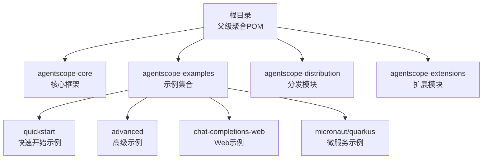
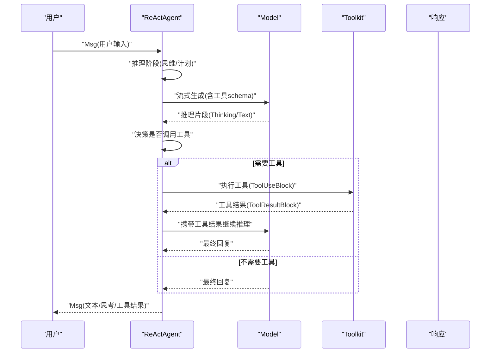
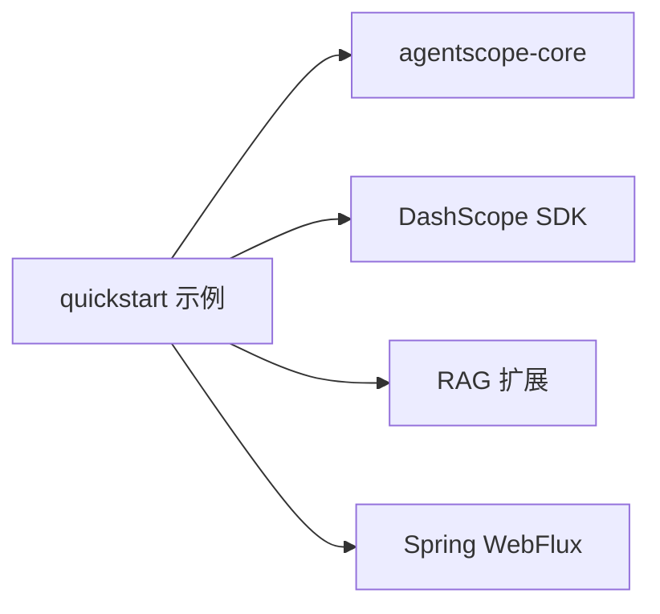

# 快速开始

<cite>
**本文引用的文件**
- [README.md](file://README.md)
- [pom.xml](file://pom.xml)
- [agentscope-core/src/main/java/io/agentscope/core/ReActAgent.java](file://agentscope-core/src/main/java/io/agentscope/core/ReActAgent.java)
- [agentscope-core/src/main/java/io/agentscope/core/model/Model.java](file://agentscope-core/src/main/java/io/agentscope/core/model/Model.java)
- [agentscope-core/src/main/java/io/agentscope/core/message/Msg.java](file://agentscope-core/src/main/java/io/agentscope/core/message/Msg.java)
- [agentscope-core/src/main/java/io/agentscope/core/tool/Tool.java](file://agentscope-core/src/main/java/io/agentscope/core/tool/Tool.java)
- [agentscope-core/src/main/java/io/agentscope/core/tool/Toolkit.java](file://agentscope-core/src/main/java/io/agentscope/core/tool/Toolkit.java)
- [agentscope-examples/README.md](file://agentscope-examples/README.md)
- [agentscope-examples/quickstart/src/main/java/io/agentscope/examples/quickstart/BasicChatExample.java](file://agentscope-examples/quickstart/src/main/java/io/agentscope/examples/quickstart/BasicChatExample.java)
- [agentscope-examples/quickstart/src/main/java/io/agentscope/examples/quickstart/ToolCallingExample.java](file://agentscope-examples/quickstart/src/main/java/io/agentscope/examples/quickstart/ToolCallingExample.java)
- [agentscope-examples/quickstart/src/main/java/io/agentscope/examples/quickstart/StructuredOutputExample.java](file://agentscope-examples/quickstart/src/main/java/io/agentscope/examples/quickstart/StructuredOutputExample.java)
- [agentscope-examples/quickstart/src/main/java/io/agentscope/examples/quickstart/ExampleUtils.java](file://agentscope-examples/quickstart/src/main/java/io/agentscope/examples/quickstart/ExampleUtils.java)
- [agentscope-examples/quickstart/pom.xml](file://agentscope-examples/quickstart/pom.xml)
</cite>

## 目录
1. [简介](#简介)
2. [项目结构](#项目结构)
3. [核心组件](#核心组件)
4. [架构总览](#架构总览)
5. [详细组件分析](#详细组件分析)
6. [依赖分析](#依赖分析)
7. [性能考虑](#性能考虑)
8. [故障排除指南](#故障排除指南)
9. [结论](#结论)
10. [附录](#附录)

## 简介
本指南面向首次接触 AgentScope Java 的开发者，帮助你在最短时间内完成环境准备、安装依赖、配置模型与工具，并运行第一个 ReActAgent 聊天示例。你将了解智能体构建器、消息传递与响应处理等关键概念，并掌握常见问题的排查方法。

## 项目结构
AgentScope Java 采用多模块结构，核心能力集中在 agentscope-core，示例位于 agentscope-examples。快速开始示例位于 quickstart 模块中，便于直接上手。



图示来源
- [pom.xml:56-63](file://pom.xml#L56-L63)
- [agentscope-examples/pom.xml:34-59](file://agentscope-examples/pom.xml#L34-L59)

章节来源
- [pom.xml:56-63](file://pom.xml#L56-L63)
- [agentscope-examples/pom.xml:34-59](file://agentscope-examples/pom.xml#L34-L59)

## 核心组件
- ReActAgent：基于 ReAct 思维-行动循环的智能体实现，支持推理、工具调用、记忆与结构化输出。
- Model 接口：统一的模型抽象，负责流式生成对话响应。
- Msg 消息模型：承载文本、思考、工具调用/结果等多模态内容块。
- Tool 与 Toolkit：注解驱动的工具定义与注册中心，支持动态组管理与外部 MCP 工具接入。
- 示例工具链：提供交互式聊天、工具调用、结构化输出等入门示例。

章节来源
- [agentscope-core/src/main/java/io/agentscope/core/ReActAgent.java:93-139](file://agentscope-core/src/main/java/io/agentscope/core/ReActAgent.java#L93-L139)
- [agentscope-core/src/main/java/io/agentscope/core/model/Model.java:22-41](file://agentscope-core/src/main/java/io/agentscope/core/model/Model.java#L22-L41)
- [agentscope-core/src/main/java/io/agentscope/core/message/Msg.java:38-51](file://agentscope-core/src/main/java/io/agentscope/core/message/Msg.java#L38-L51)
- [agentscope-core/src/main/java/io/agentscope/core/tool/Tool.java:24-56](file://agentscope-core/src/main/java/io/agentscope/core/tool/Tool.java#L24-L56)
- [agentscope-core/src/main/java/io/agentscope/core/tool/Toolkit.java:37-65](file://agentscope-core/src/main/java/io/agentscope/core/tool/Toolkit.java#L37-L65)

## 架构总览
下图展示了从用户输入到模型推理再到工具执行与响应返回的整体流程。



图示来源
- [agentscope-core/src/main/java/io/agentscope/core/ReActAgent.java:560-650](file://agentscope-core/src/main/java/io/agentscope/core/ReActAgent.java#L560-L650)
- [agentscope-core/src/main/java/io/agentscope/core/tool/Toolkit.java:510-524](file://agentscope-core/src/main/java/io/agentscope/core/tool/Toolkit.java#L510-L524)
- [agentscope-core/src/main/java/io/agentscope/core/model/Model.java:24-33](file://agentscope-core/src/main/java/io/agentscope/core/model/Model.java#L24-L33)

## 详细组件分析

### 安装与环境要求
- JDK 17 或更高版本
- Maven 3.6+（用于示例编译与运行）
- 可选：DashScope API Key（示例默认使用）

章节来源
- [README.md:72-82](file://README.md#L72-L82)
- [agentscope-examples/README.md:7-11](file://agentscope-examples/README.md#L7-L11)

### Maven 依赖配置
在你的 Maven 项目中添加对 agentscope 的依赖（以示例 quickstart 为例），并确保 JDK 版本为 17。

```xml
<dependency>
    <groupId>io.agentscope</groupId>
    <artifactId>agentscope-core</artifactId>
    <version>版本号</version>
</dependency>
```

章节来源
- [agentscope-examples/quickstart/pom.xml:56-60](file://agentscope-examples/quickstart/pom.xml#L56-L60)
- [pom.xml:33-35](file://pom.xml#L33-L35)

### 创建第一个智能体：ReActAgent 基础配置
- 使用 ReActAgent.builder() 进行配置，至少包含：
  - name：智能体名称
  - sysPrompt：系统提示词
  - model：模型实例（示例使用 DashScopeChatModel）
  - memory：内存（示例使用 InMemoryMemory）
  - toolkit：工具箱（可为空）

章节来源
- [agentscope-examples/quickstart/src/main/java/io/agentscope/examples/quickstart/BasicChatExample.java:41-59](file://agentscope-examples/quickstart/src/main/java/io/agentscope/examples/quickstart/BasicChatExample.java#L41-L59)

### 模型集成
- Model 接口定义了 stream(...) 方法，负责将消息与工具 schema 发送给模型并返回流式响应。
- 示例中使用 DashScopeChatModel 并设置流式输出与思考内容开关。

章节来源
- [agentscope-core/src/main/java/io/agentscope/core/model/Model.java:24-33](file://agentscope-core/src/main/java/io/agentscope/core/model/Model.java#L24-L33)
- [agentscope-examples/quickstart/src/main/java/io/agentscope/examples/quickstart/BasicChatExample.java:45-56](file://agentscope-examples/quickstart/src/main/java/io/agentscope/examples/quickstart/BasicChatExample.java#L45-L56)

### 消息传递与响应处理
- Msg 是消息载体，支持多种内容块（文本、思考、工具调用/结果等）。
- 智能体通过 agent.call(...) 或 agent.stream(...) 获取响应；响应可通过 Msg.getTextContent() 提取纯文本，或通过 getStructuredData(...) 获取结构化数据。

章节来源
- [agentscope-core/src/main/java/io/agentscope/core/message/Msg.java:380-388](file://agentscope-core/src/main/java/io/agentscope/core/message/Msg.java#L380-L388)
- [agentscope-core/src/main/java/io/agentscope/core/message/Msg.java:267-291](file://agentscope-core/src/main/java/io/agentscope/core/message/Msg.java#L267-L291)

### 工具调用（@Tool 与 Toolkit）
- 使用 @Tool 注解标注方法，声明工具名与参数描述。
- 将工具对象注册到 Toolkit，智能体即可在推理过程中自动选择并调用工具。
- 示例演示了时间查询、计算器与模拟搜索三个工具。

章节来源
- [agentscope-core/src/main/java/io/agentscope/core/tool/Tool.java:60-98](file://agentscope-core/src/main/java/io/agentscope/core/tool/Tool.java#L60-L98)
- [agentscope-core/src/main/java/io/agentscope/core/tool/Toolkit.java:154-197](file://agentscope-core/src/main/java/io/agentscope/core/tool/Toolkit.java#L154-L197)
- [agentscope-examples/quickstart/src/main/java/io/agentscope/examples/quickstart/ToolCallingExample.java:44-75](file://agentscope-examples/quickstart/src/main/java/io/agentscope/examples/quickstart/ToolCallingExample.java#L44-L75)

### 结构化输出
- 通过在 call(...) 或 stream(...) 中指定目标类型（如 POJO 类），智能体将返回结构化数据。
- 示例展示了产品需求提取、联系人信息抽取与情感分析三类场景。

章节来源
- [agentscope-examples/quickstart/src/main/java/io/agentscope/examples/quickstart/StructuredOutputExample.java:105-120](file://agentscope-examples/quickstart/src/main/java/io/agentscope/examples/quickstart/StructuredOutputExample.java#L105-L120)
- [agentscope-examples/quickstart/src/main/java/io/agentscope/examples/quickstart/StructuredOutputExample.java:140-154](file://agentscope-examples/quickstart/src/main/java/io/agentscope/examples/quickstart/StructuredOutputExample.java#L140-L154)
- [agentscope-examples/quickstart/src/main/java/io/agentscope/examples/quickstart/StructuredOutputExample.java:178-194](file://agentscope-examples/quickstart/src/main/java/io/agentscope/examples/quickstart/StructuredOutputExample.java#L178-L194)

### 关键概念：智能体构建器、消息传递与响应处理
- 构建器：通过 builder() 配置 name、sysPrompt、model、memory、toolkit 等。
- 消息传递：Msg 作为统一载体，支持文本、思考、工具调用/结果等多模态内容。
- 响应处理：支持同步 block() 与流式 stream()，可按需提取结构化数据或纯文本。

章节来源
- [agentscope-core/src/main/java/io/agentscope/core/ReActAgent.java:364-398](file://agentscope-core/src/main/java/io/agentscope/core/ReActAgent.java#L364-L398)
- [agentscope-core/src/main/java/io/agentscope/core/message/Msg.java:500-654](file://agentscope-core/src/main/java/io/agentscope/core/message/Msg.java#L500-L654)

### 运行步骤（以 BasicChatExample 为例）
- 设置 DashScope API Key（环境变量或交互输入）
- 编译并运行示例：
  - mvn exec:java -Dexec.mainClass="io.agentscope.examples.quickstart.BasicChatExample"
- 在控制台与智能体交互，输入 exit 退出

章节来源
- [agentscope-examples/README.md:13-23](file://agentscope-examples/README.md#L13-L23)
- [agentscope-examples/README.md:53-55](file://agentscope-examples/README.md#L53-L55)
- [agentscope-examples/quickstart/src/main/java/io/agentscope/examples/quickstart/BasicChatExample.java:30-63](file://agentscope-examples/quickstart/src/main/java/io/agentscope/examples/quickstart/BasicChatExample.java#L30-L63)

## 依赖分析
- quickstart 示例依赖 agentscope-core，并可选引入 DashScope SDK、RAG 扩展与 Spring WebFlux。
- 父级 POM 统一管理 Java 版本（JDK 17）与插件。



图示来源
- [agentscope-examples/quickstart/pom.xml:56-112](file://agentscope-examples/quickstart/pom.xml#L56-L112)
- [pom.xml:33-35](file://pom.xml#L33-L35)

章节来源
- [agentscope-examples/quickstart/pom.xml:56-112](file://agentscope-examples/quickstart/pom.xml#L56-L112)
- [pom.xml:33-35](file://pom.xml#L33-L35)

## 性能考虑
- 使用流式接口（stream）可获得更实时的响应体验。
- 合理设置模型生成选项（如思考预算）以平衡性能与质量。
- 工具执行可配置并行策略，注意资源占用与超时控制。

## 故障排除指南
- “未找到 DASHSCOPE_API_KEY”
  - 方案：设置环境变量 export DASHSCOPE_API_KEY=your_key 或在示例交互中输入
- “编译错误：请先安装主库”
  - 方案：先在 agentscope-core 目录执行 mvn clean install
- “MCP 服务器连接失败”
  - 方案：安装对应 MCP 服务器（如 @modelcontextprotocol/server-filesystem）

章节来源
- [agentscope-examples/README.md:359-366](file://agentscope-examples/README.md#L359-L366)
- [agentscope-examples/README.md:379-385](file://agentscope-examples/README.md#L379-L385)
- [agentscope-examples/README.md:368-377](file://agentscope-examples/README.md#L368-L377)

## 结论
通过本指南，你已完成了环境准备、依赖配置与第一个 ReActAgent 的运行。建议继续探索工具调用与结构化输出示例，逐步掌握 AgentScope Java 的核心能力。

## 附录
- 快速开始示例清单与运行命令参考：
  - BasicChatExample：基础聊天
  - ToolCallingExample：工具调用
  - StructuredOutputExample：结构化输出
- 示例交互入口与工具链封装由 ExampleUtils 提供，支持流式输出与回退逻辑。

章节来源
- [agentscope-examples/README.md:35-46](file://agentscope-examples/README.md#L35-L46)
- [agentscope-examples/quickstart/src/main/java/io/agentscope/examples/quickstart/ExampleUtils.java:131-255](file://agentscope-examples/quickstart/src/main/java/io/agentscope/examples/quickstart/ExampleUtils.java#L131-L255)