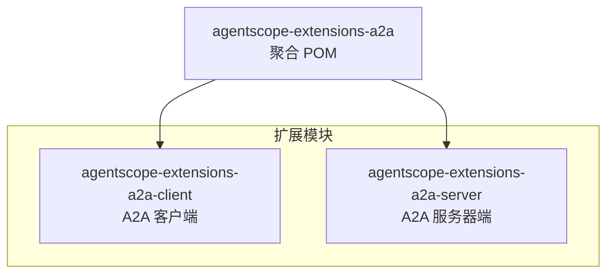
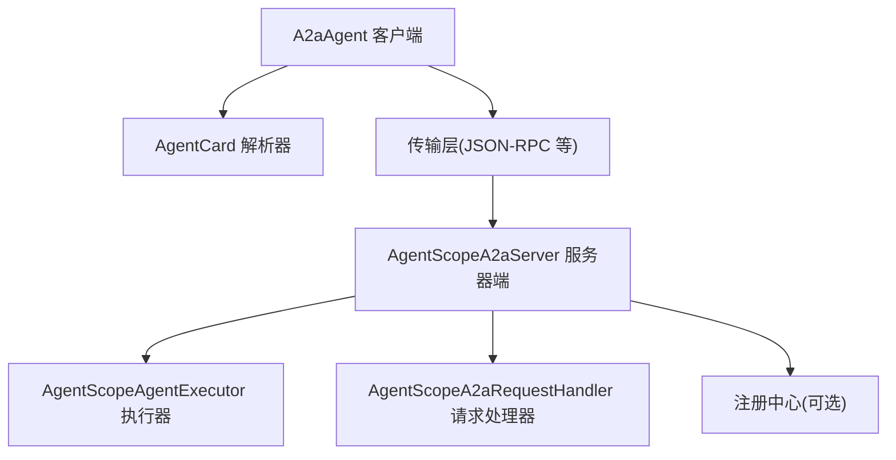
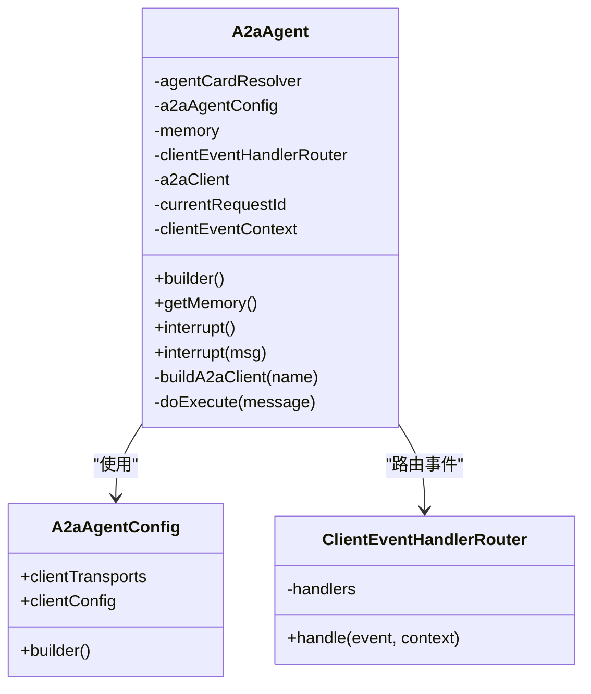
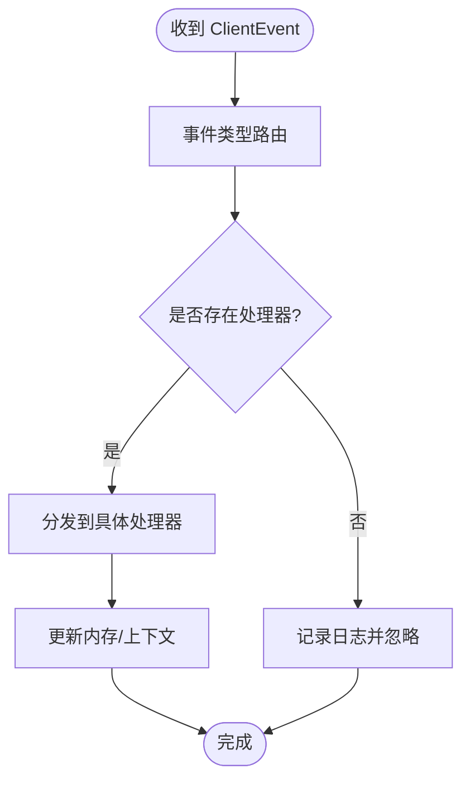
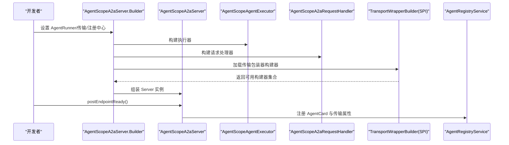
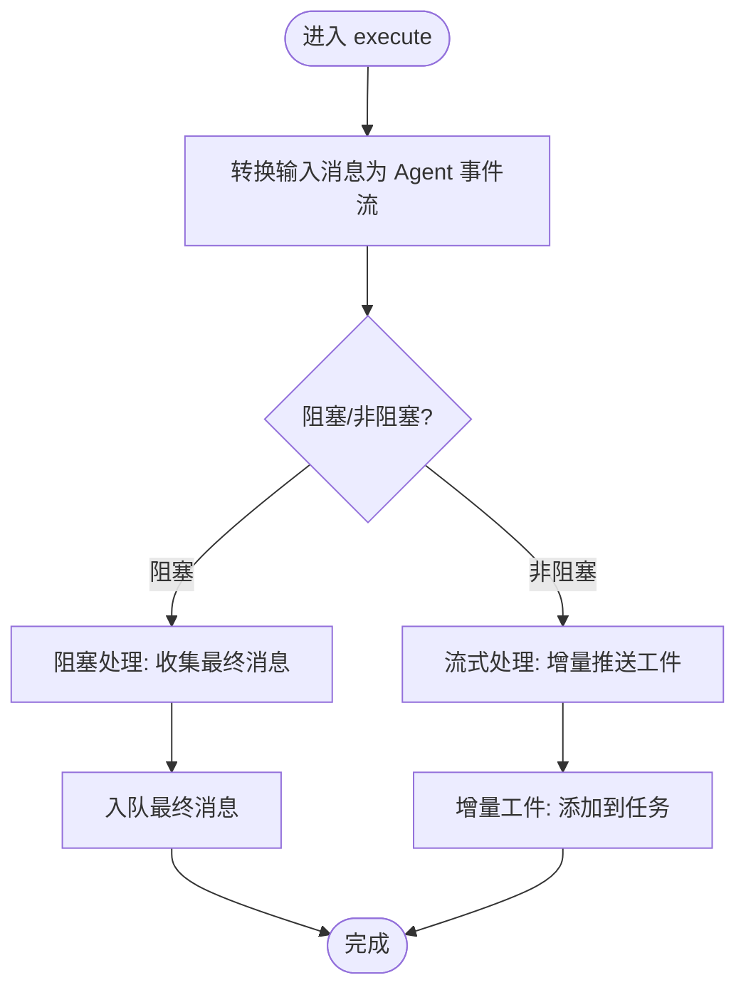
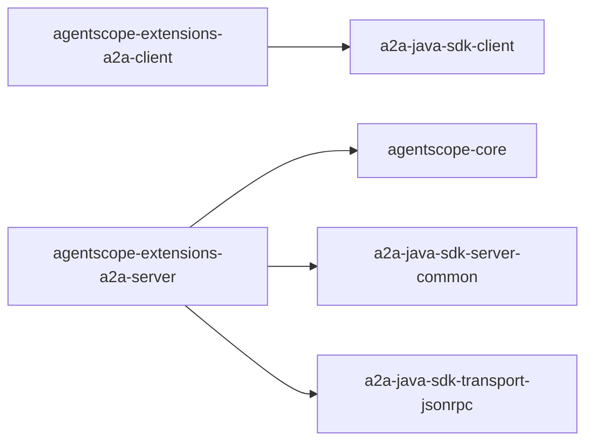
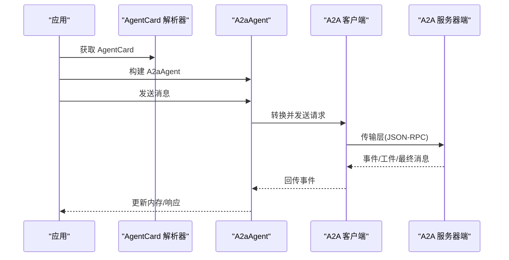

# A2A 协议扩展

<cite>
**本文引用的文件**
- [A2aAgent.java](file://agentscope-extensions/agentscope-extensions-a2a/agentscope-extensions-a2a-client/src/main/java/io/agentscope/core/a2a/agent/A2aAgent.java)
- [A2aAgentConfig.java](file://agentscope-extensions/agentscope-extensions-a2a/agentscope-extensions-a2a-client/src/main/java/io/agentscope/core/a2a/agent/A2aAgentConfig.java)
- [ClientEventHandlerRouter.java](file://agentscope-extensions/agentscope-extensions-a2a/agentscope-extensions-a2a-client/src/main/java/io/agentscope/core/a2a/agent/event/ClientEventHandlerRouter.java)
- [ContentBlockParserRouter.java](file://agentscope-extensions/agentscope-extensions-a2a/agentscope-extensions-a2a-client/src/main/java/io/agentscope/core/a2a/agent/message/ContentBlockParserRouter.java)
- [AgentScopeA2aServer.java](file://agentscope-extensions/agentscope-extensions-a2a/agentscope-extensions-a2a-server/src/main/java/io/agentscope/core/a2a/server/AgentScopeA2aServer.java)
- [AgentScopeAgentExecutor.java](file://agentscope-extensions/agentscope-extensions-a2a/agentscope-extensions-a2a-server/src/main/java/io/agentscope/core/a2a/server/executor/AgentScopeAgentExecutor.java)
- [AgentScopeA2aRequestHandler.java](file://agentscope-extensions/agentscope-extensions-a2a/agentscope-extensions-a2a-server/src/main/java/io/agentscope/core/a2a/server/request/AgentScopeA2aRequestHandler.java)
- [SimpleA2aAgentExample.java](file://agentscope-examples/a2a/src/main/java/io/agentscope/examples/a2a/SimpleA2aAgentExample.java)
- [NacosA2aAgentExample.java](file://agentscope-examples/a2a/src/main/java/io/agentscope/examples/a2a/NacosA2aAgentExample.java)
- [application.yml](file://agentscope-examples/a2a/src/main/resources/application.yml)
- [pom.xml（A2A 扩展根）](file://agentscope-extensions/agentscope-extensions-a2a/pom.xml)
- [pom.xml（A2A 客户端）](file://agentscope-extensions/agentscope-extensions-a2a/agentscope-extensions-a2a-client/pom.xml)
- [pom.xml（A2A 服务器端）](file://agentscope-extensions/agentscope-extensions-a2a/agentscope-extensions-a2a-server/pom.xml)
</cite>

## 目录
1. [引言](#引言)
2. [项目结构](#项目结构)
3. [核心组件](#核心组件)
4. [架构总览](#架构总览)
5. [详细组件分析](#详细组件分析)
6. [依赖关系分析](#依赖关系分析)
7. [性能与可扩展性](#性能与可扩展性)
8. [安全与认证](#安全与认证)
9. [部署与集成指南](#部署与集成指南)
10. [故障排查](#故障排查)
11. [结论](#结论)
12. [附录：示例与最佳实践](#附录示例与最佳实践)

## 引言
本技术文档面向 AgentScope Java 的 A2A（Agent-to-Agent）协议扩展模块，系统化阐述其设计理念、分布式协作机制、客户端与服务器端架构、消息与事件处理、连接与传输管理、智能体发现与注册、任务执行与状态同步、以及安全与运维要点。文档同时提供客户端集成示例、服务器端部署步骤与常见分布式场景的最佳实践，帮助开发者快速落地 A2A 能力。

## 项目结构
A2A 扩展由“客户端”和“服务器端”两个子模块组成，并通过统一的父级聚合工程进行管理。客户端负责以 A2A 协议调用远程智能体；服务器端负责将本地 Agent 暴露为 A2A 可访问的服务端点，并提供任务编排、事件队列、推送通知等能力。

图表来源
- [pom.xml（A2A 扩展根）:33-36](file://agentscope-extensions/agentscope-extensions-a2a/pom.xml#L33-L36)

章节来源
- [pom.xml（A2A 扩展根）:17-39](file://agentscope-extensions/agentscope-extensions-a2a/pom.xml#L17-L39)
- [pom.xml（A2A 客户端）:17-47](file://agentscope-extensions/agentscope-extensions-a2a/agentscope-extensions-a2a-client/pom.xml#L17-L47)
- [pom.xml（A2A 服务器端）:18-58](file://agentscope-extensions/agentscope-extensions-a2a/agentscope-extensions-a2a-server/pom.xml#L18-L58)

## 核心组件
- 客户端侧
  - A2aAgent：封装 A2A 客户端生命周期、消息转换、事件路由与中断控制。
  - A2aAgentConfig：客户端传输与配置参数的装配入口。
  - ClientEventHandlerRouter：按事件类型分发到具体处理器。
  - ContentBlockParserRouter：将 AgentScope 内容块转换为 A2A 规范 Part。
- 服务器侧
  - AgentScopeA2aServer：服务装配器，负责构建 Agent 执行器、请求处理器、传输包装器与注册中心。
  - AgentScopeAgentExecutor：将 Agent 流式事件转换为 A2A 任务输出，支持阻塞与非阻塞两种模式。
  - AgentScopeA2aRequestHandler：基于默认请求处理器的包装器，注入任务存储、队列管理、推送通知与线程池。

章节来源
- [A2aAgent.java:71-416](file://agentscope-extensions/agentscope-extensions-a2a/agentscope-extensions-a2a-client/src/main/java/io/agentscope/core/a2a/agent/A2aAgent.java#L71-L416)
- [A2aAgentConfig.java:28-83](file://agentscope-extensions/agentscope-extensions-a2a/agentscope-extensions-a2a-client/src/main/java/io/agentscope/core/a2a/agent/A2aAgentConfig.java#L28-L83)
- [ClientEventHandlerRouter.java:29-69](file://agentscope-extensions/agentscope-extensions-a2a/agentscope-extensions-a2a-client/src/main/java/io/agentscope/core/a2a/agent/event/ClientEventHandlerRouter.java#L29-L69)
- [ContentBlockParserRouter.java:35-71](file://agentscope-extensions/agentscope-extensions-a2a/agentscope-extensions-a2a-client/src/main/java/io/agentscope/core/a2a/agent/message/ContentBlockParserRouter.java#L35-L71)
- [AgentScopeA2aServer.java:83-486](file://agentscope-extensions/agentscope-extensions-a2a/agentscope-extensions-a2a-server/src/main/java/io/agentscope/core/a2a/server/AgentScopeA2aServer.java#L83-L486)
- [AgentScopeAgentExecutor.java:60-455](file://agentscope-extensions/agentscope-extensions-a2a/agentscope-extensions-a2a-server/src/main/java/io/agentscope/core/a2a/server/executor/AgentScopeAgentExecutor.java#L60-L455)
- [AgentScopeA2aRequestHandler.java:39-178](file://agentscope-extensions/agentscope-extensions-a2a/agentscope-extensions-a2a-server/src/main/java/io/agentscope/core/a2a/server/request/AgentScopeA2aRequestHandler.java#L39-L178)

## 架构总览
A2A 扩展采用“客户端-服务器端-传输层-注册中心”的分层架构。客户端通过 AgentCard 解析远端智能体元信息，选择合适的传输（如 JSON-RPC），发送消息并接收事件流；服务器端将本地 Agent 包装为可执行体，根据请求上下文选择阻塞或非阻塞执行路径，维护任务状态并通过事件队列/推送通知向客户端反馈进度。

图表来源
- [A2aAgent.java:186-214](file://agentscope-extensions/agentscope-extensions-a2a/agentscope-extensions-a2a-client/src/main/java/io/agentscope/core/a2a/agent/A2aAgent.java#L186-L214)
- [AgentScopeA2aServer.java:370-418](file://agentscope-extensions/agentscope-extensions-a2a/agentscope-extensions-a2a-server/src/main/java/io/agentscope/core/a2a/server/AgentScopeA2aServer.java#L370-L418)

## 详细组件分析

### 客户端：A2aAgent
- 生命周期钩子：在 PreCall/PostCall/Error 阶段自动构建/释放 A2A 客户端实例，确保线程安全与资源回收。
- 事件路由：将收到的 ClientEvent 分派至 TaskUpdate/Message/Task 等处理器，驱动内存与响应更新。
- 中断机制：通过取消任务 ID 触发远端中断，返回中断确认消息。
- 消息转换：将输入消息转换为 A2A 规范 Message，再转回 AgentScope Msg 供上层使用。

图表来源
- [A2aAgent.java:71-260](file://agentscope-extensions/agentscope-extensions-a2a/agentscope-extensions-a2a-client/src/main/java/io/agentscope/core/a2a/agent/A2aAgent.java#L71-L260)
- [A2aAgentConfig.java:28-83](file://agentscope-extensions/agentscope-extensions-a2a/agentscope-extensions-a2a-client/src/main/java/io/agentscope/core/a2a/agent/A2aAgentConfig.java#L28-L83)
- [ClientEventHandlerRouter.java:29-69](file://agentscope-extensions/agentscope-extensions-a2a/agentscope-extensions-a2a-client/src/main/java/io/agentscope/core/a2a/agent/event/ClientEventHandlerRouter.java#L29-L69)

章节来源
- [A2aAgent.java:114-171](file://agentscope-extensions/agentscope-extensions-a2a/agentscope-extensions-a2a-client/src/main/java/io/agentscope/core/a2a/agent/A2aAgent.java#L114-L171)
- [A2aAgent.java:186-214](file://agentscope-extensions/agentscope-extensions-a2a/agentscope-extensions-a2a-client/src/main/java/io/agentscope/core/a2a/agent/A2aAgent.java#L186-L214)
- [A2aAgent.java:216-260](file://agentscope-extensions/agentscope-extensions-a2a/agentscope-extensions-a2a-client/src/main/java/io/agentscope/core/a2a/agent/A2aAgent.java#L216-L260)

### 事件处理与消息解析
- 事件路由：根据事件类型选择对应处理器，未匹配事件被忽略并记录日志。
- 内容块解析：将 AgentScope 的内容块映射为 A2A Part，支持文本、思维、图像、音视频、工具调用与结果等类型。

图表来源
- [ClientEventHandlerRouter.java:56-67](file://agentscope-extensions/agentscope-extensions-a2a/agentscope-extensions-a2a-client/src/main/java/io/agentscope/core/a2a/agent/event/ClientEventHandlerRouter.java#L56-L67)

章节来源
- [ClientEventHandlerRouter.java:29-69](file://agentscope-extensions/agentscope-extensions-a2a/agentscope-extensions-a2a-client/src/main/java/io/agentscope/core/a2a/agent/event/ClientEventHandlerRouter.java#L29-L69)
- [ContentBlockParserRouter.java:35-71](file://agentscope-extensions/agentscope-extensions-a2a/agentscope-extensions-a2a-client/src/main/java/io/agentscope/core/a2a/agent/message/ContentBlockParserRouter.java#L35-L71)

### 服务器端：AgentScopeA2aServer
- 组件装配：根据传入的 AgentRunner 构建执行器与请求处理器；加载 SPI 发现可用传输包装器；生成 AgentCard 并注册到注册中心。
- 传输包装：通过 ServiceLoader 加载 TransportWrapperBuilder，按配置构建 TransportWrapper 实例。
- 注册发布：在端点就绪后将 AgentCard 与传输属性注册到注册中心，供客户端发现。

图表来源
- [AgentScopeA2aServer.java:363-418](file://agentscope-extensions/agentscope-extensions-a2a/agentscope-extensions-a2a-server/src/main/java/io/agentscope/core/a2a/server/AgentScopeA2aServer.java#L363-L418)

章节来源
- [AgentScopeA2aServer.java:83-187](file://agentscope-extensions/agentscope-extensions-a2a/agentscope-extensions-a2a-server/src/main/java/io/agentscope/core/a2a/server/AgentScopeA2aServer.java#L83-L187)
- [AgentScopeA2aServer.java:363-486](file://agentscope-extensions/agentscope-extensions-a2a/agentscope-extensions-a2a-server/src/main/java/io/agentscope/core/a2a/server/AgentScopeA2aServer.java#L363-L486)

### 服务器端执行器：AgentScopeAgentExecutor
- 执行模式：根据请求是否流式与配置决定阻塞或非阻塞执行。
- 任务管理：创建/复用 Task，维护订阅关系，支持取消与错误上报。
- 输出处理：将 Agent 事件转换为 A2A 消息或工件，写入事件队列或任务完成状态。

图表来源
- [AgentScopeAgentExecutor.java:96-228](file://agentscope-extensions/agentscope-extensions-a2a/agentscope-extensions-a2a-server/src/main/java/io/agentscope/core/a2a/server/executor/AgentScopeAgentExecutor.java#L96-L228)

章节来源
- [AgentScopeAgentExecutor.java:60-176](file://agentscope-extensions/agentscope-extensions-a2a/agentscope-extensions-a2a-server/src/main/java/io/agentscope/core/a2a/server/executor/AgentScopeAgentExecutor.java#L60-L176)
- [AgentScopeAgentExecutor.java:177-228](file://agentscope-extensions/agentscope-extensions-a2a/agentscope-extensions-a2a-server/src/main/java/io/agentscope/core/a2a/server/executor/AgentScopeAgentExecutor.java#L177-L228)
- [AgentScopeAgentExecutor.java:229-455](file://agentscope-extensions/agentscope-extensions-a2a/agentscope-extensions-a2a-server/src/main/java/io/agentscope/core/a2a/server/executor/AgentScopeAgentExecutor.java#L229-L455)

### 请求处理器：AgentScopeA2aRequestHandler
- 默认包装器：基于 DefaultRequestHandler，注入任务存储、队列管理、推送配置与发送器。
- 超时设置：通过反射临时设置超时参数，保证阻塞请求不会立即返回内部错误。

章节来源
- [AgentScopeA2aRequestHandler.java:39-178](file://agentscope-extensions/agentscope-extensions-a2a/agentscope-extensions-a2a-server/src/main/java/io/agentscope/core/a2a/server/request/AgentScopeA2aRequestHandler.java#L39-L178)

## 依赖关系分析
- 客户端依赖 a2a-java-sdk-client，用于与远端 A2A 服务器交互。
- 服务器端依赖 agentscope-core 与 a2a-java-sdk-server-common、a2a-java-sdk-transport-jsonrpc，提供执行器、传输包装与 JSON-RPC 支持。
- 示例模块演示了基于“已知 URI”与“Nacos 注册中心”的智能体发现方式。

图表来源
- [pom.xml（A2A 客户端）:32-44](file://agentscope-extensions/agentscope-extensions-a2a/agentscope-extensions-a2a-client/pom.xml#L32-L44)
- [pom.xml（A2A 服务器端）:33-55](file://agentscope-extensions/agentscope-extensions-a2a/agentscope-extensions-a2a-server/pom.xml#L33-L55)

章节来源
- [pom.xml（A2A 客户端）:17-47](file://agentscope-extensions/agentscope-extensions-a2a/agentscope-extensions-a2a-client/pom.xml#L17-L47)
- [pom.xml（A2A 服务器端）:18-58](file://agentscope-extensions/agentscope-extensions-a2a/agentscope-extensions-a2a-server/pom.xml#L18-L58)

## 性能与可扩展性
- 传输与执行分离：客户端可配置多种传输，服务器端通过 SPI 动态加载传输包装器，便于横向扩展新协议。
- 阻塞/非阻塞双模：根据请求特性选择阻塞收集最终结果或流式增量推送，降低等待时间并提升用户体验。
- 事件驱动与背压：基于 Reactor 的 Flux 处理 Agent 输出，结合订阅管理与任务更新器，避免内存压力。
- 资源回收：生命周期钩子确保每次调用后释放客户端与事件上下文，防止资源泄漏。

章节来源
- [AgentScopeA2aServer.java:420-483](file://agentscope-extensions/agentscope-extensions-a2a/agentscope-extensions-a2a-server/src/main/java/io/agentscope/core/a2a/server/AgentScopeA2aServer.java#L420-L483)
- [AgentScopeAgentExecutor.java:161-228](file://agentscope-extensions/agentscope-extensions-a2a/agentscope-extensions-a2a-server/src/main/java/io/agentscope/core/a2a/server/executor/AgentScopeAgentExecutor.java#L161-L228)
- [A2aAgent.java:216-260](file://agentscope-extensions/agentscope-extensions-a2a/agentscope-extensions-a2a-client/src/main/java/io/agentscope/core/a2a/agent/A2aAgent.java#L216-L260)

## 安全与认证
- 认证授权：A2A 协议扩展本身不强制内置认证机制，建议在传输层（如 JSON-RPC）或网关层引入鉴权与令牌校验。
- 数据加密：通过传输层 TLS/HTTPS 或消息层签名/加解密保障数据机密性与完整性。
- 最小权限：仅暴露必要的端点与传输，限制注册中心访问范围，避免泄露 AgentCard 与任务详情。
- 日志脱敏：对敏感字段进行脱敏输出，避免在日志中泄露用户标识或任务上下文。

章节来源
- [AgentScopeA2aServer.java:161-163](file://agentscope-extensions/agentscope-extensions-a2a/agentscope-extensions-a2a-server/src/main/java/io/agentscope/core/a2a/server/AgentScopeA2aServer.java#L161-L163)

## 部署与集成指南

### 客户端集成步骤
- 创建 AgentCard 解析器
  - 使用“已知 URI”解析器：适用于静态地址的远端 Agent。
  - 使用 Nacos 解析器：适用于动态发现与注册的场景。
- 构建 A2aAgent
  - 通过 Builder 设置名称、解析器与可选配置。
- 发起调用
  - 将输入消息交由 A2aAgent 执行，事件流由路由器分发处理。

图表来源
- [SimpleA2aAgentExample.java:31-43](file://agentscope-examples/a2a/src/main/java/io/agentscope/examples/a2a/SimpleA2aAgentExample.java#L31-L43)
- [NacosA2aAgentExample.java:40-51](file://agentscope-examples/a2a/src/main/java/io/agentscope/examples/a2a/NacosA2aAgentExample.java#L40-L51)
- [A2aAgent.java:186-214](file://agentscope-extensions/agentscope-extensions-a2a/agentscope-extensions-a2a-client/src/main/java/io/agentscope/core/a2a/agent/A2aAgent.java#L186-L214)

章节来源
- [SimpleA2aAgentExample.java:29-44](file://agentscope-examples/a2a/src/main/java/io/agentscope/examples/a2a/SimpleA2aAgentExample.java#L29-L44)
- [NacosA2aAgentExample.java:38-69](file://agentscope-examples/a2a/src/main/java/io/agentscope/examples/a2a/NacosA2aAgentExample.java#L38-L69)

### 服务器端部署步骤
- 准备 Agent 与 Runner
  - 使用 ReActAgent.Builder 或自定义 AgentRunner。
- 构建 AgentScopeA2aServer
  - 指定传输属性（主机、端口、路径）、可选注册中心、任务存储、队列管理与推送配置。
- 启动 Web 服务
  - 提供 JSON-RPC 端点，接入传输包装器以处理请求。
- 端点就绪
  - 调用 postEndpointReady() 将 AgentCard 与传输信息注册到注册中心。

章节来源
- [AgentScopeA2aServer.java:174-187](file://agentscope-extensions/agentscope-extensions-a2a/agentscope-extensions-a2a-server/src/main/java/io/agentscope/core/a2a/server/AgentScopeA2aServer.java#L174-L187)
- [AgentScopeA2aServer.java:363-418](file://agentscope-extensions/agentscope-extensions-a2a/agentscope-extensions-a2a-server/src/main/java/io/agentscope/core/a2a/server/AgentScopeA2aServer.java#L363-L418)

## 故障排查
- 远端不可达
  - 检查 AgentCard 解析是否成功、传输端点可达、TLS/防火墙策略。
- 任务未完成或卡死
  - 查看执行器是否正确创建任务、是否触发流式处理、订阅是否被移除。
- 事件未到达客户端
  - 确认事件处理器是否注册、事件类型是否受支持、日志级别是否足够详细。
- 超时问题
  - 阻塞请求可能因默认超时过短导致失败，可通过请求处理器的超时设置优化。

章节来源
- [AgentScopeA2aRequestHandler.java:133-148](file://agentscope-extensions/agentscope-extensions-a2a/agentscope-extensions-a2a-server/src/main/java/io/agentscope/core/a2a/server/request/AgentScopeA2aRequestHandler.java#L133-L148)
- [AgentScopeAgentExecutor.java:161-176](file://agentscope-extensions/agentscope-extensions-a2a/agentscope-extensions-a2a-server/src/main/java/io/agentscope/core/a2a/server/executor/AgentScopeAgentExecutor.java#L161-L176)

## 结论
A2A 协议扩展通过清晰的客户端-服务器端边界与事件驱动模型，实现了跨进程/跨节点的智能体协作。借助灵活的传输与注册机制、完善的任务与事件管理，开发者可在不同部署环境中快速集成 A2A 能力，并结合安全与运维最佳实践保障生产可用性。

## 附录：示例与最佳实践
- 示例清单
  - 简单 A2A 客户端示例：基于“已知 URI”的智能体发现与调用。
  - Nacos A2A 客户端示例：基于注册中心的动态发现与调用。
  - 应用配置示例：展示如何在 Spring Boot 中配置 A2A 服务器端的 AgentCard、技能与注册中心参数。
- 最佳实践
  - 明确传输类型与端点：优先使用 JSON-RPC 并启用 TLS。
  - 合理选择阻塞/非阻塞：长耗时任务建议非阻塞流式输出。
  - 事件过滤与聚合：仅转发必要事件，避免过度响应。
  - 资源与超时：严格管理生命周期钩子与超时参数，防止资源泄漏与长时间挂起。
  - 监控与日志：开启细粒度日志与指标采集，定位异常与性能瓶颈。

章节来源
- [SimpleA2aAgentExample.java:29-44](file://agentscope-examples/a2a/src/main/java/io/agentscope/examples/a2a/SimpleA2aAgentExample.java#L29-L44)
- [NacosA2aAgentExample.java:38-69](file://agentscope-examples/a2a/src/main/java/io/agentscope/examples/a2a/NacosA2aAgentExample.java#L38-L69)
- [application.yml:16-65](file://agentscope-examples/a2a/src/main/resources/application.yml#L16-L65)