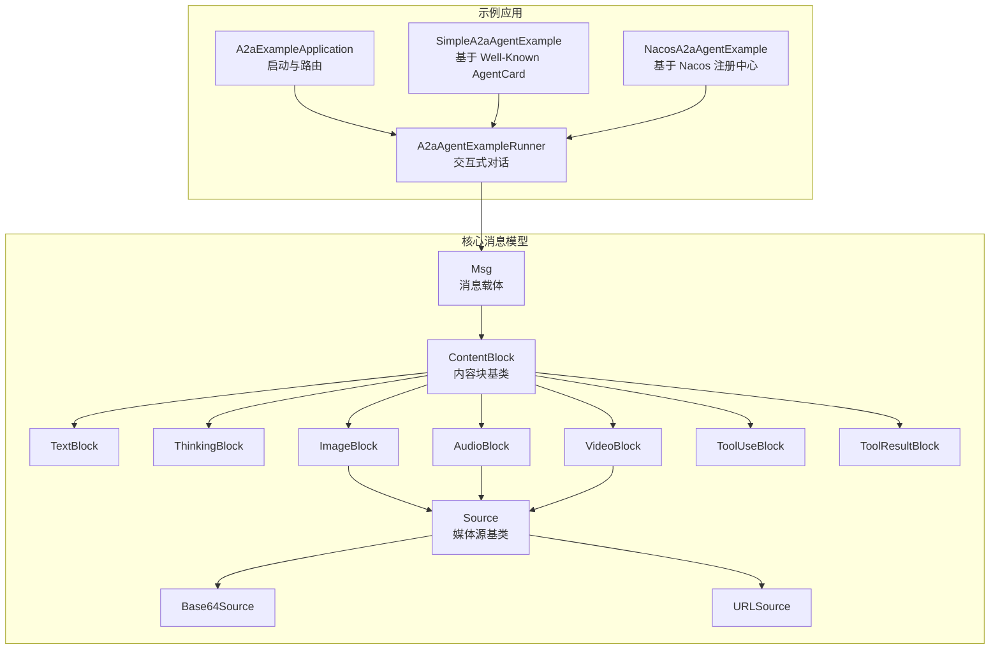
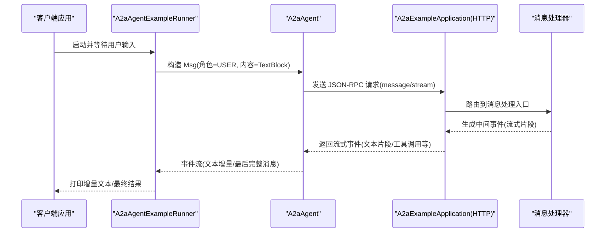
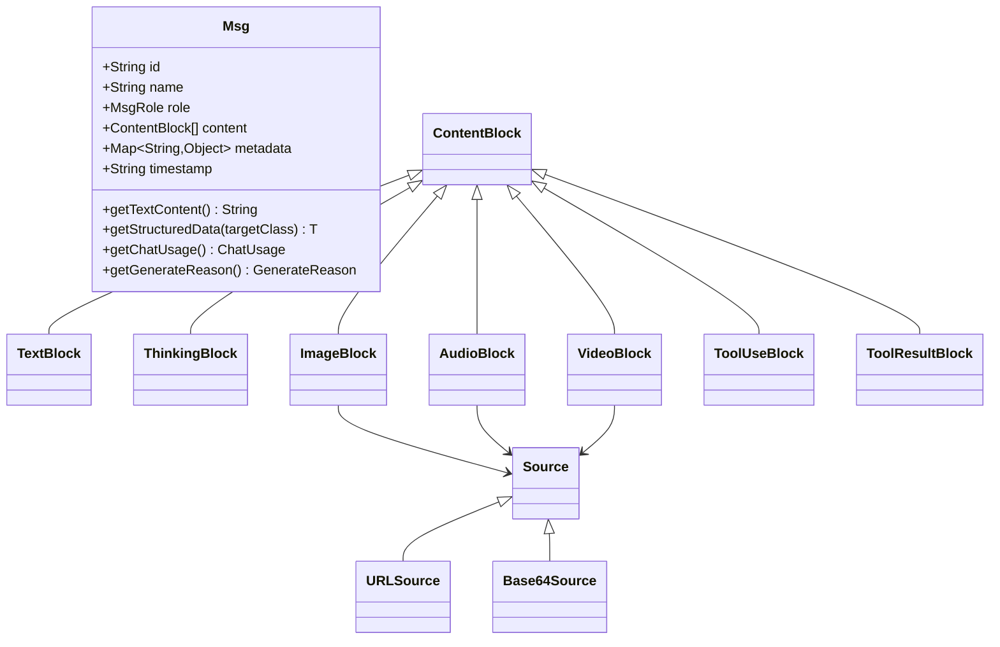
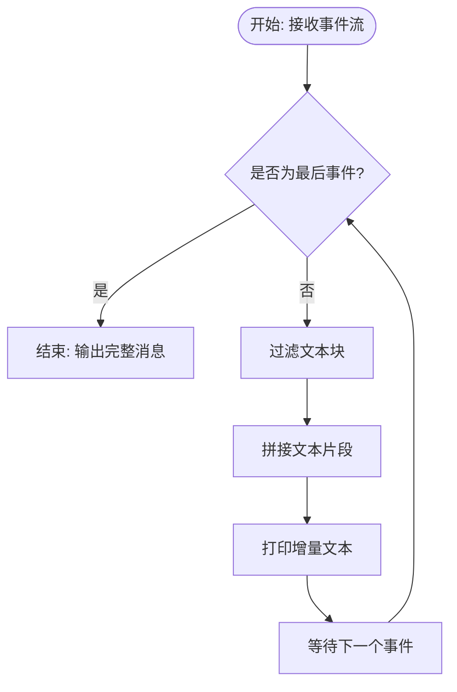
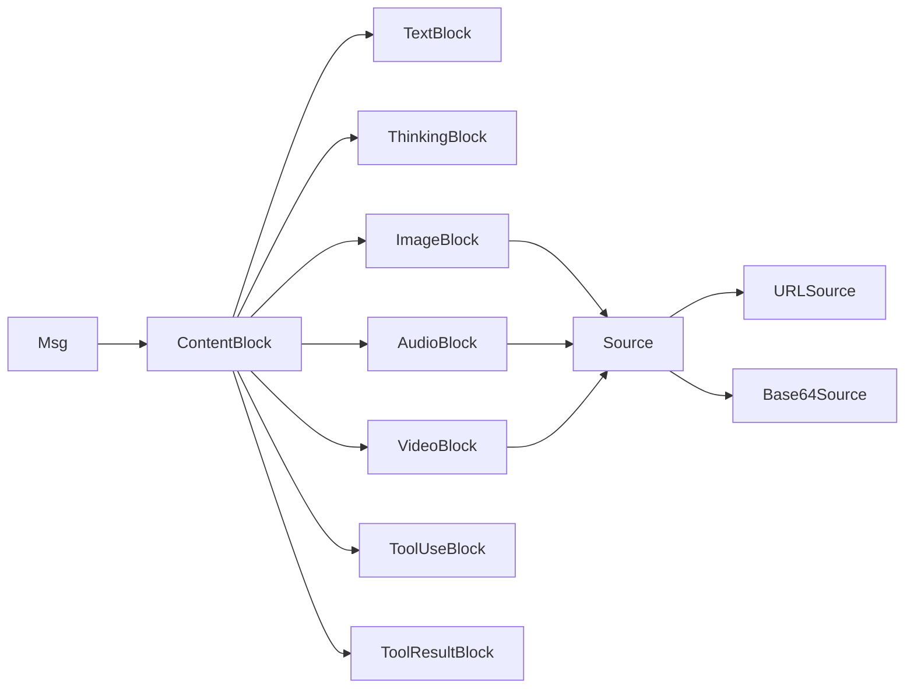

# A2A 协议规范

<cite>
**本文引用的文件**
- [A2aAgentExampleRunner.java](file://agentscope-examples/a2a/src/main/java/io/agentscope/examples/a2a/A2aAgentExampleRunner.java)
- [A2aExampleApplication.java](file://agentscope-examples/a2a/src/main/java/io/agentscope/examples/a2a/A2aExampleApplication.java)
- [SimpleA2aAgentExample.java](file://agentscope-examples/a2a/src/main/java/io/agentscope/examples/a2a/SimpleA2aAgentExample.java)
- [NacosA2aAgentExample.java](file://agentscope-examples/a2a/src/main/java/io/agentscope/examples/a2a/NacosA2aAgentExample.java)
- [Msg.java](file://agentscope-core/src/main/java/io/agentscope/core/message/Msg.java)
- [ContentBlock.java](file://agentscope-core/src/main/java/io/agentscope/core/message/ContentBlock.java)
- [TextBlock.java](file://agentscope-core/src/main/java/io/agentscope/core/message/TextBlock.java)
- [ImageBlock.java](file://agentscope-core/src/main/java/io/agentscope/core/message/ImageBlock.java)
- [AudioBlock.java](file://agentscope-core/src/main/java/io/agentscope/core/message/AudioBlock.java)
- [VideoBlock.java](file://agentscope-core/src/main/java/io/agentscope/core/message/VideoBlock.java)
- [ThinkingBlock.java](file://agentscope-core/src/main/java/io/agentscope/core/message/ThinkingBlock.java)
- [ToolUseBlock.java](file://agentscope-core/src/main/java/io/agentscope/core/message/ToolUseBlock.java)
- [ToolResultBlock.java](file://agentscope-core/src/main/java/io/agentscope/core/message/ToolResultBlock.java)
- [Source.java](file://agentscope-core/src/main/java/io/agentscope/core/message/Source.java)
- [Base64Source.java](file://agentscope-core/src/main/java/io/agentscope/core/message/Base64Source.java)
- [URLSource.java](file://agentscope-core/src/main/java/io/agentscope/core/message/URLSource.java)
</cite>

## 目录
1. [引言](#引言)
2. [项目结构](#项目结构)
3. [核心组件](#核心组件)
4. [架构总览](#架构总览)
5. [详细组件分析](#详细组件分析)
6. [依赖分析](#依赖分析)
7. [性能考量](#性能考量)
8. [故障排查指南](#故障排查指南)
9. [结论](#结论)
10. [附录](#附录)

## 引言
本文件面向 A2A（Agent-to-Agent）协议规范，系统性阐述消息格式与数据结构定义、多模态内容编码规范（文本、图像、音频、视频、工具调用）、消息类型分类、解析器与分片处理策略、协议版本与兼容性、网络传输优化、调试与追踪方法以及安全与完整性保障。文档以仓库中已实现的消息模型与示例应用为基础，结合可扩展的解析器与注册中心能力，给出可落地的工程实践建议。

## 项目结构
A2A 协议在本仓库中通过“核心消息模型”和“示例应用”两部分体现：
- 核心消息模型：统一的消息与内容块抽象，支持多模态与工具交互。
- 示例应用：演示如何通过 A2A 协议请求远程 Agent，并展示典型请求/响应流程。

图表来源
- [A2aExampleApplication.java:1-93](file://agentscope-examples/a2a/src/main/java/io/agentscope/examples/a2a/A2aExampleApplication.java#L1-L93)
- [A2aAgentExampleRunner.java:1-102](file://agentscope-examples/a2a/src/main/java/io/agentscope/examples/a2a/A2aAgentExampleRunner.java#L1-L102)
- [SimpleA2aAgentExample.java:1-45](file://agentscope-examples/a2a/src/main/java/io/agentscope/examples/a2a/SimpleA2aAgentExample.java#L1-L45)
- [NacosA2aAgentExample.java:1-69](file://agentscope-examples/a2a/src/main/java/io/agentscope/examples/a2a/NacosA2aAgentExample.java#L1-L69)
- [Msg.java:1-656](file://agentscope-core/src/main/java/io/agentscope/core/message/Msg.java#L1-L656)
- [ContentBlock.java:1-62](file://agentscope-core/src/main/java/io/agentscope/core/message/ContentBlock.java#L1-L62)
- [TextBlock.java:1-96](file://agentscope-core/src/main/java/io/agentscope/core/message/TextBlock.java#L1-L96)
- [ThinkingBlock.java:1-134](file://agentscope-core/src/main/java/io/agentscope/core/message/ThinkingBlock.java#L1-L134)
- [ImageBlock.java:1-164](file://agentscope-core/src/main/java/io/agentscope/core/message/ImageBlock.java#L1-L164)
- [AudioBlock.java:1-97](file://agentscope-core/src/main/java/io/agentscope/core/message/AudioBlock.java#L1-L97)
- [VideoBlock.java:1-240](file://agentscope-core/src/main/java/io/agentscope/core/message/VideoBlock.java#L1-L240)
- [ToolUseBlock.java:1-234](file://agentscope-core/src/main/java/io/agentscope/core/message/ToolUseBlock.java#L1-L234)
- [ToolResultBlock.java:1-375](file://agentscope-core/src/main/java/io/agentscope/core/message/ToolResultBlock.java#L1-L375)
- [Source.java:1-33](file://agentscope-core/src/main/java/io/agentscope/core/message/Source.java#L1-L33)
- [Base64Source.java:1-129](file://agentscope-core/src/main/java/io/agentscope/core/message/Base64Source.java#L1-L129)
- [URLSource.java:1-101](file://agentscope-core/src/main/java/io/agentscope/core/message/URLSource.java#L1-L101)

章节来源
- [A2aExampleApplication.java:1-93](file://agentscope-examples/a2a/src/main/java/io/agentscope/examples/a2a/A2aExampleApplication.java#L1-L93)
- [A2aAgentExampleRunner.java:1-102](file://agentscope-examples/a2a/src/main/java/io/agentscope/examples/a2a/A2aAgentExampleRunner.java#L1-L102)
- [SimpleA2aAgentExample.java:1-45](file://agentscope-examples/a2a/src/main/java/io/agentscope/examples/a2a/SimpleA2aAgentExample.java#L1-L45)
- [NacosA2aAgentExample.java:1-69](file://agentscope-examples/a2a/src/main/java/io/agentscope/examples/a2a/NacosA2aAgentExample.java#L1-L69)

## 核心组件
- 消息载体 Msg：统一承载角色、时间戳、元数据与内容块列表；提供结构化解析、使用统计提取、生成原因标注等能力。
- 内容块 ContentBlock：多态基类，通过 JSON 类型字段进行序列化/反序列化，覆盖文本、思考、图像、音频、视频、工具调用与结果。
- 媒体源 Source：统一图像/音频/视频的来源抽象，支持 URL 与 Base64 两种方式。
- 工具链路：ToolUseBlock 表达工具调用请求，ToolResultBlock 表达工具执行结果或挂起状态。

章节来源
- [Msg.java:1-656](file://agentscope-core/src/main/java/io/agentscope/core/message/Msg.java#L1-L656)
- [ContentBlock.java:1-62](file://agentscope-core/src/main/java/io/agentscope/core/message/ContentBlock.java#L1-L62)
- [Source.java:1-33](file://agentscope-core/src/main/java/io/agentscope/core/message/Source.java#L1-L33)

## 架构总览
下图展示了 A2A 请求从客户端到服务端的关键交互路径，以及消息在框架内的流转。

图表来源
- [A2aAgentExampleRunner.java:49-100](file://agentscope-examples/a2a/src/main/java/io/agentscope/examples/a2a/A2aAgentExampleRunner.java#L49-L100)
- [A2aExampleApplication.java:31-62](file://agentscope-examples/a2a/src/main/java/io/agentscope/examples/a2a/A2aExampleApplication.java#L31-L62)

## 详细组件分析

### 消息与内容块模型
- Msg：不可变对象，包含唯一 ID、名称、角色、内容块列表、元数据与时间戳；提供结构化输出读取、使用统计解析、生成原因标注等便捷方法。
- ContentBlock 及其子类：通过 JSON 多态类型字段区分不同内容块类型；各子类封装各自特有字段（如 ImageBlock 的像素阈值、VideoBlock 的帧率/帧数/像素总量等）。
- Source 抽象：统一媒体来源，支持 URLSource 与 Base64Source，便于在 URL 引用与内联嵌入之间灵活选择。

图表来源
- [Msg.java:53-654](file://agentscope-core/src/main/java/io/agentscope/core/message/Msg.java#L53-L654)
- [ContentBlock.java:44-61](file://agentscope-core/src/main/java/io/agentscope/core/message/ContentBlock.java#L44-L61)
- [TextBlock.java:31-96](file://agentscope-core/src/main/java/io/agentscope/core/message/TextBlock.java#L31-L96)
- [ThinkingBlock.java:37-134](file://agentscope-core/src/main/java/io/agentscope/core/message/ThinkingBlock.java#L37-L134)
- [ImageBlock.java:37-164](file://agentscope-core/src/main/java/io/agentscope/core/message/ImageBlock.java#L37-L164)
- [AudioBlock.java:35-97](file://agentscope-core/src/main/java/io/agentscope/core/message/AudioBlock.java#L35-L97)
- [VideoBlock.java:36-240](file://agentscope-core/src/main/java/io/agentscope/core/message/VideoBlock.java#L36-L240)
- [ToolUseBlock.java:34-234](file://agentscope-core/src/main/java/io/agentscope/core/message/ToolUseBlock.java#L34-L234)
- [ToolResultBlock.java:35-375](file://agentscope-core/src/main/java/io/agentscope/core/message/ToolResultBlock.java#L35-L375)
- [Source.java:27-32](file://agentscope-core/src/main/java/io/agentscope/core/message/Source.java#L27-L32)
- [URLSource.java:39-101](file://agentscope-core/src/main/java/io/agentscope/core/message/URLSource.java#L39-L101)
- [Base64Source.java:39-129](file://agentscope-core/src/main/java/io/agentscope/core/message/Base64Source.java#L39-L129)

章节来源
- [Msg.java:1-656](file://agentscope-core/src/main/java/io/agentscope/core/message/Msg.java#L1-L656)
- [ContentBlock.java:1-62](file://agentscope-core/src/main/java/io/agentscope/core/message/ContentBlock.java#L1-L62)
- [TextBlock.java:1-96](file://agentscope-core/src/main/java/io/agentscope/core/message/TextBlock.java#L1-L96)
- [ThinkingBlock.java:1-134](file://agentscope-core/src/main/java/io/agentscope/core/message/ThinkingBlock.java#L1-L134)
- [ImageBlock.java:1-164](file://agentscope-core/src/main/java/io/agentscope/core/message/ImageBlock.java#L1-L164)
- [AudioBlock.java:1-97](file://agentscope-core/src/main/java/io/agentscope/core/message/AudioBlock.java#L1-L97)
- [VideoBlock.java:1-240](file://agentscope-core/src/main/java/io/agentscope/core/message/VideoBlock.java#L1-L240)
- [ToolUseBlock.java:1-234](file://agentscope-core/src/main/java/io/agentscope/core/message/ToolUseBlock.java#L1-L234)
- [ToolResultBlock.java:1-375](file://agentscope-core/src/main/java/io/agentscope/core/message/ToolResultBlock.java#L1-L375)
- [Source.java:1-33](file://agentscope-core/src/main/java/io/agentscope/core/message/Source.java#L1-L33)
- [Base64Source.java:1-129](file://agentscope-core/src/main/java/io/agentscope/core/message/Base64Source.java#L1-L129)
- [URLSource.java:1-101](file://agentscope-core/src/main/java/io/agentscope/core/message/URLSource.java#L1-L101)

### 多模态消息编码规范
- 文本（TextBlock）：最基础的内容块，适合纯文本输入/输出。
- 思考（ThinkingBlock）：用于记录推理过程，可携带额外元数据以便格式化回写。
- 图像（ImageBlock）：支持 URLSource 与 Base64Source；可设置最小/最大像素阈值，控制输入质量与成本。
- 音频（AudioBlock）：支持 URLSource 与 Base64Source。
- 视频（VideoBlock）：支持 URLSource 与 Base64Source；可配置帧率、最大帧数、像素阈值与总像素限制，用于降采样与带宽控制。
- 工具调用（ToolUseBlock）：表达一次工具调用请求，包含 id、name、input 与可选 content/metadata。
- 工具结果（ToolResultBlock）：表达工具执行结果，包含 id、name、output 列表与 metadata；支持挂起标记以指示外部执行。

章节来源
- [TextBlock.java:31-96](file://agentscope-core/src/main/java/io/agentscope/core/message/TextBlock.java#L31-L96)
- [ThinkingBlock.java:37-134](file://agentscope-core/src/main/java/io/agentscope/core/message/ThinkingBlock.java#L37-L134)
- [ImageBlock.java:37-164](file://agentscope-core/src/main/java/io/agentscope/core/message/ImageBlock.java#L37-L164)
- [AudioBlock.java:35-97](file://agentscope-core/src/main/java/io/agentscope/core/message/AudioBlock.java#L35-L97)
- [VideoBlock.java:36-240](file://agentscope-core/src/main/java/io/agentscope/core/message/VideoBlock.java#L36-L240)
- [ToolUseBlock.java:34-234](file://agentscope-core/src/main/java/io/agentscope/core/message/ToolUseBlock.java#L34-L234)
- [ToolResultBlock.java:35-375](file://agentscope-core/src/main/java/io/agentscope/core/message/ToolResultBlock.java#L35-L375)

### 解析器与分片处理策略
- 多态解析：ContentBlock 通过 JSON 类型字段进行多态反序列化，确保不同内容块类型在传输时保持类型安全。
- 流式片段：示例应用展示了对事件流的增量处理，客户端逐段打印文本片段，最后呈现完整消息。
- 分片与带宽：视频块支持帧率、帧数与像素总量限制，有助于在带宽受限场景下进行内容降采样与分片传输。

图表来源
- [A2aAgentExampleRunner.java:78-100](file://agentscope-examples/a2a/src/main/java/io/agentscope/examples/a2a/A2aAgentExampleRunner.java#L78-L100)

章节来源
- [A2aAgentExampleRunner.java:1-102](file://agentscope-examples/a2a/src/main/java/io/agentscope/examples/a2a/A2aAgentExampleRunner.java#L1-L102)

### 协议版本管理、兼容性与升级
- 版本与兼容：消息模型采用不可变设计与严格的 JSON 字段映射，新增字段应向后兼容（忽略未知字段），删除字段需保留序列化兼容性。
- 元数据扩展：通过元数据键（如结构化输出、使用统计、生成原因）扩展语义信息，避免破坏既有字段。
- 升级策略：新增内容块类型时，通过 ContentBlock 的多态注册机制扩展类型识别，确保旧客户端可忽略新类型。

章节来源
- [Msg.java:52-53](file://agentscope-core/src/main/java/io/agentscope/core/message/Msg.java#L52-L53)
- [ContentBlock.java:44-53](file://agentscope-core/src/main/java/io/agentscope/core/message/ContentBlock.java#L44-L53)

### 网络传输优化、压缩与带宽管理
- 媒体源选择：优先使用 URLSource 以减少内存占用与传输体积；仅在需要内联时使用 Base64Source。
- 视频降采样：通过 VideoBlock 的帧率、帧数与像素总量限制，降低带宽与计算开销。
- 流式传输：事件流按片段返回，客户端边接收边渲染，提升交互体验与资源利用率。

章节来源
- [URLSource.java:39-101](file://agentscope-core/src/main/java/io/agentscope/core/message/URLSource.java#L39-L101)
- [Base64Source.java:39-129](file://agentscope-core/src/main/java/io/agentscope/core/message/Base64Source.java#L39-L129)
- [VideoBlock.java:69-83](file://agentscope-core/src/main/java/io/agentscope/core/message/VideoBlock.java#L69-L83)

### 安全与完整性
- 数据校验：Source 与内容块构造函数对必填字段进行非空校验，防止空指针传播。
- 结构化输出：通过元数据键存储结构化输出，配合类型转换与异常提示，保证数据一致性。
- 生成原因：消息可携带生成原因，辅助定位中断、工具挂起等异常状态。

章节来源
- [Base64Source.java:54-58](file://agentscope-core/src/main/java/io/agentscope/core/message/Base64Source.java#L54-L58)
- [URLSource.java:49-52](file://agentscope-core/src/main/java/io/agentscope/core/message/URLSource.java#L49-L52)
- [Msg.java:467-498](file://agentscope-core/src/main/java/io/agentscope/core/message/Msg.java#L467-L498)

### 协议示例与消息模板
- 典型请求模板（JSON-RPC）：示例应用提供了标准的 message/stream 请求格式，包含方法名、请求 ID、JSON-RPC 版本与 params 中的 message 对象。
- 消息模板要点：
  - message.role：消息发送者角色（如 user）
  - message.kind：消息类型标识（如 message）
  - message.contextId/sessionId/metadata：会话与上下文信息
  - message.parts：内容块数组，每项包含 kind 与对应字段（如 text、image/audio/video/tool_use/tool_result）
  - message.messageId：消息唯一标识

章节来源
- [A2aExampleApplication.java:31-62](file://agentscope-examples/a2a/src/main/java/io/agentscope/examples/a2a/A2aExampleApplication.java#L31-L62)

## 依赖分析
- 组件内聚：消息模型围绕 Msg 与 ContentBlock 展开，职责清晰、耦合度低。
- 外部依赖：通过 Jackson 进行多态序列化与类型识别；示例应用基于 Spring Boot 提供 HTTP 路由与工具注册。

图表来源
- [Msg.java:53-654](file://agentscope-core/src/main/java/io/agentscope/core/message/Msg.java#L53-L654)
- [ContentBlock.java:44-61](file://agentscope-core/src/main/java/io/agentscope/core/message/ContentBlock.java#L44-L61)
- [Source.java:27-32](file://agentscope-core/src/main/java/io/agentscope/core/message/Source.java#L27-L32)

## 性能考量
- 序列化开销：多态类型字段带来少量额外开销，但换来类型安全与扩展性。
- 内存占用：优先 URL 引用媒体，避免大体积 Base64 编码；视频降采样显著降低内存峰值。
- I/O 效率：事件流式返回，客户端边收边用，减少等待时间与缓冲压力。

## 故障排查指南
- 无法解析多态内容块：检查 JSON 中 type 字段是否正确，确保客户端与服务端对新增类型达成一致。
- 媒体加载失败：确认 URL 可访问性或 Base64 数据格式正确；必要时切换为另一种媒体源。
- 工具挂起：ToolResultBlock 的挂起标记用于指示外部执行，需在客户端处理挂起提示并恢复后续流程。
- 使用统计缺失：检查消息元数据中是否存在使用统计键，确保模型调用链路正确填充。

章节来源
- [ToolResultBlock.java:123-127](file://agentscope-core/src/main/java/io/agentscope/core/message/ToolResultBlock.java#L123-L127)
- [Msg.java:390-434](file://agentscope-core/src/main/java/io/agentscope/core/message/Msg.java#L390-L434)

## 结论
A2A 协议在本仓库中以统一的消息模型与多态内容块为核心，结合 URL/内联媒体源、视频降采样与事件流式传输，实现了高效、可扩展且安全的多模态 Agent 通信范式。通过示例应用与注册中心集成，开发者可快速构建跨系统的 A2A 交互能力。

## 附录
- 示例运行步骤与 AgentCard 获取：参见示例应用注释中的使用说明与 curl 示例。
- 注册中心集成：支持基于 Nacos 的 AgentCard 发现，便于分布式环境下的服务编排与发现。

章节来源
- [A2aExampleApplication.java:31-74](file://agentscope-examples/a2a/src/main/java/io/agentscope/examples/a2a/A2aExampleApplication.java#L31-L74)
- [NacosA2aAgentExample.java:38-68](file://agentscope-examples/a2a/src/main/java/io/agentscope/examples/a2a/NacosA2aAgentExample.java#L38-L68)