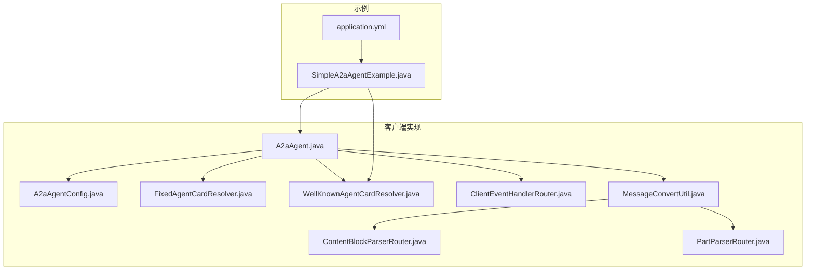
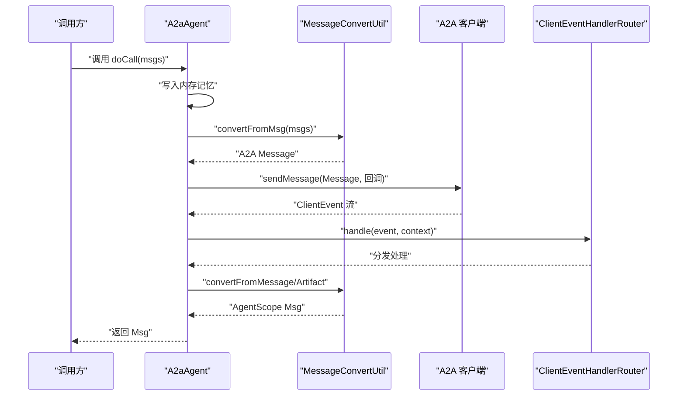
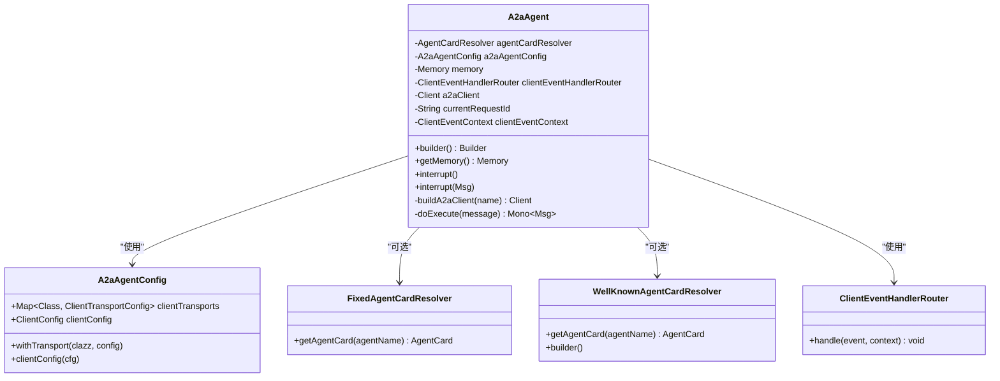
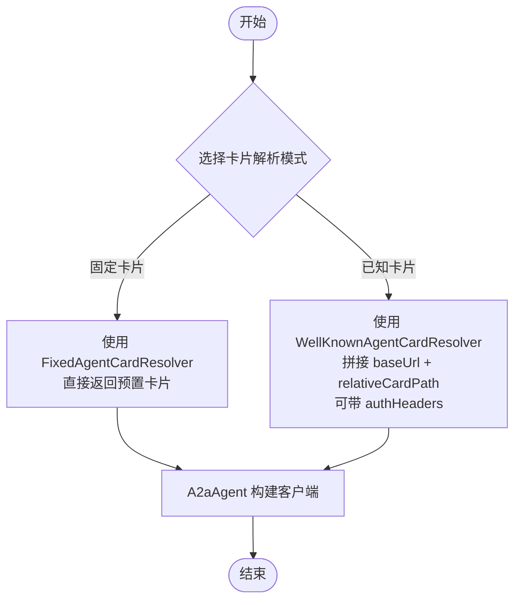
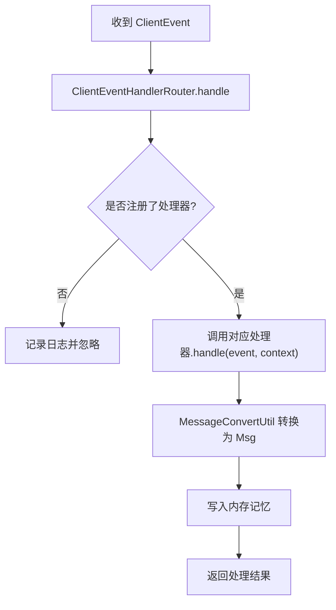
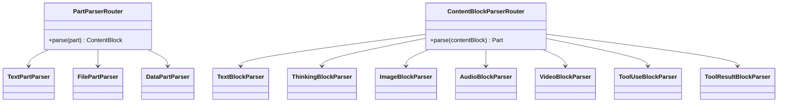
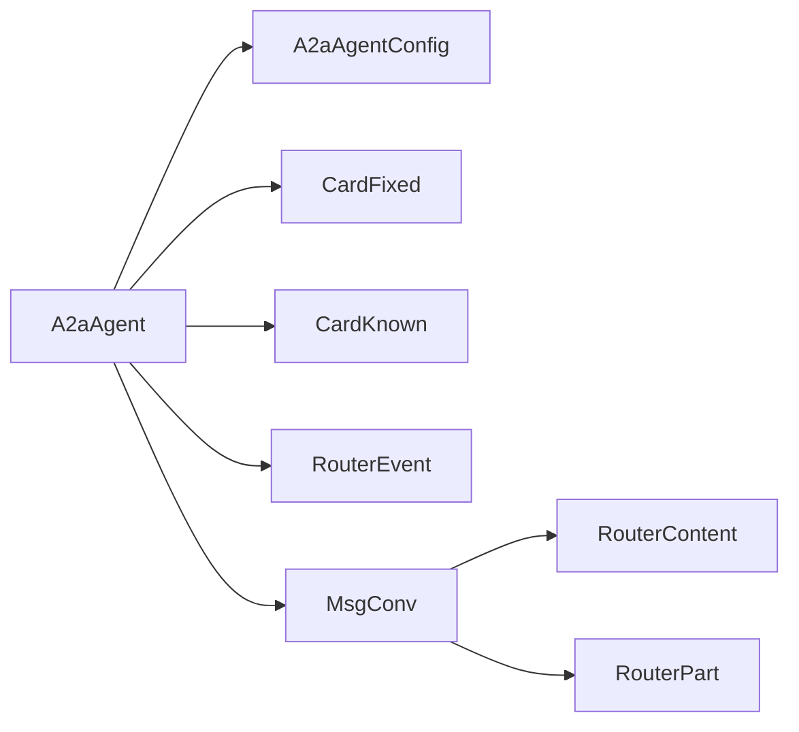

# A2A 客户端实现

<cite>
**本文引用的文件**
- [A2aAgent.java](file://agentscope-extensions/agentscope-extensions-a2a/agentscope-extensions-a2a-client/src/main/java/io/agentscope/core/a2a/agent/A2aAgent.java)
- [A2aAgentConfig.java](file://agentscope-extensions/agentscope-extensions-a2a/agentscope-extensions-a2a-client/src/main/java/io/agentscope/core/a2a/agent/A2aAgentConfig.java)
- [FixedAgentCardResolver.java](file://agentscope-extensions/agentscope-extensions-a2a/agentscope-extensions-a2a-client/src/main/java/io/agentscope/core/a2a/agent/card/FixedAgentCardResolver.java)
- [WellKnownAgentCardResolver.java](file://agentscope-extensions/agentscope-extensions-a2a/agentscope-extensions-a2a-client/src/main/java/io/agentscope/core/a2a/agent/card/WellKnownAgentCardResolver.java)
- [ClientEventHandlerRouter.java](file://agentscope-extensions/agentscope-extensions-a2a/agentscope-extensions-a2a-client/src/main/java/io/agentscope/core/a2a/agent/event/ClientEventHandlerRouter.java)
- [ContentBlockParserRouter.java](file://agentscope-extensions/agentscope-extensions-a2a/agentscope-extensions-a2a-client/src/main/java/io/agentscope/core/a2a/agent/message/ContentBlockParserRouter.java)
- [PartParserRouter.java](file://agentscope-extensions/agentscope-extensions-a2a/agentscope-extensions-a2a-client/src/main/java/io/agentscope/core/a2a/agent/message/PartParserRouter.java)
- [MessageConvertUtil.java](file://agentscope-extensions/agentscope-extensions-a2a/agentscope-extensions-a2a-client/src/main/java/io/agentscope/core/a2a/agent/utils/MessageConvertUtil.java)
- [SimpleA2aAgentExample.java](file://agentscope-examples/a2a/src/main/java/io/agentscope/examples/a2a/SimpleA2aAgentExample.java)
- [application.yml](file://agentscope-examples/a2a/src/main/resources/application.yml)
</cite>

## 目录
1. [简介](#简介)
2. [项目结构](#项目结构)
3. [核心组件](#核心组件)
4. [架构总览](#架构总览)
5. [组件详解](#组件详解)
6. [依赖关系分析](#依赖关系分析)
7. [性能与传输优化](#性能与传输优化)
8. [故障排查指南](#故障排查指南)
9. [结论](#结论)
10. [附录：完整配置与集成指南](#附录完整配置与集成指南)

## 简介
本文件面向 A2A（Agent-to-Agent）协议在 AgentScope Java 中的客户端实现，系统性阐述以下主题：
- A2aAgent 的架构设计与生命周期钩子
- 智能体卡片解析器（固定卡片与已知卡片）的实现差异与选择策略
- 客户端事件处理器的路由机制与消息处理流程
- 多模态内容块解析器（文本、图像、音频、视频、工具调用/结果）的解析策略
- 客户端配置示例、集成步骤与最佳实践
- 连接管理、重连与错误处理策略
- 消息序列化、传输优化与性能调优建议

## 项目结构
A2A 客户端相关代码主要位于扩展模块 agentscope-extensions-a2a-client，示例位于 agentscope-examples/a2a。

**图表来源**
- [A2aAgent.java:1-416](file://agentscope-extensions/agentscope-extensions-a2a/agentscope-extensions-a2a-client/src/main/java/io/agentscope/core/a2a/agent/A2aAgent.java#L1-L416)
- [A2aAgentConfig.java:1-83](file://agentscope-extensions/agentscope-extensions-a2a/agentscope-extensions-a2a-client/src/main/java/io/agentscope/core/a2a/agent/A2aAgentConfig.java#L1-L83)
- [FixedAgentCardResolver.java:1-55](file://agentscope-extensions/agentscope-extensions-a2a/agentscope-extensions-a2a-client/src/main/java/io/agentscope/core/a2a/agent/card/FixedAgentCardResolver.java#L1-L55)
- [WellKnownAgentCardResolver.java:1-122](file://agentscope-extensions/agentscope-extensions-a2a/agentscope-extensions-a2a-client/src/main/java/io/agentscope/core/a2a/agent/card/WellKnownAgentCardResolver.java#L1-L122)
- [ClientEventHandlerRouter.java:1-69](file://agentscope-extensions/agentscope-extensions-a2a/agentscope-extensions-a2a-client/src/main/java/io/agentscope/core/a2a/agent/event/ClientEventHandlerRouter.java#L1-L69)
- [ContentBlockParserRouter.java:1-71](file://agentscope-extensions/agentscope-extensions-a2a/agentscope-extensions-a2a-client/src/main/java/io/agentscope/core/a2a/agent/message/ContentBlockParserRouter.java#L1-L71)
- [PartParserRouter.java:1-47](file://agentscope-extensions/agentscope-extensions-a2a/agentscope-extensions-a2a-client/src/main/java/io/agentscope/core/a2a/agent/message/PartParserRouter.java#L1-L47)
- [MessageConvertUtil.java:1-158](file://agentscope-extensions/agentscope-extensions-a2a/agentscope-extensions-a2a-client/src/main/java/io/agentscope/core/a2a/agent/utils/MessageConvertUtil.java#L1-L158)
- [SimpleA2aAgentExample.java:1-45](file://agentscope-examples/a2a/src/main/java/io/agentscope/examples/a2a/SimpleA2aAgentExample.java#L1-L45)
- [application.yml:1-65](file://agentscope-examples/a2a/src/main/resources/application.yml#L1-L65)

**章节来源**
- [A2aAgent.java:1-416](file://agentscope-extensions/agentscope-extensions-a2a/agentscope-extensions-a2a-client/src/main/java/io/agentscope/core/a2a/agent/A2aAgent.java#L1-L416)
- [SimpleA2aAgentExample.java:1-45](file://agentscope-examples/a2a/src/main/java/io/agentscope/examples/a2a/SimpleA2aAgentExample.java#L1-L45)
- [application.yml:1-65](file://agentscope-examples/a2a/src/main/resources/application.yml#L1-L65)

## 核心组件
- A2aAgent：面向 A2A 协议的智能体封装，负责构建客户端、发送消息、接收事件、中断控制与资源释放。
- A2aAgentConfig：客户端配置聚合，支持自定义传输与客户端通用配置。
- AgentCardResolver 及其实现：智能体卡片解析器，支持固定卡片与“/.well-known”发现两种模式。
- ClientEventHandlerRouter：客户端事件路由，按事件类型分发至对应处理器。
- MessageConvertUtil：消息双向转换器，连接 AgentScope 的 Msg 与 A2A 的 Message/Artifact。
- ContentBlockParserRouter 与 PartParserRouter：多模态内容块与 Part 的解析路由器。

**章节来源**
- [A2aAgent.java:71-112](file://agentscope-extensions/agentscope-extensions-a2a/agentscope-extensions-a2a-client/src/main/java/io/agentscope/core/a2a/agent/A2aAgent.java#L71-L112)
- [A2aAgentConfig.java:25-82](file://agentscope-extensions/agentscope-extensions-a2a/agentscope-extensions-a2a-client/src/main/java/io/agentscope/core/a2a/agent/A2aAgentConfig.java#L25-L82)
- [FixedAgentCardResolver.java:21-55](file://agentscope-extensions/agentscope-extensions-a2a/agentscope-extensions-a2a-client/src/main/java/io/agentscope/core/a2a/agent/card/FixedAgentCardResolver.java#L21-L55)
- [WellKnownAgentCardResolver.java:23-122](file://agentscope-extensions/agentscope-extensions-a2a/agentscope-extensions-a2a-client/src/main/java/io/agentscope/core/a2a/agent/card/WellKnownAgentCardResolver.java#L23-L122)
- [ClientEventHandlerRouter.java:26-69](file://agentscope-extensions/agentscope-extensions-a2a/agentscope-extensions-a2a-client/src/main/java/io/agentscope/core/a2a/agent/event/ClientEventHandlerRouter.java#L26-L69)
- [MessageConvertUtil.java:35-158](file://agentscope-extensions/agentscope-extensions-a2a/agentscope-extensions-a2a-client/src/main/java/io/agentscope/core/a2a/agent/utils/MessageConvertUtil.java#L35-L158)

## 架构总览
A2A 客户端以 A2aAgent 为核心，通过 AgentCardResolver 获取远端智能体卡片，使用 ClientBuilder 构建 A2A 客户端，并在生命周期钩子中完成客户端实例的创建与释放。消息在进入 A2aAgent 后由 MessageConvertUtil 转换为 A2A Message，发送给服务端；服务端事件通过 ClientEventHandlerRouter 分发到具体处理器，再由 MessageConvertUtil 转回 AgentScope Msg 并写入内存记忆。

**图表来源**
- [A2aAgent.java:114-131](file://agentscope-extensions/agentscope-extensions-a2a/agentscope-extensions-a2a-client/src/main/java/io/agentscope/core/a2a/agent/A2aAgent.java#L114-L131)
- [MessageConvertUtil.java:98-136](file://agentscope-extensions/agentscope-extensions-a2a/agentscope-extensions-a2a-client/src/main/java/io/agentscope/core/a2a/agent/utils/MessageConvertUtil.java#L98-L136)
- [ClientEventHandlerRouter.java:47-67](file://agentscope-extensions/agentscope-extensions-a2a/agentscope-extensions-a2a-client/src/main/java/io/agentscope/core/a2a/agent/event/ClientEventHandlerRouter.java#L47-L67)

## 组件详解

### A2aAgent 架构与生命周期
- 构造与配置
  - 通过 Builder 注入 AgentCardResolver、A2aAgentConfig、Memory、Hook 等。
  - 默认描述来自 AgentCardResolver 解析的卡片描述，若失败则为空。
- 生命周期钩子
  - 钩子优先级较低，确保在业务逻辑之后执行。
  - PreCallEvent：生成请求 ID，初始化 ClientEventContext，构建 A2A 客户端（默认添加 JSON-RPC 传输）。
  - PostCallEvent/ErrorEvent：释放客户端资源，关闭连接。
- 调用流程
  - doCall 将输入消息写入内存，转换为 A2A Message，异步发送并设置事件回调。
  - 事件回调经 ClientEventHandlerRouter 分发，最终将服务端返回的消息写回内存并返回。
- 中断机制
  - handleInterrupt 通过客户端取消任务，返回提示消息或异常信息。

**图表来源**
- [A2aAgent.java:71-112](file://agentscope-extensions/agentscope-extensions-a2a/agentscope-extensions-a2a-client/src/main/java/io/agentscope/core/a2a/agent/A2aAgent.java#L71-L112)
- [A2aAgentConfig.java:25-82](file://agentscope-extensions/agentscope-extensions-a2a/agentscope-extensions-a2a-client/src/main/java/io/agentscope/core/a2a/agent/A2aAgentConfig.java#L25-L82)
- [FixedAgentCardResolver.java:21-55](file://agentscope-extensions/agentscope-extensions-a2a/agentscope-extensions-a2a-client/src/main/java/io/agentscope/core/a2a/agent/card/FixedAgentCardResolver.java#L21-L55)
- [WellKnownAgentCardResolver.java:23-122](file://agentscope-extensions/agentscope-extensions-a2a/agentscope-extensions-a2a-client/src/main/java/io/agentscope/core/a2a/agent/card/WellKnownAgentCardResolver.java#L23-L122)
- [ClientEventHandlerRouter.java:26-69](file://agentscope-extensions/agentscope-extensions-a2a/agentscope-extensions-a2a-client/src/main/java/io/agentscope/core/a2a/agent/event/ClientEventHandlerRouter.java#L26-L69)

**章节来源**
- [A2aAgent.java:114-131](file://agentscope-extensions/agentscope-extensions-a2a/agentscope-extensions-a2a-client/src/main/java/io/agentscope/core/a2a/agent/A2aAgent.java#L114-L131)
- [A2aAgent.java:133-171](file://agentscope-extensions/agentscope-extensions-a2a/agentscope-extensions-a2a-client/src/main/java/io/agentscope/core/a2a/agent/A2aAgent.java#L133-L171)
- [A2aAgent.java:186-196](file://agentscope-extensions/agentscope-extensions-a2a/agentscope-extensions-a2a-client/src/main/java/io/agentscope/core/a2a/agent/A2aAgent.java#L186-L196)
- [A2aAgent.java:198-214](file://agentscope-extensions/agentscope-extensions-a2a/agentscope-extensions-a2a-client/src/main/java/io/agentscope/core/a2a/agent/A2aAgent.java#L198-L214)

### 智能体卡片解析器：固定卡片 vs 已知卡片
- 固定卡片解析器（FixedAgentCardResolver）
  - 直接返回构造时注入的 AgentCard，适用于已知远端地址且卡片稳定不变的场景。
- 已知卡片解析器（WellKnownAgentCardResolver）
  - 基于“/.well-known”URI 发现卡片，支持自定义基础 URL、相对路径与认证头。
  - 适合动态发现、集中式卡片管理与多租户场景。
- 选择建议
  - 固定卡片：简单、可控、低延迟。
  - 已知卡片：灵活、可发现、便于运维与治理。

**图表来源**
- [FixedAgentCardResolver.java:21-55](file://agentscope-extensions/agentscope-extensions-a2a/agentscope-extensions-a2a-client/src/main/java/io/agentscope/core/a2a/agent/card/FixedAgentCardResolver.java#L21-L55)
- [WellKnownAgentCardResolver.java:23-122](file://agentscope-extensions/agentscope-extensions-a2a/agentscope-extensions-a2a-client/src/main/java/io/agentscope/core/a2a/agent/card/WellKnownAgentCardResolver.java#L23-L122)

**章节来源**
- [FixedAgentCardResolver.java:21-55](file://agentscope-extensions/agentscope-extensions-a2a/agentscope-extensions-a2a-client/src/main/java/io/agentscope/core/a2a/agent/card/FixedAgentCardResolver.java#L21-L55)
- [WellKnownAgentCardResolver.java:23-122](file://agentscope-extensions/agentscope-extensions-a2a/agentscope-extensions-a2a-client/src/main/java/io/agentscope/core/a2a/agent/card/WellKnownAgentCardResolver.java#L23-L122)

### 客户端事件处理器路由机制与消息处理流程
- 路由器（ClientEventHandlerRouter）
  - 内置注册 TaskUpdateEventHandler、MessageEventHandler、TaskEventHandler。
  - 未匹配事件类型时记录日志并忽略。
- 处理流程
  - A2aAgent 在 doExecute 中订阅客户端事件回调，收到事件后交由路由器分发。
  - 处理器内部通过 MessageConvertUtil 将 A2A Message/Artifact 转为 AgentScope Msg，并写入内存。
- 错误处理
  - 生命周期钩子在 PostCallEvent/ErrorEvent 时释放客户端，避免资源泄露。

**图表来源**
- [ClientEventHandlerRouter.java:47-67](file://agentscope-extensions/agentscope-extensions-a2a/agentscope-extensions-a2a-client/src/main/java/io/agentscope/core/a2a/agent/event/ClientEventHandlerRouter.java#L47-L67)
- [MessageConvertUtil.java:81-96](file://agentscope-extensions/agentscope-extensions-a2a/agentscope-extensions-a2a-client/src/main/java/io/agentscope/core/a2a/agent/utils/MessageConvertUtil.java#L81-L96)

**章节来源**
- [ClientEventHandlerRouter.java:26-69](file://agentscope-extensions/agentscope-extensions-a2a/agentscope-extensions-a2a-client/src/main/java/io/agentscope/core/a2a/agent/event/ClientEventHandlerRouter.java#L26-L69)
- [A2aAgent.java:198-214](file://agentscope-extensions/agentscope-extensions-a2a/agentscope-extensions-a2a-client/src/main/java/io/agentscope/core/a2a/agent/A2aAgent.java#L198-L214)

### 多模态内容块解析器：文本/图像/音频/视频/工具
- PartParserRouter
  - 根据 Part.kind（TEXT/FILE/DATA）选择对应解析器，输出 ContentBlock。
- ContentBlockParserRouter
  - 根据 ContentBlock 类型（TextBlock/ThinkingBlock/ImageBlock/AudioBlock/VideoBlock/ToolUseBlock/ToolResultBlock）映射到对应的 Part。
- 支持的块类型
  - 文本：TextBlock → TextPart
  - 思维：ThinkingBlock → 特殊标记（如元数据键）
  - 图像：ImageBlock → DataPart/FilePart
  - 音频：AudioBlock → DataPart/FilePart
  - 视频：VideoBlock → DataPart/FilePart
  - 工具调用：ToolUseBlock → 工具调用 Part
  - 工具结果：ToolResultBlock → 工具结果 Part
- 不支持类型
  - 记录警告并忽略，保证健壮性。

**图表来源**
- [PartParserRouter.java:25-47](file://agentscope-extensions/agentscope-extensions-a2a/agentscope-extensions-a2a-client/src/main/java/io/agentscope/core/a2a/agent/message/PartParserRouter.java#L25-L47)
- [ContentBlockParserRouter.java:32-71](file://agentscope-extensions/agentscope-extensions-a2a/agentscope-extensions-a2a-client/src/main/java/io/agentscope/core/a2a/agent/message/ContentBlockParserRouter.java#L32-L71)

**章节来源**
- [PartParserRouter.java:25-47](file://agentscope-extensions/agentscope-extensions-a2a/agentscope-extensions-a2a-client/src/main/java/io/agentscope/core/a2a/agent/message/PartParserRouter.java#L25-L47)
- [ContentBlockParserRouter.java:32-71](file://agentscope-extensions/agentscope-extensions-a2a/agentscope-extensions-a2a-client/src/main/java/io/agentscope/core/a2a/agent/message/ContentBlockParserRouter.java#L32-L71)

### 消息序列化与转换细节
- 从 AgentScope Msg 到 A2A Message
  - 将每条 Msg 的内容块逐一解析为 Part，附加元数据（如消息 ID、来源名称），合并为 Message。
- 从 A2A Message/Artifact 到 AgentScope Msg
  - 将 Part 解析为 ContentBlock，填充 Msg 的角色、元数据与内容。
- 元数据键
  - 包含消息 ID、来源名称等，便于溯源与调试。

**章节来源**
- [MessageConvertUtil.java:98-136](file://agentscope-extensions/agentscope-extensions-a2a/agentscope-extensions-a2a-client/src/main/java/io/agentscope/core/a2a/agent/utils/MessageConvertUtil.java#L98-L136)
- [MessageConvertUtil.java:52-79](file://agentscope-extensions/agentscope-extensions-a2a/agentscope-extensions-a2a-client/src/main/java/io/agentscope/core/a2a/agent/utils/MessageConvertUtil.java#L52-L79)

## 依赖关系分析
- 组件耦合
  - A2aAgent 与 A2aAgentConfig 强耦合（配置驱动），与 AgentCardResolver 松耦合（可插拔）。
  - 事件路由与转换器解耦，便于扩展新事件类型与内容块类型。
- 外部依赖
  - A2A 客户端库（Client、ClientEvent、JSON-RPC 传输等）。
  - 日志与响应式框架（SLF4J、Reactor）。
- 潜在循环依赖
  - 当前结构无循环依赖，事件处理器通过路由器间接协作。

**图表来源**
- [A2aAgent.java:71-112](file://agentscope-extensions/agentscope-extensions-a2a/agentscope-extensions-a2a-client/src/main/java/io/agentscope/core/a2a/agent/A2aAgent.java#L71-L112)
- [MessageConvertUtil.java:35-44](file://agentscope-extensions/agentscope-extensions-a2a/agentscope-extensions-a2a-client/src/main/java/io/agentscope/core/a2a/agent/utils/MessageConvertUtil.java#L35-L44)

**章节来源**
- [A2aAgent.java:71-112](file://agentscope-extensions/agentscope-extensions-a2a/agentscope-extensions-a2a-client/src/main/java/io/agentscope/core/a2a/agent/A2aAgent.java#L71-L112)
- [MessageConvertUtil.java:35-44](file://agentscope-extensions/agentscope-extensions-a2a/agentscope-extensions-a2a-client/src/main/java/io/agentscope/core/a2a/agent/utils/MessageConvertUtil.java#L35-L44)

## 性能与传输优化
- 传输层优化
  - 使用 JSON-RPC 传输作为默认方案，具备良好的兼容性与可观测性。
  - 可通过 A2aAgentConfig.withTransport 注册自定义传输，满足高吞吐或低延迟需求。
- 序列化与解析
  - ContentBlockParserRouter 与 PartParserRouter 采用类型匹配，避免反射开销。
  - MessageConvertUtil 对元数据进行轻量级附加，减少额外拷贝。
- 内存与并发
  - A2aAgent 限制同一时间仅一次调用与任务，避免上下文竞争。
  - 内存记忆采用 InMemoryMemory，默认实现，适合短会话；长会话可替换为持久化实现。
- 调试与可观测性
  - 提供丰富的日志工具方法，便于定位消息与事件流转问题。

[本节为通用指导，无需特定文件来源]

## 故障排查指南
- 常见问题
  - 无法获取 AgentCard：检查 WellKnownAgentCardResolver 的 baseUrl/relativeCardPath/authHeaders 是否正确。
  - 事件未处理：确认 ClientEventHandlerRouter 是否注册了对应处理器；未注册的事件会被忽略。
  - 资源未释放：确保生命周期钩子正常触发（PostCallEvent/ErrorEvent），否则需手动关闭客户端。
  - 中断无效：确认服务端支持取消任务接口，且 taskId 正确。
- 排查步骤
  - 打开调试日志，观察请求 ID 与事件类型。
  - 核对消息转换链路，确认 ContentBlock/Part 类型映射是否完整。
  - 检查传输配置与网络连通性。

**章节来源**
- [ClientEventHandlerRouter.java:55-67](file://agentscope-extensions/agentscope-extensions-a2a/agentscope-extensions-a2a-client/src/main/java/io/agentscope/core/a2a/agent/event/ClientEventHandlerRouter.java#L55-L67)
- [A2aAgent.java:224-260](file://agentscope-extensions/agentscope-extensions-a2a/agentscope-extensions-a2a-client/src/main/java/io/agentscope/core/a2a/agent/A2aAgent.java#L224-L260)
- [A2aAgent.java:152-171](file://agentscope-extensions/agentscope-extensions-a2a/agentscope-extensions-a2a-client/src/main/java/io/agentscope/core/a2a/agent/A2aAgent.java#L152-L171)

## 结论
A2A 客户端实现以 A2aAgent 为核心，结合可插拔的 AgentCardResolver、事件路由与多模态解析器，提供了清晰、可扩展的 A2A 协议接入能力。通过合理的配置与扩展点，可在不同部署与性能需求下灵活适配。

[本节为总结，无需特定文件来源]

## 附录：完整配置与集成指南

### 示例：基于“/.well-known”URI 的简单集成
- 步骤
  - 使用 WellKnownAgentCardResolver 构建解析器，指定基础 URL。
  - 通过 A2aAgent.builder 创建智能体，设置 name 与 agentCardResolver。
  - 使用 A2aAgentExampleRunner 启动示例。
- 参考
  - [SimpleA2aAgentExample.java:29-44](file://agentscope-examples/a2a/src/main/java/io/agentscope/examples/a2a/SimpleA2aAgentExample.java#L29-L44)

**章节来源**
- [SimpleA2aAgentExample.java:29-44](file://agentscope-examples/a2a/src/main/java/io/agentscope/examples/a2a/SimpleA2aAgentExample.java#L29-L44)

### 客户端配置要点
- 传输配置
  - 若未显式配置传输，将默认启用 JSON-RPC 传输。
  - 可通过 A2aAgentConfig.withTransport 注册自定义传输与配置。
- 客户端通用配置
  - 通过 A2aAgentConfig.clientConfig 设置 A2A 客户端通用参数。
- 参考
  - [A2aAgent.java:186-196](file://agentscope-extensions/agentscope-extensions-a2a/agentscope-extensions-a2a-client/src/main/java/io/agentscope/core/a2a/agent/A2aAgent.java#L186-L196)
  - [A2aAgentConfig.java:52-76](file://agentscope-extensions/agentscope-extensions-a2a/agentscope-extensions-a2a-client/src/main/java/io/agentscope/core/a2a/agent/A2aAgentConfig.java#L52-L76)

**章节来源**
- [A2aAgent.java:186-196](file://agentscope-extensions/agentscope-extensions-a2a/agentscope-extensions-a2a-client/src/main/java/io/agentscope/core/a2a/agent/A2aAgent.java#L186-L196)
- [A2aAgentConfig.java:52-76](file://agentscope-extensions/agentscope-extensions-a2a/agentscope-extensions-a2a-client/src/main/java/io/agentscope/core/a2a/agent/A2aAgentConfig.java#L52-L76)

### 应用配置示例（application.yml）
- 关键项
  - 服务器端口、DashScope API Key、Agent 名称、A2A 服务卡片描述与技能列表、Nacos 开关与地址。
- 参考
  - [application.yml:15-65](file://agentscope-examples/a2a/src/main/resources/application.yml#L15-L65)

**章节来源**
- [application.yml:15-65](file://agentscope-examples/a2a/src/main/resources/application.yml#L15-L65)

### 连接管理、重连与错误处理策略
- 连接管理
  - 生命周期钩子在 PreCallEvent 中创建客户端，在 PostCallEvent/ErrorEvent 中释放客户端。
- 重连机制
  - 当前实现未内置自动重连；如需重连，请在上层业务中捕获异常并重建 A2aAgent 实例。
- 错误处理
  - 中断失败时返回错误消息；事件未匹配时记录日志并忽略；转换不支持类型时记录警告并跳过。

**章节来源**
- [A2aAgent.java:224-260](file://agentscope-extensions/agentscope-extensions-a2a/agentscope-extensions-a2a-client/src/main/java/io/agentscope/core/a2a/agent/A2aAgent.java#L224-L260)
- [ClientEventHandlerRouter.java:55-67](file://agentscope-extensions/agentscope-extensions-a2a/agentscope-extensions-a2a-client/src/main/java/io/agentscope/core/a2a/agent/event/ClientEventHandlerRouter.java#L55-L67)
- [MessageConvertUtil.java:64-69](file://agentscope-extensions/agentscope-extensions-a2a/agentscope-extensions-a2a-client/src/main/java/io/agentscope/core/a2a/agent/utils/MessageConvertUtil.java#L64-L69)

### 消息序列化、传输优化与性能调优最佳实践
- 序列化
  - 保持 ContentBlock/Part 类型映射简洁，避免冗余元数据。
- 传输
  - 根据场景选择合适传输（如需要更低延迟可评估自定义传输）。
- 性能
  - 控制消息大小与数量，合理拆分长对话；使用内存记忆时注意容量与清理策略。

[本节为通用指导，无需特定文件来源]