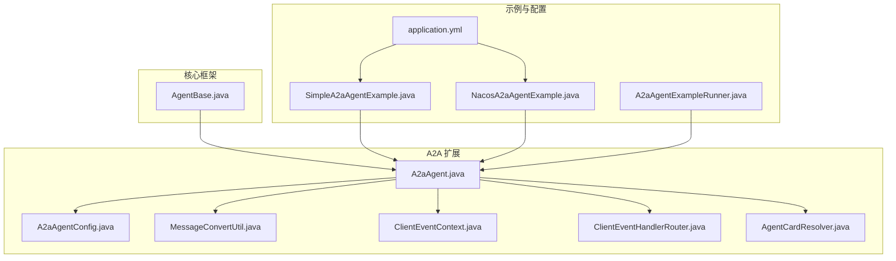
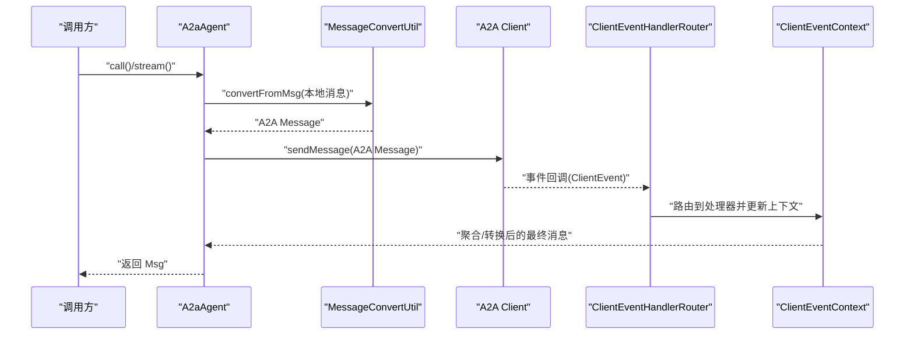
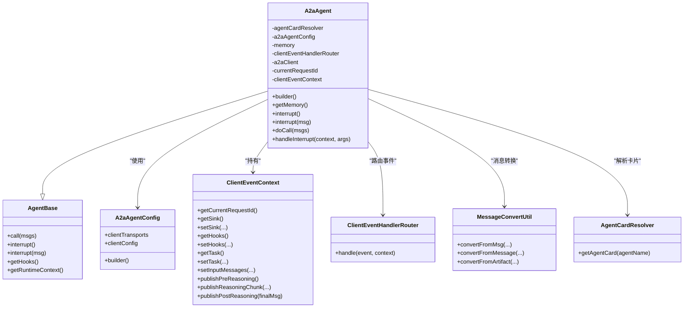
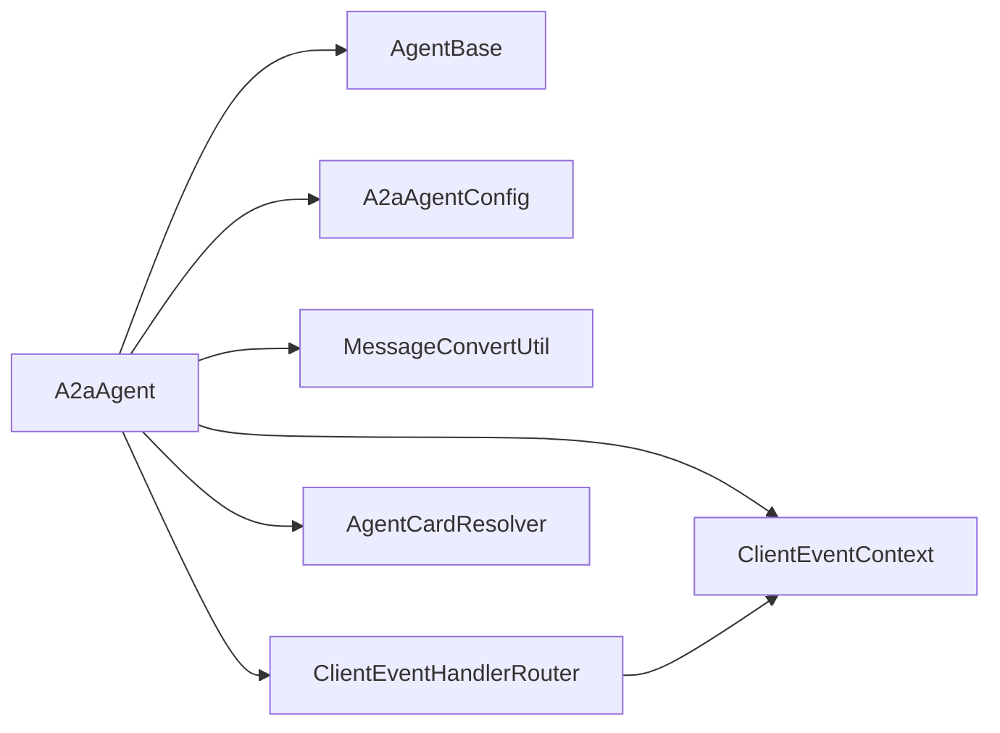

# A2A 智能体核心

<cite>
**本文引用的文件**
- [A2aAgent.java](file://agentscope-extensions/agentscope-extensions-a2a/agentscope-extensions-a2a-client/src/main/java/io/agentscope/core/a2a/agent/A2aAgent.java)
- [AgentBase.java](file://agentscope-core/src/main/java/io/agentscope/core/agent/AgentBase.java)
- [A2aAgentConfig.java](file://agentscope-extensions/agentscope-extensions-a2a/agentscope-extensions-a2a-client/src/main/java/io/agentscope/core/a2a/agent/A2aAgentConfig.java)
- [ClientEventContext.java](file://agentscope-extensions/agentscope-extensions-a2a/agentscope-extensions-a2a-client/src/main/java/io/agentscope/core/a2a/agent/event/ClientEventContext.java)
- [ClientEventHandlerRouter.java](file://agentscope-extensions/agentscope-extensions-a2a/agentscope-extensions-a2a-client/src/main/java/io/agentscope/core/a2a/agent/event/ClientEventHandlerRouter.java)
- [MessageConvertUtil.java](file://agentscope-extensions/agentscope-extensions-a2a/agentscope-extensions-a2a-client/src/main/java/io/agentscope/core/a2a/agent/utils/MessageConvertUtil.java)
- [AgentCardResolver.java](file://agentscope-extensions/agentscope-extensions-a2a/agentscope-extensions-a2a-client/src/main/java/io/agentscope/core/a2a/agent/card/AgentCardResolver.java)
- [SimpleA2aAgentExample.java](file://agentscope-examples/a2a/src/main/java/io/agentscope/examples/a2a/SimpleA2aAgentExample.java)
- [NacosA2aAgentExample.java](file://agentscope-examples/a2a/src/main/java/io/agentscope/examples/a2a/NacosA2aAgentExample.java)
- [A2aAgentExampleRunner.java](file://agentscope-examples/a2a/src/main/java/io/agentscope/examples/a2a/A2aAgentExampleRunner.java)
- [application.yml](file://agentscope-examples/a2a/src/main/resources/application.yml)
- [A2aAgentBuilderTest.java](file://agentscope-extensions/agentscope-extensions-a2a/agentscope-extensions-a2a-client/src/test/java/io/agentscope/core/a2a/agent/A2aAgentBuilderTest.java)
- [A2aAgentTest.java](file://agentscope-extensions/agentscope-extensions-a2a/agentscope-extensions-a2a-client/src/test/java/io/agentscope/core/a2a/agent/A2aAgentTest.java)
</cite>

## 目录
1. [简介](#简介)
2. [项目结构](#项目结构)
3. [核心组件](#核心组件)
4. [架构总览](#架构总览)
5. [详细组件分析](#详细组件分析)
6. [依赖关系分析](#依赖关系分析)
7. [性能考量](#性能考量)
8. [故障排查指南](#故障排查指南)
9. [结论](#结论)
10. [附录：完整创建与配置示例](#附录完整创建与配置示例)

## 简介
本文件面向 A2A（Agent-to-Agent）协议在 AgentScope Java 中的核心实现，聚焦于 A2aAgent 类的设计与实现，系统性阐述其继承自 AgentBase 的通用能力与 A2A 协议特有实现；详解智能体生命周期（初始化、执行、中断、资源释放）、Builder 模式配置项与作用、内存管理（消息存储与上下文维护）、以及最佳实践（状态检查、错误处理、性能优化）。同时提供从零到一的完整创建示例与配置指南，并通过图示帮助读者快速把握关键流程。

## 项目结构
围绕 A2A 智能体，相关代码主要分布在以下模块与包中：
- 核心基类与框架：agentscope-core/src/main/java/io/agentscope/core/agent/AgentBase.java
- A2A 智能体实现：agentscope-extensions/…/a2a-client/…/A2aAgent.java
- A2A 配置与工具：A2aAgentConfig.java、MessageConvertUtil.java、ClientEventContext.java、ClientEventHandlerRouter.java
- 卡片解析器接口：AgentCardResolver.java
- 示例与配置：SimpleA2aAgentExample.java、NacosA2aAgentExample.java、A2aAgentExampleRunner.java、application.yml
- 测试用例：A2aAgentBuilderTest.java、A2aAgentTest.java

**图表来源**
- [AgentBase.java:93-954](file://agentscope-core/src/main/java/io/agentscope/core/agent/AgentBase.java#L93-L954)
- [A2aAgent.java:71-416](file://agentscope-extensions/agentscope-extensions-a2a/agentscope-extensions-a2a-client/src/main/java/io/agentscope/core/a2a/agent/A2aAgent.java#L71-L416)
- [A2aAgentConfig.java:28-83](file://agentscope-extensions/agentscope-extensions-a2a/agentscope-extensions-a2a-client/src/main/java/io/agentscope/core/a2a/agent/A2aAgentConfig.java#L28-L83)
- [MessageConvertUtil.java:38-158](file://agentscope-extensions/agentscope-extensions-a2a/agentscope-extensions-a2a-client/src/main/java/io/agentscope/core/a2a/agent/utils/MessageConvertUtil.java#L38-L158)
- [ClientEventContext.java:36-163](file://agentscope-extensions/agentscope-extensions-a2a/agentscope-extensions-a2a-client/src/main/java/io/agentscope/core/a2a/agent/event/ClientEventContext.java#L36-L163)
- [ClientEventHandlerRouter.java:29-69](file://agentscope-extensions/agentscope-extensions-a2a/agentscope-extensions-a2a-client/src/main/java/io/agentscope/core/a2a/agent/event/ClientEventHandlerRouter.java#L29-L69)
- [AgentCardResolver.java:24-34](file://agentscope-extensions/agentscope-extensions-a2a/agentscope-extensions-a2a-client/src/main/java/io/agentscope/core/a2a/agent/card/AgentCardResolver.java#L24-L34)
- [SimpleA2aAgentExample.java:29-45](file://agentscope-examples/a2a/src/main/java/io/agentscope/examples/a2a/SimpleA2aAgentExample.java#L29-L45)
- [NacosA2aAgentExample.java:38-69](file://agentscope-examples/a2a/src/main/java/io/agentscope/examples/a2a/NacosA2aAgentExample.java#L38-L69)
- [A2aAgentExampleRunner.java:34-102](file://agentscope-examples/a2a/src/main/java/io/agentscope/examples/a2a/A2aAgentExampleRunner.java#L34-L102)
- [application.yml:15-65](file://agentscope-examples/a2a/src/main/resources/application.yml#L15-L65)

**章节来源**
- [A2aAgent.java:71-416](file://agentscope-extensions/agentscope-extensions-a2a/agentscope-extensions-a2a-client/src/main/java/io/agentscope/core/a2a/agent/A2aAgent.java#L71-L416)
- [AgentBase.java:93-954](file://agentscope-core/src/main/java/io/agentscope/core/agent/AgentBase.java#L93-L954)

## 核心组件
- A2aAgent：继承自 AgentBase，负责将本地消息转换为 A2A 协议消息，通过 Client 发送到远端 AgentCard 描述的目标智能体，并在事件驱动下进行响应聚合与输出。
- AgentBase：提供统一的生命周期钩子、中断机制、运行状态检查、优雅停机集成等基础设施。
- A2aAgentConfig：封装 A2A 客户端传输层与客户端配置，支持默认 JSON-RPC 传输或自定义传输。
- ClientEventContext：单次调用的事件上下文，承载请求 ID、任务信息、Hook 列表、输入消息快照及一次性触发的推理事件发布。
- ClientEventHandlerRouter：根据事件类型路由到具体处理器，完成任务更新、消息流、任务生命周期等事件的分发。
- MessageConvertUtil：在 AgentScope 的 Msg 与 A2A 的 Message/Artifact 之间进行双向转换。
- AgentCardResolver：抽象出 AgentCard 获取策略，支持固定卡片、Nacos 注册中心、Well-Known 等发现方式。

**章节来源**
- [A2aAgent.java:71-416](file://agentscope-extensions/agentscope-extensions-a2a/agentscope-extensions-a2a-client/src/main/java/io/agentscope/core/a2a/agent/A2aAgent.java#L71-L416)
- [AgentBase.java:93-954](file://agentscope-core/src/main/java/io/agentscope/core/agent/AgentBase.java#L93-L954)
- [A2aAgentConfig.java:28-83](file://agentscope-extensions/agentscope-extensions-a2a/agentscope-extensions-a2a-client/src/main/java/io/agentscope/core/a2a/agent/A2aAgentConfig.java#L28-L83)
- [ClientEventContext.java:36-163](file://agentscope-extensions/agentscope-extensions-a2a/agentscope-extensions-a2a-client/src/main/java/io/agentscope/core/a2a/agent/event/ClientEventContext.java#L36-L163)
- [ClientEventHandlerRouter.java:29-69](file://agentscope-extensions/agentscope-extensions-a2a/agentscope-extensions-a2a-client/src/main/java/io/agentscope/core/a2a/agent/event/ClientEventHandlerRouter.java#L29-L69)
- [MessageConvertUtil.java:38-158](file://agentscope-extensions/agentscope-extensions-a2a/agentscope-extensions-a2a-client/src/main/java/io/agentscope/core/a2a/agent/utils/MessageConvertUtil.java#L38-L158)
- [AgentCardResolver.java:24-34](file://agentscope-extensions/agentscope-extensions-a2a/agentscope-extensions-a2a-client/src/main/java/io/agentscope/core/a2a/agent/card/AgentCardResolver.java#L24-L34)

## 架构总览
A2A 智能体采用“协议适配 + 事件驱动”的架构模式：
- 输入消息经由 MessageConvertUtil 转换为 A2A Message；
- 通过 Client 发送至远端 AgentCard 指定的接口；
- 远端返回的事件由 ClientEventHandlerRouter 分发到对应处理器；
- ClientEventContext 统一管理一次调用的上下文与 Hook 触发；
- 输出消息再经由 MessageConvertUtil 转回 AgentScope Msg 返回给调用方。

**图表来源**
- [A2aAgent.java:114-214](file://agentscope-extensions/agentscope-extensions-a2a/agentscope-extensions-a2a-client/src/main/java/io/agentscope/core/a2a/agent/A2aAgent.java#L114-L214)
- [MessageConvertUtil.java:104-136](file://agentscope-extensions/agentscope-extensions-a2a/agentscope-extensions-a2a-client/src/main/java/io/agentscope/core/a2a/agent/utils/MessageConvertUtil.java#L104-L136)
- [ClientEventHandlerRouter.java:55-67](file://agentscope-extensions/agentscope-extensions-a2a/agentscope-extensions-a2a-client/src/main/java/io/agentscope/core/a2a/agent/event/ClientEventHandlerRouter.java#L55-L67)
- [ClientEventContext.java:58-97](file://agentscope-extensions/agentscope-extensions-a2a/agentscope-extensions-a2a-client/src/main/java/io/agentscope/core/a2a/agent/event/ClientEventContext.java#L58-L97)

## 详细组件分析

### A2aAgent 设计与实现
- 继承关系与职责边界
  - 继承自 AgentBase，复用统一的生命周期钩子、中断与运行状态管理；
  - 专注于 A2A 协议的消息转换、客户端构建与事件处理。
- 关键字段与行为
  - 代理卡片解析器：决定目标智能体的地址与接口；
  - 配置对象：控制传输层与客户端配置；
  - 内存：用于存储对话历史，便于上下文维护；
  - 事件路由：将远端事件映射为本地 Hook 事件，驱动推理阶段的预/中/后事件。
- 生命周期
  - 初始化：Builder 构建时校验必要参数，注入系统 Hook；
  - 执行：doCall 将输入消息写入内存，转换为 A2A Message 并发送，接收事件后聚合输出；
  - 中断：interrupt 支持用户消息与无参两种形式，内部委托 handleInterrupt；
  - 资源释放：A2aClientLifecycleHook 在 PostCall/Error 时关闭客户端并清理上下文。
- 线程安全与并发
  - 设计上不允许多线程并发调用同一实例，避免共享状态竞争；
  - 通过原子标志位与运行状态标记保证中断与执行互斥。

**图表来源**
- [AgentBase.java:93-954](file://agentscope-core/src/main/java/io/agentscope/core/agent/AgentBase.java#L93-L954)
- [A2aAgent.java:71-416](file://agentscope-extensions/agentscope-extensions-a2a/agentscope-extensions-a2a-client/src/main/java/io/agentscope/core/a2a/agent/A2aAgent.java#L71-L416)
- [A2aAgentConfig.java:28-83](file://agentscope-extensions/agentscope-extensions-a2a/agentscope-extensions-a2a-client/src/main/java/io/agentscope/core/a2a/agent/A2aAgentConfig.java#L28-L83)
- [ClientEventContext.java:36-163](file://agentscope-extensions/agentscope-extensions-a2a/agentscope-extensions-a2a-client/src/main/java/io/agentscope/core/a2a/agent/event/ClientEventContext.java#L36-L163)
- [ClientEventHandlerRouter.java:29-69](file://agentscope-extensions/agentscope-extensions-a2a/agentscope-extensions-a2a-client/src/main/java/io/agentscope/core/a2a/agent/event/ClientEventHandlerRouter.java#L29-L69)
- [MessageConvertUtil.java:38-158](file://agentscope-extensions/agentscope-extensions-a2a/agentscope-extensions-a2a-client/src/main/java/io/agentscope/core/a2a/agent/utils/MessageConvertUtil.java#L38-L158)
- [AgentCardResolver.java:24-34](file://agentscope-extensions/agentscope-extensions-a2a/agentscope-extensions-a2a-client/src/main/java/io/agentscope/core/a2a/agent/card/AgentCardResolver.java#L24-L34)

**章节来源**
- [A2aAgent.java:71-416](file://agentscope-extensions/agentscope-extensions-a2a/agentscope-extensions-a2a-client/src/main/java/io/agentscope/core/a2a/agent/A2aAgent.java#L71-L416)
- [AgentBase.java:93-954](file://agentscope-core/src/main/java/io/agentscope/core/agent/AgentBase.java#L93-L954)

### Builder 模式与配置项详解
- 必填项
  - agentCardResolver：必须显式提供，否则构建失败；
  - name：智能体名称，用于卡片解析与日志标识。
- 可选项
  - agentCard：快捷设置固定卡片解析器；
  - a2aAgentConfig：客户端传输与配置，默认为空则启用 JSON-RPC；
  - memory：默认内存实现，可替换为持久化或自定义实现；
  - checkRunning：是否启用运行状态检查（默认开启）；
  - hooks：动态添加业务钩子（如录制、TTS、结构化输出等）。
- 行为要点
  - 后设置的 agentCardResolver 会覆盖先前的 agentCard 设置；
  - 若未提供 a2aAgentConfig，则自动构建默认配置；
  - 描述文本优先从 AgentCard 获取，异常时降级为默认值。

**章节来源**
- [A2aAgent.java:262-414](file://agentscope-extensions/agentscope-extensions-a2a/agentscope-extensions-a2a-client/src/main/java/io/agentscope/core/a2a/agent/A2aAgent.java#L262-L414)
- [A2aAgentBuilderTest.java:76-353](file://agentscope-extensions/agentscope-extensions-a2a/agentscope-extensions-a2a-client/src/test/java/io/agentscope/core/a2a/agent/A2aAgentBuilderTest.java#L76-L353)

### 内存管理与上下文维护
- 消息存储
  - doCall 前将输入消息写入内存；每次事件到达后也会追加到内存，确保上下文连续；
  - observe 接口允许仅观察不回复，但同样可写入内存以供后续调用使用。
- 上下文快照
  - ClientEventContext 在 PreReasoning 阶段保存输入消息快照，用于推理事件的输入视图；
  - 通过一次性标志位避免重复触发推理事件。
- 生命周期绑定
  - A2aClientLifecycleHook 在 PreCall 创建上下文，在 PostCall/Error 清理资源，确保资源及时释放。

**章节来源**
- [A2aAgent.java:114-149](file://agentscope-extensions/agentscope-extensions-a2a/agentscope-extensions-a2a-client/src/main/java/io/agentscope/core/a2a/agent/A2aAgent.java#L114-L149)
- [ClientEventContext.java:58-161](file://agentscope-extensions/agentscope-extensions-a2a/agentscope-extensions-a2a-client/src/main/java/io/agentscope/core/a2a/agent/event/ClientEventContext.java#L58-L161)
- [A2aAgent.java:216-260](file://agentscope-extensions/agentscope-extensions-a2a/agentscope-extensions-a2a-client/src/main/java/io/agentscope/core/a2a/agent/A2aAgent.java#L216-L260)

### 事件处理与推理阶段钩子
- 事件路由
  - ClientEventHandlerRouter 注册任务更新、消息事件、任务事件处理器；
  - 未知事件类型会被忽略并记录调试日志。
- 推理阶段事件
  - ClientEventContext 提供 publishPreReasoning、publishReasoningChunk、publishPostReasoning；
  - 通过 Hook 链路对外暴露推理过程，便于观测与增强。

**章节来源**
- [ClientEventHandlerRouter.java:29-69](file://agentscope-extensions/agentscope-extensions-a2a/agentscope-extensions-a2a-client/src/main/java/io/agentscope/core/a2a/agent/event/ClientEventHandlerRouter.java#L29-L69)
- [ClientEventContext.java:103-161](file://agentscope-extensions/agentscope-extensions-a2a/agentscope-extensions-a2a-client/src/main/java/io/agentscope/core/a2a/agent/event/ClientEventContext.java#L103-L161)

### 协议消息转换
- 本地消息到 A2A 消息
  - 将 Msg 的内容块转换为 Part，附加元数据（消息 ID、来源名等），组装为 Message；
- A2A 消息/制品到本地消息
  - 将 Message 或 Artifact 的 Parts 解析为 ContentBlock，构造 Msg；
  - 元数据保留以便追踪来源与类型。

**章节来源**
- [MessageConvertUtil.java:38-158](file://agentscope-extensions/agentscope-extensions-a2a/agentscope-extensions-a2a-client/src/main/java/io/agentscope/core/a2a/agent/utils/MessageConvertUtil.java#L38-L158)

### 中断与错误处理
- 中断
  - 支持无参与带用户消息两种中断方式；
  - handleInterrupt 通过 A2A 客户端取消任务并返回提示消息。
- 错误处理
  - AgentBase 在 call 生命周期内捕获 InterruptedException 并委派到 handleInterrupt；
  - 其他异常通过 ErrorEvent 钩子链通知，随后向上抛出；
  - A2aClientLifecycleHook 在 PostCall/Error 时关闭客户端并清理上下文。

**章节来源**
- [A2aAgent.java:133-171](file://agentscope-extensions/agentscope-extensions-a2a/agentscope-extensions-a2a-client/src/main/java/io/agentscope/core/a2a/agent/A2aAgent.java#L133-L171)
- [AgentBase.java:449-457](file://agentscope-core/src/main/java/io/agentscope/core/agent/AgentBase.java#L449-L457)
- [A2aAgent.java:216-260](file://agentscope-extensions/agentscope-extensions-a2a/agentscope-extensions-a2a-client/src/main/java/io/agentscope/core/a2a/agent/A2aAgent.java#L216-L260)

## 依赖关系分析
- 组件耦合
  - A2aAgent 对 AgentBase 强依赖，对 A2A 客户端与事件处理器为弱依赖（通过接口与反射式注册）；
  - ClientEventContext 与 Router 之间为松耦合，便于扩展新的事件类型。
- 外部依赖
  - A2A 客户端库（io.a2a.*）提供协议实现与事件模型；
  - Spring Boot Starter（可选）用于简化配置与自动装配。

**图表来源**
- [A2aAgent.java:71-416](file://agentscope-extensions/agentscope-extensions-a2a/agentscope-extensions-a2a-client/src/main/java/io/agentscope/core/a2a/agent/A2aAgent.java#L71-L416)
- [ClientEventHandlerRouter.java:29-69](file://agentscope-extensions/agentscope-extensions-a2a/agentscope-extensions-a2a-client/src/main/java/io/agentscope/core/a2a/agent/event/ClientEventHandlerRouter.java#L29-L69)
- [ClientEventContext.java:36-163](file://agentscope-extensions/agentscope-extensions-a2a/agentscope-extensions-a2a-client/src/main/java/io/agentscope/core/a2a/agent/event/ClientEventContext.java#L36-L163)

**章节来源**
- [A2aAgent.java:71-416](file://agentscope-extensions/agentscope-extensions-a2a/agentscope-extensions-a2a-client/src/main/java/io/agentscope/core/a2a/agent/A2aAgent.java#L71-L416)
- [ClientEventHandlerRouter.java:29-69](file://agentscope-extensions/agentscope-extensions-a2a/agentscope-extensions-a2a-client/src/main/java/io/agentscope/core/a2a/agent/event/ClientEventHandlerRouter.java#L29-L69)

## 性能考量
- 传输层选择
  - 默认启用 JSON-RPC 传输；若远端支持自定义传输，建议在 A2aAgentConfig 中配置以降低开销；
  - 自定义传输需确保与远端 AgentCard 的接口一致。
- 内存与上下文
  - 避免在长对话中无限增长的上下文；可结合外部记忆模块或定期裁剪策略；
  - 使用 observe 仅观察不回复时，仍建议按需写入内存，避免遗漏关键上下文。
- 钩子链
  - 钩子数量与复杂度直接影响延迟；建议仅在必要时添加钩子，并控制其优先级；
  - 结构化输出钩子仅在需要时临时加入，完成后及时移除。
- 中断与取消
  - 在长时间计算或工具调用前插入 checkInterruptedAsync 检查点，提升交互体验；
  - 中断成功后尽快释放资源，避免悬挂连接。

[本节为通用指导，无需特定文件来源]

## 故障排查指南
- 构建失败：未设置 agentCardResolver
  - 现象：IllegalArgumentException；
  - 处理：确保通过 agentCardResolver 或 agentCard 至少一种方式提供。
- 无法获取描述：AgentCard 解析异常
  - 现象：描述降级为默认值；
  - 处理：检查卡片解析器实现与网络连通性。
- 事件未处理：未知事件类型
  - 现象：调试日志提示忽略该事件；
  - 处理：确认远端版本与事件类型是否匹配。
- 资源未释放：客户端未关闭
  - 现象：连接泄漏；
  - 处理：确认 A2aClientLifecycleHook 是否正常触发；检查 PostCall/Error 事件。
- 中断无效：远端不支持取消
  - 现象：handleInterrupt 返回错误消息；
  - 处理：确认远端是否支持取消任务；必要时升级远端实现。

**章节来源**
- [A2aAgentBuilderTest.java:92-100](file://agentscope-extensions/agentscope-extensions-a2a/agentscope-extensions-a2a-client/src/test/java/io/agentscope/core/a2a/agent/A2aAgentBuilderTest.java#L92-L100)
- [A2aAgentTest.java:165-183](file://agentscope-extensions/agentscope-extensions-a2a/agentscope-extensions-a2a-client/src/test/java/io/agentscope/core/a2a/agent/A2aAgentTest.java#L165-L183)
- [A2aAgent.java:216-260](file://agentscope-extensions/agentscope-extensions-a2a/agentscope-extensions-a2a-client/src/main/java/io/agentscope/core/a2a/agent/A2aAgent.java#L216-L260)

## 结论
A2aAgent 通过清晰的职责划分与事件驱动机制，将 AgentBase 的通用能力与 A2A 协议的特性有机结合。借助 Builder 模式与可插拔的传输层、事件处理器与钩子体系，既满足了易用性，也兼顾了扩展性与性能。遵循本文的状态检查、错误处理与性能优化建议，可在生产环境中稳定地使用 A2A 智能体。

[本节为总结性内容，无需特定文件来源]

## 附录：完整创建与配置示例

### 示例一：基于 Well-Known 卡片的简单示例
- 步骤
  - 创建 WellKnownAgentCardResolver（指定基础 URL）；
  - 使用 A2aAgent.builder().name(...).agentCardResolver(...) 构建；
  - 通过 A2aAgentExampleRunner 启动交互式会话。
- 关键点
  - 卡片解析器负责定位远端 AgentCard；
  - 默认使用 JSON-RPC 传输，无需额外配置。

**章节来源**
- [SimpleA2aAgentExample.java:31-43](file://agentscope-examples/a2a/src/main/java/io/agentscope/examples/a2a/SimpleA2aAgentExample.java#L31-L43)
- [A2aAgentExampleRunner.java:49-100](file://agentscope-examples/a2a/src/main/java/io/agentscope/examples/a2a/A2aAgentExampleRunner.java#L49-L100)

### 示例二：基于 Nacos 注册中心的示例
- 步骤
  - 通过 Nacos 客户端属性构建 AiService；
  - 使用 NacosAgentCardResolver 包装 AiService；
  - 以相同方式构建 A2aAgent 并启动会话。
- 关键点
  - 支持环境变量 NACOS_SERVER_ADDR、NACOS_USERNAME、NACOS_PASSWORD；
  - 适用于分布式部署场景。

**章节来源**
- [NacosA2aAgentExample.java:40-67](file://agentscope-examples/a2a/src/main/java/io/agentscope/examples/a2a/NacosA2aAgentExample.java#L40-L67)

### 示例三：Spring Boot 集成配置
- application.yml 关键配置
  - agentscope.a2a.server.card.*：远端卡片描述、图标、技能列表等；
  - agentscope.a2a.nacos.enabled/server-addr/username/password：Nacos 注册中心开关与凭据；
  - agentscope.agent.name：本地智能体名称（用于卡片解析）。
- 说明
  - 该配置文件为示例用途，实际部署时请按需调整。

**章节来源**
- [application.yml:23-65](file://agentscope-examples/a2a/src/main/resources/application.yml#L23-L65)

### 最佳实践清单
- 状态检查
  - 使用 checkRunning=true（默认）避免并发调用；
  - 在复杂流程中多处插入 checkInterruptedAsync 检查点。
- 错误处理
  - 通过 ErrorEvent 钩子集中处理异常；
  - 在 PostCall/Error 钩子中确保资源释放。
- 性能优化
  - 选择合适的传输层（默认 JSON-RPC 已覆盖多数场景）；
  - 控制钩子数量与复杂度，必要时按需动态增删钩子；
  - 对长对话进行上下文裁剪或外部记忆集成。

[本节为通用指导，无需特定文件来源]