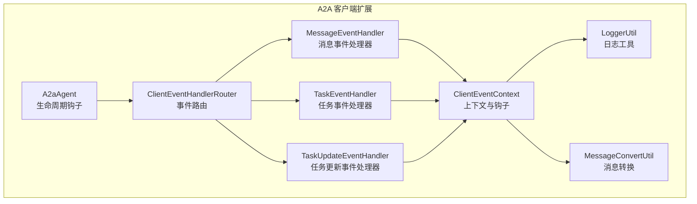
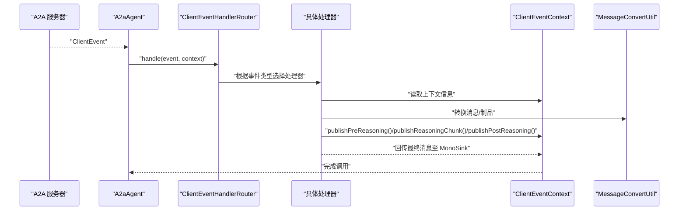
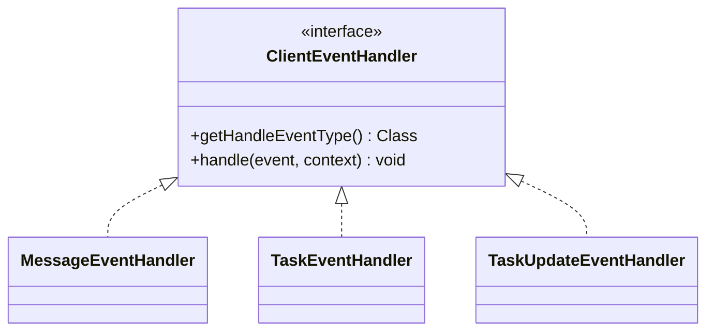
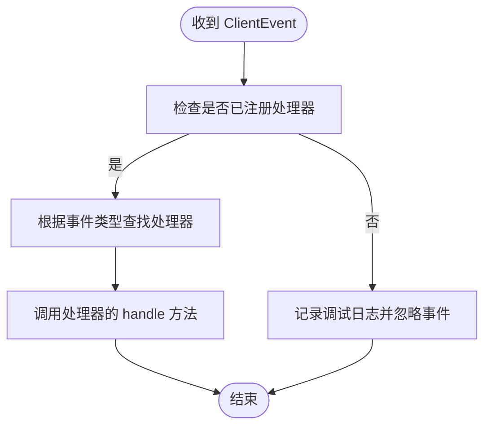
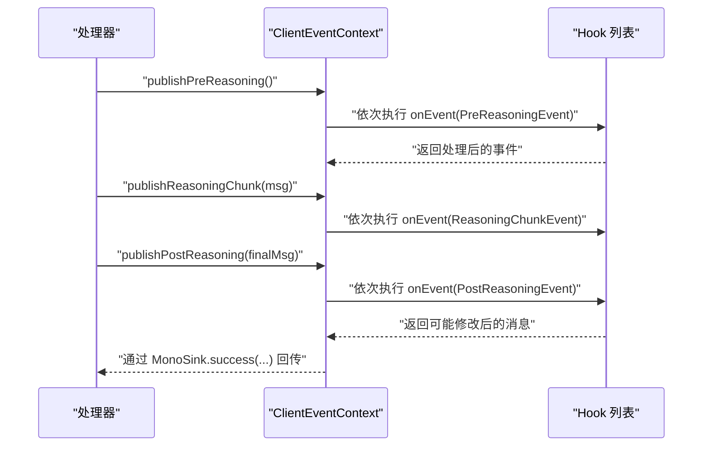
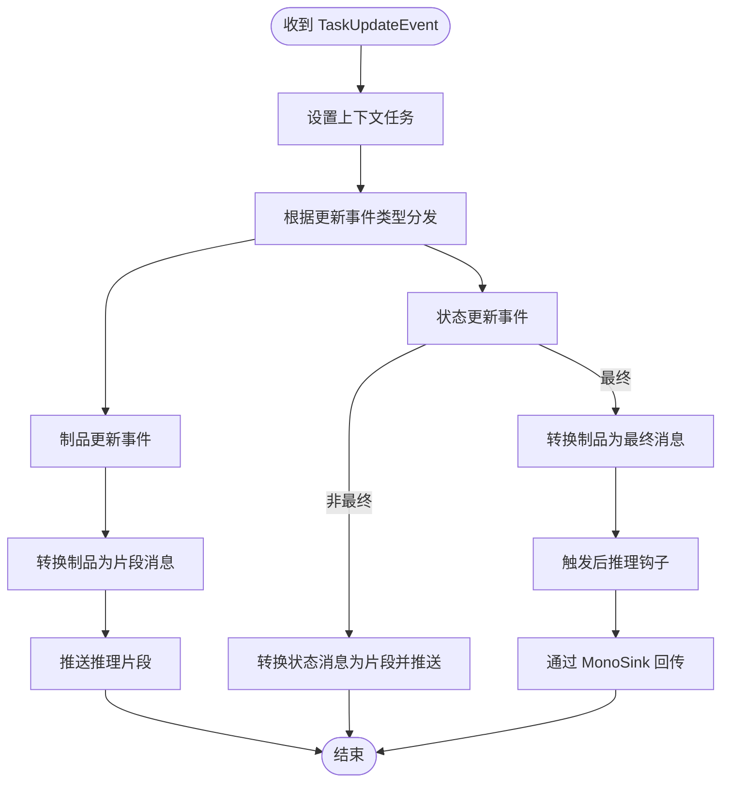
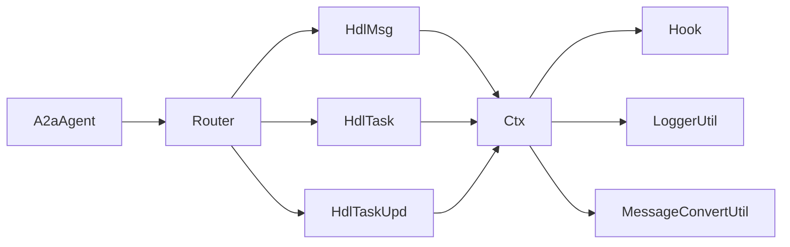

# 客户端事件处理器

<cite>
**本文引用的文件**
- [ClientEventHandler.java](file://agentscope-extensions/agentscope-extensions-a2a/agentscope-extensions-a2a-client/src/main/java/io/agentscope/core/a2a/agent/event/ClientEventHandler.java)
- [ClientEventHandlerRouter.java](file://agentscope-extensions/agentscope-extensions-a2a/agentscope-extensions-a2a-client/src/main/java/io/agentscope/core/a2a/agent/event/ClientEventHandlerRouter.java)
- [ClientEventContext.java](file://agentscope-extensions/agentscope-extensions-a2a/agentscope-extensions-a2a-client/src/main/java/io/agentscope/core/a2a/agent/event/ClientEventContext.java)
- [MessageEventHandler.java](file://agentscope-extensions/agentscope-extensions-a2a/agentscope-extensions-a2a-client/src/main/java/io/agentscope/core/a2a/agent/event/MessageEventHandler.java)
- [TaskEventHandler.java](file://agentscope-extensions/agentscope-extensions-a2a/agentscope-extensions-a2a-client/src/main/java/io/agentscope/core/a2a/agent/event/TaskEventHandler.java)
- [TaskUpdateEventHandler.java](file://agentscope-extensions/agentscope-extensions-a2a/agentscope-extensions-a2a-client/src/main/java/io/agentscope/core/a2a/agent/event/TaskUpdateEventHandler.java)
- [A2aAgent.java](file://agentscope-extensions/agentscope-extensions-a2a/agentscope-extensions-a2a-client/src/main/java/io/agentscope/core/a2a/agent/A2aAgent.java)
- [LoggerUtil.java](file://agentscope-extensions/agentscope-extensions-a2a/agentscope-extensions-a2a-client/src/main/java/io/agentscope/core/a2a/agent/utils/LoggerUtil.java)
- [MessageConvertUtil.java](file://agentscope-extensions/agentscope-extensions-a2a/agentscope-extensions-a2a-client/src/main/java/io/agentscope/core/a2a/agent/utils/MessageConvertUtil.java)
- [PreReasoningEvent.java](file://agentscope-core/src/main/java/io/agentscope/core/hook/PreReasoningEvent.java)
- [ReasoningChunkEvent.java](file://agentscope-core/src/main/java/io/agentscope/core/hook/ReasoningChunkEvent.java)
- [PostReasoningEvent.java](file://agentscope-core/src/main/java/io/agentscope/core/hook/PostReasoningEvent.java)
- [Hook.java](file://agentscope-core/src/main/java/io/agentscope/core/hook/Hook.java)
- [ErrorEvent.java](file://agentscope-core/src/main/java/io/agentscope/core/hook/ErrorEvent.java)
- [A2aClientLifecycleHook.java](file://agentscope-extensions/agentscope-extensions-a2a/agentscope-extensions-a2a-client/src/main/java/io/agentscope/core/a2a/agent/A2aAgent.java)
</cite>

## 目录
1. [简介](#简介)
2. [项目结构](#项目结构)
3. [核心组件](#核心组件)
4. [架构总览](#架构总览)
5. [详细组件分析](#详细组件分析)
6. [依赖关系分析](#依赖关系分析)
7. [性能考虑](#性能考虑)
8. [故障排查指南](#故障排查指南)
9. [结论](#结论)
10. [附录：注册与配置示例](#附录注册与配置示例)

## 简介
本文件面向“客户端事件处理器”模块，系统化阐述以下主题：
- ClientEventHandler 接口的设计模式与职责边界
- 事件处理器路由器（ClientEventHandlerRouter）的路由算法与扩展机制
- 客户端事件上下文（ClientEventContext）的作用域与生命周期管理
- 不同类型事件的处理流程：消息事件、任务事件、任务更新事件（含状态与制品）
- 事件处理的注册与配置方式
- 性能优化、并发安全与异常处理策略

该模块位于 A2A 客户端扩展中，负责将来自 A2A 服务器的客户端事件（ClientEvent）分发到对应的处理器，并在统一上下文中完成钩子触发、消息转换与结果回传。

## 项目结构
客户端事件处理相关代码位于 agentscope-extensions-a2a-client 模块的 a2a.agent.event 包内，配合 A2aAgent 的生命周期钩子使用，形成从事件接收、路由、处理到结果回传的完整链路。

图示来源
- [ClientEventHandlerRouter.java:29-68](file://agentscope-extensions/agentscope-extensions-a2a/agentscope-extensions-a2a-client/src/main/java/io/agentscope/core/a2a/agent/event/ClientEventHandlerRouter.java#L29-L68)
- [ClientEventContext.java:36-162](file://agentscope-extensions/agentscope-extensions-a2a/agentscope-extensions-a2a-client/src/main/java/io/agentscope/core/a2a/agent/event/ClientEventContext.java#L36-L162)
- [MessageEventHandler.java:30-54](file://agentscope-extensions/agentscope-extensions-a2a/agentscope-extensions-a2a-client/src/main/java/io/agentscope/core/a2a/agent/event/MessageEventHandler.java#L30-L54)
- [TaskEventHandler.java:28-50](file://agentscope-extensions/agentscope-extensions-a2a/agentscope-extensions-a2a-client/src/main/java/io/agentscope/core/a2a/agent/event/TaskEventHandler.java#L28-L50)
- [TaskUpdateEventHandler.java:36-144](file://agentscope-extensions/agentscope-extensions-a2a/agentscope-extensions-a2a-client/src/main/java/io/agentscope/core/a2a/agent/event/TaskUpdateEventHandler.java#L36-L144)
- [A2aAgent.java:97-112](file://agentscope-extensions/agentscope-extensions-a2a/agentscope-extensions-a2a-client/src/main/java/io/agentscope/core/a2a/agent/A2aAgent.java#L97-L112)

章节来源
- [ClientEventHandlerRouter.java:29-68](file://agentscope-extensions/agentscope-extensions-a2a/agentscope-extensions-a2a-client/src/main/java/io/agentscope/core/a2a/agent/event/ClientEventHandlerRouter.java#L29-L68)
- [ClientEventContext.java:36-162](file://agentscope-extensions/agentscope-extensions-a2a/agentscope-extensions-a2a-client/src/main/java/io/agentscope/core/a2a/agent/event/ClientEventContext.java#L36-L162)
- [A2aAgent.java:97-112](file://agentscope-extensions/agentscope-extensions-a2a/agentscope-extensions-a2a-client/src/main/java/io/agentscope/core/a2a/agent/A2aAgent.java#L97-L112)

## 核心组件
- ClientEventHandler：事件处理器接口，定义按事件类型进行处理的契约，包含事件类型声明与处理方法。
- ClientEventHandlerRouter：事件路由器，维护事件类型到处理器的映射，提供统一的分发入口。
- ClientEventContext：事件上下文，承载当前请求 ID、A2A Agent 实例、MonoSink、钩子列表、任务对象与输入消息等，提供统一的钩子发布 API（预推理、推理片段、后推理）。
- 具体处理器：
  - MessageEventHandler：处理消息事件，转换消息、自动触发前后推理钩子并回传最终消息。
  - TaskEventHandler：处理任务事件，设置上下文任务并触发预推理钩子。
  - TaskUpdateEventHandler：处理任务更新事件，根据更新类型（状态/制品）分别处理，支持流式片段推送与最终制品回传。

章节来源
- [ClientEventHandler.java:24-40](file://agentscope-extensions/agentscope-extensions-a2a/agentscope-extensions-a2a-client/src/main/java/io/agentscope/core/a2a/agent/event/ClientEventHandler.java#L24-L40)
- [ClientEventHandlerRouter.java:29-68](file://agentscope-extensions/agentscope-extensions-a2a/agentscope-extensions-a2a-client/src/main/java/io/agentscope/core/a2a/agent/event/ClientEventHandlerRouter.java#L29-L68)
- [ClientEventContext.java:36-162](file://agentscope-extensions/agentscope-extensions-a2a/agentscope-extensions-a2a-client/src/main/java/io/agentscope/core/a2a/agent/event/ClientEventContext.java#L36-L162)
- [MessageEventHandler.java:30-54](file://agentscope-extensions/agentscope-extensions-a2a/agentscope-extensions-a2a-client/src/main/java/io/agentscope/core/a2a/agent/event/MessageEventHandler.java#L30-L54)
- [TaskEventHandler.java:28-50](file://agentscope-extensions/agentscope-extensions-a2a/agentscope-extensions-a2a-client/src/main/java/io/agentscope/core/a2a/agent/event/TaskEventHandler.java#L28-L50)
- [TaskUpdateEventHandler.java:36-144](file://agentscope-extensions/agentscope-extensions-a2a/agentscope-extensions-a2a-client/src/main/java/io/agentscope/core/a2a/agent/event/TaskUpdateEventHandler.java#L36-L144)

## 架构总览
下图展示了 A2A 客户端事件处理的整体架构：A2aAgent 在生命周期钩子中初始化 ClientEventContext，并通过 ClientEventHandlerRouter 将收到的 ClientEvent 分发给对应处理器；处理器在上下文中完成消息转换、钩子触发与结果回传。

图示来源
- [A2aAgent.java:223-245](file://agentscope-extensions/agentscope-extensions-a2a/agentscope-extensions-a2a-client/src/main/java/io/agentscope/core/a2a/agent/A2aAgent.java#L223-L245)
- [ClientEventHandlerRouter.java:55-67](file://agentscope-extensions/agentscope-extensions-a2a/agentscope-extensions-a2a-client/src/main/java/io/agentscope/core/a2a/agent/event/ClientEventHandlerRouter.java#L55-L67)
- [MessageEventHandler.java:39-53](file://agentscope-extensions/agentscope-extensions-a2a/agentscope-extensions-a2a-client/src/main/java/io/agentscope/core/a2a/agent/event/MessageEventHandler.java#L39-L53)
- [TaskUpdateEventHandler.java:55-78](file://agentscope-extensions/agentscope-extensions-a2a/agentscope-extensions-a2a-client/src/main/java/io/agentscope/core/a2a/agent/event/TaskUpdateEventHandler.java#L55-L78)
- [ClientEventContext.java:103-161](file://agentscope-extensions/agentscope-extensions-a2a/agentscope-extensions-a2a-client/src/main/java/io/agentscope/core/a2a/agent/event/ClientEventContext.java#L103-L161)

## 详细组件分析

### ClientEventHandler 接口设计与职责
- 设计模式：基于泛型的策略接口，每个具体处理器实现一个特定的 ClientEvent 类型处理逻辑。
- 职责边界：
  - getHandleEventType：声明该处理器可处理的事件类型，用于路由匹配。
  - handle：执行事件处理，接收事件与上下文，完成消息转换、钩子触发与结果回传。
- 扩展性：新增事件类型只需实现该接口并注册到路由器即可。

图示来源
- [ClientEventHandler.java:24-40](file://agentscope-extensions/agentscope-extensions-a2a/agentscope-extensions-a2a-client/src/main/java/io/agentscope/core/a2a/agent/event/ClientEventHandler.java#L24-L40)
- [MessageEventHandler.java:30-54](file://agentscope-extensions/agentscope-extensions-a2a/agentscope-extensions-a2a-client/src/main/java/io/agentscope/core/a2a/agent/event/MessageEventHandler.java#L30-L54)
- [TaskEventHandler.java:28-50](file://agentscope-extensions/agentscope-extensions-a2a/agentscope-extensions-a2a-client/src/main/java/io/agentscope/core/a2a/agent/event/TaskEventHandler.java#L28-L50)
- [TaskUpdateEventHandler.java:36-144](file://agentscope-extensions/agentscope-extensions-a2a/agentscope-extensions-a2a-client/src/main/java/io/agentscope/core/a2a/agent/event/TaskUpdateEventHandler.java#L36-L144)

章节来源
- [ClientEventHandler.java:24-40](file://agentscope-extensions/agentscope-extensions-a2a/agentscope-extensions-a2a-client/src/main/java/io/agentscope/core/a2a/agent/event/ClientEventHandler.java#L24-L40)

### ClientEventHandlerRouter 路由算法与优先级管理
- 路由算法：内部维护事件类型到处理器的映射表，handle 方法根据事件类型直接查找处理器并调用其 handle。
- 初始化注册：构造函数中注册默认处理器（消息事件、任务事件、任务更新事件），体现“内置优先级”。
- 未匹配处理：当无对应处理器时记录调试日志并忽略事件，避免异常传播。
- 优先级管理：通过注册顺序控制处理器优先级；如需自定义优先级，可在构造函数中调整注册顺序或提供扩展注册方法。

图示来源
- [ClientEventHandlerRouter.java:36-45](file://agentscope-extensions/agentscope-extensions-a2a/agentscope-extensions-a2a-client/src/main/java/io/agentscope/core/a2a/agent/event/ClientEventHandlerRouter.java#L36-L45)
- [ClientEventHandlerRouter.java:55-67](file://agentscope-extensions/agentscope-extensions-a2a/agentscope-extensions-a2a-client/src/main/java/io/agentscope/core/a2a/agent/event/ClientEventHandlerRouter.java#L55-L67)

章节来源
- [ClientEventHandlerRouter.java:29-68](file://agentscope-extensions/agentscope-extensions-a2a/agentscope-extensions-a2a-client/src/main/java/io/agentscope/core/a2a/agent/event/ClientEventHandlerRouter.java#L29-L68)

### ClientEventContext 上下文与钩子机制
- 请求 ID 管理：保存当前请求 ID，贯穿事件处理全过程，便于日志关联与追踪。
- 钩子注册：持有钩子列表，提供统一的事件发布 API，确保钩子按顺序执行。
- 生命周期钩子：
  - publishPreReasoning：仅触发一次，用于在推理开始前通知所有钩子。
  - publishReasoningChunk：流式片段推送，先保证预推理已触发。
  - publishPostReasoning：仅触发一次，推理完成后允许钩子修改最终消息。
- 并发安全：使用原子布尔标志确保生命周期钩子只触发一次，避免重复触发。
- 消息传递：通过 MonoSink 回传最终消息，作为 A2A 调用的完成信号。

图示来源
- [ClientEventContext.java:103-161](file://agentscope-extensions/agentscope-extensions-a2a/agentscope-extensions-a2a-client/src/main/java/io/agentscope/core/a2a/agent/event/ClientEventContext.java#L103-L161)
- [PreReasoningEvent.java](file://agentscope-core/src/main/java/io/agentscope/core/hook/PreReasoningEvent.java)
- [ReasoningChunkEvent.java](file://agentscope-core/src/main/java/io/agentscope/core/hook/ReasoningChunkEvent.java)
- [PostReasoningEvent.java](file://agentscope-core/src/main/java/io/agentscope/core/hook/PostReasoningEvent.java)
- [Hook.java](file://agentscope-core/src/main/java/io/agentscope/core/hook/Hook.java)

章节来源
- [ClientEventContext.java:36-162](file://agentscope-extensions/agentscope-extensions-a2a/agentscope-extensions-a2a-client/src/main/java/io/agentscope/core/a2a/agent/event/ClientEventContext.java#L36-L162)

### 事件处理流程详解

#### 消息事件（MessageEvent）
- 处理要点：
  - 从事件中提取消息，转换为内部消息格式。
  - 自动触发后推理钩子（在钩子中可对最终消息进行修改）。
  - 通过 MonoSink 成功回传最终消息。
- 日志与可观测性：记录完成状态与消息详情，便于问题定位。

章节来源
- [MessageEventHandler.java:39-53](file://agentscope-extensions/agentscope-extensions-a2a/agentscope-extensions-a2a-client/src/main/java/io/agentscope/core/a2a/agent/event/MessageEventHandler.java#L39-L53)

#### 任务事件（TaskEvent）
- 处理要点：
  - 设置上下文中的任务对象。
  - 触发预推理钩子，为后续推理阶段做准备。
- 适用场景：任务启动时的初始化与前置钩子触发。

章节来源
- [TaskEventHandler.java:37-49](file://agentscope-extensions/agentscope-extensions-a2a/agentscope-extensions-a2a-client/src/main/java/io/agentscope/core/a2a/agent/event/TaskEventHandler.java#L37-L49)

#### 任务更新事件（TaskUpdateEvent）
- 处理要点：
  - 根据更新事件类型分发到子处理器：
    - 状态更新：非最终状态时推送推理片段；最终状态时转换制品为消息，触发后推理钩子并回传。
    - 制品更新：将制品转换为消息并推送推理片段。
  - 使用内部 Map 维护子处理器映射，支持扩展新的更新类型。

图示来源
- [TaskUpdateEventHandler.java:60-78](file://agentscope-extensions/agentscope-extensions-a2a/agentscope-extensions-a2a-client/src/main/java/io/agentscope/core/a2a/agent/event/TaskUpdateEventHandler.java#L60-L78)
- [TaskUpdateEventHandler.java:85-122](file://agentscope-extensions/agentscope-extensions-a2a/agentscope-extensions-a2a-client/src/main/java/io/agentscope/core/a2a/agent/event/TaskUpdateEventHandler.java#L85-L122)
- [TaskUpdateEventHandler.java:125-142](file://agentscope-extensions/agentscope-extensions-a2a/agentscope-extensions-a2a-client/src/main/java/io/agentscope/core/a2a/agent/event/TaskUpdateEventHandler.java#L125-L142)

章节来源
- [TaskUpdateEventHandler.java:36-144](file://agentscope-extensions/agentscope-extensions-a2a/agentscope-extensions-a2a-client/src/main/java/io/agentscope/core/a2a/agent/event/TaskUpdateEventHandler.java#L36-L144)

### A2A 生命周期与资源管理
- 生命周期钩子：在 PreCall 时生成请求 ID、构建客户端实例并初始化 ClientEventContext；在 PostCall 或 ErrorEvent 时释放资源并记录错误。
- 资源释放：确保异常与正常结束路径均能正确释放资源，避免泄漏。

章节来源
- [A2aClientLifecycleHook.java:223-245](file://agentscope-extensions/agentscope-extensions-a2a/agentscope-extensions-a2a-client/src/main/java/io/agentscope/core/a2a/agent/A2aAgent.java#L223-L245)

## 依赖关系分析
- 内部依赖：
  - A2aAgent 依赖 ClientEventHandlerRouter 与 ClientEventContext。
  - 各处理器依赖 ClientEventContext 与消息转换工具。
- 外部依赖：
  - 使用 A2A SDK 的 ClientEvent 类型与 Task、消息模型。
  - 使用 Reactor 的 Mono/MonoSink 进行异步回传。
  - 使用 SLF4J 日志工具进行日志输出。

图示来源
- [A2aAgent.java:97-112](file://agentscope-extensions/agentscope-extensions-a2a/agentscope-extensions-a2a-client/src/main/java/io/agentscope/core/a2a/agent/A2aAgent.java#L97-L112)
- [ClientEventHandlerRouter.java:36-45](file://agentscope-extensions/agentscope-extensions-a2a/agentscope-extensions-a2a-client/src/main/java/io/agentscope/core/a2a/agent/event/ClientEventHandlerRouter.java#L36-L45)
- [ClientEventContext.java:79-84](file://agentscope-extensions/agentscope-extensions-a2a/agentscope-extensions-a2a-client/src/main/java/io/agentscope/core/a2a/agent/event/ClientEventContext.java#L79-L84)
- [LoggerUtil.java](file://agentscope-extensions/agentscope-extensions-a2a/agentscope-extensions-a2a-client/src/main/java/io/agentscope/core/a2a/agent/utils/LoggerUtil.java)
- [MessageConvertUtil.java](file://agentscope-extensions/agentscope-extensions-a2a/agentscope-extensions-a2a-client/src/main/java/io/agentscope/core/a2a/agent/utils/MessageConvertUtil.java)

章节来源
- [A2aAgent.java:97-112](file://agentscope-extensions/agentscope-extensions-a2a/agentscope-extensions-a2a-client/src/main/java/io/agentscope/core/a2a/agent/A2aAgent.java#L97-L112)
- [ClientEventContext.java:36-162](file://agentscope-extensions/agentscope-extensions-a2a/agentscope-extensions-a2a-client/src/main/java/io/agentscope/core/a2a/agent/event/ClientEventContext.java#L36-L162)

## 性能考虑
- 路由查找复杂度：使用 HashMap 基于事件类型进行常数时间查找，适合高频事件分发。
- 钩子链路：事件发布采用顺序链式调用，注意钩子数量与实现复杂度对延迟的影响。
- 流式处理：状态更新事件支持流式片段推送，建议在钩子中避免重计算与阻塞操作。
- 日志开销：调试日志在无处理器匹配时输出，建议在生产环境适当降低日志级别。
- 异步回传：通过 MonoSink 异步回传结果，避免阻塞事件线程。

## 故障排查指南
- 无处理器匹配：若事件类型未注册，路由器会记录调试日志并忽略事件。请检查是否遗漏处理器注册或事件类型不一致。
- 钩子异常：钩子链路中的任何异常都会中断后续钩子执行。建议在钩子实现中做好异常捕获与降级处理。
- 资源释放：生命周期钩子在错误与结束时释放资源。若出现资源泄漏，请检查自定义钩子是否覆盖了生命周期钩子逻辑。
- 日志定位：利用上下文中的请求 ID 串联日志，快速定位问题。

章节来源
- [ClientEventHandlerRouter.java:55-67](file://agentscope-extensions/agentscope-extensions-a2a/agentscope-extensions-a2a-client/src/main/java/io/agentscope/core/a2a/agent/event/ClientEventHandlerRouter.java#L55-L67)
- [A2aClientLifecycleHook.java:223-245](file://agentscope-extensions/agentscope-extensions-a2a/agentscope-extensions-a2a-client/src/main/java/io/agentscope/core/a2a/agent/A2aAgent.java#L223-L245)
- [ErrorEvent.java](file://agentscope-core/src/main/java/io/agentscope/core/hook/ErrorEvent.java)

## 结论
客户端事件处理器模块以清晰的接口与路由机制实现了 A2A 客户端事件的解耦处理，结合统一的上下文与钩子体系，既保证了扩展性，又提供了良好的可观测性与可控的生命周期管理。通过合理的注册与配置，可满足消息、任务与任务更新等多种事件类型的处理需求。

## 附录：注册与配置示例
- 注册默认处理器：在路由器构造函数中注册消息事件、任务事件与任务更新事件处理器。
- 自定义处理器注册：可通过扩展路由器的注册方法或在构造函数中调整注册顺序，实现自定义优先级。
- 生命周期集成：A2A Agent 在生命周期钩子中初始化上下文与客户端实例，确保事件处理在正确的上下文中运行。

章节来源
- [ClientEventHandlerRouter.java:36-45](file://agentscope-extensions/agentscope-extensions-a2a/agentscope-extensions-a2a-client/src/main/java/io/agentscope/core/a2a/agent/event/ClientEventHandlerRouter.java#L36-L45)
- [A2aAgent.java:97-112](file://agentscope-extensions/agentscope-extensions-a2a/agentscope-extensions-a2a-client/src/main/java/io/agentscope/core/a2a/agent/A2aAgent.java#L97-L112)