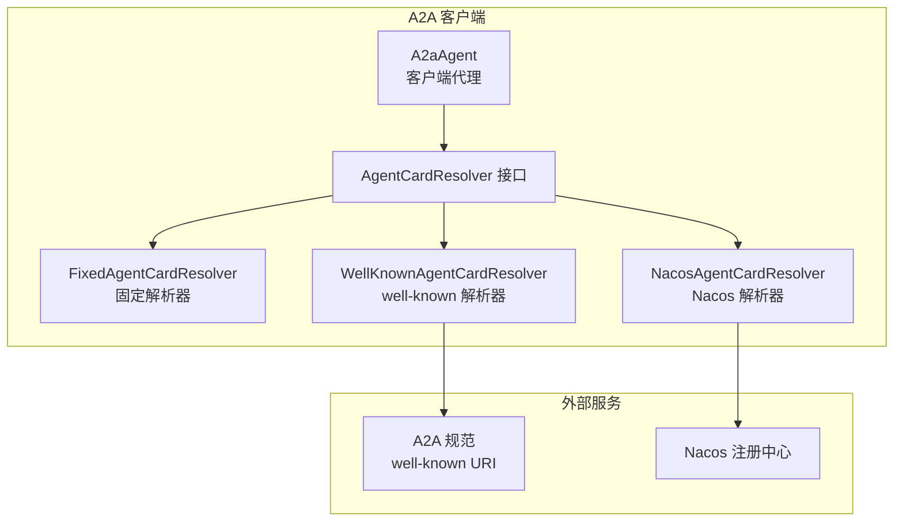
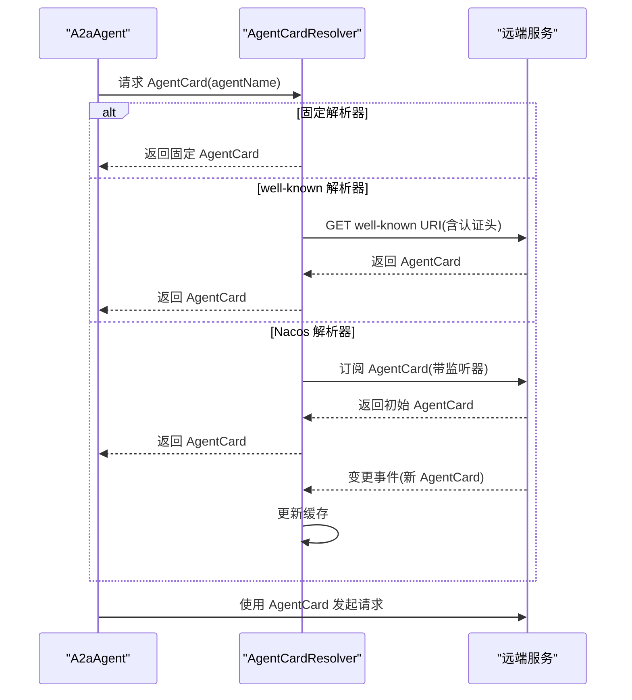
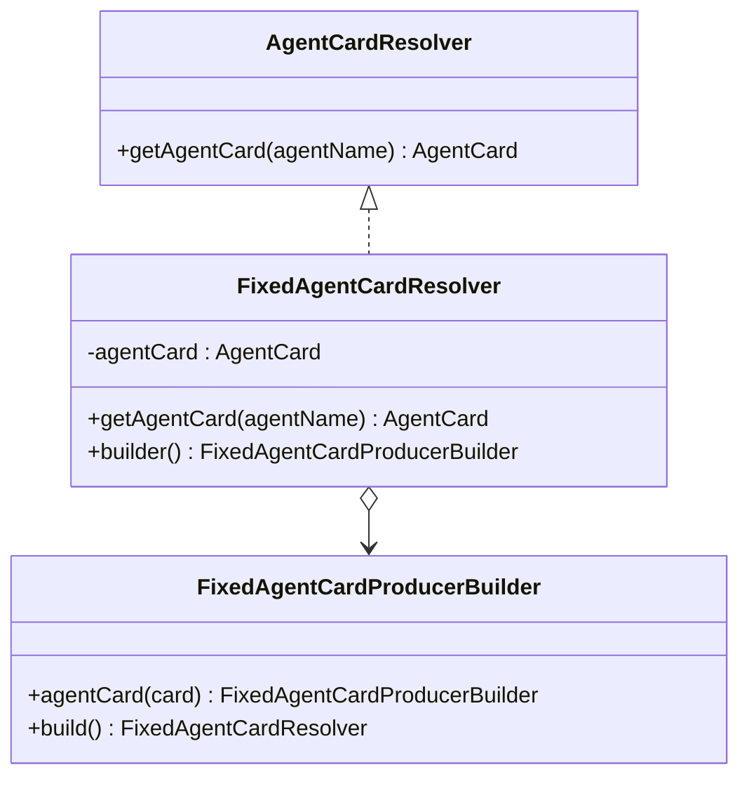
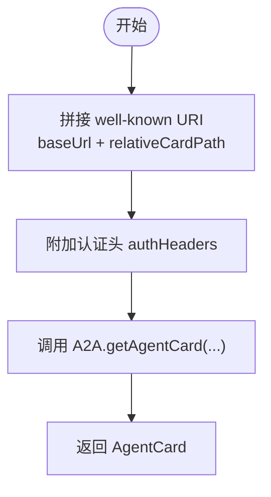
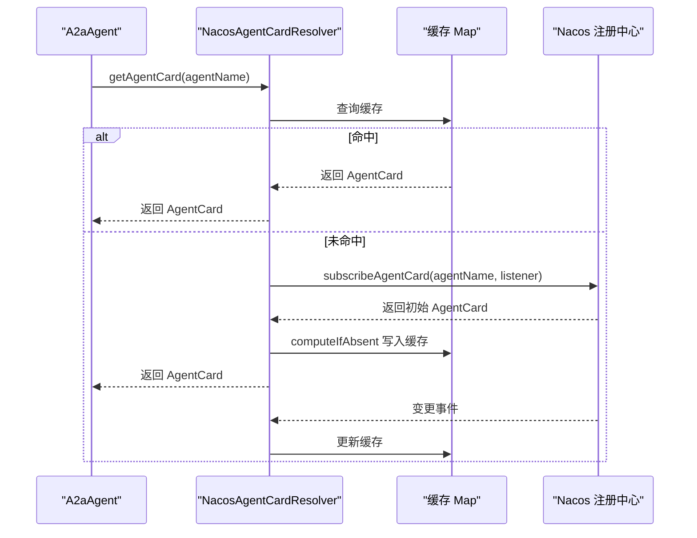
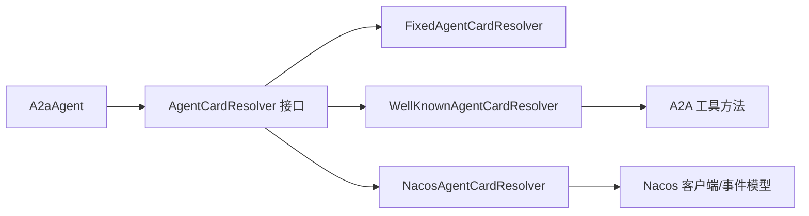

# 智能体卡片解析器

<cite>
**本文引用的文件**
- [AgentCardResolver.java](file://agentscope-extensions/agentscope-extensions-a2a/agentscope-extensions-a2a-client/src/main/java/io/agentscope/core/a2a/agent/card/AgentCardResolver.java)
- [FixedAgentCardResolver.java](file://agentscope-extensions/agentscope-extensions-a2a/agentscope-extensions-a2a-client/src/main/java/io/agentscope/core/a2a/agent/card/FixedAgentCardResolver.java)
- [WellKnownAgentCardResolver.java](file://agentscope-extensions/agentscope-extensions-a2a/agentscope-extensions-a2a-client/src/main/java/io/agentscope/core/a2a/agent/card/WellKnownAgentCardResolver.java)
- [NacosAgentCardResolver.java](file://agentscope-extensions/agentscope-extensions-nacos/agentscope-extensions-nacos-a2a/src/main/java/io/agentscope/core/nacos/a2a/discovery/NacosAgentCardResolver.java)
- [A2aAgent.java](file://agentscope-extensions/agentscope-extensions-a2a/agentscope-extensions-a2a-client/src/main/java/io/agentscope/core/a2a/agent/A2aAgent.java)
- [a2a.md（英文）](file://docs/en/task/a2a.md)
- [a2a.md（中文）](file://docs/zh/task/a2a.md)
</cite>

## 目录
1. [简介](#简介)
2. [项目结构](#项目结构)
3. [核心组件](#核心组件)
4. [架构总览](#架构总览)
5. [详细组件分析](#详细组件分析)
6. [依赖关系分析](#依赖关系分析)
7. [性能考量](#性能考量)
8. [故障排查指南](#故障排查指南)
9. [结论](#结论)
10. [附录](#附录)

## 简介
本文件面向“智能体卡片解析器”的技术文档，聚焦于 AgentCardResolver 接口的设计理念与实现策略，系统阐述固定解析器（FixedAgentCardResolver）、基于 well-known URI 的解析器（WellKnownAgentCardResolver），以及基于 Nacos 注册中心的动态解析器（NacosAgentCardResolver）。文档同时覆盖智能体卡片的结构定义（名称、描述、端点信息、认证配置）、解析缓存与更新机制、典型场景下的配置示例（本地配置、远程获取、动态更新），以及验证、错误处理与故障转移的最佳实践。

## 项目结构
围绕 A2A（Agent2Agent）协议，智能体卡片解析器位于扩展模块中，分别提供三种解析策略：
- 固定解析器：直接返回预置的 AgentCard，适合本地或测试场景
- well-known 解析器：通过标准 well-known URI 远程拉取 AgentCard，适合标准化的服务发现
- Nacos 解析器：从 Nacos 注册中心订阅 AgentCard，具备缓存与事件驱动的动态更新能力

图表来源
- [A2aAgent.java:97-112](file://agentscope-extensions/agentscope-extensions-a2a/agentscope-extensions-a2a-client/src/main/java/io/agentscope/core/a2a/agent/A2aAgent.java#L97-L112)
- [AgentCardResolver.java:24-33](file://agentscope-extensions/agentscope-extensions-a2a/agentscope-extensions-a2a-client/src/main/java/io/agentscope/core/a2a/agent/card/AgentCardResolver.java#L24-L33)
- [FixedAgentCardResolver.java:24-54](file://agentscope-extensions/agentscope-extensions-a2a/agentscope-extensions-a2a-client/src/main/java/io/agentscope/core/a2a/agent/card/FixedAgentCardResolver.java#L24-L54)
- [WellKnownAgentCardResolver.java:37-121](file://agentscope-extensions/agentscope-extensions-a2a/agentscope-extensions-a2a-client/src/main/java/io/agentscope/core/a2a/agent/card/WellKnownAgentCardResolver.java#L37-L121)
- [NacosAgentCardResolver.java:59-122](file://agentscope-extensions/agentscope-extensions-nacos/agentscope-extensions-nacos-a2a/src/main/java/io/agentscope/core/nacos/a2a/discovery/NacosAgentCardResolver.java#L59-L122)

章节来源
- [A2aAgent.java:97-112](file://agentscope-extensions/agentscope-extensions-a2a/agentscope-extensions-a2a-client/src/main/java/io/agentscope/core/a2a/agent/A2aAgent.java#L97-L112)
- [a2a.md（英文）:1-61](file://docs/en/task/a2a.md#L1-L61)
- [a2a.md（中文）:1-61](file://docs/zh/task/a2a.md#L1-L61)

## 核心组件
- AgentCardResolver 接口：定义统一的卡片解析契约，输入目标智能体名称，输出 AgentCard
- FixedAgentCardResolver：返回固定 AgentCard，适用于本地直连或测试
- WellKnownAgentCardResolver：拼装 well-known URI 并通过 A2A 工具获取 AgentCard，支持认证头
- NacosAgentCardResolver：从 Nacos 订阅 AgentCard，内置并发安全的缓存与事件驱动更新

章节来源
- [AgentCardResolver.java:24-33](file://agentscope-extensions/agentscope-extensions-a2a/agentscope-extensions-a2a-client/src/main/java/io/agentscope/core/a2a/agent/card/AgentCardResolver.java#L24-L33)
- [FixedAgentCardResolver.java:24-54](file://agentscope-extensions/agentscope-extensions-a2a/agentscope-extensions-a2a-client/src/main/java/io/agentscope/core/a2a/agent/card/FixedAgentCardResolver.java#L24-L54)
- [WellKnownAgentCardResolver.java:37-121](file://agentscope-extensions/agentscope-extensions-a2a/agentscope-extensions-a2a-client/src/main/java/io/agentscope/core/a2a/agent/card/WellKnownAgentCardResolver.java#L37-L121)
- [NacosAgentCardResolver.java:59-122](file://agentscope-extensions/agentscope-extensions-nacos/agentscope-extensions-nacos-a2a/src/main/java/io/agentscope/core/nacos/a2a/discovery/NacosAgentCardResolver.java#L59-L122)

## 架构总览
A2aAgent 在构建时注入 AgentCardResolver；在实际调用前，通过解析器获取 AgentCard，随后根据卡片中的端点与认证信息进行远程通信。

图表来源
- [A2aAgent.java:97-112](file://agentscope-extensions/agentscope-extensions-a2a/agentscope-extensions-a2a-client/src/main/java/io/agentscope/core/a2a/agent/A2aAgent.java#L97-L112)
- [FixedAgentCardResolver.java:32-35](file://agentscope-extensions/agentscope-extensions-a2a/agentscope-extensions-a2a-client/src/main/java/io/agentscope/core/a2a/agent/card/FixedAgentCardResolver.java#L32-L35)
- [WellKnownAgentCardResolver.java:52-55](file://agentscope-extensions/agentscope-extensions-a2a/agentscope-extensions-a2a-client/src/main/java/io/agentscope/core/a2a/agent/card/WellKnownAgentCardResolver.java#L52-L55)
- [NacosAgentCardResolver.java:90-111](file://agentscope-extensions/agentscope-extensions-nacos/agentscope-extensions-nacos-a2a/src/main/java/io/agentscope/core/nacos/a2a/discovery/NacosAgentCardResolver.java#L90-L111)

## 详细组件分析

### AgentCardResolver 接口设计
- 设计理念：以最小职责定义解析契约，屏蔽具体来源差异，便于替换与扩展
- 输入参数：agentName（目标智能体标识）
- 输出结果：AgentCard（包含名称、描述、端点、认证等元数据）

章节来源
- [AgentCardResolver.java:24-33](file://agentscope-extensions/agentscope-extensions-a2a/agentscope-extensions-a2a-client/src/main/java/io/agentscope/core/a2a/agent/card/AgentCardResolver.java#L24-L33)

### FixedAgentCardResolver（固定解析器）
- 工作原理：构造时注入固定 AgentCard，后续所有请求均返回同一实例
- 适用场景：本地直连、单元测试、快速演示
- 优点：简单、低延迟、无网络依赖
- 注意事项：不支持动态更新，需重启或重建解析器以切换卡片

图表来源
- [AgentCardResolver.java:24-33](file://agentscope-extensions/agentscope-extensions-a2a/agentscope-extensions-a2a-client/src/main/java/io/agentscope/core/a2a/agent/card/AgentCardResolver.java#L24-L33)
- [FixedAgentCardResolver.java:24-54](file://agentscope-extensions/agentscope-extensions-a2a/agentscope-extensions-a2a-client/src/main/java/io/agentscope/core/a2a/agent/card/FixedAgentCardResolver.java#L24-L54)

章节来源
- [FixedAgentCardResolver.java:24-54](file://agentscope-extensions/agentscope-extensions-a2a/agentscope-extensions-a2a-client/src/main/java/io/agentscope/core/a2a/agent/card/FixedAgentCardResolver.java#L24-L54)

### WellKnownAgentCardResolver（基于 well-known 的解析器）
- 工作原理：组合 baseUrl 与相对路径形成完整 URI，附加认证头后通过 A2A 工具获取 AgentCard
- 配置要点：
  - baseUrl：服务基础地址（schema://domain:port[/rootPath]）
  - relativeCardPath：默认 “/.well-known/agent-card.json”
  - authHeaders：访问控制头（如 Authorization）
- 适用场景：遵循 A2A 规范的服务发现

图表来源
- [WellKnownAgentCardResolver.java:37-121](file://agentscope-extensions/agentscope-extensions-a2a/agentscope-extensions-a2a-client/src/main/java/io/agentscope/core/a2a/agent/card/WellKnownAgentCardResolver.java#L37-L121)

章节来源
- [WellKnownAgentCardResolver.java:37-121](file://agentscope-extensions/agentscope-extensions-a2a/agentscope-extensions-a2a-client/src/main/java/io/agentscope/core/a2a/agent/card/WellKnownAgentCardResolver.java#L37-L121)
- [a2a.md（英文）:39-61](file://docs/en/task/a2a.md#L39-L61)
- [a2a.md（中文）:39-61](file://docs/zh/task/a2a.md#L39-L61)

### NacosAgentCardResolver（Nacos 动态解析器）
- 工作原理：
  - 首次解析：若缓存未命中，则订阅指定 agentName 的卡片变更事件
  - 缓存策略：ConcurrentHashMap 存储 AgentCard，首次订阅成功后写入缓存
  - 更新机制：事件监听器收到变更后更新缓存，保证后续解析直接命中缓存
- 适用场景：生产环境的动态服务发现与灰度发布

图表来源
- [NacosAgentCardResolver.java:59-122](file://agentscope-extensions/agentscope-extensions-nacos/agentscope-extensions-nacos-a2a/src/main/java/io/agentscope/core/nacos/a2a/discovery/NacosAgentCardResolver.java#L59-L122)

章节来源
- [NacosAgentCardResolver.java:59-122](file://agentscope-extensions/agentscope-extensions-nacos/agentscope-extensions-nacos-a2a/src/main/java/io/agentscope/core/nacos/a2a/discovery/NacosAgentCardResolver.java#L59-L122)

### A2aAgent 与解析器集成
- 构造阶段：A2aAgent 持有 AgentCardResolver 引用，并在初始化时注册生命周期钩子
- 使用阶段：在发起请求前调用解析器获取 AgentCard，再依据卡片信息建立连接

章节来源
- [A2aAgent.java:97-112](file://agentscope-extensions/agentscope-extensions-a2a/agentscope-extensions-a2a-client/src/main/java/io/agentscope/core/a2a/agent/A2aAgent.java#L97-L112)
- [A2aAgent.java:309-322](file://agentscope-extensions/agentscope-extensions-a2a/agentscope-extensions-a2a-client/src/main/java/io/agentscope/core/a2a/agent/A2aAgent.java#L309-L322)

## 依赖关系分析
- 组件内聚性：解析器仅负责卡片解析，职责单一，耦合度低
- 组件耦合度：
  - WellKnownAgentCardResolver 依赖 A2A 工具方法
  - NacosAgentCardResolver 依赖 Nacos 客户端与事件模型
- 循环依赖：未见循环依赖迹象

图表来源
- [A2aAgent.java:97-112](file://agentscope-extensions/agentscope-extensions-a2a/agentscope-extensions-a2a-client/src/main/java/io/agentscope/core/a2a/agent/A2aAgent.java#L97-L112)
- [WellKnownAgentCardResolver.java:37-121](file://agentscope-extensions/agentscope-extensions-a2a/agentscope-extensions-a2a-client/src/main/java/io/agentscope/core/a2a/agent/card/WellKnownAgentCardResolver.java#L37-L121)
- [NacosAgentCardResolver.java:59-122](file://agentscope-extensions/agentscope-extensions-nacos/agentscope-extensions-nacos-a2a/src/main/java/io/agentscope/core/nacos/a2a/discovery/NacosAgentCardResolver.java#L59-L122)

## 性能考量
- 固定解析器：O(1)，无网络开销，适合高频调用
- well-known 解析器：首次访问存在网络延迟，建议配合缓存策略（如在上层复用解析器实例）
- Nacos 解析器：首次订阅有延迟，但后续解析命中缓存；事件驱动更新避免轮询开销
- 建议：
  - 生产环境优先使用 Nacos 解析器，结合缓存与事件更新
  - 对于稳定不变的本地卡片，可采用固定解析器降低复杂度

## 故障排查指南
- well-known 解析失败
  - 检查 baseUrl 与 relativeCardPath 组合是否正确
  - 确认 authHeaders 是否包含有效凭据
  - 参考示例用法：[a2a.md（英文）:39-61](file://docs/en/task/a2a.md#L39-L61)、[a2a.md（中文）:39-61](file://docs/zh/task/a2a.md#L39-L61)
- Nacos 订阅异常
  - 核对 Nacos 服务地址与命名空间配置
  - 关注 NacosException 错误码与错误信息
  - 参考实现：[NacosAgentCardResolver.java:101-111](file://agentscope-extensions/agentscope-extensions-nacos/agentscope-extensions-nacos-a2a/src/main/java/io/agentscope/core/nacos/a2a/discovery/NacosAgentCardResolver.java#L101-L111)
- 缓存未生效
  - 确认是否使用相同 agentName 重复查询
  - 对于 Nacos 解析器，确认事件监听器已触发缓存更新
  - 参考实现：[NacosAgentCardResolver.java:90-121](file://agentscope-extensions/agentscope-extensions-nacos/agentscope-extensions-nacos-a2a/src/main/java/io/agentscope/core/nacos/a2a/discovery/NacosAgentCardResolver.java#L90-L121)

章节来源
- [a2a.md（英文）:39-61](file://docs/en/task/a2a.md#L39-L61)
- [a2a.md（中文）:39-61](file://docs/zh/task/a2a.md#L39-L61)
- [NacosAgentCardResolver.java:101-111](file://agentscope-extensions/agentscope-extensions-nacos/agentscope-extensions-nacos-a2a/src/main/java/io/agentscope/core/nacos/a2a/discovery/NacosAgentCardResolver.java#L101-L111)
- [NacosAgentCardResolver.java:90-121](file://agentscope-extensions/agentscope-extensions-nacos/agentscope-extensions-nacos-a2a/src/main/java/io/agentscope/core/nacos/a2a/discovery/NacosAgentCardResolver.java#L90-L121)

## 结论
智能体卡片解析器通过统一接口抽象了多种来源的卡片获取方式，兼顾灵活性与可维护性。固定解析器适合本地与测试场景，well-known 解析器满足标准化服务发现，Nacos 解析器则提供生产级的动态发现与缓存更新能力。结合合理的缓存策略与错误处理，可在不同场景下获得稳定的性能与可靠性。

## 附录

### 智能体卡片结构定义（概念说明）
- 名称（name）：智能体唯一标识
- 描述（description）：用途与能力说明
- 端点信息（endpoints）：远程调用地址与协议
- 认证配置（auth）：访问令牌、密钥或证书等

说明：以上为概念性结构定义，具体字段以 AgentCard 实际实现为准。

### 典型场景配置示例（路径引用）
- 直接提供 AgentCard
  - 示例路径：[a2a.md（英文）:41-46](file://docs/en/task/a2a.md#L41-L46)、[a2a.md（中文）:41-46](file://docs/zh/task/a2a.md#L41-L46)
- 从 well-known 路径获取
  - 示例路径：[a2a.md（英文）:47-50](file://docs/en/task/a2a.md#L47-L50)、[a2a.md（中文）:47-50](file://docs/zh/task/a2a.md#L47-L50)
- 从 Nacos 发现
  - 示例路径：[a2a.md（英文）:52-55](file://docs/en/task/a2a.md#L52-L55)、[a2a.md（中文）:52-55](file://docs/zh/task/a2a.md#L52-L55)
- 自定义解析器
  - 示例路径：[a2a.md（英文）:57-60](file://docs/en/task/a2a.md#L57-L60)、[a2a.md（中文）:57-60](file://docs/zh/task/a2a.md#L57-L60)

### 最佳实践清单
- 验证
  - 对返回的 AgentCard 进行必填字段校验（名称、端点、认证信息）
  - 对 well-known 返回值进行格式与可达性检查
- 错误处理
  - well-known：捕获网络异常并降级或重试
  - Nacos：捕获 NacosException 并记录错误码与消息
- 故障转移
  - well-known 失败时回退至固定解析器或备用端点
  - Nacos 失败时使用最近一次缓存卡片，同时异步重试订阅