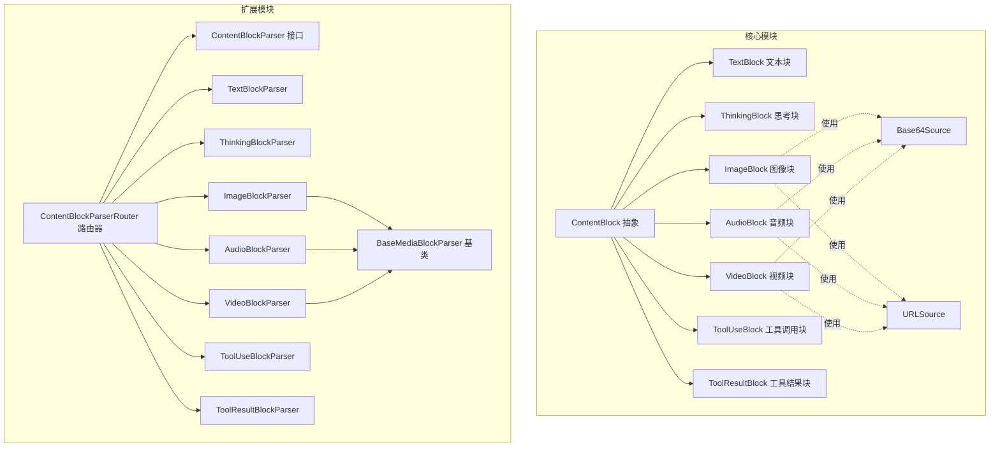
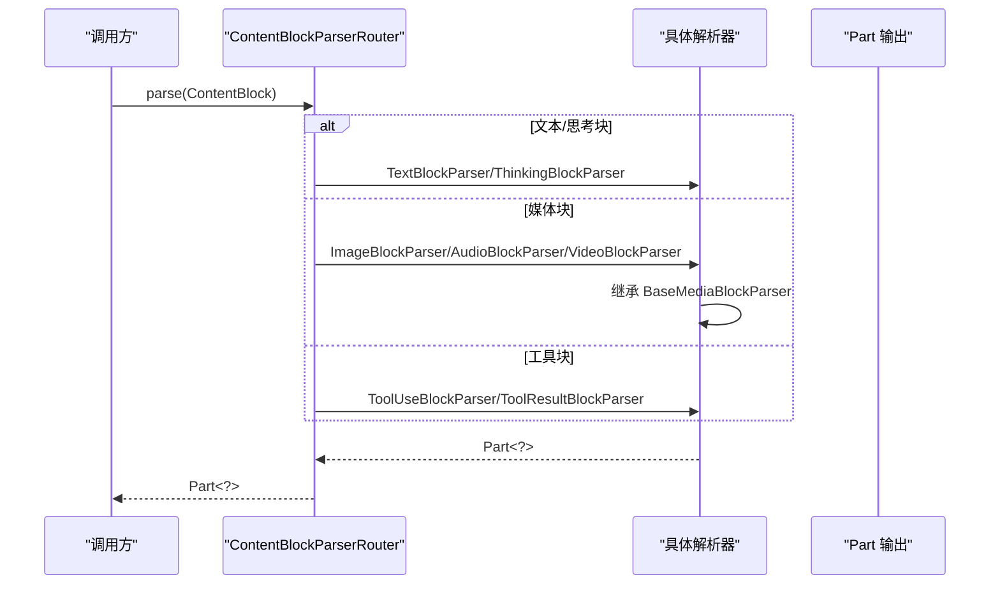
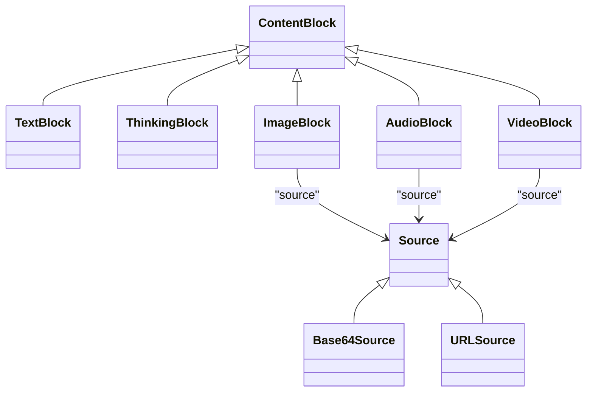
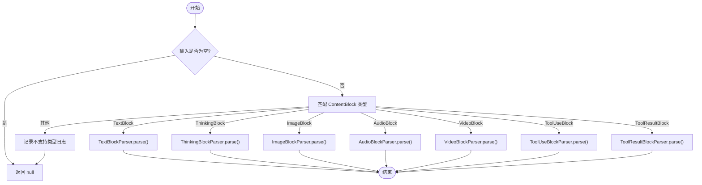
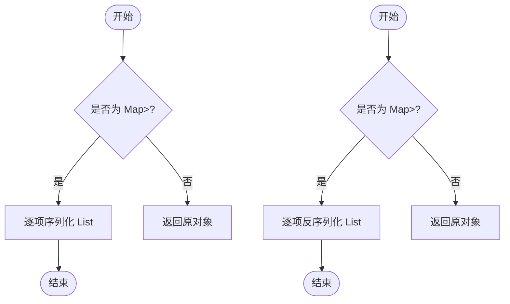
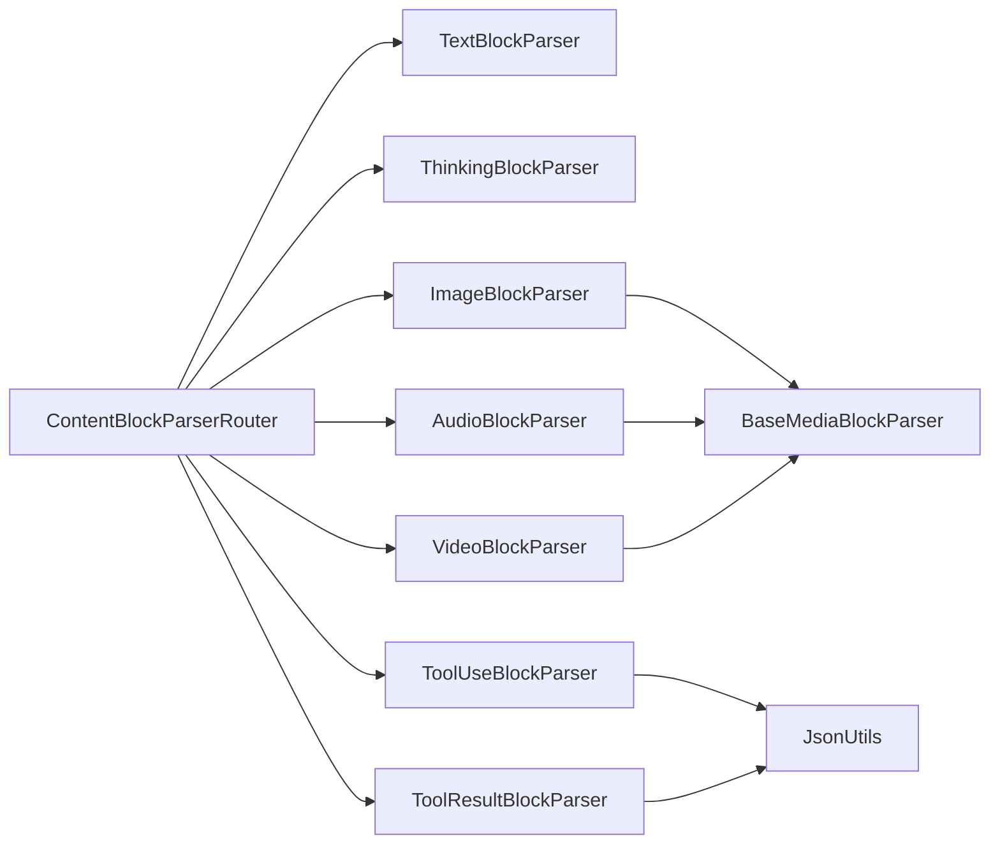

# 消息内容解析器

<cite>
**本文档引用的文件**
- [ContentBlock.java](file://agentscope-core/src/main/java/io/agentscope/core/message/ContentBlock.java)
- [TextBlock.java](file://agentscope-core/src/main/java/io/agentscope/core/message/TextBlock.java)
- [ThinkingBlock.java](file://agentscope-core/src/main/java/io/agentscope/core/message/ThinkingBlock.java)
- [ImageBlock.java](file://agentscope-core/src/main/java/io/agentscope/core/message/ImageBlock.java)
- [AudioBlock.java](file://agentscope-core/src/main/java/io/agentscope/core/message/AudioBlock.java)
- [VideoBlock.java](file://agentscope-core/src/main/java/io/agentscope/core/message/VideoBlock.java)
- [ToolUseBlock.java](file://agentscope-core/src/main/java/io/agentscope/core/message/ToolUseBlock.java)
- [ToolResultBlock.java](file://agentscope-core/src/main/java/io/agentscope/core/message/ToolResultBlock.java)
- [Base64Source.java](file://agentscope-core/src/main/java/io/agentscope/core/message/Base64Source.java)
- [URLSource.java](file://agentscope-core/src/main/java/io/agentscope/core/message/URLSource.java)
- [ContentBlockParser.java](file://agentscope-extensions/agentscope-extensions-a2a/agentscope-extensions-a2a-client/src/main/java/io/agentscope/core/a2a/agent/message/ContentBlockParser.java)
- [ContentBlockParserRouter.java](file://agentscope-extensions/agentscope-extensions-a2a/agentscope-extensions-a2a-client/src/main/java/io/agentscope/core/a2a/agent/message/ContentBlockParserRouter.java)
- [TextBlockParser.java](file://agentscope-extensions/agentscope-extensions-a2a/agentscope-extensions-a2a-client/src/main/java/io/agentscope/core/a2a/agent/message/TextBlockParser.java)
- [ThinkingBlockParser.java](file://agentscope-extensions/agentscope-extensions-a2a/agentscope-extensions-a2a-client/src/main/java/io/agentscope/core/a2a/agent/message/ThinkingBlockParser.java)
- [ImageBlockParser.java](file://agentscope-extensions/agentscope-extensions-a2a/agentscope-extensions-a2a-client/src/main/java/io/agentscope/core/a2a/agent/message/ImageBlockParser.java)
- [AudioBlockParser.java](file://agentscope-extensions/agentscope-extensions-a2a/agentscope-extensions-a2a-client/src/main/java/io/agentscope/core/a2a/agent/message/AudioBlockParser.java)
- [VideoBlockParser.java](file://agentscope-extensions/agentscope-extensions-a2a/agentscope-extensions-a2a-client/src/main/java/io/agentscope/core/a2a/agent/message/VideoBlockParser.java)
- [ToolUseBlockParser.java](file://agentscope-extensions/agentscope-extensions-a2a/agentscope-extensions-a2a-client/src/main/java/io/agentscope/core/a2a/agent/message/ToolUseBlockParser.java)
- [ToolResultBlockParser.java](file://agentscope-extensions/agentscope-extensions-a2a/agentscope-extensions-a2a-client/src/main/java/io/agentscope/core/a2a/agent/message/ToolResultBlockParser.java)
- [BaseMediaBlockParser.java](file://agentscope-extensions/agentscope-extensions-a2a/agentscope-extensions-a2a-client/src/main/java/io/agentscope/core/a2a/agent/message/BaseMediaBlockParser.java)
- [ContentBlockParserRouterTest.java](file://agentscope-extensions/agentscope-extensions-a2a/agentscope-extensions-a2a-client/src/test/java/io/agentscope/core/a2a/agent/message/ContentBlockParserRouterTest.java)
- [DashScopeConversationMerger.java](file://agentscope-core/src/main/java/io/agentscope/core/formatter/dashscope/DashScopeConversationMerger.java)
- [OpenAIMessageConverter.java](file://agentscope-core/src/main/java/io/agentscope/core/formatter/openai/OpenAIMessageConverter.java)
- [MsgTest.java](file://agentscope-core/src/test/java/io/agentscope/core/message/MsgTest.java)
- [JsonUtils.java](file://agentscope-core/src/main/java/io/agentscope/core/util/JsonUtils.java)
- [MsgUtils.java](file://agentscope-extensions/agentscope-extensions-autocontext-memory/src/main/java/io/agentscope/core/memory/autocontext/MsgUtils.java)
</cite>

## 目录
1. [简介](#简介)
2. [项目结构](#项目结构)
3. [核心组件](#核心组件)
4. [架构总览](#架构总览)
5. [详细组件分析](#详细组件分析)
6. [依赖分析](#依赖分析)
7. [性能考虑](#性能考虑)
8. [故障排查指南](#故障排查指南)
9. [结论](#结论)
10. [附录](#附录)

## 简介
本文件面向“消息内容解析器”的技术文档，重点围绕 ContentBlockParser 的解析策略与多模态内容处理机制展开。内容覆盖以下方面：
- ContentBlock 家族（文本、图像、音频、视频、思考、工具调用、工具结果）的解析规则与序列化/反序列化流程
- 多模态消息的组合与拆分策略
- 解析器接口与路由机制（ContentBlockParser、ContentBlockParserRouter）
- 配置选项与自定义扩展方法
- 性能优化、内存管理与错误恢复最佳实践

## 项目结构
消息内容解析器位于扩展模块中，核心内容块类型位于核心模块中，二者通过统一的 ContentBlock 抽象进行解耦。

图表来源
- [ContentBlock.java:44-61](file://agentscope-core/src/main/java/io/agentscope/core/message/ContentBlock.java#L44-L61)
- [ImageBlock.java:36-71](file://agentscope-core/src/main/java/io/agentscope/core/message/ImageBlock.java#L36-L71)
- [AudioBlock.java:35-48](file://agentscope-core/src/main/java/io/agentscope/core/message/AudioBlock.java#L35-L48)
- [VideoBlock.java:36-83](file://agentscope-core/src/main/java/io/agentscope/core/message/VideoBlock.java#L36-L83)
- [ContentBlockParserRouter.java:35-70](file://agentscope-extensions/agentscope-extensions-a2a/agentscope-extensions-a2a-client/src/main/java/io/agentscope/core/a2a/agent/message/ContentBlockParserRouter.java#L35-L70)
- [BaseMediaBlockParser.java](file://agentscope-extensions/agentscope-extensions-a2a/agentscope-extensions-a2a-client/src/main/java/io/agentscope/core/a2a/agent/message/BaseMediaBlockParser.java)

章节来源
- [ContentBlock.java:22-61](file://agentscope-core/src/main/java/io/agentscope/core/message/ContentBlock.java#L22-L61)
- [ContentBlockParserRouter.java:35-70](file://agentscope-extensions/agentscope-extensions-a2a/agentscope-extensions-a2a-client/src/main/java/io/agentscope/core/a2a/agent/message/ContentBlockParserRouter.java#L35-L70)

## 核心组件
- ContentBlock 抽象：基于 Jackson 多态序列化，使用“type”字段区分具体类型，支持 TextBlock、ThinkingBlock、ImageBlock、AudioBlock、VideoBlock、ToolUseBlock、ToolResultBlock。
- ContentBlockParser 接口：定义将 ContentBlock 转换为外部 Part 的统一规范。
- ContentBlockParserRouter：根据 ContentBlock 类型选择对应解析器，实现多态路由。
- BaseMediaBlockParser：媒体类块（图像/音频/视频）的通用基类，负责 Base64/URL 源的解析与封装。

章节来源
- [ContentBlock.java:44-61](file://agentscope-core/src/main/java/io/agentscope/core/message/ContentBlock.java#L44-L61)
- [ContentBlockParser.java:25-34](file://agentscope-extensions/agentscope-extensions-a2a/agentscope-extensions-a2a-client/src/main/java/io/agentscope/core/a2a/agent/message/ContentBlockParser.java#L25-L34)
- [ContentBlockParserRouter.java:35-70](file://agentscope-extensions/agentscope-extensions-a2a/agentscope-extensions-a2a-client/src/main/java/io/agentscope/core/a2a/agent/message/ContentBlockParserRouter.java#L35-L70)
- [BaseMediaBlockParser.java](file://agentscope-extensions/agentscope-extensions-a2a/agentscope-extensions-a2a-client/src/main/java/io/agentscope/core/a2a/agent/message/BaseMediaBlockParser.java)

## 架构总览
ContentBlockParserRouter 作为入口，依据 ContentBlock 的具体类型委派到对应的解析器；媒体类块共享 BaseMediaBlockParser 的通用逻辑，确保一致的 Base64/URL 源处理与 Part 封装。

图表来源
- [ContentBlockParserRouter.java:45-69](file://agentscope-extensions/agentscope-extensions-a2a/agentscope-extensions-a2a-client/src/main/java/io/agentscope/core/a2a/agent/message/ContentBlockParserRouter.java#L45-L69)
- [TextBlockParser.java](file://agentscope-extensions/agentscope-extensions-a2a/agentscope-extensions-a2a-client/src/main/java/io/agentscope/core/a2a/agent/message/TextBlockParser.java)
- [ThinkingBlockParser.java](file://agentscope-extensions/agentscope-extensions-a2a/agentscope-extensions-a2a-client/src/main/java/io/agentscope/core/a2a/agent/message/ThinkingBlockParser.java)
- [ImageBlockParser.java](file://agentscope-extensions/agentscope-extensions-a2a/agentscope-extensions-a2a-client/src/main/java/io/agentscope/core/a2a/agent/message/ImageBlockParser.java)
- [AudioBlockParser.java](file://agentscope-extensions/agentscope-extensions-a2a/agentscope-extensions-a2a-client/src/main/java/io/agentscope/core/a2a/agent/message/AudioBlockParser.java)
- [VideoBlockParser.java](file://agentscope-extensions/agentscope-extensions-a2a/agentscope-extensions-a2a-client/src/main/java/io/agentscope/core/a2a/agent/message/VideoBlockParser.java)
- [ToolUseBlockParser.java](file://agentscope-extensions/agentscope-extensions-a2a/agentscope-extensions-a2a-client/src/main/java/io/agentscope/core/a2a/agent/message/ToolUseBlockParser.java)
- [ToolResultBlockParser.java](file://agentscope-extensions/agentscope-extensions-a2a/agentscope-extensions-a2a-client/src/main/java/io/agentscope/core/a2a/agent/message/ToolResultBlockParser.java)

## 详细组件分析

### ContentBlock 抽象与多态序列化
- 使用 Jackson 注解在序列化时写入“type”字段，在反序列化时按类型自动还原。
- 支持的子类型：TextBlock、ThinkingBlock、ImageBlock、AudioBlock、VideoBlock、ToolUseBlock、ToolResultBlock。
- 该抽象保证了跨模块的统一序列化/反序列化契约，便于不同格式转换器（如 OpenAI、DashScope）对接。

章节来源
- [ContentBlock.java:44-61](file://agentscope-core/src/main/java/io/agentscope/core/message/ContentBlock.java#L44-L61)

### 文本块 TextBlock
- 最基础的内容块，仅包含文本内容。
- 提供 builder 模式与 JSON 反序列化构造器，空值安全处理。
- 在多模态消息中通常作为纯文本片段存在。

章节来源
- [TextBlock.java:31-96](file://agentscope-core/src/main/java/io/agentscope/core/message/TextBlock.java#L31-L96)

### 思考块 ThinkingBlock
- 用于承载代理推理/思考内容，可选 metadata 存储额外推理信息。
- 典型用于 ReAct 等需要可解释性的场景。

章节来源
- [ThinkingBlock.java:37-134](file://agentscope-core/src/main/java/io/agentscope/core/message/ThinkingBlock.java#L37-L134)

### 媒体块（图像/音频/视频）与源类型
- ImageBlock/AudioBlock/VideoBlock 均继承自 ContentBlock，并通过 Source 表达两种来源：
  - Base64Source：包含 mediaType 与 data 字段，适合内联嵌入。
  - URLSource：包含 url 字段，适合远程或本地文件引用。
- VideoBlock 还支持帧率、最大帧数、像素阈值等参数，便于控制视频采样与体积。

图表来源
- [ContentBlock.java:54-61](file://agentscope-core/src/main/java/io/agentscope/core/message/ContentBlock.java#L54-L61)
- [ImageBlock.java:36-71](file://agentscope-core/src/main/java/io/agentscope/core/message/ImageBlock.java#L36-L71)
- [AudioBlock.java:35-48](file://agentscope-core/src/main/java/io/agentscope/core/message/AudioBlock.java#L35-L48)
- [VideoBlock.java:36-83](file://agentscope-core/src/main/java/io/agentscope/core/message/VideoBlock.java#L36-L83)
- [Base64Source.java:39-76](file://agentscope-core/src/main/java/io/agentscope/core/message/Base64Source.java#L39-L76)
- [URLSource.java:39-61](file://agentscope-core/src/main/java/io/agentscope/core/message/URLSource.java#L39-L61)

章节来源
- [ImageBlock.java:36-164](file://agentscope-core/src/main/java/io/agentscope/core/message/ImageBlock.java#L36-L164)
- [AudioBlock.java:35-97](file://agentscope-core/src/main/java/io/agentscope/core/message/AudioBlock.java#L35-L97)
- [VideoBlock.java:36-240](file://agentscope-core/src/main/java/io/agentscope/core/message/VideoBlock.java#L36-L240)
- [Base64Source.java:39-129](file://agentscope-core/src/main/java/io/agentscope/core/message/Base64Source.java#L39-L129)
- [URLSource.java:39-101](file://agentscope-core/src/main/java/io/agentscope/core/message/URLSource.java#L39-L101)

### 工具块（调用/结果）
- ToolUseBlock：描述一次工具调用请求，包含 id、name、input、可选 content（流式）、metadata。
- ToolResultBlock：描述一次工具执行结果，包含 id、name、output（ContentBlock 列表）、metadata；支持 suspended 状态标记。
- 两者均可作为消息中的 ContentBlock 使用，实现“请求-响应”的闭环。

章节来源
- [ToolUseBlock.java:34-234](file://agentscope-core/src/main/java/io/agentscope/core/message/ToolUseBlock.java#L34-L234)
- [ToolResultBlock.java:35-375](file://agentscope-core/src/main/java/io/agentscope/core/message/ToolResultBlock.java#L35-L375)

### 解析器接口与路由
- ContentBlockParser：定义 parse(T) 方法，将 ContentBlock 转为 Part。
- ContentBlockParserRouter：根据类型分发到 TextBlockParser、ThinkingBlockParser、ImageBlockParser、AudioBlockParser、VideoBlockParser、ToolUseBlockParser、ToolResultBlockParser。
- 不支持的类型会记录警告并返回 null，避免异常传播。

图表来源
- [ContentBlockParserRouter.java:45-69](file://agentscope-extensions/agentscope-extensions-a2a/agentscope-extensions-a2a-client/src/main/java/io/agentscope/core/a2a/agent/message/ContentBlockParserRouter.java#L45-L69)

章节来源
- [ContentBlockParser.java:25-34](file://agentscope-extensions/agentscope-extensions-a2a/agentscope-extensions-a2a-client/src/main/java/io/agentscope/core/a2a/agent/message/ContentBlockParser.java#L25-L34)
- [ContentBlockParserRouter.java:35-70](file://agentscope-extensions/agentscope-extensions-a2a/agentscope-extensions-a2a-client/src/main/java/io/agentscope/core/a2a/agent/message/ContentBlockParserRouter.java#L35-L70)

### 媒体块解析基类与通用策略
- BaseMediaBlockParser：统一处理 Base64Source 与 URLSource，生成 FilePart 或 DataPart，确保二进制数据正确封装。
- ImageBlockParser/AudioBlockParser/VideoBlockParser 继承该基类，复用源解析与 Part 封装逻辑。

章节来源
- [BaseMediaBlockParser.java](file://agentscope-extensions/agentscope-extensions-a2a/agentscope-extensions-a2a-client/src/main/java/io/agentscope/core/a2a/agent/message/BaseMediaBlockParser.java)

### 序列化与反序列化流程
- ContentBlock 多态序列化：通过 Jackson 注解在 JSON 中写入“type”，反序列化时按类型还原。
- 工具调用参数校验：JsonUtils.resolveToolCallArgsJson 优先使用 content（若为有效 JSON 对象），否则序列化 input，最后回退为空对象，确保参数合法性。
- 消息列表/映射的序列化：MsgUtils 提供对 List<Msg> 与 Map<String, List<Msg>> 的序列化/反序列化，便于状态持久化与恢复。

图表来源
- [MsgUtils.java:77-91](file://agentscope-extensions/agentscope-extensions-autocontext-memory/src/main/java/io/agentscope/core/memory/autocontext/MsgUtils.java#L77-L91)
- [MsgUtils.java:190-203](file://agentscope-extensions/agentscope-extensions-autocontext-memory/src/main/java/io/agentscope/core/memory/autocontext/MsgUtils.java#L190-L203)

章节来源
- [ContentBlock.java:44-61](file://agentscope-core/src/main/java/io/agentscope/core/message/ContentBlock.java#L44-L61)
- [JsonUtils.java:133-151](file://agentscope-core/src/main/java/io/agentscope/core/util/JsonUtils.java#L133-L151)
- [MsgUtils.java:64-203](file://agentscope-extensions/agentscope-extensions-autocontext-memory/src/main/java/io/agentscope/core/memory/autocontext/MsgUtils.java#L64-L203)

### 多模态消息的组合与拆分策略
- 组合：将多个 ContentBlock（文本、图像、音频、视频、工具调用/结果）按顺序组织为消息内容，形成混合模态对话。
- 拆分：在不同格式转换器之间传递时，ContentBlockParserRouter 依据类型拆分为对应的 Part，媒体块通过 BaseMediaBlockParser 进行源解析与封装。
- 示例参考：DashScopeConversationMerger 在合并对话时保留图像占位符并在文本中记录名称，同时尝试将 ImageBlock 转换为内容部件以保留多模态能力。

章节来源
- [DashScopeConversationMerger.java:92-107](file://agentscope-core/src/main/java/io/agentscope/core/formatter/dashscope/DashScopeConversationMerger.java#L92-L107)
- [OpenAIMessageConverter.java:119-141](file://agentscope-core/src/main/java/io/agentscope/core/formatter/openai/OpenAIMessageConverter.java#L119-L141)

### 配置选项与自定义扩展
- 自定义 JSON 编解码器：通过 JsonUtils.setJsonCodec 替换默认 Jackson 实现，满足不同性能/兼容性需求。
- 扩展解析器：实现 ContentBlockParser 接口并注册到路由中，即可支持新的内容类型或输出格式。
- 工具调用参数解析：JsonUtils.resolveToolCallArgsJson 提供参数合法性保障，避免因流式中断导致的非法 JSON。

章节来源
- [JsonUtils.java:77-91](file://agentscope-core/src/main/java/io/agentscope/core/util/JsonUtils.java#L77-L91)
- [JsonUtils.java:133-151](file://agentscope-core/src/main/java/io/agentscope/core/util/JsonUtils.java#L133-L151)
- [ContentBlockParser.java:25-34](file://agentscope-extensions/agentscope-extensions-a2a/agentscope-extensions-a2a-client/src/main/java/io/agentscope/core/a2a/agent/message/ContentBlockParser.java#L25-L34)

## 依赖分析
- ContentBlockParserRouter 与各解析器之间为单向依赖，耦合度低，便于扩展新类型。
- 媒体块依赖 Source（Base64Source/URLSource），统一了二进制数据来源的处理方式。
- 工具块依赖 JsonUtils 的参数解析能力，确保参数合法。

图表来源
- [ContentBlockParserRouter.java:45-69](file://agentscope-extensions/agentscope-extensions-a2a/agentscope-extensions-a2a-client/src/main/java/io/agentscope/core/a2a/agent/message/ContentBlockParserRouter.java#L45-L69)
- [ImageBlockParser.java](file://agentscope-extensions/agentscope-extensions-a2a/agentscope-extensions-a2a-client/src/main/java/io/agentscope/core/a2a/agent/message/ImageBlockParser.java)
- [AudioBlockParser.java](file://agentscope-extensions/agentscope-extensions-a2a/agentscope-extensions-a2a-client/src/main/java/io/agentscope/core/a2a/agent/message/AudioBlockParser.java)
- [VideoBlockParser.java](file://agentscope-extensions/agentscope-extensions-a2a/agentscope-extensions-a2a-client/src/main/java/io/agentscope/core/a2a/agent/message/VideoBlockParser.java)
- [ToolUseBlockParser.java](file://agentscope-extensions/agentscope-extensions-a2a/agentscope-extensions-a2a-client/src/main/java/io/agentscope/core/a2a/agent/message/ToolUseBlockParser.java)
- [ToolResultBlockParser.java](file://agentscope-extensions/agentscope-extensions-a2a/agentscope-extensions-a2a-client/src/main/java/io/agentscope/core/a2a/agent/message/ToolResultBlockParser.java)
- [JsonUtils.java:133-151](file://agentscope-core/src/main/java/io/agentscope/core/util/JsonUtils.java#L133-L151)

章节来源
- [ContentBlockParserRouter.java:35-70](file://agentscope-extensions/agentscope-extensions-a2a/agentscope-extensions-a2a-client/src/main/java/io/agentscope/core/a2a/agent/message/ContentBlockParserRouter.java#L35-L70)

## 性能考虑
- 纯文本快速路径：OpenAIMessageConverter 在用户消息且仅含单一 TextBlock 时直接使用文本内容，避免构建复杂内容部件列表。
- 媒体块延迟加载：优先使用 URLSource，减少内存占用；Base64Source 仅在必须内联时使用。
- 参数校验前置：JsonUtils.resolveToolCallArgsJson 优先采用已有的 content（若合法），避免不必要的序列化开销。
- 序列化批处理：MsgUtils 对 Map<String, List<Msg>> 的条目逐一序列化/反序列化，保持顺序与一致性。

章节来源
- [OpenAIMessageConverter.java:131-138](file://agentscope-core/src/main/java/io/agentscope/core/formatter/openai/OpenAIMessageConverter.java#L131-L138)
- [JsonUtils.java:133-151](file://agentscope-core/src/main/java/io/agentscope/core/util/JsonUtils.java#L133-L151)
- [MsgUtils.java:77-91](file://agentscope-extensions/agentscope-extensions-autocontext-memory/src/main/java/io/agentscope/core/memory/autocontext/MsgUtils.java#L77-L91)

## 故障排查指南
- 不支持的 ContentBlock 类型：ContentBlockParserRouter 对未知类型记录警告并返回 null，检查类型注册或扩展是否正确。
- 媒体块解析失败：确认 Source 是否为 Base64Source/URLSource，以及 mediaType/data 或 url 是否有效。
- 工具调用参数非法：JsonUtils.resolveToolCallArgsJson 会在 content 非法时回退到 input 序列化，若仍失败则回退为空对象，检查工具输入结构。
- 多模态合并异常：DashScopeConversationMerger 在处理 ImageBlock 时可能抛出异常，需捕获并记录失败原因，同时保留文本占位符。

章节来源
- [ContentBlockParserRouter.java:64-68](file://agentscope-extensions/agentscope-extensions-a2a/agentscope-extensions-a2a-client/src/main/java/io/agentscope/core/a2a/agent/message/ContentBlockParserRouter.java#L64-L68)
- [DashScopeConversationMerger.java:104-107](file://agentscope-core/src/main/java/io/agentscope/core/formatter/dashscope/DashScopeConversationMerger.java#L104-L107)
- [JsonUtils.java:139-150](file://agentscope-core/src/main/java/io/agentscope/core/util/JsonUtils.java#L139-L150)

## 结论
ContentBlockParser 通过统一的抽象与路由机制，实现了对多模态内容的标准化解析与转换。结合 ContentBlock 的多态序列化、Source 的灵活来源表达以及 JsonUtils 的参数校验，系统在保证扩展性的同时兼顾性能与稳定性。建议在实际应用中：
- 明确媒体块的来源策略（URL 优先）
- 使用 JsonUtils 的参数解析保障工具调用的健壮性
- 通过扩展解析器支持新的内容类型或输出格式

## 附录
- 单元测试覆盖：ContentBlockParserRouterTest 验证了各类 ContentBlock 的解析行为、空输入与不支持类型的处理，可作为集成测试参考。

章节来源
- [ContentBlockParserRouterTest.java:63-171](file://agentscope-extensions/agentscope-extensions-a2a/agentscope-extensions-a2a-client/src/test/java/io/agentscope/core/a2a/agent/message/ContentBlockParserRouterTest.java#L63-L171)