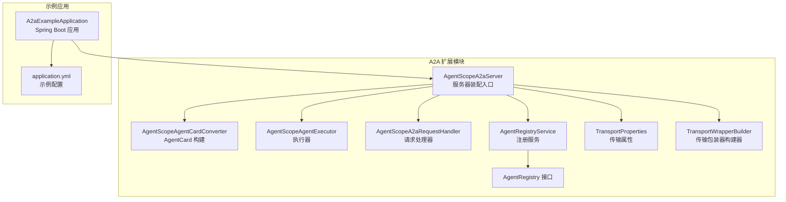
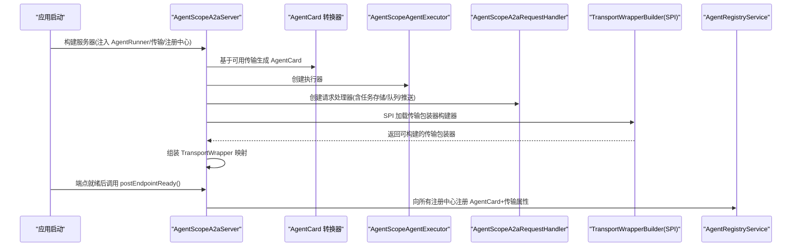
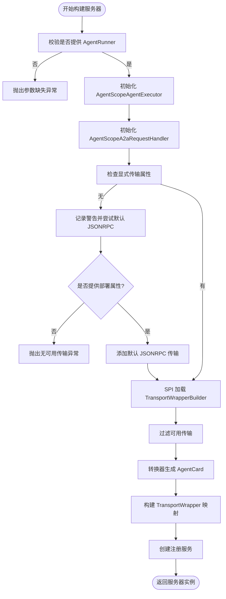
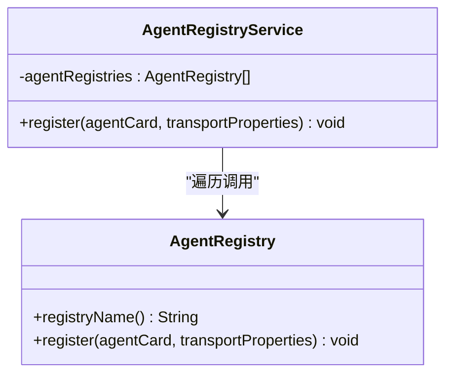
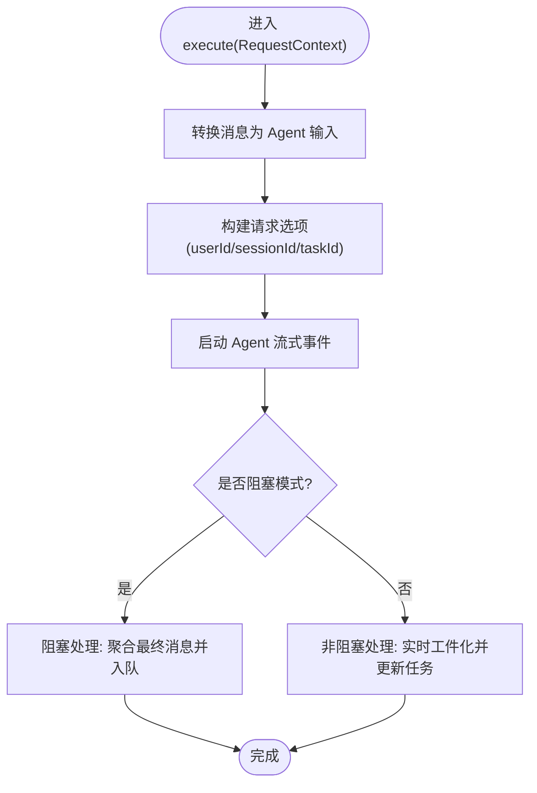
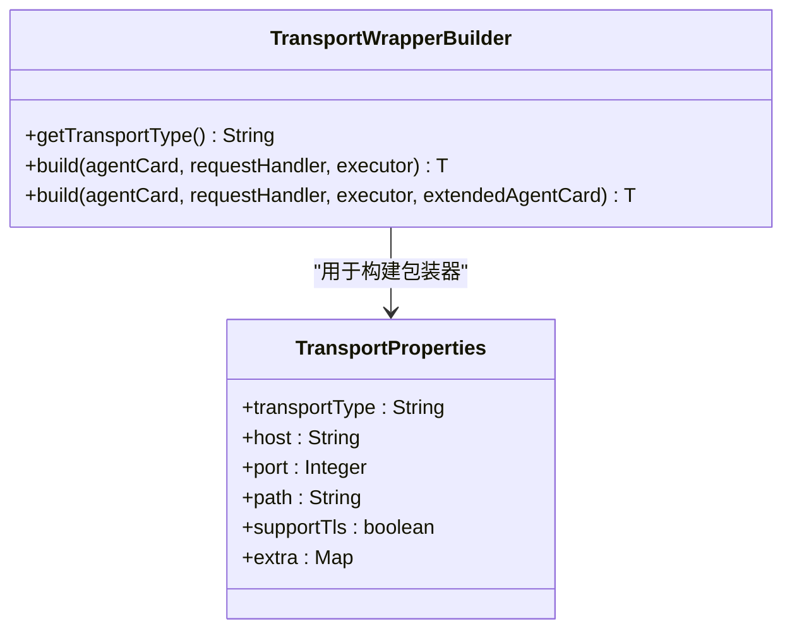
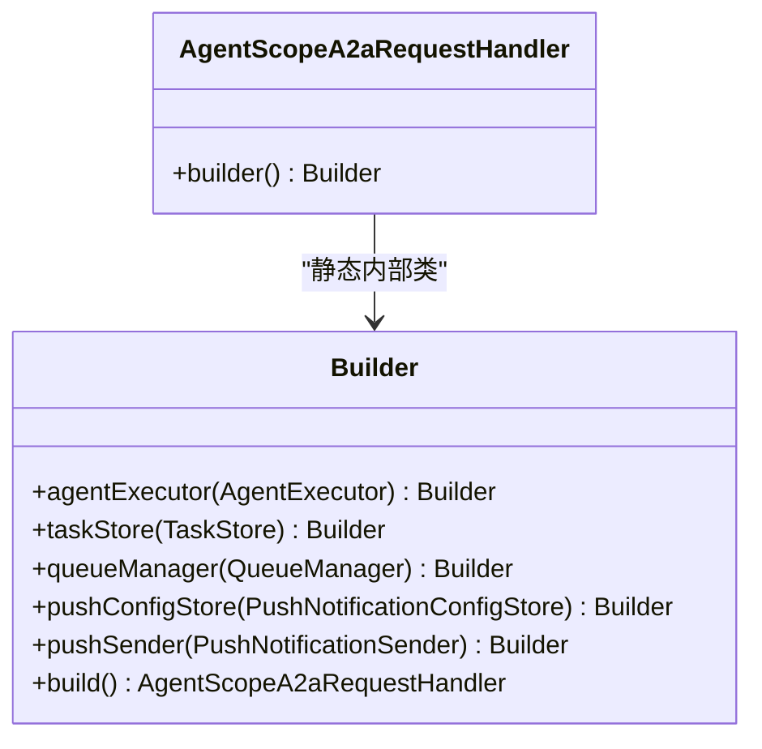
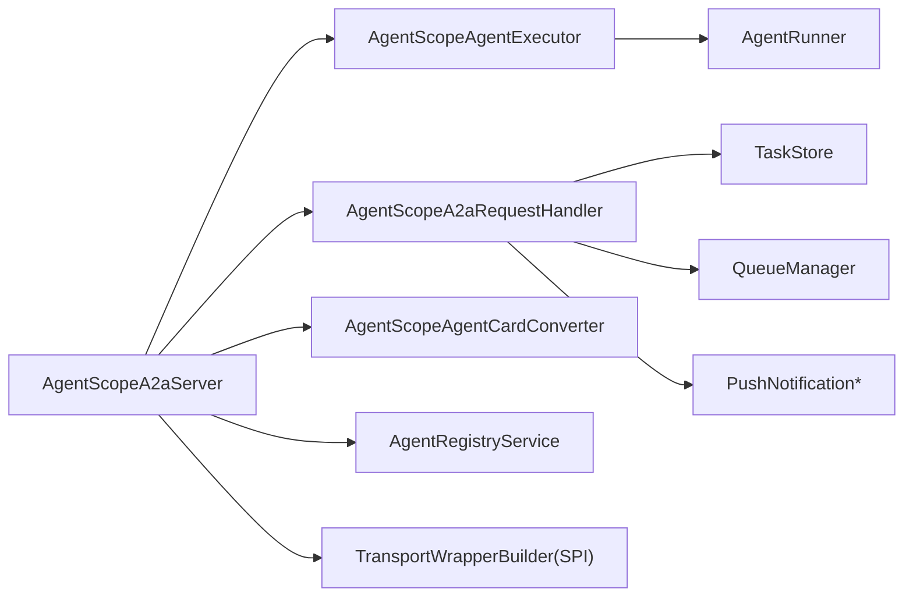

# A2A 服务器端实现

<cite>
**本文引用的文件**
- [AgentScopeA2aServer.java](file://agentscope-extensions/agentscope-extensions-a2a/agentscope-extensions-a2a-server/src/main/java/io/agentscope/core/a2a/server/AgentScopeA2aServer.java)
- [TransportWrapperBuilder.java](file://agentscope-extensions/agentscope-extensions-a2a/agentscope-extensions-a2a-server/src/main/java/io/agentscope/core/a2a/server/transport/TransportWrapperBuilder.java)
- [TransportProperties.java](file://agentscope-extensions/agentscope-extensions-a2a/agentscope-extensions-a2a-server/src/main/java/io/agentscope/core/a2a/server/transport/TransportProperties.java)
- [AgentScopeAgentExecutor.java](file://agentscope-extensions/agentscope-extensions-a2a/agentscope-extensions-a2a-server/src/main/java/io/agentscope/core/a2a/server/executor/AgentScopeAgentExecutor.java)
- [AgentScopeA2aRequestHandler.java](file://agentscope-extensions/agentscope-extensions-a2a/agentscope-extensions-a2a-server/src/main/java/io/agentscope/core/a2a/server/request/AgentScopeA2aRequestHandler.java)
- [AgentScopeAgentCardConverter.java](file://agentscope-extensions/agentscope-extensions-a2a/agentscope-extensions-a2a-server/src/main/java/io/agentscope/core/a2a/server/card/AgentScopeAgentCardConverter.java)
- [AgentRegistry.java](file://agentscope-extensions/agentscope-extensions-a2a/agentscope-extensions-a2a-server/src/main/java/io/agentscope/core/a2a/server/registry/AgentRegistry.java)
- [AgentRegistryService.java](file://agentscope-extensions/agentscope-extensions-a2a/agentscope-extensions-a2a-server/src/main/java/io/agentscope/core/a2a/server/registry/AgentRegistryService.java)
- [A2aExampleApplication.java](file://agentscope-examples/a2a/src/main/java/io/agentscope/examples/a2a/A2aExampleApplication.java)
- [application.yml](file://agentscope-examples/a2a/src/main/resources/application.yml)
</cite>

## 目录
1. [简介](#简介)
2. [项目结构](#项目结构)
3. [核心组件](#核心组件)
4. [架构总览](#架构总览)
5. [组件详解](#组件详解)
6. [依赖关系分析](#依赖关系分析)
7. [性能与并发特性](#性能与并发特性)
8. [部署与配置指南](#部署与配置指南)
9. [安全与访问控制](#安全与访问控制)
10. [监控、日志与调试](#监控日志与调试)
11. [故障排查](#故障排查)
12. [结论](#结论)

## 简介
本文件面向 A2A（Agent-to-Agent）服务器端实现，系统性梳理 AgentScopeA2aServer 的核心架构与启动流程，深入解析智能体注册表的管理机制（发现、状态跟踪与生命周期）、智能体执行器的任务调度与并发控制策略、传输包装器构建器的实现原理与多协议支持，并提供完整的服务器配置示例、部署指南、集群与高可用建议、安全认证与访问控制、以及性能监控与调试方法。

## 项目结构
A2A 服务器端实现位于扩展模块中，核心类集中在 server 包下，配合示例应用与配置文件展示如何快速搭建与运行。

图表来源
- [AgentScopeA2aServer.java:83-486](file://agentscope-extensions/agentscope-extensions-a2a/agentscope-extensions-a2a-server/src/main/java/io/agentscope/core/a2a/server/AgentScopeA2aServer.java#L83-L486)
- [AgentScopeAgentCardConverter.java:57-185](file://agentscope-extensions/agentscope-extensions-a2a/agentscope-extensions-a2a-server/src/main/java/io/agentscope/core/a2a/server/card/AgentScopeAgentCardConverter.java#L57-L185)
- [AgentScopeAgentExecutor.java:60-455](file://agentscope-extensions/agentscope-extensions-a2a/agentscope-extensions-a2a-server/src/main/java/io/agentscope/core/a2a/server/executor/AgentScopeAgentExecutor.java#L60-L455)
- [AgentScopeA2aRequestHandler.java:39-178](file://agentscope-extensions/agentscope-extensions-a2a/agentscope-extensions-a2a-server/src/main/java/io/agentscope/core/a2a/server/request/AgentScopeA2aRequestHandler.java#L39-L178)
- [AgentRegistry.java:26-43](file://agentscope-extensions/agentscope-extensions-a2a/agentscope-extensions-a2a-server/src/main/java/io/agentscope/core/a2a/server/registry/AgentRegistry.java#L26-L43)
- [AgentRegistryService.java:31-80](file://agentscope-extensions/agentscope-extensions-a2a/agentscope-extensions-a2a-server/src/main/java/io/agentscope/core/a2a/server/registry/AgentRegistryService.java#L31-L80)
- [TransportProperties.java:27-93](file://agentscope-extensions/agentscope-extensions-a2a/agentscope-extensions-a2a-server/src/main/java/io/agentscope/core/a2a/server/transport/TransportProperties.java#L27-L93)
- [TransportWrapperBuilder.java:28-64](file://agentscope-extensions/agentscope-extensions-a2a/agentscope-extensions-a2a-server/src/main/java/io/agentscope/core/a2a/server/transport/TransportWrapperBuilder.java#L28-L64)
- [A2aExampleApplication.java:76-93](file://agentscope-examples/a2a/src/main/java/io/agentscope/examples/a2a/A2aExampleApplication.java#L76-L93)
- [application.yml:15-65](file://agentscope-examples/a2a/src/main/resources/application.yml#L15-L65)

章节来源
- [AgentScopeA2aServer.java:54-81](file://agentscope-extensions/agentscope-extensions-a2a/agentscope-extensions-a2a-server/src/main/java/io/agentscope/core/a2a/server/AgentScopeA2aServer.java#L54-L81)
- [A2aExampleApplication.java:25-75](file://agentscope-examples/a2a/src/main/java/io/agentscope/examples/a2a/A2aExampleApplication.java#L25-L75)
- [application.yml:15-65](file://agentscope-examples/a2a/src/main/resources/application.yml#L15-L65)

## 核心组件
- 服务器装配入口：负责组装 AgentCard、执行器、请求处理器、传输包装器、注册服务等。
- 执行器：统一处理阻塞与非阻塞任务流，管理订阅与取消。
- 请求处理器：封装默认请求处理器，提供任务存储、队列管理、推送通知等能力。
- 注册服务：在端点就绪后自动向多个注册中心进行注册。
- 传输包装器构建器：通过 SPI 发现并构建不同传输协议的包装器。
- 传输属性：描述传输类型、主机、端口、路径、TLS 支持等。
- AgentCard 转换器：根据运行时传输集合生成标准 AgentCard。

章节来源
- [AgentScopeA2aServer.java:83-486](file://agentscope-extensions/agentscope-extensions-a2a/agentscope-extensions-a2a-server/src/main/java/io/agentscope/core/a2a/server/AgentScopeA2aServer.java#L83-L486)
- [AgentScopeAgentExecutor.java:60-455](file://agentscope-extensions/agentscope-extensions-a2a/agentscope-extensions-a2a-server/src/main/java/io/agentscope/core/a2a/server/executor/AgentScopeAgentExecutor.java#L60-L455)
- [AgentScopeA2aRequestHandler.java:39-178](file://agentscope-extensions/agentscope-extensions-a2a/agentscope-extensions-a2a-server/src/main/java/io/agentscope/core/a2a/server/request/AgentScopeA2aRequestHandler.java#L39-L178)
- [AgentRegistryService.java:31-80](file://agentscope-extensions/agentscope-extensions-a2a/agentscope-extensions-a2a-server/src/main/java/io/agentscope/core/a2a/server/registry/AgentRegistryService.java#L31-L80)
- [TransportWrapperBuilder.java:28-64](file://agentscope-extensions/agentscope-extensions-a2a/agentscope-extensions-a2a-server/src/main/java/io/agentscope/core/a2a/server/transport/TransportWrapperBuilder.java#L28-L64)
- [TransportProperties.java:27-93](file://agentscope-extensions/agentscope-extensions-a2a/agentscope-extensions-a2a-server/src/main/java/io/agentscope/core/a2a/server/transport/TransportProperties.java#L27-L93)
- [AgentScopeAgentCardConverter.java:57-185](file://agentscope-extensions/agentscope-extensions-a2a/agentscope-extensions-a2a-server/src/main/java/io/agentscope/core/a2a/server/card/AgentScopeAgentCardConverter.java#L57-L185)

## 架构总览
下图展示了从应用启动到请求处理的关键交互路径，以及注册与传输包装器的装配过程。

图表来源
- [AgentScopeA2aServer.java:363-418](file://agentscope-extensions/agentscope-extensions-a2a/agentscope-extensions-a2a-server/src/main/java/io/agentscope/core/a2a/server/AgentScopeA2aServer.java#L363-L418)
- [AgentScopeAgentCardConverter.java:69-100](file://agentscope-extensions/agentscope-extensions-a2a/agentscope-extensions-a2a-server/src/main/java/io/agentscope/core/a2a/server/card/AgentScopeAgentCardConverter.java#L69-L100)
- [AgentScopeA2aRequestHandler.java:92-124](file://agentscope-extensions/agentscope-extensions-a2a/agentscope-extensions-a2a-server/src/main/java/io/agentscope/core/a2a/server/request/AgentScopeA2aRequestHandler.java#L92-L124)
- [AgentRegistryService.java:47-55](file://agentscope-extensions/agentscope-extensions-a2a/agentscope-extensions-a2a-server/src/main/java/io/agentscope/core/a2a/server/registry/AgentRegistryService.java#L47-L55)

## 组件详解

### 服务器装配与启动流程
- 构建阶段
  - 必填：AgentRunner（可由 ReActAgent.Builder 或自定义 AgentRunner 提供）
  - 可选：AgentCard、传输属性、任务存储、队列管理、推送配置/发送器、执行器、部署属性、代理执行属性
  - 若未显式提供传输属性，且未设置部署属性，则抛出异常；否则默认添加 JSONRPC 传输
  - 通过 SPI 加载 TransportWrapperBuilder，过滤可用传输，构建 TransportWrapper 映射
  - 使用转换器基于 AgentRunner 与可用传输生成标准 AgentCard
  - 组装 AgentRegistryService 并返回服务器实例
- 端点就绪阶段
  - 调用 postEndpointReady() 将 AgentCard 与传输属性注册到所有注册中心

图表来源
- [AgentScopeA2aServer.java:363-418](file://agentscope-extensions/agentscope-extensions-a2a/agentscope-extensions-a2a-server/src/main/java/io/agentscope/core/a2a/server/AgentScopeA2aServer.java#L363-L418)

章节来源
- [AgentScopeA2aServer.java:164-186](file://agentscope-extensions/agentscope-extensions-a2a/agentscope-extensions-a2a-server/src/main/java/io/agentscope/core/a2a/server/AgentScopeA2aServer.java#L164-L186)
- [AgentScopeA2aServer.java:363-418](file://agentscope-extensions/agentscope-extensions-a2a/agentscope-extensions-a2a-server/src/main/java/io/agentscope/core/a2a/server/AgentScopeA2aServer.java#L363-L418)

### 智能体注册表管理机制
- 注册接口与服务
  - AgentRegistry：定义注册名称与注册方法（接收 AgentCard 与传输属性列表）
  - AgentRegistryService：遍历注册中心列表，逐个执行注册；对每个注册中心的失败进行日志记录
- 生命周期与状态
  - 在 postEndpointReady() 时触发注册
  - 注册成功与否不影响服务器运行，但会影响客户端发现与调用
- 多注册中心
  - 可同时接入多个注册中心，按顺序执行注册

图表来源
- [AgentRegistry.java:26-43](file://agentscope-extensions/agentscope-extensions-a2a/agentscope-extensions-a2a-server/src/main/java/io/agentscope/core/a2a/server/registry/AgentRegistry.java#L26-L43)
- [AgentRegistryService.java:31-80](file://agentscope-extensions/agentscope-extensions-a2a/agentscope-extensions-a2a-server/src/main/java/io/agentscope/core/a2a/server/registry/AgentRegistryService.java#L31-L80)

章节来源
- [AgentRegistry.java:26-43](file://agentscope-extensions/agentscope-extensions-a2a/agentscope-extensions-a2a-server/src/main/java/io/agentscope/core/a2a/server/registry/AgentRegistry.java#L26-L43)
- [AgentRegistryService.java:47-55](file://agentscope-extensions/agentscope-extensions-a2a/agentscope-extensions-a2a-server/src/main/java/io/agentscope/core/a2a/server/registry/AgentRegistryService.java#L47-L55)

### 智能体执行器的任务调度与并发控制
- 执行模型
  - 阻塞请求：等待流式事件完成，聚合最终消息并入队
  - 非阻塞请求：实时将事件转换为工件并更新任务状态
- 订阅与取消
  - 维护 taskId 到 Subscription 的映射，支持取消与清理
- 事件处理
  - 基于事件类型决定是否响应给客户端
  - 支持可配置的事件类型集合（如推理、摘要、内部消息等）
- 错误处理
  - 对错误事件进行统一记录与回传

图表来源
- [AgentScopeAgentExecutor.java:96-228](file://agentscope-extensions/agentscope-extensions-a2a/agentscope-extensions-a2a-server/src/main/java/io/agentscope/core/a2a/server/executor/AgentScopeAgentExecutor.java#L96-L228)

章节来源
- [AgentScopeAgentExecutor.java:77-124](file://agentscope-extensions/agentscope-extensions-a2a/agentscope-extensions-a2a-server/src/main/java/io/agentscope/core/a2a/server/executor/AgentScopeAgentExecutor.java#L77-L124)
- [AgentScopeAgentExecutor.java:177-208](file://agentscope-extensions/agentscope-extensions-a2a/agentscope-extensions-a2a-server/src/main/java/io/agentscope/core/a2a/server/executor/AgentScopeAgentExecutor.java#L177-L208)
- [AgentScopeAgentExecutor.java:240-349](file://agentscope-extensions/agentscope-extensions-a2a/agentscope-extensions-a2a-server/src/main/java/io/agentscope/core/a2a/server/executor/AgentScopeAgentExecutor.java#L240-L349)

### 传输包装器构建器与多协议支持
- 构建器接口
  - TransportWrapperBuilder：定义 getTransportType 与 build 方法（重载版本支持扩展 AgentCard）
- SPI 发现与装配
  - 通过 ServiceLoader 加载所有实现
  - 过滤不在可用传输集合中的构建器并记录警告
  - 对每个可用传输调用构建器生成 TransportWrapper
- 传输属性
  - TransportProperties：封装 transportType/host/port/path/supportTls/extra
- 协议选择
  - 默认优先 JSONRPC，若不存在则随机选择一个可用传输

图表来源
- [TransportWrapperBuilder.java:28-64](file://agentscope-extensions/agentscope-extensions-a2a/agentscope-extensions-a2a-server/src/main/java/io/agentscope/core/a2a/server/transport/TransportWrapperBuilder.java#L28-L64)
- [TransportProperties.java:27-93](file://agentscope-extensions/agentscope-extensions-a2a/agentscope-extensions-a2a-server/src/main/java/io/agentscope/core/a2a/server/transport/TransportProperties.java#L27-L93)

章节来源
- [AgentScopeA2aServer.java:420-483](file://agentscope-extensions/agentscope-extensions-a2a/agentscope-extensions-a2a-server/src/main/java/io/agentscope/core/a2a/server/AgentScopeA2aServer.java#L420-L483)
- [AgentScopeAgentCardConverter.java:118-142](file://agentscope-extensions/agentscope-extensions-a2a/agentscope-extensions-a2a-server/src/main/java/io/agentscope/core/a2a/server/card/AgentScopeAgentCardConverter.java#L118-L142)

### 请求处理器与任务存储
- 默认处理器封装
  - 提供任务存储、队列管理、推送配置/发送器的默认实现
  - 通过反射设置超时参数以避免阻塞请求立即返回内部错误
- 任务状态提供器
  - 基于 TaskStore 判断任务是否处于活跃或已终结状态

图表来源
- [AgentScopeA2aRequestHandler.java:39-178](file://agentscope-extensions/agentscope-extensions-a2a/agentscope-extensions-a2a-server/src/main/java/io/agentscope/core/a2a/server/request/AgentScopeA2aRequestHandler.java#L39-L178)

章节来源
- [AgentScopeA2aRequestHandler.java:92-124](file://agentscope-extensions/agentscope-extensions-a2a/agentscope-extensions-a2a-server/src/main/java/io/agentscope/core/a2a/server/request/AgentScopeA2aRequestHandler.java#L92-L124)
- [AgentScopeA2aRequestHandler.java:133-148](file://agentscope-extensions/agentscope-extensions-a2a/agentscope-extensions-a2a-server/src/main/java/io/agentscope/core/a2a/server/request/AgentScopeA2aRequestHandler.java#L133-L148)

### AgentCard 生成与偏好传输
- 生成规则
  - 名称/描述：优先来自可配置 AgentCard，否则回退到 AgentRunner 提供的值
  - 版本/图标/文档：来自可配置 AgentCard
  - 能力：固定启用流式输出
  - 默认输入/输出模式：默认为 ["text"]
  - 技能：来自可配置 AgentCard
  - 安全方案/安全：来自可配置 AgentCard
  - 首选传输与 URL：优先来自可配置 AgentCard；若未指定，默认 JSONRPC；若不存在则随机一个可用传输
- URL 规则
  - 自动拼接 http/https、host、port、path

章节来源
- [AgentScopeAgentCardConverter.java:31-56](file://agentscope-extensions/agentscope-extensions-a2a/agentscope-extensions-a2a-server/src/main/java/io/agentscope/core/a2a/server/card/AgentScopeAgentCardConverter.java#L31-L56)
- [AgentScopeAgentCardConverter.java:118-150](file://agentscope-extensions/agentscope-extensions-a2a/agentscope-extensions-a2a-server/src/main/java/io/agentscope/core/a2a/server/card/AgentScopeAgentCardConverter.java#L118-L150)

## 依赖关系分析
- 组件耦合
  - AgentScopeA2aServer 作为装配中心，依赖执行器、请求处理器、传输包装器构建器、注册服务与 AgentCard 转换器
  - 执行器与请求处理器通过接口解耦，便于替换实现
- 外部依赖
  - 通过 SPI 发现传输包装器构建器，降低编译期耦合
  - 注册服务可扩展至多种注册中心

图表来源
- [AgentScopeA2aServer.java:363-418](file://agentscope-extensions/agentscope-extensions-a2a/agentscope-extensions-a2a-server/src/main/java/io/agentscope/core/a2a/server/AgentScopeA2aServer.java#L363-L418)
- [AgentScopeA2aRequestHandler.java:92-124](file://agentscope-extensions/agentscope-extensions-a2a/agentscope-extensions-a2a-server/src/main/java/io/agentscope/core/a2a/server/request/AgentScopeA2aRequestHandler.java#L92-L124)

章节来源
- [AgentScopeA2aServer.java:363-418](file://agentscope-extensions/agentscope-extensions-a2a/agentscope-extensions-a2a-server/src/main/java/io/agentscope/core/a2a/server/AgentScopeA2aServer.java#L363-L418)
- [AgentScopeA2aRequestHandler.java:92-124](file://agentscope-extensions/agentscope-extensions-a2a/agentscope-extensions-a2a-server/src/main/java/io/agentscope/core/a2a/server/request/AgentScopeA2aRequestHandler.java#L92-L124)

## 性能与并发特性
- 线程池
  - 默认使用缓存线程池处理请求；可在构建服务器时自定义执行器
- 流式处理
  - 非阻塞请求采用流式事件驱动，减少等待时间
- 任务与队列
  - 默认内存任务存储与队列管理；可替换为持久化实现以提升可靠性
- 超时控制
  - 通过反射设置默认超时参数，避免阻塞请求立即失败

章节来源
- [AgentScopeA2aServer.java:292-303](file://agentscope-extensions/agentscope-extensions-a2a/agentscope-extensions-a2a-server/src/main/java/io/agentscope/core/a2a/server/AgentScopeA2aServer.java#L292-L303)
- [AgentScopeAgentExecutor.java:177-208](file://agentscope-extensions/agentscope-extensions-a2a/agentscope-extensions-a2a-server/src/main/java/io/agentscope/core/a2a/server/executor/AgentScopeAgentExecutor.java#L177-L208)
- [AgentScopeA2aRequestHandler.java:133-148](file://agentscope-extensions/agentscope-extensions-a2a/agentscope-extensions-a2a-server/src/main/java/io/agentscope/core/a2a/server/request/AgentScopeA2aRequestHandler.java#L133-L148)

## 部署与配置指南

### 示例应用与配置
- 示例应用
  - A2aExampleApplication：Spring Boot 入口，可选注册工具包
- 示例配置
  - 端口：8888
  - AgentScope 配置：启用 ReActAgent，设置 DashScope API Key
  - A2A 卡片：描述、提供商、文档链接、图标、技能清单
  - Nacos：可选启用，支持用户名/密码

章节来源
- [A2aExampleApplication.java:76-93](file://agentscope-examples/a2a/src/main/java/io/agentscope/examples/a2a/A2aExampleApplication.java#L76-L93)
- [application.yml:15-65](file://agentscope-examples/a2a/src/main/resources/application.yml#L15-L65)

### 服务器启动步骤
- 准备 AgentRunner（如 ReActAgent.Builder）
- 构建 AgentScopeA2aServer（可选配置 AgentCard、传输属性、注册中心、执行器、部署属性）
- 启动 Web 服务器并暴露 A2A 端点
- 调用 postEndpointReady() 完成注册

章节来源
- [AgentScopeA2aServer.java:164-186](file://agentscope-extensions/agentscope-extensions-a2a/agentscope-extensions-a2a-server/src/main/java/io/agentscope/core/a2a/server/AgentScopeA2aServer.java#L164-L186)
- [AgentScopeA2aServer.java:161-163](file://agentscope-extensions/agentscope-extensions-a2a/agentscope-extensions-a2a-server/src/main/java/io/agentscope/core/a2a/server/AgentScopeA2aServer.java#L161-L163)

### 集群管理、负载均衡与故障转移
- 集群与高可用
  - 建议将多个 AgentScopeA2A Server 实例部署在容器编排平台（如 Kubernetes），并通过反向代理或负载均衡器对外暴露
  - 使用注册中心（如 Nacos）集中管理服务发现与健康检查
- 故障转移
  - 客户端侧应具备重试与降级策略；服务端可通过任务存储与队列管理提升容错能力

[本节为通用实践建议，不直接分析具体文件]

## 安全与访问控制
- 安全方案字段
  - AgentCard 支持 securitySchemes 与 security 字段，可用于声明安全要求
- TLS 传输
  - TransportProperties 支持 supportTls，可生成 https URL
- 认证与授权
  - 建议在网关层或反向代理层实现统一认证与鉴权（如 JWT、API Key）
  - 对敏感操作可结合会话 ID 与用户 ID 进行审计与限流

章节来源
- [AgentScopeAgentCardConverter.java:93-96](file://agentscope-extensions/agentscope-extensions-a2a/agentscope-extensions-a2a-server/src/main/java/io/agentscope/core/a2a/server/card/AgentScopeAgentCardConverter.java#L93-L96)
- [TransportProperties.java:32-33](file://agentscope-extensions/agentscope-extensions-a2a/agentscope-extensions-a2a-server/src/main/java/io/agentscope/core/a2a/server/transport/TransportProperties.java#L32-L33)

## 监控、日志与调试
- 日志
  - 关键路径均包含日志记录（构建、注册、执行、取消、错误）
- 监控指标
  - 建议在网关或反向代理层采集请求量、延迟、错误率
  - 在应用内可扩展埋点统计任务执行耗时、事件吞吐
- 调试
  - 使用示例应用提供的端点验证 AgentCard 与请求处理
  - 通过日志定位执行器与传输包装器构建问题

章节来源
- [AgentScopeA2aServer.java:161-163](file://agentscope-extensions/agentscope-extensions-a2a/agentscope-extensions-a2a-server/src/main/java/io/agentscope/core/a2a/server/AgentScopeA2aServer.java#L161-L163)
- [AgentScopeAgentExecutor.java:78-93](file://agentscope-extensions/agentscope-extensions-a2a/agentscope-extensions-a2a-server/src/main/java/io/agentscope/core/a2a/server/executor/AgentScopeAgentExecutor.java#L78-L93)

## 故障排查
- 无可用传输
  - 现象：构建时未提供传输属性且未设置部署属性，抛出异常
  - 处理：补充 withTransport 或 deploymentProperties
- 传输包装器构建失败
  - 现象：构建 TransportWrapper 失败，记录警告并忽略该传输
  - 处理：检查对应 TransportWrapperBuilder 的实现与依赖
- 注册失败
  - 现象：注册中心异常导致日志报错
  - 处理：检查注册中心连通性与凭据配置
- 阻塞请求立即失败
  - 现象：未设置超时导致阻塞请求返回内部错误
  - 处理：确认默认超时参数已生效或自定义超时

章节来源
- [AgentScopeA2aServer.java:386-405](file://agentscope-extensions/agentscope-extensions-a2a/agentscope-extensions-a2a-server/src/main/java/io/agentscope/core/a2a/server/AgentScopeA2aServer.java#L386-L405)
- [AgentScopeA2aServer.java:468-482](file://agentscope-extensions/agentscope-extensions-a2a/agentscope-extensions-a2a-server/src/main/java/io/agentscope/core/a2a/server/AgentScopeA2aServer.java#L468-L482)
- [AgentRegistryService.java:65-77](file://agentscope-extensions/agentscope-extensions-a2a/agentscope-extensions-a2a-server/src/main/java/io/agentscope/core/a2a/server/registry/AgentRegistryService.java#L65-L77)
- [AgentScopeA2aRequestHandler.java:133-148](file://agentscope-extensions/agentscope-extensions-a2a/agentscope-extensions-a2a-server/src/main/java/io/agentscope/core/a2a/server/request/AgentScopeA2aRequestHandler.java#L133-L148)

## 结论
AgentScopeA2aServer 通过清晰的装配入口与 SPI 扩展机制，实现了传输协议的灵活支持与注册中心的可插拔集成。执行器与请求处理器分别承担任务调度与请求封装职责，配合流式事件处理与订阅管理，满足阻塞与非阻塞场景需求。结合示例应用与配置文件，开发者可快速完成服务器搭建、注册与上线，并在此基础上扩展安全、监控与高可用能力。