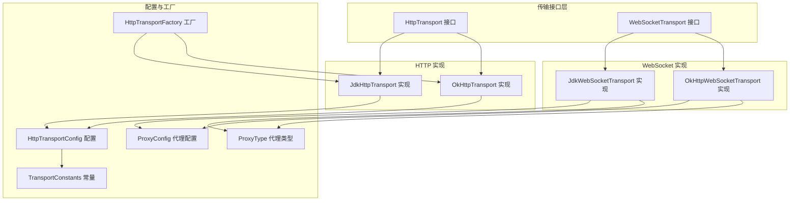
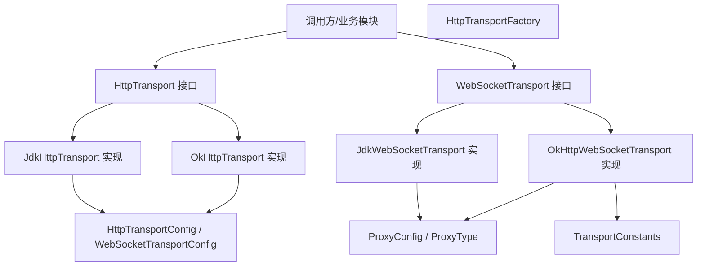
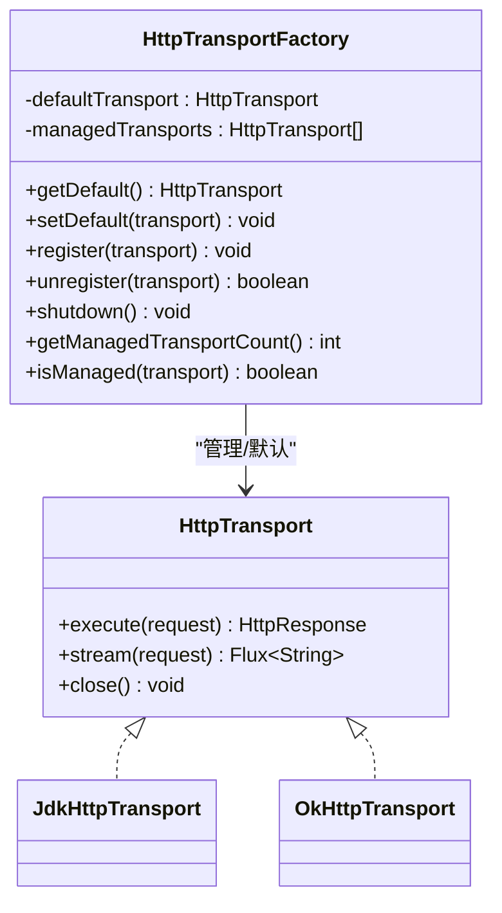
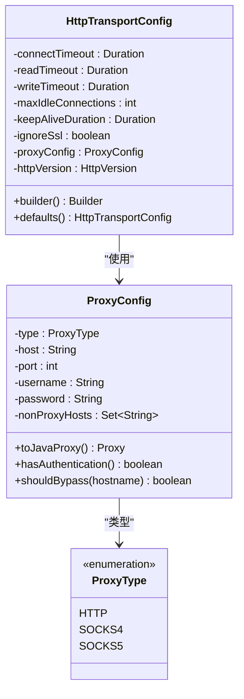
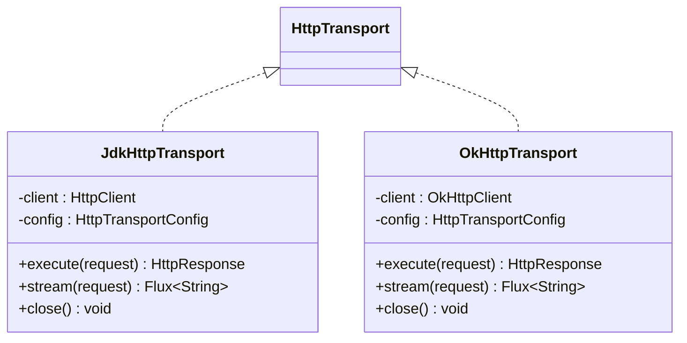
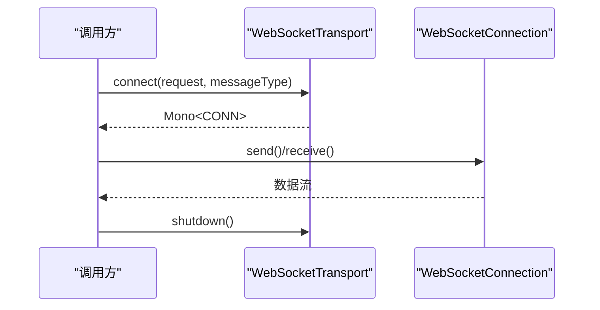
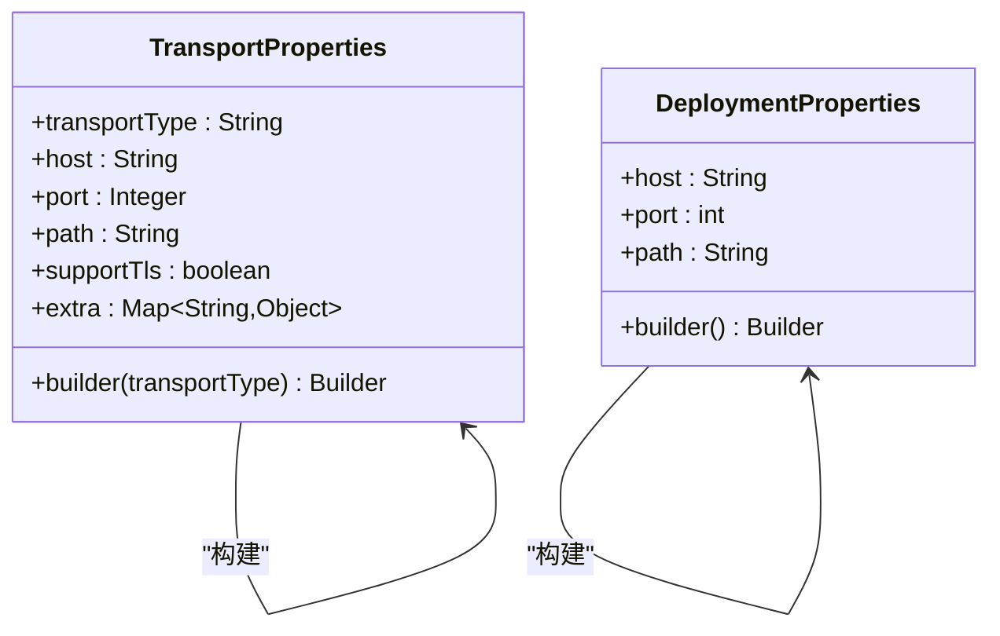
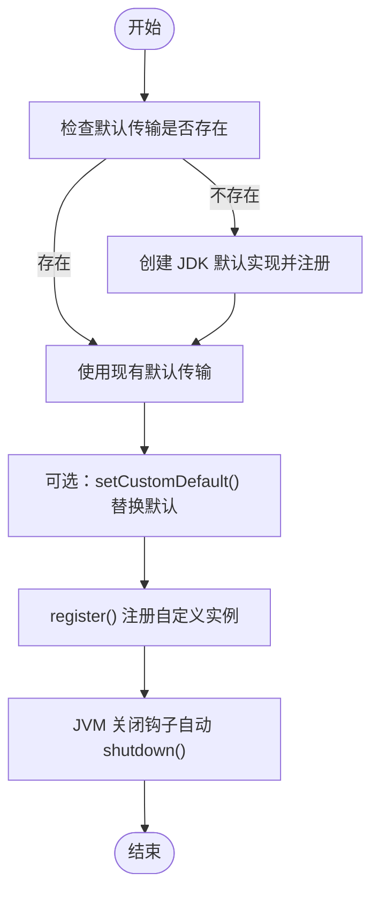
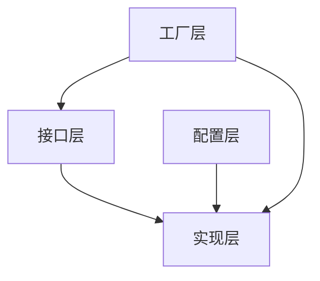
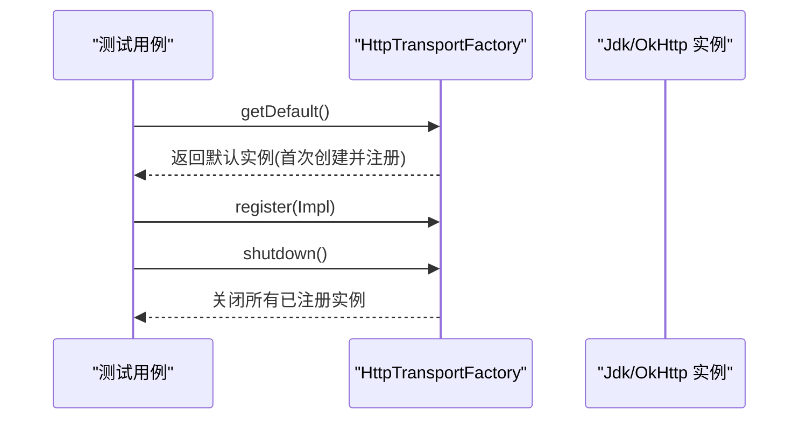

# 传输包装器构建器

<cite>
**本文引用的文件**
- [HttpTransport.java](file://agentscope-core/src/main/java/io/agentscope/core/model/transport/HttpTransport.java)
- [HttpTransportConfig.java](file://agentscope-core/src/main/java/io/agentscope/core/model/transport/HttpTransportConfig.java)
- [HttpTransportFactory.java](file://agentscope-core/src/main/java/io/agentscope/core/model/transport/HttpTransportFactory.java)
- [OkHttpTransport.java](file://agentscope-core/src/main/java/io/agentscope/core/model/transport/OkHttpTransport.java)
- [JdkHttpTransport.java](file://agentscope-core/src/main/java/io/agentscope/core/model/transport/JdkHttpTransport.java)
- [WebSocketTransport.java](file://agentscope-core/src/main/java/io/agentscope/core/model/transport/WebSocketTransport.java)
- [JdkWebSocketTransport.java](file://agentscope-core/src/main/java/io/agentscope/core/model/transport/websocket/JdkWebSocketTransport.java)
- [OkHttpWebSocketTransport.java](file://agentscope-core/src/main/java/io/agentscope/core/model/transport/websocket/OkHttpWebSocketTransport.java)
- [TransportConstants.java](file://agentscope-core/src/main/java/io/agentscope/core/model/transport/TransportConstants.java)
- [ProxyConfig.java](file://agentscope-core/src/main/java/io/agentscope/core/model/transport/ProxyConfig.java)
- [ProxyType.java](file://agentscope-core/src/main/java/io/agentscope/core/model/transport/ProxyType.java)
- [TransportProperties.java](file://agentscope-extensions/agentscope-extensions-a2a/agentscope-extensions-a2a-server/src/main/java/io/agentscope/core/a2a/server/transport/TransportProperties.java)
- [DeploymentProperties.java](file://agentscope-extensions/agentscope-extensions-a2a/agentscope-extensions-a2a-server/src/main/java/io/agentscope/core/a2a/server/transport/DeploymentProperties.java)
- [HttpTransportFactoryTest.java](file://agentscope-core/src/test/java/io/agentscope/core/model/transport/HttpTransportFactoryTest.java)
- [JdkHttpTransportTest.java](file://agentscope-core/src/test/java/io/agentscope/core/model/transport/JdkHttpTransportTest.java)
- [OkHttpTransportTest.java](file://agentscope-core/src/test/java/io/agentscope/core/model/transport/OkHttpTransportTest.java)
- [JdkWebSocketTransportTest.java](file://agentscope-core/src/test/java/io/agentscope/core/model/transport/websocket/JdkWebSocketTransportTest.java)
- [OkHttpWebSocketTransportTest.java](file://agentscope-core/src/test/java/io/agentscope/core/model/transport/websocket/OkHttpWebSocketTransportTest.java)
- [WebSocketTransportException.java](file://agentscope-core/src/main/java/io/agentscope/core/model/transport/websocket/WebSocketTransportException.java)
</cite>

## 目录
1. [简介](#简介)
2. [项目结构](#项目结构)
3. [核心组件](#核心组件)
4. [架构总览](#架构总览)
5. [详细组件分析](#详细组件分析)
6. [依赖分析](#依赖分析)
7. [性能考虑](#性能考虑)
8. [故障排查指南](#故障排查指南)
9. [结论](#结论)
10. [附录](#附录)

## 简介
本文件面向“传输包装器构建器”的技术文档，系统性阐述 AgentScope 中传输层的 SPI 扩展机制与构建流程，覆盖 HTTP 与 WebSocket 两大协议族，以及与之配套的配置模型（TransportProperties、DeploymentProperties）、安全与代理配置、生命周期管理与工厂模式、性能优化与连接池策略，并提供自定义扩展与最佳实践建议。读者可据此在不修改核心代码的前提下，通过配置与 SPI 扩展接入新的传输实现。

## 项目结构
传输层位于 agentscope-core 模块的 transport 包中，采用接口抽象 + 多实现的架构：HTTP 与 WebSocket 分别定义接口，JDK 与 OkHttp 提供具体实现；同时提供工厂类统一管理默认实例与生命周期。

**图表来源**
- [HttpTransport.java:33-62](file://agentscope-core/src/main/java/io/agentscope/core/model/transport/HttpTransport.java#L33-L62)
- [JdkHttpTransport.java:68-94](file://agentscope-core/src/main/java/io/agentscope/core/model/transport/JdkHttpTransport.java#L68-L94)
- [OkHttpTransport.java:62-102](file://agentscope-core/src/main/java/io/agentscope/core/model/transport/OkHttpTransport.java#L62-L102)
- [WebSocketTransport.java:77-95](file://agentscope-core/src/main/java/io/agentscope/core/model/transport/WebSocketTransport.java#L77-L95)
- [JdkWebSocketTransport.java:73-113](file://agentscope-core/src/main/java/io/agentscope/core/model/transport/websocket/JdkWebSocketTransport.java#L73-L113)
- [OkHttpWebSocketTransport.java:76-121](file://agentscope-core/src/main/java/io/agentscope/core/model/transport/websocket/OkHttpWebSocketTransport.java#L76-L121)
- [HttpTransportConfig.java:26-149](file://agentscope-core/src/main/java/io/agentscope/core/model/transport/HttpTransportConfig.java#L26-L149)
- [ProxyConfig.java:18-24](file://agentscope-core/src/main/java/io/agentscope/core/model/transport/ProxyConfig.java#L18-L24)
- [ProxyType.java:24-47](file://agentscope-core/src/main/java/io/agentscope/core/model/transport/ProxyType.java#L24-L47)
- [HttpTransportFactory.java:54-91](file://agentscope-core/src/main/java/io/agentscope/core/model/transport/HttpTransportFactory.java#L54-L91)
- [TransportConstants.java:21-36](file://agentscope-core/src/main/java/io/agentscope/core/model/transport/TransportConstants.java#L21-L36)

**章节来源**
- [HttpTransport.java:20-62](file://agentscope-core/src/main/java/io/agentscope/core/model/transport/HttpTransport.java#L20-L62)
- [WebSocketTransport.java:22-95](file://agentscope-core/src/main/java/io/agentscope/core/model/transport/WebSocketTransport.java#L22-L95)
- [HttpTransportConfig.java:20-149](file://agentscope-core/src/main/java/io/agentscope/core/model/transport/HttpTransportConfig.java#L20-L149)
- [HttpTransportFactory.java:23-91](file://agentscope-core/src/main/java/io/agentscope/core/model/transport/HttpTransportFactory.java#L23-L91)

## 核心组件
- 传输接口与实现
  - HttpTransport：抽象 HTTP 请求执行、流式响应与资源关闭。
  - JdkHttpTransport / OkHttpTransport：分别基于 JDK HttpClient 与 OkHttp 的实现，支持同步请求与 SSE/NDJSON 流式输出。
  - WebSocketTransport 及其 JDK/OkHttp 实现：提供 WebSocket 连接建立、消息收发与连接生命周期管理。
- 配置模型
  - HttpTransportConfig：超时、连接池、SSL 忽略、代理、HTTP 版本等。
  - ProxyConfig / ProxyType：代理类型与认证、非代理主机白名单等。
  - TransportConstants：传输层通用常量（如流格式头）。
  - TransportProperties / DeploymentProperties：部署侧的传输属性与默认导出信息。
- 工厂与生命周期
  - HttpTransportFactory：默认实例懒加载、注册管理、JVM 关闭钩子自动清理。

**章节来源**
- [HttpTransport.java:20-62](file://agentscope-core/src/main/java/io/agentscope/core/model/transport/HttpTransport.java#L20-L62)
- [JdkHttpTransport.java:53-94](file://agentscope-core/src/main/java/io/agentscope/core/model/transport/JdkHttpTransport.java#L53-L94)
- [OkHttpTransport.java:51-102](file://agentscope-core/src/main/java/io/agentscope/core/model/transport/OkHttpTransport.java#L51-L102)
- [WebSocketTransport.java:22-95](file://agentscope-core/src/main/java/io/agentscope/core/model/transport/WebSocketTransport.java#L22-L95)
- [JdkWebSocketTransport.java:45-113](file://agentscope-core/src/main/java/io/agentscope/core/model/transport/websocket/JdkWebSocketTransport.java#L45-L113)
- [OkHttpWebSocketTransport.java:47-121](file://agentscope-core/src/main/java/io/agentscope/core/model/transport/websocket/OkHttpWebSocketTransport.java#L47-L121)
- [HttpTransportConfig.java:20-268](file://agentscope-core/src/main/java/io/agentscope/core/model/transport/HttpTransportConfig.java#L20-L268)
- [ProxyConfig.java:18-24](file://agentscope-core/src/main/java/io/agentscope/core/model/transport/ProxyConfig.java#L18-L24)
- [ProxyType.java:18-47](file://agentscope-core/src/main/java/io/agentscope/core/model/transport/ProxyType.java#L18-L47)
- [TransportConstants.java:18-36](file://agentscope-core/src/main/java/io/agentscope/core/model/transport/TransportConstants.java#L18-L36)
- [TransportProperties.java:22-93](file://agentscope-extensions/agentscope-extensions-a2a/agentscope-extensions-a2a-server/src/main/java/io/agentscope/core/a2a/server/transport/TransportProperties.java#L22-L93)
- [DeploymentProperties.java:24-81](file://agentscope-extensions/agentscope-extensions-a2a/agentscope-extensions-a2a-server/src/main/java/io/agentscope/core/a2a/server/transport/DeploymentProperties.java#L24-L81)
- [HttpTransportFactory.java:23-193](file://agentscope-core/src/main/java/io/agentscope/core/model/transport/HttpTransportFactory.java#L23-L193)

## 架构总览
下图展示传输层的总体架构：接口抽象、多实现、工厂管理与配置驱动。

**图表来源**
- [HttpTransport.java:20-62](file://agentscope-core/src/main/java/io/agentscope/core/model/transport/HttpTransport.java#L20-L62)
- [JdkHttpTransport.java:53-94](file://agentscope-core/src/main/java/io/agentscope/core/model/transport/JdkHttpTransport.java#L53-L94)
- [OkHttpTransport.java:51-102](file://agentscope-core/src/main/java/io/agentscope/core/model/transport/OkHttpTransport.java#L51-L102)
- [WebSocketTransport.java:22-95](file://agentscope-core/src/main/java/io/agentscope/core/model/transport/WebSocketTransport.java#L22-L95)
- [JdkWebSocketTransport.java:45-113](file://agentscope-core/src/main/java/io/agentscope/core/model/transport/websocket/JdkWebSocketTransport.java#L45-L113)
- [OkHttpWebSocketTransport.java:47-121](file://agentscope-core/src/main/java/io/agentscope/core/model/transport/websocket/OkHttpWebSocketTransport.java#L47-L121)
- [HttpTransportConfig.java:20-149](file://agentscope-core/src/main/java/io/agentscope/core/model/transport/HttpTransportConfig.java#L20-L149)
- [ProxyConfig.java:18-24](file://agentscope-core/src/main/java/io/agentscope/core/model/transport/ProxyConfig.java#L18-L24)
- [ProxyType.java:18-47](file://agentscope-core/src/main/java/io/agentscope/core/model/transport/ProxyType.java#L18-L47)
- [TransportConstants.java:18-36](file://agentscope-core/src/main/java/io/agentscope/core/model/transport/TransportConstants.java#L18-L36)
- [HttpTransportFactory.java:23-91](file://agentscope-core/src/main/java/io/agentscope/core/model/transport/HttpTransportFactory.java#L23-L91)

## 详细组件分析

### 组件一：HTTP 传输接口与工厂
- 接口职责
  - 同步执行 HTTP 请求并返回响应。
  - 支持 SSE/NDJSON 流式数据解析。
  - 资源关闭语义明确，避免泄漏。
- 工厂能力
  - 默认实例懒加载（JDK 实现）。
  - 注册/注销传输实例，统一由 JVM 关闭钩子进行清理。
  - 支持手动 shutdown 清理。

**图表来源**
- [HttpTransport.java:20-62](file://agentscope-core/src/main/java/io/agentscope/core/model/transport/HttpTransport.java#L20-L62)
- [HttpTransportFactory.java:54-193](file://agentscope-core/src/main/java/io/agentscope/core/model/transport/HttpTransportFactory.java#L54-L193)
- [JdkHttpTransport.java:68-94](file://agentscope-core/src/main/java/io/agentscope/core/model/transport/JdkHttpTransport.java#L68-L94)
- [OkHttpTransport.java:62-102](file://agentscope-core/src/main/java/io/agentscope/core/model/transport/OkHttpTransport.java#L62-L102)

**章节来源**
- [HttpTransport.java:20-62](file://agentscope-core/src/main/java/io/agentscope/core/model/transport/HttpTransport.java#L20-L62)
- [HttpTransportFactory.java:23-193](file://agentscope-core/src/main/java/io/agentscope/core/model/transport/HttpTransportFactory.java#L23-L193)

### 组件二：HTTP 配置模型与默认值
- 关键配置项
  - 超时：连接、读、写。
  - 连接池：最大空闲连接数、保活时长。
  - SSL：是否忽略证书校验（仅限测试）。
  - 代理：类型、主机、端口、认证、非代理主机白名单。
  - HTTP 版本：HTTP/2 或回退到 HTTP/1.1。
- 默认值
  - 连接超时 30 秒、读超时 5 分钟、写超时 30 秒。
  - 最大空闲连接 5，保活 5 分钟。
  - HTTP/2 优先。

**图表来源**
- [HttpTransportConfig.java:26-268](file://agentscope-core/src/main/java/io/agentscope/core/model/transport/HttpTransportConfig.java#L26-L268)
- [ProxyConfig.java:18-24](file://agentscope-core/src/main/java/io/agentscope/core/model/transport/ProxyConfig.java#L18-L24)
- [ProxyType.java:24-47](file://agentscope-core/src/main/java/io/agentscope/core/model/transport/ProxyType.java#L24-L47)

**章节来源**
- [HttpTransportConfig.java:20-268](file://agentscope-core/src/main/java/io/agentscope/core/model/transport/HttpTransportConfig.java#L20-L268)
- [ProxyConfig.java:18-24](file://agentscope-core/src/main/java/io/agentscope/core/model/transport/ProxyConfig.java#L18-L24)
- [ProxyType.java:18-47](file://agentscope-core/src/main/java/io/agentscope/core/model/transport/ProxyType.java#L18-L47)

### 组件三：HTTP 实现对比（JDK vs OkHttp）
- JDK 实现
  - 无外部依赖，使用 java.net.http。
  - 内建连接池与 HTTP/2 支持。
  - 代理认证对 HTTP 代理有效，SOCKS5 不支持直接认证。
- OkHttp 实现
  - 更丰富的连接池与心跳控制。
  - 明确的 SSL 忽略警告日志。
  - 支持更灵活的代理认证与非代理主机白名单选择器。

**图表来源**
- [JdkHttpTransport.java:53-94](file://agentscope-core/src/main/java/io/agentscope/core/model/transport/JdkHttpTransport.java#L53-L94)
- [OkHttpTransport.java:51-102](file://agentscope-core/src/main/java/io/agentscope/core/model/transport/OkHttpTransport.java#L51-L102)

**章节来源**
- [JdkHttpTransport.java:53-501](file://agentscope-core/src/main/java/io/agentscope/core/model/transport/JdkHttpTransport.java#L53-L501)
- [OkHttpTransport.java:51-496](file://agentscope-core/src/main/java/io/agentscope/core/model/transport/OkHttpTransport.java#L51-L496)

### 组件四：WebSocket 传输接口与实现
- 接口设计
  - connect 返回 Mono<WebSocketConnection<T>>，支持字符串或字节消息类型。
  - shutdown 释放资源。
- JDK 实现
  - 基于 JDK WebSocket API，支持代理与 SSL 忽略。
- OkHttp 实现
  - 基于 OkHttp WebSocket，内置心跳、连接池与代理认证。

**图表来源**
- [WebSocketTransport.java:77-95](file://agentscope-core/src/main/java/io/agentscope/core/model/transport/WebSocketTransport.java#L77-L95)
- [JdkWebSocketTransport.java:195-240](file://agentscope-core/src/main/java/io/agentscope/core/model/transport/websocket/JdkWebSocketTransport.java#L195-L240)
- [OkHttpWebSocketTransport.java:200-296](file://agentscope-core/src/main/java/io/agentscope/core/model/transport/websocket/OkHttpWebSocketTransport.java#L200-L296)

**章节来源**
- [WebSocketTransport.java:22-95](file://agentscope-core/src/main/java/io/agentscope/core/model/transport/WebSocketTransport.java#L22-L95)
- [JdkWebSocketTransport.java:45-278](file://agentscope-core/src/main/java/io/agentscope/core/model/transport/websocket/JdkWebSocketTransport.java#L45-L278)
- [OkHttpWebSocketTransport.java:47-334](file://agentscope-core/src/main/java/io/agentscope/core/model/transport/websocket/OkHttpWebSocketTransport.java#L47-L334)

### 组件五：部署与传输属性模型
- TransportProperties
  - 描述传输类型、主机、端口、路径、TLS 支持与额外参数，用于自动生成 AgentCard 并注册到 A2A 注册中心。
- DeploymentProperties
  - 描述默认导出主机、端口与路径；若未显式指定主机，尝试解析本地 IP，否则回退至 localhost；端口必须配置。

**图表来源**
- [TransportProperties.java:27-93](file://agentscope-extensions/agentscope-extensions-a2a/agentscope-extensions-a2a-server/src/main/java/io/agentscope/core/a2a/server/transport/TransportProperties.java#L27-L93)
- [DeploymentProperties.java:30-81](file://agentscope-extensions/agentscope-extensions-a2a/agentscope-extensions-a2a-server/src/main/java/io/agentscope/core/a2a/server/transport/DeploymentProperties.java#L30-L81)

**章节来源**
- [TransportProperties.java:22-93](file://agentscope-extensions/agentscope-extensions-a2a/agentscope-extensions-a2a-server/src/main/java/io/agentscope/core/a2a/server/transport/TransportProperties.java#L22-L93)
- [DeploymentProperties.java:24-81](file://agentscope-extensions/agentscope-extensions-a2a/agentscope-extensions-a2a-server/src/main/java/io/agentscope/core/a2a/server/transport/DeploymentProperties.java#L24-L81)

### 组件六：SPI 机制与扩展点
- 扩展方式
  - 通过 HttpTransportFactory.getDefault()/setDefault()/register() 管理默认与自管实例。
  - 在需要时替换默认实现或注册自定义实现，以满足特定网络环境（代理、证书策略）或性能需求（连接池、心跳）。
- 注意事项
  - 自定义实现需遵循接口契约，正确处理流式响应与资源关闭。
  - 若使用代理或 SSL 忽略，请确保符合安全策略与合规要求。

**图表来源**
- [HttpTransportFactory.java:71-193](file://agentscope-core/src/main/java/io/agentscope/core/model/transport/HttpTransportFactory.java#L71-L193)

**章节来源**
- [HttpTransportFactory.java:23-193](file://agentscope-core/src/main/java/io/agentscope/core/model/transport/HttpTransportFactory.java#L23-L193)

## 依赖分析
- 组件内聚与耦合
  - 接口与实现分离良好，工厂集中管理生命周期，降低调用方耦合度。
  - 配置对象独立，便于跨实现共享与复用。
- 外部依赖
  - OkHttp 实现引入 OkHttp 依赖；JDK 实现纯 JDK。
- 循环依赖
  - 未发现循环依赖迹象。

**图表来源**
- [HttpTransport.java:20-62](file://agentscope-core/src/main/java/io/agentscope/core/model/transport/HttpTransport.java#L20-L62)
- [JdkHttpTransport.java:53-94](file://agentscope-core/src/main/java/io/agentscope/core/model/transport/JdkHttpTransport.java#L53-L94)
- [OkHttpTransport.java:51-102](file://agentscope-core/src/main/java/io/agentscope/core/model/transport/OkHttpTransport.java#L51-L102)
- [HttpTransportConfig.java:20-149](file://agentscope-core/src/main/java/io/agentscope/core/model/transport/HttpTransportConfig.java#L20-L149)
- [HttpTransportFactory.java:23-91](file://agentscope-core/src/main/java/io/agentscope/core/model/transport/HttpTransportFactory.java#L23-L91)

**章节来源**
- [HttpTransport.java:20-62](file://agentscope-core/src/main/java/io/agentscope/core/model/transport/HttpTransport.java#L20-L62)
- [HttpTransportConfig.java:20-149](file://agentscope-core/src/main/java/io/agentscope/core/model/transport/HttpTransportConfig.java#L20-L149)
- [HttpTransportFactory.java:23-91](file://agentscope-core/src/main/java/io/agentscope/core/model/transport/HttpTransportFactory.java#L23-L91)

## 性能考虑
- 连接池与保活
  - 通过 HttpTransportConfig 控制最大空闲连接与保活时长，减少握手开销。
- 超时策略
  - 合理设置连接/读/写超时，避免线程阻塞与资源占用。
- 流式处理
  - SSE/NDJSON 使用背压调度器处理，避免内存峰值。
- 代理与 SSL
  - 代理认证与非代理主机白名单可减少不必要的代理跳转；SSL 忽略仅限测试场景。
- WebSocket 心跳
  - OkHttp 实现内置 pingInterval，提升长连稳定性。

[本节为通用指导，无需列出具体文件来源]

## 故障排查指南
- 常见异常
  - WebSocketTransportException：封装连接 URL、状态与请求头，便于定位问题。
  - HttpTransportException：HTTP 请求失败或流式读取异常。
- 排查步骤
  - 检查代理配置与认证是否正确。
  - 确认 SSL 忽略策略是否符合当前环境。
  - 观察工厂 shutdown 行为，确认资源是否被正确释放。
  - 对比 JDK 与 OkHttp 实现在代理认证与 SOCKS 支持上的差异。

**章节来源**
- [WebSocketTransportException.java:37-82](file://agentscope-core/src/main/java/io/agentscope/core/model/transport/websocket/WebSocketTransportException.java#L37-L82)
- [JdkWebSocketTransportTest.java:262-295](file://agentscope-core/src/test/java/io/agentscope/core/model/transport/websocket/JdkWebSocketTransportTest.java#L262-L295)
- [HttpTransportFactory.java:144-168](file://agentscope-core/src/main/java/io/agentscope/core/model/transport/HttpTransportFactory.java#L144-L168)

## 结论
传输包装器构建器通过清晰的接口抽象、完善的配置模型与工厂生命周期管理，提供了可插拔、可扩展且高性能的传输能力。结合部署侧的 TransportProperties 与 DeploymentProperties，可在不同运行环境中快速生成与注册传输配置。对于安全与性能，应遵循最小权限原则与合理超时策略，谨慎使用 SSL 忽略与代理认证。

[本节为总结性内容，无需列出具体文件来源]

## 附录

### A. 传输协议支持与特性对比
- HTTP
  - JDK：纯 JDK，HTTP/2，内建连接池。
  - OkHttp：连接池与心跳更丰富，代理认证更灵活。
- WebSocket
  - JDK：纯 JDK，支持代理与 SSL 忽略。
  - OkHttp：内置心跳、连接池与代理认证。

**章节来源**
- [JdkHttpTransport.java:53-501](file://agentscope-core/src/main/java/io/agentscope/core/model/transport/JdkHttpTransport.java#L53-L501)
- [OkHttpTransport.java:51-496](file://agentscope-core/src/main/java/io/agentscope/core/model/transport/OkHttpTransport.java#L51-L496)
- [JdkWebSocketTransport.java:45-278](file://agentscope-core/src/main/java/io/agentscope/core/model/transport/websocket/JdkWebSocketTransport.java#L45-L278)
- [OkHttpWebSocketTransport.java:47-334](file://agentscope-core/src/main/java/io/agentscope/core/model/transport/websocket/OkHttpWebSocketTransport.java#L47-L334)

### B. 安全配置与认证机制
- 代理认证
  - HTTP 代理：JDK/OkHttp 均支持用户名/密码认证。
  - SOCKS5：仅 OkHttp 支持认证，JDK 不支持。
- SSL 忽略
  - 两种实现均支持忽略证书验证，但会打印安全警告，仅限测试。
- TLS 与证书
  - 生产环境请使用受信证书，避免忽略证书验证。

**章节来源**
- [ProxyType.java:18-47](file://agentscope-core/src/main/java/io/agentscope/core/model/transport/ProxyType.java#L18-L47)
- [JdkHttpTransport.java:118-166](file://agentscope-core/src/main/java/io/agentscope/core/model/transport/JdkHttpTransport.java#L118-L166)
- [OkHttpTransport.java:117-156](file://agentscope-core/src/main/java/io/agentscope/core/model/transport/OkHttpTransport.java#L117-L156)
- [JdkWebSocketTransport.java:121-171](file://agentscope-core/src/main/java/io/agentscope/core/model/transport/websocket/JdkWebSocketTransport.java#L121-L171)
- [OkHttpWebSocketTransport.java:132-177](file://agentscope-core/src/main/java/io/agentscope/core/model/transport/websocket/OkHttpWebSocketTransport.java#L132-L177)

### C. 生命周期管理与构建流程
- 默认实例懒加载与注册
  - getDefault() 首次创建并注册；setDefault() 替换默认；register()/unregister() 管理自定义实例。
- 关闭与清理
  - shutdown() 逐个关闭并清空列表；测试可用例验证行为。

**图表来源**
- [HttpTransportFactoryTest.java:83-127](file://agentscope-core/src/test/java/io/agentscope/core/model/transport/HttpTransportFactoryTest.java#L83-L127)
- [HttpTransportFactory.java:71-193](file://agentscope-core/src/main/java/io/agentscope/core/model/transport/HttpTransportFactory.java#L71-L193)

**章节来源**
- [HttpTransportFactoryTest.java:83-127](file://agentscope-core/src/test/java/io/agentscope/core/model/transport/HttpTransportFactoryTest.java#L83-L127)
- [HttpTransportFactory.java:71-193](file://agentscope-core/src/main/java/io/agentscope/core/model/transport/HttpTransportFactory.java#L71-L193)

### D. 自定义开发指南与最佳实践
- 自定义实现
  - 实现 HttpTransport 或 WebSocketTransport 接口，确保：
    - 正确处理流式响应与背压。
    - 资源关闭与异常传播。
    - 代理与 SSL 配置兼容性。
- 配置建议
  - 合理设置超时与连接池参数，结合业务场景压测调优。
  - 优先使用受信证书，避免忽略 SSL 验证。
  - 明确区分代理与直连，利用非代理主机白名单。
- 扩展接入
  - 使用 HttpTransportFactory.setDefault()/register() 注入自定义实现，保证生命周期管理与测试覆盖。

**章节来源**
- [HttpTransport.java:20-62](file://agentscope-core/src/main/java/io/agentscope/core/model/transport/HttpTransport.java#L20-L62)
- [WebSocketTransport.java:22-95](file://agentscope-core/src/main/java/io/agentscope/core/model/transport/WebSocketTransport.java#L22-L95)
- [HttpTransportFactory.java:23-193](file://agentscope-core/src/main/java/io/agentscope/core/model/transport/HttpTransportFactory.java#L23-L193)