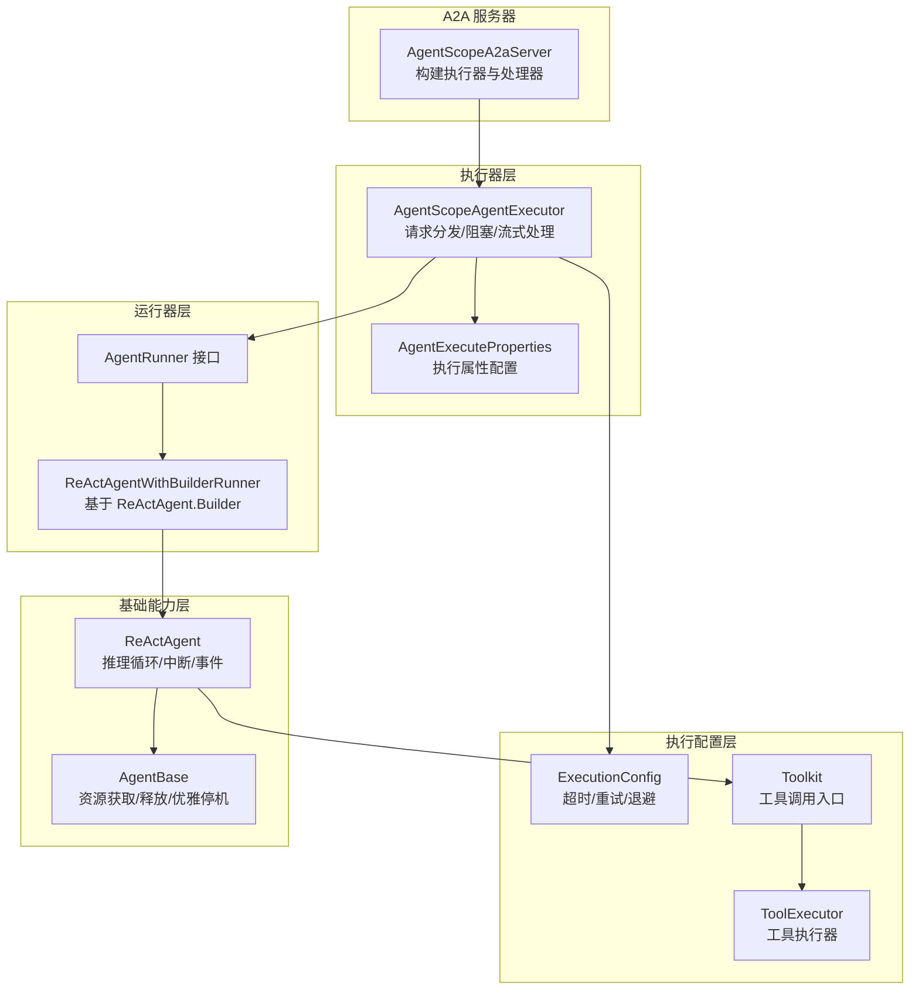
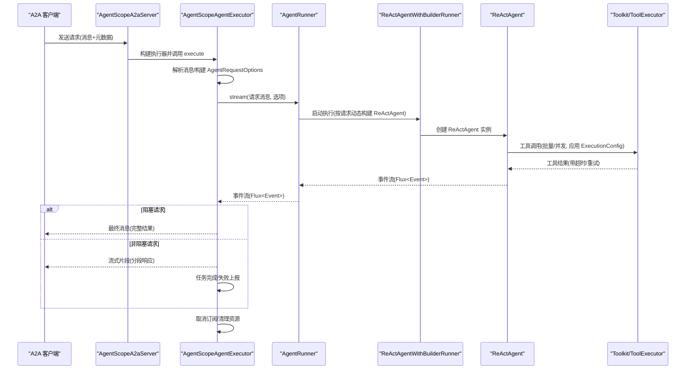
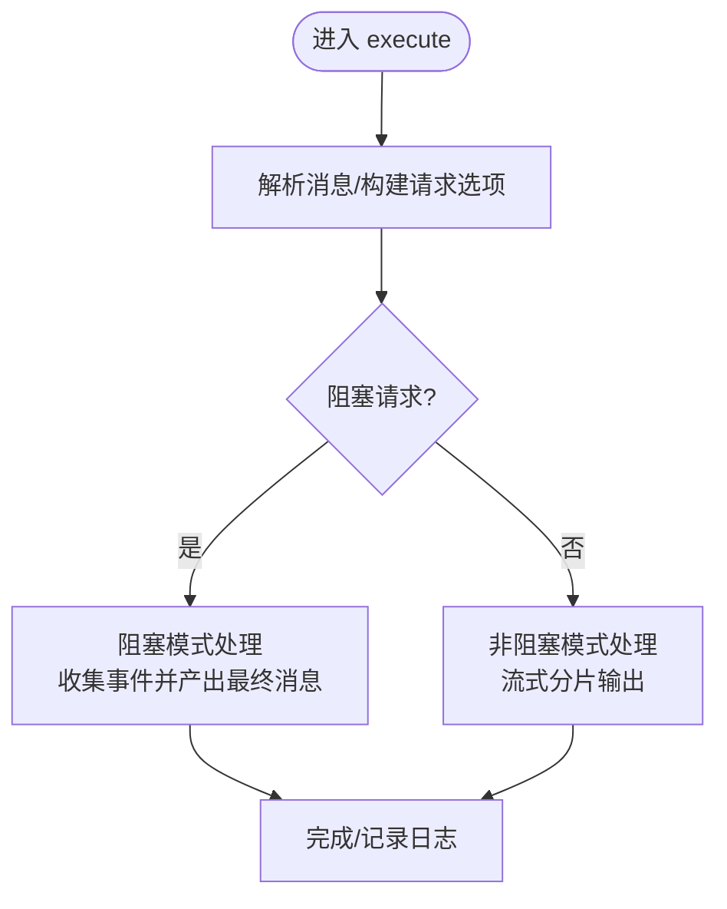
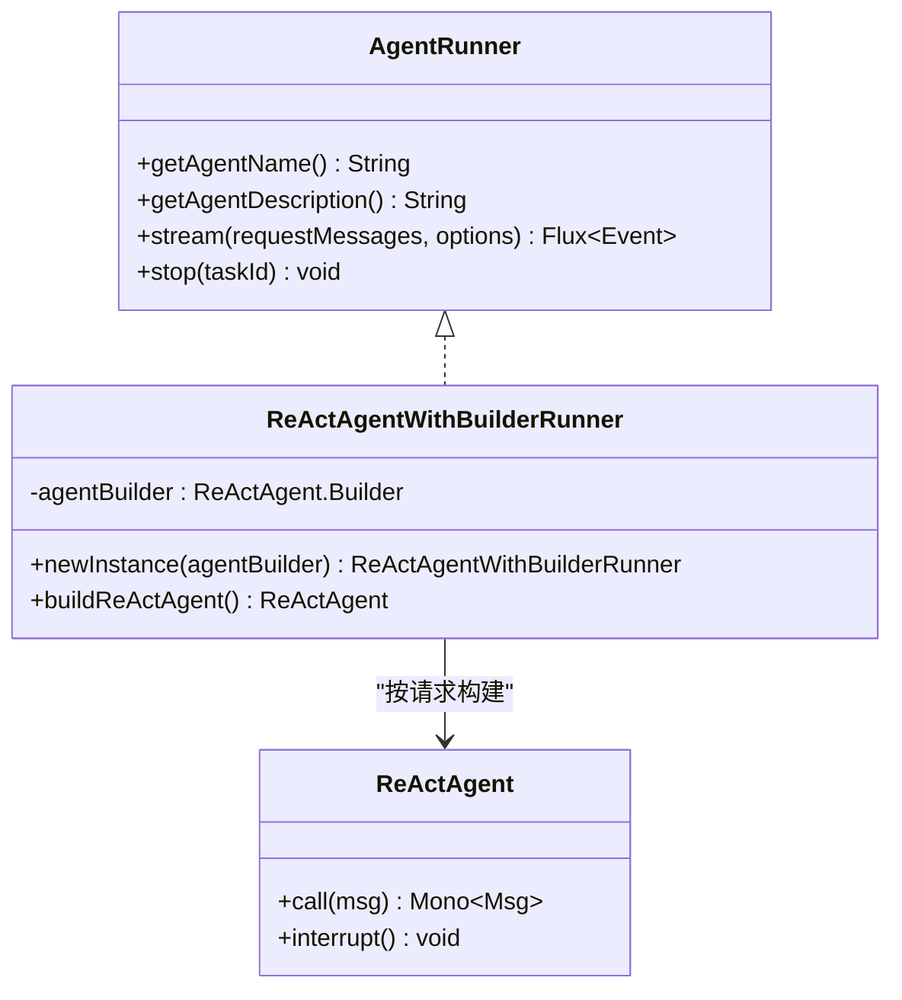
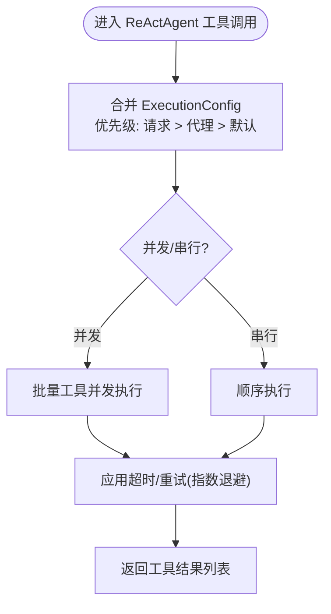

# 智能体执行器

<cite>
**本文引用的文件**   
- [AgentScopeAgentExecutor.java](file://agentscope-extensions/agentscope-extensions-a2a/agentscope-extensions-a2a-server/src/main/java/io/agentscope/core/a2a/server/executor/AgentScopeAgentExecutor.java)
- [AgentExecuteProperties.java](file://agentscope-extensions/agentscope-extensions-a2a/agentscope-extensions-a2a-server/src/main/java/io/agentscope/core/a2a/server/executor/AgentExecuteProperties.java)
- [AgentRunner.java](file://agentscope-extensions/agentscope-extensions-a2a/agentscope-extensions-a2a-server/src/main/java/io/agentscope/core/a2a/server/executor/runner/AgentRunner.java)
- [ReActAgentWithBuilderRunner.java](file://agentscope-extensions/agentscope-extensions-a2a/agentscope-extensions-a2a-server/src/main/java/io/agentscope/core/a2a/server/executor/runner/ReActAgentWithBuilderRunner.java)
- [ExecutionConfig.java](file://agentscope-core/src/main/java/io/agentscope/core/model/ExecutionConfig.java)
- [ToolExecutor.java](file://agentscope-core/src/main/java/io/agentscope/core/tool/ToolExecutor.java)
- [Toolkit.java](file://agentscope-core/src/main/java/io/agentscope/core/tool/Toolkit.java)
- [ReActAgent.java](file://agentscope-core/src/main/java/io/agentscope/core/ReActAgent.java)
- [AgentBase.java](file://agentscope-core/src/main/java/io/agentscope/core/agent/AgentBase.java)
- [FanoutPipeline.java](file://agentscope-core/src/main/java/io/agentscope/core/pipeline/FanoutPipeline.java)
- [AgentScopeA2aServer.java](file://agentscope-extensions/agentscope-extensions-a2a/agentscope-extensions-a2a-server/src/main/java/io/agentscope/core/a2a/server/AgentScopeA2aServer.java)
</cite>

## 目录
1. [简介](#简介)
2. [项目结构](#项目结构)
3. [核心组件](#核心组件)
4. [架构总览](#架构总览)
5. [详细组件分析](#详细组件分析)
6. [依赖分析](#依赖分析)
7. [性能考虑](#性能考虑)
8. [故障排查指南](#故障排查指南)
9. [结论](#结论)
10. [附录](#附录)

## 简介
本文件面向智能体执行器的使用者与维护者，系统性阐述 AgentScopeAgentExecutor 的执行架构、任务调度机制与上下文管理；详解 AgentExecuteProperties 的配置项与执行参数；解析 AgentRunner 接口及其典型实现（尤其是 ReActAgentWithBuilderRunner）；并覆盖并发执行控制、线程池与资源分配策略、执行上下文与状态跟踪、超时与错误恢复/重试、性能监控与瓶颈分析，以及配置优化与故障诊断实践。

## 项目结构
围绕智能体执行器的关键模块，主要涉及以下层次：
- 执行器层：AgentScopeAgentExecutor 负责将 A2A 请求转换为 Agent 执行，并处理阻塞/非阻塞两种模式的输出与事件流。
- 运行器层：AgentRunner 抽象了“如何构建与启动一个智能体实例”，ReActAgentWithBuilderRunner 提供基于 ReActAgent.Builder 的默认实现。
- 配置层：AgentExecuteProperties 控制执行行为（是否完整返回消息、是否要求内部中间事件等）。
- 执行配置层：ExecutionConfig 统一模型与工具调用的超时、重试与退避策略。
- 工具执行层：ToolExecutor/Toolkit 提供工具批量执行、并发控制、超时与重试。
- 基础能力层：ReActAgent、AgentBase 提供推理循环、中断、资源获取与释放、事件钩子等。

图示来源
- [AgentScopeA2aServer.java:167-189](file://agentscope-extensions/agentscope-extensions-a2a/agentscope-extensions-a2a-server/src/main/java/io/agentscope/core/a2a/server/AgentScopeA2aServer.java#L167-L189)
- [AgentScopeAgentExecutor.java:95-124](file://agentscope-extensions/agentscope-extensions-a2a/agentscope-extensions-a2a-server/src/main/java/io/agentscope/core/a2a/server/executor/AgentScopeAgentExecutor.java#L95-L124)
- [AgentExecuteProperties.java:24-53](file://agentscope-extensions/agentscope-extensions-a2a/agentscope-extensions-a2a-server/src/main/java/io/agentscope/core/a2a/server/executor/AgentExecuteProperties.java#L24-L53)
- [AgentRunner.java:35-66](file://agentscope-extensions/agentscope-extensions-a2a/agentscope-extensions-a2a-server/src/main/java/io/agentscope/core/a2a/server/executor/runner/AgentRunner.java#L35-L66)
- [ReActAgentWithBuilderRunner.java:29-51](file://agentscope-extensions/agentscope-extensions-a2a/agentscope-extensions-a2a-server/src/main/java/io/agentscope/core/a2a/server/executor/runner/ReActAgentWithBuilderRunner.java#L29-L51)
- [ExecutionConfig.java:27-94](file://agentscope-core/src/main/java/io/agentscope/core/model/ExecutionConfig.java#L27-L94)
- [ToolExecutor.java:39-78](file://agentscope-core/src/main/java/io/agentscope/core/tool/ToolExecutor.java#L39-L78)
- [Toolkit.java:493-520](file://agentscope-core/src/main/java/io/agentscope/core/tool/Toolkit.java#L493-L520)
- [ReActAgent.java:172-194](file://agentscope-core/src/main/java/io/agentscope/core/ReActAgent.java#L172-L194)
- [AgentBase.java:404-439](file://agentscope-core/src/main/java/io/agentscope/core/agent/AgentBase.java#L404-L439)

章节来源
- [AgentScopeA2aServer.java:167-189](file://agentscope-extensions/agentscope-extensions-a2a/agentscope-extensions-a2a-server/src/main/java/io/agentscope/core/a2a/server/AgentScopeA2aServer.java#L167-L189)
- [AgentScopeAgentExecutor.java:95-124](file://agentscope-extensions/agentscope-extensions-a2a/agentscope-extensions-a2a-server/src/main/java/io/agentscope/core/a2a/server/executor/AgentScopeAgentExecutor.java#L95-L124)
- [AgentExecuteProperties.java:24-53](file://agentscope-extensions/agentscope-extensions-a2a/agentscope-extensions-a2a-server/src/main/java/io/agentscope/core/a2a/server/executor/AgentExecuteProperties.java#L24-L53)
- [AgentRunner.java:35-66](file://agentscope-extensions/agentscope-extensions-a2a/agentscope-extensions-a2a-server/src/main/java/io/agentscope/core/a2a/server/executor/runner/AgentRunner.java#L35-L66)
- [ReActAgentWithBuilderRunner.java:29-51](file://agentscope-extensions/agentscope-extensions-a2a/agentscope-extensions-a2a-server/src/main/java/io/agentscope/core/a2a/server/executor/runner/ReActAgentWithBuilderRunner.java#L29-L51)
- [ExecutionConfig.java:27-94](file://agentscope-core/src/main/java/io/agentscope/core/model/ExecutionConfig.java#L27-L94)
- [ToolExecutor.java:39-78](file://agentscope-core/src/main/java/io/agentscope/core/tool/ToolExecutor.java#L39-L78)
- [Toolkit.java:493-520](file://agentscope-core/src/main/java/io/agentscope/core/tool/Toolkit.java#L493-L520)
- [ReActAgent.java:172-194](file://agentscope-core/src/main/java/io/agentscope/core/ReActAgent.java#L172-L194)
- [AgentBase.java:404-439](file://agentscope-core/src/main/java/io/agentscope/core/agent/AgentBase.java#L404-L439)

## 核心组件
- AgentScopeAgentExecutor：A2A 服务器侧的执行器，负责请求解析、阻塞/非阻塞处理、事件流转换与任务状态更新，以及取消订阅与资源清理。
- AgentExecuteProperties：控制执行行为的配置项，如是否以完整消息完成、是否需要中间事件（如工具结果、提示）。
- AgentRunner：抽象“如何启动与停止一次智能体执行”，支持流式事件输出与任务停止。
- ReActAgentWithBuilderRunner：基于 ReActAgent.Builder 的默认运行器实现，按请求动态构建 ReActAgent 实例。
- ExecutionConfig：统一的超时、最大尝试次数、初始/最大退避时间、退避倍数与重试条件配置。
- ToolExecutor/Toolkit：工具执行入口，支持批量工具调用、并发/串行、超时与重试。
- ReActAgent/AgentBase：推理循环、中断、资源获取/释放、与优雅停机集成。

章节来源
- [AgentScopeAgentExecutor.java:60-124](file://agentscope-extensions/agentscope-extensions-a2a/agentscope-extensions-a2a-server/src/main/java/io/agentscope/core/a2a/server/executor/AgentScopeAgentExecutor.java#L60-L124)
- [AgentExecuteProperties.java:24-53](file://agentscope-extensions/agentscope-extensions-a2a/agentscope-extensions-a2a-server/src/main/java/io/agentscope/core/a2a/server/executor/AgentExecuteProperties.java#L24-L53)
- [AgentRunner.java:35-66](file://agentscope-extensions/agentscope-extensions-a2a/agentscope-extensions-a2a-server/src/main/java/io/agentscope/core/a2a/server/executor/runner/AgentRunner.java#L35-L66)
- [ReActAgentWithBuilderRunner.java:29-51](file://agentscope-extensions/agentscope-extensions-a2a/agentscope-extensions-a2a-server/src/main/java/io/agentscope/core/a2a/server/executor/runner/ReActAgentWithBuilderRunner.java#L29-L51)
- [ExecutionConfig.java:27-94](file://agentscope-core/src/main/java/io/agentscope/core/model/ExecutionConfig.java#L27-L94)
- [ToolExecutor.java:39-78](file://agentscope-core/src/main/java/io/agentscope/core/tool/ToolExecutor.java#L39-L78)
- [Toolkit.java:493-520](file://agentscope-core/src/main/java/io/agentscope/core/tool/Toolkit.java#L493-L520)
- [ReActAgent.java:172-194](file://agentscope-core/src/main/java/io/agentscope/core/ReActAgent.java#L172-L194)
- [AgentBase.java:404-439](file://agentscope-core/src/main/java/io/agentscope/core/agent/AgentBase.java#L404-L439)

## 架构总览
下图展示从 A2A 请求到智能体执行、事件流输出与任务状态更新的端到端流程。

图示来源
- [AgentScopeA2aServer.java:167-189](file://agentscope-extensions/agentscope-extensions-a2a/agentscope-extensions-a2a-server/src/main/java/io/agentscope/core/a2a/server/AgentScopeA2aServer.java#L167-L189)
- [AgentScopeAgentExecutor.java:95-228](file://agentscope-extensions/agentscope-extensions-a2a/agentscope-extensions-a2a-server/src/main/java/io/agentscope/core/a2a/server/executor/AgentScopeAgentExecutor.java#L95-L228)
- [AgentRunner.java:58-65](file://agentscope-extensions/agentscope-extensions-a2a/agentscope-extensions-a2a-server/src/main/java/io/agentscope/core/a2a/server/executor/runner/AgentRunner.java#L58-L65)
- [ReActAgentWithBuilderRunner.java:38-41](file://agentscope-extensions/agentscope-extensions-a2a/agentscope-extensions-a2a-server/src/main/java/io/agentscope/core/a2a/server/executor/runner/ReActAgentWithBuilderRunner.java#L38-L41)
- [Toolkit.java:510-520](file://agentscope-core/src/main/java/io/agentscope/core/tool/Toolkit.java#L510-L520)
- [ToolExecutor.java:278-297](file://agentscope-core/src/main/java/io/agentscope/core/tool/ToolExecutor.java#L278-L297)

## 详细组件分析

### AgentScopeAgentExecutor 执行架构与任务调度
- 请求解析与选项构建：将 A2A 消息转换为 Msg 列表，提取 userId/sessionId 等上下文信息，生成 AgentRequestOptions。
- 阻塞 vs 非阻塞：根据调用上下文或配置判断是否阻塞等待；阻塞模式直接在主线程收集事件并产出最终消息；非阻塞模式通过 TaskUpdater 上报任务状态与分片内容。
- 事件流处理：基于 Reactor Flux 的 doOnNext/doOnComplete/doOnError/doFinally 生命周期钩子，分别对接阻塞与流式处理器；同时维护订阅映射用于取消。
- 取消与清理：cancel 时通过 TaskUpdater 标记取消、调用 AgentRunner.stop 并取消底层订阅，确保资源回收。
- 输出策略：根据 AgentExecuteProperties 决定是否发送中间事件（如工具结果、提示），以及是否在完成时附加完整消息。

图示来源
- [AgentScopeAgentExecutor.java:95-228](file://agentscope-extensions/agentscope-extensions-a2a/agentscope-extensions-a2a-server/src/main/java/io/agentscope/core/a2a/server/executor/AgentScopeAgentExecutor.java#L95-L228)
- [AgentExecuteProperties.java:24-53](file://agentscope-extensions/agentscope-extensions-a2a/agentscope-extensions-a2a-server/src/main/java/io/agentscope/core/a2a/server/executor/AgentExecuteProperties.java#L24-L53)

章节来源
- [AgentScopeAgentExecutor.java:95-228](file://agentscope-extensions/agentscope-extensions-a2a/agentscope-extensions-a2a-server/src/main/java/io/agentscope/core/a2a/server/executor/AgentScopeAgentExecutor.java#L95-L228)
- [AgentExecuteProperties.java:24-53](file://agentscope-extensions/agentscope-extensions-a2a/agentscope-extensions-a2a-server/src/main/java/io/agentscope/core/a2a/server/executor/AgentExecuteProperties.java#L24-L53)

### AgentExecuteProperties 配置项与执行参数
- completeWithMessage：非阻塞请求是否在完成时附带完整消息。
- requireInnerMessage：是否需要接收中间事件（如推理、工具结果、提示），从而决定哪些事件应被客户端感知。
- 构建器：提供链式配置方法，便于在执行器初始化时注入。

章节来源
- [AgentExecuteProperties.java:24-76](file://agentscope-extensions/agentscope-extensions-a2a/agentscope-extensions-a2a-server/src/main/java/io/agentscope/core/a2a/server/executor/AgentExecuteProperties.java#L24-L76)

### AgentRunner 接口与实现
- 接口职责：提供 getAgentName/getAgentDescription、stream(阻塞/非阻塞事件流)、stop(按 taskId 停止)。
- ReActAgentWithBuilderRunner：基于 ReActAgent.Builder 动态构建 ReActAgent 实例，适合每次请求独立实例化与隔离的状态管理；支持缓存以便在停止时快速拦截。

图示来源
- [AgentRunner.java:35-66](file://agentscope-extensions/agentscope-extensions-a2a/agentscope-extensions-a2a-server/src/main/java/io/agentscope/core/a2a/server/executor/runner/AgentRunner.java#L35-L66)
- [ReActAgentWithBuilderRunner.java:29-51](file://agentscope-extensions/agentscope-extensions-a2a/agentscope-extensions-a2a-server/src/main/java/io/agentscope/core/a2a/server/executor/runner/ReActAgentWithBuilderRunner.java#L29-L51)
- [ReActAgent.java:172-194](file://agentscope-core/src/main/java/io/agentscope/core/ReActAgent.java#L172-L194)

章节来源
- [AgentRunner.java:35-66](file://agentscope-extensions/agentscope-extensions-a2a/agentscope-extensions-a2a-server/src/main/java/io/agentscope/core/a2a/server/executor/runner/AgentRunner.java#L35-L66)
- [ReActAgentWithBuilderRunner.java:29-51](file://agentscope-extensions/agentscope-extensions-a2a/agentscope-extensions-a2a-server/src/main/java/io/agentscope/core/a2a/server/executor/runner/ReActAgentWithBuilderRunner.java#L29-L51)
- [ReActAgent.java:172-194](file://agentscope-core/src/main/java/io/agentscope/core/ReActAgent.java#L172-L194)

### 并发执行控制、线程池与资源分配
- ReActAgent 层：ReActAgent 在推理循环中可能触发工具调用，工具执行由 Toolkit/ToolExecutor 统一处理，支持批量并发与串行控制。
- Fanout/流水线：在更高层的流水线场景中，可通过 Scheduler 控制并发线程；测试用例展示了自定义 Scheduler 对并发执行的影响。
- 资源获取与释放：AgentBase.acquireExecution/releaseExecution 使用原子状态与 Reactor 的 Mono.using 保证资源在任何终止状态下都能正确释放；与优雅停机管理器集成，避免在关闭期间继续接受请求。
- 线程池策略：工具执行默认使用 Reactor Schedulers.boundedElastic()，适合异步 I/O；也可通过外部配置注入自定义执行器服务。

图示来源
- [Toolkit.java:510-520](file://agentscope-core/src/main/java/io/agentscope/core/tool/Toolkit.java#L510-L520)
- [ToolExecutor.java:278-297](file://agentscope-core/src/main/java/io/agentscope/core/tool/ToolExecutor.java#L278-L297)
- [ToolExecutor.java:366-402](file://agentscope-core/src/main/java/io/agentscope/core/tool/ToolExecutor.java#L366-L402)
- [ExecutionConfig.java:27-94](file://agentscope-core/src/main/java/io/agentscope/core/model/ExecutionConfig.java#L27-L94)
- [AgentBase.java:404-439](file://agentscope-core/src/main/java/io/agentscope/core/agent/AgentBase.java#L404-L439)
- [FanoutPipeline.java:409-457](file://agentscope-core/src/main/java/io/agentscope/core/pipeline/FanoutPipeline.java#L409-L457)

章节来源
- [Toolkit.java:510-520](file://agentscope-core/src/main/java/io/agentscope/core/tool/Toolkit.java#L510-L520)
- [ToolExecutor.java:278-297](file://agentscope-core/src/main/java/io/agentscope/core/tool/ToolExecutor.java#L278-L297)
- [ToolExecutor.java:366-402](file://agentscope-core/src/main/java/io/agentscope/core/tool/ToolExecutor.java#L366-L402)
- [ExecutionConfig.java:27-94](file://agentscope-core/src/main/java/io/agentscope/core/model/ExecutionConfig.java#L27-L94)
- [AgentBase.java:404-439](file://agentscope-core/src/main/java/io/agentscope/core/agent/AgentBase.java#L404-L439)
- [FanoutPipeline.java:409-457](file://agentscope-core/src/main/java/io/agentscope/core/pipeline/FanoutPipeline.java#L409-L457)

### 执行上下文管理与状态跟踪
- 任务上下文：执行器在首次收到请求时创建 Task，后续通过 TaskUpdater 更新状态（提交、开始工作、完成、失败）。
- 事件聚合：阻塞模式下累积事件消息，非阻塞模式按事件类型分片输出；通过 AgentExecuteProperties 控制是否包含中间事件。
- 订阅管理：使用 ConcurrentHashMap 维护 taskId 到 Subscription 的映射，支持取消订阅与资源清理。
- 中断与优雅停机：AgentBase 在 acquireExecution 时检查运行状态与优雅停机标志，确保在关闭阶段不再接受新请求；stop 时通过 Runner 实现快速中断。

章节来源
- [AgentScopeAgentExecutor.java:95-228](file://agentscope-extensions/agentscope-extensions-a2a/agentscope-extensions-a2a-server/src/main/java/io/agentscope/core/a2a/server/executor/AgentScopeAgentExecutor.java#L95-L228)
- [AgentScopeAgentExecutor.java:230-238](file://agentscope-extensions/agentscope-extensions-a2a/agentscope-extensions-a2a-server/src/main/java/io/agentscope/core/a2a/server/executor/AgentScopeAgentExecutor.java#L230-L238)
- [AgentBase.java:404-439](file://agentscope-core/src/main/java/io/agentscope/core/agent/AgentBase.java#L404-L439)

### 超时处理、错误恢复与重试机制
- 统一配置：ExecutionConfig 提供 timeout/maxAttempts/initialBackoff/maxBackoff/backoffMultiplier/retryOn 等字段，支持参数级合并。
- 工具执行重试：ToolExecutor.applyRetry 基于 Reactor Retry.backoff，支持抖动、最大退避与过滤条件；默认对可重试错误进行指数退避重试。
- 代理层容错：ReActAgent.executeToolCalls 在工具执行异常时生成错误工具结果，避免将异常传播至推理循环，保障继续处理与反馈。
- 错误上报：执行器在阻塞/流式处理器中捕获错误并上报相应消息或标记任务失败。

章节来源
- [ExecutionConfig.java:27-94](file://agentscope-core/src/main/java/io/agentscope/core/model/ExecutionConfig.java#L27-L94)
- [ToolExecutor.java:366-402](file://agentscope-core/src/main/java/io/agentscope/core/tool/ToolExecutor.java#L366-L402)
- [ReActAgent.java:766-780](file://agentscope-core/src/main/java/io/agentscope/core/ReActAgent.java#L766-L780)
- [AgentScopeAgentExecutor.java:295-301](file://agentscope-extensions/agentscope-extensions-a2a/agentscope-extensions-a2a-server/src/main/java/io/agentscope/core/a2a/server/executor/AgentScopeAgentExecutor.java#L295-L301)

### 性能监控、资源使用统计与瓶颈分析
- 事件粒度：通过事件处理器按事件类型分片输出，便于统计各阶段耗时（推理、工具调用、汇总）。
- 资源占用：工具执行默认 boundedElastic 线程池，适合 I/O 密集型；可根据负载调整并发度与批大小。
- 瓶颈定位：结合任务状态与事件流，定位是模型调用慢、工具执行慢还是事件序列化/传输慢。
- 建议：对长链路埋点（请求进入、事件到达、完成上报），并结合 A2A 服务器的任务指标进行聚合分析。

[本节为通用指导，无需列出具体文件来源]

## 依赖分析
- 执行器依赖运行器：AgentScopeAgentExecutor 通过 AgentRunner 获取事件流；默认使用 ReActAgentWithBuilderRunner。
- 运行器依赖代理：ReActAgentWithBuilderRunner 按请求构建 ReActAgent 实例，ReActAgent 依赖 Toolkit 执行工具。
- 工具执行依赖配置：Toolkit/ToolExecutor 依据 ExecutionConfig 合并后的有效配置执行超时与重试。
- 并发与调度：FanoutPipeline/测试用例展示了自定义 Scheduler 对并发线程的影响。

图示来源
- [AgentScopeAgentExecutor.java:60-75](file://agentscope-extensions/agentscope-extensions-a2a/agentscope-extensions-a2a-server/src/main/java/io/agentscope/core/a2a/server/executor/AgentScopeAgentExecutor.java#L60-L75)
- [AgentRunner.java:35-66](file://agentscope-extensions/agentscope-extensions-a2a/agentscope-extensions-a2a-server/src/main/java/io/agentscope/core/a2a/server/executor/runner/AgentRunner.java#L35-L66)
- [ReActAgentWithBuilderRunner.java:29-51](file://agentscope-extensions/agentscope-extensions-a2a/agentscope-extensions-a2a-server/src/main/java/io/agentscope/core/a2a/server/executor/runner/ReActAgentWithBuilderRunner.java#L29-L51)
- [Toolkit.java:493-520](file://agentscope-core/src/main/java/io/agentscope/core/tool/Toolkit.java#L493-L520)
- [ToolExecutor.java:39-78](file://agentscope-core/src/main/java/io/agentscope/core/tool/ToolExecutor.java#L39-L78)
- [ExecutionConfig.java:27-94](file://agentscope-core/src/main/java/io/agentscope/core/model/ExecutionConfig.java#L27-L94)

章节来源
- [AgentScopeAgentExecutor.java:60-75](file://agentscope-extensions/agentscope-extensions-a2a/agentscope-extensions-a2a-server/src/main/java/io/agentscope/core/a2a/server/executor/AgentScopeAgentExecutor.java#L60-L75)
- [AgentRunner.java:35-66](file://agentscope-extensions/agentscope-extensions-a2a/agentscope-extensions-a2a-server/src/main/java/io/agentscope/core/a2a/server/executor/runner/AgentRunner.java#L35-L66)
- [ReActAgentWithBuilderRunner.java:29-51](file://agentscope-extensions/agentscope-extensions-a2a/agentscope-extensions-a2a-server/src/main/java/io/agentscope/core/a2a/server/executor/runner/ReActAgentWithBuilderRunner.java#L29-L51)
- [Toolkit.java:493-520](file://agentscope-core/src/main/java/io/agentscope/core/tool/Toolkit.java#L493-L520)
- [ToolExecutor.java:39-78](file://agentscope-core/src/main/java/io/agentscope/core/tool/ToolExecutor.java#L39-L78)
- [ExecutionConfig.java:27-94](file://agentscope-core/src/main/java/io/agentscope/core/model/ExecutionConfig.java#L27-L94)

## 性能考虑
- 并发策略：工具调用默认使用 boundedElastic，适合 I/O 密集；若工具执行 CPU 密集，建议降低并发或拆分任务。
- 批量与串行：在 Toolkit 层支持批量工具调用，合理设置批大小可提升吞吐；对强一致需求可选择串行执行。
- 超时与重试：为不同场景设置合理的超时与重试策略，避免因个别工具失败拖累整体。
- 事件分片：非阻塞模式下分片输出可降低首字节延迟，但需权衡客户端处理复杂度。
- 线程与内存：每次请求构建独立 ReActAgent 实例，避免共享状态竞争；注意内存与线程池峰值占用。

[本节为通用指导，无需列出具体文件来源]

## 故障排查指南
- 无法取消任务：确认 subscriptions 映射中存在对应 taskId 的订阅；检查 Runner.stop 是否被调用。
- 事件未达客户端：检查 AgentExecuteProperties 的 requireInnerMessage 设置，确认是否过滤了中间事件。
- 超时/重试异常：核对 ExecutionConfig 的 timeout/maxAttempts/backoff 配置；查看工具执行器日志中的重试次数与错误原因。
- 代理重复运行：检查 AgentBase.acquireExecution 的运行状态与优雅停机标志，避免在关闭阶段继续接受请求。
- 工具执行失败：ReActAgent.executeToolCalls 会生成错误工具结果，确保代理仍可继续推理；关注工具注册与参数校验。

章节来源
- [AgentScopeAgentExecutor.java:78-93](file://agentscope-extensions/agentscope-extensions-a2a/agentscope-extensions-a2a-server/src/main/java/io/agentscope/core/a2a/server/executor/AgentScopeAgentExecutor.java#L78-L93)
- [AgentScopeAgentExecutor.java:295-301](file://agentscope-extensions/agentscope-extensions-a2a/agentscope-extensions-a2a-server/src/main/java/io/agentscope/core/a2a/server/executor/AgentScopeAgentExecutor.java#L295-L301)
- [AgentExecuteProperties.java:24-53](file://agentscope-extensions/agentscope-extensions-a2a/agentscope-extensions-a2a-server/src/main/java/io/agentscope/core/a2a/server/executor/AgentExecuteProperties.java#L24-L53)
- [ExecutionConfig.java:27-94](file://agentscope-core/src/main/java/io/agentscope/core/model/ExecutionConfig.java#L27-L94)
- [ReActAgent.java:766-780](file://agentscope-core/src/main/java/io/agentscope/core/ReActAgent.java#L766-L780)
- [AgentBase.java:404-439](file://agentscope-core/src/main/java/io/agentscope/core/agent/AgentBase.java#L404-L439)

## 结论
AgentScopeAgentExecutor 将 A2A 请求与 Agent 执行解耦，通过 AgentRunner 抽象与 ReActAgent 的推理循环实现高扩展的执行框架。配合统一的 ExecutionConfig、Toolkit/ToolExecutor 的并发与重试能力，以及完善的事件流与任务状态管理，可在多种部署形态下稳定地支撑多智能体协作与工具编排。建议在生产环境中结合业务特征优化并发、超时与重试策略，并通过事件分片与任务指标进行持续观测与调优。

[本节为总结性内容，无需列出具体文件来源]

## 附录
- 默认运行器与服务器集成：服务器默认使用 ReActAgentWithBuilderRunner 作为 AgentRunner，便于按请求构建独立实例。
- 并发与调度：可通过 FanoutPipeline 的 Builder 配置并发与自定义 Scheduler，以满足不同场景的吞吐与延迟目标。

章节来源
- [AgentScopeA2aServer.java:167-189](file://agentscope-extensions/agentscope-extensions-a2a/agentscope-extensions-a2a-server/src/main/java/io/agentscope/core/a2a/server/AgentScopeA2aServer.java#L167-L189)
- [FanoutPipeline.java:409-457](file://agentscope-core/src/main/java/io/agentscope/core/pipeline/FanoutPipeline.java#L409-L457)