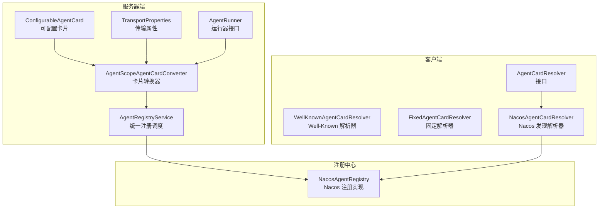
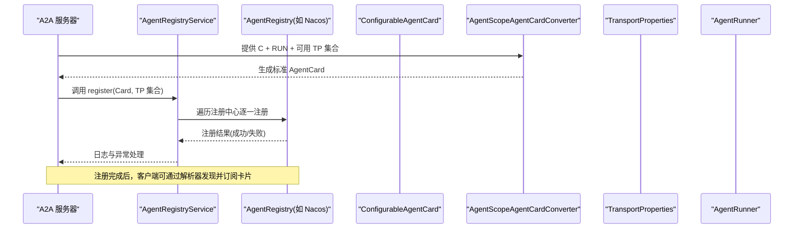
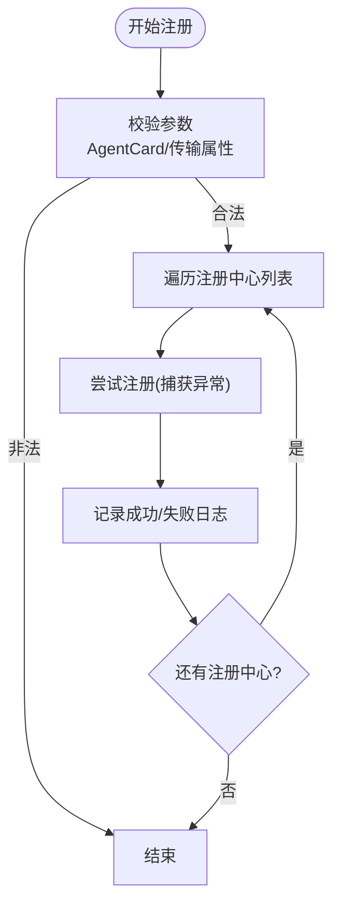
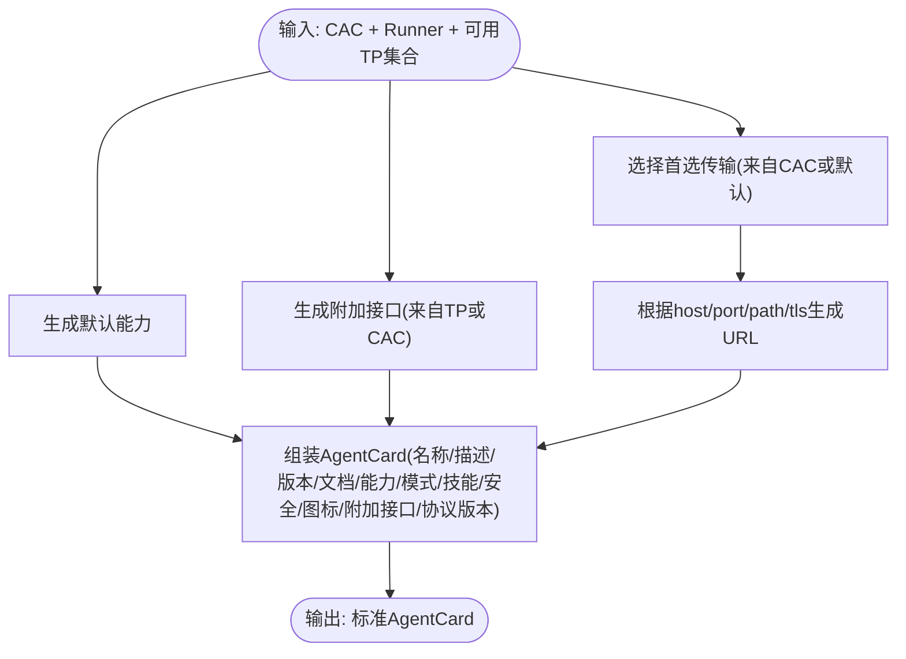
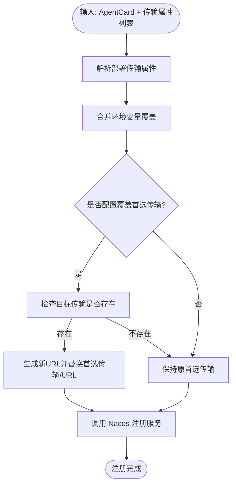
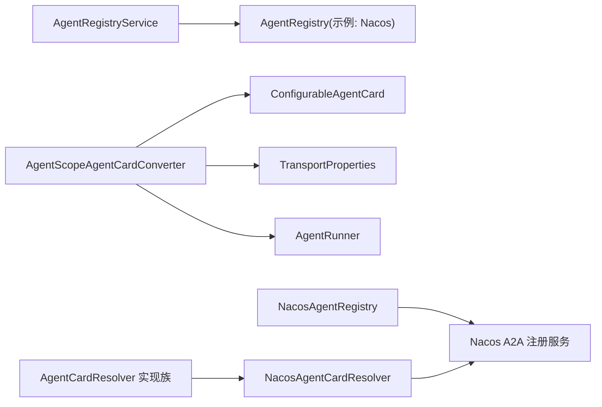

# 智能体注册服务

<cite>
**本文引用的文件**
- [AgentRegistryService.java](file://agentscope-extensions/agentscope-extensions-a2a/agentscope-extensions-a2a-server/src/main/java/io/agentscope/core/a2a/server/registry/AgentRegistryService.java)
- [ConfigurableAgentCard.java](file://agentscope-extensions/agentscope-extensions-a2a/agentscope-extensions-a2a-server/src/main/java/io/agentscope/core/a2a/server/card/ConfigurableAgentCard.java)
- [AgentScopeAgentCardConverter.java](file://agentscope-extensions/agentscope-extensions-a2a/agentscope-extensions-a2a-server/src/main/java/io/agentscope/core/a2a/server/card/AgentScopeAgentCardConverter.java)
- [TransportProperties.java](file://agentscope-extensions/agentscope-extensions-a2a/agentscope-extensions-a2a-server/src/main/java/io/agentscope/core/a2a/server/transport/TransportProperties.java)
- [AgentRunner.java](file://agentscope-extensions/agentscope-extensions-a2a/agentscope-extensions-a2a-server/src/main/java/io/agentscope/core/a2a/server/executor/runner/AgentRunner.java)
- [NacosAgentRegistry.java](file://agentscope-extensions/agentscope-extensions-nacos/agentscope-extensions-nacos-a2a/src/main/java/io/agentscope/core/nacos/a2a/registry/NacosAgentRegistry.java)
- [NacosAgentCardResolver.java](file://agentscope-extensions/agentscope-extensions-nacos/agentscope-extensions-nacos-a2a/src/main/java/io/agentscope/core/nacos/a2a/discovery/NacosAgentCardResolver.java)
- [AgentCardResolver.java](file://agentscope-extensions/agentscope-extensions-a2a/agentscope-extensions-a2a-client/src/main/java/io/agentscope/core/a2a/agent/card/AgentCardResolver.java)
- [WellKnownAgentCardResolver.java](file://agentscope-extensions/agentscope-extensions-a2a/agentscope-extensions-a2a-client/src/main/java/io/agentscope/core/a2a/agent/card/WellKnownAgentCardResolver.java)
- [FixedAgentCardResolver.java](file://agentscope-extensions/agentscope-extensions-a2a/agentscope-extensions-a2a-client/src/main/java/io/agentscope/core/a2a/agent/card/FixedAgentCardResolver.java)
- [AgentCardController.java](file://agentscope-extensions/agentscope-spring-boot-starters/agentscope-a2a-spring-boot-starter/src/main/java/io/agentscope/spring/boot/a2a/controller/AgentCardController.java)
- [A2aAgentCardProperties.java](file://agentscope-extensions/agentscope-spring-boot-starters/agentscope-a2a-spring-boot-starter/src/main/java/io/agentscope/spring/boot/a2a/properties/A2aAgentCardProperties.java)
- [NacosA2aRegistryProperties.java](file://agentscope-extensions/agentscope-extensions-nacos/agentscope-extensions-nacos-a2a/src/main/java/io/agentscope/core/nacos/a2a/registry/NacosA2aRegistryProperties.java)
- [NacosA2aRegistryTransportProperties.java](file://agentscope-extensions/agentscope-extensions-nacos/agentscope-extensions-nacos-a2a/src/main/java/io/agentscope/core/nacos/a2a/registry/NacosA2aRegistryTransportProperties.java)
- [NacosA2aTransportPropertiesEnvParser.java](file://agentscope-extensions/agentscope-extensions-nacos/agentscope-extensions-nacos-a2a/src/main/java/io/agentscope/core/nacos/a2a/registry/NacosA2aTransportPropertiesEnvParser.java)
- [AgentCardConverterUtil.java](file://agentscope-extensions/agentscope-extensions-nacos/agentscope-extensions-nacos-a2a/src/main/java/io/agentscope/core/nacos/a2a/utils/AgentCardConverterUtil.java)
- [NacosAgentRegistryTest.java](file://agentscope-extensions/agentscope-extensions-nacos/agentscope-extensions-nacos-a2a/src/test/java/io/agentscope/core/nacos/a2a/registry/NacosAgentRegistryTest.java)
- [NacosAgentCardResolverTest.java](file://agentscope-extensions/agentscope-extensions-nacos/agentscope-extensions-nacos-a2a/src/test/java/io/agentscope/core/nacos/a2a/discovery/NacosAgentCardResolverTest.java)
- [AgentRegistryServiceTest.java](file://agentscope-extensions/agentscope-extensions-a2a/agentscope-extensions-a2a-server/src/test/java/io/agentscope/core/a2a/server/registry/AgentRegistryServiceTest.java)
- [AgentScopeAgentCardConverterTest.java](file://agentscope-extensions/agentscope-extensions-a2a/agentscope-extensions-a2a-server/src/test/java/io/agentscope/core/a2a/server/card/AgentScopeAgentCardConverterTest.java)
- [ConfigurableAgentCardTest.java](file://agentscope-extensions/agentscope-extensions-a2a/agentscope-extensions-a2a-server/src/test/java/io/agentscope/core/a2a/server/card/ConfigurableAgentCardTest.java)
</cite>

## 目录
1. [简介](#简介)
2. [项目结构](#项目结构)
3. [核心组件](#核心组件)
4. [架构总览](#架构总览)
5. [详细组件分析](#详细组件分析)
6. [依赖关系分析](#依赖关系分析)
7. [性能考量](#性能考量)
8. [故障排查指南](#故障排查指南)
9. [结论](#结论)
10. [附录](#附录)

## 简介
本文件面向“智能体注册服务”的技术文档，围绕 AgentRegistryService 的核心架构与智能体注册机制展开，重点覆盖如下主题：
- 智能体卡片（AgentCard）的生成与管理，包括 ConfigurableAgentCard 的配置项与 AgentScopeAgentCardConverter 的转换逻辑
- 注册中心的统一接入与多注册中心支持（以 Nacos 为例）
- 分布式注册流程、健康检查与发现机制
- 注册服务的生命周期管理（注册、更新、注销、状态监控）
- 权限控制与访问限制的实现思路
- 完整的注册服务配置示例与监控指标建议

## 项目结构
本仓库采用模块化组织，与智能体注册服务直接相关的关键模块与文件如下：
- 服务器端注册服务与卡片转换
  - AgentRegistryService：统一调度多个注册中心进行注册
  - AgentScopeAgentCardConverter：将可配置卡片与传输属性转换为标准 AgentCard
  - ConfigurableAgentCard：导出卡片的可配置元数据
  - TransportProperties：传输层属性（协议、主机、端口、路径、TLS）
  - AgentRunner：运行器接口，提供名称/描述等用于卡片生成
- 客户端卡片解析
  - AgentCardResolver 接口与多种解析器实现（固定、Well-Known、Nacos）
- Nacos 注册中心实现
  - NacosAgentRegistry：对接 Nacos A2A 注册中心
  - NacosAgentCardResolver：从 Nacos 发现并订阅 AgentCard
  - NacosA2aRegistryProperties/TransportProperties/EnvParser：Nacos 注册参数与环境覆盖
- Spring Boot Starter
  - AgentCardController、A2aAgentCardProperties：提供基于 Spring 的卡片发布与配置入口

图表来源
- [AgentRegistryService.java:31-79](file://agentscope-extensions/agentscope-extensions-a2a/agentscope-extensions-a2a-server/src/main/java/io/agentscope/core/a2a/server/registry/AgentRegistryService.java#L31-L79)
- [AgentScopeAgentCardConverter.java:57-100](file://agentscope-extensions/agentscope-extensions-a2a/agentscope-extensions-a2a-server/src/main/java/io/agentscope/core/a2a/server/card/AgentScopeAgentCardConverter.java#L57-L100)
- [ConfigurableAgentCard.java:33-92](file://agentscope-extensions/agentscope-extensions-a2a/agentscope-extensions-a2a-server/src/main/java/io/agentscope/core/a2a/server/card/ConfigurableAgentCard.java#L33-L92)
- [TransportProperties.java:27-33](file://agentscope-extensions/agentscope-extensions-a2a/agentscope-extensions-a2a-server/src/main/java/io/agentscope/core/a2a/server/transport/TransportProperties.java#L27-L33)
- [AgentRunner.java:35-66](file://agentscope-extensions/agentscope-extensions-a2a/agentscope-extensions-a2a-server/src/main/java/io/agentscope/core/a2a/server/executor/runner/AgentRunner.java#L35-L66)
- [NacosAgentRegistry.java:42-70](file://agentscope-extensions/agentscope-extensions-nacos/agentscope-extensions-nacos-a2a/src/main/java/io/agentscope/core/nacos/a2a/registry/NacosAgentRegistry.java#L42-L70)
- [NacosAgentCardResolver.java:59-99](file://agentscope-extensions/agentscope-extensions-nacos/agentscope-extensions-nacos-a2a/src/main/java/io/agentscope/core/nacos/a2a/discovery/NacosAgentCardResolver.java#L59-L99)
- [AgentCardResolver.java:24-33](file://agentscope-extensions/agentscope-extensions-a2a/agentscope-extensions-a2a-client/src/main/java/io/agentscope/core/a2a/agent/card/AgentCardResolver.java#L24-L33)

章节来源
- [AgentRegistryService.java:31-79](file://agentscope-extensions/agentscope-extensions-a2a/agentscope-extensions-a2a-server/src/main/java/io/agentscope/core/a2a/server/registry/AgentRegistryService.java#L31-L79)
- [NacosAgentRegistry.java:42-70](file://agentscope-extensions/agentscope-extensions-nacos/agentscope-extensions-nacos-a2a/src/main/java/io/agentscope/core/nacos/a2a/registry/NacosAgentRegistry.java#L42-L70)

## 核心组件
- AgentRegistryService：遍历注册中心列表，对每个 AgentCard 和传输属性集合执行注册操作，并记录日志与异常
- AgentScopeAgentCardConverter：根据 ConfigurableAgentCard、AgentRunner 与可用传输属性，生成标准 AgentCard；负责默认能力、默认模式、首选传输与 URL 生成
- ConfigurableAgentCard：导出卡片的元数据（名称、描述、URL、提供商、版本、文档链接、默认输入输出模式、技能、安全方案、图标、附加接口、首选传输）
- TransportProperties：封装传输类型、主机、端口、路径、TLS 支持与额外属性
- AgentRunner：提供智能体名称/描述，以及流式处理请求的方法签名
- NacosAgentRegistry：将 AgentCard 注册到 Nacos A2A 注册中心，支持从部署与环境变量覆盖传输属性，并可重写首选传输
- NacosAgentCardResolver：从 Nacos 订阅 AgentCard，维护缓存与更新监听器
- AgentCardResolver 及其实现：客户端侧的卡片解析接口与多种解析器（固定、Well-Known、Nacos）

章节来源
- [AgentRegistryService.java:31-79](file://agentscope-extensions/agentscope-extensions-a2a/agentscope-extensions-a2a-server/src/main/java/io/agentscope/core/a2a/server/registry/AgentRegistryService.java#L31-L79)
- [AgentScopeAgentCardConverter.java:57-100](file://agentscope-extensions/agentscope-extensions-a2a/agentscope-extensions-a2a-server/src/main/java/io/agentscope/core/a2a/server/card/AgentScopeAgentCardConverter.java#L57-L100)
- [ConfigurableAgentCard.java:33-92](file://agentscope-extensions/agentscope-extensions-a2a/agentscope-extensions-a2a-server/src/main/java/io/agentscope/core/a2a/server/card/ConfigurableAgentCard.java#L33-L92)
- [TransportProperties.java:27-33](file://agentscope-extensions/agentscope-extensions-a2a/agentscope-extensions-a2a-server/src/main/java/io/agentscope/core/a2a/server/transport/TransportProperties.java#L27-L33)
- [AgentRunner.java:35-66](file://agentscope-extensions/agentscope-extensions-a2a/agentscope-extensions-a2a-server/src/main/java/io/agentscope/core/a2a/server/executor/runner/AgentRunner.java#L35-L66)
- [NacosAgentRegistry.java:42-70](file://agentscope-extensions/agentscope-extensions-nacos/agentscope-extensions-nacos-a2a/src/main/java/io/agentscope/core/nacos/a2a/registry/NacosAgentRegistry.java#L42-L70)
- [NacosAgentCardResolver.java:59-99](file://agentscope-extensions/agentscope-extensions-nacos/agentscope-extensions-nacos-a2a/src/main/java/io/agentscope/core/nacos/a2a/discovery/NacosAgentCardResolver.java#L59-L99)
- [AgentCardResolver.java:24-33](file://agentscope-extensions/agentscope-extensions-a2a/agentscope-extensions-a2a-client/src/main/java/io/agentscope/core/a2a/agent/card/AgentCardResolver.java#L24-L33)

## 架构总览
下图展示从智能体启动到注册完成、再到客户端发现与调用的完整链路。

图表来源
- [AgentRegistryService.java:47-78](file://agentscope-extensions/agentscope-extensions-a2a/agentscope-extensions-a2a-server/src/main/java/io/agentscope/core/a2a/server/registry/AgentRegistryService.java#L47-L78)
- [AgentScopeAgentCardConverter.java:69-100](file://agentscope-extensions/agentscope-extensions-a2a/agentscope-extensions-a2a-server/src/main/java/io/agentscope/core/a2a/server/card/AgentScopeAgentCardConverter.java#L69-L100)
- [NacosAgentRegistry.java:64-70](file://agentscope-extensions/agentscope-extensions-nacos/agentscope-extensions-nacos-a2a/src/main/java/io/agentscope/core/nacos/a2a/registry/NacosAgentRegistry.java#L64-L70)

## 详细组件分析

### 组件一：AgentRegistryService（注册服务编排）
- 角色与职责
  - 统一调度多个 AgentRegistry 实例，对同一 AgentCard 与传输属性集合执行注册
  - 对每个注册中心的注册动作进行日志记录与异常捕获
- 关键点
  - 输入校验：当 AgentCard 或传输属性为空时直接返回
  - 广播注册：遍历注册中心列表逐个执行注册
  - 异常隔离：单个注册中心失败不影响其他注册中心

图表来源
- [AgentRegistryService.java:47-78](file://agentscope-extensions/agentscope-extensions-a2a/agentscope-extensions-a2a-server/src/main/java/io/agentscope/core/a2a/server/registry/AgentRegistryService.java#L47-L78)

章节来源
- [AgentRegistryService.java:31-79](file://agentscope-extensions/agentscope-extensions-a2a/agentscope-extensions-a2a-server/src/main/java/io/agentscope/core/a2a/server/registry/AgentRegistryService.java#L31-L79)

### 组件二：AgentScopeAgentCardConverter（卡片转换器）
- 角色与职责
  - 将 ConfigurableAgentCard、AgentRunner 与可用传输属性集合转换为标准 AgentCard
  - 决定默认能力、默认输入输出模式、附加接口、首选传输与 URL
- 关键规则
  - 名称/描述优先使用 ConfigurableAgentCard，否则回退到 AgentRunner 提供的值
  - 默认输入输出模式为空时使用 ["text"]
  - 首选传输未指定时，默认 JSONRPC；若不存在则随机选择一个可用传输
  - URL 由传输属性的 host/port/path/tls 生成，自动补全路径前缀
  - 协议版本固定为 "0.3.0"

图表来源
- [AgentScopeAgentCardConverter.java:69-100](file://agentscope-extensions/agentscope-extensions-a2a/agentscope-extensions-a2a-server/src/main/java/io/agentscope/core/a2a/server/card/AgentScopeAgentCardConverter.java#L69-L100)
- [AgentScopeAgentCardConverter.java:118-142](file://agentscope-extensions/agentscope-extensions-a2a/agentscope-extensions-a2a-server/src/main/java/io/agentscope/core/a2a/server/card/AgentScopeAgentCardConverter.java#L118-L142)
- [AgentScopeAgentCardConverter.java:144-150](file://agentscope-extensions/agentscope-extensions-a2a/agentscope-extensions-a2a-server/src/main/java/io/agentscope/core/a2a/server/card/AgentScopeAgentCardConverter.java#L144-L150)

章节来源
- [AgentScopeAgentCardConverter.java:57-184](file://agentscope-extensions/agentscope-extensions-a2a/agentscope-extensions-a2a-server/src/main/java/io/agentscope/core/a2a/server/card/AgentScopeAgentCardConverter.java#L57-L184)

### 组件三：ConfigurableAgentCard（可配置卡片）
- 角色与职责
  - 定义导出 AgentCard 的可配置元数据，用于服务器端生成标准卡片
- 关键字段
  - 基本信息：name、description、url、provider、version、documentationUrl、iconUrl
  - 模式：defaultInputModes、defaultOutputModes
  - 安全：securitySchemes、security
  - 技能：skills
  - 接口与传输：additionalInterfaces、preferredTransport
- 设计要点
  - Builder 模式提供链式配置
  - 字段可空，转换器提供默认值策略

章节来源
- [ConfigurableAgentCard.java:33-148](file://agentscope-extensions/agentscope-extensions-a2a/agentscope-extensions-a2a-server/src/main/java/io/agentscope/core/a2a/server/card/ConfigurableAgentCard.java#L33-L148)
- [ConfigurableAgentCard.java:150-267](file://agentscope-extensions/agentscope-extensions-a2a/agentscope-extensions-a2a-server/src/main/java/io/agentscope/core/a2a/server/card/ConfigurableAgentCard.java#L150-L267)

### 组件四：TransportProperties（传输属性）
- 角色与职责
  - 描述智能体服务暴露的传输信息，用于生成 AgentCard 的附加接口与首选传输
- 关键字段
  - transportType、host、port、path、supportTls、extra
- 设计要点
  - 使用 record 保证不可变性
  - Builder 支持动态装配

章节来源
- [TransportProperties.java:27-33](file://agentscope-extensions/agentscope-extensions-a2a/agentscope-extensions-a2a-server/src/main/java/io/agentscope/core/a2a/server/transport/TransportProperties.java#L27-L33)
- [TransportProperties.java:39-91](file://agentscope-extensions/agentscope-extensions-a2a/agentscope-extensions-a2a-server/src/main/java/io/agentscope/core/a2a/server/transport/TransportProperties.java#L39-L91)

### 组件五：AgentRunner（运行器接口）
- 角色与职责
  - 提供智能体名称/描述，以及流式处理请求的方法签名
- 关键方法
  - getAgentName()/getAgentDescription()：用于卡片生成
  - stream(...)/stop(...)：请求处理与停止

章节来源
- [AgentRunner.java:35-66](file://agentscope-extensions/agentscope-extensions-a2a/agentscope-extensions-a2a-server/src/main/java/io/agentscope/core/a2a/server/executor/runner/AgentRunner.java#L35-L66)

### 组件六：NacosAgentRegistry（Nacos 注册实现）
- 角色与职责
  - 将 AgentCard 注册到 Nacos A2A 注册中心
  - 合并部署导出的传输属性与环境变量覆盖，必要时重写首选传输
- 关键流程
  - 构建传输属性映射：从部署与环境解析
  - 属性覆盖：按需覆盖 host/port/path/protocol/query/TLS/transport
  - 首选传输重写：若配置了覆盖值且存在于传输集合，则替换 preferredTransport 与 URL
  - 注册调用：委托底层 Nacos A2A 注册服务

图表来源
- [NacosAgentRegistry.java:72-107](file://agentscope-extensions/agentscope-extensions-nacos/agentscope-extensions-nacos-a2a/src/main/java/io/agentscope/core/nacos/a2a/registry/NacosAgentRegistry.java#L72-L107)
- [NacosAgentRegistry.java:170-211](file://agentscope-extensions/agentscope-extensions-nacos/agentscope-extensions-nacos-a2a/src/main/java/io/agentscope/core/nacos/a2a/registry/NacosAgentRegistry.java#L170-L211)

章节来源
- [NacosAgentRegistry.java:42-309](file://agentscope-extensions/agentscope-extensions-nacos/agentscope-extensions-nacos-a2a/src/main/java/io/agentscope/core/nacos/a2a/registry/NacosAgentRegistry.java#L42-L309)

### 组件七：NacosAgentCardResolver（Nacos 卡片发现）
- 角色与职责
  - 通过 Nacos 订阅 AgentCard，维护本地缓存并在事件到来时更新
- 关键点
  - 缓存命中直接返回
  - 首次访问时订阅并转换为标准 AgentCard
  - 事件监听器更新缓存

章节来源
- [NacosAgentCardResolver.java:59-122](file://agentscope-extensions/agentscope-extensions-nacos/agentscope-extensions-nacos-a2a/src/main/java/io/agentscope/core/nacos/a2a/discovery/NacosAgentCardResolver.java#L59-L122)

### 组件八：客户端解析器（AgentCardResolver 及其实现）
- AgentCardResolver 接口：定义按名称获取 AgentCard 的能力
- WellKnownAgentCardResolver：从 Well-Known 路径解析卡片
- FixedAgentCardResolver：直接提供固定 AgentCard
- NacosAgentCardResolver：从 Nacos 发现并订阅卡片

章节来源
- [AgentCardResolver.java:24-33](file://agentscope-extensions/agentscope-extensions-a2a/agentscope-extensions-a2a-client/src/main/java/io/agentscope/core/a2a/agent/card/AgentCardResolver.java#L24-L33)
- [WellKnownAgentCardResolver.java](file://agentscope-extensions/agentscope-extensions-a2a/agentscope-extensions-a2a-client/src/main/java/io/agentscope/core/a2a/agent/card/WellKnownAgentCardResolver.java)
- [FixedAgentCardResolver.java](file://agentscope-extensions/agentscope-extensions-a2a/agentscope-extensions-a2a-client/src/main/java/io/agentscope/core/a2a/agent/card/FixedAgentCardResolver.java)
- [NacosAgentCardResolver.java:59-122](file://agentscope-extensions/agentscope-extensions-nacos/agentscope-extensions-nacos-a2a/src/main/java/io/agentscope/core/nacos/a2a/discovery/NacosAgentCardResolver.java#L59-L122)

## 依赖关系分析
- 组件耦合
  - AgentRegistryService 依赖多个 AgentRegistry 实现（当前以 Nacos 为代表），体现“多注册中心”设计
  - AgentScopeAgentCardConverter 依赖 ConfigurableAgentCard、AgentRunner 与 TransportProperties，承担“卡片生成”的核心职责
  - NacosAgentRegistry 依赖 Nacos A2A 注册服务与环境解析器，负责“注册实现”
  - 客户端解析器依赖 Nacos 或静态配置，负责“卡片发现”
- 外部依赖
  - Nacos 客户端（AiService/AiFactory）、Nacos A2A 模型与监听器
  - A2A 规范的 AgentCard/AgentInterface/TransportProtocol 等类型

图表来源
- [AgentRegistryService.java:35-39](file://agentscope-extensions/agentscope-extensions-a2a/agentscope-extensions-a2a-server/src/main/java/io/agentscope/core/a2a/server/registry/AgentRegistryService.java#L35-L39)
- [AgentScopeAgentCardConverter.java:69-100](file://agentscope-extensions/agentscope-extensions-a2a/agentscope-extensions-a2a-server/src/main/java/io/agentscope/core/a2a/server/card/AgentScopeAgentCardConverter.java#L69-L100)
- [NacosAgentRegistry.java:48-56](file://agentscope-extensions/agentscope-extensions-nacos/agentscope-extensions-nacos-a2a/src/main/java/io/agentscope/core/nacos/a2a/registry/NacosAgentRegistry.java#L48-L56)
- [NacosAgentCardResolver.java:63-87](file://agentscope-extensions/agentscope-extensions-nacos/agentscope-extensions-nacos-a2a/src/main/java/io/agentscope/core/nacos/a2a/discovery/NacosAgentCardResolver.java#L63-L87)

章节来源
- [AgentRegistryService.java:35-39](file://agentscope-extensions/agentscope-extensions-a2a/agentscope-extensions-a2a-server/src/main/java/io/agentscope/core/a2a/server/registry/AgentRegistryService.java#L35-L39)
- [NacosAgentRegistry.java:48-56](file://agentscope-extensions/agentscope-extensions-nacos/agentscope-extensions-nacos-a2a/src/main/java/io/agentscope/core/nacos/a2a/registry/NacosAgentRegistry.java#L48-L56)

## 性能考量
- 注册广播开销
  - 当注册中心数量较多时，注册服务会依次调用，整体耗时与注册中心数量线性相关
  - 建议在高并发场景下对注册中心进行分组或异步化（当前实现为顺序遍历）
- 卡片生成成本
  - 转换器涉及字符串拼接与集合转换，通常为轻量级操作
  - 首选传输选择与 URL 生成为常数时间操作
- 客户端发现与缓存
  - NacosAgentCardResolver 使用缓存避免重复订阅
  - 事件驱动更新，减少轮询开销

## 故障排查指南
- 注册失败
  - 检查 AgentCard 与传输属性是否为空
  - 查看注册中心实现的日志与异常堆栈
  - 确认 Nacos 服务地址、命名空间、鉴权配置正确
- 首选传输不生效
  - 确认 ConfigurableAgentCard 中 preferredTransport 是否设置
  - 若设置了覆盖值，确认该传输存在于可用传输集合中
- 卡片未更新
  - 检查 Nacos 订阅是否成功
  - 确认事件监听器已注册并触发更新
- URL 不可达
  - 核对 host/port/path/tls 配置
  - 确认网络连通性与防火墙策略

章节来源
- [AgentRegistryService.java:47-78](file://agentscope-extensions/agentscope-extensions-a2a/agentscope-extensions-a2a-server/src/main/java/io/agentscope/core/a2a/server/registry/AgentRegistryService.java#L47-L78)
- [NacosAgentRegistry.java:170-211](file://agentscope-extensions/agentscope-extensions-nacos/agentscope-extensions-nacos-a2a/src/main/java/io/agentscope/core/nacos/a2a/registry/NacosAgentRegistry.java#L170-L211)
- [NacosAgentCardResolver.java:101-121](file://agentscope-extensions/agentscope-extensions-nacos/agentscope-extensions-nacos-a2a/src/main/java/io/agentscope/core/nacos/a2a/discovery/NacosAgentCardResolver.java#L101-L121)

## 结论
本文档系统梳理了智能体注册服务的架构与实现，重点阐述了 AgentRegistryService 的编排作用、AgentScopeAgentCardConverter 的转换规则、ConfigurableAgentCard 的配置项、以及 Nacos 注册中心的实现细节。通过多注册中心支持与客户端发现机制，实现了智能体卡片的自动化注册与动态发现。建议在生产环境中结合监控指标与日志策略，持续优化注册性能与稳定性。

## 附录

### 智能体生命周期管理（注册、更新、注销、状态监控）
- 注册：服务器启动后，通过 AgentRegistryService 将 AgentCard 注册到各注册中心
- 更新：客户端侧通过 NacosAgentCardResolver 订阅卡片变更，服务端侧可通过覆盖首选传输与 URL 实现动态调整
- 注销：当前代码未提供显式的注销接口，可在注册中心侧通过下线或删除实现
- 状态监控：建议在注册服务与转换器中增加指标埋点（注册次数、成功率、耗时、异常数）

章节来源
- [AgentRegistryService.java:47-78](file://agentscope-extensions/agentscope-extensions-a2a/agentscope-extensions-a2a-server/src/main/java/io/agentscope/core/a2a/server/registry/AgentRegistryService.java#L47-L78)
- [AgentScopeAgentCardConverter.java:118-142](file://agentscope-extensions/agentscope-extensions-a2a/agentscope-extensions-a2a-server/src/main/java/io/agentscope/core/a2a/server/card/AgentScopeAgentCardConverter.java#L118-L142)
- [NacosAgentRegistry.java:170-211](file://agentscope-extensions/agentscope-extensions-nacos/agentscope-extensions-nacos-a2a/src/main/java/io/agentscope/core/nacos/a2a/registry/NacosAgentRegistry.java#L170-L211)

### 多注册中心支持与分布式注册机制
- 多注册中心：AgentRegistryService 遍历注册中心列表，逐个执行注册
- 分布式注册：NacosAgentRegistry 支持从部署与环境变量覆盖传输属性，实现跨环境一致性
- 负载均衡与故障转移：建议在客户端侧对多个注册中心进行轮询或权重分配，并在注册失败时进行降级处理

章节来源
- [AgentRegistryService.java:47-78](file://agentscope-extensions/agentscope-extensions-a2a/agentscope-extensions-a2a-server/src/main/java/io/agentscope/core/a2a/server/registry/AgentRegistryService.java#L47-L78)
- [NacosAgentRegistry.java:72-107](file://agentscope-extensions/agentscope-extensions-nacos/agentscope-extensions-nacos-a2a/src/main/java/io/agentscope/core/nacos/a2a/registry/NacosAgentRegistry.java#L72-L107)

### 智能体发现与健康检查
- 发现：客户端通过 AgentCardResolver 获取卡片；NacosAgentCardResolver 订阅并缓存卡片
- 健康检查：建议在服务端暴露健康检查端点，并在客户端侧定期探测；注册中心可提供服务状态上报

章节来源
- [NacosAgentCardResolver.java:90-121](file://agentscope-extensions/agentscope-extensions-nacos/agentscope-extensions-nacos-a2a/src/main/java/io/agentscope/core/nacos/a2a/discovery/NacosAgentCardResolver.java#L90-L121)

### 注册中心配置、故障转移与负载均衡
- 注册中心配置
  - Nacos 参数：服务地址、命名空间、鉴权等
  - 传输属性覆盖：通过环境变量或部署配置覆盖 host/port/path/protocol/query/TLS
- 故障转移：当首选传输不可用时，回退到其他可用传输
- 负载均衡：客户端侧可对多个注册中心进行轮询或权重分配

章节来源
- [NacosA2aRegistryProperties.java](file://agentscope-extensions/agentscope-extensions-nacos/agentscope-extensions-nacos-a2a/src/main/java/io/agentscope/core/nacos/a2a/registry/NacosA2aRegistryProperties.java)
- [NacosA2aRegistryTransportProperties.java](file://agentscope-extensions/agentscope-extensions-nacos/agentscope-extensions-nacos-a2a/src/main/java/io/agentscope/core/nacos/a2a/registry/NacosA2aRegistryTransportProperties.java)
- [NacosA2aTransportPropertiesEnvParser.java](file://agentscope-extensions/agentscope-extensions-nacos/agentscope-extensions-nacos-a2a/src/main/java/io/agentscope/core/nacos/a2a/registry/NacosA2aTransportPropertiesEnvParser.java)
- [NacosAgentRegistry.java:132-168](file://agentscope-extensions/agentscope-extensions-nacos/agentscope-extensions-nacos-a2a/src/main/java/io/agentscope/core/nacos/a2a/registry/NacosAgentRegistry.java#L132-L168)

### 智能体元数据管理、权限控制与访问限制
- 元数据管理：ConfigurableAgentCard 提供 name/description/url/provider/version/documentationUrl/iconUrl 等字段
- 权限控制与访问限制：securitySchemes/security 字段用于声明安全方案与策略，具体实现取决于注册中心与客户端适配

章节来源
- [ConfigurableAgentCard.java:53-55](file://agentscope-extensions/agentscope-extensions-a2a/agentscope-extensions-a2a-server/src/main/java/io/agentscope/core/a2a/server/card/ConfigurableAgentCard.java#L53-L55)
- [AgentScopeAgentCardConverter.java:94-95](file://agentscope-extensions/agentscope-extensions-a2a/agentscope-extensions-a2a-server/src/main/java/io/agentscope/core/a2a/server/card/AgentScopeAgentCardConverter.java#L94-L95)

### 完整注册服务配置示例与监控指标
- 配置示例
  - Spring Boot Starter：通过 AgentCardController 暴露卡片，A2aAgentCardProperties 提供配置入口
  - Nacos 注册：NacosAgentRegistry.Builder 设置 AiService 与 NacosA2aRegistryProperties
- 监控指标建议
  - 注册成功率/失败率、注册耗时、异常数
  - 卡片缓存命中率、订阅事件数
  - 传输属性覆盖命中数、首选传输切换次数

章节来源
- [AgentCardController.java](file://agentscope-extensions/agentscope-spring-boot-starters/agentscope-a2a-spring-boot-starter/src/main/java/io/agentscope/spring/boot/a2a/controller/AgentCardController.java)
- [A2aAgentCardProperties.java](file://agentscope-extensions/agentscope-spring-boot-starters/agentscope-a2a-spring-boot-starter/src/main/java/io/agentscope/spring/boot/a2a/properties/A2aAgentCardProperties.java)
- [NacosAgentRegistry.java:250-307](file://agentscope-extensions/agentscope-extensions-nacos/agentscope-extensions-nacos-a2a/src/main/java/io/agentscope/core/nacos/a2a/registry/NacosAgentRegistry.java#L250-L307)