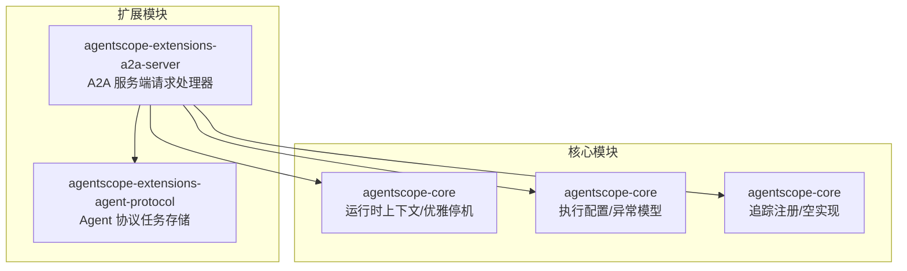
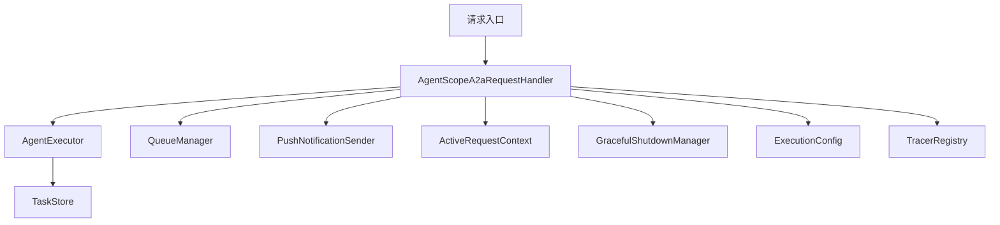
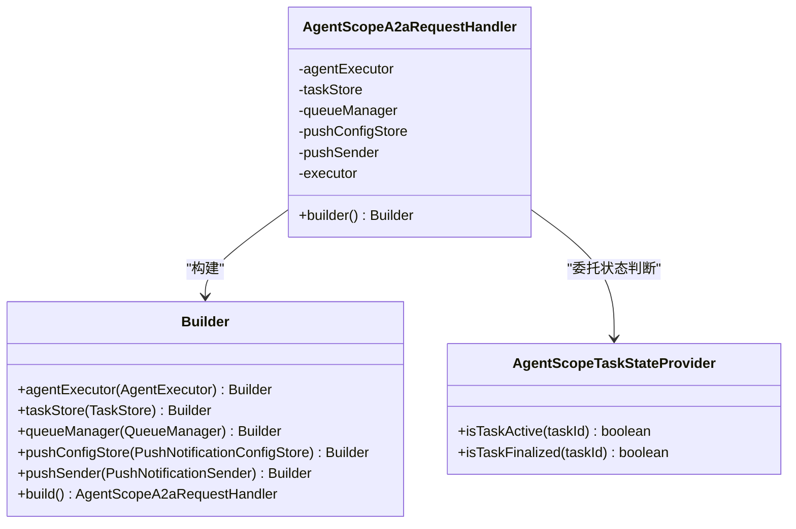
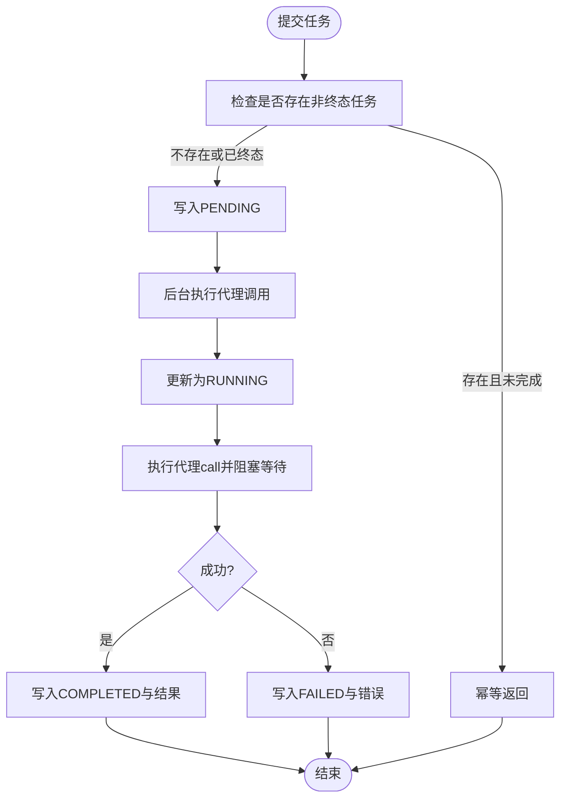
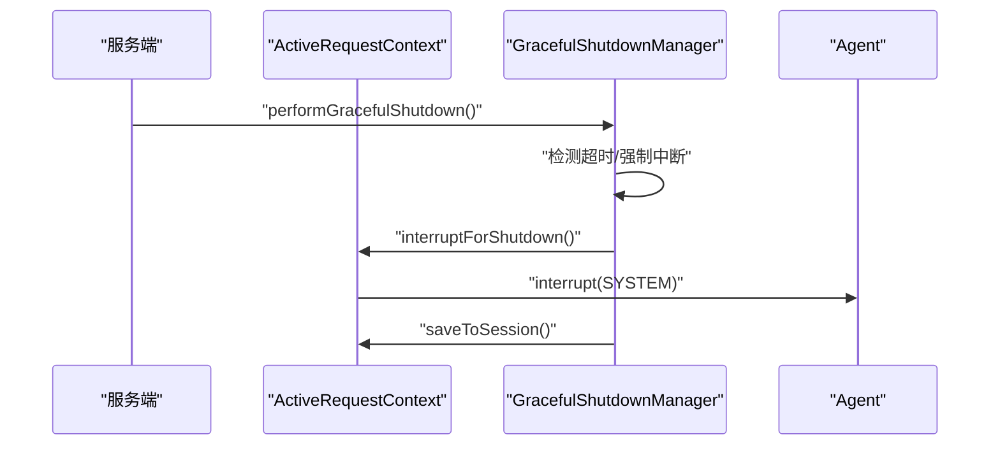
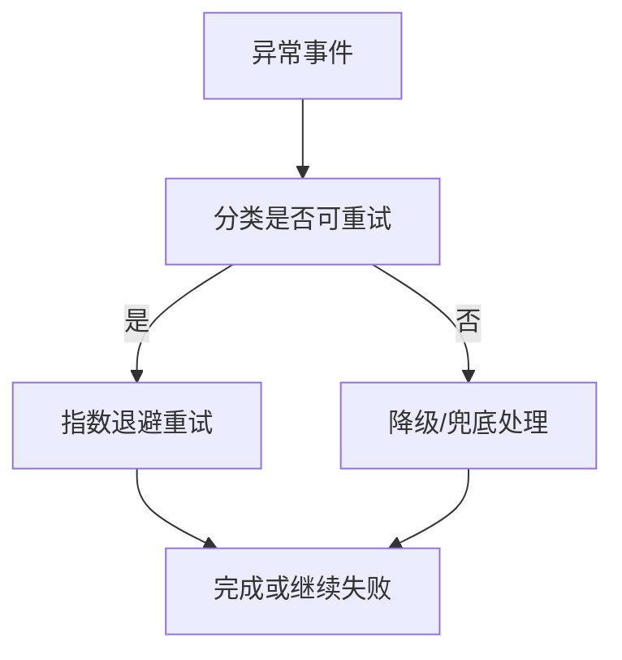
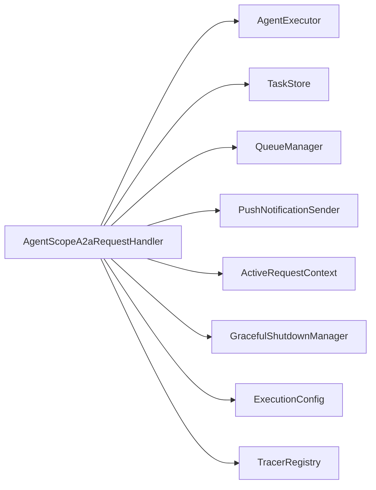

# 请求处理器

<cite>
**本文引用的文件**
- [AgentScopeA2aRequestHandler.java](file://agentscope-extensions/agentscope-extensions-a2a/agentscope-extensions-a2a-server/src/main/java/io/agentscope/core/a2a/server/request/AgentScopeA2aRequestHandler.java)
- [AgentProtocolTaskStore.java](file://agentscope-extensions/agentscope-extensions-agent-protocol/src/main/java/io/agentscope/extensions/agentprotocol/AgentProtocolTaskStore.java)
- [ActiveRequestContext.java](file://agentscope-core/src/main/java/io/agentscope/core/shutdown/ActiveRequestContext.java)
- [GracefulShutdownManager.java](file://agentscope-core/src/main/java/io/agentscope/core/shutdown/GracefulShutdownManager.java)
- [ExecutionConfig.java](file://agentscope-core/src/main/java/io/agentscope/core/model/ExecutionConfig.java)
- [HttpTransportException.java](file://agentscope-core/src/main/java/io/agentscope/core/model/transport/HttpTransportException.java)
- [TracerRegistry.java](file://agentscope-core/src/main/java/io/agentscope/core/tracing/TracerRegistry.java)
- [NoopTracer.java](file://agentscope-core/src/main/java/io/agentscope/core/tracing/NoopTracer.java)
- [application.yml（A2A 示例）](file://agentscope-examples/a2a/src/main/resources/application.yml)
- [logback.xml（A2A 示例）](file://agentscope-examples/a2a/src/main/resources/logback.xml)
</cite>

## 目录
1. [简介](#简介)
2. [项目结构](#项目结构)
3. [核心组件](#核心组件)
4. [架构总览](#架构总览)
5. [详细组件分析](#详细组件分析)
6. [依赖分析](#依赖分析)
7. [性能考虑](#性能考虑)
8. [故障排查指南](#故障排查指南)
9. [结论](#结论)
10. [附录](#附录)

## 简介
本文件面向 A2A 请求处理器，系统化梳理 AgentScopeA2aRequestHandler 的请求处理架构与路由机制，覆盖请求解析、验证、分发、任务存储（TaskStore）、队列管理（QueueManager）、推送通知集成、请求上下文与状态跟踪、限流/熔断/降级策略、日志与审计、性能监控、错误处理与响应格式化，以及配置优化与调试技巧。目标是帮助开发者快速理解并高效运维 A2A 服务端请求处理链路。

## 项目结构
A2A 请求处理相关代码主要分布在以下模块：
- 扩展模块：A2A 服务端请求处理器与协议扩展
- 核心模块：运行时上下文、优雅停机、执行配置与异常模型、追踪注册等

图表来源
- [AgentScopeA2aRequestHandler.java:1-178](file://agentscope-extensions/agentscope-extensions-a2a/agentscope-extensions-a2a-server/src/main/java/io/agentscope/core/a2a/server/request/AgentScopeA2aRequestHandler.java#L1-L178)
- [AgentProtocolTaskStore.java:1-300](file://agentscope-extensions/agentscope-extensions-agent-protocol/src/main/java/io/agentscope/extensions/agentprotocol/AgentProtocolTaskStore.java#L1-L300)

章节来源
- [AgentScopeA2aRequestHandler.java:1-178](file://agentscope-extensions/agentscope-extensions-a2a/agentscope-extensions-a2a-server/src/main/java/io/agentscope/core/a2a/server/request/AgentScopeA2aRequestHandler.java#L1-L178)
- [AgentProtocolTaskStore.java:1-300](file://agentscope-extensions/agentscope-extensions-agent-protocol/src/main/java/io/agentscope/extensions/agentprotocol/AgentProtocolTaskStore.java#L1-L300)

## 核心组件
- 请求处理器：封装默认请求处理器，注入 AgentExecutor、TaskStore、QueueManager、PushNotification 相关组件，并通过 Builder 构建默认实现。
- 任务存储：基于工作区持久化与内存执行句柄的协议任务存储，支持提交、轮询、取消与快照。
- 队列管理：根据任务状态提供“活跃/终态”判断，支撑异步任务调度与状态查询。
- 推送通知：配置存储与发送器的组合，默认内存实现，可替换为外部推送通道。
- 上下文与优雅停机：ActiveRequestContext 与 GracefulShutdownManager 提供请求中断与状态落盘能力。
- 执行配置与异常：统一的重试策略与异常分类，便于限流/熔断/降级落地。
- 追踪与日志：TracerRegistry 全局钩子与示例日志配置，便于可观测性接入。

章节来源
- [AgentScopeA2aRequestHandler.java:36-178](file://agentscope-extensions/agentscope-extensions-a2a/agentscope-extensions-a2a-server/src/main/java/io/agentscope/core/a2a/server/request/AgentScopeA2aRequestHandler.java#L36-L178)
- [AgentProtocolTaskStore.java:47-300](file://agentscope-extensions/agentscope-extensions-agent-protocol/src/main/java/io/agentscope/extensions/agentprotocol/AgentProtocolTaskStore.java#L47-L300)
- [ActiveRequestContext.java:37-77](file://agentscope-core/src/main/java/io/agentscope/core/shutdown/ActiveRequestContext.java#L37-L77)
- [GracefulShutdownManager.java:180-266](file://agentscope-core/src/main/java/io/agentscope/core/shutdown/GracefulShutdownManager.java#L180-L266)
- [ExecutionConfig.java:63-105](file://agentscope-core/src/main/java/io/agentscope/core/model/ExecutionConfig.java#L63-L105)
- [TracerRegistry.java:44-76](file://agentscope-core/src/main/java/io/agentscope/core/tracing/TracerRegistry.java#L44-L76)

## 架构总览
A2A 请求处理器在服务端接收请求后，委派给 AgentExecutor 执行；任务状态由 TaskStore 持久化，QueueManager 基于 TaskStore 查询任务活跃度；推送通知通过 PushNotificationSender 发送；请求上下文与优雅停机保障长耗时请求的可控中断与落盘。

图表来源
- [AgentScopeA2aRequestHandler.java:36-178](file://agentscope-extensions/agentscope-extensions-a2a/agentscope-extensions-a2a-server/src/main/java/io/agentscope/core/a2a/server/request/AgentScopeA2aRequestHandler.java#L36-L178)
- [ActiveRequestContext.java:37-77](file://agentscope-core/src/main/java/io/agentscope/core/shutdown/ActiveRequestContext.java#L37-L77)
- [GracefulShutdownManager.java:180-266](file://agentscope-core/src/main/java/io/agentscope/core/shutdown/GracefulShutdownManager.java#L180-L266)
- [ExecutionConfig.java:63-105](file://agentscope-core/src/main/java/io/agentscope/core/model/ExecutionConfig.java#L63-L105)
- [TracerRegistry.java:44-76](file://agentscope-core/src/main/java/io/agentscope/core/tracing/TracerRegistry.java#L44-L76)

## 详细组件分析

### 请求处理器：AgentScopeA2aRequestHandler
- 角色定位：对默认请求处理器进行包装，注入 AgentExecutor、TaskStore、QueueManager、PushNotification 相关组件。
- 构建策略：
  - 若未显式提供 TaskStore，则默认使用内存任务存储。
  - 若未显式提供 QueueManager，则依据 TaskStore 类型选择内存队列或基于 TaskStore 的状态提供者。
  - 若未显式提供推送配置与发送器，则使用内存配置与基础发送器。
  - 内置超时属性通过反射临时设置，避免用户配置缺失导致阻塞请求立即失败。
- 关键内部类：AgentScopeTaskStateProvider 实现 TaskStateProvider，基于 TaskStore 判断任务是否“活跃/终态”。

图表来源
- [AgentScopeA2aRequestHandler.java:36-178](file://agentscope-extensions/agentscope-extensions-a2a/agentscope-extensions-a2a-server/src/main/java/io/agentscope/core/a2a/server/request/AgentScopeA2aRequestHandler.java#L36-L178)

章节来源
- [AgentScopeA2aRequestHandler.java:36-178](file://agentscope-extensions/agentscope-extensions-a2a/agentscope-extensions-a2a-server/src/main/java/io/agentscope/core/a2a/server/request/AgentScopeA2aRequestHandler.java#L36-L178)

### 任务存储：AgentProtocolTaskStore
- 功能职责：以工作区为持久化源，结合内存执行句柄，提供任务提交、轮询、取消与快照能力；支持并发任务去重与幂等。
- 生命周期：
  - 提交：写入 PENDING 状态，启动后台执行。
  - 运行：更新为 RUNNING，执行代理调用，阻塞等待结果。
  - 完成/失败：写入最终状态与结果/错误信息。
- 查询与等待：支持按 taskId 查询快照与等待终态，内置指数退避策略。
- 取消：尝试取消执行句柄并更新为 CANCELLED（若尚未终态）。

图表来源
- [AgentProtocolTaskStore.java:85-136](file://agentscope-extensions/agentscope-extensions-agent-protocol/src/main/java/io/agentscope/extensions/agentprotocol/AgentProtocolTaskStore.java#L85-L136)

章节来源
- [AgentProtocolTaskStore.java:47-300](file://agentscope-extensions/agentscope-extensions-agent-protocol/src/main/java/io/agentscope/extensions/agentprotocol/AgentProtocolTaskStore.java#L47-L300)

### 队列管理与状态提供
- 队列管理器：根据任务状态提供“活跃/终态”判断，支撑异步任务调度与状态查询。
- 状态提供者：基于 TaskStore 查询任务状态，判定是否仍在运行中或已进入终态。

章节来源
- [AgentScopeA2aRequestHandler.java:151-176](file://agentscope-extensions/agentscope-extensions-a2a/agentscope-extensions-a2a-server/src/main/java/io/agentscope/core/a2a/server/request/AgentScopeA2aRequestHandler.java#L151-L176)

### 推送通知集成
- 组件构成：配置存储（内存/外部）与发送器（基础/自定义），默认使用内存配置与基础发送器。
- 集成方式：请求处理器在构建时注入 PushNotificationConfigStore 与 PushNotificationSender，用于异步结果通知或回调。

章节来源
- [AgentScopeA2aRequestHandler.java:24-31](file://agentscope-extensions/agentscope-extensions-a2a/agentscope-extensions-a2a-server/src/main/java/io/agentscope/core/a2a/server/request/AgentScopeA2aRequestHandler.java#L24-L31)
- [AgentScopeA2aRequestHandler.java:107-112](file://agentscope-extensions/agentscope-extensions-a2a/agentscope-extensions-a2a-server/src/main/java/io/agentscope/core/a2a/server/request/AgentScopeA2aRequestHandler.java#L107-L112)

### 请求上下文与状态跟踪
- ActiveRequestContext：保存请求 ID、绑定会话与会话键，支持在优雅停机时中断并落盘。
- GracefulShutdownManager：统一管理优雅停机流程，超时强制中断并落盘，保证数据一致性。

图表来源
- [ActiveRequestContext.java:37-77](file://agentscope-core/src/main/java/io/agentscope/core/shutdown/ActiveRequestContext.java#L37-L77)
- [GracefulShutdownManager.java:180-266](file://agentscope-core/src/main/java/io/agentscope/core/shutdown/GracefulShutdownManager.java#L180-L266)

章节来源
- [ActiveRequestContext.java:37-77](file://agentscope-core/src/main/java/io/agentscope/core/shutdown/ActiveRequestContext.java#L37-L77)
- [GracefulShutdownManager.java:180-266](file://agentscope-core/src/main/java/io/agentscope/core/shutdown/GracefulShutdownManager.java#L180-L266)

### 错误处理与响应格式化
- 异常模型：HTTP 传输异常包含状态码、响应体等，便于统一格式化与上报。
- 执行配置：统一的重试策略与可重试错误分类（如 429/5xx/超时/网络 IO），为限流/熔断/降级提供基础。

图表来源
- [ExecutionConfig.java:63-105](file://agentscope-core/src/main/java/io/agentscope/core/model/ExecutionConfig.java#L63-L105)
- [HttpTransportException.java:164-187](file://agentscope-core/src/main/java/io/agentscope/core/model/transport/HttpTransportException.java#L164-L187)

章节来源
- [ExecutionConfig.java:63-105](file://agentscope-core/src/main/java/io/agentscope/core/model/ExecutionConfig.java#L63-L105)
- [HttpTransportException.java:164-187](file://agentscope-core/src/main/java/io/agentscope/core/model/transport/HttpTransportException.java#L164-L187)

### 性能监控与追踪
- 追踪注册：通过 TracerRegistry 注册全局 Reactor 钩子，自动在异步边界传播追踪上下文。
- 空实现：NoopTracer 作为默认占位，避免未配置时的空指针问题。

章节来源
- [TracerRegistry.java:44-76](file://agentscope-core/src/main/java/io/agentscope/core/tracing/TracerRegistry.java#L44-L76)
- [NoopTracer.java:1-19](file://agentscope-core/src/main/java/io/agentscope/core/tracing/NoopTracer.java#L1-L19)

## 依赖分析
- 组件耦合：
  - 请求处理器强依赖 AgentExecutor 与 TaskStore；QueueManager 依赖 TaskStore 的状态提供能力。
  - 推送通知组件与请求处理器解耦，可通过配置切换实现。
  - 优雅停机与请求上下文在核心模块，被请求处理器间接使用。
- 外部依赖：
  - A2A 协议规范与消息模型来自外部库（在请求处理器中以接口形式出现）。
  - 日志与配置通过示例资源文件提供参考。

图表来源
- [AgentScopeA2aRequestHandler.java:36-178](file://agentscope-extensions/agentscope-extensions-a2a/agentscope-extensions-a2a-server/src/main/java/io/agentscope/core/a2a/server/request/AgentScopeA2aRequestHandler.java#L36-L178)

章节来源
- [AgentScopeA2aRequestHandler.java:36-178](file://agentscope-extensions/agentscope-extensions-a2a/agentscope-extensions-a2a-server/src/main/java/io/agentscope/core/a2a/server/request/AgentScopeA2aRequestHandler.java#L36-L178)

## 性能考虑
- 线程池与并发：
  - 请求处理器默认使用缓存线程池执行异步任务，建议结合业务负载调整线程池大小与拒绝策略。
  - 任务存储使用守护线程池执行代理调用，避免长时间占用主线程。
- 轮询与退避：
  - 任务等待采用指数退避策略，降低频繁轮询带来的压力。
- 超时控制：
  - 通过反射设置默认超时参数，避免阻塞请求立即失败；建议在生产环境通过配置中心统一管理超时阈值。
- 追踪开销：
  - 全局追踪钩子会对所有 Reactor 流引入额外开销，仅在需要跨边界传播上下文时启用。

章节来源
- [AgentScopeA2aRequestHandler.java:120-148](file://agentscope-extensions/agentscope-extensions-a2a/agentscope-extensions-a2a-server/src/main/java/io/agentscope/core/a2a/server/request/AgentScopeA2aRequestHandler.java#L120-L148)
- [AgentProtocolTaskStore.java:53-60](file://agentscope-extensions/agentscope-extensions-agent-protocol/src/main/java/io/agentscope/extensions/agentprotocol/AgentProtocolTaskStore.java#L53-L60)
- [AgentProtocolTaskStore.java:259-262](file://agentscope-extensions/agentscope-extensions-agent-protocol/src/main/java/io/agentscope/extensions/agentprotocol/AgentProtocolTaskStore.java#L259-L262)

## 故障排查指南
- 请求超时与阻塞：
  - 若阻塞请求立即返回内部错误，检查是否正确设置了超时参数（请求处理器已通过反射设置默认值）。
- 任务状态不一致：
  - 检查 TaskStore 是否正确持久化；确认 QueueManager 的状态提供逻辑与 TaskStore 保持一致。
- 优雅停机中断：
  - 若请求在停机过程中被中断，确认 ActiveRequestContext 是否正确保存到会话，以及 GracefulShutdownManager 的超时策略是否合理。
- 异常分类与重试：
  - 对于 429/5xx/超时/网络 IO 等错误，系统按可重试策略处理；对于 400/401/403 等错误，不会重试，需检查上游参数与鉴权。
- 日志与追踪：
  - 使用示例日志配置输出关键路径日志；开启全局追踪钩子以捕获跨边界上下文。

章节来源
- [AgentScopeA2aRequestHandler.java:133-148](file://agentscope-extensions/agentscope-extensions-a2a/agentscope-extensions-a2a-server/src/main/java/io/agentscope/core/a2a/server/request/AgentScopeA2aRequestHandler.java#L133-L148)
- [GracefulShutdownManager.java:241-266](file://agentscope-core/src/main/java/io/agentscope/core/shutdown/GracefulShutdownManager.java#L241-L266)
- [ExecutionConfig.java:63-105](file://agentscope-core/src/main/java/io/agentscope/core/model/ExecutionConfig.java#L63-L105)
- [application.yml（A2A 示例）](file://agentscope-examples/a2a/src/main/resources/application.yml)
- [logback.xml（A2A 示例）](file://agentscope-examples/a2a/src/main/resources/logback.xml)

## 结论
AgentScopeA2aRequestHandler 将 A2A 协议请求处理与任务生命周期管理、队列调度、推送通知、优雅停机与可观测性有机结合。通过可插拔的 TaskStore/QueueManager/PushNotification 组件，可在不同部署场景灵活适配；配合统一的执行配置与异常模型，为限流/熔断/降级提供了坚实基础。建议在生产环境中完善超时与线程池配置、启用追踪与日志、并结合任务存储的持久化能力进行审计与回溯。

## 附录
- 配置优化建议：
  - 超时参数：通过配置中心集中管理，避免硬编码。
  - 线程池：根据任务并发度与 CPU/IO 特性调优。
  - 重试策略：结合业务 SLA 与下游稳定性调整初始退避、最大退避与倍数。
- 调试技巧：
  - 开启全局追踪钩子，观察跨边界上下文传播。
  - 使用任务快照与等待接口定位卡顿环节。
  - 在优雅停机前打印活动请求统计，评估停机窗口与中断策略。