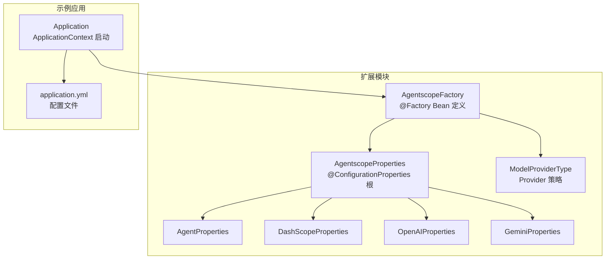
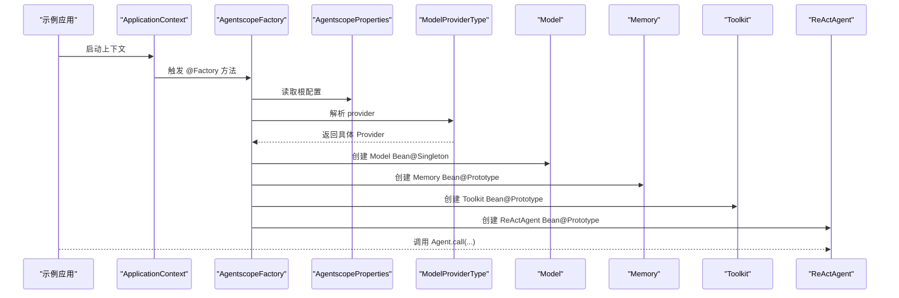
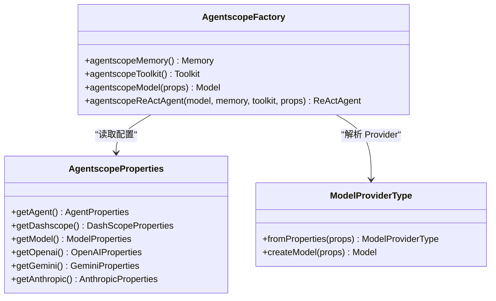
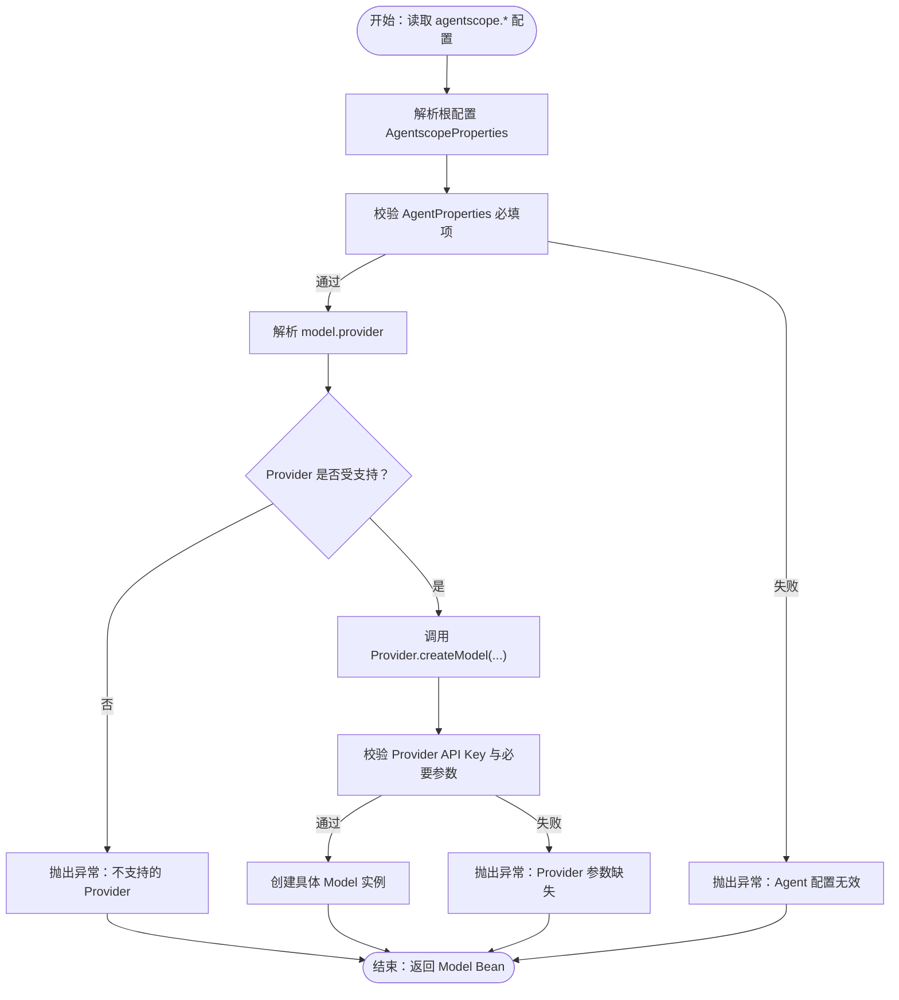
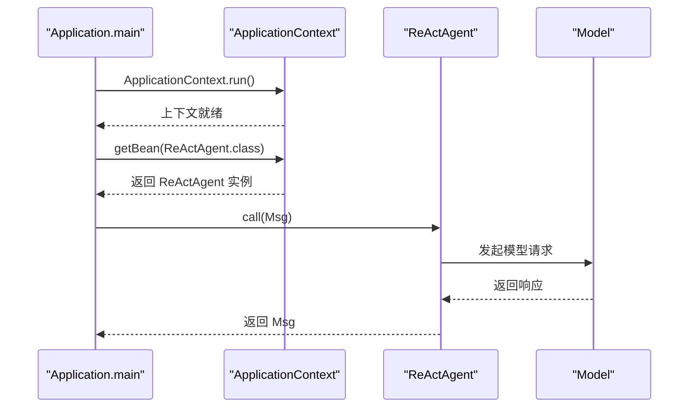
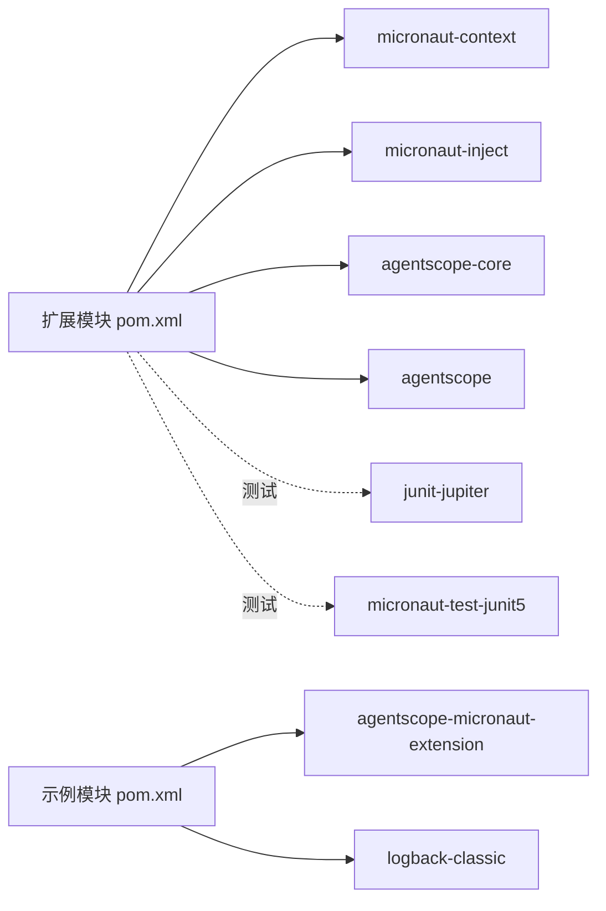

# Micronaut 集成

<cite>
**本文引用的文件**
- [AgentscopeFactory.java](file://agentscope-extensions/agentscope-micronaut-extensions/agentscope-micronaut-extension/src/main/java/io/agentscope/micronaut/AgentscopeFactory.java)
- [AgentscopeProperties.java](file://agentscope-extensions/agentscope-micronaut-extensions/agentscope-micronaut-extension/src/main/java/io/agentscope/micronaut/properties/AgentscopeProperties.java)
- [AgentProperties.java](file://agentscope-extensions/agentscope-micronaut-extensions/agentscope-micronaut-extension/src/main/java/io/agentscope/micronaut/properties/AgentProperties.java)
- [DashScopeProperties.java](file://agentscope-extensions/agentscope-micronaut-extensions/agentscope-micronaut-extension/src/main/java/io/agentscope/micronaut/properties/DashScopeProperties.java)
- [OpenAIProperties.java](file://agentscope-extensions/agentscope-micronaut-extensions/agentscope-micronaut-extension/src/main/java/io/agentscope/micronaut/properties/OpenAIProperties.java)
- [GeminiProperties.java](file://agentscope-extensions/agentscope-micronaut-extensions/agentscope-micronaut-extension/src/main/java/io/agentscope/micronaut/properties/GeminiProperties.java)
- [ModelProviderType.java](file://agentscope-extensions/agentscope-micronaut-extensions/agentscope-micronaut-extension/src/main/java/io/agentscope/micronaut/model/ModelProviderType.java)
- [Application.java](file://agentscope-examples/micronaut/src/main/java/io/agentscope/examples/micronaut/Application.java)
- [application.yml](file://agentscope-examples/micronaut/src/main/resources/application.yml)
- [pom.xml（扩展模块）](file://agentscope-extensions/agentscope-micronaut-extensions/agentscope-micronaut-extension/pom.xml)
- [pom.xml（示例模块）](file://agentscope-examples/micronaut/pom.xml)
- [AgentscopeFactoryTest.java](file://agentscope-extensions/agentscope-micronaut-extensions/agentscope-micronaut-extension/src/test/java/io/agentscope/micronaut/AgentscopeFactoryTest.java)
</cite>

## 目录
1. [简介](#简介)
2. [项目结构](#项目结构)
3. [核心组件](#核心组件)
4. [架构总览](#架构总览)
5. [组件详解](#组件详解)
6. [依赖关系分析](#依赖关系分析)
7. [性能考量](#性能考量)
8. [故障排查指南](#故障排查指南)
9. [结论](#结论)
10. [附录](#附录)

## 简介
本文件面向希望在 Micronaut 框架中集成 AgentScope Java 的开发者，系统性讲解 Micronaut 扩展的设计架构、依赖注入机制、Bean 创建流程、配置属性绑定与生命周期管理，并对比 Micronaut 与传统框架的差异化优势。文档覆盖以下关键主题：
- @Factory 注解与 Bean 生命周期：Singleton、Prototype 的选择策略与线程安全性考虑
- @ConfigurationProperties 的分层配置映射：根配置与各 Provider 子配置
- 运行时优化特性：编译期元数据、启动时间优化、原生镜像支持
- 完整示例：从构建配置到运行与测试
- 健康检查与 AOP 支持：结合 Micronaut 生态实践
- 性能优化建议与常见问题解决方案

## 项目结构
该集成模块位于 agentscope-extensions/agentscope-micronaut-extensions 下，包含扩展实现与示例应用两部分：
- 扩展实现：提供 Micronaut 工厂与配置属性，自动装配 AgentScope 的 Model、Memory、Toolkit、ReActAgent
- 示例应用：演示如何通过 ApplicationContext 获取 ReActAgent 并进行对话调用

图表来源
- [AgentscopeFactory.java:115-201](file://agentscope-extensions/agentscope-micronaut-extensions/agentscope-micronaut-extension/src/main/java/io/agentscope/micronaut/AgentscopeFactory.java#L115-L201)
- [AgentscopeProperties.java:35-73](file://agentscope-extensions/agentscope-micronaut-extensions/agentscope-micronaut-extension/src/main/java/io/agentscope/micronaut/properties/AgentscopeProperties.java#L35-L73)
- [AgentProperties.java:34-88](file://agentscope-extensions/agentscope-micronaut-extensions/agentscope-micronaut-extension/src/main/java/io/agentscope/micronaut/properties/AgentProperties.java#L34-L88)
- [DashScopeProperties.java:35-102](file://agentscope-extensions/agentscope-micronaut-extensions/agentscope-micronaut-extension/src/main/java/io/agentscope/micronaut/properties/DashScopeProperties.java#L35-L102)
- [OpenAIProperties.java:38-120](file://agentscope-extensions/agentscope-micronaut-extensions/agentscope-micronaut-extension/src/main/java/io/agentscope/micronaut/properties/OpenAIProperties.java#L38-L120)
- [GeminiProperties.java:51-144](file://agentscope-extensions/agentscope-micronaut-extensions/agentscope-micronaut-extension/src/main/java/io/agentscope/micronaut/properties/GeminiProperties.java#L51-L144)
- [ModelProviderType.java:34-188](file://agentscope-extensions/agentscope-micronaut-extensions/agentscope-micronaut-extension/src/main/java/io/agentscope/micronaut/model/ModelProviderType.java#L34-L188)
- [Application.java:40-82](file://agentscope-examples/micronaut/src/main/java/io/agentscope/examples/micronaut/Application.java#L40-L82)
- [application.yml:17-73](file://agentscope-examples/micronaut/src/main/resources/application.yml#L17-L73)

章节来源
- [AgentscopeFactory.java:115-201](file://agentscope-extensions/agentscope-micronaut-extensions/agentscope-micronaut-extension/src/main/java/io/agentscope/micronaut/AgentscopeFactory.java#L115-L201)
- [Application.java:40-82](file://agentscope-examples/micronaut/src/main/java/io/agentscope/examples/micronaut/Application.java#L40-L82)

## 核心组件
- 工厂类（@Factory）：集中定义默认 Bean，按需启用与覆盖
- 配置属性（@ConfigurationProperties）：分层映射 agentscope.* 根配置与各 Provider 子配置
- Provider 策略：根据配置选择具体 Model 实现（DashScope、OpenAI、Gemini、Anthropic）
- 示例应用：展示 ApplicationContext 启动与 Bean 注入

章节来源
- [AgentscopeFactory.java:115-201](file://agentscope-extensions/agentscope-micronaut-extensions/agentscope-micronaut-extension/src/main/java/io/agentscope/micronaut/AgentscopeFactory.java#L115-L201)
- [AgentscopeProperties.java:35-73](file://agentscope-extensions/agentscope-micronaut-extensions/agentscope-micronaut-extension/src/main/java/io/agentscope/micronaut/properties/AgentscopeProperties.java#L35-L73)
- [ModelProviderType.java:34-188](file://agentscope-extensions/agentscope-micronaut-extensions/agentscope-micronaut-extension/src/main/java/io/agentscope/micronaut/model/ModelProviderType.java#L34-L188)

## 架构总览
下图展示了 Micronaut 工厂如何基于配置创建并装配 AgentScope 的核心 Bean。

图表来源
- [AgentscopeFactory.java:115-201](file://agentscope-extensions/agentscope-micronaut-extensions/agentscope-micronaut-extension/src/main/java/io/agentscope/micronaut/AgentscopeFactory.java#L115-L201)
- [AgentscopeProperties.java:35-73](file://agentscope-extensions/agentscope-micronaut-extensions/agentscope-micronaut-extension/src/main/java/io/agentscope/micronaut/properties/AgentscopeProperties.java#L35-L73)
- [ModelProviderType.java:170-188](file://agentscope-extensions/agentscope-micronaut-extensions/agentscope-micronaut-extension/src/main/java/io/agentscope/micronaut/model/ModelProviderType.java#L170-L188)

## 组件详解

### 工厂与 Bean 生命周期
- Memory 与 Toolkit：由于状态不安全且非线程安全，采用 Prototype 作用域；建议在多线程或 Web 环境中按会话/请求惰性获取实例
- Model：采用 Singleton 作用域，避免重复初始化；由 ModelProviderType 根据配置动态创建
- ReActAgent：采用 Prototype 作用域，内部持有会话级状态；通过 AgentProperties 进行参数校验与装配

图表来源
- [AgentscopeFactory.java:115-201](file://agentscope-extensions/agentscope-micronaut-extensions/agentscope-micronaut-extension/src/main/java/io/agentscope/micronaut/AgentscopeFactory.java#L115-L201)
- [AgentscopeProperties.java:35-73](file://agentscope-extensions/agentscope-micronaut-extensions/agentscope-micronaut-extension/src/main/java/io/agentscope/micronaut/properties/AgentscopeProperties.java#L35-L73)
- [ModelProviderType.java:34-188](file://agentscope-extensions/agentscope-micronaut-extensions/agentscope-micronaut-extension/src/main/java/io/agentscope/micronaut/model/ModelProviderType.java#L34-L188)

章节来源
- [AgentscopeFactory.java:119-200](file://agentscope-extensions/agentscope-micronaut-extensions/agentscope-micronaut-extension/src/main/java/io/agentscope/micronaut/AgentscopeFactory.java#L119-L200)

### 配置属性绑定与校验
- 根配置 AgentscopeProperties 将子配置聚合为树状结构
- AgentProperties 提供默认值与必填项校验（名称、系统提示、最大迭代次数）
- Provider 子配置（DashScope、OpenAI、Gemini）分别校验 API Key 与必要参数
- ModelProviderType.fromProperties 支持大小写不敏感的 provider 名称解析

图表来源
- [AgentProperties.java:34-88](file://agentscope-extensions/agentscope-micronaut-extensions/agentscope-micronaut-extension/src/main/java/io/agentscope/micronaut/properties/AgentProperties.java#L34-L88)
- [ModelProviderType.java:34-188](file://agentscope-extensions/agentscope-micronaut-extensions/agentscope-micronaut-extension/src/main/java/io/agentscope/micronaut/model/ModelProviderType.java#L34-L188)
- [DashScopeProperties.java:35-102](file://agentscope-extensions/agentscope-micronaut-extensions/agentscope-micronaut-extension/src/main/java/io/agentscope/micronaut/properties/DashScopeProperties.java#L35-L102)
- [OpenAIProperties.java:38-120](file://agentscope-extensions/agentscope-micronaut-extensions/agentscope-micronaut-extension/src/main/java/io/agentscope/micronaut/properties/OpenAIProperties.java#L38-L120)
- [GeminiProperties.java:51-144](file://agentscope-extensions/agentscope-micronaut-extensions/agentscope-micronaut-extension/src/main/java/io/agentscope/micronaut/properties/GeminiProperties.java#L51-L144)

章节来源
- [AgentscopeProperties.java:35-73](file://agentscope-extensions/agentscope-micronaut-extensions/agentscope-micronaut-extension/src/main/java/io/agentscope/micronaut/properties/AgentscopeProperties.java#L35-L73)
- [AgentProperties.java:34-88](file://agentscope-extensions/agentscope-micronaut-extensions/agentscope-micronaut-extension/src/main/java/io/agentscope/micronaut/properties/AgentProperties.java#L34-L88)
- [ModelProviderType.java:170-188](file://agentscope-extensions/agentscope-micronaut-extensions/agentscope-micronaut-extension/src/main/java/io/agentscope/micronaut/model/ModelProviderType.java#L170-L188)

### 示例应用与运行流程
示例应用通过 ApplicationContext 启动，自动注入 ReActAgent 并执行对话调用。

图表来源
- [Application.java:42-82](file://agentscope-examples/micronaut/src/main/java/io/agentscope/examples/micronaut/Application.java#L42-L82)

章节来源
- [Application.java:42-82](file://agentscope-examples/micronaut/src/main/java/io/agentscope/examples/micronaut/Application.java#L42-L82)
- [application.yml:23-73](file://agentscope-examples/micronaut/src/main/resources/application.yml#L23-L73)

## 依赖关系分析
- 扩展模块依赖 Micronaut 上下文与注解处理器，以及 AgentScope 核心与主模块
- 示例模块依赖扩展模块与核心模块，并配置 exec 插件用于直接运行示例入口类
- 测试模块验证工厂 Bean 的创建、Provider 切换、配置校验与错误处理

图表来源
- [pom.xml（扩展模块）:50-104](file://agentscope-extensions/agentscope-micronaut-extensions/agentscope-micronaut-extension/pom.xml#L50-L104)
- [pom.xml（示例模块）:51-71](file://agentscope-examples/micronaut/pom.xml#L51-L71)

章节来源
- [pom.xml（扩展模块）:50-104](file://agentscope-extensions/agentscope-micronaut-extensions/agentscope-micronaut-extension/pom.xml#L50-L104)
- [pom.xml（示例模块）:51-71](file://agentscope-examples/micronaut/pom.xml#L51-L71)

## 性能考量
- 启动时间优化：利用 Micronaut 编译期元数据与原生镜像能力，减少运行时反射与类扫描开销
- 内存占用：Model 使用 Singleton，避免重复初始化；Memory 与 Toolkit 使用 Prototype，按需创建，降低共享状态带来的锁竞争
- 线程安全：明确标注非线程安全组件的作用域与使用方式，避免并发访问导致的状态不一致
- 配置校验：在 Bean 创建阶段尽早失败，避免运行时因配置错误引发的资源浪费

## 故障排查指南
- Provider 未启用或 API Key 缺失：检查对应 Provider 的 enabled 与 api-key 配置
- Agent 配置缺失：确保 agentscope.agent.name、agentscope.agent.sys-prompt、agentscope.agent.max-iters 均已正确设置
- Provider 名称大小写：支持大小写不敏感，但请确认拼写正确
- 单元测试参考：通过测试用例验证不同 Provider 的 Bean 创建、禁用 Agent 的行为、配置校验与错误抛出

章节来源
- [AgentscopeFactoryTest.java:51-334](file://agentscope-extensions/agentscope-micronaut-extensions/agentscope-micronaut-extension/src/test/java/io/agentscope/micronaut/AgentscopeFactoryTest.java#L51-L334)

## 结论
该 Micronaut 集成通过 @Factory 与 @ConfigurationProperties 将 AgentScope 的核心组件以声明式方式注入到应用上下文中，配合 Provider 策略与严格的配置校验，实现了即插即用的多模型支持。结合 Micronaut 的启动优化与原生镜像能力，可在云原生环境中获得更优的启动性能与资源占用表现。

## 附录

### 构建与运行
- 在示例模块中，可通过 exec 插件直接运行示例入口类
- 运行前设置相应环境变量（如 DASHSCOPE_API_KEY），并在 application.yml 中完成基础配置

章节来源
- [pom.xml（示例模块）:74-85](file://agentscope-examples/micronaut/pom.xml#L74-L85)
- [application.yml:17-73](file://agentscope-examples/micronaut/src/main/resources/application.yml#L17-L73)

### 测试支持
- 使用 Micronaut Test 与 JUnit 5 进行集成测试，覆盖 Bean 创建、Provider 切换、配置校验与异常场景

章节来源
- [pom.xml（扩展模块）:86-104](file://agentscope-extensions/agentscope-micronaut-extensions/agentscope-micronaut-extension/pom.xml#L86-L104)
- [AgentscopeFactoryTest.java:48-49](file://agentscope-extensions/agentscope-micronaut-extensions/agentscope-micronaut-extension/src/test/java/io/agentscope/micronaut/AgentscopeFactoryTest.java#L48-L49)

### 生产部署建议
- 使用 Micronaut 原生镜像插件生成 GraalVM 原生可执行文件，缩短冷启动时间
- 在容器化部署中，将敏感配置（API Key）通过环境变量注入，并在 CI/CD 中统一管理密钥

章节来源
- [pom.xml（扩展模块）:32-36](file://agentscope-extensions/agentscope-micronaut-extensions/agentscope-micronaut-extension/pom.xml#L32-L36)

### Micronaut 特有注解与 AOP、健康检查
- 注解：@Factory、@Singleton、@Prototype、@Requires、@ConfigurationProperties
- AOP：可结合 Micronaut AOP 进行横切增强（如日志、指标采集）
- 健康检查：可基于 Micronaut Health 模块暴露服务健康状态

章节来源
- [AgentscopeFactory.java:26-29](file://agentscope-extensions/agentscope-micronaut-extensions/agentscope-micronaut-extension/src/main/java/io/agentscope/micronaut/AgentscopeFactory.java#L26-L29)
- [AgentscopeProperties.java:35-35](file://agentscope-extensions/agentscope-micronaut-extensions/agentscope-micronaut-extension/src/main/java/io/agentscope/micronaut/properties/AgentscopeProperties.java#L35-L35)