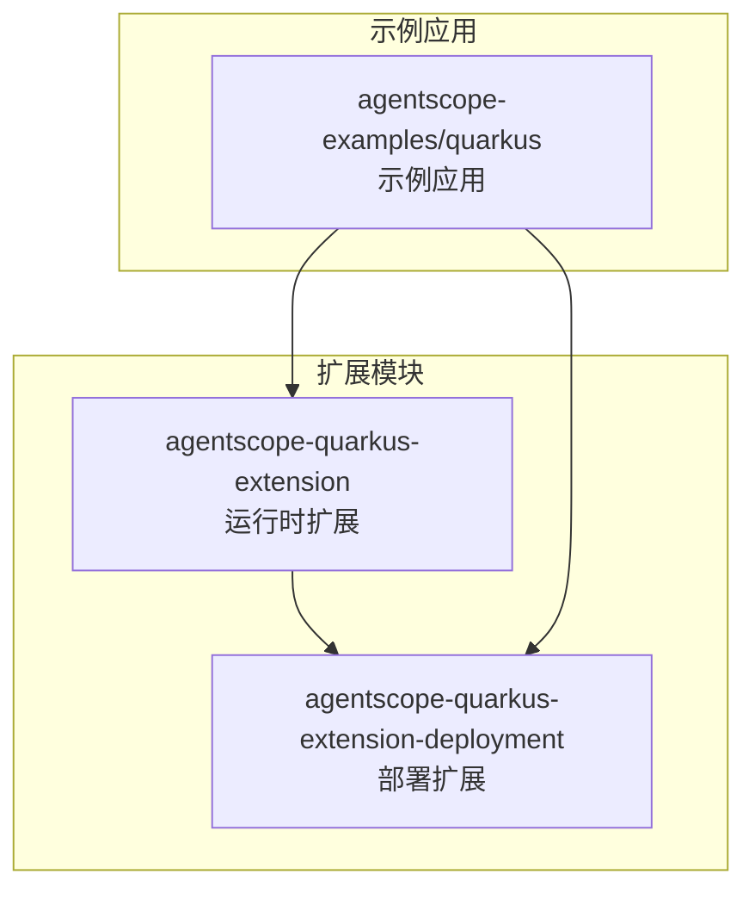
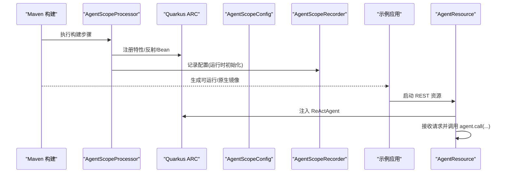
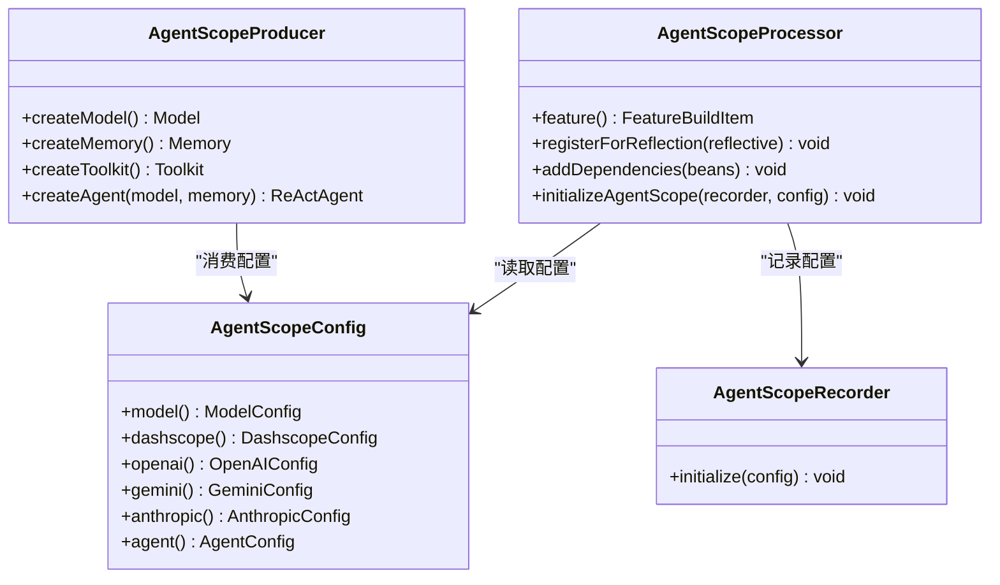
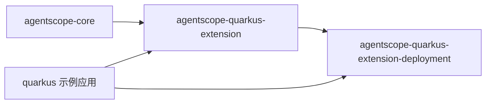

# Quarkus 集成

<cite>
**本文引用的文件**
- [AgentScopeConfig.java](file://agentscope-extensions/agentscope-quarkus-extensions/agentscope-quarkus-extension/src/main/java/io/agentscope/quarkus/runtime/AgentScopeConfig.java)
- [AgentScopeProducer.java](file://agentscope-extensions/agentscope-quarkus-extensions/agentscope-quarkus-extension/src/main/java/io/agentscope/quarkus/runtime/AgentScopeProducer.java)
- [AgentScopeRecorder.java](file://agentscope-extensions/agentscope-quarkus-extensions/agentscope-quarkus-extension/src/main/java/io/agentscope/quarkus/runtime/AgentScopeRecorder.java)
- [AgentScopeProcessor.java](file://agentscope-extensions/agentscope-quarkus-extensions/agentscope-quarkus-extension-deployment/src/main/java/io/agentscope/quarkus/deployment/AgentScopeProcessor.java)
- [agentscope-quarkus-extension/pom.xml](file://agentscope-extensions/agentscope-quarkus-extensions/agentscope-quarkus-extension/pom.xml)
- [agentscope-quarkus-extension-deployment/pom.xml](file://agentscope-extensions/agentscope-quarkus-extensions/agentscope-quarkus-extension-deployment/pom.xml)
- [agentscope-quarkus-extensions 根 POM](file://agentscope-extensions/agentscope-quarkus-extensions/pom.xml)
- [README.md（Quarkus 扩展）](file://agentscope-extensions/agentscope-quarkus-extensions/README.md)
- [AgentResource.java（示例）](file://agentscope-examples/quarkus/src/main/java/io/agentscope/examples/quarkus/AgentResource.java)
- [application.properties（示例）](file://agentscope-examples/quarkus/src/main/resources/application.properties)
- [quarkus 示例 POM](file://agentscope-examples/quarkus/pom.xml)
- [AgentScopeProducerTest.java](file://agentscope-extensions/agentscope-quarkus-extensions/agentscope-quarkus-extension/src/test/java/io/agentscope/quarkus/runtime/AgentScopeProducerTest.java)
- [AgentScopeProcessorTest.java](file://agentscope-extensions/agentscope-quarkus-extensions/agentscope-quarkus-extension-deployment/src/test/java/io/agentscope/quarkus/deployment/AgentScopeProcessorTest.java)
</cite>

## 目录
1. [简介](#简介)
2. [项目结构](#项目结构)
3. [核心组件](#核心组件)
4. [架构总览](#架构总览)
5. [详细组件分析](#详细组件分析)
6. [依赖关系分析](#依赖关系分析)
7. [性能考虑](#性能考虑)
8. [故障排除指南](#故障排除指南)
9. [结论](#结论)
10. [附录](#附录)

## 简介
本技术文档面向 AgentScope Java 的 Quarkus 集成模块，系统性阐述以下内容：
- Quarkus 扩展的设计理念与原生镜像支持机制
- 处理器架构、编译时配置与运行时优化
- Deployment 模块的处理器实现、代码生成与资源打包
- Quarkus 无框架配置的优势与与传统 Spring Boot 的差异
- 完整的 Maven 依赖配置与 Quarkus 应用创建步骤
- 原生镜像构建、性能基准测试与生产部署最佳实践
- Quarkus 特有注解、CDI 依赖注入与 RESTEasy 集成
- 故障排除指南与常见问题解决方案

## 项目结构
该集成模块由“运行时扩展”和“部署扩展”两部分组成，配合示例应用共同构成完整的 Quarkus 集成方案。

图表来源
- [agentscope-quarkus-extensions 根 POM:37-40](file://agentscope-extensions/agentscope-quarkus-extensions/pom.xml#L37-L40)
- [agentscope-quarkus-extension/pom.xml:27-44](file://agentscope-extensions/agentscope-quarkus-extensions/agentscope-quarkus-extension/pom.xml#L27-L44)
- [agentscope-quarkus-extension-deployment/pom.xml:27-50](file://agentscope-extensions/agentscope-quarkus-extensions/agentscope-quarkus-extension-deployment/pom.xml#L27-L50)
- [quarkus 示例 POM:28-62](file://agentscope-examples/quarkus/pom.xml#L28-L62)

章节来源
- [agentscope-quarkus-extensions 根 POM:28-40](file://agentscope-extensions/agentscope-quarkus-extensions/pom.xml#L28-L40)
- [README.md（Quarkus 扩展）:1-14](file://agentscope-extensions/agentscope-quarkus-extensions/README.md#L1-L14)

## 核心组件
- 运行时配置映射：通过 SmallRye 配置映射定义类型安全的配置键，覆盖模型提供商、各平台密钥、模型名称、流式开关、思考模式、Vertex AI 参数以及代理名称、系统提示、最大迭代次数等。
- CDI 生产者：自动装配 Model、Memory、Toolkit、ReActAgent，按配置选择具体提供商并设置参数；提供可覆盖的默认 Bean。
- 构建期处理器：注册特性、反射类、CDI Bean，并在运行时初始化配置。
- 记录器：用于在构建期记录配置并在运行时回放。

章节来源
- [AgentScopeConfig.java:24-228](file://agentscope-extensions/agentscope-quarkus-extensions/agentscope-quarkus-extension/src/main/java/io/agentscope/quarkus/runtime/AgentScopeConfig.java#L24-L228)
- [AgentScopeProducer.java:33-248](file://agentscope-extensions/agentscope-quarkus-extensions/agentscope-quarkus-extension/src/main/java/io/agentscope/quarkus/runtime/AgentScopeProducer.java#L33-L248)
- [AgentScopeProcessor.java:47-156](file://agentscope-extensions/agentscope-quarkus-extensions/agentscope-quarkus-extension-deployment/src/main/java/io/agentscope/quarkus/deployment/AgentScopeProcessor.java#L47-L156)
- [AgentScopeRecorder.java:20-38](file://agentscope-extensions/agentscope-quarkus-extensions/agentscope-quarkus-extension/src/main/java/io/agentscope/quarkus/runtime/AgentScopeRecorder.java#L20-L38)

## 架构总览
下图展示了从构建到运行的关键交互：构建期处理器注册反射与 Bean，运行时配置映射与生产者协同工作，最终在示例应用中以 REST 资源注入并使用代理。

图表来源
- [AgentScopeProcessor.java:61-155](file://agentscope-extensions/agentscope-quarkus-extensions/agentscope-quarkus-extension-deployment/src/main/java/io/agentscope/quarkus/deployment/AgentScopeProcessor.java#L61-L155)
- [AgentScopeRecorder.java:35-38](file://agentscope-extensions/agentscope-quarkus-extensions/agentscope-quarkus-extension/src/main/java/io/agentscope/quarkus/runtime/AgentScopeRecorder.java#L35-L38)
- [AgentResource.java（示例）:61-93](file://agentscope-examples/quarkus/src/main/java/io/agentscope/examples/quarkus/AgentResource.java#L61-L93)

## 详细组件分析

### 组件一：运行时配置映射（AgentScopeConfig）
- 设计要点
  - 使用 SmallRye 配置映射与 Quarkus 配置阶段标注，确保配置在运行时可用且类型安全。
  - 支持多提供商（DashScope、OpenAI、Gemini、Anthropic），每个提供商具备独立键空间与默认值。
  - 提供代理级配置（名称、系统提示、最大迭代）。
- 关键接口
  - ModelConfig、DashscopeConfig、OpenAIConfig、GeminiConfig、AnthropicConfig、AgentConfig。
- 典型行为
  - 未显式配置时采用合理默认值；缺失必要密钥或参数时抛出明确异常，便于早期发现配置错误。

章节来源
- [AgentScopeConfig.java:24-228](file://agentscope-extensions/agentscope-quarkus-extensions/agentscope-quarkus-extension/src/main/java/io/agentscope/quarkus/runtime/AgentScopeConfig.java#L24-L228)

### 组件二：CDI 生产者（AgentScopeProducer）
- 设计要点
  - 通过 @Produces 提供 Model、Memory、Toolkit、ReActAgent 四类 Bean。
  - Model 生产逻辑根据配置选择提供商并设置流式、思考模式、基础地址等参数。
  - Memory 默认使用内存实现；Toolkit 作为共享实例，避免注入歧义。
  - Agent 使用 Builder 模式装配，读取配置中的名称、系统提示、最大迭代。
- 作用域策略
  - Model、Toolkit：应用级作用域，全局复用。
  - Memory、Agent：依赖作用域，按注入点创建新实例，保证隔离。
- 可覆盖性
  - 用户可通过自定义生产者覆盖默认 Bean，满足高级定制需求。

章节来源
- [AgentScopeProducer.java:33-248](file://agentscope-extensions/agentscope-quarkus-extensions/agentscope-quarkus-extension/src/main/java/io/agentscope/quarkus/runtime/AgentScopeProducer.java#L33-L248)

### 组件三：构建期处理器（AgentScopeProcessor）
- 功能清单
  - 注册特性：标识扩展启用。
  - 反射注册：为 AgentScope 的核心类（AgentBase、ReActAgent、Model、Memory、消息与工具类）开启反射，保障原生镜像可用。
  - Bean 注册：将 AgentScopeProducer、AgentBase、Memory、Model 等标记为不可移除，确保注入可用。
  - 运行时初始化：通过 Recorder 在运行时回放配置。
- 与 Quarkus 的集成
  - 使用 Quarkus ARC 与核心部署 API，遵循构建期/运行时分层原则。

章节来源
- [AgentScopeProcessor.java:47-156](file://agentscope-extensions/agentscope-quarkus-extensions/agentscope-quarkus-extension-deployment/src/main/java/io/agentscope/quarkus/deployment/AgentScopeProcessor.java#L47-L156)

### 组件四：运行时记录器（AgentScopeRecorder）
- 作用
  - 在构建期记录配置对象，以便在运行时初始化时回放，减少运行时开销。
- 设计简洁
  - 当前实现为空操作，但保留了扩展点以承载未来更复杂的初始化逻辑。

章节来源
- [AgentScopeRecorder.java:20-38](file://agentscope-extensions/agentscope-quarkus-extensions/agentscope-quarkus-extension/src/main/java/io/agentscope/quarkus/runtime/AgentScopeRecorder.java#L20-L38)

### 组件五：示例应用（AgentResource）
- 功能
  - 通过 RESTEasy 提供 /agent/chat 与 /agent/health 两个端点。
  - 注入 ReActAgent 并执行对话；对空消息与异常进行处理。
- 集成验证
  - 展示了从配置到注入再到调用的完整链路，便于本地开发与测试。

章节来源
- [AgentResource.java（示例）:31-126](file://agentscope-examples/quarkus/src/main/java/io/agentscope/examples/quarkus/AgentResource.java#L31-L126)

### 组件六：示例应用配置（application.properties）
- 内容
  - 模型提供商选择与密钥配置（DashScope、OpenAI、Gemini、Anthropic）。
  - 代理配置（名称、系统提示、最大迭代）。
  - Quarkus HTTP、日志、Dev Services 与原生构建相关配置项。
- 用途
  - 作为示例演示与本地验证的基础配置模板。

章节来源
- [application.properties（示例）:1-55](file://agentscope-examples/quarkus/src/main/resources/application.properties#L1-L55)

### 类关系图（代码级）

图表来源
- [AgentScopeConfig.java:37-228](file://agentscope-extensions/agentscope-quarkus-extensions/agentscope-quarkus-extension/src/main/java/io/agentscope/quarkus/runtime/AgentScopeConfig.java#L37-L228)
- [AgentScopeProducer.java:46-139](file://agentscope-extensions/agentscope-quarkus-extensions/agentscope-quarkus-extension/src/main/java/io/agentscope/quarkus/runtime/AgentScopeProducer.java#L46-L139)
- [AgentScopeRecorder.java:25-38](file://agentscope-extensions/agentscope-quarkus-extensions/agentscope-quarkus-extension/src/main/java/io/agentscope/quarkus/runtime/AgentScopeRecorder.java#L25-L38)
- [AgentScopeProcessor.java:54-155](file://agentscope-extensions/agentscope-quarkus-extensions/agentscope-quarkus-extension-deployment/src/main/java/io/agentscope/quarkus/deployment/AgentScopeProcessor.java#L54-L155)

## 依赖关系分析
- 模块依赖
  - 运行时模块依赖 AgentScope 核心与 Quarkus 核心/CDI。
  - 部署模块依赖运行时模块与 Quarkus 部署 API。
  - 示例应用依赖运行时扩展与 Quarkus REST/Jackson。
- Maven 插件
  - 运行时模块使用 Quarkus 扩展描述符插件与扩展处理器注解。
  - 示例应用使用 Quarkus Maven 插件进行打包与原生镜像构建。

图表来源
- [agentscope-quarkus-extension/pom.xml:32-56](file://agentscope-extensions/agentscope-quarkus-extensions/agentscope-quarkus-extension/pom.xml#L32-L56)
- [agentscope-quarkus-extension-deployment/pom.xml:31-61](file://agentscope-extensions/agentscope-quarkus-extensions/agentscope-quarkus-extension-deployment/pom.xml#L31-L61)
- [quarkus 示例 POM:51-87](file://agentscope-examples/quarkus/pom.xml#L51-L87)

章节来源
- [agentscope-quarkus-extensions 根 POM:32-52](file://agentscope-extensions/agentscope-quarkus-extensions/pom.xml#L32-L52)
- [agentscope-quarkus-extension/pom.xml:31-84](file://agentscope-extensions/agentscope-quarkus-extensions/agentscope-quarkus-extension/pom.xml#L31-L84)
- [agentscope-quarkus-extension-deployment/pom.xml:31-69](file://agentscope-extensions/agentscope-quarkus-extensions/agentscope-quarkus-extension-deployment/pom.xml#L31-L69)
- [quarkus 示例 POM:39-87](file://agentscope-examples/quarkus/pom.xml#L39-L87)

## 性能考虑
- 构建期优化
  - 通过处理器在构建期完成反射注册与 Bean 标记，减少运行时扫描与动态发现成本。
  - 将配置映射在运行时直接可用，避免运行时解析开销。
- 运行时优化
  - 应用级 Model 与 Toolkit 实例复用，降低对象创建与上下文切换成本。
  - 依赖作用域的 Memory 与 Agent 保证调用隔离，避免共享状态带来的同步开销。
- 原生镜像
  - 显式注册所有 AgentScope 相关类的反射访问，确保在 GraalVM 下正常工作。
  - 建议结合 Quarkus 原生构建配置（如 builder-image）进行体积与启动时间优化。

## 故障排除指南
- 缺少提供商密钥
  - 现象：启动时报错提示缺少特定提供商的 API Key。
  - 处理：在 application.properties 中补齐对应密钥或切换到其他提供商。
- 不支持的提供商
  - 现象：配置的 model.provider 值不在受支持列表内。
  - 处理：将 provider 设置为 dashscope、openai、gemini 或 anthropic。
- Vertex AI 参数缺失
  - 现象：启用 Gemini Vertex AI 时缺少 project 或 location。
  - 处理：补齐 agentscope.gemini.project 与 agentscope.gemini.location。
- 原生镜像反射问题
  - 现象：原生镜像运行时报反射访问失败。
  - 处理：确认构建期已注册相关类的反射；必要时在处理器中补充注册。
- 注入失败或歧义
  - 现象：无法注入 Toolkit 或 Bean 选择冲突。
  - 处理：避免同时存在多个相同类型的 Bean；或通过自定义生产者覆盖默认 Bean。

章节来源
- [AgentScopeProducer.java:141-248](file://agentscope-extensions/agentscope-quarkus-extensions/agentscope-quarkus-extension/src/main/java/io/agentscope/quarkus/runtime/AgentScopeProducer.java#L141-L248)
- [AgentScopeProcessor.java:71-123](file://agentscope-extensions/agentscope-quarkus-extensions/agentscope-quarkus-extension-deployment/src/main/java/io/agentscope/quarkus/deployment/AgentScopeProcessor.java#L71-L123)

## 结论
本集成模块以“配置驱动 + CDI 自动装配 + 构建期优化”的方式，实现了对 AgentScope 的无缝 Quarkus 集成。其核心价值在于：
- 通过类型安全的配置映射与默认值，显著降低接入门槛；
- 通过构建期反射注册与不可移除 Bean 标记，确保运行时稳定与性能；
- 通过原生镜像支持，满足云原生与边缘场景的极致启动与资源占用要求；
- 通过示例应用与测试用例，提供可复用的工程实践与验证路径。

## 附录

### Maven 依赖配置与应用创建步骤
- 添加扩展依赖
  - 在应用的 pom.xml 中引入 agentscope-quarkus-extension 依赖。
- 配置提供商与代理
  - 在 application.properties 中设置 agentscope.model.provider 与对应提供商的密钥、模型名等。
  - 配置 agentscope.agent.* 以设定代理名称、系统提示与最大迭代。
- 构建与运行
  - 开发模式：mvn quarkus:dev
  - 打包运行：mvn package 后 java -jar target/quarkus-app/quarkus-run.jar
  - 原生镜像：mvn package -Pnative

章节来源
- [README.md（Quarkus 扩展）:16-42](file://agentscope-extensions/agentscope-quarkus-extensions/README.md#L16-L42)
- [quarkus 示例 POM:58-87](file://agentscope-examples/quarkus/pom.xml#L58-L87)
- [application.properties（示例）:3-39](file://agentscope-examples/quarkus/src/main/resources/application.properties#L3-L39)

### Quarkus 注解与 CDI 集成要点
- 注解使用
  - @ConfigMapping、@ConfigRoot、@WithDefault：用于声明配置映射与默认值。
  - @ApplicationScoped、@Dependent：用于控制 Bean 作用域。
  - @Produces：用于声明 CDI Bean。
  - @Inject：用于注入 Bean。
  - @Recorder：用于构建期记录运行时初始化。
  - @BuildStep、@Record：用于构建期处理器方法标注。
- 与 RESTEasy 集成
  - 示例应用使用 @Path、@POST、@GET 等注解暴露 REST 端点，并通过注入的 ReActAgent 处理请求。

章节来源
- [AgentScopeConfig.java:18-39](file://agentscope-extensions/agentscope-quarkus-extensions/agentscope-quarkus-extension/src/main/java/io/agentscope/quarkus/runtime/AgentScopeConfig.java#L18-L39)
- [AgentScopeProducer.java:27-47](file://agentscope-extensions/agentscope-quarkus-extensions/agentscope-quarkus-extension/src/main/java/io/agentscope/quarkus/runtime/AgentScopeProducer.java#L27-L47)
- [AgentScopeProcessor.java:40-44](file://agentscope-extensions/agentscope-quarkus-extensions/agentscope-quarkus-extension-deployment/src/main/java/io/agentscope/quarkus/deployment/AgentScopeProcessor.java#L40-L44)
- [AgentResource.java（示例）:23-48](file://agentscope-examples/quarkus/src/main/java/io/agentscope/examples/quarkus/AgentResource.java#L23-L48)

### 原生镜像构建与生产部署最佳实践
- 构建配置
  - 使用 quarkus.native.builder-image 指定 GraalVM 构建镜像。
  - 在示例应用中通过 -Pnative profile 启用原生构建。
- 镜像打包
  - JVM 镜像：使用 Dockerfile.jvm 构建。
  - 原生镜像：使用 Dockerfile.native 构建，注意容器内可执行权限与端口映射。
- 生产建议
  - 固化密钥与敏感配置，避免明文注入。
  - 结合健康检查端点与可观测性配置，确保线上监控。
  - 对原生镜像进行瘦身与缓存层优化，缩短冷启动时间。

章节来源
- [README.md（Quarkus 扩展）:190-204](file://agentscope-extensions/agentscope-quarkus-extensions/README.md#L190-L204)
- [application.properties（示例）:52-54](file://agentscope-examples/quarkus/src/main/resources/application.properties#L52-L54)
- [quarkus 示例 POM:114-121](file://agentscope-examples/quarkus/pom.xml#L114-L121)

### 测试与验证流程
- 单元测试
  - 构建期处理器测试：验证构建步骤方法、反射注册与 Bean 注册行为。
  - 运行时生产者测试：验证注入的 Model、Memory、Toolkit、Agent 是否正确装配。
- 端到端验证
  - 示例应用：通过 curl 调用 /agent/chat 与 /agent/health，确认代理可用与响应正常。

章节来源
- [AgentScopeProcessorTest.java:44-182](file://agentscope-extensions/agentscope-quarkus-extensions/agentscope-quarkus-extension-deployment/src/test/java/io/agentscope/quarkus/deployment/AgentScopeProcessorTest.java#L44-L182)
- [AgentScopeProducerTest.java:30-72](file://agentscope-extensions/agentscope-quarkus-extensions/agentscope-quarkus-extension/src/test/java/io/agentscope/quarkus/runtime/AgentScopeProducerTest.java#L30-L72)