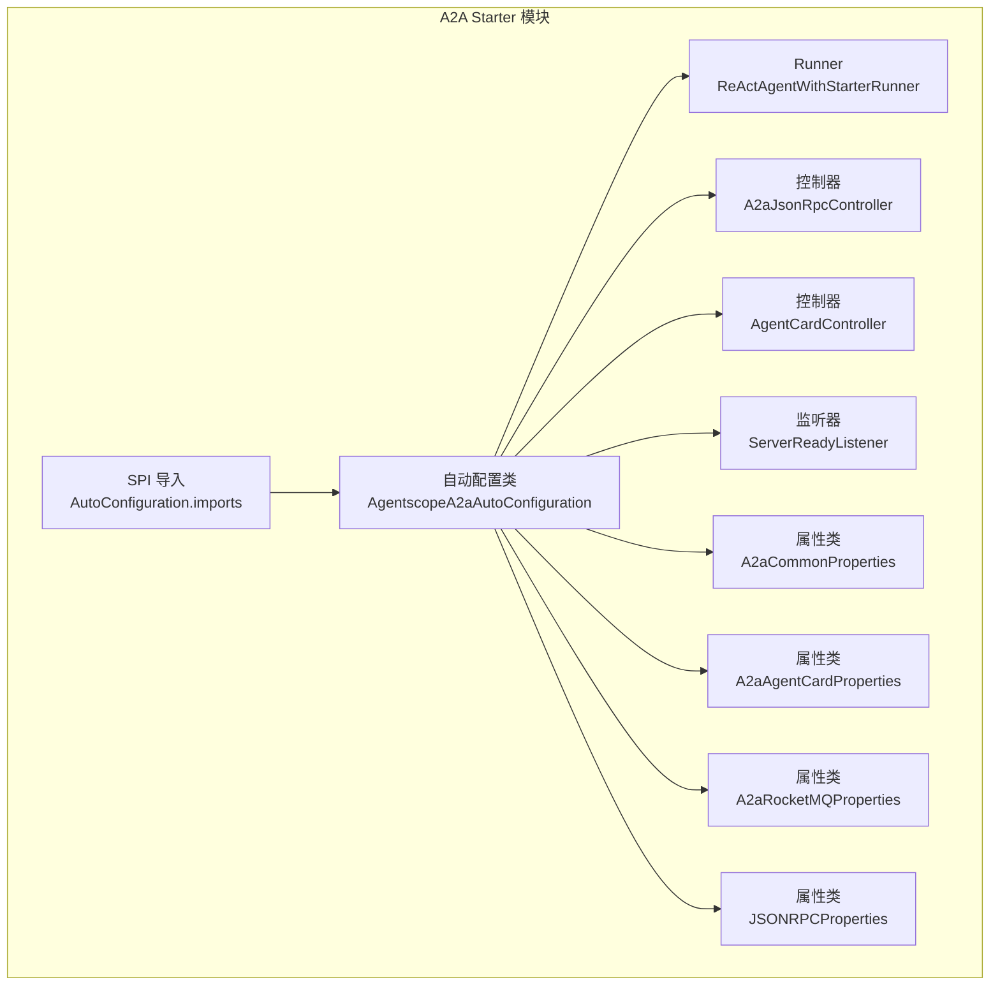
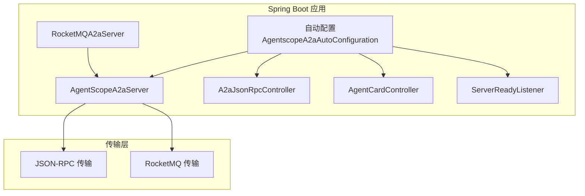
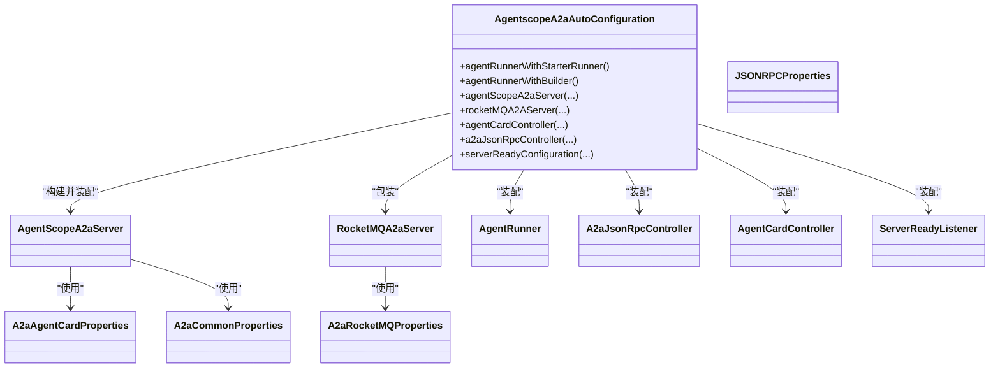
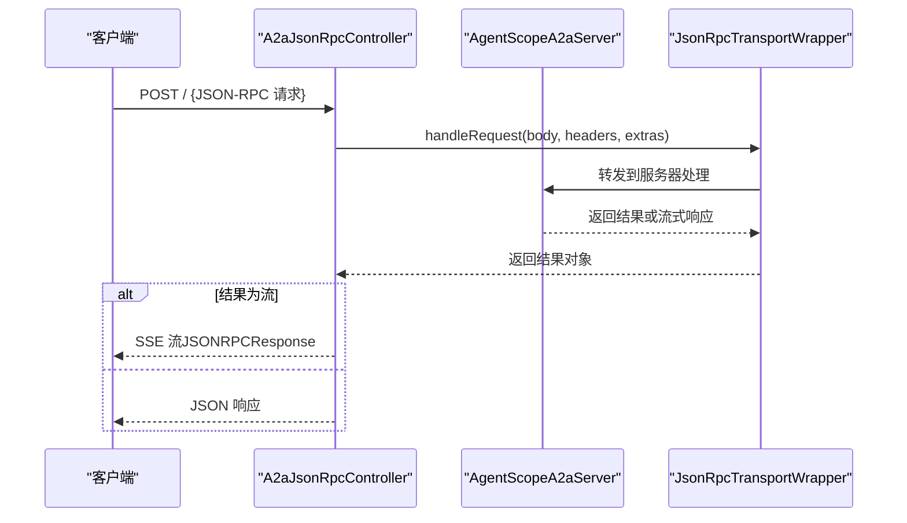
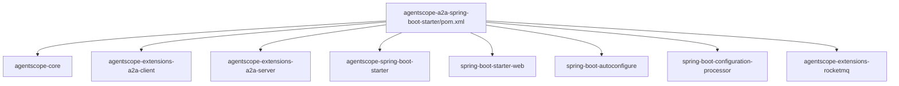
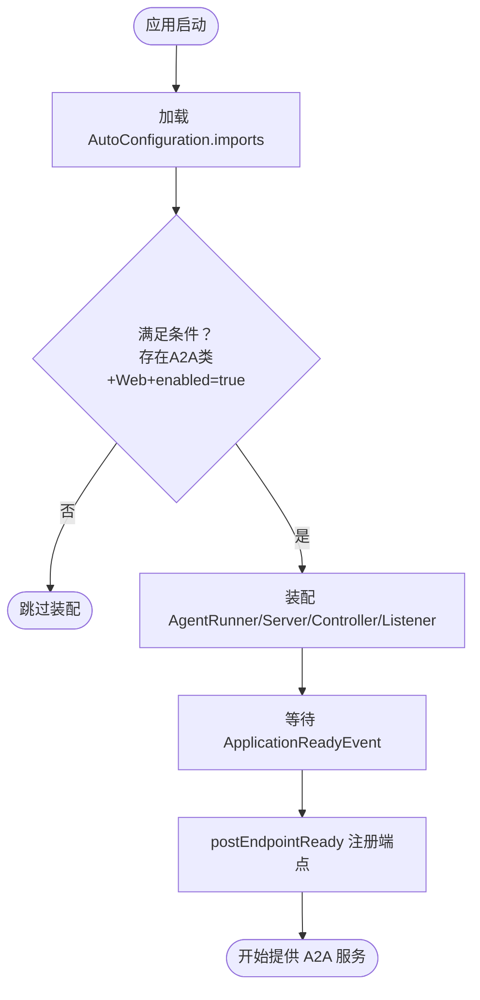

# A2A 通信 Starter 模块

<cite>
**本文引用的文件**
- [AgentscopeA2aAutoConfiguration.java](file://agentscope-extensions/agentscope-spring-boot-starters/agentscope-a2a-spring-boot-starter/src/main/java/io/agentscope/spring/boot/a2a/AgentscopeA2aAutoConfiguration.java)
- [A2aCommonProperties.java](file://agentscope-extensions/agentscope-spring-boot-starters/agentscope-a2a-spring-boot-starter/src/main/java/io/agentscope/spring/boot/a2a/properties/A2aCommonProperties.java)
- [A2aAgentCardProperties.java](file://agentscope-extensions/agentscope-spring-boot-starters/agentscope-a2a-spring-boot-starter/src/main/java/io/agentscope/spring/boot/a2a/properties/A2aAgentCardProperties.java)
- [A2aRocketMQProperties.java](file://agentscope-extensions/agentscope-spring-boot-starters/agentscope-a2a-spring-boot-starter/src/main/java/io/agentscope/spring/boot/a2a/properties/A2aRocketMQProperties.java)
- [JSONRPCProperties.java](file://agentscope-extensions/agentscope-spring-boot-starters/agentscope-a2a-spring-boot-starter/src/main/java/io/agentscope/spring/boot/a2a/properties/JSONRPCProperties.java)
- [Constants.java](file://agentscope-extensions/agentscope-spring-boot-starters/agentscope-a2a-spring-boot-starter/src/main/java/io/agentscope/spring/boot/a2a/properties/Constants.java)
- [A2aJsonRpcController.java](file://agentscope-extensions/agentscope-spring-boot-starters/agentscope-a2a-spring-boot-starter/src/main/java/io/agentscope/spring/boot/a2a/controller/A2aJsonRpcController.java)
- [AgentCardController.java](file://agentscope-extensions/agentscope-spring-boot-starters/agentscope-a2a-spring-boot-starter/src/main/java/io/agentscope/spring/boot/a2a/controller/AgentCardController.java)
- [ServerReadyListener.java](file://agentscope-extensions/agentscope-spring-boot-starters/agentscope-a2a-spring-boot-starter/src/main/java/io/agentscope/spring/boot/a2a/listener/ServerReadyListener.java)
- [ReActAgentWithStarterRunner.java](file://agentscope-extensions/agentscope-spring-boot-starters/agentscope-a2a-spring-boot-starter/src/main/java/io/agentscope/spring/boot/a2a/runner/ReActAgentWithStarterRunner.java)
- [org.springframework.boot.autoconfigure.AutoConfiguration.imports](file://agentscope-extensions/agentscope-spring-boot-starters/agentscope-a2a-spring-boot-starter/src/main/resources/META-INF/spring/org.springframework.boot.autoconfigure.AutoConfiguration.imports)
- [agentscope-a2a-spring-boot-starter/pom.xml](file://agentscope-extensions/agentscope-spring-boot-starters/agentscope-a2a-spring-boot-starter/pom.xml)
- [RocketMQA2aConfig.java](file://agentscope-extensions/agentscope-extensions-rocketmq/src/main/java/io/agentscope/extensions/rocketmq/a2a/config/RocketMQA2aConfig.java)
- [application.yml（示例）](file://agentscope-examples/a2a/src/main/resources/application.yml)
</cite>

## 目录
1. [简介](#简介)
2. [项目结构](#项目结构)
3. [核心组件](#核心组件)
4. [架构总览](#架构总览)
5. [详细组件分析](#详细组件分析)
6. [依赖关系分析](#依赖关系分析)
7. [性能考虑](#性能考虑)
8. [故障排查指南](#故障排查指南)
9. [结论](#结论)
10. [附录：完整配置示例与使用指引](#附录完整配置示例与使用指引)

## 简介
本文件面向 AgentScope Java 的 A2A（Agent-to-Agent）通信 Spring Boot Starter 模块，系统性阐述其自动配置机制、Bean 定义、传输层集成（含 JSON-RPC 与 RocketMQ）、消息序列化与网络通信设置、Maven 引入方式、启动流程、连接管理与错误处理策略，并提供性能调优与故障排查建议。读者可据此在 Spring Boot 应用中快速启用 A2A 服务端能力，支持多传输协议与扩展。

## 项目结构
A2A Starter 模块位于 agentscope-extensions/agentscope-spring-boot-starters/agentscope-a2a-spring-boot-starter，核心由以下部分组成：
- 自动配置类：负责条件装配 A2A 服务器、控制器、监听器及传输适配 Bean
- 属性配置类：映射 application.yml 中的 agentscope.a2a.* 配置项
- 控制器：暴露 JSON-RPC 接口与 Agent Card 元数据接口
- 监听器：应用就绪后回调服务器注册完成
- Runner：基于 Spring Bean 提供 ReActAgent 执行器
- AutoConfiguration SPI：声明自动配置入口

图表来源
- [AgentscopeA2aAutoConfiguration.java:58-72](file://agentscope-extensions/agentscope-spring-boot-starters/agentscope-a2a-spring-boot-starter/src/main/java/io/agentscope/spring/boot/a2a/AgentscopeA2aAutoConfiguration.java#L58-L72)
- [A2aCommonProperties.java:24-25](file://agentscope-extensions/agentscope-spring-boot-starters/agentscope-a2a-spring-boot-starter/src/main/java/io/agentscope/spring/boot/a2a/properties/A2aCommonProperties.java#L24-L25)
- [A2aAgentCardProperties.java:30-31](file://agentscope-extensions/agentscope-spring-boot-starters/agentscope-a2a-spring-boot-starter/src/main/java/io/agentscope/spring/boot/a2a/properties/A2aAgentCardProperties.java#L30-L31)
- [A2aRocketMQProperties.java:29-30](file://agentscope-extensions/agentscope-spring-boot-starters/agentscope-a2a-spring-boot-starter/src/main/java/io/agentscope/spring/boot/a2a/properties/A2aRocketMQProperties.java#L29-L30)
- [JSONRPCProperties.java:27-28](file://agentscope-extensions/agentscope-spring-boot-starters/agentscope-a2a-spring-boot-starter/src/main/java/io/agentscope/spring/boot/a2a/properties/JSONRPCProperties.java#L27-L28)
- [A2aJsonRpcController.java:36-38](file://agentscope-extensions/agentscope-spring-boot-starters/agentscope-a2a-spring-boot-starter/src/main/java/io/agentscope/spring/boot/a2a/controller/A2aJsonRpcController.java#L36-L38)
- [AgentCardController.java:26-28](file://agentscope-extensions/agentscope-spring-boot-starters/agentscope-a2a-spring-boot-starter/src/main/java/io/agentscope/spring/boot/a2a/controller/AgentCardController.java#L26-L28)
- [ServerReadyListener.java:26-27](file://agentscope-extensions/agentscope-spring-boot-starters/agentscope-a2a-spring-boot-starter/src/main/java/io/agentscope/spring/boot/a2a/listener/ServerReadyListener.java#L26-L27)
- [ReActAgentWithStarterRunner.java:39-40](file://agentscope-extensions/agentscope-spring-boot-starters/agentscope-a2a-spring-boot-starter/src/main/java/io/agentscope/spring/boot/a2a/runner/ReActAgentWithStarterRunner.java#L39-L40)
- [org.springframework.boot.autoconfigure.AutoConfiguration.imports:16-16](file://agentscope-extensions/agentscope-spring-boot-starters/agentscope-a2a-spring-boot-starter/src/main/resources/META-INF/spring/org.springframework.boot.autoconfigure.AutoConfiguration.imports#L16-L16)

章节来源
- [AgentscopeA2aAutoConfiguration.java:58-72](file://agentscope-extensions/agentscope-spring-boot-starters/agentscope-a2a-spring-boot-starter/src/main/java/io/agentscope/spring/boot/a2a/AgentscopeA2aAutoConfiguration.java#L58-L72)
- [org.springframework.boot.autoconfigure.AutoConfiguration.imports:16-16](file://agentscope-extensions/agentscope-spring-boot-starters/agentscope-a2a-spring-boot-starter/src/main/resources/META-INF/spring/org.springframework.boot.autoconfigure.AutoConfiguration.imports#L16-L16)

## 核心组件
- 自动配置类
  - 条件注解：仅当存在 A2A 服务器类、处于 Web 应用且 agentscope.a2a.server.enabled=true 时生效
  - 负责装配：
    - AgentRunner（支持从 ReActAgent 或其 Builder 注入）
    - AgentScopeA2aServer（构建器注入 AgentCard、部署信息、执行参数与传输配置）
    - RocketMQA2aServer（在开启 RocketMQ 传输时包装 AgentScopeA2aServer）
    - A2aJsonRpcController 与 AgentCardController
    - ServerReadyListener
- 属性配置类
  - A2aCommonProperties：通用 A2A 行为开关与超时控制
  - A2aAgentCardProperties：Agent 卡片元数据（名称、描述、提供方、版本、技能、安全等）
  - A2aRocketMQProperties：RocketMQ 传输配置（端点、命名空间、业务 Topic、消费者组、AK/SK、异步响应 Topic/Group）
  - JSONRPCProperties：JSON-RPC 传输配置（是否启用、部署地址与路径）
- 控制器
  - A2aJsonRpcController：POST / 接收 JSON-RPC 请求，返回 JSON 或 Server-Sent Events
  - AgentCardController：GET /.well-known/agent-card.json 返回 Agent 卡片
- 监听器
  - ServerReadyListener：应用就绪事件触发服务器端点注册完成回调
- Runner
  - ReActAgentWithStarterRunner：基于 Spring Bean 提供 ReActAgent 实例的执行器

章节来源
- [AgentscopeA2aAutoConfiguration.java:58-212](file://agentscope-extensions/agentscope-spring-boot-starters/agentscope-a2a-spring-boot-starter/src/main/java/io/agentscope/spring/boot/a2a/AgentscopeA2aAutoConfiguration.java#L58-L212)
- [A2aCommonProperties.java:24-91](file://agentscope-extensions/agentscope-spring-boot-starters/agentscope-a2a-spring-boot-starter/src/main/java/io/agentscope/spring/boot/a2a/properties/A2aCommonProperties.java#L24-L91)
- [A2aAgentCardProperties.java:30-173](file://agentscope-extensions/agentscope-spring-boot-starters/agentscope-a2a-spring-boot-starter/src/main/java/io/agentscope/spring/boot/a2a/properties/A2aAgentCardProperties.java#L30-L173)
- [A2aRocketMQProperties.java:29-270](file://agentscope-extensions/agentscope-spring-boot-starters/agentscope-a2a-spring-boot-starter/src/main/java/io/agentscope/spring/boot/a2a/properties/A2aRocketMQProperties.java#L29-L270)
- [JSONRPCProperties.java:27-66](file://agentscope-extensions/agentscope-spring-boot-starters/agentscope-a2a-spring-boot-starter/src/main/java/io/agentscope/spring/boot/a2a/properties/JSONRPCProperties.java#L27-L66)
- [A2aJsonRpcController.java:36-94](file://agentscope-extensions/agentscope-spring-boot-starters/agentscope-a2a-spring-boot-starter/src/main/java/io/agentscope/spring/boot/a2a/controller/A2aJsonRpcController.java#L36-L94)
- [AgentCardController.java:26-40](file://agentscope-extensions/agentscope-spring-boot-starters/agentscope-a2a-spring-boot-starter/src/main/java/io/agentscope/spring/boot/a2a/controller/AgentCardController.java#L26-L40)
- [ServerReadyListener.java:26-38](file://agentscope-extensions/agentscope-spring-boot-starters/agentscope-a2a-spring-boot-starter/src/main/java/io/agentscope/spring/boot/a2a/listener/ServerReadyListener.java#L26-L38)
- [ReActAgentWithStarterRunner.java:39-63](file://agentscope-extensions/agentscope-spring-boot-starters/agentscope-a2a-spring-boot-starter/src/main/java/io/agentscope/spring/boot/a2a/runner/ReActAgentWithStarterRunner.java#L39-L63)

## 架构总览
A2A Starter 在 Spring Boot 启动时按需装配 A2A 服务器与传输层，提供 JSON-RPC 与 RocketMQ 两种传输通道；同时暴露 REST 接口用于外部调用与卡片元数据查询。

图表来源
- [AgentscopeA2aAutoConfiguration.java:88-126](file://agentscope-extensions/agentscope-spring-boot-starters/agentscope-a2a-spring-boot-starter/src/main/java/io/agentscope/spring/boot/a2a/AgentscopeA2aAutoConfiguration.java#L88-L126)
- [A2aJsonRpcController.java:36-48](file://agentscope-extensions/agentscope-spring-boot-starters/agentscope-a2a-spring-boot-starter/src/main/java/io/agentscope/spring/boot/a2a/controller/A2aJsonRpcController.java#L36-L48)
- [AgentCardController.java:26-34](file://agentscope-extensions/agentscope-spring-boot-starters/agentscope-a2a-spring-boot-starter/src/main/java/io/agentscope/spring/boot/a2a/controller/AgentCardController.java#L26-L34)
- [ServerReadyListener.java:34-37](file://agentscope-extensions/agentscope-spring-boot-starters/agentscope-a2a-spring-boot-starter/src/main/java/io/agentscope/spring/boot/a2a/listener/ServerReadyListener.java#L34-L37)

## 详细组件分析

### 自动配置类：AgentscopeA2aAutoConfiguration
- 条件装配
  - 仅当存在 A2A 服务器类与 RocketMQ 服务器类时启用
  - 仅在 Web 应用中启用
  - 仅当 agentscope.a2a.server.enabled=true（默认 true）时启用
- Bean 定义
  - AgentRunner（优先注入 ReActAgent Bean，其次注入 ReActAgent.Builder）
  - AgentScopeA2aServer（组装 AgentCard、部署信息、执行参数与传输配置列表）
  - RocketMQA2aServer（在 agentscope.a2a.server.transports.rocketmq.enabled=true 时包装）
  - A2aJsonRpcController 与 AgentCardController
  - ServerReadyListener
- 关键构建逻辑
  - 将多个 CustomTransportProperties（如 RocketMQ、JSONRPC）转换为 TransportProperties 并注入服务器
  - 读取环境变量 server.port/server.address/server.servlet.context-path 作为默认部署信息
  - 基于 A2aCommonProperties 构建 AgentExecuteProperties

图表来源
- [AgentscopeA2aAutoConfiguration.java:74-152](file://agentscope-extensions/agentscope-spring-boot-starters/agentscope-a2a-spring-boot-starter/src/main/java/io/agentscope/spring/boot/a2a/AgentscopeA2aAutoConfiguration.java#L74-L152)
- [A2aAgentCardProperties.java:30-173](file://agentscope-extensions/agentscope-spring-boot-starters/agentscope-a2a-spring-boot-starter/src/main/java/io/agentscope/spring/boot/a2a/properties/A2aAgentCardProperties.java#L30-L173)
- [A2aCommonProperties.java:24-91](file://agentscope-extensions/agentscope-spring-boot-starters/agentscope-a2a-spring-boot-starter/src/main/java/io/agentscope/spring/boot/a2a/properties/A2aCommonProperties.java#L24-L91)
- [A2aRocketMQProperties.java:29-270](file://agentscope-extensions/agentscope-spring-boot-starters/agentscope-a2a-spring-boot-starter/src/main/java/io/agentscope/spring/boot/a2a/properties/A2aRocketMQProperties.java#L29-L270)

章节来源
- [AgentscopeA2aAutoConfiguration.java:58-212](file://agentscope-extensions/agentscope-spring-boot-starters/agentscope-a2a-spring-boot-starter/src/main/java/io/agentscope/spring/boot/a2a/AgentscopeA2aAutoConfiguration.java#L58-L212)

### 属性配置：A2aCommonProperties、A2aAgentCardProperties、A2aRocketMQProperties、JSONRPCProperties
- A2aCommonProperties
  - 作用：控制 A2A 服务器行为与超时策略
  - 关键项：enabled、agentCompletionTimeoutSeconds、consumptionCompletionTimeoutSeconds、completeWithMessage、requireInnerMessage
- A2aAgentCardProperties
  - 作用：定义 Agent 卡片元数据，用于对外暴露 Agent 能力与安全信息
  - 关键项：name、description、url、provider、version、documentationUrl、iconUrl、defaultInputModes、defaultOutputModes、skills、securitySchemes、security、additionalInterfaces、preferredTransport
- A2aRocketMQProperties
  - 作用：RocketMQ 传输配置，实现 CustomTransportProperties 接口
  - 关键项：enabled、rocketMQEndpoint、rocketMQNamespace、bizTopic、bizConsumerGroup、accessKey、secretKey、workAgentResponseTopic、workAgentResponseGroupId
  - 转换规则：校验端点格式并生成 TransportProperties（协议名、主机、端口、路径）
- JSONRPCProperties
  - 作用：JSON-RPC 传输配置，实现 CustomTransportProperties 接口
  - 关键项：enabled、deploymentProperties（host/port/path）
  - 转换规则：基于部署信息生成 TransportProperties

章节来源
- [A2aCommonProperties.java:24-91](file://agentscope-extensions/agentscope-spring-boot-starters/agentscope-a2a-spring-boot-starter/src/main/java/io/agentscope/spring/boot/a2a/properties/A2aCommonProperties.java#L24-L91)
- [A2aAgentCardProperties.java:30-173](file://agentscope-extensions/agentscope-spring-boot-starters/agentscope-a2a-spring-boot-starter/src/main/java/io/agentscope/spring/boot/a2a/properties/A2aAgentCardProperties.java#L30-L173)
- [A2aRocketMQProperties.java:29-270](file://agentscope-extensions/agentscope-spring-boot-starters/agentscope-a2a-spring-boot-starter/src/main/java/io/agentscope/spring/boot/a2a/properties/A2aRocketMQProperties.java#L29-L270)
- [JSONRPCProperties.java:27-66](file://agentscope-extensions/agentscope-spring-boot-starters/agentscope-a2a-spring-boot-starter/src/main/java/io/agentscope/spring/boot/a2a/properties/JSONRPCProperties.java#L27-L66)

### 控制器：A2aJsonRpcController 与 AgentCardController
- A2aJsonRpcController
  - 路径：POST /
  - 输入：application/json
  - 输出：application/json 或 text/event-stream（SSE）
  - 处理：委托给 AgentScopeA2aServer 的 JSON-RPC 包装器处理请求，将响应转换为 SSE 流
- AgentCardController
  - 路径：GET /.well-known/agent-card.json
  - 输出：application/json
  - 处理：返回 AgentScopeA2aServer 的 AgentCard

图表来源
- [A2aJsonRpcController.java:50-66](file://agentscope-extensions/agentscope-spring-boot-starters/agentscope-a2a-spring-boot-starter/src/main/java/io/agentscope/spring/boot/a2a/controller/A2aJsonRpcController.java#L50-L66)

章节来源
- [A2aJsonRpcController.java:36-94](file://agentscope-extensions/agentscope-spring-boot-starters/agentscope-a2a-spring-boot-starter/src/main/java/io/agentscope/spring/boot/a2a/controller/A2aJsonRpcController.java#L36-L94)
- [AgentCardController.java:26-40](file://agentscope-extensions/agentscope-spring-boot-starters/agentscope-a2a-spring-boot-starter/src/main/java/io/agentscope/spring/boot/a2a/controller/AgentCardController.java#L26-L40)

### 监听器：ServerReadyListener
- 触发时机：ApplicationReadyEvent
- 作用：调用 AgentScopeA2aServer.postEndpointReady()，通知服务器端点已就绪

章节来源
- [ServerReadyListener.java:34-37](file://agentscope-extensions/agentscope-spring-boot-starters/agentscope-a2a-spring-boot-starter/src/main/java/io/agentscope/spring/boot/a2a/listener/ServerReadyListener.java#L34-L37)

### Runner：ReActAgentWithStarterRunner
- 作用：基于 Spring Bean 提供 AgentRunner，每次请求从 ObjectProvider 获取 ReActAgent 实例
- 设计：通过 Spring 管理生命周期与缓存，便于中断与拦截

章节来源
- [ReActAgentWithStarterRunner.java:39-63](file://agentscope-extensions/agentscope-spring-boot-starters/agentscope-a2a-spring-boot-starter/src/main/java/io/agentscope/spring/boot/a2a/runner/ReActAgentWithStarterRunner.java#L39-L63)

## 依赖关系分析
- Maven 依赖
  - agentscope-core、agentscope-extensions-a2a-client、agentscope-extensions-a2a-server、agentscope-spring-boot-starter
  - spring-boot-starter-web（可选，用于 Web 控制器）
  - spring-boot-autoconfigure（可选，用于自动配置 SPI）
  - spring-boot-configuration-processor（可选，生成配置元数据）
  - agentscope-extensions-rocketmq（编译期依赖，提供 RocketMQ 集成）
- AutoConfiguration SPI
  - 通过 META-INF/spring/org.springframework.boot.autoconfigure.AutoConfiguration.imports 声明自动配置类

图表来源
- [agentscope-a2a-spring-boot-starter/pom.xml:36-94](file://agentscope-extensions/agentscope-spring-boot-starters/agentscope-a2a-spring-boot-starter/pom.xml#L36-L94)

章节来源
- [agentscope-a2a-spring-boot-starter/pom.xml:36-94](file://agentscope-extensions/agentscope-spring-boot-starters/agentscope-a2a-spring-boot-starter/pom.xml#L36-L94)
- [org.springframework.boot.autoconfigure.AutoConfiguration.imports:16-16](file://agentscope-extensions/agentscope-spring-boot-starters/agentscope-a2a-spring-boot-starter/src/main/resources/META-INF/spring/org.springframework.boot.autoconfigure.AutoConfiguration.imports#L16-L16)

## 性能考虑
- 传输层选择
  - JSON-RPC：适合轻量、低延迟的内网或同机部署场景
  - RocketMQ：适合高吞吐、异步解耦、跨机房/多集群场景
- 超时与消费策略
  - 合理设置 agentCompletionTimeoutSeconds 与 consumptionCompletionTimeoutSeconds，避免长时间占用资源
  - completeWithMessage 与 requireInnerMessage 影响响应体量与客户端消费成本
- 连接与并发
  - RocketMQ 消费组配置需与业务规模匹配，避免重复消费或堆积
  - JSON-RPC 流式响应（SSE）在高并发下注意背压与缓冲区大小
- 部署与上下文路径
  - 使用 server.servlet.context-path 与自定义端口，结合反向代理优化网络链路

## 故障排查指南
- 启动不生效
  - 检查 agentscope.a2a.server.enabled 是否为 true（默认 true）
  - 确认应用为 Web 应用类型
  - 确保 agentscope-core、agentscope-extensions-a2a-server、agentscope-spring-boot-starter 已正确引入
- RocketMQ 传输异常
  - rocketMQEndpoint 格式必须为 host:port，且不可为空
  - AK/SK、命名空间、Topic、消费者组需与 RocketMQ 配置一致
  - 若未启用 RocketMQ 传输，请确保 agentscope.a2a.server.transports.rocketmq.enabled=false
- JSON-RPC 响应异常
  - 检查请求体是否符合 JSON-RPC 规范
  - 查看 SSE 转换日志，确认 OBJECT_MAPPER 可序列化响应对象
- 端点未注册
  - 确认应用已发出 ApplicationReadyEvent，ServerReadyListener 会自动回调 postEndpointReady()

章节来源
- [AgentscopeA2aAutoConfiguration.java:67-71](file://agentscope-extensions/agentscope-spring-boot-starters/agentscope-a2a-spring-boot-starter/src/main/java/io/agentscope/spring/boot/a2a/AgentscopeA2aAutoConfiguration.java#L67-L71)
- [A2aRocketMQProperties.java:237-253](file://agentscope-extensions/agentscope-spring-boot-starters/agentscope-a2a-spring-boot-starter/src/main/java/io/agentscope/spring/boot/a2a/properties/A2aRocketMQProperties.java#L237-L253)
- [A2aJsonRpcController.java:77-93](file://agentscope-extensions/agentscope-spring-boot-starters/agentscope-a2a-spring-boot-starter/src/main/java/io/agentscope/spring/boot/a2a/controller/A2aJsonRpcController.java#L77-L93)
- [ServerReadyListener.java:34-37](file://agentscope-extensions/agentscope-spring-boot-starters/agentscope-a2a-spring-boot-starter/src/main/java/io/agentscope/spring/boot/a2a/listener/ServerReadyListener.java#L34-L37)

## 结论
A2A Starter 通过自动配置与属性绑定，将 AgentScope 的 A2A 服务器能力无缝集成至 Spring Boot 应用，支持 JSON-RPC 与 RocketMQ 传输，并提供 REST 接口与卡片元数据。借助合理的配置与监控，可在不同部署环境下获得稳定、可扩展的智能体间通信能力。

## 附录：完整配置示例与使用指引

### Maven 依赖引入
- 在应用的 pom.xml 中引入 agentscope-a2a-spring-boot-starter，即可激活自动配置与相关 Bean
- 如需 RocketMQ 传输，确保引入 agentscope-extensions-rocketmq 依赖

章节来源
- [agentscope-a2a-spring-boot-starter/pom.xml:36-94](file://agentscope-extensions/agentscope-spring-boot-starters/agentscope-a2a-spring-boot-starter/pom.xml#L36-L94)

### 服务器端 application.yml 配置模板
- 服务器基础配置
  - server.port：服务端口
  - server.address：绑定地址
  - server.servlet.context-path：上下文路径
- A2A 服务器配置
  - agentscope.a2a.server.enabled：是否启用 A2A 服务器（默认 true）
  - agentscope.a2a.server.card.*：Agent 卡片元数据
  - agentscope.a2a.server.transports.jsonrpc.enabled：是否启用 JSON-RPC 传输（默认 true）
  - agentscope.a2a.server.transports.jsonrpc.deploymentProperties.host/port/path：JSON-RPC 部署信息
  - agentscope.a2a.server.transports.rocketmq.enabled：是否启用 RocketMQ 传输（默认 false）
  - agentscope.a2a.server.transports.rocketmq.rocketMQEndpoint：RocketMQ 地址（host:port）
  - agentscope.a2a.server.transports.rocketmq.rocketMQNamespace：命名空间
  - agentscope.a2a.server.transports.rocketmq.bizTopic：业务 Topic
  - agentscope.a2a.server.transports.rocketmq.bizConsumerGroup：业务消费者组
  - agentscope.a2a.server.transports.rocketmq.accessKey/secretKey：认证凭据
  - agentscope.a2a.server.transports.rocketmq.workAgentResponseTopic：异步响应 Topic
  - agentscope.a2a.server.transports.rocketmq.workAgentResponseGroupId：异步响应消费者组
- 通用 A2A 配置
  - agentscope.a2a.server.completeWithMessage：任务完成后是否返回完成消息
  - agentscope.a2a.server.requireInnerMessage：是否包含内部事件与消息（如 TOOL_CALL）

章节来源
- [Constants.java:24-44](file://agentscope-extensions/agentscope-spring-boot-starters/agentscope-a2a-spring-boot-starter/src/main/java/io/agentscope/spring/boot/a2a/properties/Constants.java#L24-L44)
- [A2aCommonProperties.java:24-91](file://agentscope-extensions/agentscope-spring-boot-starters/agentscope-a2a-spring-boot-starter/src/main/java/io/agentscope/spring/boot/a2a/properties/A2aCommonProperties.java#L24-L91)
- [A2aAgentCardProperties.java:30-173](file://agentscope-extensions/agentscope-spring-boot-starters/agentscope-a2a-spring-boot-starter/src/main/java/io/agentscope/spring/boot/a2a/properties/A2aAgentCardProperties.java#L30-L173)
- [A2aRocketMQProperties.java:29-270](file://agentscope-extensions/agentscope-spring-boot-starters/agentscope-a2a-spring-boot-starter/src/main/java/io/agentscope/spring/boot/a2a/properties/A2aRocketMQProperties.java#L29-L270)
- [JSONRPCProperties.java:27-66](file://agentscope-extensions/agentscope-spring-boot-starters/agentscope-a2a-spring-boot-starter/src/main/java/io/agentscope/spring/boot/a2a/properties/JSONRPCProperties.java#L27-L66)

### 客户端调用示例（参考）
- JSON-RPC
  - 方法：POST /
  - 头部：Content-Type: application/json
  - 返回：application/json 或 text/event-stream（SSE）
- Agent Card
  - 方法：GET /.well-known/agent-card.json
  - 返回：application/json

章节来源
- [A2aJsonRpcController.java:50-66](file://agentscope-extensions/agentscope-spring-boot-starters/agentscope-a2a-spring-boot-starter/src/main/java/io/agentscope/spring/boot/a2a/controller/A2aJsonRpcController.java#L50-L66)
- [AgentCardController.java:36-39](file://agentscope-extensions/agentscope-spring-boot-starters/agentscope-a2a-spring-boot-starter/src/main/java/io/agentscope/spring/boot/a2a/controller/AgentCardController.java#L36-L39)

### 启动流程与连接管理
- 自动配置加载顺序：先加载 agentscope-spring-boot-starter 的自动配置，再加载本模块
- 运行时流程
  - 应用启动 → 加载 AutoConfiguration.imports → 条件判断 → 装配 Bean
  - 装配 AgentScopeA2aServer 与传输层（JSON-RPC/RocketMQ）
  - 装配控制器与监听器
  - 应用就绪 → 回调 postEndpointReady，完成端点注册
- 连接管理
  - JSON-RPC：基于 Spring WebFlux 的请求/响应与 SSE 流
  - RocketMQ：基于配置的 Topic/Group 订阅，异步响应 Topic 用于回传结果

图表来源
- [org.springframework.boot.autoconfigure.AutoConfiguration.imports:16-16](file://agentscope-extensions/agentscope-spring-boot-starters/agentscope-a2a-spring-boot-starter/src/main/resources/META-INF/spring/org.springframework.boot.autoconfigure.AutoConfiguration.imports#L16-L16)
- [AgentscopeA2aAutoConfiguration.java:58-72](file://agentscope-extensions/agentscope-spring-boot-starters/agentscope-a2a-spring-boot-starter/src/main/java/io/agentscope/spring/boot/a2a/AgentscopeA2aAutoConfiguration.java#L58-L72)
- [ServerReadyListener.java:34-37](file://agentscope-extensions/agentscope-spring-boot-starters/agentscope-a2a-spring-boot-starter/src/main/java/io/agentscope/spring/boot/a2a/listener/ServerReadyListener.java#L34-L37)