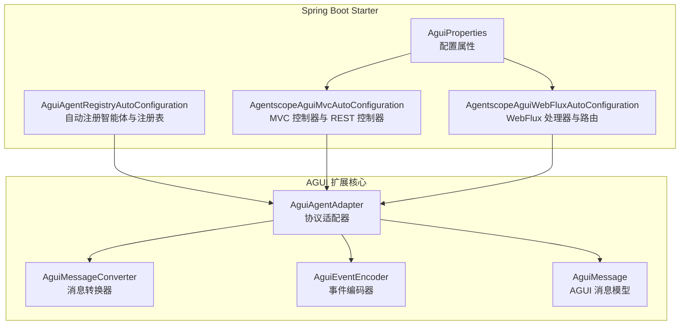
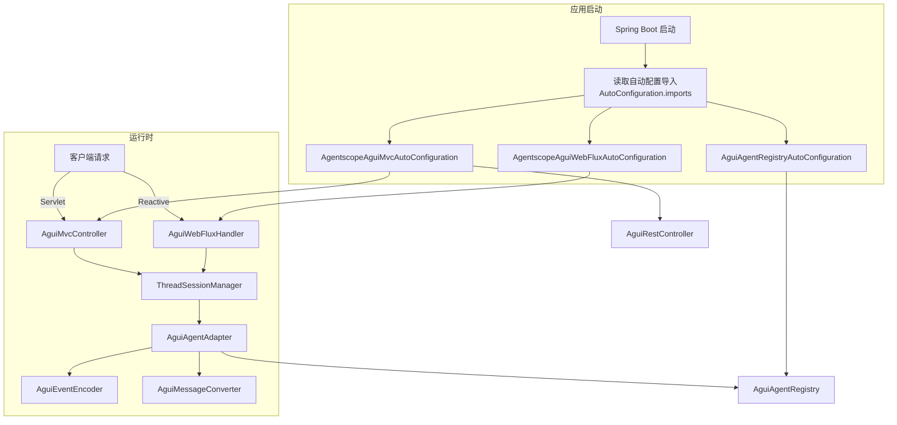
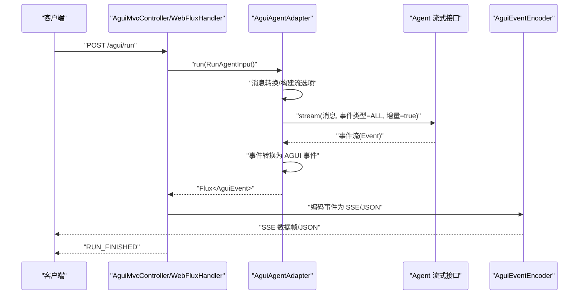
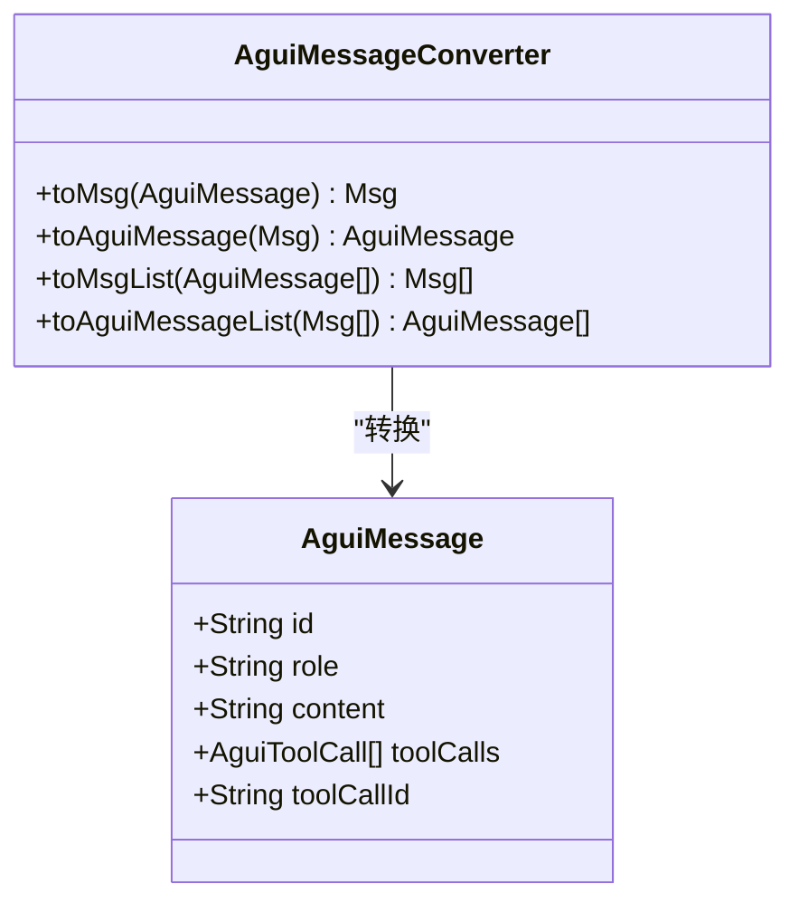
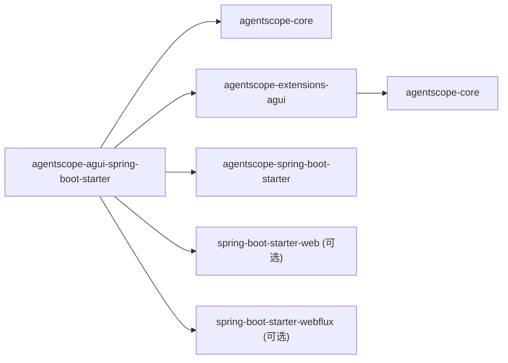

# AGUI 图形界面 Starter 模块

<cite>
**本文引用的文件**
- [AguiAgentRegistryAutoConfiguration.java](file://agentscope-extensions/agentscope-spring-boot-starters/agentscope-agui-spring-boot-starter/src/main/java/io/agentscope/spring/boot/agui/common/AguiAgentRegistryAutoConfiguration.java)
- [AgentscopeAguiMvcAutoConfiguration.java](file://agentscope-extensions/agentscope-spring-boot-starters/agentscope-agui-spring-boot-starter/src/main/java/io/agentscope/spring/boot/agui/mvc/AgentscopeAguiMvcAutoConfiguration.java)
- [AgentscopeAguiWebFluxAutoConfiguration.java](file://agentscope-extensions/agentscope-spring-boot-starters/agentscope-agui-spring-boot-starter/src/main/java/io/agentscope/spring/boot/agui/webflux/AgentscopeAguiWebFluxAutoConfiguration.java)
- [AguiProperties.java](file://agentscope-extensions/agentscope-spring-boot-starters/agentscope-agui-spring-boot-starter/src/main/java/io/agentscope/spring/boot/agui/common/AguiProperties.java)
- [org.springframework.boot.autoconfigure.AutoConfiguration.imports](file://agentscope-extensions/agentscope-spring-boot-starters/agentscope-agui-spring-boot-starter/src/main/resources/META-INF/spring/org.springframework.boot.autoconfigure.AutoConfiguration.imports)
- [agentscope-agui-spring-boot-starter/pom.xml](file://agentscope-extensions/agentscope-spring-boot-starters/agentscope-agui-spring-boot-starter/pom.xml)
- [agentscope-extensions-agui/pom.xml](file://agentscope-extensions/agentscope-extensions-agui/pom.xml)
- [AguiAgentAdapter.java](file://agentscope-extensions/agentscope-extensions-agui/src/main/java/io/agentscope/core/agui/adapter/AguiAgentAdapter.java)
- [AguiMessageConverter.java](file://agentscope-extensions/agentscope-extensions-agui/src/main/java/io/agentscope/core/agui/converter/AguiMessageConverter.java)
- [AguiEventEncoder.java](file://agentscope-extensions/agentscope-extensions-agui/src/main/java/io/agentscope/core/agui/encoder/AguiEventEncoder.java)
- [AguiMessage.java](file://agentscope-extensions/agentscope-extensions-agui/src/main/java/io/agentscope/core/agui/model/AguiMessage.java)
</cite>

## 目录
1. [简介](#简介)
2. [项目结构](#项目结构)
3. [核心组件](#核心组件)
4. [架构总览](#架构总览)
5. [详细组件分析](#详细组件分析)
6. [依赖关系分析](#依赖关系分析)
7. [性能考量](#性能考量)
8. [故障排查指南](#故障排查指南)
9. [结论](#结论)
10. [附录](#附录)

## 简介
本文件面向 AgentScope Java 的 AGUI 图形界面 Spring Boot Starter 模块，系统性阐述其自动配置机制、图形用户界面适配器、前端资源托管与路由配置、智能体适配器注册、事件编码器与消息转换器配置、Maven 依赖引入方式、完整配置示例以及 AGUI 界面的启动流程、事件处理机制与用户交互细节，并提供自定义开发与集成的最佳实践建议。

## 项目结构
该模块由两部分组成：
- Spring Boot Starter：负责自动装配 MVC/WebFlux 控制器、会话管理、配置属性绑定等。
- AGUI 扩展核心：提供 AGUI 协议适配器、消息转换器、事件编码器、模型与注册表等。

图表来源
- [AguiAgentRegistryAutoConfiguration.java:37-72](file://agentscope-extensions/agentscope-spring-boot-starters/agentscope-agui-spring-boot-starter/src/main/java/io/agentscope/spring/boot/agui/common/AguiAgentRegistryAutoConfiguration.java#L37-L72)
- [AgentscopeAguiMvcAutoConfiguration.java:45-111](file://agentscope-extensions/agentscope-spring-boot-starters/agentscope-agui-spring-boot-starter/src/main/java/io/agentscope/spring/boot/agui/mvc/AgentscopeAguiMvcAutoConfiguration.java#L45-L111)
- [AgentscopeAguiWebFluxAutoConfiguration.java:48-127](file://agentscope-extensions/agentscope-spring-boot-starters/agentscope-agui-spring-boot-starter/src/main/java/io/agentscope/spring/boot/agui/webflux/AgentscopeAguiWebFluxAutoConfiguration.java#L48-L127)
- [AguiProperties.java:43-235](file://agentscope-extensions/agentscope-spring-boot-starters/agentscope-agui-spring-boot-starter/src/main/java/io/agentscope/spring/boot/agui/common/AguiProperties.java#L43-L235)
- [AguiAgentAdapter.java:64-135](file://agentscope-extensions/agentscope-extensions-agui/src/main/java/io/agentscope/core/agui/adapter/AguiAgentAdapter.java#L64-L135)
- [AguiMessageConverter.java:41-141](file://agentscope-extensions/agentscope-extensions-agui/src/main/java/io/agentscope/core/agui/converter/AguiMessageConverter.java#L41-L141)
- [AguiEventEncoder.java:33-105](file://agentscope-extensions/agentscope-extensions-agui/src/main/java/io/agentscope/core/agui/encoder/AguiEventEncoder.java#L33-L105)
- [AguiMessage.java:38-115](file://agentscope-extensions/agentscope-extensions-agui/src/main/java/io/agentscope/core/agui/model/AguiMessage.java#L38-L115)

章节来源
- [org.springframework.boot.autoconfigure.AutoConfiguration.imports:1-4](file://agentscope-extensions/agentscope-spring-boot-starters/agentscope-agui-spring-boot-starter/src/main/resources/META-INF/spring/org.springframework.boot.autoconfigure.AutoConfiguration.imports#L1-L4)
- [agentscope-agui-spring-boot-starter/pom.xml:36-87](file://agentscope-extensions/agentscope-spring-boot-starters/agentscope-agui-spring-boot-starter/pom.xml#L36-L87)
- [agentscope-extensions-agui/pom.xml:33-42](file://agentscope-extensions/agentscope-extensions-agui/pom.xml#L33-L42)

## 核心组件
- 自动配置导入清单：通过 Spring Boot 的自动配置导入机制，统一加载注册表、MVC 与 WebFlux 的自动配置。
- 配置属性 AguiProperties：集中管理 AGUI 路径前缀、CORS、超时、工具合并策略、推理开关、默认代理 ID、服务端内存、线程会话数与超时、SSE 超时等。
- 注册表自动配置：在存在 AGUI 核心类时，自动创建智能体注册表与自动注册器。
- MVC 自动配置：在 Servlet Web 应用中，创建线程会话管理器、MVC 控制器与 REST 控制器。
- WebFlux 自动配置：在响应式 Web 应用中，创建线程会话管理器、WebFlux 处理器与路由函数。
- AGUI 协议适配器：桥接 AgentScope 事件流到 AGUI 事件序列，支持文本消息、推理消息、工具调用与结果的转换。
- 消息转换器：双向转换 AGUI 消息与 AgentScope 内部消息，处理角色映射、工具调用参数序列化与解析。
- 事件编码器：将 AGUI 事件序列化为 SSE 或纯 JSON 字符串，支持心跳保活。

章节来源
- [AguiAgentRegistryAutoConfiguration.java:37-72](file://agentscope-extensions/agentscope-spring-boot-starters/agentscope-agui-spring-boot-starter/src/main/java/io/agentscope/spring/boot/agui/common/AguiAgentRegistryAutoConfiguration.java#L37-L72)
- [AgentscopeAguiMvcAutoConfiguration.java:45-111](file://agentscope-extensions/agentscope-spring-boot-starters/agentscope-agui-spring-boot-starter/src/main/java/io/agentscope/spring/boot/agui/mvc/AgentscopeAguiMvcAutoConfiguration.java#L45-L111)
- [AgentscopeAguiWebFluxAutoConfiguration.java:48-127](file://agentscope-extensions/agentscope-spring-boot-starters/agentscope-agui-spring-boot-starter/src/main/java/io/agentscope/spring/boot/agui/webflux/AgentscopeAguiWebFluxAutoConfiguration.java#L48-L127)
- [AguiProperties.java:43-235](file://agentscope-extensions/agentscope-spring-boot-starters/agentscope-agui-spring-boot-starter/src/main/java/io/agentscope/spring/boot/agui/common/AguiProperties.java#L43-L235)
- [AguiAgentAdapter.java:64-135](file://agentscope-extensions/agentscope-extensions-agui/src/main/java/io/agentscope/core/agui/adapter/AguiAgentAdapter.java#L64-L135)
- [AguiMessageConverter.java:41-141](file://agentscope-extensions/agentscope-extensions-agui/src/main/java/io/agentscope/core/agui/converter/AguiMessageConverter.java#L41-L141)
- [AguiEventEncoder.java:33-105](file://agentscope-extensions/agentscope-extensions-agui/src/main/java/io/agentscope/core/agui/encoder/AguiEventEncoder.java#L33-L105)

## 架构总览
下图展示 AGUI Starter 在 Spring Boot 中的自动装配与运行时交互：

图表来源
- [org.springframework.boot.autoconfigure.AutoConfiguration.imports:1-4](file://agentscope-extensions/agentscope-spring-boot-starters/agentscope-agui-spring-boot-starter/src/main/resources/META-INF/spring/org.springframework.boot.autoconfigure.AutoConfiguration.imports#L1-L4)
- [AguiAgentRegistryAutoConfiguration.java:44-71](file://agentscope-extensions/agentscope-spring-boot-starters/agentscope-agui-spring-boot-starter/src/main/java/io/agentscope/spring/boot/agui/common/AguiAgentRegistryAutoConfiguration.java#L44-L71)
- [AgentscopeAguiMvcAutoConfiguration.java:45-111](file://agentscope-extensions/agentscope-spring-boot-starters/agentscope-agui-spring-boot-starter/src/main/java/io/agentscope/spring/boot/agui/mvc/AgentscopeAguiMvcAutoConfiguration.java#L45-L111)
- [AgentscopeAguiWebFluxAutoConfiguration.java:48-127](file://agentscope-extensions/agentscope-spring-boot-starters/agentscope-agui-spring-boot-starter/src/main/java/io/agentscope/spring/boot/agui/webflux/AgentscopeAguiWebFluxAutoConfiguration.java#L48-L127)
- [AguiAgentAdapter.java:64-135](file://agentscope-extensions/agentscope-extensions-agui/src/main/java/io/agentscope/core/agui/adapter/AguiAgentAdapter.java#L64-L135)
- [AguiEventEncoder.java:33-105](file://agentscope-extensions/agentscope-extensions-agui/src/main/java/io/agentscope/core/agui/encoder/AguiEventEncoder.java#L33-L105)
- [AguiMessageConverter.java:41-141](file://agentscope-extensions/agentscope-extensions-agui/src/main/java/io/agentscope/core/agui/converter/AguiMessageConverter.java#L41-L141)

## 详细组件分析

### 自动配置机制
- 自动配置导入：通过 AutoConfiguration.imports 统一声明三个自动配置类，确保在满足条件时被加载。
- 条件装配：
  - 注册表自动配置：当存在 AGUI 核心类时启用。
  - MVC 自动配置：当存在 Servlet Web 且具备 AGUI 注册表时启用。
  - WebFlux 自动配置：当存在响应式 Web 且具备 AGUI 注册表时启用。
- Bean 提供：
  - AguiAgentRegistry：智能体注册表。
  - AguiAgentAutoRegistration：自动注册器。
  - ThreadSessionManager：线程会话管理（MVC/WebFlux 共享）。
  - AguiMvcController / AguiRestController：MVC 场景下的控制器与 REST 路由。
  - AguiWebFluxHandler / RouterFunction：WebFlux 场景下的处理器与路由。
- 配置属性绑定：@EnableConfigurationProperties(AguiProperties.class) 将 agentscope.agui 前缀的配置注入到属性对象。

章节来源
- [org.springframework.boot.autoconfigure.AutoConfiguration.imports:1-4](file://agentscope-extensions/agentscope-spring-boot-starters/agentscope-agui-spring-boot-starter/src/main/resources/META-INF/spring/org.springframework.boot.autoconfigure.AutoConfiguration.imports#L1-L4)
- [AguiAgentRegistryAutoConfiguration.java:37-72](file://agentscope-extensions/agentscope-spring-boot-starters/agentscope-agui-spring-boot-starter/src/main/java/io/agentscope/spring/boot/agui/common/AguiAgentRegistryAutoConfiguration.java#L37-L72)
- [AgentscopeAguiMvcAutoConfiguration.java:45-111](file://agentscope-extensions/agentscope-spring-boot-starters/agentscope-agui-spring-boot-starter/src/main/java/io/agentscope/spring/boot/agui/mvc/AgentscopeAguiMvcAutoConfiguration.java#L45-L111)
- [AgentscopeAguiWebFluxAutoConfiguration.java:48-127](file://agentscope-extensions/agentscope-spring-boot-starters/agentscope-agui-spring-boot-starter/src/main/java/io/agentscope/spring/boot/agui/webflux/AgentscopeAguiWebFluxAutoConfiguration.java#L48-L127)
- [AguiProperties.java:43-235](file://agentscope-extensions/agentscope-spring-boot-starters/agentscope-agui-spring-boot-starter/src/main/java/io/agentscope/spring/boot/agui/common/AguiProperties.java#L43-L235)

### AGUI 适配器与事件处理
- 适配器职责：接收 AGUI 协议输入，转换为 AgentScope 消息，调用智能体的流式接口，再将事件转换回 AGUI 事件序列。
- 事件映射：
  - 文本内容映射为 TEXT_MESSAGE_* 事件；推理内容（可选）映射为 REASONING_* 事件。
  - 工具调用映射为 TOOL_CALL_* 事件；工具结果映射为 TOOL_CALL_RESULT。
  - 严格顺序保证：使用 concatMapIterable 保持事件顺序。
- 错误处理：异常时输出 Raw 事件并结束 RUN。
- 会话与状态：内部维护消息、推理消息与工具调用的状态机，确保消息与工具调用的开始/结束配对。

图表来源
- [AgentscopeAguiMvcAutoConfiguration.java:73-95](file://agentscope-extensions/agentscope-spring-boot-starters/agentscope-agui-spring-boot-starter/src/main/java/io/agentscope/spring/boot/agui/mvc/AgentscopeAguiMvcAutoConfiguration.java#L73-L95)
- [AgentscopeAguiWebFluxAutoConfiguration.java:76-97](file://agentscope-extensions/agentscope-spring-boot-starters/agentscope-agui-spring-boot-starter/src/main/java/io/agentscope/spring/boot/agui/webflux/AgentscopeAguiWebFluxAutoConfiguration.java#L76-L97)
- [AguiAgentAdapter.java:91-135](file://agentscope-extensions/agentscope-extensions-agui/src/main/java/io/agentscope/core/agui/adapter/AguiAgentAdapter.java#L91-L135)
- [AguiEventEncoder.java:52-80](file://agentscope-extensions/agentscope-extensions-agui/src/main/java/io/agentscope/core/agui/encoder/AguiEventEncoder.java#L52-L80)

章节来源
- [AguiAgentAdapter.java:64-135](file://agentscope-extensions/agentscope-extensions-agui/src/main/java/io/agentscope/core/agui/adapter/AguiAgentAdapter.java#L64-L135)

### 消息转换器与模型
- 双向转换：AGUI 消息与 AgentScope Msg 的互转，处理角色映射、工具调用参数的 JSON 解析与序列化。
- 工具调用：从 AGUI 的 function.arguments 解析为 Map，再序列化回 AGUI 的 function.arguments。
- 工具结果：将 ToolResultBlock 的输出文本拼接为 AGUI 的 content。

图表来源
- [AguiMessage.java:38-115](file://agentscope-extensions/agentscope-extensions-agui/src/main/java/io/agentscope/core/agui/model/AguiMessage.java#L38-L115)
- [AguiMessageConverter.java:41-141](file://agentscope-extensions/agentscope-extensions-agui/src/main/java/io/agentscope/core/agui/converter/AguiMessageConverter.java#L41-L141)

章节来源
- [AguiMessageConverter.java:41-141](file://agentscope-extensions/agentscope-extensions-agui/src/main/java/io/agentscope/core/agui/converter/AguiMessageConverter.java#L41-L141)
- [AguiMessage.java:38-115](file://agentscope-extensions/agentscope-extensions-agui/src/main/java/io/agentscope/core/agui/model/AguiMessage.java#L38-L115)

### 事件编码器与 SSE
- 编码格式：将 AGUI 事件序列化为 SSE 的 data: 行，末尾双换行。
- JSON 兼容：提供仅 JSON 的编码方法，用于 WebFlux 直接返回 JSON 的场景。
- 心跳保活：生成注释行作为心跳信号，维持长连接。

章节来源
- [AguiEventEncoder.java:33-105](file://agentscope-extensions/agentscope-extensions-agui/src/main/java/io/agentscope/core/agui/encoder/AguiEventEncoder.java#L33-L105)

### 配置属性与路由
- 路径前缀：默认 /agui，可通过 pathPrefix 修改。
- CORS：可开启并配置允许的源列表。
- 运行超时：runTimeout 控制单次运行的超时时间。
- 工具合并模式：defaultToolMergeMode 控制工具参数合并策略。
- 推理开关：enableReasoning 控制是否输出推理事件。
- 默认代理 ID：defaultAgentId 未指定时使用。
- 代理 ID 来源：agentIdHeader 指定从请求头读取代理 ID。
- 路由变量：enablePathRouting 控制是否支持 /agui/run/{agentId}。
- 服务端内存：serverSideMemory 开启后按线程维度维护会话历史。
- 线程会话：maxThreadSessions 与 sessionTimeoutMinutes 控制内存占用与清理。
- SSE 超时：sseTimeout 控制 SSE 连接最大时长。

章节来源
- [AguiProperties.java:43-235](file://agentscope-extensions/agentscope-spring-boot-starters/agentscope-agui-spring-boot-starter/src/main/java/io/agentscope/spring/boot/agui/common/AguiProperties.java#L43-L235)
- [AgentscopeAguiWebFluxAutoConfiguration.java:113-126](file://agentscope-extensions/agentscope-spring-boot-starters/agentscope-agui-spring-boot-starter/src/main/java/io/agentscope/spring/boot/agui/webflux/AgentscopeAguiWebFluxAutoConfiguration.java#L113-L126)

### 启动流程与路由
- MVC 启动：Servlet Web 应用中，自动装配 MVC 控制器与 REST 控制器，提供 /agui/run 与可选的 /agui/run/{agentId}。
- WebFlux 启动：响应式应用中，自动装配处理器与 RouterFunction，提供相同路由。
- 会话管理：根据配置创建 ThreadSessionManager，支持服务端内存模式。

章节来源
- [AgentscopeAguiMvcAutoConfiguration.java:73-110](file://agentscope-extensions/agentscope-spring-boot-starters/agentscope-agui-spring-boot-starter/src/main/java/io/agentscope/spring/boot/agui/mvc/AgentscopeAguiMvcAutoConfiguration.java#L73-L110)
- [AgentscopeAguiWebFluxAutoConfiguration.java:76-126](file://agentscope-extensions/agentscope-spring-boot-starters/agentscope-agui-spring-boot-starter/src/main/java/io/agentscope/spring/boot/agui/webflux/AgentscopeAguiWebFluxAutoConfiguration.java#L76-L126)

## 依赖关系分析
- Starter 依赖：
  - agentscope-core（provided/optional）
  - agentscope-extensions-agui（provided/optional）
  - agentscope-spring-boot-starter（实际包含核心与自动配置）
  - spring-boot-starter-web / spring-boot-starter-webflux（可选）
  - spring-boot-configuration-processor（可选）
- AGUI 核心依赖：
  - agentscope-core（provided/optional）

图表来源
- [agentscope-agui-spring-boot-starter/pom.xml:36-87](file://agentscope-extensions/agentscope-spring-boot-starters/agentscope-agui-spring-boot-starter/pom.xml#L36-L87)
- [agentscope-extensions-agui/pom.xml:33-42](file://agentscope-extensions/agentscope-extensions-agui/pom.xml#L33-L42)

章节来源
- [agentscope-agui-spring-boot-starter/pom.xml:36-87](file://agentscope-extensions/agentscope-spring-boot-starters/agentscope-agui-spring-boot-starter/pom.xml#L36-L87)
- [agentscope-extensions-agui/pom.xml:33-42](file://agentscope-extensions/agentscope-extensions-agui/pom.xml#L33-L42)

## 性能考量
- 流式增量：事件采用增量模式，减少中间缓冲与内存峰值。
- 严格顺序：concatMapIterable 保证事件顺序，避免乱序带来的额外处理成本。
- SSE 超时：合理设置 sseTimeout，避免长时间连接占用资源。
- 服务端内存：serverSideMemory 适合需要跨请求保留上下文的场景，但需控制 maxThreadSessions 与 sessionTimeoutMinutes，防止内存膨胀。
- 工具参数：工具参数的 JSON 解析/序列化在转换器中进行，建议避免过大的参数负载。

## 故障排查指南
- 无法自动装配：
  - 检查是否引入了 agentscope-extensions-agui 与 agentscope-spring-boot-starter。
  - 确认应用为 Servlet 或 WebFlux 类型之一，或同时引入两者。
- 代理 ID 未生效：
  - 检查 agentIdHeader 配置与请求头是否一致。
  - 若启用路径变量路由，请确认 enablePathRouting 已开启。
- 推理事件为空：
  - 检查 enableReasoning 是否开启。
- SSE 连接中断：
  - 调整 sseTimeout，检查网络与代理的超时设置。
- 工具调用参数异常：
  - 检查 function.arguments 的 JSON 格式，确保可被正确解析。

章节来源
- [AguiProperties.java:43-235](file://agentscope-extensions/agentscope-spring-boot-starters/agentscope-agui-spring-boot-starter/src/main/java/io/agentscope/spring/boot/agui/common/AguiProperties.java#L43-L235)
- [AguiMessageConverter.java:207-217](file://agentscope-extensions/agentscope-extensions-agui/src/main/java/io/agentscope/core/agui/converter/AguiMessageConverter.java#L207-L217)

## 结论
AGUI Spring Boot Starter 通过自动配置导入与条件装配，无缝集成 MVC 与 WebFlux 场景，提供统一的 AGUI 协议适配、消息转换与事件编码能力。配合灵活的配置属性，可在不同部署形态下快速启用 AGUI 图形界面功能，并通过服务端内存与会话管理实现稳定的多轮对话体验。

## 附录

### Maven 依赖引入与版本选择
- 引入 agentscope-agui-spring-boot-starter，即可获得：
  - AGUI 核心适配能力（agentscope-extensions-agui）
  - Spring Boot 自动配置（agentscope-spring-boot-starter）
  - 可选的 Servlet/WebFlux 支持
- 如需最小依赖，可仅引入 agentscope-extensions-agui 并手动配置适配器与控制器。

章节来源
- [agentscope-agui-spring-boot-starter/pom.xml:36-87](file://agentscope-extensions/agentscope-spring-boot-starters/agentscope-agui-spring-boot-starter/pom.xml#L36-L87)
- [agentscope-extensions-agui/pom.xml:33-42](file://agentscope-extensions/agentscope-extensions-agui/pom.xml#L33-L42)

### 完整配置示例（application.yml）
以下为 agentscope.agui 命名空间的关键配置项与含义（请按需调整）：
- path-prefix：API 路径前缀，默认 /agui
- cors-enabled：是否启用 CORS，默认 true
- cors-allowed-origins：允许的源列表，默认 *
- run-timeout：运行超时，默认 10 分钟
- default-tool-merge-mode：工具参数合并策略，默认前端优先
- default-agent-id：默认代理 ID，默认 default
- agent-id-header：代理 ID 请求头，默认 X-Agent-Id
- enable-path-routing：是否启用路径变量路由，默认 true
- enable-reasoning：是否输出推理事件，默认 false
- server-side-memory：是否启用服务端内存，默认 false
- max-thread-sessions：最大线程会话数，默认 1000
- session-timeout-minutes：会话超时分钟数，默认 30
- sse-timeout：SSE 超时毫秒数，默认 600000

章节来源
- [AguiProperties.java:26-41](file://agentscope-extensions/agentscope-spring-boot-starters/agentscope-agui-spring-boot-starter/src/main/java/io/agentscope/spring/boot/agui/common/AguiProperties.java#L26-L41)

### 智能体适配器注册与使用
- 注册表：AguiAgentRegistry 由自动配置创建，可通过自定义器扩展。
- 自动注册：AguiAgentAutoRegistration 将实现了 Agent 的 Bean 注册到注册表。
- 使用方式：在应用上下文中获取 AguiAgentRegistry，注册业务智能体；随后通过 MVC/WebFlux 控制器触发 run 流程。

章节来源
- [AguiAgentRegistryAutoConfiguration.java:44-71](file://agentscope-extensions/agentscope-spring-boot-starters/agentscope-agui-spring-boot-starter/src/main/java/io/agentscope/spring/boot/agui/common/AguiAgentRegistryAutoConfiguration.java#L44-L71)

### 前端资源与静态托管
- 本模块不直接托管前端静态资源；如需在本地开发 AGUI 前端页面，请参考示例工程或自行在应用中配置静态资源目录与路由。
- 建议将前端构建产物放置于应用的静态资源目录，并通过应用自身的静态资源配置暴露给浏览器访问。

[本节为通用实践说明，不直接分析具体文件]

### 自定义开发与集成最佳实践
- 事件与消息：
  - 保持事件顺序与配对（消息开始/结束、工具调用开始/结束），避免前端状态错乱。
  - 合理使用 enableReasoning 与 emitToolCallArgs，兼顾隐私与可观测性。
- 会话与内存：
  - 在高并发场景下谨慎开启 serverSideMemory，并设置合理的 maxThreadSessions 与 sessionTimeoutMinutes。
- 路由与安全：
  - 启用 CORS 时限制 allowed-origins，生产环境建议明确域名。
  - 对 /agui/run 与 /agui/run/{agentId} 做必要的鉴权与限流。
- 性能优化：
  - 控制工具参数大小，避免过大的 JSON 导致序列化/反序列化开销。
  - 合理设置 runTimeout 与 sseTimeout，平衡用户体验与资源占用。

[本节为通用实践说明，不直接分析具体文件]