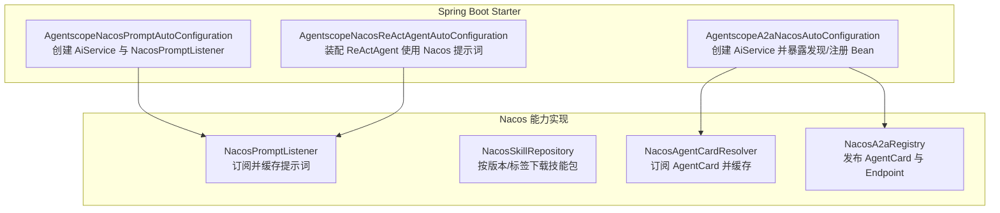
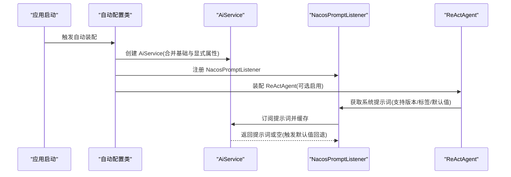
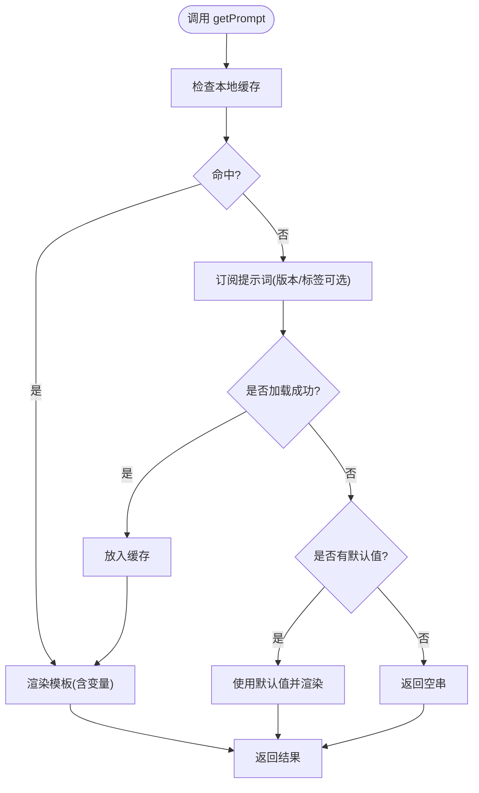
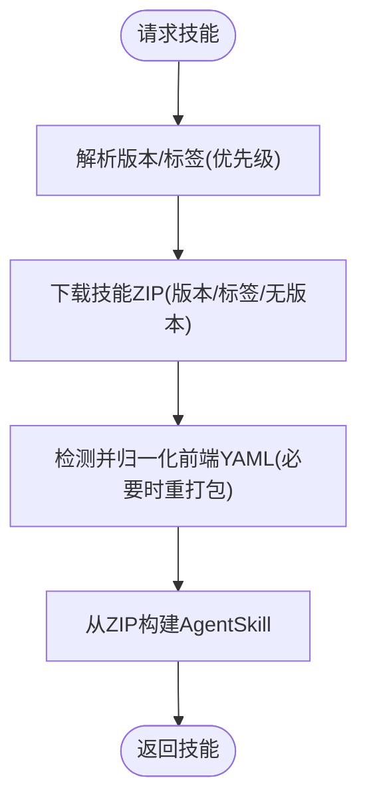
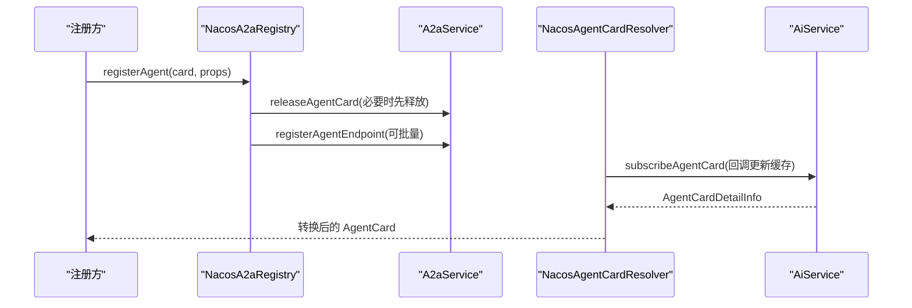
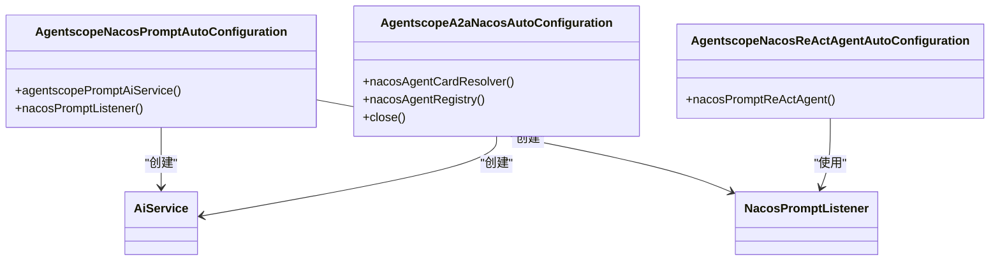
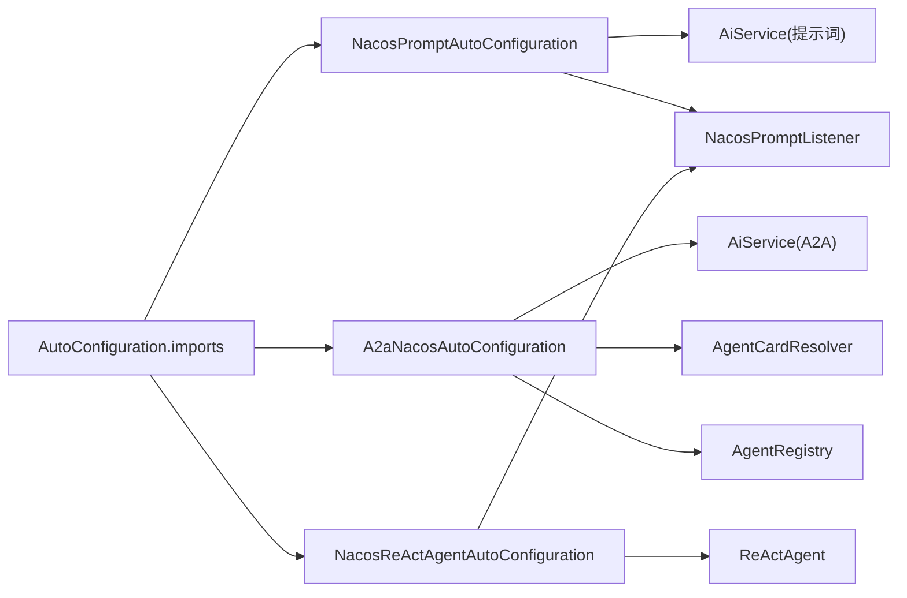

# Nacos 配置中心 Starter 模块

<cite>
**本文引用的文件**
- [NacosSkillRepository.java](file://agentscope-extensions/agentscope-extensions-nacos/agentscope-extensions-nacos-skill/src/main/java/io/agentscope/core/nacos/skill/NacosSkillRepository.java)
- [NacosPromptListener.java](file://agentscope-extensions/agentscope-extensions-nacos/agentscope-extensions-nacos-prompt/src/main/java/io/agentscope/core/nacos/prompt/NacosPromptListener.java)
- [NacosAgentCardResolver.java](file://agentscope-extensions/agentscope-extensions-nacos/agentscope-extensions-nacos-a2a/src/main/java/io/agentscope/core/nacos/a2a/discovery/NacosAgentCardResolver.java)
- [NacosA2aRegistry.java](file://agentscope-extensions/agentscope-extensions-nacos/agentscope-extensions-nacos-a2a/src/main/java/io/agentscope/core/nacos/a2a/registry/NacosA2aRegistry.java)
- [NacosA2aRegistryProperties.java](file://agentscope-extensions/agentscope-extensions-nacos/agentscope-extensions-nacos-a2a/src/main/java/io/agentscope/core/nacos/a2a/registry/NacosA2aRegistryProperties.java)
- [AgentscopeNacosPromptAutoConfiguration.java](file://agentscope-extensions/agentscope-spring-boot-starters/agentscope-nacos-spring-boot-starter/src/main/java/io/agentscope/spring/boot/nacos/AgentscopeNacosPromptAutoConfiguration.java)
- [AgentscopeA2aNacosAutoConfiguration.java](file://agentscope-extensions/agentscope-spring-boot-starters/agentscope-nacos-spring-boot-starter/src/main/java/io/agentscope/spring/boot/nacos/AgentscopeA2aNacosAutoConfiguration.java)
- [AgentscopeNacosReActAgentAutoConfiguration.java](file://agentscope-extensions/agentscope-spring-boot-starters/agentscope-nacos-spring-boot-starter/src/main/java/io/agentscope/spring/boot/nacos/AgentscopeNacosReActAgentAutoConfiguration.java)
- [org.springframework.boot.autoconfigure.AutoConfiguration.imports](file://agentscope-extensions/agentscope-spring-boot-starters/agentscope-nacos-spring-boot-starter/src/main/resources/META-INF/spring/org.springframework.boot.autoconfigure.AutoConfiguration.imports)
</cite>

## 目录
1. [简介](#简介)
2. [项目结构](#项目结构)
3. [核心组件](#核心组件)
4. [架构总览](#架构总览)
5. [详细组件分析](#详细组件分析)
6. [依赖关系分析](#依赖关系分析)
7. [性能与可靠性](#性能与可靠性)
8. [故障排查指南](#故障排查指南)
9. [结论](#结论)
10. [附录：配置示例与最佳实践](#附录配置示例与最佳实践)

## 简介
本文件面向使用 AgentScope Java 的开发者，系统性阐述 Nacos 配置中心 Spring Boot Starter 模块的设计与实现，重点覆盖以下方面：
- 自动配置机制：AiService Bean 的创建、Nacos 客户端 Bean 的注入、监听器的注册策略
- Nacos 集成能力：提示词监听与热更新、智能体技能仓库的动态加载（基于 Nacos 技能包）、A2A 场景下的服务发现与注册
- Maven 引入方式：agentscope-extensions-nacos-* 相关模块与 Nacos 客户端依赖
- 启动流程与配置同步：从应用启动到首次订阅、缓存与回退、版本/标签选择策略
- 故障排查与配置管理最佳实践

## 项目结构
Nacos Starter 模块位于 agentscope-extensions 下，分为三类：
- Spring Boot Starter：自动装配入口与 Bean 定义
- Nacos 能力实现：提示词监听、技能仓库、A2A 发现与注册
- 示例与测试：示例工程与单元测试

图表来源
- [AgentscopeNacosPromptAutoConfiguration.java:1-77](file://agentscope-extensions/agentscope-spring-boot-starters/agentscope-nacos-spring-boot-starter/src/main/java/io/agentscope/spring/boot/nacos/AgentscopeNacosPromptAutoConfiguration.java#L1-L77)
- [AgentscopeA2aNacosAutoConfiguration.java:1-148](file://agentscope-extensions/agentscope-spring-boot-starters/agentscope-spring-boot-starter/src/main/java/io/agentscope/spring/boot/nacos/AgentscopeA2aNacosAutoConfiguration.java#L1-L148)
- [AgentscopeNacosReActAgentAutoConfiguration.java:1-109](file://agentscope-extensions/agentscope-spring-boot-starters/agentscope-nacos-spring-boot-starter/src/main/java/io/agentscope/spring/boot/nacos/AgentscopeNacosReActAgentAutoConfiguration.java#L1-L109)
- [NacosPromptListener.java:1-160](file://agentscope-extensions/agentscope-extensions-nacos/agentscope-extensions-nacos-prompt/src/main/java/io/agentscope/core/nacos/prompt/NacosPromptListener.java#L1-L160)
- [NacosSkillRepository.java:1-507](file://agentscope-extensions/agentscope-extensions-nacos/agentscope-extensions-nacos-skill/src/main/java/io/agentscope/core/nacos/skill/NacosSkillRepository.java#L1-L507)
- [NacosAgentCardResolver.java:1-123](file://agentscope-extensions/agentscope-extensions-nacos/agentscope-extensions-nacos-a2a/src/main/java/io/agentscope/core/nacos/a2a/discovery/NacosAgentCardResolver.java#L1-L123)
- [NacosA2aRegistry.java:1-150](file://agentscope-extensions/agentscope-extensions-nacos/agentscope-extensions-nacos-a2a/src/main/java/io/agentscope/core/nacos/a2a/registry/NacosA2aRegistry.java#L1-L150)

章节来源
- [org.springframework.boot.autoconfigure.AutoConfiguration.imports:1-19](file://agentscope-extensions/agentscope-spring-boot-starters/agentscope-nacos-spring-boot-starter/src/main/resources/META-INF/spring/org.springframework.boot.autoconfigure.AutoConfiguration.imports#L1-L19)

## 核心组件
- NacosPromptListener：负责订阅与缓存提示词，支持版本/标签选择与默认值回退渲染
- NacosSkillRepository：从 Nacos 下载技能包 ZIP，适配前端 YAML，构建 AgentSkill
- NacosAgentCardResolver：订阅并缓存远端 AgentCard，用于 A2A 远程代理
- NacosA2aRegistry：发布 AgentCard 与 Endpoint 到 Nacos，支持多传输协议端点
- Spring Boot 自动配置类：创建 AiService、注册监听器与装配 ReActAgent

章节来源
- [NacosPromptListener.java:1-160](file://agentscope-extensions/agentscope-extensions-nacos/agentscope-extensions-nacos-prompt/src/main/java/io/agentscope/core/nacos/prompt/NacosPromptListener.java#L1-L160)
- [NacosSkillRepository.java:1-507](file://agentscope-extensions/agentscope-extensions-nacos/agentscope-extensions-nacos-skill/src/main/java/io/agentscope/core/nacos/skill/NacosSkillRepository.java#L1-L507)
- [NacosAgentCardResolver.java:1-123](file://agentscope-extensions/agentscope-extensions-nacos/agentscope-extensions-nacos-a2a/src/main/java/io/agentscope/core/nacos/a2a/discovery/NacosAgentCardResolver.java#L1-L123)
- [NacosA2aRegistry.java:1-150](file://agentscope-extensions/agentscope-extensions-nacos/agentscope-extensions-nacos-a2a/src/main/java/io/agentscope/core/nacos/a2a/registry/NacosA2aRegistry.java#L1-L150)
- [AgentscopeNacosPromptAutoConfiguration.java:1-77](file://agentscope-extensions/agentscope-spring-boot-starters/agentscope-nacos-spring-boot-starter/src/main/java/io/agentscope/spring/boot/nacos/AgentscopeNacosPromptAutoConfiguration.java#L1-L77)
- [AgentscopeA2aNacosAutoConfiguration.java:1-148](file://agentscope-extensions/agentscope-spring-boot-starters/agentscope-nacos-spring-boot-starter/src/main/java/io/agentscope/spring/boot/nacos/AgentscopeA2aNacosAutoConfiguration.java#L1-L148)
- [AgentscopeNacosReActAgentAutoConfiguration.java:1-109](file://agentscope-extensions/agentscope-spring-boot-starters/agentscope-nacos-spring-boot-starter/src/main/java/io/agentscope/spring/boot/nacos/AgentscopeNacosReActAgentAutoConfiguration.java#L1-L109)

## 架构总览
下图展示 Nacos Starter 在应用启动时的装配路径与运行时交互：

图表来源
- [AgentscopeNacosPromptAutoConfiguration.java:60-75](file://agentscope-extensions/agentscope-spring-boot-starters/agentscope-nacos-spring-boot-starter/src/main/java/io/agentscope/spring/boot/nacos/AgentscopeNacosPromptAutoConfiguration.java#L60-L75)
- [AgentscopeNacosReActAgentAutoConfiguration.java:64-107](file://agentscope-extensions/agentscope-spring-boot-starters/agentscope-nacos-spring-boot-starter/src/main/java/io/agentscope/spring/boot/nacos/AgentscopeNacosReActAgentAutoConfiguration.java#L64-L107)
- [NacosPromptListener.java:71-139](file://agentscope-extensions/agentscope-extensions-nacos/agentscope-extensions-nacos-prompt/src/main/java/io/agentscope/core/nacos/prompt/NacosPromptListener.java#L71-L139)

## 详细组件分析

### 组件一：提示词监听与热更新（NacosPromptListener）
- 功能要点
  - 订阅指定 key 的提示词，支持版本/标签定位；若未命中则回退到默认值并进行变量渲染
  - 内部维护并发安全的提示词缓存，首次访问触发订阅并缓存
  - 对空模板或缺失模板的场景提供默认值回退策略
- 关键行为
  - getPrompt 支持多重重载，最终统一走带版本/标签/默认值的实现
  - 订阅失败时记录错误日志，并在提供默认值时返回渲染后的字符串
- 复杂度与性能
  - 缓存为并发映射，读写均摊常数时间；首次订阅存在网络开销，后续为内存命中

图表来源
- [NacosPromptListener.java:71-139](file://agentscope-extensions/agentscope-extensions-nacos/agentscope-extensions-nacos-prompt/src/main/java/io/agentscope/core/nacos/prompt/NacosPromptListener.java#L71-L139)

章节来源
- [NacosPromptListener.java:1-160](file://agentscope-extensions/agentscope-extensions-nacos/agentscope-extensions-nacos-prompt/src/main/java/io/agentscope/core/nacos/prompt/NacosPromptListener.java#L1-L160)

### 组件二：技能仓库动态加载（NacosSkillRepository）
- 功能要点
  - 基于 Nacos AI Service 下载技能包 ZIP，按版本或标签优先选择，否则无版本下载
  - 对导出的前端 YAML（可能包含缩进续行）进行归一化处理，确保 AgentScope 解析器可正确读取
  - 只读仓库：不支持列出与写入操作，相关方法仅记录警告并返回空结果
- 关键行为
  - 版本/标签解析顺序：Properties → JVM 系统属性 → 环境变量
  - ZIP 重打包仅在必要时进行，失败则回退原包
- 复杂度与性能
  - ZIP 解析与重打包为 O(n) 文件遍历；前端 YAML 归一化为线性扫描

图表来源
- [NacosSkillRepository.java:119-261](file://agentscope-extensions/agentscope-extensions-nacos/agentscope-extensions-nacos-skill/src/main/java/io/agentscope/core/nacos/skill/NacosSkillRepository.java#L119-L261)

章节来源
- [NacosSkillRepository.java:1-507](file://agentscope-extensions/agentscope-extensions-nacos/agentscope-extensions-nacos-skill/src/main/java/io/agentscope/core/nacos/skill/NacosSkillRepository.java#L1-L507)

### 组件三：A2A 服务发现与注册（NacosAgentCardResolver / NacosA2aRegistry）
- 功能要点
  - 发现侧：订阅 AgentCard，转换为内部 AgentCard 结构并缓存，事件驱动更新
  - 注册侧：发布 AgentCard 与 Endpoint 列表，支持多传输协议端点与“设为最新”策略
- 关键行为
  - 注册前尝试释放同名卡片，避免冲突；端点注册可按配置开启
  - 支持覆盖首选传输与 URL 字段，便于统一路由策略

图表来源
- [NacosA2aRegistry.java:68-134](file://agentscope-extensions/agentscope-extensions-nacos/agentscope-extensions-nacos-a2a/src/main/java/io/agentscope/core/nacos/a2a/registry/NacosA2aRegistry.java#L68-L134)
- [NacosAgentCardResolver.java:101-121](file://agentscope-extensions/agentscope-extensions-nacos/agentscope-extensions-nacos-a2a/src/main/java/io/agentscope/core/nacos/a2a/discovery/NacosAgentCardResolver.java#L101-L121)

章节来源
- [NacosAgentCardResolver.java:1-123](file://agentscope-extensions/agentscope-extensions-nacos/agentscope-extensions-nacos-a2a/src/main/java/io/agentscope/core/nacos/a2a/discovery/NacosAgentCardResolver.java#L1-L123)
- [NacosA2aRegistry.java:1-150](file://agentscope-extensions/agentscope-extensions-nacos/agentscope-extensions-nacos-a2a/src/main/java/io/agentscope/core/nacos/a2a/registry/NacosA2aRegistry.java#L1-L150)
- [NacosA2aRegistryProperties.java:1-141](file://agentscope-extensions/agentscope-extensions-nacos/agentscope-extensions-nacos-a2a/src/main/java/io/agentscope/core/nacos/a2a/registry/NacosA2aRegistryProperties.java#L1-L141)

### 组件四：自动配置与 Bean 注册（Spring Boot）
- 自动配置类职责
  - AgentscopeNacosPromptAutoConfiguration：创建 AiService 与 NacosPromptListener，条件启用
  - AgentscopeA2aNacosAutoConfiguration：创建独立 AiService，暴露 AgentCardResolver 与 AgentRegistry
  - AgentscopeNacosReActAgentAutoConfiguration：在已有模型/记忆/工具基础上，装配 ReActAgent 并注入来自 Nacos 的系统提示词
- 条件与顺序
  - 通过前缀开关控制启用；AutoConfigureBefore 确保在核心 AgentScope 自动配置之前完成
  - AiService 属性合并：基础属性 + 显式提示词属性

图表来源
- [AgentscopeNacosPromptAutoConfiguration.java:58-76](file://agentscope-extensions/agentscope-spring-boot-starters/agentscope-nacos-spring-boot-starter/src/main/java/io/agentscope/spring/boot/nacos/AgentscopeNacosPromptAutoConfiguration.java#L58-L76)
- [AgentscopeA2aNacosAutoConfiguration.java:58-147](file://agentscope-extensions/agentscope-spring-boot-starters/agentscope-nacos-spring-boot-starter/src/main/java/io/agentscope/spring/boot/nacos/AgentscopeA2aNacosAutoConfiguration.java#L58-L147)
- [AgentscopeNacosReActAgentAutoConfiguration.java:59-108](file://agentscope-extensions/agentscope-spring-boot-starters/agentscope-nacos-spring-boot-starter/src/main/java/io/agentscope/spring/boot/nacos/AgentscopeNacosReActAgentAutoConfiguration.java#L59-L108)

章节来源
- [AgentscopeNacosPromptAutoConfiguration.java:1-77](file://agentscope-extensions/agentscope-spring-boot-starters/agentscope-nacos-spring-boot-starter/src/main/java/io/agentscope/spring/boot/nacos/AgentscopeNacosPromptAutoConfiguration.java#L1-L77)
- [AgentscopeA2aNacosAutoConfiguration.java:1-148](file://agentscope-extensions/agentscope-spring-boot-starters/agentscope-nacos-spring-boot-starter/src/main/java/io/agentscope/spring/boot/nacos/AgentscopeA2aNacosAutoConfiguration.java#L1-L148)
- [AgentscopeNacosReActAgentAutoConfiguration.java:1-109](file://agentscope-extensions/agentscope-spring-boot-starters/agentscope-nacos-spring-boot-starter/src/main/java/io/agentscope/spring/boot/nacos/AgentscopeNacosReActAgentAutoConfiguration.java#L1-L109)

## 依赖关系分析
- 自动装配入口由 Spring Boot 的 AutoConfiguration.imports 统一声明，确保三个自动配置类被加载
- AiService 作为 Nacos 客户端核心 Bean，分别在提示词与 A2A 场景中复用或隔离
- NacosPromptListener 与 ReActAgent 的装配链路清晰，提示词来源优先级明确

图表来源
- [org.springframework.boot.autoconfigure.AutoConfiguration.imports:16-18](file://agentscope-extensions/agentscope-spring-boot-starters/agentscope-nacos-spring-boot-starter/src/main/resources/META-INF/spring/org.springframework.boot.autoconfigure.AutoConfiguration.imports#L16-L18)
- [AgentscopeNacosPromptAutoConfiguration.java:58-76](file://agentscope-extensions/agentscope-spring-boot-starters/agentscope-nacos-spring-boot-starter/src/main/java/io/agentscope/spring/boot/nacos/AgentscopeNacosPromptAutoConfiguration.java#L58-L76)
- [AgentscopeA2aNacosAutoConfiguration.java:110-136](file://agentscope-extensions/agentscope-spring-boot-starters/agentscope-nacos-spring-boot-starter/src/main/java/io/agentscope/spring/boot/nacos/AgentscopeA2aNacosAutoConfiguration.java#L110-L136)
- [AgentscopeNacosReActAgentAutoConfiguration.java:64-107](file://agentscope-extensions/agentscope-spring-boot-starters/agentscope-nacos-spring-boot-starter/src/main/java/io/agentscope/spring/boot/nacos/AgentscopeNacosReActAgentAutoConfiguration.java#L64-L107)

章节来源
- [org.springframework.boot.autoconfigure.AutoConfiguration.imports:1-19](file://agentscope-extensions/agentscope-spring-boot-starters/agentscope-nacos-spring-boot-starter/src/main/resources/META-INF/spring/org.springframework.boot.autoconfigure.AutoConfiguration.imports#L1-L19)

## 性能与可靠性
- 首次订阅延迟：提示词与 AgentCard 首次访问会触发网络订阅，建议在应用启动阶段预热关键 key
- 缓存命中优化：NacosPromptListener 与 AgentCardResolver 内部缓存显著降低重复订阅成本
- 只读仓库策略：NacosSkillRepository 不支持列表与写入，避免不必要的状态同步开销
- 回退与容错：提示词缺失时使用默认值并渲染，减少异常对业务的影响
- 独立客户端：A2A 与提示词场景分别创建 AiService，避免跨模块客户端冲突与资源竞争

## 故障排查指南
- 提示词未生效
  - 检查开关与前缀：确认相关 enabled 开关已启用
  - 检查 key/版本/标签：确认 key 存在且版本/标签匹配
  - 默认值回退：若 Nacos 中无对应提示词，将回退到 YAML 中的默认值
- 技能加载失败
  - 检查技能名称与命名空间；确认版本/标签解析顺序（Properties → JVM → 环境变量）
  - 若前端 YAML 存在缩进续行，系统会尝试归一化；如仍失败，检查导出格式
- A2A 发现/注册异常
  - 检查 AiService 属性合并是否正确；注册前会尝试释放同名卡片，避免冲突
  - 确认端点配置与传输协议字段完整
- 日志与诊断
  - 关注订阅失败、缓存未命中、默认值回退等日志信息，定位问题根因

章节来源
- [NacosPromptListener.java:112-139](file://agentscope-extensions/agentscope-extensions-nacos/agentscope-extensions-nacos-prompt/src/main/java/io/agentscope/core/nacos/prompt/NacosPromptListener.java#L112-L139)
- [NacosSkillRepository.java:128-144](file://agentscope-extensions/agentscope-extensions-nacos/agentscope-extensions-nacos-skill/src/main/java/io/agentscope/core/nacos/skill/NacosSkillRepository.java#L128-L144)
- [NacosA2aRegistry.java:79-103](file://agentscope-extensions/agentscope-extensions-nacos/agentscope-extensions-nacos-a2a/src/main/java/io/agentscope/core/nacos/a2a/registry/NacosA2aRegistry.java#L79-L103)

## 结论
Nacos Starter 将提示词、技能与 A2A 能力以 Spring Boot 自动配置的方式无缝集成到 AgentScope 生态中。其设计强调：
- 明确的优先级与回退策略（版本/标签、默认值）
- 并发安全的本地缓存与最小化的网络交互
- 分离的客户端实例，避免跨模块冲突
- 清晰的装配链路与可观测的日志输出

## 附录：配置示例与最佳实践
- Maven 依赖引入
  - 引入 agentscope-nacos-spring-boot-starter，即可激活提示词与 A2A 相关自动配置
  - 引入 agentscope-extensions-nacos-skill 以启用 Nacos 技能仓库能力
  - 引入 agentscope-extensions-nacos-prompt 以启用提示词监听能力
  - 引入 agentscope-extensions-nacos-a2a 以启用 A2A 发现与注册能力
- 典型 application.yml 配置要点（示意）
  - Nacos 基础属性：服务地址、命名空间、鉴权等
  - 提示词开关与 key：启用开关、系统提示词 key、版本/标签、变量映射、默认值
  - A2A 开关：启用发现、启用注册、注册为最新、端点注册开关、覆盖首选传输
- 最佳实践
  - 将关键提示词 key 与版本/标签固化在配置中，避免运行期变更
  - 使用默认值保证降级可用性，同时在灰度发布时逐步切换版本/标签
  - A2A 场景下为不同传输协议分别配置端点，确保路由一致性
  - 对高频访问的提示词与 AgentCard 进行启动预热，降低首访延迟