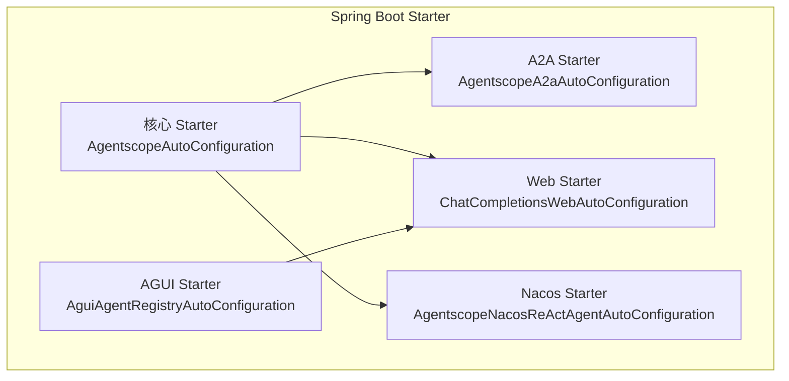
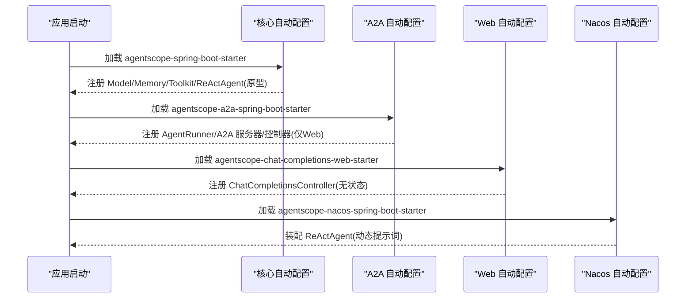
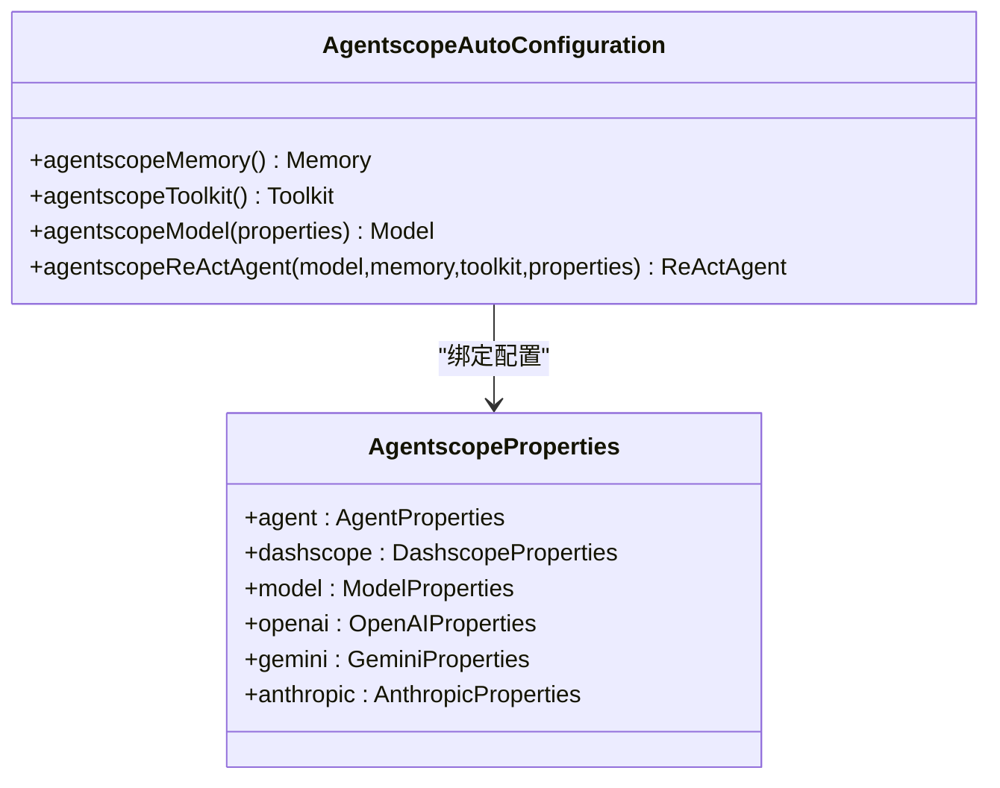
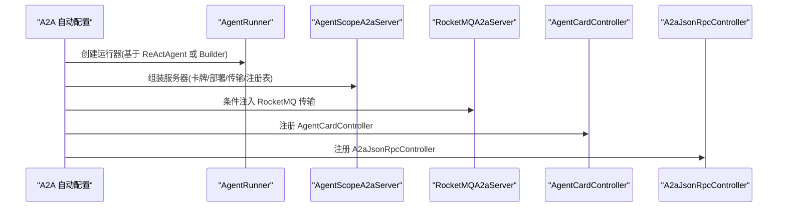
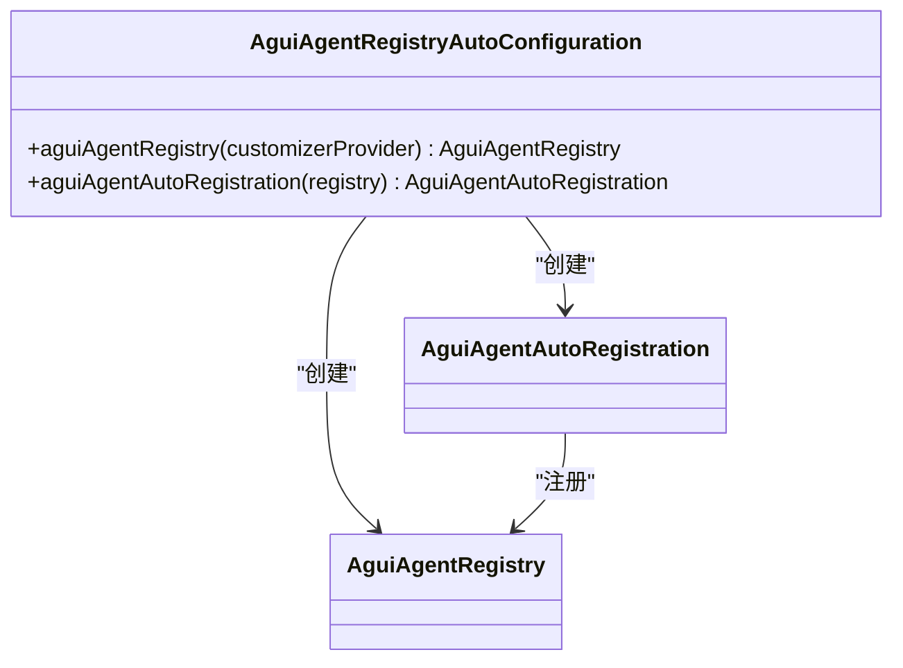
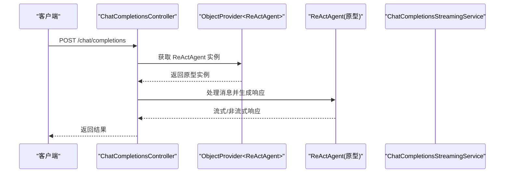
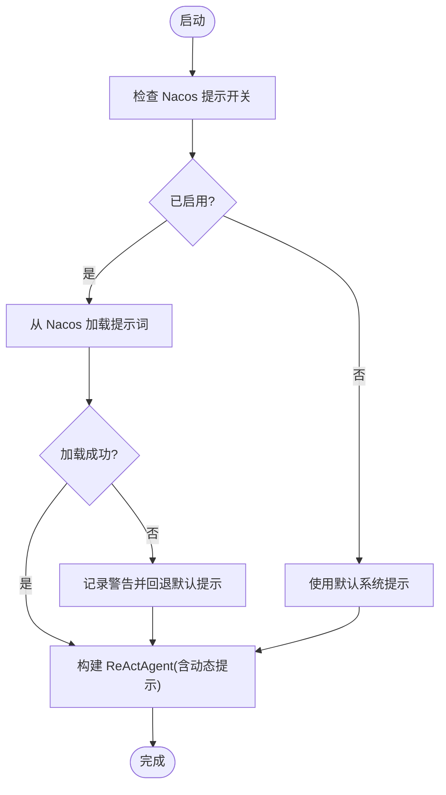
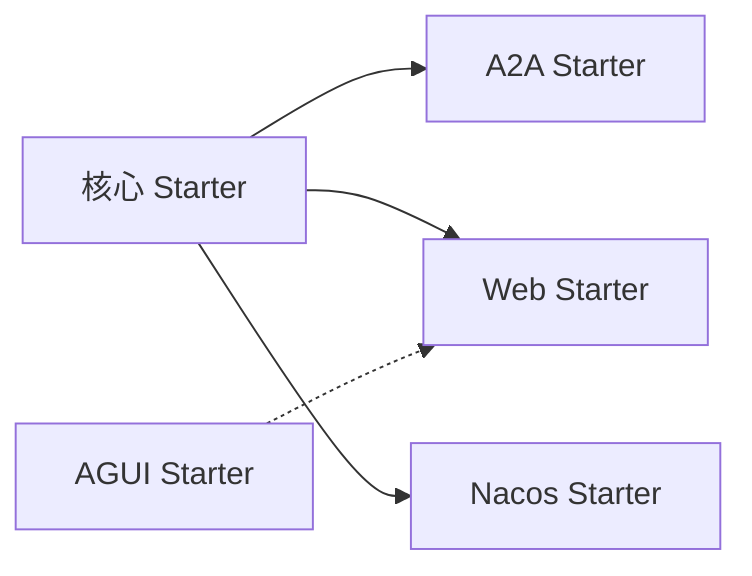

# Spring Boot 集成

<cite>
**本文引用的文件**
- [agentscope-spring-boot-starter/src/main/resources/META-INF/spring/org.springframework.boot.autoconfigure.AutoConfiguration.imports](file://agentscope-extensions/agentscope-spring-boot-starters/agentscope-spring-boot-starter/src/main/resources/META-INF/spring/org.springframework.boot.autoconfigure.AutoConfiguration.imports)
- [AgentscopeAutoConfiguration.java](file://agentscope-extensions/agentscope-spring-boot-starters/agentscope-spring-boot-starter/src/main/java/io/agentscope/spring/boot/AgentscopeAutoConfiguration.java)
- [AgentscopeProperties.java](file://agentscope-extensions/agentscope-spring-boot-starters/agentscope-spring-boot-starter/src/main/java/io/agentscope/spring/boot/properties/AgentscopeProperties.java)
- [agentscope-a2a-spring-boot-starter/src/main/resources/META-INF/spring/org.springframework.boot.autoconfigure.AutoConfiguration.imports](file://agentscope-extensions/agentscope-spring-boot-starters/agentscope-a2a-spring-boot-starter/src/main/resources/META-INF/spring/org.springframework.boot.autoconfigure.AutoConfiguration.imports)
- [AgentscopeA2aAutoConfiguration.java](file://agentscope-extensions/agentscope-spring-boot-starters/agentscope-a2a-spring-boot-starter/src/main/java/io/agentscope/spring/boot/a2a/AgentscopeA2aAutoConfiguration.java)
- [agentscope-agui-spring-boot-starter/src/main/resources/META-INF/spring/org.springframework.boot.autoconfigure.AutoConfiguration.imports](file://agentscope-extensions/agentscope-spring-boot-starters/agentscope-agui-spring-boot-starter/src/main/resources/META-INF/spring/org.springframework.boot.autoconfigure.AutoConfiguration.imports)
- [AguiAgentRegistryAutoConfiguration.java](file://agentscope-extensions/agentscope-spring-boot-starters/agentscope-agui-spring-boot-starter/src/main/java/io/agentscope/spring/boot/agui/common/AguiAgentRegistryAutoConfiguration.java)
- [agentscope-chat-completions-web-starter/src/main/resources/META-INF/spring/org.springframework.boot.autoconfigure.AutoConfiguration.imports](file://agentscope-extensions/agentscope-spring-boot-starters/agentscope-chat-completions-web-starter/src/main/resources/META-INF/spring/org.springframework.boot.autoconfigure.AutoConfiguration.imports)
- [ChatCompletionsWebAutoConfiguration.java](file://agentscope-extensions/agentscope-spring-boot-starters/agentscope-chat-completions-web-starter/src/main/java/io/agentscope/spring/boot/chat/config/ChatCompletionsWebAutoConfiguration.java)
- [agentscope-nacos-spring-boot-starter/src/main/resources/META-INF/spring/org.springframework.boot.autoconfigure.AutoConfiguration.imports](file://agentscope-extensions/agentscope-spring-boot-starters/agentscope-nacos-spring-boot-starter/src/main/resources/META-INF/spring/org.springframework.boot.autoconfigure.AutoConfiguration.imports)
- [AgentscopeNacosReActAgentAutoConfiguration.java](file://agentscope-extensions/agentscope-spring-boot-starters/agentscope-nacos-spring-boot-starter/src/main/java/io/agentscope/spring/boot/nacos/AgentscopeNacosReActAgentAutoConfiguration.java)
</cite>

## 目录
1. [简介](#简介)
2. [项目结构](#项目结构)
3. [核心组件](#核心组件)
4. [架构总览](#架构总览)
5. [组件详解](#组件详解)
6. [依赖关系分析](#依赖关系分析)
7. [性能考量](#性能考量)
8. [故障排查指南](#故障排查指南)
9. [结论](#结论)
10. [附录](#附录)

## 简介
本文件面向希望在 Spring Boot 应用中快速集成 AgentScope 的开发者，系统性讲解 Spring Boot Starter 的自动配置机制、条件注解与配置属性绑定、Bean 定义与生命周期管理，并对各 Starter 模块（核心、A2A、AGUI、Web、Nacos）的功能特性进行深入说明。同时提供 Maven 依赖配置示例与 application.yml 配置模板，帮助读者快速落地。

## 项目结构
Spring Boot Starter 模块位于 agentscope-extensions/agentscope-spring-boot-starters 下，按功能拆分为多个子模块：
- 核心 Starter：提供默认 Model、Memory、Toolkit、ReActAgent Bean 及配置属性绑定
- A2A Starter：提供智能体间通信服务端、JSON-RPC 控制器、RocketMQ 扩展
- AGUI Starter：提供 AGUI 图形界面集成的注册表与 MVC/WebFlux 自动配置
- Web Starter：提供 OpenAI 兼容的聊天完成接口（无状态设计）
- Nacos Starter：基于 Nacos 动态加载提示词并装配 ReActAgent

图表来源
- [agentscope-spring-boot-starter/src/main/resources/META-INF/spring/org.springframework.boot.autoconfigure.AutoConfiguration.imports:16-16](file://agentscope-extensions/agentscope-spring-boot-starters/agentscope-spring-boot-starter/src/main/resources/META-INF/spring/org.springframework.boot.autoconfigure.AutoConfiguration.imports#L16-L16)
- [agentscope-a2a-spring-boot-starter/src/main/resources/META-INF/spring/org.springframework.boot.autoconfigure.AutoConfiguration.imports:1-1](file://agentscope-extensions/agentscope-spring-boot-starters/agentscope-a2a-spring-boot-starter/src/main/resources/META-INF/spring/org.springframework.boot.autoconfigure.AutoConfiguration.imports#L1-L1)
- [agentscope-agui-spring-boot-starter/src/main/resources/META-INF/spring/org.springframework.boot.autoconfigure.AutoConfiguration.imports:1-4](file://agentscope-extensions/agentscope-spring-boot-starters/agentscope-agui-spring-boot-starter/src/main/resources/META-INF/spring/org.springframework.boot.autoconfigure.AutoConfiguration.imports#L1-L4)
- [agentscope-chat-completions-web-starter/src/main/resources/META-INF/spring/org.springframework.boot.autoconfigure.AutoConfiguration.imports:16-16](file://agentscope-extensions/agentscope-spring-boot-starters/agentscope-chat-completions-web-starter/src/main/resources/META-INF/spring/org.springframework.boot.autoconfigure.AutoConfiguration.imports#L16-L16)
- [agentscope-nacos-spring-boot-starter/src/main/resources/META-INF/spring/org.springframework.boot.autoconfigure.AutoConfiguration.imports:16-18](file://agentscope-extensions/agentscope-spring-boot-starters/agentscope-nacos-spring-boot-starter/src/main/resources/META-INF/spring/org.springframework.boot.autoconfigure.AutoConfiguration.imports#L16-L18)

章节来源
- [agentscope-spring-boot-starter/src/main/resources/META-INF/spring/org.springframework.boot.autoconfigure.AutoConfiguration.imports:16-16](file://agentscope-extensions/agentscope-spring-boot-starters/agentscope-spring-boot-starter/src/main/resources/META-INF/spring/org.springframework.boot.autoconfigure.AutoConfiguration.imports#L16-L16)
- [agentscope-a2a-spring-boot-starter/src/main/resources/META-INF/spring/org.springframework.boot.autoconfigure.AutoConfiguration.imports:1-1](file://agentscope-extensions/agentscope-spring-boot-starters/agentscope-a2a-spring-boot-starter/src/main/resources/META-INF/spring/org.springframework.boot.autoconfigure.AutoConfiguration.imports#L1-L1)
- [agentscope-agui-spring-boot-starter/src/main/resources/META-INF/spring/org.springframework.boot.autoconfigure.AutoConfiguration.imports:1-4](file://agentscope-extensions/agentscope-spring-boot-starters/agentscope-agui-spring-boot-starter/src/main/resources/META-INF/spring/org.springframework.boot.autoconfigure.AutoConfiguration.imports#L1-L4)
- [agentscope-chat-completions-web-starter/src/main/resources/META-INF/spring/org.springframework.boot.autoconfigure.AutoConfiguration.imports:16-16](file://agentscope-extensions/agentscope-spring-boot-starters/agentscope-chat-completions-web-starter/src/main/resources/META-INF/spring/org.springframework.boot.autoconfigure.AutoConfiguration.imports#L16-L16)
- [agentscope-nacos-spring-boot-starter/src/main/resources/META-INF/spring/org.springframework.boot.autoconfigure.AutoConfiguration.imports:16-18](file://agentscope-extensions/agentscope-spring-boot-starters/agentscope-nacos-spring-boot-starter/src/main/resources/META-INF/spring/org.springframework.boot.autoconfigure.AutoConfiguration.imports#L16-L18)

## 核心组件
- 自动配置入口
  - 核心 Starter 通过 AutoConfiguration.imports 声明自动配置类，Spring Boot 启动时扫描加载
  - A2A、Web、Nacos Starter 同理，分别声明各自的自动配置类
- 条件注解
  - @ConditionalOnClass：仅当类存在时启用
  - @ConditionalOnProperty：根据配置开关启用
  - @ConditionalOnMissingBean：避免重复定义
  - @ConditionalOnWebApplication：限定 Web 环境
- 配置属性绑定
  - 使用 @EnableConfigurationProperties 绑定前缀 agentscope 的配置对象树
  - 通过 @ConfigurationProperties(prefix="agentscope") 将配置映射到属性类
- Bean 定义与作用域
  - 默认 Bean 采用原型作用域（prototype），确保线程安全与会话隔离
  - 通过 ObjectProvider 或方法注入获取实例，避免共享可变状态

章节来源
- [AgentscopeAutoConfiguration.java:125-211](file://agentscope-extensions/agentscope-spring-boot-starters/agentscope-spring-boot-starter/src/main/java/io/agentscope/spring/boot/AgentscopeAutoConfiguration.java#L125-L211)
- [AgentscopeProperties.java:34-72](file://agentscope-extensions/agentscope-spring-boot-starters/agentscope-spring-boot-starter/src/main/java/io/agentscope/spring/boot/properties/AgentscopeProperties.java#L34-L72)

## 架构总览
下图展示各 Starter 在应用启动时的装配顺序与依赖关系：

图表来源
- [AgentscopeAutoConfiguration.java:125-211](file://agentscope-extensions/agentscope-spring-boot-starters/agentscope-spring-boot-starter/src/main/java/io/agentscope/spring/boot/AgentscopeAutoConfiguration.java#L125-L211)
- [AgentscopeA2aAutoConfiguration.java:58-152](file://agentscope-extensions/agentscope-spring-boot-starters/agentscope-a2a-spring-boot-starter/src/main/java/io/agentscope/spring/boot/a2a/AgentscopeA2aAutoConfiguration.java#L58-L152)
- [ChatCompletionsWebAutoConfiguration.java:53-149](file://agentscope-extensions/agentscope-spring-boot-starters/agentscope-chat-completions-web-starter/src/main/java/io/agentscope/spring/boot/chat/config/ChatCompletionsWebAutoConfiguration.java#L53-L149)
- [AgentscopeNacosReActAgentAutoConfiguration.java:50-107](file://agentscope-extensions/agentscope-spring-boot-starters/agentscope-nacos-spring-boot-starter/src/main/java/io/agentscope/spring/boot/nacos/AgentscopeNacosReActAgentAutoConfiguration.java#L50-L107)

## 组件详解

### 核心 Starter（基础集成）
- 功能要点
  - 自动暴露 Model、Memory、Toolkit、ReActAgent Bean
  - 支持多模型提供商（DashScope、OpenAI、Gemini、Anthropic）
  - 通过配置属性控制启用与行为
- 自动配置工作原理
  - 通过 @EnableConfigurationProperties 绑定 AgentscopeProperties
  - 使用 @ConditionalOnClass(ReActAgent.class) 确保运行环境具备 AgentScope 核心能力
  - 使用 @ConditionalOnProperty(prefix="agentscope.agent", name="enabled", havingValue="true") 控制启用
  - Bean 作用域为原型，避免并发与会话污染
- 配置属性绑定
  - agentscope.agent.*：智能体名称、系统提示、最大迭代次数等
  - agentscope.model.provider：模型提供商类型
  - 各模型命名空间（agentscope.dashscope、agentscope.openai、agentscope.gemini、agentscope.anthropic）用于具体参数
- Bean 生命周期
  - Memory/Toolkit/Model/ReActAgent 均为原型作用域；在控制器或服务中应通过 ObjectProvider 获取新实例

图表来源
- [AgentscopeAutoConfiguration.java:125-211](file://agentscope-extensions/agentscope-spring-boot-starters/agentscope-spring-boot-starter/src/main/java/io/agentscope/spring/boot/AgentscopeAutoConfiguration.java#L125-L211)
- [AgentscopeProperties.java:34-72](file://agentscope-extensions/agentscope-spring-boot-starters/agentscope-spring-boot-starter/src/main/java/io/agentscope/spring/boot/properties/AgentscopeProperties.java#L34-L72)

章节来源
- [AgentscopeAutoConfiguration.java:125-211](file://agentscope-extensions/agentscope-spring-boot-starters/agentscope-spring-boot-starter/src/main/java/io/agentscope/spring/boot/AgentscopeAutoConfiguration.java#L125-L211)
- [AgentscopeProperties.java:34-72](file://agentscope-extensions/agentscope-spring-boot-starters/agentscope-spring-boot-starter/src/main/java/io/agentscope/spring/boot/properties/AgentscopeProperties.java#L34-L72)

### A2A Starter（智能体间通信）
- 功能要点
  - 提供 AgentScopeA2aServer 与 RocketMQA2aServer
  - 暴露 AgentCardController 与 A2aJsonRpcController
  - 支持基于 ReActAgent.Builder 或已存在的 ReActAgent 运行器
- 自动配置要点
  - 依赖 AgentscopeAutoConfiguration 完成 Model/Memory/Toolkit 注入
  - 仅在 Web 应用中启用（@ConditionalOnWebApplication）
  - 通过 A2aAgentCardProperties、A2aCommonProperties、A2aRocketMQProperties 等配置
- Bean 与作用域
  - AgentRunner（原型）：根据是否提供 ReActAgent 或其 Builder 决定运行器类型
  - AgentScopeA2aServer：组合传输层与注册表
  - RocketMQA2aServer：在开启 RocketMQ 时注入

图表来源
- [AgentscopeA2aAutoConfiguration.java:58-152](file://agentscope-extensions/agentscope-spring-boot-starters/agentscope-a2a-spring-boot-starter/src/main/java/io/agentscope/spring/boot/a2a/AgentscopeA2aAutoConfiguration.java#L58-L152)

章节来源
- [AgentscopeA2aAutoConfiguration.java:58-212](file://agentscope-extensions/agentscope-spring-boot-starters/agentscope-a2a-spring-boot-starter/src/main/java/io/agentscope/spring/boot/a2a/AgentscopeA2aAutoConfiguration.java#L58-L212)

### AGUI Starter（图形界面集成）
- 功能要点
  - 提供 AGUI Agent 注册表与自动注册机制
  - 支持 MVC 与 WebFlux 两种 Web 层集成
- 自动配置要点
  - 通过 AutoConfiguration.imports 声明三个自动配置类
  - AguiAgentRegistryAutoConfiguration 负责注册表与自动注册 Bean 的创建
  - MVC/WebFlux 自动配置分别暴露控制器或处理器
- Bean 与作用域
  - AguiAgentRegistry：单例
  - AguiAgentAutoRegistration：单例，负责将 Agent Bean 注册到注册表

图表来源
- [AguiAgentRegistryAutoConfiguration.java:44-71](file://agentscope-extensions/agentscope-spring-boot-starters/agentscope-agui-spring-boot-starter/src/main/java/io/agentscope/spring/boot/agui/common/AguiAgentRegistryAutoConfiguration.java#L44-L71)

章节来源
- [AguiAgentRegistryAutoConfiguration.java:44-71](file://agentscope-extensions/agentscope-spring-boot-starters/agentscope-agui-spring-boot-starter/src/main/java/io/agentscope/spring/boot/agui/common/AguiAgentRegistryAutoConfiguration.java#L44-L71)

### Web Starter（聊天完成接口）
- 功能要点
  - 提供 OpenAI 兼容的聊天完成 HTTP 接口
  - 无状态设计：每次请求创建新 ReActAgent 实例，返回响应后释放
- 自动配置要点
  - 通过 @ConditionalOnProperty(prefix="agentscope.chat-completions", name="enabled", havingValue="true", matchIfMissing=true) 控制启用
  - 依赖核心 Starter 的原型 ReActAgent Bean
  - 暴露 ChatCompletionsController、消息转换器、工具转换器、响应构建器与流式适配器
- Bean 与作用域
  - ChatCompletionsController：通过 ObjectProvider 获取原型 ReActAgent，保证无状态

图表来源
- [ChatCompletionsWebAutoConfiguration.java:53-149](file://agentscope-extensions/agentscope-spring-boot-starters/agentscope-chat-completions-web-starter/src/main/java/io/agentscope/spring/boot/chat/config/ChatCompletionsWebAutoConfiguration.java#L53-L149)

章节来源
- [ChatCompletionsWebAutoConfiguration.java:53-151](file://agentscope-extensions/agentscope-spring-boot-starters/agentscope-chat-completions-web-starter/src/main/java/io/agentscope/spring/boot/chat/config/ChatCompletionsWebAutoConfiguration.java#L53-L151)

### Nacos Starter（配置中心集成）
- 功能要点
  - 基于 Nacos 动态拉取系统提示词，装配 ReActAgent
  - 与核心 Starter 协作，在核心 Bean 创建之前完成提示词装配
- 自动配置要点
  - 通过 @AutoConfigureBefore(AgentscopeAutoConfiguration.class) 确保优先级
  - 通过 @ConditionalOnProperty(prefix=NacosConstants.NACOS_PROMPT_PREFIX, ...) 控制启用
  - 从 NacosPromptListener 获取提示词，失败时回退默认提示
- Bean 与作用域
  - ReActAgent：原型作用域，注入 Model/Memory/Toolkit 并应用动态提示词

图表来源
- [AgentscopeNacosReActAgentAutoConfiguration.java:50-107](file://agentscope-extensions/agentscope-spring-boot-starters/agentscope-nacos-spring-boot-starter/src/main/java/io/agentscope/spring/boot/nacos/AgentscopeNacosReActAgentAutoConfiguration.java#L50-L107)

章节来源
- [AgentscopeNacosReActAgentAutoConfiguration.java:50-109](file://agentscope-extensions/agentscope-spring-boot-starters/agentscope-nacos-spring-boot-starter/src/main/java/io/agentscope/spring/boot/nacos/AgentscopeNacosReActAgentAutoConfiguration.java#L50-L109)

## 依赖关系分析
- 组件耦合
  - A2A、Web、Nacos Starter 均依赖核心 Starter 提供的基础 Bean
  - AGUI Starter 与 Web Starter 解耦，各自独立提供 Web 层集成
- 条件依赖
  - A2A 仅在 Web 环境启用
  - Nacos 提示词加载依赖 Nacos 客户端可用
- 外部依赖
  - A2A Starter 可选集成 RocketMQ 传输
  - Web Starter 依赖 ReActAgent（由核心 Starter 提供）

图表来源
- [AgentscopeA2aAutoConfiguration.java:58-71](file://agentscope-extensions/agentscope-spring-boot-starters/agentscope-a2a-spring-boot-starter/src/main/java/io/agentscope/spring/boot/a2a/AgentscopeA2aAutoConfiguration.java#L58-L71)
- [ChatCompletionsWebAutoConfiguration.java:53-60](file://agentscope-extensions/agentscope-spring-boot-starters/agentscope-chat-completions-web-starter/src/main/java/io/agentscope/spring/boot/chat/config/ChatCompletionsWebAutoConfiguration.java#L53-L60)
- [AgentscopeNacosReActAgentAutoConfiguration.java:50-58](file://agentscope-extensions/agentscope-spring-boot-starters/agentscope-nacos-spring-boot-starter/src/main/java/io/agentscope/spring/boot/nacos/AgentscopeNacosReActAgentAutoConfiguration.java#L50-L58)

章节来源
- [AgentscopeA2aAutoConfiguration.java:58-71](file://agentscope-extensions/agentscope-spring-boot-starters/agentscope-a2a-spring-boot-starter/src/main/java/io/agentscope/spring/boot/a2a/AgentscopeA2aAutoConfiguration.java#L58-L71)
- [ChatCompletionsWebAutoConfiguration.java:53-60](file://agentscope-extensions/agentscope-spring-boot-starters/agentscope-chat-completions-web-starter/src/main/java/io/agentscope/spring/boot/chat/config/ChatCompletionsWebAutoConfiguration.java#L53-L60)
- [AgentscopeNacosReActAgentAutoConfiguration.java:50-58](file://agentscope-extensions/agentscope-spring-boot-starters/agentscope-nacos-spring-boot-starter/src/main/java/io/agentscope/spring/boot/nacos/AgentscopeNacosReActAgentAutoConfiguration.java#L50-L58)

## 性能考量
- Bean 作用域
  - 原型作用域避免共享可变状态，但频繁创建实例可能带来开销。建议在高并发场景下结合连接池与缓存策略
- 无状态接口
  - Web Starter 的聊天完成接口完全无状态，便于横向扩展与负载均衡
- 传输层选择
  - A2A Starter 支持 RocketMQ 传输，适合高吞吐消息场景；需评估网络与中间件资源
- 配置加载
  - Nacos 提示词加载失败回退默认值，建议在生产环境监控 Nacos 连接与权限

## 故障排查指南
- 启动未注册 Bean
  - 检查是否引入对应 Starter 且满足 @ConditionalOnClass 条件
  - 确认 agentscope.agent.enabled=true（核心 Starter）
- Web 接口不可用
  - A2A Starter 仅在 Web 环境启用；确认应用类型为 Web
  - Web Starter 默认启用，如需禁用请设置 agentscope.chat-completions.enabled=false
- A2A 传输未生效
  - 确认 agentscope.a2a.rocketmq.enabled=true 且相关 RocketMQ 参数已配置
- Nacos 提示词未生效
  - 检查 agentscope.nacos.prompt.enabled=true 与 sysPromptKey 配置
  - 观察日志中关于 Nacos 加载失败的警告并检查网络与凭据

章节来源
- [AgentscopeA2aAutoConfiguration.java:67-71](file://agentscope-extensions/agentscope-spring-boot-starters/agentscope-a2a-spring-boot-starter/src/main/java/io/agentscope/spring/boot/a2a/AgentscopeA2aAutoConfiguration.java#L67-L71)
- [ChatCompletionsWebAutoConfiguration.java:55-59](file://agentscope-extensions/agentscope-spring-boot-starters/agentscope-chat-completions-web-starter/src/main/java/io/agentscope/spring/boot/chat/config/ChatCompletionsWebAutoConfiguration.java#L55-L59)
- [AgentscopeNacosReActAgentAutoConfiguration.java:54-58](file://agentscope-extensions/agentscope-spring-boot-starters/agentscope-nacos-spring-boot-starter/src/main/java/io/agentscope/spring/boot/nacos/AgentscopeNacosReActAgentAutoConfiguration.java#L54-L58)

## 结论
AgentScope Spring Boot Starter 通过清晰的自动配置分层与条件注解，实现了从基础智能体到多场景扩展（A2A、AGUI、Web、Nacos）的平滑集成。开发者只需引入相应 Starter 并按需配置，即可快速获得可扩展、可运维的智能体应用。

## 附录

### Maven 依赖配置示例
- 引入核心 Starter（必选）
  - 依赖坐标：io.agentscope:agentscope-spring-boot-starter
- 引入 A2A Starter（可选）
  - 依赖坐标：io.agentscope:agentscope-a2a-spring-boot-starter
- 引入 AGUI Starter（可选）
  - 依赖坐标：io.agentscope:agentscope-agui-spring-boot-starter
- 引入 Web Starter（可选）
  - 依赖坐标：io.agentscope:agentscope-chat-completions-web-starter
- 引入 Nacos Starter（可选）
  - 依赖坐标：io.agentscope:agentscope-nacos-spring-boot-starter

### application.yml 配置模板
- 核心配置（agentscope.*）
  - agentscope.agent.enabled：是否启用智能体相关 Bean
  - agentscope.agent.name/sysPrompt/max-iters：智能体名称、系统提示、最大迭代
  - agentscope.model.provider：模型提供商（dashscope/openai/gemini/anthropic）
  - 各模型命名空间下的具体参数（如 agentscope.dashscope.api-key、agentscope.openai.api-key 等）
- A2A 配置（agentscope.a2a.*）
  - agentscope.a2a.enabled：是否启用 A2A 服务端
  - agentscope.a2a.rocketmq.enabled：是否启用 RocketMQ 传输
  - 相关 RocketMQ 参数（端点、命名空间、主题、消费者组、AK/SK 等）
- Web 配置（agentscope.chat-completions.*）
  - agentscope.chat-completions.enabled：是否启用聊天完成接口
- Nacos 配置（agentscope.nacos.prompt.*）
  - agentscope.nacos.prompt.enabled：是否启用 Nacos 动态提示
  - agentscope.nacos.prompt.sysPromptKey：提示键
  - agentscope.nacos.prompt.version/label/variables：版本、标签与变量

章节来源
- [AgentscopeAutoConfiguration.java:43-123](file://agentscope-extensions/agentscope-spring-boot-starters/agentscope-spring-boot-starter/src/main/java/io/agentscope/spring/boot/AgentscopeAutoConfiguration.java#L43-L123)
- [AgentscopeA2aAutoConfiguration.java:187-211](file://agentscope-extensions/agentscope-spring-boot-starters/agentscope-a2a-spring-boot-starter/src/main/java/io/agentscope/spring/boot/a2a/AgentscopeA2aAutoConfiguration.java#L187-L211)
- [ChatCompletionsWebAutoConfiguration.java:39-52](file://agentscope-extensions/agentscope-spring-boot-starters/agentscope-chat-completions-web-starter/src/main/java/io/agentscope/spring/boot/chat/config/ChatCompletionsWebAutoConfiguration.java#L39-L52)
- [AgentscopeNacosReActAgentAutoConfiguration.java:78-97](file://agentscope-extensions/agentscope-spring-boot-starters/agentscope-nacos-spring-boot-starter/src/main/java/io/agentscope/spring/boot/nacos/AgentscopeNacosReActAgentAutoConfiguration.java#L78-L97)