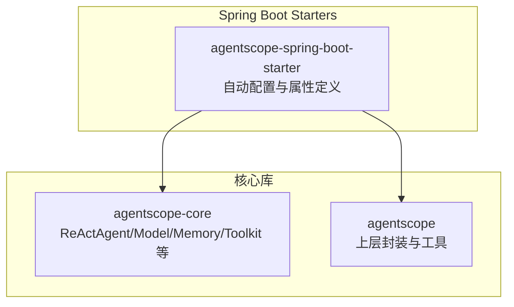
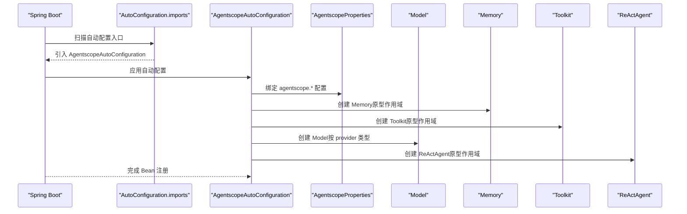
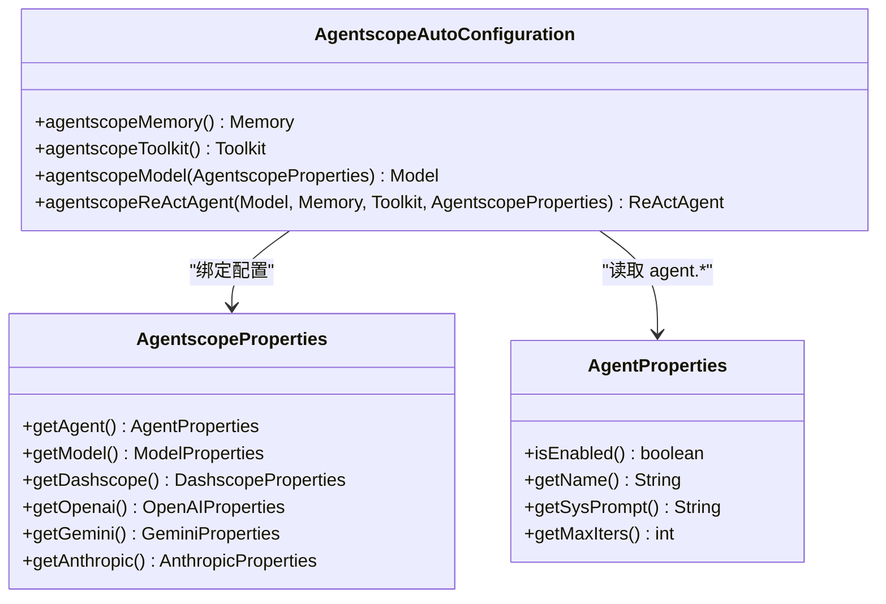
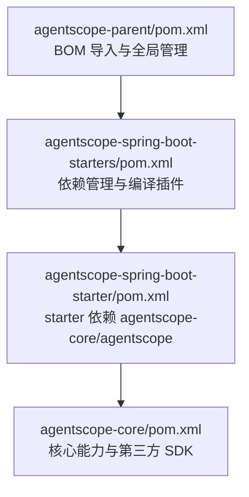

# 核心 Starter 模块

<cite>
**本文引用的文件**
- [AgentscopeAutoConfiguration.java](file://agentscope-extensions/agentscope-spring-boot-starters/agentscope-spring-boot-starter/src/main/java/io/agentscope/spring/boot/AgentscopeAutoConfiguration.java)
- [AgentscopeProperties.java](file://agentscope-extensions/agentscope-spring-boot-starters/agentscope-spring-boot-starter/src/main/java/io/agentscope/spring/boot/properties/AgentscopeProperties.java)
- [AgentProperties.java](file://agentscope-extensions/agentscope-spring-boot-starters/agentscope-spring-boot-starter/src/main/java/io/agentscope/spring/boot/properties/AgentProperties.java)
- [AutoConfiguration.imports](file://agentscope-extensions/agentscope-spring-boot-starters/agentscope-spring-boot-starter/src/main/resources/META-INF/spring/org.springframework.boot.autoconfigure.AutoConfiguration.imports)
- [agentscope-spring-boot-starter/pom.xml](file://agentscope-extensions/agentscope-spring-boot-starters/agentscope-spring-boot-starter/pom.xml)
- [agentscope-spring-boot-starters/pom.xml](file://agentscope-extensions/agentscope-spring-boot-starters/pom.xml)
- [agentscope-core/pom.xml](file://agentscope-core/pom.xml)
- [pom.xml](file://pom.xml)
- [A2aExampleApplication.java](file://agentscope-examples/a2a/src/main/java/io/agentscope/examples/a2a/A2aExampleApplication.java)
- [application.yml](file://agentscope-examples/a2a/src/main/resources/application.yml)
- [AgentscopeAutoConfigurationTest.java](file://agentscope-extensions/agentscope-spring-boot-starters/agentscope-spring-boot-starter/src/test/java/io/agentscope/spring/boot/AgentscopeAutoConfigurationTest.java)
</cite>

## 目录
1. [简介](#简介)
2. [项目结构](#项目结构)
3. [核心组件](#核心组件)
4. [架构总览](#架构总览)
5. [详细组件分析](#详细组件分析)
6. [依赖分析](#依赖分析)
7. [性能考虑](#性能考虑)
8. [故障排查指南](#故障排查指南)
9. [结论](#结论)
10. [附录](#附录)

## 简介
本文件面向 AgentScope Java 的核心 Spring Boot Starter 模块，系统性阐述其自动配置机制与使用方式，包括：
- 自动配置类的实现原理与 Bean 定义/注册流程
- 条件注解的使用策略与生效逻辑
- Bean 生命周期与作用域（尤其是原型作用域）
- 配置属性绑定机制与多模型提供商支持
- Maven 依赖引入方式与 BOM 管理
- 基本 application.yml 配置模板与典型用法
- 启动类自动注册、核心组件初始化与依赖注入实践
- 常见配置问题排查与性能优化建议

## 项目结构
核心 Starter 位于 agentscope-extensions/agentscope-spring-boot-starters/agentscope-spring-boot-starter，主要由以下部分组成：
- 自动配置类：AgentscopeAutoConfiguration
- 配置属性类：AgentscopeProperties 及其子属性类（如 AgentProperties、ModelProperties 等）
- 自动配置导入清单：META-INF/spring/org.springframework.boot.autoconfigure.AutoConfiguration.imports
- Maven 构建脚本：pom.xml（含对 agentscope-core 与 agentscope 的依赖）

图表来源
- [AgentscopeAutoConfiguration.java:125-211](file://agentscope-extensions/agentscope-spring-boot-starters/agentscope-spring-boot-starter/src/main/java/io/agentscope/spring/boot/AgentscopeAutoConfiguration.java#L125-L211)
- [agentscope-spring-boot-starter/pom.xml:38-51](file://agentscope-extensions/agentscope-spring-boot-starters/agentscope-spring-boot-starter/pom.xml#L38-L51)

章节来源
- [agentscope-spring-boot-starters/pom.xml:39-45](file://agentscope-extensions/agentscope-spring-boot-starters/pom.xml#L39-L45)
- [agentscope-spring-boot-starter/pom.xml:28-78](file://agentscope-extensions/agentscope-spring-boot-starters/agentscope-spring-boot-starter/pom.xml#L28-L78)

## 核心组件
- 自动配置类：AgentscopeAutoConfiguration
  - 负责在满足条件时创建默认的 Memory、Toolkit、Model、ReActAgent Bean
  - 使用条件注解控制启用范围与 Bean 冲突处理
- 配置属性类：AgentscopeProperties
  - 作为根属性容器，聚合各子模块属性（agent、model、dashscope、openai、gemini、anthropic）
  - 通过 @ConfigurationProperties 绑定到 agentscope.* 命名空间
- 属性子类：AgentProperties
  - 控制默认 ReActAgent 的启用、名称、系统提示词、最大迭代次数等

章节来源
- [AgentscopeAutoConfiguration.java:125-211](file://agentscope-extensions/agentscope-spring-boot-starters/agentscope-spring-boot-starter/src/main/java/io/agentscope/spring/boot/AgentscopeAutoConfiguration.java#L125-L211)
- [AgentscopeProperties.java:34-72](file://agentscope-extensions/agentscope-spring-boot-starters/agentscope-spring-boot-starter/src/main/java/io/agentscope/spring/boot/properties/AgentscopeProperties.java#L34-L72)
- [AgentProperties.java:32-85](file://agentscope-extensions/agentscope-spring-boot-starters/agentscope-spring-boot-starter/src/main/java/io/agentscope/spring/boot/properties/AgentProperties.java#L32-L85)

## 架构总览
自动配置的触发与 Bean 注册流程如下：

图表来源
- [AutoConfiguration.imports:16](file://agentscope-extensions/agentscope-spring-boot-starters/agentscope-spring-boot-starter/src/main/resources/META-INF/spring/org.springframework.boot.autoconfigure.AutoConfiguration.imports#L16)
- [AgentscopeAutoConfiguration.java:140-210](file://agentscope-extensions/agentscope-spring-boot-starters/agentscope-spring-boot-starter/src/main/java/io/agentscope/spring/boot/AgentscopeAutoConfiguration.java#L140-L210)
- [AgentscopeProperties.java:34-72](file://agentscope-extensions/agentscope-spring-boot-starters/agentscope-spring-boot-starter/src/main/java/io/agentscope/spring/boot/properties/AgentscopeProperties.java#L34-L72)

## 详细组件分析

### 自动配置类：AgentscopeAutoConfiguration
- 触发条件
  - @ConditionalOnClass(ReActAgent.class)：确保核心类存在才启用
  - @EnableConfigurationProperties(AgentscopeProperties.class)：开启属性绑定
- Bean 定义与作用域
  - Memory：原型作用域，适合按请求/会话获取实例
  - Toolkit：原型作用域，避免共享状态导致线程安全问题
  - Model：根据 ModelProviderType 动态创建对应模型实现
  - ReActAgent：原型作用域，按 AgentProperties 构建
- 条件注解与冲突处理
  - @ConditionalOnProperty(prefix = "agentscope.agent", name = "enabled", havingValue = "true")：仅当 agent.enabled=true 时创建
  - @ConditionalOnMissingBean：若用户已自定义同类型 Bean，则优先使用用户定义

图表来源
- [AgentscopeAutoConfiguration.java:125-211](file://agentscope-extensions/agentscope-spring-boot-starters/agentscope-spring-boot-starter/src/main/java/io/agentscope/spring/boot/AgentscopeAutoConfiguration.java#L125-L211)
- [AgentscopeProperties.java:34-72](file://agentscope-extensions/agentscope-spring-boot-starters/agentscope-spring-boot-starter/src/main/java/io/agentscope/spring/boot/properties/AgentscopeProperties.java#L34-L72)
- [AgentProperties.java:32-85](file://agentscope-extensions/agentscope-spring-boot-starters/agentscope-spring-boot-starter/src/main/java/io/agentscope/spring/boot/properties/AgentProperties.java#L32-L85)

章节来源
- [AgentscopeAutoConfiguration.java:125-211](file://agentscope-extensions/agentscope-spring-boot-starters/agentscope-spring-boot-starter/src/main/java/io/agentscope/spring/boot/AgentscopeAutoConfiguration.java#L125-L211)

### 配置属性绑定：AgentscopeProperties 与 AgentProperties
- 根属性容器：AgentscopeProperties
  - 通过 @ConfigurationProperties(prefix = "agentscope") 将 agentscope.* 命名空间下的配置映射到各子属性对象
- 子属性：AgentProperties
  - 控制默认 ReActAgent 的行为，如是否启用、名称、系统提示词、最大迭代次数
- 典型配置项（来自注释与示例）
  - agentscope.agent.enabled
  - agentscope.agent.name
  - agentscope.agent.sys-prompt
  - agentscope.agent.max-iters
  - agentscope.model.provider
  - 各模型提供商的 apiKey、modelName、stream、endpointPath 等

章节来源
- [AgentscopeProperties.java:34-72](file://agentscope-extensions/agentscope-spring-boot-starters/agentscope-spring-boot-starter/src/main/java/io/agentscope/spring/boot/properties/AgentscopeProperties.java#L34-L72)
- [AgentProperties.java:32-85](file://agentscope-extensions/agentscope-spring-boot-starters/agentscope-spring-boot-starter/src/main/java/io/agentscope/spring/boot/properties/AgentProperties.java#L32-L85)

### 自动配置导入机制
- 通过资源文件 META-INF/spring/org.springframework.boot.autoconfigure.AutoConfiguration.imports 指定自动配置类
- Spring Boot 在启动时扫描该清单并加载对应的自动配置

章节来源
- [AutoConfiguration.imports:16](file://agentscope-extensions/agentscope-spring-boot-starters/agentscope-spring-boot-starter/src/main/resources/META-INF/spring/org.springframework.boot.autoconfigure.AutoConfiguration.imports#L16)

### Bean 生命周期与作用域
- Memory、Toolkit、ReActAgent 均声明为原型作用域（prototype），以避免跨请求/会话共享状态
- 在控制器或服务中推荐通过 ObjectProvider 或方法注入的方式按需获取实例，确保线程安全与隔离性

章节来源
- [AgentscopeAutoConfiguration.java:140-210](file://agentscope-extensions/agentscope-spring-boot-starters/agentscope-spring-boot-starter/src/main/java/io/agentscope/spring/boot/AgentscopeAutoConfiguration.java#L140-L210)

### 条件注解与 Bean 冲突处理
- @ConditionalOnProperty：仅在 agentscope.agent.enabled=true 时创建相关 Bean
- @ConditionalOnMissingBean：若用户已定义相同类型的 Bean，则优先采用用户自定义 Bean
- 测试覆盖验证了禁用 agent 时不创建任何默认 Bean，以及不同模型提供商的正确选择

章节来源
- [AgentscopeAutoConfiguration.java:140-210](file://agentscope-extensions/agentscope-spring-boot-starters/agentscope-spring-boot-starter/src/main/java/io/agentscope/spring/boot/AgentscopeAutoConfiguration.java#L140-L210)
- [AgentscopeAutoConfigurationTest.java:46-150](file://agentscope-extensions/agentscope-spring-boot-starters/agentscope-spring-boot-starter/src/test/java/io/agentscope/spring/boot/AgentscopeAutoConfigurationTest.java#L46-L150)

### 启动类自动注册与依赖注入
- 示例应用 A2aExampleApplication 展示了标准 Spring Boot 启动类写法
- 可通过 @Bean 注册自定义 Toolkit，从而向默认 ReActAgent 注入工具集
- 自动配置类通过构造器参数完成依赖注入（Model、Memory、Toolkit、AgentscopeProperties）

章节来源
- [A2aExampleApplication.java:76-92](file://agentscope-examples/a2a/src/main/java/io/agentscope/examples/a2a/A2aExampleApplication.java#L76-L92)
- [AgentscopeAutoConfiguration.java:195-210](file://agentscope-extensions/agentscope-spring-boot-starters/agentscope-spring-boot-starter/src/main/java/io/agentscope/spring/boot/AgentscopeAutoConfiguration.java#L195-L210)

## 依赖分析
- Maven 依赖关系
  - agentscope-spring-boot-starter 依赖 agentscope-core 与 agentscope
  - 通过 spring-boot-dependencies 进行版本统一管理
- BOM 管理
  - 顶层 pom.xml 导入 agentscope-dependencies-bom 与 agentscope-bom，确保版本一致性
- 示例应用
  - A2A 示例展示了如何在 Spring Boot 应用中集成 AgentScope 并通过环境变量配置 API Key

图表来源
- [pom.xml:132-149](file://pom.xml#L132-L149)
- [agentscope-spring-boot-starters/pom.xml:47-57](file://agentscope-extensions/agentscope-spring-boot-starters/pom.xml#L47-L57)
- [agentscope-spring-boot-starter/pom.xml:38-51](file://agentscope-extensions/agentscope-spring-boot-starters/agentscope-spring-boot-starter/pom.xml#L38-L51)
- [agentscope-core/pom.xml:51-147](file://agentscope-core/pom.xml#L51-L147)

章节来源
- [agentscope-spring-boot-starters/pom.xml:47-57](file://agentscope-extensions/agentscope-spring-boot-starters/pom.xml#L47-L57)
- [agentscope-spring-boot-starter/pom.xml:38-51](file://agentscope-extensions/agentscope-spring-boot-starters/agentscope-spring-boot-starter/pom.xml#L38-L51)
- [agentscope-core/pom.xml:51-147](file://agentscope-core/pom.xml#L51-L147)

## 性能考虑
- 原型作用域的内存与工具箱
  - Memory 与 Toolkit 为非线程安全且可能持有可变状态，建议按请求/会话获取实例，避免共享
- 流式输出与网络调用
  - 模型流式输出（stream）可提升响应体验，但需注意背压与资源释放
- Bean 复用与缓存
  - Model 实例通常可复用；若需要多租户隔离，建议按租户维度管理实例
- 线程模型
  - 在 Web 环境中，避免将原型 Bean 直接注入单例组件，应通过 ObjectProvider 或方法注入

## 故障排查指南
- 未创建默认 Bean
  - 检查 agentscope.agent.enabled 是否为 true
  - 确认未手动定义同类型 Bean 导致 @ConditionalOnMissingBean 生效
- 缺少 API Key
  - 当使用 DashScope/OpenAI/Gemini/Anthropic 时，需正确配置对应 apiKey
  - 若未配置，启动会失败并提示相应属性必须配置
- 模型提供商不匹配
  - 确认 agentscope.model.provider 与实际配置段一致（dashscope/openai/gemini/anthropic）
  - 如使用自定义端点路径，检查 endpoint-path 配置是否正确

章节来源
- [AgentscopeAutoConfigurationTest.java:71-81](file://agentscope-extensions/agentscope-spring-boot-starters/agentscope-spring-boot-starter/src/test/java/io/agentscope/spring/boot/AgentscopeAutoConfigurationTest.java#L71-L81)
- [AgentscopeAutoConfigurationTest.java:84-150](file://agentscope-extensions/agentscope-spring-boot-starters/agentscope-spring-boot-starter/src/test/java/io/agentscope/spring/boot/AgentscopeAutoConfigurationTest.java#L84-L150)

## 结论
核心 Starter 通过简洁的自动配置与属性绑定，为 Spring Boot 应用提供了开箱即用的 AgentScope 能力。其设计遵循“按需启用、避免共享状态、可替换 Bean”的原则，并通过条件注解与原型作用域保障了在多线程与 Web 环境下的安全性与灵活性。

## 附录

### Maven 依赖配置示例
- 引入核心 Starter
  - 依赖坐标：io.agentscope:agentscope-spring-boot-starter
  - 版本由 Spring Boot BOM 管理，无需显式指定
- 核心库依赖
  - agentscope-core 与 agentscope 由 Starter 提供（agentscope-core 为 provided，agentscope 为运行时依赖）
- BOM 管理
  - 顶层 pom.xml 已导入 agentscope-dependencies-bom 与 agentscope-bom，确保版本一致性

章节来源
- [agentscope-spring-boot-starter/pom.xml:38-51](file://agentscope-extensions/agentscope-spring-boot-starters/agentscope-spring-boot-starter/pom.xml#L38-L51)
- [agentscope-spring-boot-starters/pom.xml:47-57](file://agentscope-extensions/agentscope-spring-boot-starters/pom.xml#L47-L57)
- [pom.xml:132-149](file://pom.xml#L132-L149)

### 基本 application.yml 配置模板
- ReActAgent 基础配置
  - agentscope.agent.enabled：是否启用默认 Agent
  - agentscope.agent.name：Agent 名称
  - agentscope.agent.sys-prompt：系统提示词
  - agentscope.agent.max-iters：最大迭代次数
- 模型提供商配置
  - agentscope.model.provider：选择模型提供商（dashscope/openai/gemini/anthropic）
  - 对应提供商段落下配置 apiKey、modelName、stream、endpointPath 等
- 示例参考
  - A2A 示例应用的 application.yml 展示了 DashScope 的最小可用配置与 Agent 卡片信息

章节来源
- [application.yml:24-30](file://agentscope-examples/a2a/src/main/resources/application.yml#L24-L30)
- [application.yml:26-28](file://agentscope-examples/a2a/src/main/resources/application.yml#L26-L28)
- [AgentscopeAutoConfiguration.java:43-124](file://agentscope-extensions/agentscope-spring-boot-starters/agentscope-spring-boot-starter/src/main/java/io/agentscope/spring/boot/AgentscopeAutoConfiguration.java#L43-L124)