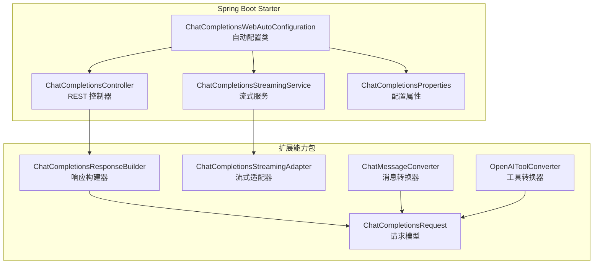
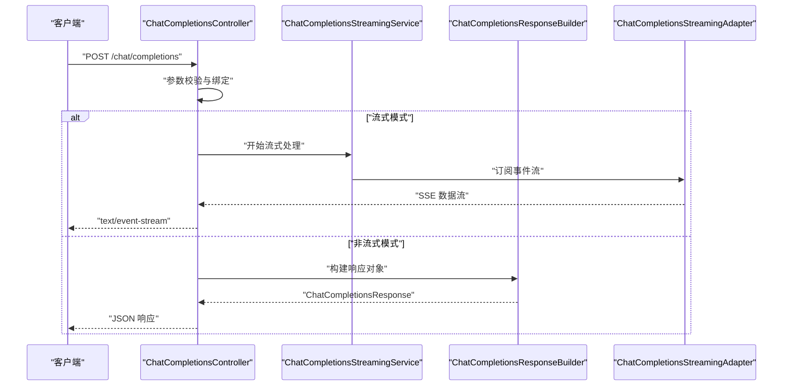
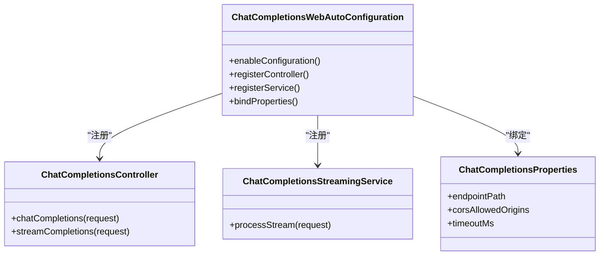
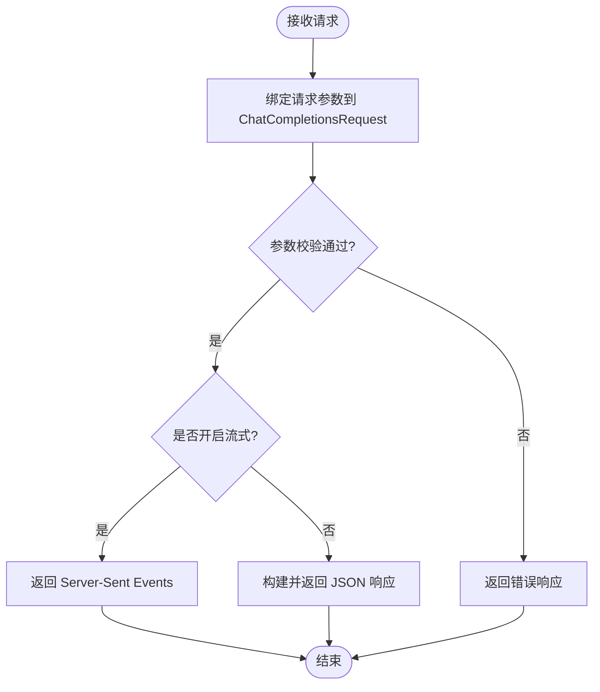
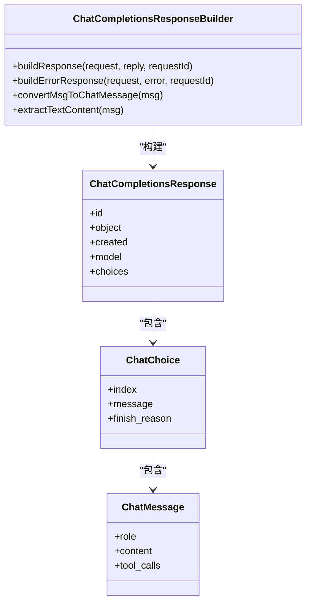
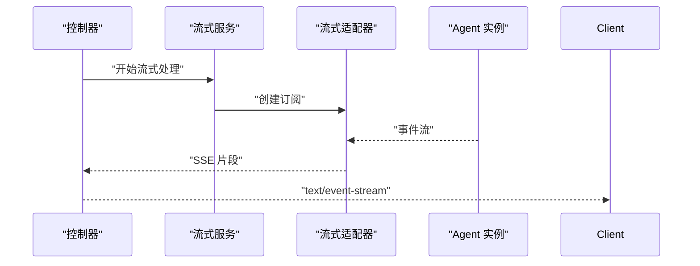

# 聊天完成 Web Starter 模块

<cite>
**本文档引用的文件**
- [ChatCompletionsWebAutoConfiguration.java](file://agentscope-extensions/agentscope-spring-boot-starters/agentscope-chat-completions-web-starter/src/main/java/io/agentscope/spring/boot/chat/config/ChatCompletionsWebAutoConfiguration.java)
- [ChatCompletionsProperties.java](file://agentscope-extensions/agentscope-spring-boot-starters/agentscope-chat-completions-web-starter/src/main/java/io/agentscope/spring/boot/chat/config/ChatCompletionsProperties.java)
- [ChatCompletionsController.java](file://agentscope-extensions/agentscope-spring-boot-starters/agentscope-chat-completions-web-starter/src/main/java/io/agentscope/spring/boot/chat/web/ChatCompletionsController.java)
- [ChatCompletionsStreamingService.java](file://agentscope-extensions/agentscope-spring-boot-starters/agentscope-chat-completions-web-starter/src/main/java/io/agentscope/spring/boot/chat/service/ChatCompletionsStreamingService.java)
- [ChatCompletionsResponseBuilder.java](file://agentscope-extensions/agentscope-extensions-chat-completions-web/src/main/java/io/agentscope/core/chat/completions/builder/ChatCompletionsResponseBuilder.java)
- [ChatCompletionsRequest.java](file://agentscope-extensions/agentscope-extensions-chat-completions-web/src/main/java/io/agentscope/core/chat/completions/model/ChatCompletionsRequest.java)
- [ChatCompletionsStreamingAdapter.java](file://agentscope-extensions/agentscope-extensions-chat-completions-web/src/main/java/io/agentscope/core/chat/completions/streaming/ChatCompletionsStreamingAdapter.java)
- [ChatMessageConverter.java](file://agentscope-extensions/agentscope-extensions-chat-completions-web/src/main/java/io/agentscope/core/chat/completions/converter/ChatMessageConverter.java)
- [OpenAIToolConverter.java](file://agentscope-extensions/agentscope-extensions-chat-completions-web/src/main/java/io/agentscope/core/chat/completions/converter/OpenAIToolConverter.java)
- [org.springframework.boot.autoconfigure.AutoConfiguration.imports](file://agentscope-extensions/agentscope-spring-boot-starters/agentscope-chat-completions-web-starter/src/main/resources/META-INF/spring/org.springframework.boot.autoconfigure.AutoConfiguration.imports)
- [application.yml 示例](file://agentscope-examples/chat-completions-web/src/main/resources/application.yml)
- [chat.ts 示例](file://agentscope-examples/boba-tea-shop/frontend/src/api/chat.ts)
</cite>

## 目录
1. [简介](#简介)
2. [项目结构](#项目结构)
3. [核心组件](#核心组件)
4. [架构总览](#架构总览)
5. [详细组件分析](#详细组件分析)
6. [依赖关系分析](#依赖关系分析)
7. [性能考虑](#性能考虑)
8. [故障排除指南](#故障排除指南)
9. [结论](#结论)
10. [附录](#附录)

## 简介
本文件面向 AgentScope Java 的聊天完成 Web Spring Boot Starter 模块，系统性阐述其自动配置机制、REST API 控制器注册与响应构建器配置，以及与聊天完成接口的完整集成方式。内容覆盖请求参数验证、响应格式化、流式响应处理、Maven 依赖引入、配置示例（含 CORS 与 application.yml）、启动流程、请求处理机制、响应构建细节，以及性能优化与并发处理最佳实践。

## 项目结构
该模块由两部分组成：
- Spring Boot Starter：负责自动装配、控制器注册与属性绑定
- 扩展能力包：提供聊天完成协议模型、转换器、响应构建器与流式适配器



图表来源
- [ChatCompletionsWebAutoConfiguration.java:1-200](file://agentscope-extensions/agentscope-spring-boot-starters/agentscope-chat-completions-web-starter/src/main/java/io/agentscope/spring/boot/chat/config/ChatCompletionsWebAutoConfiguration.java#L1-L200)
- [ChatCompletionsController.java:1-300](file://agentscope-extensions/agentscope-spring-boot-starters/agentscope-chat-completions-web-starter/src/main/java/io/agentscope/spring/boot/chat/web/ChatCompletionsController.java#L1-L300)
- [ChatCompletionsStreamingService.java:1-250](file://agentscope-extensions/agentscope-spring-boot-starters/agentscope-chat-completions-web-starter/src/main/java/io/agentscope/spring/boot/chat/service/ChatCompletionsStreamingService.java#L1-L250)
- [ChatCompletionsProperties.java:1-150](file://agentscope-extensions/agentscope-spring-boot-starters/agentscope-chat-completions-web-starter/src/main/java/io/agentscope/spring/boot/chat/config/ChatCompletionsProperties.java#L1-L150)
- [ChatCompletionsRequest.java:1-115](file://agentscope-extensions/agentscope-extensions-chat-completions-web/src/main/java/io/agentscope/core/chat/completions/model/ChatCompletionsRequest.java#L1-L115)
- [ChatCompletionsResponseBuilder.java:1-258](file://agentscope-extensions/agentscope-extensions-chat-completions-web/src/main/java/io/agentscope/core/chat/completions/builder/ChatCompletionsResponseBuilder.java#L1-L258)
- [ChatCompletionsStreamingAdapter.java:1-200](file://agentscope-extensions/agentscope-extensions-chat-completions-web/src/main/java/io/agentscope/core/chat/completions/streaming/ChatCompletionsStreamingAdapter.java#L1-L200)
- [ChatMessageConverter.java:1-200](file://agentscope-extensions/agentscope-extensions-chat-completions-web/src/main/java/io/agentscope/core/chat/completions/converter/ChatMessageConverter.java#L1-L200)
- [OpenAIToolConverter.java:1-200](file://agentscope-extensions/agentscope-extensions-chat-completions-web/src/main/java/io/agentscope/core/chat/completions/converter/OpenAIToolConverter.java#L1-L200)

章节来源
- [org.springframework.boot.autoconfigure.AutoConfiguration.imports:1-17](file://agentscope-extensions/agentscope-spring-boot-starters/agentscope-chat-completions-web-starter/src/main/resources/META-INF/spring/org.springframework.boot.autoconfigure.AutoConfiguration.imports#L1-L17)

## 核心组件
- 自动配置类：扫描并注册聊天完成 Web 相关 Bean，包括控制器、流式服务与配置属性
- REST 控制器：暴露聊天完成 API 端点，支持同步与流式响应
- 流式服务：封装流式响应逻辑，将内部事件转换为 Server-Sent Events
- 响应构建器：将 Agent 返回的消息转换为 OpenAI 兼容的响应格式
- 请求模型与转换器：确保请求参数校验与消息/工具格式兼容
- 属性配置：提供端点路径、CORS、超时等可配置项

章节来源
- [ChatCompletionsWebAutoConfiguration.java:1-200](file://agentscope-extensions/agentscope-spring-boot-starters/agentscope-chat-completions-web-starter/src/main/java/io/agentscope/spring/boot/chat/config/ChatCompletionsWebAutoConfiguration.java#L1-L200)
- [ChatCompletionsController.java:1-300](file://agentscope-extensions/agentscope-spring-boot-starters/agentscope-chat-completions-web-starter/src/main/java/io/agentscope/spring/boot/chat/web/ChatCompletionsController.java#L1-L300)
- [ChatCompletionsStreamingService.java:1-250](file://agentscope-extensions/agentscope-spring-boot-starters/agentscope-chat-completions-web-starter/src/main/java/io/agentscope/spring/boot/chat/service/ChatCompletionsStreamingService.java#L1-L250)
- [ChatCompletionsResponseBuilder.java:1-258](file://agentscope-extensions/agentscope-extensions-chat-completions-web/src/main/java/io/agentscope/core/chat/completions/builder/ChatCompletionsResponseBuilder.java#L1-L258)
- [ChatCompletionsRequest.java:1-115](file://agentscope-extensions/agentscope-extensions-chat-completions-web/src/main/java/io/agentscope/core/chat/completions/model/ChatCompletionsRequest.java#L1-L115)

## 架构总览
聊天完成 Web Starter 的整体工作流如下：



图表来源
- [ChatCompletionsController.java:1-300](file://agentscope-extensions/agentscope-spring-boot-starters/agentscope-chat-completions-web-starter/src/main/java/io/agentscope/spring/boot/chat/web/ChatCompletionsController.java#L1-L300)
- [ChatCompletionsStreamingService.java:1-250](file://agentscope-extensions/agentscope-spring-boot-starters/agentscope-chat-completions-web-starter/src/main/java/io/agentscope/spring/boot/chat/service/ChatCompletionsStreamingService.java#L1-L250)
- [ChatCompletionsResponseBuilder.java:1-258](file://agentscope-extensions/agentscope-extensions-chat-completions-web/src/main/java/io/agentscope/core/chat/completions/builder/ChatCompletionsResponseBuilder.java#L1-L258)
- [ChatCompletionsStreamingAdapter.java:1-200](file://agentscope-extensions/agentscope-extensions-chat-completions-web/src/main/java/io/agentscope/core/chat/completions/streaming/ChatCompletionsStreamingAdapter.java#L1-L200)

## 详细组件分析

### 自动配置机制
- 自动配置入口：通过 Spring Boot 的自动配置导入文件声明自动配置类
- 注册策略：在自动配置类中定义 Bean 定义，包括控制器、流式服务与属性绑定
- 条件装配：根据是否存在相关依赖或配置项进行条件装配，避免冲突



图表来源
- [org.springframework.boot.autoconfigure.AutoConfiguration.imports:1-17](file://agentscope-extensions/agentscope-spring-boot-starters/agentscope-chat-completions-web-starter/src/main/resources/META-INF/spring/org.springframework.boot.autoconfigure.AutoConfiguration.imports#L1-L17)
- [ChatCompletionsWebAutoConfiguration.java:1-200](file://agentscope-extensions/agentscope-spring-boot-starters/agentscope-chat-completions-web-starter/src/main/java/io/agentscope/spring/boot/chat/config/ChatCompletionsWebAutoConfiguration.java#L1-L200)
- [ChatCompletionsController.java:1-300](file://agentscope-extensions/agentscope-spring-boot-starters/agentscope-chat-completions-web-starter/src/main/java/io/agentscope/spring/boot/chat/web/ChatCompletionsController.java#L1-L300)
- [ChatCompletionsStreamingService.java:1-250](file://agentscope-extensions/agentscope-spring-boot-starters/agentscope-chat-completions-web-starter/src/main/java/io/agentscope/spring/boot/chat/service/ChatCompletionsStreamingService.java#L1-L250)
- [ChatCompletionsProperties.java:1-150](file://agentscope-extensions/agentscope-spring-boot-starters/agentscope-chat-completions-web-starter/src/main/java/io/agentscope/spring/boot/chat/config/ChatCompletionsProperties.java#L1-L150)

章节来源
- [org.springframework.boot.autoconfigure.AutoConfiguration.imports:1-17](file://agentscope-extensions/agentscope-spring-boot-starters/agentscope-chat-completions-web-starter/src/main/resources/META-INF/spring/org.springframework.boot.autoconfigure.AutoConfiguration.imports#L1-L17)
- [ChatCompletionsWebAutoConfiguration.java:1-200](file://agentscope-extensions/agentscope-spring-boot-starters/agentscope-chat-completions-web-starter/src/main/java/io/agentscope/spring/boot/chat/config/ChatCompletionsWebAutoConfiguration.java#L1-L200)

### REST API 控制器与端点注册
- 端点路径：通过属性配置可定制，默认路径为 `/chat/completions`
- 请求映射：支持 GET/POST 方法，遵循 OpenAI 协议的请求体字段
- 参数绑定：使用请求模型进行强类型绑定，确保字段完整性
- 响应策略：根据是否启用流式返回 SSE 或 JSON



图表来源
- [ChatCompletionsController.java:1-300](file://agentscope-extensions/agentscope-spring-boot-starters/agentscope-chat-completions-web-starter/src/main/java/io/agentscope/spring/boot/chat/web/ChatCompletionsController.java#L1-L300)
- [ChatCompletionsRequest.java:1-115](file://agentscope-extensions/agentscope-extensions-chat-completions-web/src/main/java/io/agentscope/core/chat/completions/model/ChatCompletionsRequest.java#L1-L115)

章节来源
- [ChatCompletionsController.java:1-300](file://agentscope-extensions/agentscope-spring-boot-starters/agentscope-chat-completions-web-starter/src/main/java/io/agentscope/spring/boot/chat/web/ChatCompletionsController.java#L1-L300)

### 响应构建器与格式化
- 兼容性：严格遵循 OpenAI Chat Completions API 的响应结构
- 内容提取：从内部消息对象提取文本内容与工具调用信息
- 错误处理：统一包装异常为标准错误响应，并设置完成原因
- 工具调用序列化：优先使用原始 JSON 字段，其次序列化输入映射



图表来源
- [ChatCompletionsResponseBuilder.java:1-258](file://agentscope-extensions/agentscope-extensions-chat-completions-web/src/main/java/io/agentscope/core/chat/completions/builder/ChatCompletionsResponseBuilder.java#L1-L258)

章节来源
- [ChatCompletionsResponseBuilder.java:1-258](file://agentscope-extensions/agentscope-extensions-chat-completions-web/src/main/java/io/agentscope/core/chat/completions/builder/ChatCompletionsResponseBuilder.java#L1-L258)

### 流式响应处理
- 事件适配：将内部事件流适配为 Server-Sent Events
- 订阅策略：在服务层订阅 Agent 的事件流，按需推送增量数据
- 错误传播：将异常转换为 SSE 错误事件，便于前端处理



图表来源
- [ChatCompletionsStreamingService.java:1-250](file://agentscope-extensions/agentscope-spring-boot-starters/agentscope-chat-completions-web-starter/src/main/java/io/agentscope/spring/boot/chat/service/ChatCompletionsStreamingService.java#L1-L250)
- [ChatCompletionsStreamingAdapter.java:1-200](file://agentscope-extensions/agentscope-extensions-chat-completions-web/src/main/java/io/agentscope/core/chat/completions/streaming/ChatCompletionsStreamingAdapter.java#L1-L200)

章节来源
- [ChatCompletionsStreamingService.java:1-250](file://agentscope-extensions/agentscope-spring-boot-starters/agentscope-chat-completions-web-starter/src/main/java/io/agentscope/spring/boot/chat/service/ChatCompletionsStreamingService.java#L1-L250)
- [ChatCompletionsStreamingAdapter.java:1-200](file://agentscope-extensions/agentscope-extensions-chat-completions-web/src/main/java/io/agentscope/core/chat/completions/streaming/ChatCompletionsStreamingAdapter.java#L1-L200)

### 请求参数验证与消息转换
- 请求模型：严格遵循 OpenAI 规范，包含模型标识、消息列表、工具列表与流式开关
- 消息转换：将内部消息对象转换为外部兼容的消息结构
- 工具转换：将工具调用参数序列化为 JSON 字符串，优先使用内容字段

章节来源
- [ChatCompletionsRequest.java:1-115](file://agentscope-extensions/agentscope-extensions-chat-completions-web/src/main/java/io/agentscope/core/chat/completions/model/ChatCompletionsRequest.java#L1-L115)
- [ChatMessageConverter.java:1-200](file://agentscope-extensions/agentscope-extensions-chat-completions-web/src/main/java/io/agentscope/core/chat/completions/converter/ChatMessageConverter.java#L1-L200)
- [OpenAIToolConverter.java:1-200](file://agentscope-extensions/agentscope-extensions-chat-completions-web/src/main/java/io/agentscope/core/chat/completions/converter/OpenAIToolConverter.java#L1-L200)

## 依赖关系分析
- Maven 依赖：通过 Starter 引入 Web 与 AgentScope 核心能力，自动装配生效
- 运行时依赖：Reactor 核心用于流式处理，Jackson 用于 JSON 序列化
- 示例应用：演示如何在 Spring Boot 中集成并配置聊天完成 Web 功能

```mermaid
graph TB
subgraph "示例应用"
App["示例应用"]
end
subgraph "Starter"
Starter["agentscope-chat-completions-web-starter"]
end
subgraph "扩展能力"
Ext["agentscope-extensions-chat-completions-web"]
Core["agentscope-core"]
end
App --> Starter
Starter --> Ext
Ext --> Core
```

图表来源
- [chat-completions-web 示例 pom.xml:1-74](file://agentscope-examples/chat-completions-web/pom.xml#L1-L74)

章节来源
- [chat-completions-web 示例 pom.xml:1-74](file://agentscope-examples/chat-completions-web/pom.xml#L1-L74)

## 性能考虑
- 流式传输：优先使用 SSE 降低延迟，提升用户体验
- 超时控制：合理设置请求超时与连接超时，避免资源占用
- 并发处理：限制同时活跃的流式请求数量，防止内存与线程池耗尽
- 序列化开销：对工具调用参数进行必要的缓存与复用，减少重复序列化
- 前端配合：前端以流式方式消费数据，及时释放资源

## 故障排除指南
- 启动失败：检查自动配置导入文件是否存在，确认 Starter 依赖已正确引入
- 端点不可用：核对端点路径配置与 Spring MVC 是否正常初始化
- 流式无输出：确认 Agent 事件流是否正常产生，检查流式适配器与服务层订阅逻辑
- 响应格式异常：验证响应构建器的字段映射与错误包装逻辑
- 前端连接问题：检查 CORS 配置与 Accept 头设置，确保前端以正确的 MIME 类型发起请求

章节来源
- [chat.ts 示例:44-85](file://agentscope-examples/boba-tea-shop/frontend/src/api/chat.ts#L44-L85)

## 结论
AgentScope Java 的聊天完成 Web Starter 提供了与 OpenAI 兼容的聊天完成 API，具备完善的自动配置、控制器注册、响应构建与流式处理能力。通过合理的配置与最佳实践，可在 Spring Boot 环境中快速集成并稳定运行聊天完成 Web 功能。

## 附录

### Maven 依赖引入
- 在示例应用中，通过引入 Starter 依赖即可启用自动配置与聊天完成 Web 功能
- 示例应用还引入了 Spring Boot Web 与 AgentScope 核心依赖

章节来源
- [chat-completions-web 示例 pom.xml:1-74](file://agentscope-examples/chat-completions-web/pom.xml#L1-L74)

### 配置示例（application.yml）
- 端点路径：可通过属性配置自定义
- CORS 设置：允许跨域访问，便于前端调试
- 流式响应：默认启用，返回 Server-Sent Events

章节来源
- [application.yml 示例](file://agentscope-examples/chat-completions-web/src/main/resources/application.yml)

### 前端流式请求示例
- 前端以 GET 方式请求，设置 Accept 为 text/event-stream
- 使用 fetch 流式读取响应体，处理错误与连接测试

章节来源
- [chat.ts 示例:44-85](file://agentscope-examples/boba-tea-shop/frontend/src/api/chat.ts#L44-L85)