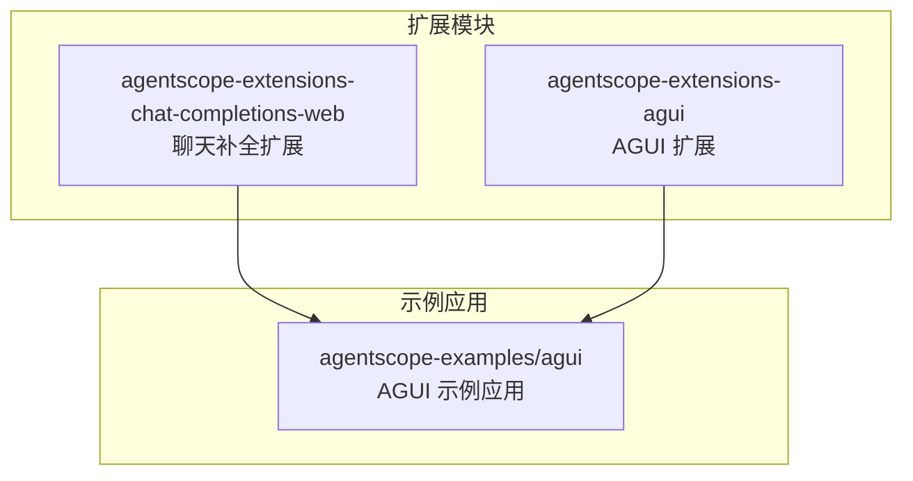
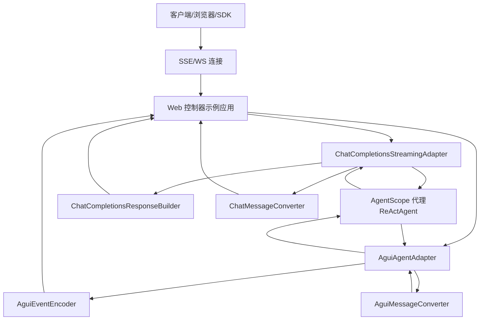
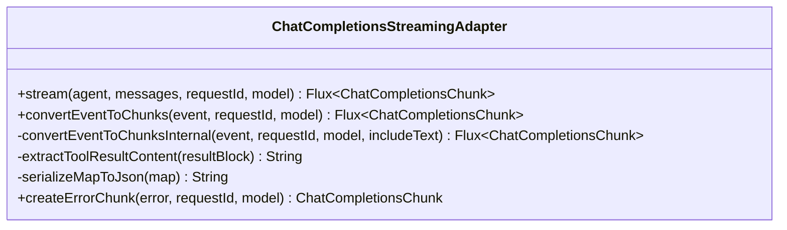
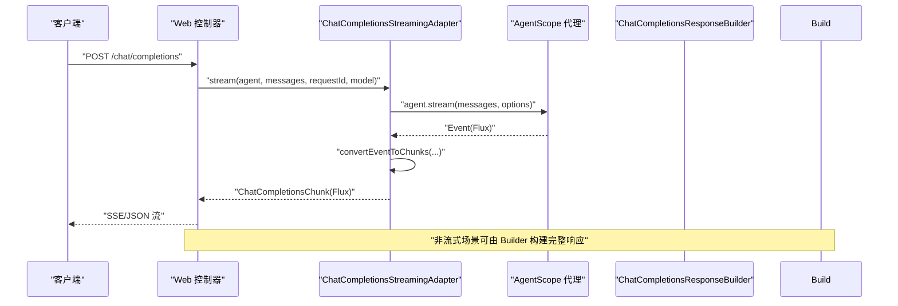
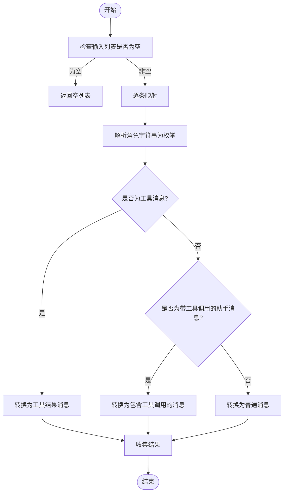
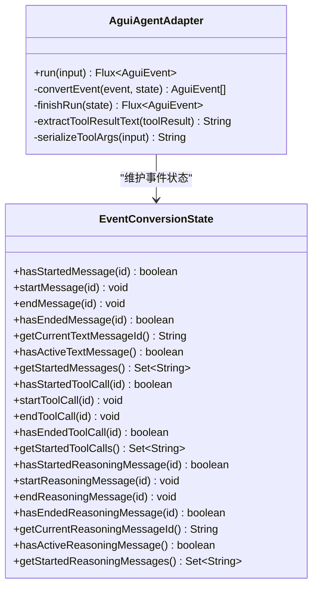
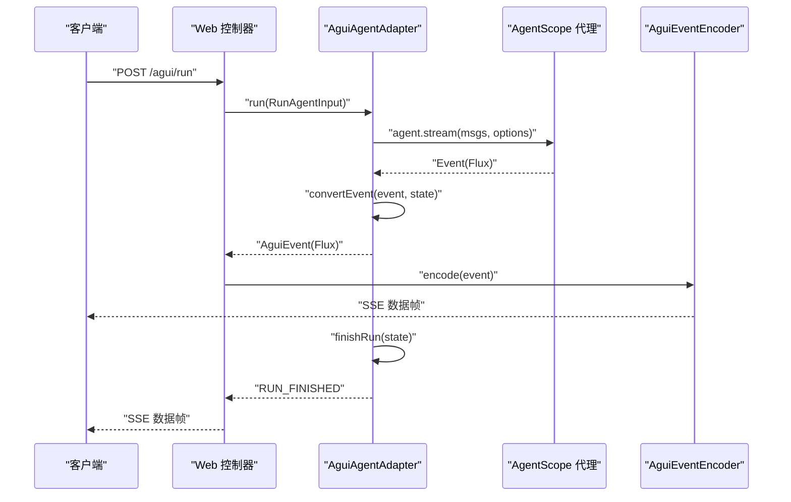
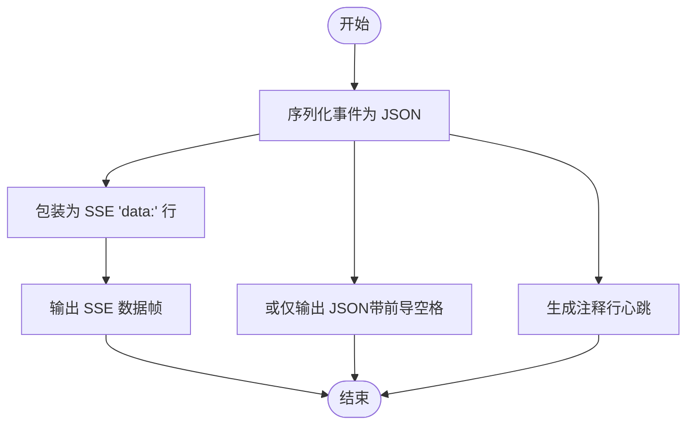
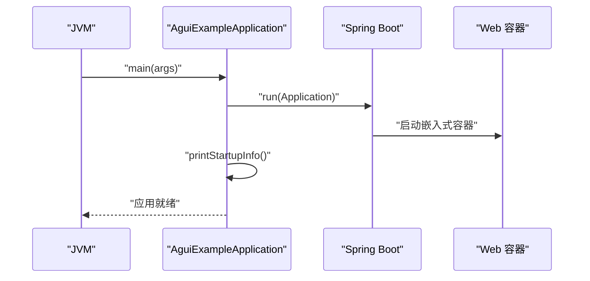
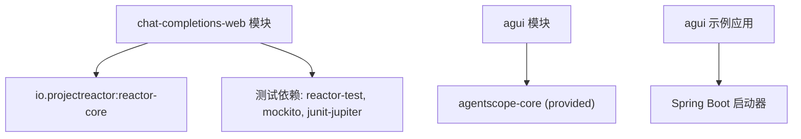

# Web 框架集成

<cite>
**本文引用的文件**
- [ChatCompletionsStreamingAdapter.java](file://agentscope-extensions/agentscope-extensions-chat-completions-web/src/main/java/io/agentscope/core/chat/completions/streaming/ChatCompletionsStreamingAdapter.java)
- [ChatCompletionsResponseBuilder.java](file://agentscope-extensions/agentscope-extensions-chat-completions-web/src/main/java/io/agentscope/core/chat/completions/builder/ChatCompletionsResponseBuilder.java)
- [ChatMessageConverter.java](file://agentscope-extensions/agentscope-extensions-chat-completions-web/src/main/java/io/agentscope/core/chat/completions/converter/ChatMessageConverter.java)
- [AguiAgentAdapter.java](file://agentscope-extensions/agentscope-extensions-agui/src/main/java/io/agentscope/core/agui/adapter/AguiAgentAdapter.java)
- [AguiEventEncoder.java](file://agentscope-extensions/agentscope-extensions-agui/src/main/java/io/agentscope/core/agui/encoder/AguiEventEncoder.java)
- [AguiExampleApplication.java](file://agentscope-examples/agui/src/main/java/io/agentscope/examples/agui/AguiExampleApplication.java)
- [pom.xml（聊天补全扩展）](file://agentscope-extensions/agentscope-extensions-chat-completions-web/pom.xml)
- [pom.xml（AGUI 扩展）](file://agentscope-extensions/agentscope-extensions-agui/pom.xml)
</cite>

## 目录
1. [引言](#引言)
2. [项目结构](#项目结构)
3. [核心组件](#核心组件)
4. [架构总览](#架构总览)
5. [详细组件分析](#详细组件分析)
6. [依赖分析](#依赖分析)
7. [性能考虑](#性能考虑)
8. [故障排查指南](#故障排查指南)
9. [结论](#结论)
10. [附录](#附录)

## 引言
本技术文档聚焦于 AgentScope Java 的 Web 框架集成模块，系统性阐述以下内容：
- Chat Completions Web 扩展的 REST API 设计与实时流式传输机制
- AGUI（Agent GUI）集成的前端界面设计与用户交互模式
- WebSocket/Server-Sent Events（SSE）通信协议、事件驱动的消息传递与状态同步机制
- Web 控制器的实现、请求处理与响应格式化策略
- 完整的 Web 应用集成示例与部署配置要点
- CORS 配置、安全防护与访问控制的实现细节
- 前端界面的自定义、主题配置与用户体验优化建议
- 性能监控、错误处理与日志记录的集成方案
- 移动端适配、响应式设计与无障碍访问支持

## 项目结构
本仓库采用多模块结构，Web 集成相关的关键模块如下：
- agentscope-extensions-chat-completions-web：提供 OpenAI 兼容的聊天补全 API 的非框架绑定适配层，包括消息转换、响应构建与流式输出适配器
- agentscope-extensions-agui：提供 AG-UI 协议的适配器与事件编码器，用于将 AgentScope 的事件流映射到 AG-UI 的事件序列，并通过 SSE 输出
- agentscope-examples/agui：示例应用，展示如何在 Spring Boot 环境中暴露 AG-UI 接口

图表来源
- [pom.xml（聊天补全扩展）:18-79](file://agentscope-extensions/agentscope-extensions-chat-completions-web/pom.xml#L18-L79)
- [pom.xml（AGUI 扩展）:18-43](file://agentscope-extensions/agentscope-extensions-agui/pom.xml#L18-L43)
- [AguiExampleApplication.java:18-56](file://agentscope-examples/agui/src/main/java/io/agentscope/examples/agui/AguiExampleApplication.java#L18-L56)

章节来源
- [pom.xml（聊天补全扩展）:18-79](file://agentscope-extensions/agentscope-extensions-chat-completions-web/pom.xml#L18-L79)
- [pom.xml（AGUI 扩展）:18-43](file://agentscope-extensions/agentscope-extensions-agui/pom.xml#L18-L43)
- [AguiExampleApplication.java:18-56](file://agentscope-examples/agui/src/main/java/io/agentscope/examples/agui/AguiExampleApplication.java#L18-L56)

## 核心组件
本节对 Web 集成中的关键组件进行深入剖析，覆盖数据模型、处理逻辑与接口契约。

- ChatCompletionsStreamingAdapter：将 AgentScope 的事件流转换为 OpenAI 兼容的流式分片（chunks），支持文本增量、工具调用与结束分片，并具备去重与错误分片能力
- ChatCompletionsResponseBuilder：构建完整的 OpenAI 兼容响应对象，处理工具调用、完成原因与使用统计等字段
- ChatMessageConverter：将 HTTP 请求中的 ChatMessage DTO 转换为内部 Msg 对象，支持角色、工具调用与工具结果的双向映射
- AguiAgentAdapter：将 AG-UI 输入转换为 AgentScope 消息，驱动代理执行并将其事件转换为 AG-UI 事件序列，支持推理事件与工具调用参数事件
- AguiEventEncoder：将 AG-UI 事件序列编码为 SSE 数据帧，支持心跳保活与纯 JSON 输出

章节来源
- [ChatCompletionsStreamingAdapter.java:38-125](file://agentscope-extensions/agentscope-extensions-chat-completions-web/src/main/java/io/agentscope/core/chat/completions/streaming/ChatCompletionsStreamingAdapter.java#L38-L125)
- [ChatCompletionsResponseBuilder.java:36-117](file://agentscope-extensions/agentscope-extensions-chat-completions-web/src/main/java/io/agentscope/core/chat/completions/builder/ChatCompletionsResponseBuilder.java#L36-L117)
- [ChatMessageConverter.java:37-116](file://agentscope-extensions/agentscope-extensions-chat-completions-web/src/main/java/io/agentscope/core/chat/completions/converter/ChatMessageConverter.java#L37-L116)
- [AguiAgentAdapter.java:42-135](file://agentscope-extensions/agentscope-extensions-agui/src/main/java/io/agentscope/core/agui/adapter/AguiAgentAdapter.java#L42-L135)
- [AguiEventEncoder.java:23-59](file://agentscope-extensions/agentscope-extensions-agui/src/main/java/io/agentscope/core/agui/encoder/AguiEventEncoder.java#L23-L59)

## 架构总览
下图展示了从客户端到后端代理再到前端 UI 的整体交互路径，以及关键组件之间的协作关系。

图表来源
- [ChatCompletionsStreamingAdapter.java:92-125](file://agentscope-extensions/agentscope-extensions-chat-completions-web/src/main/java/io/agentscope/core/chat/completions/streaming/ChatCompletionsStreamingAdapter.java#L92-L125)
- [ChatCompletionsResponseBuilder.java:88-117](file://agentscope-extensions/agentscope-extensions-chat-completions-web/src/main/java/io/agentscope/core/chat/completions/builder/ChatCompletionsResponseBuilder.java#L88-L117)
- [ChatMessageConverter.java:68-116](file://agentscope-extensions/agentscope-extensions-chat-completions-web/src/main/java/io/agentscope/core/chat/completions/converter/ChatMessageConverter.java#L68-L116)
- [AguiAgentAdapter.java:91-135](file://agentscope-extensions/agentscope-extensions-agui/src/main/java/io/agentscope/core/agui/adapter/AguiAgentAdapter.java#L91-L135)
- [AguiEventEncoder.java:52-59](file://agentscope-extensions/agentscope-extensions-agui/src/main/java/io/agentscope/core/agui/encoder/AguiEventEncoder.java#L52-L59)

## 详细组件分析

### 组件一：Chat Completions 流式适配器（ChatCompletionsStreamingAdapter）
该组件负责将代理事件转换为 OpenAI 兼容的流式分片，支持文本增量、工具调用与结束分片；同时处理增量模式下的文本去重与错误分片生成。

图表来源
- [ChatCompletionsStreamingAdapter.java:68-334](file://agentscope-extensions/agentscope-extensions-chat-completions-web/src/main/java/io/agentscope/core/chat/completions/streaming/ChatCompletionsStreamingAdapter.java#L68-L334)

图表来源
- [ChatCompletionsStreamingAdapter.java:92-125](file://agentscope-extensions/agentscope-extensions-chat-completions-web/src/main/java/io/agentscope/core/chat/completions/streaming/ChatCompletionsStreamingAdapter.java#L92-L125)
- [ChatCompletionsResponseBuilder.java:88-117](file://agentscope-extensions/agentscope-extensions-chat-completions-web/src/main/java/io/agentscope/core/chat/completions/builder/ChatCompletionsResponseBuilder.java#L88-L117)

章节来源
- [ChatCompletionsStreamingAdapter.java:38-125](file://agentscope-extensions/agentscope-extensions-chat-completions-web/src/main/java/io/agentscope/core/chat/completions/streaming/ChatCompletionsStreamingAdapter.java#L38-L125)
- [ChatCompletionsResponseBuilder.java:36-117](file://agentscope-extensions/agentscope-extensions-chat-completions-web/src/main/java/io/agentscope/core/chat/completions/builder/ChatCompletionsResponseBuilder.java#L36-L117)

### 组件二：聊天消息转换器（ChatMessageConverter）
该组件负责将 HTTP 请求中的 ChatMessage DTO 转换为内部 Msg 对象，支持角色、工具调用与工具结果的双向映射，并对不合法输入进行容错与日志记录。

图表来源
- [ChatMessageConverter.java:68-116](file://agentscope-extensions/agentscope-extensions-chat-completions-web/src/main/java/io/agentscope/core/chat/completions/converter/ChatMessageConverter.java#L68-L116)

章节来源
- [ChatMessageConverter.java:37-116](file://agentscope-extensions/agentscope-extensions-chat-completions-web/src/main/java/io/agentscope/core/chat/completions/converter/ChatMessageConverter.java#L37-L116)

### 组件三：AGUI 适配器（AguiAgentAdapter）
该组件桥接 AG-UI 协议与 AgentScope 事件流，将 AG-UI 输入转换为内部消息，驱动代理执行，并将事件转换为 AG-UI 事件序列（含文本消息、推理消息、工具调用开始/结束与结果等），支持错误恢复与运行结束事件。

图表来源
- [AguiAgentAdapter.java:64-488](file://agentscope-extensions/agentscope-extensions-agui/src/main/java/io/agentscope/core/agui/adapter/AguiAgentAdapter.java#L64-L488)

图表来源
- [AguiAgentAdapter.java:91-135](file://agentscope-extensions/agentscope-extensions-agui/src/main/java/io/agentscope/core/agui/adapter/AguiAgentAdapter.java#L91-L135)
- [AguiEventEncoder.java:52-59](file://agentscope-extensions/agentscope-extensions-agui/src/main/java/io/agentscope/core/agui/encoder/AguiEventEncoder.java#L52-L59)

章节来源
- [AguiAgentAdapter.java:42-135](file://agentscope-extensions/agentscope-extensions-agui/src/main/java/io/agentscope/core/agui/adapter/AguiAgentAdapter.java#L42-L135)
- [AguiEventEncoder.java:23-59](file://agentscope-extensions/agentscope-extensions-agui/src/main/java/io/agentscope/core/agui/encoder/AguiEventEncoder.java#L23-L59)

### 组件四：AGUI 事件编码器（AguiEventEncoder）
该组件将 AG-UI 事件序列编码为 SSE 数据帧，支持纯 JSON 输出（带前导空格以兼容某些客户端库）、注释与心跳保活。

图表来源
- [AguiEventEncoder.java:52-104](file://agentscope-extensions/agentscope-extensions-agui/src/main/java/io/agentscope/core/agui/encoder/AguiEventEncoder.java#L52-L104)

章节来源
- [AguiEventEncoder.java:23-104](file://agentscope-extensions/agentscope-extensions-agui/src/main/java/io/agentscope/core/agui/encoder/AguiEventEncoder.java#L23-L104)

### 组件五：示例应用（AguiExampleApplication）
示例应用展示了如何在 Spring Boot 中启动 AG-UI 接口，并提供启动信息与示例命令。

图表来源
- [AguiExampleApplication.java:38-55](file://agentscope-examples/agui/src/main/java/io/agentscope/examples/agui/AguiExampleApplication.java#L38-L55)

章节来源
- [AguiExampleApplication.java:18-56](file://agentscope-examples/agui/src/main/java/io/agentscope/examples/agui/AguiExampleApplication.java#L18-L56)

## 依赖分析
- 聊天补全扩展模块依赖 Reactor（用于 Flux/Mono 支持），并在测试中引入 reactor-test、mockito 与 junit-jupiter
- AGUI 扩展模块依赖 agentscope-core，作为提供者依赖，便于在 Starter 中装配
- 示例应用基于 Spring Boot 启动，用于演示 AG-UI 接口

图表来源
- [pom.xml（聊天补全扩展）:33-77](file://agentscope-extensions/agentscope-extensions-chat-completions-web/pom.xml#L33-L77)
- [pom.xml（AGUI 扩展）:33-40](file://agentscope-extensions/agentscope-extensions-agui/pom.xml#L33-L40)

章节来源
- [pom.xml（聊天补全扩展）:33-77](file://agentscope-extensions/agentscope-extensions-chat-completions-web/pom.xml#L33-L77)
- [pom.xml（AGUI 扩展）:33-40](file://agentscope-extensions/agentscope-extensions-agui/pom.xml#L33-L40)

## 性能考虑
- 流式传输优先：在需要低延迟与实时反馈的场景，优先使用流式适配器与 SSE/WS，避免一次性构建完整响应带来的延迟
- 文本去重与增量模式：流式适配器已内置增量模式下的文本去重逻辑，确保最终累积事件不重复发送文本内容
- 事件有序与严格顺序：AGUI 适配器使用 concatMapIterable 保证事件顺序，避免并发导致的乱序
- 心跳保活：事件编码器支持注释行与心跳输出，有助于维持长连接稳定
- JSON 序列化开销：在高频事件场景下，尽量复用 JSON 编解码器实例，减少对象创建与 GC 压力
- 错误快速失败：遇到异常时立即发出错误事件并结束会话，避免无效数据继续传输

## 故障排查指南
- 角色不支持：当 ChatMessageConverter 遇到未知角色时会抛出异常并记录错误日志，需检查客户端请求的角色值
- 工具参数解析失败：工具参数 JSON 解析失败时会回退为空映射，建议检查客户端传参格式
- 事件编码异常：AguiEventEncoder 在序列化失败时抛出编码异常，需检查事件结构与字段完整性
- 连接中断与超时：SSE/WS 场景下应配置合理的超时与重连策略，结合心跳注释保持连接活跃
- 日志与追踪：建议在控制器层记录请求 ID 与事件 ID，便于问题定位与审计

章节来源
- [ChatMessageConverter.java:193-211](file://agentscope-extensions/agentscope-extensions-chat-completions-web/src/main/java/io/agentscope/core/chat/completions/converter/ChatMessageConverter.java#L193-L211)
- [AguiEventEncoder.java:52-59](file://agentscope-extensions/agentscope-extensions-agui/src/main/java/io/agentscope/core/agui/encoder/AguiEventEncoder.java#L52-L59)

## 结论
AgentScope Java 的 Web 框架集成模块通过非框架绑定的适配器与清晰的事件编码机制，实现了与 OpenAI 兼容的聊天补全 API 与 AG-UI 协议的无缝对接。其设计强调：
- 事件驱动与流式传输，满足实时交互需求
- 明确的数据模型与转换器，确保协议一致性
- 可扩展的适配器与编码器，便于接入不同 Web 框架
- 完备的错误处理与状态管理，保障稳定性

## 附录

### A. Web 应用集成示例与部署配置要点
- 示例应用启动后可通过 HTTP 提供 AG-UI 接口，示例应用提供了启动信息与 curl 命令示例
- 部署时建议：
  - 使用反向代理（如 Nginx/Haproxy）统一入口与静态资源服务
  - 配置 HTTPS 与证书管理
  - 设置合理的超时、限流与熔断策略
  - 将日志输出到标准输出或集中式日志系统

章节来源
- [AguiExampleApplication.java:21-55](file://agentscope-examples/agui/src/main/java/io/agentscope/examples/agui/AguiExampleApplication.java#L21-L55)

### B. CORS 配置、安全防护与访问控制
- CORS：在 Web 控制器层配置允许的源、方法与头，确保前端跨域访问
- 访问控制：在控制器层增加鉴权与授权校验，限制敏感接口访问
- 安全防护：对请求体与查询参数进行严格的输入验证与白名单过滤，防止注入与越权

### C. 前端界面定制、主题配置与用户体验优化
- 主题与样式：通过 CSS 变量与主题切换机制，支持明暗主题与品牌定制
- 响应式设计：针对移动端与平板设备优化布局与交互元素尺寸
- 无障碍访问：为按钮、输入框与消息区域提供语义化标签与键盘导航支持

### D. 性能监控、错误处理与日志记录
- 性能监控：埋点请求耗时、事件吞吐量与连接数，结合指标面板可视化
- 错误处理：在适配器与编码器层捕获异常并生成标准化错误事件，记录上下文信息
- 日志记录：统一使用结构化日志，包含请求 ID、事件 ID 与堆栈摘要，便于检索与审计

### E. 移动端适配、响应式设计与无障碍访问
- 移动端适配：采用弹性布局与媒体查询，确保在小屏设备上的可用性
- 响应式设计：优化字体大小、触摸目标尺寸与滚动行为
- 无障碍访问：遵循 WCAG 指南，提供屏幕阅读器友好的语义结构与键盘操作路径