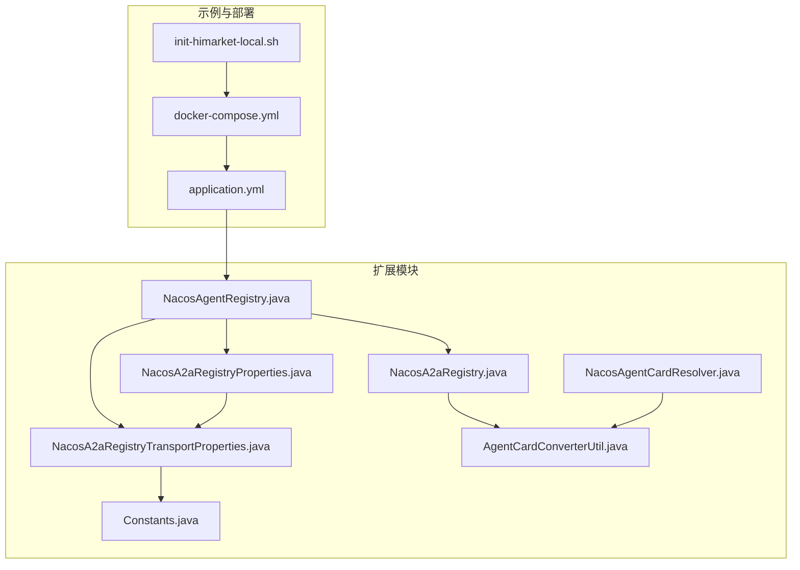
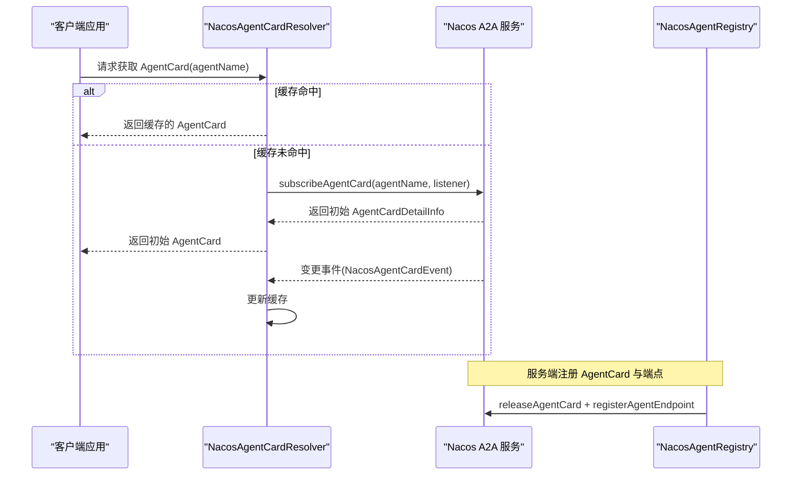
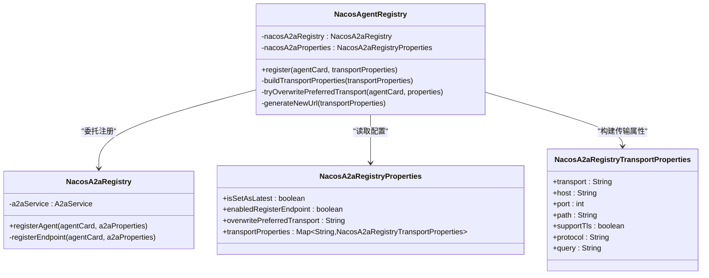
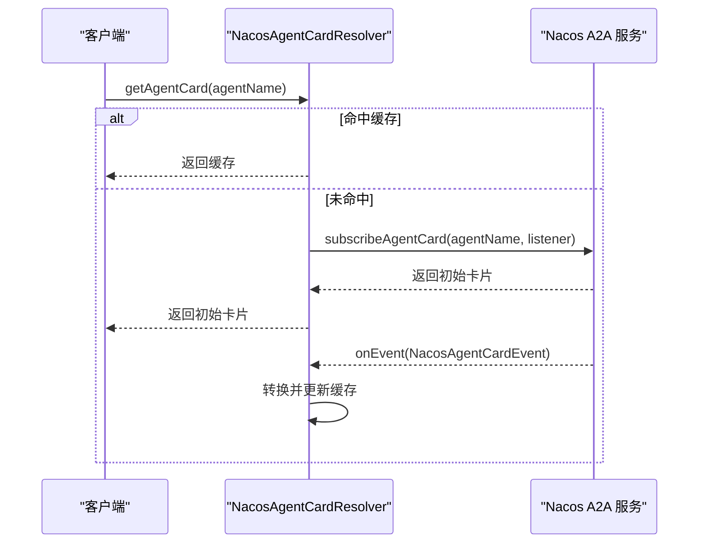
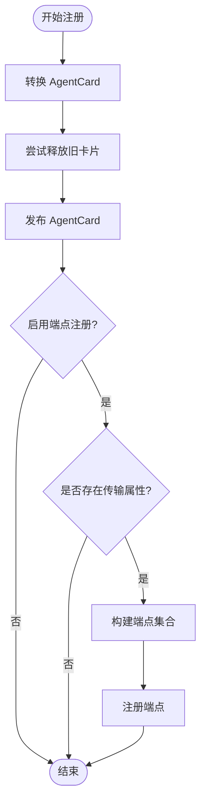
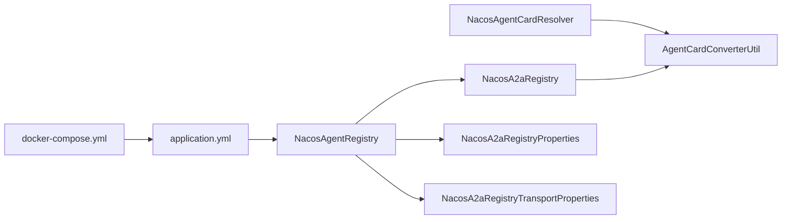

# A2A 服务发现

<cite>
**本文引用的文件**
- [NacosAgentRegistry.java](file://agentscope-extensions/agentscope-extensions-nacos/agentscope-extensions-nacos-a2a/src/main/java/io/agentscope/core/nacos/a2a/registry/NacosAgentRegistry.java)
- [NacosA2aRegistry.java](file://agentscope-extensions/agentscope-extensions-nacos/agentscope-extensions-nacos-a2a/src/main/java/io/agentscope/core/nacos/a2a/registry/NacosA2aRegistry.java)
- [NacosAgentCardResolver.java](file://agentscope-extensions/agentscope-extensions-nacos/agentscope-extensions-nacos-a2a/src/main/java/io/agentscope/core/nacos/a2a/discovery/NacosAgentCardResolver.java)
- [Constants.java](file://agentscope-extensions/agentscope-extensions-nacos/agentscope-extensions-nacos-a2a/src/main/java/io/agentscope/core/nacos/a2a/registry/constants/Constants.java)
- [NacosA2aRegistryProperties.java](file://agentscope-extensions/agentscope-extensions-nacos/agentscope-extensions-nacos-a2a/src/main/java/io/agentscope/core/nacos/a2a/registry/NacosA2aRegistryProperties.java)
- [NacosA2aRegistryTransportProperties.java](file://agentscope-extensions/agentscope-extensions-nacos/agentscope-extensions-nacos-a2a/src/main/java/io/agentscope/core/nacos/a2a/registry/NacosA2aRegistryTransportProperties.java)
- [AgentCardConverterUtil.java](file://agentscope-extensions/agentscope-extensions-nacos/agentscope-extensions-nacos-a2a/src/main/java/io/agentscope/core/nacos/a2a/utils/AgentCardConverterUtil.java)
- [application.yml](file://agentscope-examples/a2a/src/main/resources/application.yml)
- [docker-compose.yml](file://agentscope-examples/boba-tea-shop/docker-compose.yml)
- [init-himarket-local.sh](file://agentscope-examples/boba-tea-shop/himarket-image/init-himarket-local.sh)
</cite>

## 目录
1. [简介](#简介)
2. [项目结构](#项目结构)
3. [核心组件](#核心组件)
4. [架构总览](#架构总览)
5. [组件详解](#组件详解)
6. [依赖关系分析](#依赖关系分析)
7. [性能与可用性](#性能与可用性)
8. [故障排查指南](#故障排查指南)
9. [结论](#结论)
10. [附录：配置参数与最佳实践](#附录配置参数与最佳实践)

## 简介
本文件面向使用 Nacos 实现 A2A（Agent-to-Agent）服务发现的开发者，系统化阐述以下内容：
- 智能体实例的动态发现机制：注册表管理、实例健康检查与故障转移策略
- NacosAgentDiscovery 的实现原理：服务注册、心跳检测与实例列表维护
- NacosAgentRegistry 的工作流程：智能体实例的注册、注销与状态同步
- 完整配置参数说明：Nacos 服务器地址、命名空间、鉴权与超时等
- 集群模式下的负载均衡与故障恢复机制
- 故障排查指南与常见问题解决方案

## 项目结构
围绕 Nacos A2A 发现能力，核心代码位于 agentscope-extensions-nacos-a2a 模块，示例与部署参考 agentscope-examples。

**图表来源**
- [NacosAgentRegistry.java:1-310](file://agentscope-extensions/agentscope-extensions-nacos/agentscope-extensions-nacos-a2a/src/main/java/io/agentscope/core/nacos/a2a/registry/NacosAgentRegistry.java#L1-L310)
- [NacosA2aRegistry.java:1-150](file://agentscope-extensions/agentscope-extensions-nacos/agentscope-extensions-nacos-a2a/src/main/java/io/agentscope/core/nacos/a2a/registry/NacosA2aRegistry.java#L1-L150)
- [NacosAgentCardResolver.java:1-123](file://agentscope-extensions/agentscope-extensions-nacos/agentscope-extensions-nacos-a2a/src/main/java/io/agentscope/core/nacos/a2a/discovery/NacosAgentCardResolver.java#L1-L123)
- [Constants.java:1-88](file://agentscope-extensions/agentscope-extensions-nacos/agentscope-extensions-nacos-a2a/src/main/java/io/agentscope/core/nacos/a2a/registry/constants/Constants.java#L1-L88)
- [NacosA2aRegistryProperties.java:1-141](file://agentscope-extensions/agentscope-extensions-nacos/agentscope-extensions-nacos-a2a/src/main/java/io/agentscope/core/nacos/a2a/registry/NacosA2aRegistryProperties.java#L1-L141)
- [NacosA2aRegistryTransportProperties.java:1-175](file://agentscope-extensions/agentscope-extensions-nacos/agentscope-extensions-nacos-a2a/src/main/java/io/agentscope/core/nacos/a2a/registry/NacosA2aRegistryTransportProperties.java#L1-L175)
- [AgentCardConverterUtil.java:1-244](file://agentscope-extensions/agentscope-extensions-nacos/agentscope-extensions-nacos-a2a/src/main/java/io/agentscope/core/nacos/a2a/utils/AgentCardConverterUtil.java#L1-L244)
- [application.yml:1-65](file://agentscope-examples/a2a/src/main/resources/application.yml#L1-L65)
- [docker-compose.yml:50-77](file://agentscope-examples/boba-tea-shop/docker-compose.yml#L50-L77)
- [init-himarket-local.sh:287-344](file://agentscope-examples/boba-tea-shop/himarket-image/init-himarket-local.sh#L287-L344)

**章节来源**
- [NacosAgentRegistry.java:1-310](file://agentscope-extensions/agentscope-extensions-nacos/agentscope-extensions-nacos-a2a/src/main/java/io/agentscope/core/nacos/a2a/registry/NacosAgentRegistry.java#L1-L310)
- [NacosA2aRegistry.java:1-150](file://agentscope-extensions/agentscope-extensions-nacos/agentscope-extensions-nacos-a2a/src/main/java/io/agentscope/core/nacos/a2a/registry/NacosA2aRegistry.java#L1-L150)
- [NacosAgentCardResolver.java:1-123](file://agentscope-extensions/agentscope-extensions-nacos/agentscope-extensions-nacos-a2a/src/main/java/io/agentscope/core/nacos/a2a/discovery/NacosAgentCardResolver.java#L1-L123)
- [application.yml:1-65](file://agentscope-examples/a2a/src/main/resources/application.yml#L1-L65)
- [docker-compose.yml:50-77](file://agentscope-examples/boba-tea-shop/docker-compose.yml#L50-L77)
- [init-himarket-local.sh:287-344](file://agentscope-examples/boba-tea-shop/himarket-image/init-himarket-local.sh#L287-L344)

## 核心组件
- NacosAgentRegistry：面向 AgentRegistry 接口的 Nacos 实现，负责将 AgentCard 与端点发布到 Nacos，并支持从环境变量覆盖首选传输协议与地址。
- NacosA2aRegistry：封装对 Nacos A2A 服务的调用，完成 AgentCard 的发布与端点注册；支持幂等检查与版本控制。
- NacosAgentCardResolver：基于 Nacos A2A 订阅能力，按需获取并缓存远端 AgentCard，同时通过监听器保持缓存更新。
- 属性与常量：NacosA2aRegistryProperties、NacosA2aRegistryTransportProperties、Constants 提供配置项、传输属性与环境变量前缀等。
- 转换工具：AgentCardConverterUtil 在 A2A 规范与 Nacos 内部模型之间进行双向转换。

**章节来源**
- [NacosAgentRegistry.java:39-310](file://agentscope-extensions/agentscope-extensions-nacos/agentscope-extensions-nacos-a2a/src/main/java/io/agentscope/core/nacos/a2a/registry/NacosAgentRegistry.java#L39-L310)
- [NacosA2aRegistry.java:34-150](file://agentscope-extensions/agentscope-extensions-nacos/agentscope-extensions-nacos-a2a/src/main/java/io/agentscope/core/nacos/a2a/registry/NacosA2aRegistry.java#L34-L150)
- [NacosAgentCardResolver.java:34-123](file://agentscope-extensions/agentscope-extensions-nacos/agentscope-extensions-nacos-a2a/src/main/java/io/agentscope/core/nacos/a2a/discovery/NacosAgentCardResolver.java#L34-L123)
- [NacosA2aRegistryProperties.java:22-141](file://agentscope-extensions/agentscope-extensions-nacos/agentscope-extensions-nacos-a2a/src/main/java/io/agentscope/core/nacos/a2a/registry/NacosA2aRegistryProperties.java#L22-L141)
- [NacosA2aRegistryTransportProperties.java:22-175](file://agentscope-extensions/agentscope-extensions-nacos/agentscope-extensions-nacos-a2a/src/main/java/io/agentscope/core/nacos/a2a/registry/NacosA2aRegistryTransportProperties.java#L22-L175)
- [Constants.java:19-88](file://agentscope-extensions/agentscope-extensions-nacos/agentscope-extensions-nacos-a2a/src/main/java/io/agentscope/core/nacos/a2a/registry/constants/Constants.java#L19-L88)
- [AgentCardConverterUtil.java:32-244](file://agentscope-extensions/agentscope-extensions-nacos/agentscope-extensions-nacos-a2a/src/main/java/io/agentscope/core/nacos/a2a/utils/AgentCardConverterUtil.java#L32-L244)

## 架构总览
下图展示 A2A 服务发现的整体交互：客户端通过 NacosAgentCardResolver 订阅远端 AgentCard，服务端通过 NacosAgentRegistry 将本地 AgentCard 与端点发布到 Nacos。

**图表来源**
- [NacosAgentCardResolver.java:90-121](file://agentscope-extensions/agentscope-extensions-nacos/agentscope-extensions-nacos-a2a/src/main/java/io/agentscope/core/nacos/a2a/discovery/NacosAgentCardResolver.java#L90-L121)
- [NacosA2aRegistry.java:68-134](file://agentscope-extensions/agentscope-extensions-nacos/agentscope-extensions-nacos-a2a/src/main/java/io/agentscope/core/nacos/a2a/registry/NacosA2aRegistry.java#L68-L134)

## 组件详解

### NacosAgentRegistry：注册与端点管理
- 注册入口：接收 AgentCard 与传输属性集合，构建目标属性集合并尝试覆盖首选传输，最终委托 NacosA2aRegistry 完成发布。
- 传输属性构建：从部署传入的 TransportProperties 解析出 NacosA2aRegistryTransportProperties；同时从环境变量解析同名传输属性并进行覆盖合并。
- 首选传输覆盖：当配置了 overwritePreferredTransport 且对应传输存在时，生成新的 URL 并替换 AgentCard 的 preferredTransport 与 url。
- 生成 URL：根据协议、主机、端口、路径、查询与 TLS 支持生成最终访问地址；若默认协议且支持 TLS，则自动切换为 HTTPS。
- 客户端构建：支持通过 AiService 或 Nacos 服务端属性创建 Builder，便于在不同场景复用或独立初始化。

**图表来源**
- [NacosAgentRegistry.java:42-308](file://agentscope-extensions/agentscope-extensions-nacos/agentscope-extensions-nacos-a2a/src/main/java/io/agentscope/core/nacos/a2a/registry/NacosAgentRegistry.java#L42-L308)
- [NacosA2aRegistry.java:37-149](file://agentscope-extensions/agentscope-extensions-nacos/agentscope-extensions-nacos-a2a/src/main/java/io/agentscope/core/nacos/a2a/registry/NacosA2aRegistry.java#L37-L149)
- [NacosA2aRegistryProperties.java:34-141](file://agentscope-extensions/agentscope-extensions-nacos/agentscope-extensions-nacos-a2a/src/main/java/io/agentscope/core/nacos/a2a/registry/NacosA2aRegistryProperties.java#L34-L141)
- [NacosA2aRegistryTransportProperties.java:35-175](file://agentscope-extensions/agentscope-extensions-nacos/agentscope-extensions-nacos-a2a/src/main/java/io/agentscope/core/nacos/a2a/registry/NacosA2aRegistryTransportProperties.java#L35-L175)

**章节来源**
- [NacosAgentRegistry.java:63-242](file://agentscope-extensions/agentscope-extensions-nacos/agentscope-extensions-nacos-a2a/src/main/java/io/agentscope/core/nacos/a2a/registry/NacosAgentRegistry.java#L63-L242)
- [NacosA2aRegistry.java:68-134](file://agentscope-extensions/agentscope-extensions-nacos/agentscope-extensions-nacos-a2a/src/main/java/io/agentscope/core/nacos/a2a/registry/NacosA2aRegistry.java#L68-L134)

### NacosAgentCardResolver：订阅与缓存
- 缓存策略：以 agentName 为键缓存 AgentCard；首次缺失时触发订阅并等待回调更新缓存。
- 订阅与监听：通过 AiService.subscribeAgentCard 订阅指定 agentName 的卡片变更事件，监听器收到事件后转换并写入缓存。
- 错误处理：订阅异常包装为运行时异常，便于上层统一处理。

**图表来源**
- [NacosAgentCardResolver.java:90-121](file://agentscope-extensions/agentscope-extensions-nacos/agentscope-extensions-nacos-a2a/src/main/java/io/agentscope/core/nacos/a2a/discovery/NacosAgentCardResolver.java#L90-L121)

**章节来源**
- [NacosAgentCardResolver.java:90-121](file://agentscope-extensions/agentscope-extensions-nacos/agentscope-extensions-nacos-a2a/src/main/java/io/agentscope/core/nacos/a2a/discovery/NacosAgentCardResolver.java#L90-L121)

### NacosA2aRegistry：注册与端点发布
- 幂等发布：先尝试释放已存在的 AgentCard，再发布新卡片，避免重复注册导致的冲突。
- 端点注册：根据配置决定是否注册端点；支持单端点或多端点批量注册；端点信息来自 NacosA2aRegistryTransportProperties。
- 异常处理：捕获 NacosException 并转换为运行时异常，便于上层感知错误码与消息。

**图表来源**
- [NacosA2aRegistry.java:68-134](file://agentscope-extensions/agentscope-extensions-nacos/agentscope-extensions-nacos-a2a/src/main/java/io/agentscope/core/nacos/a2a/registry/NacosA2aRegistry.java#L68-L134)

**章节来源**
- [NacosA2aRegistry.java:68-134](file://agentscope-extensions/agentscope-extensions-nacos/agentscope-extensions-nacos-a2a/src/main/java/io/agentscope/core/nacos/a2a/registry/NacosA2aRegistry.java#L68-L134)

### 配置与环境变量
- 环境变量前缀：NACOS_A2A_AGENT_
- 传输属性枚举：HOST、PORT、PATH、PROTOCOL、QUERY、SUPPORT_TLS
- 示例：NACOS_A2A_AGENT_JSONRPC_HOST、NACOS_A2A_AGENT_GRPC_PORT 等

**章节来源**
- [Constants.java:34-86](file://agentscope-extensions/agentscope-extensions-nacos/agentscope-extensions-nacos-a2a/src/main/java/io/agentscope/core/nacos/a2a/registry/constants/Constants.java#L34-L86)

## 依赖关系分析
- NacosAgentRegistry 依赖 NacosA2aRegistry、NacosA2aRegistryProperties、NacosA2aRegistryTransportProperties 与 AgentCardConverterUtil。
- NacosAgentCardResolver 依赖 AiService 与 AgentCardConverterUtil。
- NacosA2aRegistry 依赖 A2aService 与 AgentCardConverterUtil。
- 配置来源：示例 application.yml 与 docker-compose.yml 中的 Nacos 地址、认证与端口映射。

**图表来源**
- [NacosAgentRegistry.java:48-56](file://agentscope-extensions/agentscope-extensions-nacos/agentscope-extensions-nacos-a2a/src/main/java/io/agentscope/core/nacos/a2a/registry/NacosAgentRegistry.java#L48-L56)
- [NacosA2aRegistry.java:49-60](file://agentscope-extensions/agentscope-extensions-nacos/agentscope-extensions-nacos-a2a/src/main/java/io/agentscope/core/nacos/a2a/registry/NacosA2aRegistry.java#L49-L60)
- [NacosAgentCardResolver.java:75-88](file://agentscope-extensions/agentscope-extensions-nacos/agentscope-extensions-nacos-a2a/src/main/java/io/agentscope/core/nacos/a2a/discovery/NacosAgentCardResolver.java#L75-L88)
- [application.yml:60-65](file://agentscope-examples/a2a/src/main/resources/application.yml#L60-L65)
- [docker-compose.yml:50-77](file://agentscope-examples/boba-tea-shop/docker-compose.yml#L50-L77)

**章节来源**
- [NacosAgentRegistry.java:48-56](file://agentscope-extensions/agentscope-extensions-nacos/agentscope-extensions-nacos-a2a/src/main/java/io/agentscope/core/nacos/a2a/registry/NacosAgentRegistry.java#L48-L56)
- [NacosA2aRegistry.java:49-60](file://agentscope-extensions/agentscope-extensions-nacos/agentscope-extensions-nacos-a2a/src/main/java/io/agentscope/core/nacos/a2a/registry/NacosA2aRegistry.java#L49-L60)
- [NacosAgentCardResolver.java:75-88](file://agentscope-extensions/agentscope-extensions-nacos/agentscope-extensions-nacos-a2a/src/main/java/io/agentscope/core/nacos/a2a/discovery/NacosAgentCardResolver.java#L75-L88)
- [application.yml:60-65](file://agentscope-examples/a2a/src/main/resources/application.yml#L60-L65)
- [docker-compose.yml:50-77](file://agentscope-examples/boba-tea-shop/docker-compose.yml#L50-L77)

## 性能与可用性
- 缓存与增量更新：NacosAgentCardResolver 使用并发缓存与监听器，减少重复订阅与网络开销，提升响应速度。
- 批量端点注册：NacosA2aRegistry 支持多端点一次性注册，降低多次 RPC 调用带来的延迟。
- 协议与 TLS 自动选择：根据配置与 TLS 支持自动选择 http/https，避免手动拼接错误导致的重试。
- 健康检查与可用性：示例 docker-compose 对 Nacos 进行健康检查，确保服务可用后再启动业务服务，提高整体可用性。

**章节来源**
- [NacosAgentCardResolver.java:84-99](file://agentscope-extensions/agentscope-extensions-nacos/agentscope-extensions-nacos-a2a/src/main/java/io/agentscope/core/nacos/a2a/discovery/NacosAgentCardResolver.java#L84-L99)
- [NacosA2aRegistry.java:118-133](file://agentscope-extensions/agentscope-extensions-nacos/agentscope-extensions-nacos-a2a/src/main/java/io/agentscope/core/nacos/a2a/registry/NacosA2aRegistry.java#L118-L133)
- [docker-compose.yml:66-71](file://agentscope-examples/boba-tea-shop/docker-compose.yml#L66-L71)

## 故障排查指南
- 订阅失败或无返回：确认 Nacos 地址与鉴权配置正确；检查 NacosAgentCardResolver 的异常包装与日志输出。
- 端点未注册：检查 NacosA2aRegistryProperties 的 enabledRegisterEndpoint 与 transportProperties 是否为空；确认传输属性完整。
- 首选传输未覆盖：确认 overwritePreferredTransport 与环境变量前缀一致；核对环境变量是否被正确解析。
- 协议与 TLS 不匹配：确认 protocol 与 supportTls 的组合逻辑；必要时显式设置 protocol。
- Nacos 启动不可用：查看 docker-compose 健康检查与日志；确认端口映射与网络连通性。

**章节来源**
- [NacosAgentCardResolver.java:108-110](file://agentscope-extensions/agentscope-extensions-nacos/agentscope-extensions-nacos-a2a/src/main/java/io/agentscope/core/nacos/a2a/discovery/NacosAgentCardResolver.java#L108-L110)
- [NacosA2aRegistry.java:109-116](file://agentscope-extensions/agentscope-extensions-nacos/agentscope-extensions-nacos-a2a/src/main/java/io/agentscope/core/nacos/a2a/registry/NacosA2aRegistry.java#L109-L116)
- [NacosAgentRegistry.java:170-192](file://agentscope-extensions/agentscope-extensions-nacos/agentscope-extensions-nacos-a2a/src/main/java/io/agentscope/core/nacos/a2a/registry/NacosAgentRegistry.java#L170-L192)
- [docker-compose.yml:66-71](file://agentscope-examples/boba-tea-shop/docker-compose.yml#L66-L71)

## 结论
Nacos A2A 服务发现通过“注册-订阅-缓存-监听”的闭环，实现了智能体实例的动态发现与状态同步。NacosAgentRegistry 负责将本地 AgentCard 与端点发布到 Nacos，NacosAgentCardResolver 则负责按需订阅与缓存更新。结合合理的配置与环境变量覆盖策略，可在集群模式下实现高可用与可扩展的服务发现。

## 附录：配置参数与最佳实践

### 配置参数说明
- Nacos 服务器地址与鉴权
  - server-addr：Nacos 服务地址，默认 localhost:8848
  - username/password：用户名与密码（示例）
- A2A 与 Nacos 开关
  - enabled：是否启用 Nacos A2A 功能
- 端口与健康检查
  - 示例中暴露 8848、9848、8080 端口，健康检查使用 nc 检测 8848

**章节来源**
- [application.yml:60-65](file://agentscope-examples/a2a/src/main/resources/application.yml#L60-L65)
- [docker-compose.yml:50-77](file://agentscope-examples/boba-tea-shop/docker-compose.yml#L50-L77)

### 最佳实践
- 使用环境变量覆盖传输属性：通过 NACOS_A2A_AGENT_{TRANSPORT}_{ATTR} 精细控制各传输的 host/port/path/protocol/query/TLS。
- 启用端点注册：默认开启端点注册，确保客户端可直接连接到可用实例。
- 版本控制：合理设置“设为最新版本”开关，避免历史版本干扰。
- 缓存与监听：利用内置缓存与监听器，减少重复订阅与网络压力。
- 健康检查：在容器编排中加入健康检查，保证 Nacos 可用后再启动业务服务。

### 集群模式与故障恢复
- 多端点注册：通过多传输属性注册多个端点，实现多实例负载分摊。
- 监听与缓存：客户端通过监听器实时更新缓存，发生实例上下线时快速收敛。
- 端口与网络：确保 Nacos 与业务服务在同一网络，端口映射正确，健康检查稳定。

**章节来源**
- [NacosA2aRegistry.java:118-133](file://agentscope-extensions/agentscope-extensions-nacos/agentscope-extensions-nacos-a2a/src/main/java/io/agentscope/core/nacos/a2a/registry/NacosA2aRegistry.java#L118-L133)
- [NacosAgentCardResolver.java:90-121](file://agentscope-extensions/agentscope-extensions-nacos/agentscope-extensions-nacos-a2a/src/main/java/io/agentscope/core/nacos/a2a/discovery/NacosAgentCardResolver.java#L90-L121)
- [docker-compose.yml:66-71](file://agentscope-examples/boba-tea-shop/docker-compose.yml#L66-L71)